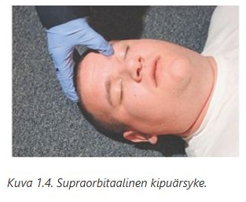
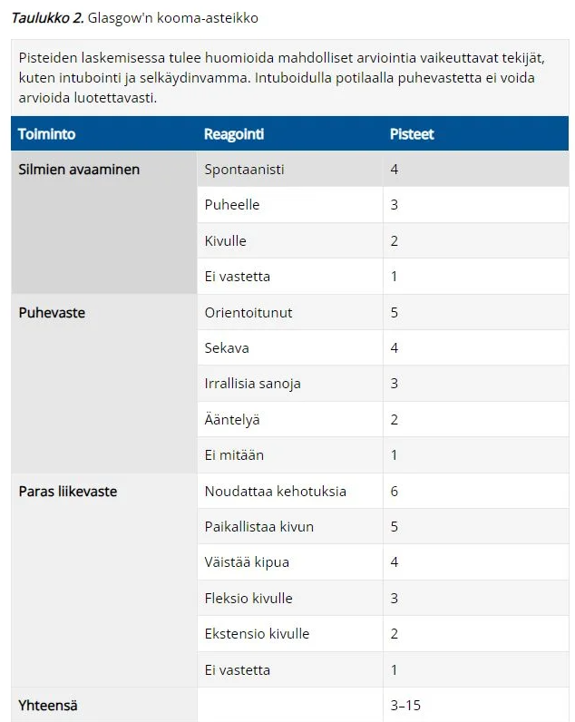
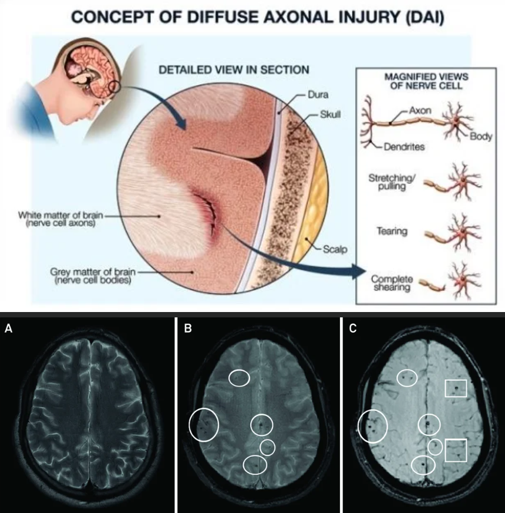
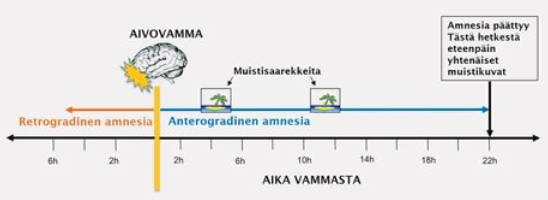
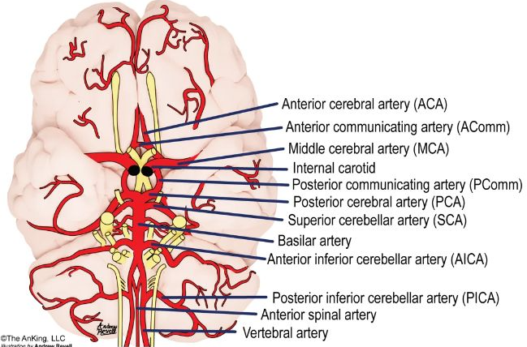
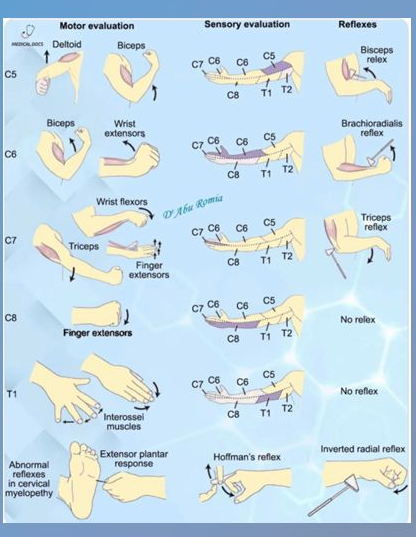
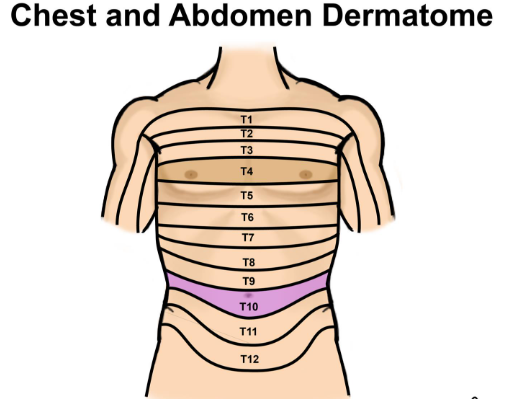

# NKIR

## Tentti 

Suoritetaan kotona moodlessa. Wikissä on vain yksi aikaisempi tentti tarkasteltavissa. Monivalintatentti (valitse yksi -tyylisiä)

### Mitkä seuraavista ovat aivovammaa pahentavia tekijöitä

- a. matala aivojen läpivirtauspaine CPP (MAP-ICP)
- b. korkea ICP > 20–25 mmHg
- c. kuume
- d. kaikki edellä mainitut voivat pahentaa aivovammaa

  <button class="solution-button"
          data-label="Vastaus"
          data-hide-label="Piilota vastaus">
    Vastaus
  </button>
  

d

---

a: Aivojen perfuusipaine riippuu keskimääräisestä valtimopaineesta (MAP) ja kallonsisäisestä paineesta (ICP). CPP = MAP - ICP. Jos CPP laskee liikaa (yleensä tavoite on > 60mmHg), aivot kärsivät hapenpuutteesta, mikä laajentaa vauriota.

b: Kohonnut kallonsisäinen paine puristaa aivokudosta ja verisuonia. Se voi johtaa aivojen herniaatioon ja heikentää aivojen verenkiertoa (laskemalla perfuusipainetta).

c: Kuume nostaa aivojen metabolista tarvetta eli ne tarvitsevat enemmän happea ja glukoosia. Vaurioituneet aivot eivät pysty vastaamaan tähän tarpeeseen, mikä johtaa solutuhoon. Lisäksi kuume voimistaa tulehdusreaktiota ja aivoturvotusta.

Aivovammassa sekundaarisia aivovaurioita pahentavia tekijöitä ovat mm. 

<li>hypotensio</li>
<li>hypoksia</li>
<li>korkea kallonsisäinen paine (ICP >20 mmHg)</li>
<li>hypertermia</li>
<li>hyperventilaatio</li>
<li>kouristukset ja epileptiset purkaukset</li>
<li>anemia</li>
<li>koagulopatia</li>
<li>elektrolyyttihäiriöt</li>
  

### Aivovamman hoidossa kallonsisäisen paineen alentamiseen voidaan käyttää

- a. mannitolia
- b. isotonista keittosuolaa
- c. vasokonstriktoreita (esim. noradrenaliini)
- d. kaikkia edellä mainittuja

  <button class="solution-button"
          data-label="Vastaus"
          data-hide-label="Piilota vastaus">
    Vastaus
  </button>
  

a

---

Aivovamman hoidossa kallonsisäisen paineen alentamiseen käytetään ensisijaisina lääkevaihtoehtoina mannitolia (osmoottinen diureetti) tai hypertonista keittosuolaa. Ne "vetävät" nestettä turvonneesta aivokudoksesta verenkiertoon; hypertoninen keittosuola saattaa olla tehokkaampi (auttaa myös verenpaineen nostamisessa) ja siihen liittyy pienempi kuolleisuus

b: Käytetään hypertonista keittosuolaa; isotoninen ei laske ICP:tä osmoottisesti

c: Vasokonstriktoreita voidaan käyttää MAP:n kohottamiseen ja siten perfuusiopaineen parantamiseen, mutta ne eivät ole ensisijaisia ICP:n laskemisessa (voivat kuitenkin joskus aivojen autoregulaation säilyessä paradoksaalisesti laskea ICP:tä, koska riittävä CPP vähentää kompensatorista aivoverisuonten vasodilataatiota). 
  

### Mikä seuraavista alentaa kallonsisäistä painetta?

- a. Trendelenburgin asentoa
- b. hypotoninen keittosuola infuusio
- c. ylävartalon kohoasento (pääpuolen nosto 30°)
- d. hallittu hypoventilaatio
- e. kaikki edellä mainitut alentavat kallonsisäistä painetta

  <button class="solution-button"
          data-label="Vastaus"
          data-hide-label="Piilota vastaus">
    Vastaus
  </button>
  

c

---

a: Trendelenburgin asento = pää alaspäin. Tämä päinvastoin nostaa kallonsisäistä painetta.

b: Hypotoniset nesteet (joissa on vähemmän suolaa kuin veressä) siirtyvät osmoosin vaikutuksesta verisuonista aivokudokseen, mikä voi pahentaa aivoturvotusta ja nostaa painetta. 

d: Hypoventilaatio  johtaa hiilidioksidin kertymiseen vereen. Korkea CO2-pitoisuus laajentaa aivoverisuonia, mikä nostaa painetta
  

### Akuutti epiduraalihematooma. Valitse oikea vaihtoehto:

- a. hematooma sijaitsee kallon luun ja kovan aivokalvon välissä ja on usein lähtöisin duuran valtimosta
- b. hematooma sijaitsee kallon luun ja kovan aivokalvon välissä ja on usein lähtöisin siltalaskimon repeämästä
- c. hematooma sijaitsee kovan aikovalvon ja lukinkalvon välisessä tilassa ja on usein lähtöisin kortikaalisen valtimon repeämästä
- d. mikään edellä esitetyistä vaihtoehdoista ei ole oikein

  <button class="solution-button"
          data-label="Vastaus"
          data-hide-label="Piilota vastaus">
    Vastaus
  </button>
  

a

---

Epiduraalihematooma (EDH) syntyy nimensä mukaisesti kovan aivokalvon (dura mater) päälle. Tyypillisin syy on ohimoluun murtuma, joka repäisee arteria meningea median (keskimmäinen aivokalvovaltimo). Koska vuoto on valtimoperäinen, voi se olla nopeasti etenevä ja sen takia onkin äkillisesti hengenvaarallinen. Veri kääntää duuran irti luusta paineella, mikä näkyy kuvissa tyypillisenä linssimäisenä (bikonveksina) muotona.

b: Siltalaskimoiden repeämä aiheuttaa tyypillisesti subduraalihematooman (SDH). Se sijaitsee duran alla.

c: Hypotoniset nesteet (joissa on vähemmän suolaa kuin veressä) siirtyvät osmoosin vaikutuksesta verisuonista aivokudokseen, mikä voi pahentaa aivoturvotusta ja nostaa painetta. 

d: Kovan aivokalvon ja lukinkalvon (arachnoidea) välissä sijaitseva vuoto on subduraalinen.

  

### Akuutti epiduraalihematooma:

- a. on harvinaisempi lapsilla kuin vanhuksilla
- b. sijaitsee yleensä takaraivolla
- c. on iäkkäillä harvinainen, koska duura on tiukasti kiinni kallonluussa
- d. alle 20-vuotiailla epiduraalihematooma muodostaa noin 10% kaikista kallonsisäisistä traumaattisista hematoomista

  <button class="solution-button"
          data-label="Vastaus"
          data-hide-label="Piilota vastaus">
    Vastaus
  </button>
  

c

---

Ikääntymisen myötä kova aivokalvo (dura mater) kiinnittyy entistä tiukemmin kallon sisäpintaan. Tämä tekee epiduraalitilan muodostumisesta vaikeampaa, vaikka valtimovaurio tapahtuisi. Siksi epiduraalihematooma on tyypillisesti nuorten ja nuorten aikuisten vamma.

a: Epiduraalihematooma on nimenomaan yleisempi lapsilla, nuorilla ja nuorilla aikuisilla kuin vanhuksilla.

b: Valtaosa (noin 70–80 %) epiduraalihematoomista sijaitsee ohimo- tai päälakilohkon alueella (temporoparietaalisesti), koska siellä sijaitsee herkästi vaurioituva arteria meningea media.

d: Lapsiaineistossa epiduraalihematoomaa on kuvattu yleisimmäksi kallonsisäiseksi vuototyypiksi; tarkat luvut vaihtelevat aineistoittain

  

### Akuutti epiduraalihematooma:

- a. on yleensä laskimoperäinen vuoto
- b. on yleensä valtimoperäinen vuoto
- c. on harvinainen lapsilla ja nuorilla
- d. on tavallinen antikoagulaatiolääkitystä käyttävillä vanhuksilla

  <button class="solution-button"
          data-label="Vastaus"
          data-hide-label="Piilota vastaus">
    Vastaus
  </button>
  

b

---

Tyypillisin on temporaalialueen vamma ja arteria meningea median (keskimmäinen aivokalvovaltimo) vuoto

a: Subduraalihematooma (SDH) on yleensä laskimoperäinen

c: On tyypillisin lapsilla ja nuorilla

d: Epätyypillisempi vuoto vanhuksilla; SDH on tässä potilasryhmässä yleisin ja se voi syntyä vähäisestäkin kolhusta aivojen atrofian (kutistumisen) vuoksi
  

### Vastaanotollesi tuodaan 6-vuotias lapsi, joka on tuntia aikaisemmin pudonnut päiväkodissa keinusta ja lyönyt vasemman korvan yläpuoleisen kallonalueen kiveen. Toteat päänahan alla merkittävää turvotusta. Seurannassa tajunnantaso lähtee nopeasti heikkenemään ja vasen mustuainen laajenee. Todennäköisin kyseessä on:

- a. akuutti laajeneva epiduraalihematooma ja siihen liittyvä tentoriumherniaatio
- b. akuutti subduraalihematooma ja kallonmurtuma sekä tentoriumherniaatio
- c. akuutti epiduraalihematooma ja falx herniaation aiheuttama 5. aivohermon pareesi
- d. kallonmurtuma ja todennäköinen aivoruhjeen provosoima epileptinen kohtaus ja siihen liittyvä tentoriumherniaatio

  <button class="solution-button"
          data-label="Vastaus"
          data-hide-label="Piilota vastaus">
    Vastaus
  </button>
  

a

---

Lapsi on lyönyt päänsä vasemman korvan yläpuolelle (ohimoalue eli temporaalialue). Tämä on anatomisesti klassinen paikka arteria meningea median vauriolle, joka on tyypillisin syy epiduraalihematoomaan. Epiduraalivuoto voi valtimovuotona laajentua nopeasti ja hematooma painaa aivokudosta kasaan. Tämä työntyminen voi edetä siihen, että aivokudosta (yleensä mediaalinen ohimolohko (uncus)) työntyy tentoriumin aukosta alaspäin (transtentoriaalinen). Voi kompressoida ylempää aivorunkoa ja väliaivoja -> usein tajuttomuus ja aivorunkolöydökset (kuten mustuaisen laajentuminen CN III -pareesin takia).

b: Subduraalihematooma on yleensä laskimoperäinen ja hitaampi, eikä tyypillisesti liity paikalliseen ohimoluun iskuun yhtä klassisesti kuin epiduraalivuoto.

c: Falx-herniaatio (aivopuoliskojen välisen sirpin ali työntyminen) ei aiheuta mustuaisen laajenemista. Lisäksi mustuaisen reaktiosta vastaa 3. aivohermo (n. oculomotorius), ei 5. aivohermo (n. trigeminus).

d: Epileptinen kohtaus voi seurata aivoruhjetta, mutta se ei selitä etenevää mustuaisen laajenemista eikä tentoriumherniaatiota

  

### Aivovammaan liittyy kallonsisäinen verenvuoto ja olet siirtämässä potilasta neurokirurgiseen yksikköön leikkaushoitoa varten ambulanssilla. Potilaalla on käytössä Marevan-hoito, INR on 2.3. Valitse seuraavista oikea vaihtoehto ennen siirtoa:

- a. annan potilaalle k-vitamiinia (konakion) 10mg laskimonsisäisesti
- b. annan potilaalle protamiinisulfaattia ja jääplasmaa
- c. annan potilaalle luovutettuja trombosyyttejä infuusiona
- d. annan potilaalle hyytymistekijäkonsentraattia sekä k-vitamiinia

  <button class="solution-button"
          data-label="Vastaus"
          data-hide-label="Piilota vastaus">
    Vastaus
  </button>
  

d

---

Hyytymistekijäkonsentraatti (PCC) on ensisijainen hoito ja se on varfariinin nopea kumoaja (kumoaa varfariinin n. 10-30 minuutissa). K-vitamiini tarvitaan ylläpitämään hyytymistekijöiden synteesiä maksassa sen jälkeen, kun lyhytvaikutteisemman hyytymistekijäkonsentraatin teho alkaa hiipua. Vaikutus alkaa vasta muutaman tunnin kuluttua, joten se ei yksin riitä akuutissa hätätilanteessa. Tarvittaessa voidaan käyttää myös jääplasmaa, mutta sen käyttö on vähentynyt.

a: Pelkkä K-vitamiini on aivan liian hidas (vaikutus vasta 4–6(-12) tunnin päästä)

b: Protamiinisulfaatti on hepariinin vastalääke, ei varfariinin

c: Trombosyytit eivät auta varfariinin aiheuttamaan hyytymistekijävajeeseen
  

### Mitkä seuraavista elintoimintojen häiriöistä on ensisijaisesti korjattava aivovamman ensihoidossa?

- a. hypertonia ja hypokapnia
- b. hypotensio ja hypoksia
- c. koagulopatia ja hypertermia
- d. hyponatremia ja hypoglykemia

  <button class="solution-button"
          data-label="Vastaus"
          data-hide-label="Piilota vastaus">
    Vastaus
  </button>
  

b

---

ABCDE-protokollan mukaan nämä tulee ensimmäisenä vastausvaihtoehdoista vastaan. Vaurioitunut aivokudos on äärimmäisen herkkä hapenpuutteelle ja hypotensio johtaa aivojen läpivirtauspaineen (CPP) romahdukseen.

a: Korkea verenpaine (hypertonia) on usein elimistön suojareaktio (Cushingin refleksi) turvaamaan aivojen verenvirtausta paineen noustessa, eikä sitä tule yleensä laskea aggressiivisesti ensihoidossa. Hypokapnia kyllä supistaa verisuonia ja voi jopa pahentaa iskemiaa, jos se on hallitsematonta; tämän takia hyperventilaatio ei ole hyvästä.

c: Nämä ovat tärkeitä hoitaa, mutta ei tärkeämpiä kuin hypotensio/hypoksia

d: Nämä ovat tärkeitä korjattavia metabolisia häiriöitä ja varsinkin hypoglykemia kuuluu ABCDE-protokollassa jo D-kohtaan usein.
  

### Tajuttoman potilaan liikevaste GCS arviointia tehdessä tutkitaan:

- a. terävällä esineellä painaen voimakkaasti jostakin raajan osasta
- b. ärsyttämällä supraorbitaalihermoa painamalla voimakkaasti orbitan yläreunaa
- c. vääntämällä sormien niveliä ääriasentoon kivun tuottamiseksi
- d. työntämällä kynnen alle esimerkiksi sakset tai muu terävä esine

  <button class="solution-button"
          data-label="Vastaus"
          data-hide-label="Piilota vastaus">
    Vastaus
  </button>
  

b

---

Liikevasteen kivulle voidaan testata monella tavalla, ja orbitan yläreunan painaminen on yleinen tapa tehdä tämä. Toisia tapoja ovat mm. rintalastan hierominen rystysillä (sternal rub) tai sormien ja varpaiden kärkien nipistäminen (ei pistäminen terävällä esineellä). C- ja d-vaihtoehdot ovat vähän liian brutaaleja eikä niitä tietystikään käytetä. 

  

### Mikä seuraavista toiminnoista antaa vähiten pisteitä GCS arvioinnissa?

- a. ekstensio kipuärsykkeelle
- b. kivun torjuminen
- c. epänormaali fleksio kipuun
- d. silmien avaaminen puheelle

  <button class="solution-button"
          data-label="Vastaus"
          data-hide-label="Piilota vastaus">
    Vastaus
  </button>
  

a

---

Ekstensio (dekerebraatio) antaa enemmän pisteitä kuin fleksio (dekortikaatio), koska se indikoi vauriota aivorunkoon. 

  

### Glasgow coma scale maksimipisteytys muodostuu:

a. silmien avaus 4 pistettä, puhevaste 5 pistettä, liikevaste 6 pistettä
b. silmien avaus 6 pistettä, puhevaste 5 pistettä, liikevaste 4 pistettä
c. silmien avaus 5 pistettä, puhevaste 4 pistettä, liikevaste 6 pistettä
d. silmien avaus 5 pistettä, puhevaste 6 pistettä, liikevaste 4 pistettä

  <button class="solution-button"
          data-label="Vastaus"
          data-hide-label="Piilota vastaus">
    Vastaus
  </button>
  

a

---

GCS:ssä arvioidaan SiPuLi (silmät-puhe-liike); tässä järjestyksessä menevät myös pisteet.

  

### Mikä seuraavista kallonmurtumia koskevista väittämistä EI pidä paikkaansa:

- a. kalotin murtumista valtaosa on hyvän asentoisia ja lineaarisia, eivätkä ne edellytä hoitoa
- b. alle 3-vuotiaille tulisi järjestää seurantatutkimus, koska murtumalinja saattaa myöhemmin avautua luudefektiksi
- c. yleensä vamman jälkeinen likvorivuoto loppuu itsekseen kahdessa viikossa, muutoin fisteli on suljettava leikkauksella
- d. etukuopan pohjan vammaan voi liittyä pysyvä kuuloaistin menetys

  <button class="solution-button"
          data-label="Vastaus"
          data-hide-label="Piilota vastaus">
    Vastaus
  </button>
  

d

---

Kuuloaistiin liittyvät rakenteet (sisäkorva, kuulohermo) sijaitsevat keskikuopassa sijaitsevassa ohimoluun kallio-osassa (pars petrosa). Etukuopan vammat vaurioittavat tyypillisesti hajuhermoa (n. olfactorius), mikä johtaa hajuaistin menetykseen (anosmia). Se voi myös aiheuttaa "pandasilmät" (ekkymoosia silmien ympärillä) ja likvorivuotoa nenästä.

a: Kalotti = pääkallon lakiosa (ei siis kallonpohja). Kalotin murtumat ovat tyypillisesti lineaarisia ja hyväasentoisia, ja kallon sisään painuneet impressiomurtumat ovat harvinaisempia. Jos murtuma ei ole impressiomurtuma tai siihen ei liity vuotoa, se ei vaadi kirurgista hoitoa, vaan pelkkää seurantaa.

b: Pienillä lapsilla kallo kasvaa nopeasti ja dura mater on tiukasti kiinni murtumalinjassa. Jos duura repeää, aivokalvojen sykkiminen voi estää luun paranemisen ja jopa laajentaa murtumaa, jolloin syntyy ns. "growing skull fracture" tai leptomeningeaalinen kysta. Tämä vaatii seurantaa.

c: Likvorivuoto (nenästä tai korvasta) on merkki duran repeämästä ja kallonpohjan murtumasta. Valtaosa näistä fisteleistä sulkeutuu itsestään konservatiivisella hoidolla (vuodelepo, pään kohoasento) parin viikon kuluessa. Jos vuoto jatkuu, infektioriski (meningiitti) kasvaa ja leikkaus on tarpeen. Kallonpohjan murtuma (likvoria vuotava tai vuotamaton) ei vaadi profylaktista antibioottihoitoa. Mikrobilääkehoitoa tarvitaan, jos potilaalle kehittyy infektio.
  

### Sisäänpäin painunut kallonmurtuma (impressiomurtuma). Valitse oikea vaihtoehto:

- a. murtuma vaatii korjausleikkauksen ja kohotuksen mikäli murtuman painuma on syvempi kuin kallon luun paksuus
- b. vaatii aina murtuman kohotuksen, jos painumaa on vähänkin todettavissa
- c. on erittäin harvinainen, sen sijaan ulospäin työntyvä ekspressiomurtuma on kliinisesti merkittävämpi
- d. impressiomurtuma on erityisesti pikkulapsilla tavallinen ongelma. Ilman leikkausta muodostuu kasvun myötä syvenevä kraateri kallon pintaan.
- e. kaikki edellä olevat vaihtoehdot ovat oikein.

  <button class="solution-button"
          data-label="Vastaus"
          data-hide-label="Piilota vastaus">
    Vastaus
  </button>
  

a

---

Impressiomurtuman hoidossa noudatetaan yleensä sääntöä, jonka mukaan leikkaushoitoa (kohotusta) harkitaan, jos luun palanen on painunut kallonluun paksuutta syvemmälle (ns. full-thickness depression)

b: Pieniä, oireettomia ja suljettuja (iho ehjä) painumia ei tarvitse leikata

c: Kallonmurtumat ovat lähes poikkeuksetta joko lineaarisia tai sisäänpäin painuvia iskuenergian suunnasta johtuen

d: Pikkulapsilla esiintyy usein ns. "pingispallomurtumia" (greenstick-murtuma), joissa luu joustaa ja painuu lommolle murtumatta kokonaan. Monet näistä oikenevat itsestään lapsen kasvaessa tai ne voidaan oikaista imukupilla. Niistä ei muodostu "syvenevää kraateria" kasvun myötä.
  

### Mikä seuraavista ei ole aivokudoksen ulkopuolinen vaurio?

- a. traumaattinen lukinkalvonalainen verenvuoto (traumaattinen subaraknoidaalivuoto)
- b. kovakalvonulkoinen verenvuoto (epiduraalivuoto)
- c. diffuusi aksonivaurio (DAI)
- d. kovakalvonalainen verenvuoto (subduraalivuoto)

  <button class="solution-button"
          data-label="Vastaus"
          data-hide-label="Piilota vastaus">
    Vastaus
  </button>
  

c

---

Diffuusi aksonivaurio (DAI) viittaa aivoparenkyymin vaurioon, jossa valkoisen aineen aksonit kokevat repeämävamman. Aksonivaurio syntyy aksonien venyttymisestä aivoalueiden erisuuntaisissa liikkeissä. Tyyppiesimerkki on liikenneonnettomuus. 

Aivojen aksonivauriosta käytetään yleisesti nimeä diffuusi aksonivaurio (diffuse axonal injury, DAI), vaikka usein vaurio ei ole diffuusi, vaan pikemminkin multifokaalinen. Toisinaan traumaattinen aksonivaurio (traumatic axonal injury, TAI) on terminä kuvaavampi, kun vaurio on paikallinen. Määritelmällisesti DAI:ssa valkean aineen diffuusiomuutoksia, pistemäisiä verenpurkaumia, turvotusta tai veriaivoesteen vaurio on todettavissa yli kolmessa lokalisaatiossa, kun taas TAI:ssa vastaavat vammamuutokset rajoittuvat 1 - 3 lokalisaatioon. 

Diffuusi aksonivaurio aiheuttaa usein tajuttomuutta, joka voi olla hyvinkin pitkäkestoista. Lievemmät DAI:t voivat kestää tajuttomuudeltaan yleensä alle 2 viikkoa, vaikeammissa tapauksissa kuukausia tai heräämistä ei koskaan tapahtu. DAI-muutoksia nähdään useimmiten aivojen syvissä rakenteissa, aivorungossa ja aivokurkiaisessa, sekä aivopuoliskojen harmaan ja valkean aineen rajapinnalla. Aivojen syvät rakenteet ovat elintärkeitä muun muassa hengityksen, vireystilan ja tajunnantason säätelyssä, ja näille alueille syntyneet vauriot johtavat usein syvään tajuttomuuteen ja vaikeaan vammautumiseen.

a, b ja d ovat kaikki kallonsisäisiä vuotoja, mutta ne ovat parenkyymin ulkopuolisia. 

  

### Mitkä seuraavista ovat tärkeimpiä tekijöitä lievän aivovamman luokittelussa?

- a. muistiaukko ja tajunnanhäiriö
- b. oksentelu ja kaksoiskuvat
- c. huimaus ja pahoinvointi
- d. sekavuus ja päänsärky

  <button class="solution-button"
          data-label="Vastaus"
          data-hide-label="Piilota vastaus">
    Vastaus
  </button>
  

a

---

Aivovammojen luokittelu vaikeusasteen mukaan (lievä, keskivaikea, vaikea) tehdään kliinisesti posttraumaattisen amnesian (PTA) keston, tajuttomuuden keston ja GCS-pisteytyksen perusteella. Nämä tulee tutkia ja kirjata kaikilta aivovamman saaneilta.

  

### Mikä seuraavista aivovammoja koskevista väittämistä on oikein?

- a. PTA:n (posttraumaattinen amnesia) olemassaolon tai pituuden arviointi pitkän ajan kuluttua vammasta ei enää ole luotettavaa
- b. kallonmurtumaan liittyy lähes aina vähintään keskivaikea aivovamma
- c. PTA:n arvioinnissa ainoastaan välittömästi vamman jälkeisellä muistiaukolla on merkitystä
- d. kaikki edellä olevat väittämät ovat oikein

  <button class="solution-button"
          data-label="Vastaus"
          data-hide-label="Piilota vastaus">
    Vastaus
  </button>
  

a

---

Posttraumaattinen amnesia tarkoittaa aikaa vammasta siihen hetkeen, kun potilas taas pystyy muodostamaan yhtenäisiä muistikuvia. Kun aikaa kuluu, potilaan on vaikea erottaa todellisia muistikuvia muiden kertomista tarinoista ja valokuvista; monille siis kehittyy valemuistoja. 

b: Potilaalla voi olla kallonmurtuma, mutta hän voi silti olla neurologisesti täysin oireeton

c: Aivovamma voi myös aiheuttaa retrogradista amnesiaa. 

  

### Aivovamman hoidossa kallonsisäisen paineen alentamiseen voidaan käyttää:

- a. mannitolia
- b. ylävartalon kohoasentoa (pääpuolen nosto 30°)
- c. hypertonista keittosuolaa
- d. kaikkia edellä mainittuja vaihtoehtoja

  <button class="solution-button"
          data-label="Vastaus"
          data-hide-label="Piilota vastaus">
    Vastaus
  </button>
  

d

---

Aivovamman hoidossa kallonsisäisen paineen alentamiseen käytetään ensisijaisina lääkevaihtoehtoina mannitolia (osmoottinen diureetti) tai hypertonista keittosuolaa. Ne "vetävät" nestettä turvonneesta aivokudoksesta verenkiertoon; hypertoninen keittosuola saattaa olla tehokkaampi (auttaa myös verenpaineen nostamisessa) ja siihen liittyy pienempi kuolleisuus. 

Ylävartalon kohoasento myös tietysti on hyödyllinen ICP:n alentamisessa. Trendelenburgin asentoa (taas päinvastoin pää alaspäin) tulisi välttää aivovammapotilailla. 
  

### Aikuisten välitöntä hoitoa vaativat kallonsisäiset verenvuodot ja murtumat todetaan ensisijaisesti:

- a. pään natiivi-TT-tutkimuksella
- b. pään MRI-tutkimuksella
- c. pään varjoaine-TT –tutkimuksella
- d. millä tahansa edellä olevista, joka on nopeimmin saatavilla

  <button class="solution-button"
          data-label="Vastaus"
          data-hide-label="Piilota vastaus">
    Vastaus
  </button>
  

a

---

Ensisijaisesti aina otetaan pään natiivi TT akuuteissa pään alueen kuvantamisissa. Aivojen kuvaus ilman varjoainetta on tärkeää sen takia, että valkoisena näkyvä varjoaine voi peittää niin ikään valkoisena näkyvän tuoreen verenvuodon. 
  

### Lievän aivovamman yhteydessä tajuttomuuden kesto voi olla:

- a. enintään 10 minuuttia
- b. enintään 30 minuuttia
- c. enintään 45 minuuttia
- d. enintään 60 minuuttia

  <button class="solution-button"
          data-label="Vastaus"
          data-hide-label="Piilota vastaus">
    Vastaus
  </button>
  

b

---

Aivovammojen luokittelu vaikeusasteen mukaan (lievä, keskivaikea, vaikea) tehdään kliinisesti posttraumaattisen amnesian (PTA) keston, tajuttomuuden keston ja GCS-pisteytyksen perusteella. Nämä tulee tutkia ja kirjata kaikilta aivovamman saaneilta.

  

### Vaikean aivovamman määritelmässä GCS pisteiden määrä on:

- a. 3-5 puoli tuntia vamman jälkeen tai seurannan aikana
- b. 4-6 missä tahansa vaiheessa vamman jälkeen
- c. enintään 12 puoli tuntia vamman jälkeen tai seurannan aikana
- d. enintään 8 puolen tunnin kuluttua vammasta tai jossain vaiheessa sen jälkeen

  <button class="solution-button"
          data-label="Vastaus"
          data-hide-label="Piilota vastaus">
    Vastaus
  </button>
  

d

---

GCS 8:sta kannattaa muistaa loru "GCS 8, intubate". Yleensä siis GCS:n alittaessa 8 potilas tulee intuboida. 

  

### Potilas on kaatunut pyörällä ja lyönyt päänsä asfalttiin. Ohikulkija on arvioinut tajuttomuuden kestoksi 15 minuuttia. Anamneesin perusteella arvioidun posttraumaattisen amnesian pituus on 4 tuntia. Pään TT:ssä nähdään hyväasentoinen kallonmurtuma mutta ei intrakraniaalisesti vammamuutoksia. Potilaan aivovamma on edellä mainituilla perusteilla arvioituna:

- a. vaikea
- b. keskivaikea
- c. lievä
- d. tarvitaan varjoainetehosteinen MRI-traktografia kuvaus, jotta vaikeusaste voidaan määritellä

  <button class="solution-button"
          data-label="Vastaus"
          data-hide-label="Piilota vastaus">
    Vastaus
  </button>
  

c

---

Traktografia on erikoistutkimus, jota ei käytetä aivovamman perusluokituksen määrittelyyn. Sitä voidaan mahdollisesti käyttää aivokasvainten leikkaushoidon suunnitteluvaiheessa toiminnalisten kuvien kanssa. Aivovamman vaikeuasteen arvio tehdään pääasiassa kliinisillä kriteereillä ja ensisijainen kuvantamistuktimus on pään natiivi-TT. 

  

### Aivovaltimon pullistuma:

- a. on synnynnäinen
- b. todetaan usein sattumalta jo lapsena
- c. esiintyy vain yli 30-vuotiailla
- d. kehittyy yleensä aikuisiällä

  <button class="solution-button"
          data-label="Vastaus"
          data-hide-label="Piilota vastaus">
    Vastaus
  </button>
  

d

---

Aivovaltimoaneurysmat (sakkulaarisia ns. berry-aneurysmia) ei ole yleensä syntyessä olemassa. Ne kehittyvät elämän aikana valtimoiden haarautumiskohtiin, joissa verenvirtauksen aiheuttama mekaaninen rasitus heikentää suonen seinämää. Kehittymiseen vaikuttavat merkittävästi verenpainetauti ja tupakointi. Noin 2–3 % väestöstä kantaa vuotamatonta intrakraniaalista aneurysmaa. Subaraknoidaalivuodon (yleensä mikä seuraa aneurysma puhkeamisesta) keski-ikä on 55v. 

a: Vaikka aneurysman kehittymiselle voi olla perinnöllinen taipumus (esim. sidekudossairaudet tai polykystinen munuaistauti), itse pullistuma ei ole varsinaisesti synnynnäinen epämuodostuma, vaan hankinnallinen muutos

b: Koska aneurysmat kehittyvät ajan myötä, niitä todetaan lapsilla harvoin

c: Vaikka ne ovat harvinaisia todella nuorilla, niitä voi silti esiintyä myös alle 30-vuotiailla. Mitään tarkkaa ikärajaa ei ole, vaikka ilmaantuvuus kasvaakin iän myötä.
  

### Aivokudoksen sisäisen verenvuodon (ICH) tärkein riskitekijä on:

- a. aivovaltimoaneurysma
- b. tupakointi
- c. alkoholin liikakäyttö
- d. hoitamaton verenpainetauti

  <button class="solution-button"
          data-label="Vastaus"
          data-hide-label="Piilota vastaus">
    Vastaus
  </button>
  

d

---

ICH:n riskitekijöitä ovat mm. verenpainetauti, miessukupuoli, korkea ikä, AK-lääkitys, runsas alkoholin käyttö ja tietysti perinnöllisetkin tekijät. Pitkäaikainen korkea paine on tärkein muokattavissa oleva riskitekijä; se aiheuttaa pienten, syvällä aivoissa sijaitsevien valtimoiden rappeutumista, mikä altistaa niiden repeämiselle. Tyypillisiä paikkoja verenpainevuodolle ovat tyvitumakkeet, talamus, aivosilta ja pikkuaivot

a: Aivovaltimoaneurysman puhkeaminen aiheuttaa tyypillisesti lukinkalvonalaisen verenvuodon (SAV), ei ensisijaisesti aivokudoksen sisäistä vuotoa (vaikka SAV voi joskus purkautua myös aivokudoksen puolelle)

b ja c: Sekä tupakointi että alkoholin liikakäyttö ovat merkittäviä riskitekijöitä kaikille aivoverenkiertohäiriöille. Niiden suora syy-yhteys ICH-vuotoihin ei ole yhtä voimakas ja välitön kuin hoitamattomalla verenpainetaudilla
  

### Aivoverenvuoto (ICH) on tavallisin tyvitumakealueella. Hoito on yleensä:

- a. konservatiivinen
- b. mikrokirurginen hematooman poisto
- c. sunttileikkaus
- d. dekompressiivinen kraniektomia

  <button class="solution-button"
          data-label="Vastaus"
          data-hide-label="Piilota vastaus">
    Vastaus
  </button>
  

a

---

Aivoverenvuodon hoito on melkein aina konservatiivinen. Syvällä sijaitsevien tyvitumakevuotojen kirurginen poisto ei yleensä paranna potilaan ennustetta verrattuna konservatiiviseen hoitoon. Leikkausmatka terveiden aivo-osien läpi syvälle kudokseen voi aiheuttaa enemmän vahinkoa kuin itse vuodon poistaminen hyödyttää. 

b: Neurokirurgista hoitoa tulee harkita mm., jos vuoto on kortikaalinen ja sillä on henkeä uhkaava massavaikutus. 

c: Aivokammioihin purkautunut vuoto on vakava ja johtaa yleensä likvorikierron häiriöön, jota joudutaan hoitamaan aivokammioon asetetun katetrin kautta likvoria dreneeraamalla. Hoito on usein pitkäkestoinen. Ei poista itse tyvitumakehematoomaa.

d: Hemikraniektomiaa voidaan kyllä miettiä, muta vain jos vuodolla on massavaikutusta ja toimenpide mahdollistaisi potilaan toipumisen 
  

### Aivoverenvuodossa (ICH) ennuste huononee jos:

- a. potilas on tupakoitsija
- b. käytössä on antikoagulaatiolääkitys
- c. kolesteroliarvot ja verenpaine ovat olleet koholla ennen vuotoa
- d. kaikki edellä mainitut huonontavat ennustetta

  <button class="solution-button"
          data-label="Vastaus"
          data-hide-label="Piilota vastaus">
    Vastaus
  </button>
  

d

---

Kaikki näistä ovat tärkeitä riskitekijöitä ja siten myös alentavat ennustetta. 
  

### Miten spontaani aivokudoksen sisäinen verenvuoto eroaa infarktista? valitse oikea

- a. aivoverenvuotopotilaat ovat useammin miehiä ja infarktipotilaat naisia
- b. aivoverenvuodossa oireisto on tavallisemmin etenevä ja tajuttomuus yleisempää
- c. infarktipotilaat ovat vanhempia kuin aivoverenvuotopotilaat
- d. verenvuodolla ja infarktilla ei ole merkittäviä eroja

  <button class="solution-button"
          data-label="Vastaus"
          data-hide-label="Piilota vastaus">
    Vastaus
  </button>
  

b

---

Vaikka aivoinfarktia ja aivoverenvuotoa (ICH) on usein mahdotonta erottaa toisistaan pelkän kliinisen tutkimuksen perusteella (minkä vuoksi pään TT-kuvaus on välitön ensitoimi), niissä on tiettyjä tyypillisiä eroja oirekuvassa. Aivoinfarktissa oireet alkavat yleensä salamannopeasti ("kuin salama kirkkaalta taivaalta"), kun verisuoni tukkeutuu. Aivoverenvuodossa vuoto voi jatkua minuutteja tai jopa tunteja, jolloin neurologiset puutosoireet ja kallonsisäinen paine syvenevät asteittain tai nopeasti edeten. Verenvuoto on tilaa ottava prosessi, joka nostaa kallonsisäistä painetta ja voi aiheuttaa massavaikutusta aivorunkoon. Siksi tajuttomuus, voimakas päänsärky ja oksentelu ovat huomattavasti yleisempiä verenvuodossa kuin pienissä tai keskisuurissa infarkteissa.

a: Molemmat sairaudet ovat hieman yleisempiä miehillä

c: Molempien ilmaantuvuus kasvaa iän myötä

d: On eroja niin oireiden kehittymisessä kuin hoidollisestikin. Infarktin hoitona on usein liuotushoito (joka on hengenvaarallinen verenvuotopotilaalle), kun taas verenvuodossa keskitytään verenpaineen laskuun ja myös mahdollisen antikoagulaation kumoamiseen.
  

### Pikkuaivoinfarkti on vaarallinen, koska muutaman päivän kuluttua infarktin jälkeen voi kehittyä henkeä uhkaava:

- a. aivoteltan yläpuoleinen hallitsematon aivopainetilanne
- b. hydrokefalus
- c. ponsin myelinolyysi
- d. staasipapilli

  <button class="solution-button"
          data-label="Vastaus"
          data-hide-label="Piilota vastaus">
    Vastaus
  </button>
  

b

---

Pikkuaivot sijaitsevat ahtaan takakuopan alueella. Infarktiin liittyvä turvotus saavuttaa huippunsa yleensä 2–4 vuorokauden kuluttua vammasta ja turpoamisen seurauksena voi aiheutua erityisesti 4. aivokammion kompressio ja likvorkierron estyminen.

a: Pikkuaivoinfarkti aiheuttaa painetta nimenomaan aivoteltan alapuolella (infratentoriaalisesti). Toki nouseva paine voi myöhemmin heijastua ylemmäs, mutta välitön uhka on takakuopassa

c: Ponsin myelinolyysi liittyy yleensä liian nopeaan hyponatremian (matalan natriumin) korjaamiseen (from low to high, your pons will fry)

d: Staasipapilli (näköhermon nystyn turvotus) on merkki kohonneesta kallonsisäisestä paineesta, mutta se kehittyy usein hitaammin eikä itsessään ole välitön kuolinsyy, vaan oire taustalla olevasta ongelmasta
  

### Suuret aivovaltimot sijaitsevat:

- a. aivokudoksen sisällä
- b. laskimosinusten vierellä
- c. aivokudoksen pinnalla likvortilassa
- d. aivorungon sisällä

  <button class="solution-button"
          data-label="Vastaus"
          data-hide-label="Piilota vastaus">
    Vastaus
  </button>
  

c

---

Suuret aivovaltimot (kuten circulus Willisi eli valtimokehä ja siitä lähtevät päähaarat) kulkevat lukinkalvon (arachnoidea) ja pehmeäkalvon (pia mater) välisessä tilassa eli subaraknoidaalitilassa. Tämä tila on täynnä aivo-selkäydinnestettä (likvoria)

a ja d: Valtimoiden pienemmät haarat (arteriolit ja kapillaarit) tunkeutuvat syvälle aivokudoksen ja aivorungon sisään, mutta varsinaiset suuret valtimot sijaitsevat pinnalla

b: Laskimosinukset sijaitsevat kovan aivokalvon (dura mater) kerrosten välissä
  

### Verenpainetaudin hoito vähentää väestötasolla:

- a. aivoverenvuotoja (ICH)
- b. kroonisia subduraalihematoomia (SDH)
- c. aivovaltimoiden valtimo-laskimo epämuodostumia (AVM)
- d. ei mitään edellä mainituista, mutta aivovaltimoaneurysmien koko pienenee

  <button class="solution-button"
          data-label="Vastaus"
          data-hide-label="Piilota vastaus">
    Vastaus
  </button>
  

a

---

Aivoverenvuotojen tärkein riskitekijä on hoitamaton verenpainetauti. 

b: Krooninen subduraalihematooma (SDH) liittyy yleensä aivojen atrofiaan (kutistumiseen) ja laskimoperäiseen vuotoon, johon verenpainetauti ei suoraan vaikuta samalla tavalla kuin valtimovuotoihin

c: Valtimo-laskimoepämuodostumat (AVM) ovat synnynnäisiä verisuonirakenteen kehityshäiriöitä

d: Verenpaineen hoito on kriittistä, jotta aivovaltimoaneurysmat eivät puhkeaisi tai laajenisi, mutta se ei tyypillisesti "pienennä" jo muodostunutta aneurysmaa. Aneurysmien pienentäminen lääkityksellä tai elintapojen muutoksella on mahdotonta. 
  

### Suuren aivoinfarktin jälkeen neurokirurgin tekemä laaja kallonluun poisto ja duuran avaus (dekompressivinen kraniektomia) on tarpeellinen:

- a. 3 tunnin kuluessa infarktin toteamisen jälkeen
- b. 1-3 vuorokautta infarktin jälkeen
- c. noin viikon kuluttua infarktin jälkeen
- d. kuukauden sisällä infarktin jälkeen

  <button class="solution-button"
          data-label="Vastaus"
          data-hide-label="Piilota vastaus">
    Vastaus
  </button>
  

b

---

Suuren aivoinfarktin aiheuttama turvotus ei ole huipussaan heti ensimmäisinä tunteina, vaan se kehittyy asteittain. Tyypillisesti hengenvaarallinen massavaikutus ja kallonsisäisen paineen nousu saavuttavat kriittisen pisteen 1–3 vrk kuluessa oireiden alkamisesta. Dekompressiivinen kraniektomia on tehtävä ennen kuin aivokudos ehtii herniautua ja aiheuttaa peruuttamatonta vauriota aivovarsitasolla. 
  

### Aivovaltimoiden etukierto ja takakierto yhtyvät kallonpohjassa, yhdysrakenteen nimi on:

- a. cirque soleil
- b. circulus communicans
- c. circulus Williams
- d. circulus Willisii

  <button class="solution-button"
          data-label="Vastaus"
          data-hide-label="Piilota vastaus">
    Vastaus
  </button>
  

d

---

Anatomi Williksen mukaan nimetty verisuonirengas circulus Willisi muodostuu kallonpohjassa siten että a. cerebri posteriorin ja a. cerebri median tyvien välillä kulkee a. communicans posterior (takimmainen yhdysvaltimo) molemmin puolin ja a. cerebri anteriorsuonten välillä kulkee pariton a. communicans anterior (etumainen yhdysvaltimo)

  

### Jos pikkuaivovuoto (ICH) aiheuttaa hydrokefaluksen ja aivorunkopinteen, käypä hoito on:

- a. suntin asentaminen
- b. dekompressiivinen kraniektomia
- c. potilaan ottaminen teho-osastolle elinluovutusajatuksella
- d. hematooman välitön mikrokirurginen poisto

  <button class="solution-button"
          data-label="Vastaus"
          data-hide-label="Piilota vastaus">
    Vastaus
  </button>
  

d

---

Pikkuaivot sijaitsevat ahtaassa takakuopassa. Kun sinne syntyy vuoto, se nostaa painetta nopeasti ja painaa suoraan aivorunkoa. Hematooman poisto on ainoa tapa poistaa tämä mekaaninen puristus välittömästi.

a: Pelkkä suntti saattaa helpottaa hydrokefalusta, mutta se ei poista aivorunkoon kohdistuvaa suoraa painetta

b: Takakuopan dekompressiota (luun poistoa) käytetään usein lisänä pikkuaivoinfarkteissa tai -vuodoissa, mutta pelkkä luun poisto ilman hematooman tyhjentämistä on riittämätön hoito

c: Pikkuaivoverenvuodon ennuste on leikkaushoidolla usein yllättävän hyvä verrattuna syviin tyvitumakevuotoihin, koska pikkuaivokudos toipuu hyvin puristuksesta. 
  

### Antikoagulaatiohoitoa (varfariini) käyttävän potilaan INR tulee normalisoida aivoverenvuodon yhteydessä välittömästi. Siihen käytetään:

- a. pelkkää k-vitamiinia suonen sisäisesti annosteltuna
- b. jääplasmaa
- c. k-vitamiinia ja hyytymistekijäkonsentraattia yhdessä
- d. trombosyyttien siirtoa

  <button class="solution-button"
          data-label="Vastaus"
          data-hide-label="Piilota vastaus">
    Vastaus
  </button>
  

c

---

Hyytymistekijäkonsentraatti (PCC) on ensisijainen hoito ja se on varfariinin nopea kumoaja (kumoaa varfariinin n. 10-30 minuutissa). K-vitamiini tarvitaan ylläpitämään hyytymistekijöiden synteesiä maksassa sen jälkeen, kun lyhytvaikutteisemman hyytymistekijäkonsentraatin teho alkaa hiipua. Vaikutus alkaa vasta muutaman tunnin kuluttua, joten se ei yksin riitä akuutissa hätätilanteessa. 

a: Pelkkä K-vitamiini on aivan liian hidas (vaikutus vasta 4–6(-12) tunnin päästä)

b: Jääplasmaa voidaan sinänsä käyttää tukena, mutta sen käyttö on vähentynyt.

d: Trombosyytit eivät auta varfariinin aiheuttamaan hyytymistekijävajeeseen

  

### Mikä seuraavista kaularangan välilevytyrää koskevista väittämistä EI ole totta:

- a. merkittävän paranemistaipumuksen vuoksi kaularangan diskusprolapsin hoito voi aluksi olla konservatiivista, ellei ole akuutin tai pikaisen leikkauksen aiheita
- b. sietämätön kipu voi olla aihe päivystykselliselle leikkaukselle
- c. kaulaydinpinteen ja tetrapareesin aiheuttanut sentraalinen diskusprolapsi edellyttää päivystysleikkausta
- d. leikkaushoito on usein aiheellinen 1kk kuluessa oireiden alusta, koska neuropaattisen kivun riski konservatiivisessa hoidossa on merkittävästi suurempi

  <button class="solution-button"
          data-label="Vastaus"
          data-hide-label="Piilota vastaus">
    Vastaus
  </button>
  

d

---

Konservatiivinen hoito ensisijaista: Valtaosa (noin 80–90 %) kaularangan välilevytyristä paranee itsestään tai muuttuu oireettomiksi 4–12 viikon kuluessa. Leikkaushoitoa harkitaan yleensä vasta, kun konservatiivista hoitoa on kokeiltu vähintään 6–12 viikkoa, ellei kyseessä ole etenevä tai vaikea motorinen puutos tai sietämätön kipu. 
  

### Kaularangan stabiilit murtumat joihin ei liity kaulaytimen ja hermojuurten oireita:

- a. hoidetaan yleensä leikkauksella jos potilas on iäkäs
- b. hoidetaan yleensä leikkauksella jos potilas on lapsi tai nuori
- c. hoidetaan yleensä konservatiivisesti ilman leikkausta. Kovaa tukikaulusta käytetään tapauskohtaisen harkinnan mukaan
- d. voidaan aina jättää hoitamatta, koska ne ovat stabiileja

  <button class="solution-button"
          data-label="Vastaus"
          data-hide-label="Piilota vastaus">
    Vastaus
  </button>
  

c

---

Kaularangan murtumissa hoitovaihtoehdot ovat käytännössä kovat tukikaulurit, Halovest-tyyppiset liivit (käyttö vähäistä) sekä stabiloiva kirurgia etu- tai takakautta. Stabiilit ja minimaalisesti dislokoituneet murtumat hoidetaan useimmiten kaulurin kanssa; yleensä n. 3kk. 
  

### Vastaanotollesi tulee 30-vuotias potilas, jolla on alkanut muutama päivä aikaisemmin ilman vammaa kipusäteily niskasta vasempaan yläraajaan olkavartta pitkin kyynärvarren radiaalipuolelle ja siitä peukalon alueelle. Kipu helpottaa väliaikaisesti parasetamolilla ja ibuprofeenilla. Neurologisessa statuksessa toteat hiukan alentuneen ihotunnon peukalon alueella, lihasvoimat ovat symmetriset ja muuta poikkeavaa ei ole todettavissa. Valitse seuraavista oikea toimintavaihtoehto:

- a. epäily välilevytyrästä C5-6 nikamavälissä. Päivystyslähete MRI tutkimusta ja operatiivisen hoidon arviota varten neurokirurgian poliklinikalle
- b. epäily välilevytyrästä C3-4 nikamavälissä. Kiireellinen (1-7 vrk) lähete neurokirurgian poliklinikalle on aiheellinen
- c. epäily välilevytyrästä C5-6 nikamavälissä. Hälyttäviä oireita ei ole, konservatiivinen paranemistaipumus on hyvä ja tilannetta voidaan alkuun hoitaa konservatiivisesti ilman kuvantamista.
- d. epäily välilevytyrästä C7-Th1 nikamavälissä. Tilannetta voidaan seurata ja jos kipuoire ja mahdollinen kehittyvä heikkousoire kädessä jatkuu yli 2kk niin lähete MRI tutkimukseen ja operatiivisen hoidon arvioon on aiheellinen

  <button class="solution-button"
          data-label="Vastaus"
          data-hide-label="Piilota vastaus">
    Vastaus
  </button>
  

c

---

Oireet täsmäävät tyypilliseen C6-hermojuuren pinteeseen, sillä potilaalla on säteilykipua sen dermatomilla. C5-C6-välilevytyrä painaa C6-hermojuurta. Päivystyslähete ja MRI eivät ole aiheellisia ilman merkittävää motorista puutosta tai myelopatiaepäilyä (eli ei siis kompressoi selkäydintä).

On hyvä tiedostaa, että diskusprolapsit tyypillisesti affisioivat sitä hermojuurta, joka on nimetty välilevyn alapuolisen nikaman mukaan. 

  

### Potilaalla on yläraajoihin säteilevä niskakipu ja kiihtyneet kaikkien raajojen jännevenytysheijasteet. Syynä on todennäköisimmin

- a. cauda equina
- b. hermojuurta painava kaularangan välilevytyrä
- c. selkäytimen pinnetila kaularangan alueella
- d. kaikki vaihtoehdot ovat mahdollisia diagnooseja

  <button class="solution-button"
          data-label="Vastaus"
          data-hide-label="Piilota vastaus">
    Vastaus
  </button>
  

c

---

Selkäytimen pinnetila eli myelopatia aiheuttaa ylämotoneuronilöydökset sen alapuolisiin lihaksiin -> kaikkiin raajoihin. 

a: Cauda equina -oireyhtymä johtuu lannerangan hermojuurien kompressiosta; joskus kaularangan myelopatia voi mimikoida cauda equinan aiheuttamia alaraajaheikkouksia, mutta cauda equina affisioi alamotoneuroneita (lannerangan alueella vain hermojuuria), joten ne ovat statuksella erotettavissa toisistaan. 

b: Pelkkä hermojuuren puristus vaikuttaa vain kyseiseen hermoon (alempi motoneuroni). Se aiheuttaa heijasteen vaimenemisen kyseisessä raajassa, mutta ei kiihdytä muiden raajojen heijasteita.
  

### Mitä dermatomia parhaiten kuvastaa yläraajaan peukaloon saakka säteilevä kipu, johon lisäksi liittyy biceps-heikkous?

- a. C4
- b. C5
- c. C6
- d. Th4

  <button class="solution-button"
          data-label="Vastaus"
          data-hide-label="Piilota vastaus">
    Vastaus
  </button>
  

c

---

C6-hermojuuri vastaa yläraajan radiaalipuolen tunnosta (dermatomi) ja hermmottaa keskeisesti myös biceps-lihasta (myotomi). 

  

### Akuutti kipusäteily ja tuntohäiriö niskasta säteillen on voimakkaimmillaan hartian alueella ja olkanivelen abduktiovoima on heikentynyt. Mahdollinen välilevytyrä on tällöin todennäköisesti:

- a. C4-5 välissä
- b. C5-6 välissä
- c. C6-7 välissä
- d. C7-Th1 välissä

  <button class="solution-button"
          data-label="Vastaus"
          data-hide-label="Piilota vastaus">
    Vastaus
  </button>
  

a

---

Olkavarren abduktiosta ja hartian alueen tunnosta vastaa C5-hermojuuri.

On hyvä tiedostaa, että diskusprolapsit tyypillisesti affisioivat sitä hermojuurta, joka on nimetty välilevyn alapuolisen nikaman mukaan. 

  

### Akuutti kipusäteily ja tuntohäiriö niskasta säteillen on voimakkaimmillaan peukalon alueella ja biceps voima on heikentynyt. Välilevytyrä on tällöin todennäköisesti:

- a. C4-5 välissä
- b. C5-6 välissä
- c. C6-7 välissä
- d. C7-Th1 välissä

  <button class="solution-button"
          data-label="Vastaus"
          data-hide-label="Piilota vastaus">
    Vastaus
  </button>
  

b

---

C6-hermojuuri vastaa yläraajan radiaalipuolen tunnosta (dermatomi) ja hermmottaa keskeisesti myös biceps-lihasta (myotomi). 

On hyvä tiedostaa, että diskusprolapsit tyypillisesti affisioivat sitä hermojuurta, joka on nimetty välilevyn alapuolisen nikaman mukaan. 

  

### Potilaalla on välilevytyrän aiheuttama kaularangan hermopinne. Akuutti kipusäteily ja tuntohäiriö niskasta säteillen on voimakkaimmillaan pikkusormen alueella ja sormien pikkulihasten voima on heikentynyt. Missä nikamavälissä välilevytyrä todennäköisimmin on?:

- a. C4-5 välissä
- b. C5-6 välissä
- c. C6-7 välissä
- d. C7-Th1 välissä

  <button class="solution-button"
          data-label="Vastaus"
          data-hide-label="Piilota vastaus">
    Vastaus
  </button>
  

d

---

C8-hermojuuri vastaa pikkusormen hermotuksesta ja kontrolloi mm. peukalon ekstensiota ja sormien fleksiota. 

On hyvä tiedostaa, että diskusprolapsit tyypillisesti affisioivat sitä hermojuurta, joka on nimetty välilevyn alapuolisen nikaman mukaan. Koska ei ole C8-nikamaa, niin C7-Th1-tyrä affisioi C8-hermoa

  

### Mitä dermatomia parhaiten kuvastaa vyömäisesti napaan säteilevä kipu?

- a. C8
- b. Th6
- c. Th10
- d. L1

  <button class="solution-button"
          data-label="Vastaus"
          data-hide-label="Piilota vastaus">
    Vastaus
  </button>
  

c

---

  

### Lanneselän kivusta kärsivä potilas tulee vastaanotollesi ja ilmoittaa kipuoireista molemmissa alaraajoissa, puutumista peräaukon seudussa ja virtaamiskyvyn huonontumisen.

- a. kyseessä voi olla verisuoniahtauma, perifeeriset pulssit on tutkittava ja mitattava ABI-indeksi
- b. epäily cauda equinasta, tuseerauksessa sfinktertonuksen tarkistus ja päivystyksellinen lannerangan MRI-kuvantaminen on aiheellista
- c. todennäköisesti kyseessä on sakraalikystien aiheuttama sensorinen häiriö peräaukon alueella ja todennäköisin syy virtsaamisongelmaan on eturauhasen liikakasvu. Eturauhasen tutkiminen ja kiireetön urologin konsultaatio on aiheellinen
- d. Jos sfinktertonus on tuseeraten tunnettavissa, ei muita selvittelyjä tarvita vaan voidaan seurata tilannetta oireenmukaisen lääkehoidon tuella

  <button class="solution-button"
          data-label="Vastaus"
          data-hide-label="Piilota vastaus">
    Vastaus
  </button>
  

b

---

Molemminpuolinen alaraajakipu, peräaukon seudun puutuminen (ns. ratsupaikka-anestesia) sekä virtsaamisvaikeudet (virtsaretentio) viittaavat siihen, että lannerangan alaosan hermojuurikokoelma on pinteessä ja siten tulee epäillä cauda equina -oireyhtymää. Potilas tulee aina tuseerata sfinkterin tonuksen arvioimiseksi niin levossa kuin aktivaatiossa. Cauda-potilaat tulee lähettää päivystykseen, jossa otetaan MRI. Usein potilas leikataan päivystyksellisesti tai vähintään kiireisesti. 

a: Peräaukon seudun puutuminen ja virtsaamisvaikeudet eivät kuulu verisuoniperäiseen oirekuvaan

c: Sakraalikystat ovat yleisiä sattumalöydöksiä ja harvoin aiheuttavat näin rajuja akuutteja oireita

d: Vaikka sfinktertonus olisi vielä tallella, muut oireet (ratsupaikka-anestesia ja virtsaamisongelmat) riittävät indikaatioksi päivystykselliseen MRI-kuvaukseen
  

### Potilaalla on todettu kookas hypofyysin makroadenooma sattumalöydöksenä MRI kuvauksessa. Mitä konsultaatioita tarvitaan neurokirurgin lisäksi?

- a. silmälääkäri ja endokrinologi
- b. korvalääkäri ja silmälääkäri
- c. endokrinologi ja neurologi
- d. psykiatri ja foniatri

  <button class="solution-button"
          data-label="Vastaus"
          data-hide-label="Piilota vastaus">
    Vastaus
  </button>
  

a

---

Aivolisäkkeen makroadenoomalla tarkoitetaan >10mm kasvainta. Adenoomat sijaitsevat aivan näköhermojen risteyksen (chiasma opticum) alapuolella ja voivat kasvaessaan painaa näköhermoja, mikä aiheuttaa tyypillisesti näkökenttäpuutoksia -> silmälääkärin arvio vaikutuksesta näköön. 

Endokrinolgogina tarvitaan, koska hypofyysiadenoomat ovat usein toiminnallisia eli tuottavat hormoneja (yleisin on prolaktinooma) ja/tai voivat estää normaalin hormonierityksen painamalla tervettä aivolisäkekudosta. Jos kyseessä olisi mikroadenooma, niin mitattaisiin vain prolaktiini ja muita hormoneja tarkisteltaisiin vain, jos olisi kliinisesti viitteitä muiden hormonien liikatuotannosta. Makroadenoomien tapauksessa yleensä mitataan kaikki aivolisäkehormonit ja monia hormoneja, joiden tuotantoa ne stimuloivat (PRL, Korsol, TSH, T4v, IGF1, FSH, LH, Testo). 

Hypofyysituumorien hoitoperiaatteet: 

<li>Toiminnallisten (hormoneja tuottavien) aivolisäkekasvaimien hoito on ensisijaisesti kirurginen resektio, paitsi prolaktinoomaan ensisijaisesti lääkehoito</li>
<li>Toimimaton makroadenooma (eli siis väh 10mm läpimitaltaan oleva tuumori, joka ei tuota hormoneja) leikataan, mikäli tuumori aiheuttaa panhypopituitarismin ja/tai aiheuttaa näkökenttäpuutoksen/näön aleneman</li>
<li>Toimimattomia mikroadenoomia voidaan jäädä seuraamaan (MRI, LAB)</li>

  

### Vastaanotollesi saapuu keski-ikäinen potilas, joka valittaa vasemman korvan soimista ja kuulon heikentymistä tässä korvassa. Äänirautakokeessa Rinne + / + ja Weberin testi lateralisoituu oikealle. Mikä mahdollinen neurokirurginen syy todennäköisimmin selittää nämä oireet ja löydökset?

- a. vestibulaarischwannooma
- b. hypofyysiadenooma
- c. kallonpohjan meningeooma
- d. aivorungon gliooma

  <button class="solution-button"
          data-label="Vastaus"
          data-hide-label="Piilota vastaus">
    Vastaus
  </button>
  

a

---

Rinne +/+ eli ei konduktiivista vikaa ja Weber lateralisoituu oikealle -> sensorineuraalinen vika vasemmalla. Vestibulaarischwannooma eli akustikusneurinooma on kuulotasapainohermon (CN VIII) yleisin hyvänlaatuinen kasvain. Yleensä kyseessä on unilateraalinen kasvain, joka lähtee ponsin kulmasta ja aiheuttaa kuulonmenetystä ja tinnitusta. 

b: Aivolisäkkeen kasvain aiheuttaa tyypillisesti näkökenttäpuutoksia tai hormonihäiriöitä, ei toispuoleista kuulonmenetystä

c: Meningeoomat ovat primaareja arachnoideasolujen kasvaimia, jotka kasvavat tyypillisesti tarkkarajaisesti ja tiiviisti ja ovat yleensä kiinni kovassa aivokalvossa (dura mater); aikuisten yleisimpiä benignejä CNS-kasvaimia. Painaa korteksia (mutta ei invasoi) ja voi aiheuttaa epileptisiä kohtauksia ja sijaintinsa mukaisia fokaalioireita. Kuulon affisioituminen on harvinaista. 

d: Aiheuttaa yleensä laaja-alaisempia aivorunko-oireita ja etenee nopeammin. 
  

### Olet lähettänyt 75-vuotiaan potilaasi huimauksen takia pään MRI tutkimukseen. Radiologin lausunnossa todetaan: Normaalit aivorakenteet, kammiokoko iänmukainen, ei infarktijälkiä eikä demyelinisaatioon viittaavia muutoksia. Pikkuaivojen ulkopinnalla on tarkkarajainen varjoaineella tehostava duraan kiinnittyvä kasvain, jonka mitat ovat 18x10x6mm. Muutos ei aiheuta ödeemareaktiota eikä paina ympäröivää pikkuaivokudosta. Mikä on todennäköinen diagnoosi ja mitä kerrot potilaalle ja miten toimit? Valitse seuraavista vaihtoehdoista sopivin:

- a. suurella todennäköisyydellä on kyseessä hyvänlaatuinen meningeooma, joka ei todennäköisesti tarvitse toimenpiteitä ikä huomioiden. Mahdollisesta seurantatarpeesta päättää neurokirurgi. Kasvain ei selitä huimausoiretta vaan on sattumalöydös.
- b. todennäköisin diagnoosi on syövän etäpesäke varjoainetehoste huomioiden. Huimaus on tyypillinen oire. Kiireellinen lähete onkologiseen selvittelyyn on aiheellinen ja potilasta on hyvä valmistaa syöpädiagnoosiin henkisesti
- c. kasvaintyyppi voi olla mikä tahansa ja MRI tutkimuksen perusteella tarkempi arvioiminen ei onnistu. Tämä tehostava pinnallinen kasvain tullaan todennäköisimmin leikkaamaan varsin nopealla aikataululla, koska hyvänlaatuisuudesta ei ole varmuutta. Tehdään lähete neurokirurgialle leikkausta varten ja kerrotaan tilanne potilaalle rauhallisesti
- d. Diagnoosi jää auki, mutta tämän ikäisellä potilaalla löydös on merkityksetön eikä seurantaa tarvita. Löydöksestä ei kannata mainita potilaalle jotta hän ei turhaan huolestuisi.

  <button class="solution-button"
          data-label="Vastaus"
          data-hide-label="Piilota vastaus">
    Vastaus
  </button>
  

a

---

Radiologiset piirteet viittaavat vahvasti meningeoomaan, joka on tyypillisesti tarkkarajainen ja tiivis sekä kiinni kovassa aivokalvossa. Se, ettei muutos aiheuta turvotusta (ödeemaa) tai paina aivokudosta, viittaa erittäin hitaasti kasvavaan tai stabiiliin prosessiin, vaikka meningeoomat kyllä voivatkin aiheuttaa ödeemaa. Noin 1,8 cm kokoinen kasvain pikkuaivojen pinnalla ilman massavaikutusta tai ympäröivää turvotusta ei yleensä aiheuta oireita. 75-vuotiaan huimauksen syy löytyy todennäköisesti muualta (esim. tasapainoelimen toimintahäiriö, verenpaineen vaihtelu tai niska-hartiaseudun ongelmat). Pienen, oireettoman ja hyvänlaatuiselta vaikuttavan kasvaimen leikkausriskit ylittävät todennäköisesti saavutettavat hyödyt. 

b: Etäpesäkkeet aiheuttavat lähes poikkeuksetta huomattavan ödeeman ympäröivään aivokudokseen, ja ne sijaitsevat yleensä aivokudoksen sisällä (valkoisen ja harmaan aineen junktiossa yleisimmin, koska sille alueelle pienet suonet tuovat verenkierron kautta kulkeneet syöpäsolut), eivät duraan kiinnittyneinä pinnalla

c: MRI on erittäin tarkka meningeooman tunnistamisessa. Pienen ja oireettoman kasvaimen nopea leikkaus ei ole aiheellista.

d: Potilaille tulisi aina kertoa tutkimustuloksista. Heillä on oikeus tietää ne, vaikka löydökset olisivatkin kliinisesti merkityksettömiä. 
  

### Perusterveydenhuollon päivystysvastaanotollesi tulee potilas, joka valittaa äkillisesti alkanutta kovaa päänsärkyä joka ei hellitä särkylääkkeillä. Neurologinen status on muuten normaali, mutta potilas valittaa niskalihasten jäykkyyttä ja pupillaheijasteita tutkittaessa silmät ovat valonarat. Kuinka toimit?

- a. kipulääkitys ja seuranta päivystyksessä, kotiutus jos särky väistyy
- b. kiireellinen 1-7vrk lähete neurologian/neurokirurgian poliklinikalle
- c. seuranta osastolla ja tehostettu kivunhoito, jos oireet jatkuvat lääkityksestä huolimatta konsultoidaan puhelimitse seuraavana päivänä neurologia
- d. päivystyslähete sairaalaan

  <button class="solution-button"
          data-label="Vastaus"
          data-hide-label="Piilota vastaus">
    Vastaus
  </button>
  

d

---

Epäily subaraknoidaalivuodosta (SAV). Maksiminsa äkillisesti saavuttava kova päänsärky on SAV:n tyypillisin ja usein ainoa ensioire. Subaraknoidaalitilaan vuotanut veri ärsyttää aivokalvoja ja siten aiheuttaa meningismiä eli niskajäykkyyttä ja valonarkuutta. SAV-potilaan neurologinen status voi olla täysin normaali, mutta epäily vaatii välittömän pään natiivi-TT:n ja tarvittaessa likvortutkimuksen, jos TT on negatiivinen mutta epäily säilyy vahvana.

a ja c: Jos kyseessä on aneurysman puhkeamisesta johtuva vuoto, potilaalla on suuri riski uusintavuotoon, joka on usein kohtalokas. Kivun lievittyminen ei poista tutkimusten ja hoidon tarvetta. 

b: 1–7 vuorokauden viive on aivan liian pitkä - kyseessä on hätätilanne. 
  

### Päivystät keskussairaalassa. Keski-ikäinen potilas tuodaan päivystykseen, GCS 8, pään TT-tutkimuksessa näkyy SAV. Valitse oikea toimintavaihtoehto:

- a. siirrosta tulee konsultoida ensihoitolääkäriä tai vastaanottavan sairaalan tehohoitolääkäriä, etenkin jos SAV-potilaan tajunta on alentunut tai alentumassa
- b. neurokirurgian päivystäjää tulee konsultoida puhelimitse ja sopia siirrosta ja siirronaikaisesta hoidosta
- c. siirtokuljetuksen saattajalla tulee olla riittävä ensihoidon pätevyys
- d. kaikki edellä olevat pitävät paikkansa
- e. nopein mahdollinen kuljetusmenetelmä saataviila olevan saattajan kanssa lähimpään neurokirurgiseen yksikköön toteutetaan viipymättä ilman aikaa vieviä puhelinsoittoja

  <button class="solution-button"
          data-label="Vastaus"
          data-hide-label="Piilota vastaus">
    Vastaus
  </button>
  

d

---

SAV-potilaat siirretään yliopistosairaaloihin hoitoon, jossa voidaan hoitaa vuodon taustalla olevat aneurysmat joko kirurgisesti tai endovaskulaarisesti. Tulee soittaa neurokirurgille, ilmoittaa anamneesi, potilaan tila sekä CT- ja CTA-löydökset. Neurokirurgin kanssa sovitaan hoidon tavoitteet (verenpainerajat, kouristusten esto, kohonneen ICP:n hoito yms.). Vastaanottavan yksikön on oltava valmis ottamaan potilas suoraan jatkohoitoon.

Potilaan tila on myös vaikea ja GCS8:ssa yleensä tarvitaan intubatiota jo ennen kuljetustakin. Tehohoito- tai ensihoitolääkärin asiantuntemus on kriittistä potilaan vakauttamiseksi siirron ajaksi.

Tajuttoman tai alentuneessa tajunnantilassa olevan potilaan (mistä tahansa syystä) siirtäminen on korkean riskin tehtävä. Saattajalla (esim. anestesialääkäri, tehohoitaja tai ensihoitolääkäri) on oltava valmius hallita ilmatie, hoitaa mahdollisia kouristuksia ja säädellä verenpainetta suonensisäisesti matkan aikana.

e: Nopeus on kriittistä, mutta toimiminen ilman konsultaatioita ja ilmoituksia on vaarallista. Ilmoittamaton siirto voi johtaa siihen, että potilas saapuu yksikköön, jossa vastaanottajat eivät ole valmiita hoitamaan häntä. Lisäksi epävakaan potilaan kuljettaminen ilman asianmukaista vakauttamista ja tukea voi johtaa potilaan menehtymiseen matkalla. 
  

### Aneurysmaattisen subaraknoidaalivuodon tyyppioire on?

- a. oksentelu ja pahoinvointi
- b. tajuttomuus- kouristuskohtaus
- c. äkillinen kova ja hellittämätön päänsärky
- d. raajahalvausoire ja niskajäykkyys

  <button class="solution-button"
          data-label="Vastaus"
          data-hide-label="Piilota vastaus">
    Vastaus
  </button>
  

c

---

SAV:n tyyppioire on 10/10 kova, salamannopeasti syntynyt, elämän pahin päänsärky (thunderclap), johon liittyy pahoinvointia, niskajäykkyyttä ja harvemmin myös neurologisia oireita (puhevaikeus, kaksoiskuvat, raajahalvaus; harvemmin näitä, koska vuoto tapahtuu aivoja ympäröivään tilaan, ei yleensä suoraan aivokudoksen sisään), kouristelua ja jopa tajunnanmenetys. Oireiden voimakkuus vaihtelee paljon. Potilaalle voi syntyä nopeasti syvä tajuttomuus, ja toisessa ääripäässä on taksilla lääkäriin saapuva hyväkuntoinen potilas
 
  

### Subaraknoidaalivuodon (SAV) aiheuttanut aivovaltimoaneurysma tulee sulkea verenkierrosta uusintavuodon riskin takia:

- a. 6 tunnin kuluessa vuodosta
- b. 24 tunnin kuluessa vuodosta
- c. 5 vuorokauden sisällä vuodon jälkeen
- d. viikon sisällä vuodon jälkeen

  <button class="solution-button"
          data-label="Vastaus"
          data-hide-label="Piilota vastaus">
    Vastaus
  </button>
  

b

---

SAV-potilaan suurin välitön uhka on aneurysman repeäminen uudelleen. Aneurysma tulee sulkea viimeistään 48h:n kuluessa vuodosta ja TYKSissä suurin osa <24 tuntia. Aneurysma suljetaan joko neurokirurgisella klippauksella tai endovaskulaarisella coilauksella. 

  

### Ei-traumaattisen subaraknoidaalivuodon yleisin aiheuttaja on

- a. aivopaineen äkillinen nousu
- b. aivovaltimon aneurysma
- c. arteriovenoosi malformaatio
- d. hypertensio

  <button class="solution-button"
          data-label="Vastaus"
          data-hide-label="Piilota vastaus">
    Vastaus
  </button>
  

b

---

Primaarisen subaraknoidaalivuodon (ei-traumaattisen) selvästi yleisin aiheuttaja on aivovaltimoaneurysman puhkeaminen (n. 80% tapauksista). Mahdollisesti voi myös olla AV-malformaation tai muun verisuoniepämuodostaman (esim. kavernoottisen hemangiooman eli kavernooman tai arterivenoosin fistelin) vuoto (n. 5%). Sekundaarinen subaraknoidaalivuoto syntyy yleensä vamman seurauksena. Noin 10 %:ssa vuodoista ei ole neuroradiologisesti todettavaa syytä, jolloin angiografiatutkimus yleensä vielä uusitaan, mutta mikäli siinäkään ei syytä löydy, on kyseessä hyvän ennusteen perimesenkefaalinen vuoto. Non-aneurysmaattisen perimesenkefaalisen vuodon syy on toistaiseksi vielä tuntematon, mutta eri tutkimusten mukaan syyksi on epäilty muun muassa hyvin pienen aivovaltimon eli niin sanotun perforantin vuotoa tai laskimoperäistä vuotoa.

  

### Aneurysmaattiseen subaraknoidaalivuotoon (aSAV) sairastuvat todennäköisimmin:

- a. lapset ja nuoret
- b. iäkkäät
- c. työikäiset
- d. vuoto on yhtä yleinen kaikissa ikäryhmissä

  <button class="solution-button"
          data-label="Vastaus"
          data-hide-label="Piilota vastaus">
    Vastaus
  </button>
  

c

---

SAV:n esiintyvyys painottuu työikäiseen väestöön (keski-ikä 55 v) – toisin kuin aivoinfarkti ja aivoverenvuoto (yleistyvät vanhetessa)
  

### ENMG tutkimus kaularangan hermopinteiden diagnostiikassa:

- a. ENMG on hyvä tutkimus hermopinteen akuuttivaiheessa
- b. Lihaslöydökset ENMG tutkimuksessa alkavat näkyä vasta viiveellä pinteen alusta
- c. Selvä ENMG-löydös voi korvata MRI tutkimuksen tarpeen ennen leikkaushoitoa
- d. Ääreishermon pinteen osoittamisessa ENMG-tutkimuksesta ei ole yleensä hyötyä

  <button class="solution-button"
          data-label="Vastaus"
          data-hide-label="Piilota vastaus">
    Vastaus
  </button>
  

b

---

ENMG:ssä löydökset yleensä todetaan vasta n. 3vk kuluttua oireiden alusta. Jos tutkimus tehdään liian aikaisin, tulos voi olla virheellisesti normaali.

a: Ensimmäisinä päivinä ENMG on usein epäluotettava

c: ENMG ei voi korvata MRI-tutkimusta ennen leikkausta. Kirurgi tarvitsee anatomisen kuvan (MRI) nähdäkseen, mikä tarkalleen painaa hermoa (esim. välilevytyrä vai luupiikki) ja miltä tasolta leikkaus on suoritettava. ENMG on toiminnallinen tutkimus, MRI on rakenteellinen. ENMG kyllä usein otetaan ennen leikkausta kuitenkin. 

d: ENMG juuri on keskeinen tutkimus ääreishermopinteissä ja voi osoittaa hermovaurion objektiivisesti
  

### Keski-ikäinen potilas tulee vastaanotolle kuukausia jatkuneen niskasta yläraajaan säteilevän kivun ja puutumisoireen vuoksi. Minkä tutkimuksen ohjelmoit?

- a. kaularangan RTG-kuvaus
- b. yläraajojen ENMG
- c. kaularangan TT-kuvaus
- d. kaularangan MRI-kuvaus

  <button class="solution-button"
          data-label="Vastaus"
          data-hide-label="Piilota vastaus">
    Vastaus
  </button>
  

d

---

a: RTG näyttää vain luurakenteita eikä siten näytä hermojuuria, selkäydintä tai välilevyjä

b: ENMG voi olla hyödyllinen erotusdiagnostiikassa radikulopatian ja perifeerisen pinteen kanssa, mutta tässä on selkeä epäily kaularangan alueen pinteestä -> MRI ensimmäiseksi 

c: TT on huonompi pehmytkudosten arvioinnissa; MRI ensisijainen. Akuuteissa traumatilanteissa TT tietysti otetaan sen nopeuden takia yleensä ensin.
  

### Alemman motoneuronin vaurion merkkejä ovat

- a. kiihtyneet heijasteet ja Lhermitten oire
- b. herkistynyt tunto ja positiivinen Babinskin merkki
- c. vaimentuneet heijasteet ja veltto pareesi
- d. alaraajapainotteinen pareesi ja yläraajapainotteinen tuntohäiriö

  <button class="solution-button"
          data-label="Vastaus"
          data-hide-label="Piilota vastaus">
    Vastaus
  </button>
  

c

---

a: Kiihtyneet heijasteet ja Lhermitten oire ovat ylämotoneuronivaurion merkkejä. Lhermitten oire = yläraajoihin ja vartalolle säteilevä sähköiskumainen tuntemus päätä eteen taivuttaessa; voi johtua mm. MS-taudista, kaularanjan spondyloottisesta myelopatiasta (kaularangan artriitti), selkäydinkompressiota aiheuttavista tuumoreista, traumasta tai B12-vitamiinin puutteesta.

b: Positiivinen babinski (ekstensiovaste) on viite ylemmän motoneuronin vauriosta 

d: Epämääräinen neurologinen oireyhtymä, ei selkeästi alamotoneuronivaurio
  

### Kaularangan spondyloosi kehittyy usein hitaasti ja aiheuttaa vähitellen kehittyvän oirekuvan. Äkillinen niskan retkahdusvamma kaularangan ollessa ahtautunut spondyloosin seurauksena voi aiheuttaa potilaalle:

- a. äkillisen virtsanpidätyskyvyn aleneman
- b. akuutin CRPS-oireyhtymän ja heijasteiden sammumisen
- c. akuutin selkäydinruhjeen ja tetrapareesin
- d. kaikki edellä mainitut

  <button class="solution-button"
          data-label="Vastaus"
          data-hide-label="Piilota vastaus">
    Vastaus
  </button>
  

c

---

Kun potilaalla on valmiiksi spondyloosi (eli rappeumamuutoksia, kuten luupiikkejä) ja selkäydinkanava on ahtautunut, niin retkahdusvamma voi puristaa selkäydintä merkittävästi. Tämä aiheuttaa selkäydinruhjeen ja motoneuronivaurion ongelmat siitä alaspäin -> tetrapareesi. 

a: Pelkkä virtsanpidätyskyvyn alenema ilman muita neurologisia puutoksia ei olisi tyypillinen primäärioire

b: CRPS (monimuotoinen alueellinen kipuoireyhtymä) on krooninen kiputila, joka kehittyy viikkojen tai kuukausien kuluessa vammasta, ei akuutisti sekunneissa. Refleksit kyllä voisivat sammua spinaalishokin akuuttivaiheessa (myöhemmin ilmenisi spastisutta ja refleksien vilkkautta. 
  

### Sekundaarinen aivovaurio. Valitse oikea vaihtoehto:

- a. voi syntyä viikkojen–kuukausien kuluessa kallonsisäisten ja systeemisten tekijöiden seurauksena
- b. voidaan aina estää jo onnettomuuspaikalla ja kuljetuksen aikana huolehtimalla riittävästä happeutumisesta, ventilaatiosta ja verenpaineesta
- c. sekundaarisen vaurion kehittymistä on mahdollista rajoittaa tehokkaalla neurotehohoidolla
- d. kaikki edellä olevat pitävät paikkansa

  <button class="solution-button"
          data-label="Vastaus"
          data-hide-label="Piilota vastaus">
    Vastaus
  </button>
  

c

---

Aivovamma aloittaa metabolisen kaskadin, jossa vapautuu runsaasti neurotransmittereita (esim. glutamaatti), jotka ylistimuloivat viereisiä neuroneita -> toksinen influksi -> neuronivauriot. Sekundaarisia aivovaurioita pahentavat mm. aivoturvotus, kallonsisäisen paineen nousu (ICP), aivoverenkierron häiriöt, tulehdusreaktiot ja hapenpuute.

Teho-osaston hoitotoimilla (esim. ICP:n valvominen ja alentaminen) on tärkeä rooli sekundaaristen vaurioiden vähentämisessä. 

a: Sekundaarinen aivovaurio kehittyy jo tyypillisesti minuuttien, tuntien ja ensimmäisten vuorokausien kuluessa vammasta. Sen eteneminen kyllä voi jatkua pitkään, mutta sekundaariset vauriot alkavat periaattessa välittömästi akuutin vamman (primaarivaurio) tapahtumishetken jälkeen.

b: Vaikka optimaalinen ensihoito on elintärkeää ja voi vähentää sekundaarisen vaurion astetta, se ei voi sinänsä estää sitä kokonaan.

  

### Nopeasti kehittyvä parapareesi on selvitettävä

- a. päivystyksellisesti lannerangan RTG kuvauksella
- b. viikon kuluessa TT tai MRI kuvauksella
- c. päivystyksellisesti MRI kuvauksella
- d. kuvantamalla jos fysioterapiasta ja seurannasta huolimatta kehittyy täysi paralyysi

  <button class="solution-button"
          data-label="Vastaus"
          data-hide-label="Piilota vastaus">
    Vastaus
  </button>
  

c

---

Parapareesi tarkoittaa molempien alaraajojen osittaista halvausta. Sen nopea kehittyminen on hätätilanne ja vaatii päivystyksellisen MRI:n selvittämään, mikä aiheuttaa hermopuristuksen (statuksella määritetään kuvattava alue; voi olla kompressio selkäytimessä esim. rintarangan alueella tai sitten hermojuurinippukompressio lannerangan alueella). 

a: RTG näyttää vain luut ja ei käytetä hermoston kuvantamiseen 

b: Viikon viive on aivan liian pitkä; siinä ajassa hermokudos ehtii vaurioitua palutumattomasti 

d: Vaatii päivystyksellisiä selvittelyjä; ei odoteta, että potilas paralysoituu
  

### Potilaan ennuste diffuusin gliooman toteamisen jälkeen. Valitse oikea vaihtoehto seuraavista:

- a. ennuste on suurinpiirtein sama WHO graduksesta (2-4) riippumatta
- b. ennuste vaihtelee suuresti histologisen luokan sisällä – gradus II:ssa vuosista kahteen vuosikymmeneen, gliobastoma IV:ssä kuukausista vuosiin
- c. glioblastoomissa (gradus 4) ennuste on vain kuukausia, matala-asteisissa (gradus 2-3) parantuminen kokonaan on mahdollista kirurgian ja kemosädehoidon avulla
- d. tarkka eliniän ennuste on jo alkuvaiheessa annettavissa kun kasvaimen histologia on selvillä

  <button class="solution-button"
          data-label="Vastaus"
          data-hide-label="Piilota vastaus">
    Vastaus
  </button>
  

b

---

a: Gradus II (matala-asteiset) glioomat kasvavat hitaasti, ja nykyisillä hoidoilla potilaat voivat elää erittäin pitkään, jopa vuosikymmeniä, vaikka kasvain uusiutuisikin. Glioblastoomat (gr IV) taas ovat erittäin aggressiivisia ja elinaika on usein lyhyt. 

c: Termi "parantuminen kokonaan" on diffuusien glioomien kohdalla väärä. Glioomat ovat aivojen yleissairauksia ja syöpäsoluja on diffuusisti, joten vaikka näkyvä kasvain poistettaisiin, uusiutumisriski on lähes sataprosenttinen jossain vaiheessa elämää.

d: Histologia ei määritä ennustetta yksinään (esim. ei voi histologisesti erottaa primaaria ja sekundaarista glioblastoomaa, vaan ne tulee erottaa IDH-mutaatioita tutkimalla; sekundaarisella eli IDH-mutatoituneella on parempi ennuste) ja muutenkin on mahdotonta antaa tarkkaa eliniän ennustetta, vaikka kaikki molekyyligeneettisetkin tiedot saataisiin tuumorista. Ennuste on aina karkea. 
  

