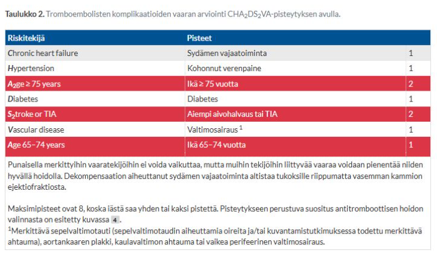
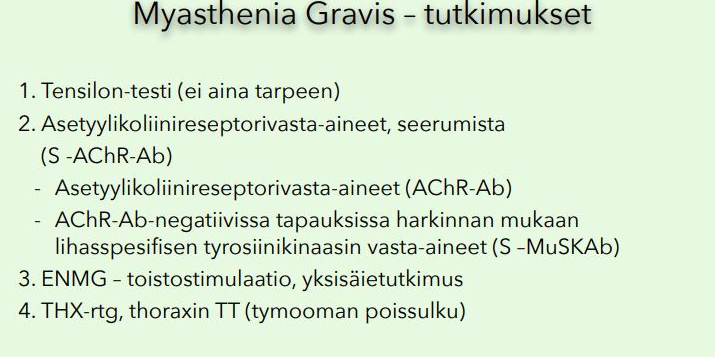
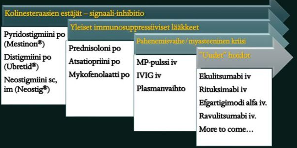
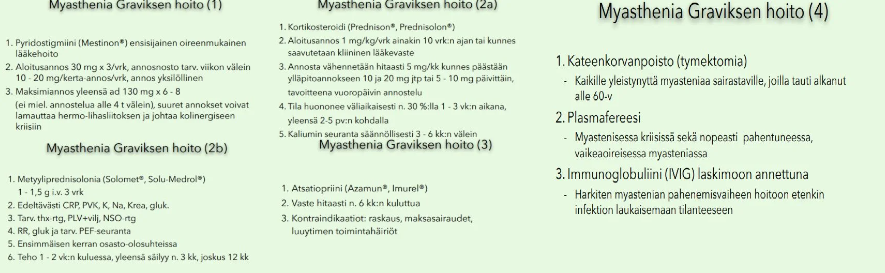
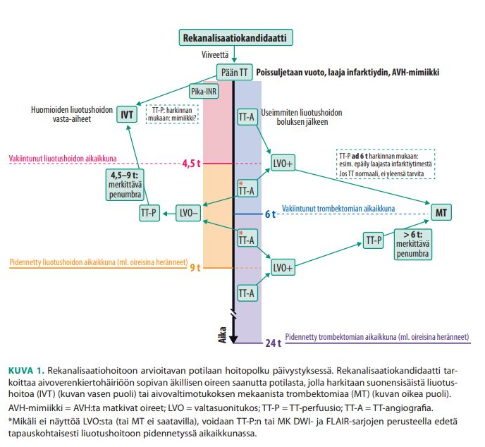
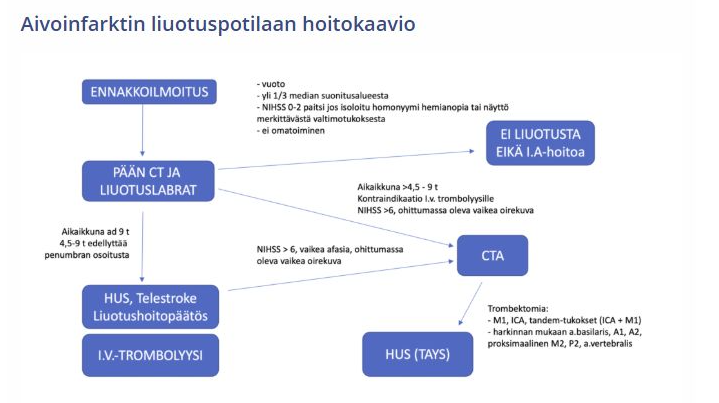
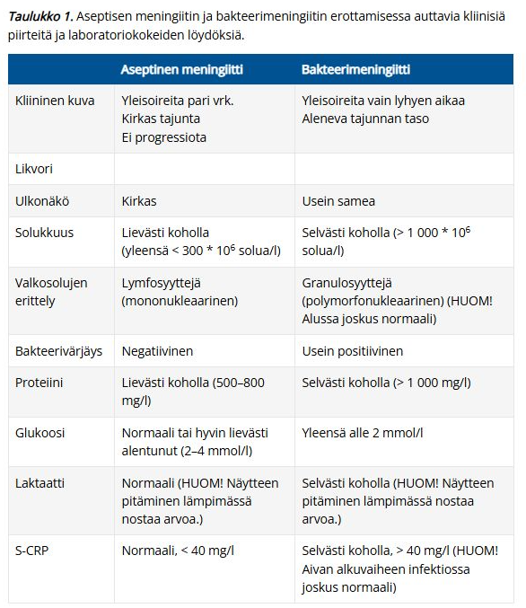
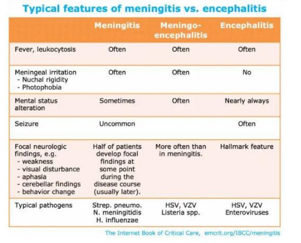
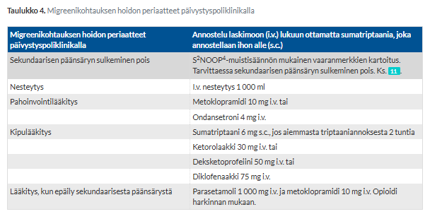
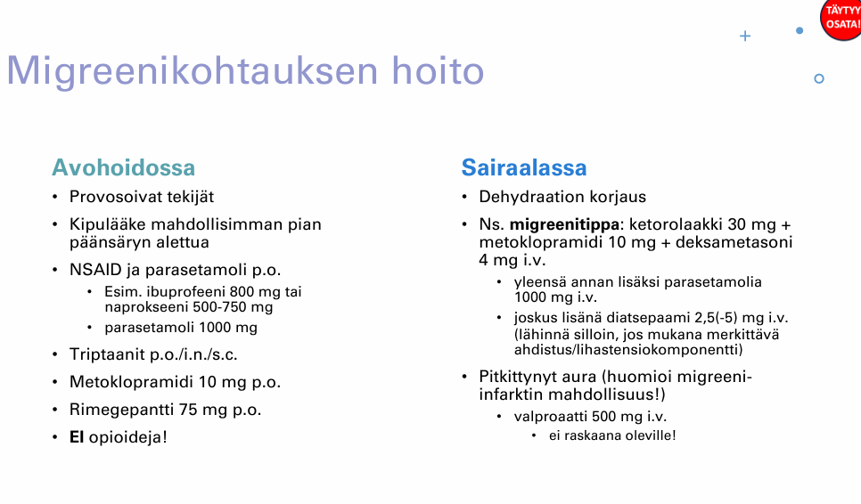

# 2026 

Oikein/Väärin-kysymyksissä väärästä vastauksesta -1p. Jos kirjoittaa esseissä jotain, mikä vahingoittaisi potilasta, niin tehtävä nollille (ei kuitenkaan suoraan hylättyä tenttiä siis).

## Blokki 1 

### Levottomat jalat

Toimit terveyskeskuslääkärinä. Vastaanotollesi saapuu 54v nainen, joka on kärsinyt lähes 10 vuotta levottomista jaloista. Lääkityksenä hänellä on pramipeksoli depot 0,52mg x1, josta alkuun hyvä apu, mutta annoksia jouduttu nostamaan muutaman vuoden välein oireiden pahennuttua.  Nyt oireisto jälleen pahentunut ja vaivaa jo päiväsaikaankin. Miten toimit? (essee 6p)

  <button class="solution-button"
          data-label="Vastaus"
          data-hide-label="Piilota vastaus">
    Vastaus
  </button>
  

Levottomien jalkojen oireyhtymä (RLS) tarkoittaa käytännössä sitä, että potilas kokee pakonomaista tarvetta liikutella jalkoja; kokemus liittyy epämiellyttäviin tuntemuksiin etenkin jaloissa (voi joskus olla myös mm. yläraajoissa). Oireet pahenevat aina illalla ja yöllä -> häiritsee unta. Oireet katoavat tai lievittyvät tilapäisesti jalkojen liikuttelun tai venyttelyn avulla. 

<li>RLS:n diagnostiikka perustuu ensisijaisesti anamneesiin (Diagnostinen kysymys: "Kun illalla yrität rentoutua tai nukahtaa illalla tai yöllä, onko sinulla koskaan epämiellyttäviä, levottomia tuntemuksia jaloissasi, jotka helpottuvat, kun liikutat jalkojasi tai kävelet?”) ja sekundaaristen syiden poissulkuun. Kliinisessä tutkimuksessa neurologinen status on normaali. Jos taas olisi esim. polyneuropatiaa oireiden taustalla -> värinätunto poikkeava, akillesrefleksit uupuvat, sukkamaiset tuntemukset.</li>
<li>Oireet voivat olla idiopaattisia (yleisin) tai sekundaarisia. Altistavia tekijöitä ovat mm. jo mainittu polyneuropatia, mutta myös raudanpuute (ilman anemiaakin; suositellaan rautahoitoa, jos P-Ferrit on ≤ 75 µg/l tai transferriinin saturaatio < 25 %), kilpirauhasen vajaatoiminta, diabetes, krooniset munuaissairaudet (urea), B12-puute, elektrolyyttihäiriöt, syöpäsairadet, raskaus ja monet lääkkeet (psykoosilääkkeet, metoklopramidi, antihistamiinit).</li>
  <ul>
    <li>Diagnostiikassa labroista otetaan siis ainakin PVKT, P-ferrit + fP-Trfesat, TSH, Na, K, Krea, ALAT. Harkiten mm. folaatti, B12 ja diabeteskokeet (polyneuropatia).</li>
  </ul>

---

**Sekundaarisia syitä on tietysti tärkeää miettiä jo diagnosoidun potilaan tilan muuttuessa. Oirekuvan pahenemisen taustalla voi siis mahdollisesti olla jonkin sekundaarisen syyn ilmentyminen ja tämän takia poissuljetaan vähintään raudanpuutteen kehittyminen, mutta usein myös muitakin mainittuja syitä.**

<li>Lisäksi on myös tärkeää selvittää paljon muutakin, varsinkin anamnestisesti. Selvitellään esimerkiksi potilaan elintapoja (kahvi, alkoholi, päihteet), koska ne voivat vaikuttaa oirekuvaan myös. Tulee myös tarkentaa se, että kuinka suuria annokset oikeasti ovat nyt.</li>
<li>Tietysti myös perusteellinen neurologinen status paikallaan, varsinkin alaraajojen sensoriikan suhteen.</li>

---

Levottomat jalat -oireyhtymän (RLS) hoidoksi voi lievässä tilassa riittää ei-lääkkeelliset ohjeet, mutta ensilinjan lääkehoidoksi suositellaan yleensä gabapentinoideja (pregabaliini tai gabapentiini). Myös dopaminiagonisteja käytetään usein, useimmiten pramipeksolia tai ropinirolia - näin nyt myös tällä potilaalla. **Dopamiiniagonisteihin kuitenkin liittyy augmentaation (oireiden pahenemisen) riski pitkäaikaisessa käytössä; ilmenee oireiden voimistumisena, nopeampana ilmaantumisena levossa, leviämisenä muihin kehon osiin, kuten yläraajoihin, sekä hoitovasteen lyhenemisenä.**

On siis perusteltua ajatella, että varsinkin jos sekundaariset syyt on poissuljettu, niin oirekuvan pahenemisen taustalla on todennäköisesti augmentaatio. Pramipeksoliannoksen nostaminen tässä kohtaa olisi virhe, sillä se pahentaisi augmentaatiota entisestään. **Suunnitelma on pramipeksolin hallittu ja hidas purku ja lääkeaineryhmän vaihto gabapentinoideihin.**

Augmentaation hoito on hoito-ohjeiden mukaan sinänsä porrastettu neurologian tehtäviin, joten ainakin konsultaatio aiheellista. Konsultaation perusteella saa myös varmasti hyvän alasajosuunnitelman ja kontrolloinnin ohjeistuksen. 
  

### Oikein/Väärin {#Oikein-vaarin}

Suurten suonten ateroskleroosi aiheuttaa pienimmän uusien aivoinfarktien riskin verrattuna muihin etiologioihin, koska ahtaumat ovat yleensä stabiileja.

  <button class="solution-button"
          data-label="Vastaus"
          data-hide-label="Piilota vastaus">
    Vastaus
  </button>
  

Väärin 

---

Suurten suonten ateroskleroosissa on muihin etiologioihin verrattuna yksi suurimmista uusiutumisriskeistä (n. 15-20%; jopa 30 %:ia kolmessa kuukaudessa), jonka vuoksi tunnistaminen ja viiveetön hoito tärkeää. 

<li>Muut pääetiologiat ovat sydänperäinen embolisaatio (uusimisriski 2 vk:n kuluessa ad 12%) ja pienten suonten tauti (riski kyllä koholla ja usein aiheuttaakin useiden mini-infarktien kautta verisuoniperäistä muistisairautta). Näiden lisäksi on tietysti muut määritetyt etiologiat ja vielä kategoria nimeltä "selvittelyistä huolimatta epäselvä etiologia". </li>

  

### O/V

TIA oireet kestävät tyypillisesti alle 1 tunnin ja suurin riski saada aivoinfarkti on ensimmäisten tuntien ja päivien aikana TIA:n jälkeen.

  <button class="solution-button"
          data-label="Vastaus"
          data-hide-label="Piilota vastaus">
    Vastaus
  </button>
  

Oikein 

---

TIA (Transient ischemic attack) eli ohimenevä iskeeminen kohtaus = aivojen tai verkkokalvon verenkiertohäiriöstä johtuva kohtausmainen, ohimenevä oirekuva, jossa ei havaita pysyvää kudosvauriota. Kestää yleensä alle tunnin, tyypillisimmin 2–15 minuuttia. Mainittakoon, että määritelmällisesti voi kestää ad 24h, mutta tämä on äärimmäisen harvinaista, koska jos TIA-oireet ovat kestäneet enemmän kuin 1–2 tuntia, todetaan pään kuvauksessa usein aivoinfarktin eli aivojen hapenpuutteesta aiheutuneen pysyvän kudosvaurion merkkejä. Tällöin kyse ei ole enää TIA:sta vaan aivoinfarktista. Tunteja kestävässä ohimenevässä oireessa on useimmiten kyseessä neuroradiologisesti osoitettava tuore aivoinfarkti eikä TIA.

Oireiden väistyminen ei kuitenkaan tarkoita sitä, että tilanne olisi vaaraton. Melkein yhdellä kymmenestä potilaasta ilmenee aivoinfarkti (stroke) viikon sisällä TIA-oireesta, ja tämän vuoksi TIA vaatiikin kiireellistä selvittelyä ja hoitoa.

<li>Välillä potilas tulee vasta parin päivän päästä oireiden poistuttua vastaanotolle, jolloin jos TIA-oireesta on kulunut enintään 2 viikkoa, tulee potilas lähettää keskussairaalan päivystyspoliklinikalle tai neurologiseen yksikköön päivystysluontoisesti. Tämä tehdään, koska esim. jos taustalla on kaulavaltimon ahtauma, nin endarterektomia tulisi tehdä 2 viikon kuluessa viimeisestä ennustetapahtumasta, koska sen jälkeen leikkauksesta koituva hyöty vähenee.</li>
<li>Jos oireesta on kulunut yli 2 viikkoa, voidaan asiaa selvitellä ajanvarauslähetteellä (kiireellinen 1-7vrk neurologialle).</li>

  

### O/V

Hornerin syndrooma on tyypillisesti benigni oirekokonaisuus, joka ei edellytä kiireellisiä tutkimuksia, ellei siihen liity neurologisia puutosoireita

  <button class="solution-button"
          data-label="Vastaus"
          data-hide-label="Piilota vastaus">
    Vastaus
  </button>
  

Väärin 

---

Hornerin oireyhtymä tarkoittaa sympaattisen rungon hermovaurion (missä tahansa osassa sympatikus-rataa) aiheuttamaa oirekuvaa, jolle on tyypillistä seuraava triadi: ipsilateraalinen ptoosi + mioosi + anhidroosi (anhidroosia ei ale aina nähtävissä). Toiselta nimeltään oculosympathetic palsy.

Taustasyitä esim. keskushermoston vauriot, sarjoittainen päänsärky, keuhkojen yläosien kasvaimet, ICA:n dissekaatio, iatrogreeniset syyt. **Lähtökohtaisesti uutena kehittynyt Hornerin syndrooma vaatii päivystystutkimuksia.** Se voi olla mm. kaula- ja nikamavaltimon dissekaation ainoa statuspoikkeavuus. 
  

### O/V

Liuotushoito voidaan antaa kaikille aivoinfarktipotilaille, kunhan pään natiivi TT ei osoita tuoretta iskemiaa

  <button class="solution-button"
          data-label="Vastaus"
          data-hide-label="Piilota vastaus">
    Vastaus
  </button>
  

Väärin 

---

Liuotushoidolle on todella monia vasta-aiheita. TT-kuvassa todettava laaja tuore infarkti (laaja demarkoituva hypointensiteetti) on kyllä yleensä vasta-aihe, mutta se ei todellakaan ole ainoa vasta-aihe (tuoretta infarktia ei myöskään useinkaan näy TT-kuvassa ensimmäisten tuntien aikana, vaan natiivi-TT tehdään ensisijaisesti vuodon poissulkemiseksi). 

  

### O/V

Amaurosis fugax viittaa tyypillisesti posteriorisen verenkierron (PCA) ongelmaan

  <button class="solution-button"
          data-label="Vastaus"
          data-hide-label="Piilota vastaus">
    Vastaus
  </button>
  

Väärin 

---

Amaurosis fugax tarkoittaa transienttia mono-okulaarista sokeutta. Johtuu nopeasta, hetkettäisestä ja palautuvasta verenvirtauksen puutoksesta yhteen silmään. Sen aiheuttaa yleensä silmävaltimoon kulkeutunut embolia, joka useimmiten kielii samanpuoleisen sisemmän kaulavaltimon ateroskleroosista. Kyseessä on siis periaatteessa a. ophthalmican suonitusalueen verkkokalvoperäinen TIA. 

Posteriorinen verenkierto (AKA vertebrobasilaarialue) saa verta pääasiassa a. vertebralis-suonista, jotka yhdistyvät a. basilarikseksi ja siitä jakautuu PCA ja pikkuaivojen suonia (a. superior cerebelli, a. inferior anterior cerebelli; a. vertebraliksista on ennen yhdistymistään erkaantunut myös a. inferior posterior cerebelli). Vrt. anteriorinen verenkierto eli karotisalue saa verta a. carotis interna-suonista ja ruokkii suurinta osaa aivohemisfääreistä. 
  

### O/V

Eteisvärinä on aivoinfarktin etiologiana merkittävin sydänperäinen embolialähde ja sen sekundaaripreventiivinen verenkiertoon vaikuttava lääke on antikoagulaatiohoito.

  <button class="solution-button"
          data-label="Vastaus"
          data-hide-label="Piilota vastaus">
    Vastaus
  </button>
  

Oikein 

---

Iskeemisten aivoinfarktien yleisimmät pääetiologiat ovat suurten suonten ateroskleroosi, sydänperäinen embolisaatio ja pienten suonten tauti. Sydänperäisistä syistä tärkein ylivoimaisesti on eteisvärinä. Eteisvärinäpotilaan aivohalvausriskin arvioinnissa käytetään tunnetusti tietysti CHA2DS2VA-pisteytystä. CHA2DS2VA-riskipistein arvioituna aivoinfarktin tai TIA:n saanut potilas on aina vähintään suuren riskin kategoriassa (2 pistettä tai enemmän) -> käytännössä tarkoittaa sitä, että TIA:n tai aivoinfarktin sairastaneelle eteisvärinäpotilaalle tulee rutiinisti aloittaa pysyvä antikoagulaatiohoito (ellei selkeitä vasta-aiheita). Nykyään DOAC ensisijaisesti, varfariini pääsääntöisesti läppäperäisessä eteisvärinässä (=mekaaninen tekoläppä tai vaikea mitraalistenoosi). 

  

### Jalkojen heikkous

62-vuotias mies hakeutuu terveyskeskuksessa vastaanotollesi. Perussairauksina verenpainetauti, hyperkolesterolemia, tyypin 2 diabetes. Lääkityksenä ramipriili 5mg x1, metformiini 1000mg x 2 ja simvastatiini 40mg x 1. Hän kertoo jalkojen heikkoudesta, joka alkanut viimeisen puolen vuoden aikana, oire pahenee iltaa kohden. Aamuisin kokee olon normaaliksi. Lisäksi iltaa kohden hän kokee silmien muuttuvan raskaaksi ja näön heikentyvän. Neurologisessa statuksessa yläraajojen toiminta ja ihotunto on normaalia, refleksit ovat symmetriset ja normaalit, joskin hieman vaimeat. Alaraajoissa lihasvoimat ovat kertatestauksessa hyvät. Patella +/+, akilles -/-, tonus normaali. Rombergissa potilaalla pientä huojuntaa, muutoin tasapaino ja kävely huoneessa sujuvaa.

- a. työdiagnoosi?  (1p)
- b. mitä anamnestisia tietoja kaipaat lisää? Miten tarkentaisit statusta? (2p)
- c. jatkosuunnitelma? (1p)

  <button class="solution-button"
          data-label="a"
          data-hide-label="a - Piilota vastaus">
    a
  </button>
  

Levossa paraneva lihasväsyvyys eli fatiikki (olo voi aamulla olla ihan normaali) ja silmäoireet herättävät vahvan epäilyn **myastenia graviksesta (MG).** Yleisimmät MG:n ensioireet ovat juuri silmän alueen lihasten heikkousoireet (ptoosi ja diplopia). 

Statuksessa ei ole muita puutoksia paitsi akillesrefleksin puuttuminen (mahdollisesti diabeettista polyneuropatiaa taustalla). Myastenia graviksessa refleksit ja tunto ovatkin tyypillisesti normaalit. 

Ikä on suhteellisen tyypillinen MG:lle. Myastenia graviksella on bimodaalinen ikäjakauma: yleisin sairastumisikä n. 20-30 vuotta (suurin osa naisia); toinen tyypillinen ikä on n. 60-70 vuotta (tällöin ilmenee sukupuolesta riippumatta). 

Toinen lihas-hermoliitoksen sairaus eli Lambert-Eatonin oireyhtymä (LEMS) taas ilmenisi käytössä paranevana lihasheikkoutena ja refleksit olisivat vaimentuneet. Silmäoireet ovat LEMS:ssä harvinaisempia kuin MG:ssä. 

Muita vaihtoehtoja lihasheikkouksissa tulee aina miettiä mm. psykogeeniset syyt, yleiset väsymystä aiheuttavat sairaudet (esim. infektiot, syövät), päihteet ja lääkkeet (alkoholi, harvoin statiinit, kortikosteroidit), endokriiniset ja aineenvaihdunnalliset syyt (esim. kilpirauhashäiriöt ja elektrolyyttihäiriöt), lihassairaudet (esim. myosiitit) ja motoneuronien vauriot (AVH, keskushermostokasvaimet, keskushermostovammat, myeliitti, MS, ALS; tietysti myös polyneuropatiat, polyradikuliitit ja radikulopatiat).
  

  <button class="solution-button"
          data-label="b"
          data-hide-label="b - Piilota vastaus">
    b
  </button>
  

Anamnestisesti kiinnostaa:

<li>Vaikutus toimintakykyyn? Tämä on tärkeää kysyä aina lihasheikkouspotilailta. Esim. Mihin oirekuva vaikuttaa? Työkyky? Uhreilusuoritukset? Kävelymatka? Portaiden nousu? Puhuminen, nieleminen? Kierrekorkkien avaaminen? Hiusten peseminen? Apuvälineiden tarve?</li>
<li>Yleisoireita (väsymys, ruokahaluttomuus, kuumeilu)? </li>
<li>Onko ollut mitään kohtauksittaisia jaksoja, jolloin olisi ollut mitään merkittäviä heikkouksia tai muita neurologisia oireita?</li>
<li>Ovatko lihakset pienentyneet etenevästi?</li>
<li>Muiden autoimmuunitautien kartoittaminen (15%:lla MG-potilaista on toinenkin autoimmuunitauti); onko ollut aikaisemmin jotain muuta, mitä ei teksteissä tule ilmi? Sukuanamneesi?</li>
<li>Oireiden kehittyminen: Miten oireet alkoivat? Alkoiko silmäoireisena ja kehittyikö myöhemmin alaraajoihin? Kuinka nopeasti oireet ovat edenneet?</li>
  <ul>
    <li>Kannattaa aina myastenia gravis -potilaiden kanssa huomioida se, että silmäoirein alkanut taudinkuva kehittyy kahden vuoden kuluessa noin 80%:lla yleistyneeksi MG:ksi. Varma okulaarisen MG:n diagnoosi voidaankin asettaa vasta kahden vuoden seurannan jälkeen.</li>
  </ul>
<li>Näön heikkenemisestä tarkemmin: Mitä tarkoittaa? (kaksoiskuvia, muuta?)</li>
<li>Onko bulbaarioireita eli pääasiassa puhe- ja nielemisvaikeuksia (yleisiä MG:n ensioireita; n. 20%:lla)</li>
<li>Onko hengenahdistusta? </li>
  <ul>
    <li>Myastenia graviksen vaarallisin komplikaatio on myasteeninen kriisi, joka tarkoittaa myasthenia graviksen hengenvaarallista pahenemisvaihetta. Riski merkittävälle hengityslihasten heikkoudelle -> vaatii välitöntä sairaalahoitoa ja hengityskoneapua. Kehittyy yleensä päivien tai viikkojen kuluessa infektion, stressin (esim. kirurginen operaatio) tai lääkitysmuutoksen seurauksena.</li>
  </ul>
<li>Lääkitys? Monet lääkkeet voivat pahentaa MG:n oireilua</li>
  <ul>
    <li>Ehdottomasti kiellettyjä lääkkeitä ovat botuliinitoksiini, i.v. magnesium, makrolidit ja fluorokinolonit</li>
    <li>Käytettävä varovasti (voivat pahentaa oireita): beetasalpaajat, kalsiumsalpaajat, sertraliini, sitalopraami, litium, amisulpridi, gabapentiini, jodia sisältävät varjoaineet, klorokiini, aminoglykosidit, statiinit</li>
    <li>Huom. listasta: Glukokortikoidit eri muodoissaan (suun kautta, infuusiona) voivat pahentaa tilapäisesti oireita, mutta niitä silti käytetään myastenian akuutti- ja pitkäaikaishoidossa</li>
  </ul>

---

Statuksen tarkentamisessa tärkeintä MG:n suhteen on tehdä väsyvyystestejä (ja tietysti alaraajojen sensoriikkatestit, joita ei ole tehtävänannossa mainittu. Akilles-refleksien puuttuminen ja Romberg-huojunta viittaavat todennäköisesti diabeettiseen polyneuropatiaan, joka on tässä tapauksessa rinnakkainen löydös). Tulee myös arvioida yläkropan ja pään turvotusta. Myastenia graviksen taustalla voi joskus olla tymooma ja ne voivat joskus harvoin kasvaa invasiivisiksi ja isoiksi ja siten obstruktoida ylempää vena cavaa. 

<li>Kaksoiskuvia/riippuluomea voi provosoida pyytämällä potilasta katsomaan ylöspäin pitkään. Myös nopea silmien räpytys osoittaa decrementin ja voi tuoda esille ptoosia.</li>
<li>Myös esim. käsien nyrkistys voi osoittaa decrementin</li>
<li>Alaraajojen kannatusta 30 asteen kulmassa ei jakseta normaalia aikaa (>60s)</li>
<li>Diagnoosia tukee se, että silmäluomen päälle asetettava jääpussi voi väliaikaisesti parantaa roikkuvaa luomea (ns. jäätesti; kylmä inhiboi asetyylikoliiniesteraasia)</li>

  

  <button class="solution-button"
          data-label="c"
          data-hide-label="c - Piilota vastaus">
    c
  </button>
  

**Myastenia graviksen diagnostiikka ja hoito on keskitetty erikoissairaanhoitoon. Epäilyssä siis lähete neurologialle. Tehdään lähete kiireellisenä (1-7vrk).** 

---

Ensisijaisia diagnostisia tutkimuksia ovat myastenia-EMG (normaali ei riitä) ja vasta-ainelabrat (AChR ja tarvittaessa MuSK). Myastenia gravis on autoimmuunisairaus, joka johtuu yleensä vasta-aineista postsynaptisia asetyylikoliinireseptoreita vastaan hermo-lihasliitoksessa. Nämä vasta-aineet (AChRAb) ovat lähes spesifejä MG:lle. Niiden negatiivisuus ei kuitenkaan poissulje myasteniaa. Harvinainen muoto myasteniasta on MuSK-myastenia, jossa vasta-aineita on lihasspesifisistä kinaasia vastaan (n. 4-5%:lla). On myös harvinaisesti seronegatiivisia myastenioita. 

Myastenia graviksen diagnostiikassa on aikaisemmin käytetty enemmän ns. tensilon-testiä, jossa annosteltiin edrofonia, ja jos lihasheikkous parantui annostelulla, se viittasi myasthenia gravikseen. Tämän käyttö on vähentynyt. 

Jos potilaalla todetaan myastenia gravis, otetaan yleensä jatkoselvittelynä thorax-TT, jonka tarkoitus on kateenkorvan eli tyymuksen kuvantaminen. Kateenkorvan hyperplasia todetaan n. 70 %:lla potilaista, hyvänlaatuinen tymooma n. 10 %:lla. Sairaus voi puhjeta vasta vuosien kuluttua tymooman toteamisesta. Tymektomiaa harkitaan yleistyneessä myasteniassa, jos potilas on alle 60-vuotias (vaikka ei olisikaan tymoomaa). 

Myasthenia graviksen hoito on oireenmukaista ja ensisijainen lääkevalinta on pyridostigmiini (AKE:n estäjä). Tyypillisiä pyridostigmiinin yliannostuksen oireita ovat ripuli, lihasten nykinä, lisääntynyt syljeneritys ja liikahikoilu. Yliannostusoireita kysytään potilaalta kontrollikäynneillä, koska niiden avulla voidaan säätää lääkityksen annostelua. 

Lääkitykseen lisätään immunosuppressiiviset lääkkeet (pääasiassa glukokortikoidi), jos pyridostigmiinin teho ei riitä; atsatiopriinia käytetään kortisonia säästävänä lääkkeenä. Myasteenisessa kriisissa (kuuluu päivystysarvioon) hoitona plasmafereesi tai IVIG (ei merkittävää tehoeroa); i.v. metyyliprednisolonia voidaan harkita. Hengitystä on avustettava lihasheikkouden pahenemisen varalta jo ennen kuin hengitysvajaus tulee näkyviin verikaasuanalyysissä. Myasteenisen kriisin yleisin laukaiseva tekijä on jokin infektio, joten MG-potilaiden infektioiden kanssa tulee olla tarkkana. 

  

### Alkoholisti löydetty lattialta

Ensiapuun, keskussairaalan jakamattomaan päivystykseen tuodaan ambulanssilla 63-vuotias mies, jolla tiedossa alkoholin liikakäyttöä. Ystävät eivät olleet saaneet häntä kiinni muutamaan päivään ja hälyttäneet paikalle ambulanssin. Potilas löytyi kotoa lattialta makaamasta. Sairaalaan tullessa potilas on tajuissaan, mutta tokkurainen. Hän puhaltaa alkometriin 0,4 promillea. Hän valittaa laaja-alaisia lihaskipuja ja ylösnouseminen lattialta ei kotona onnistunut, jalat tuntuvat heikoilta. Statuksessa potilas noudattaa kehotuksia vaihtelevasti, ei nosta käsiä eikä jalkoja pyynnöstä, mutta ajoittain käsillä huitoo, jalkoja ei juurikaan liikuta.  Päivystyksessä otettuna CK 8000.

- a. työdiagnoosi? (1p)
- b. työdiagnoosin mukainen hoito? Tarvitaanko jatkotutkimuksia, jos niin mitä? (1p)

  <button class="solution-button"
          data-label="a"
          data-hide-label="a - Piilota vastaus">
    a
  </button>
  

Tyypillinen tarina ja labralöydös viittaavat rabdomyolyysiin. 

Rabdomyolyysilla tarkoitetaan yleensä hankinnaista, äkillistä poikkijuovaisen lihaksen tuhoutumista, jonka seurauksena solujen sisältöä pääsee verenkiertoon, mikä voi johtaa erityisesti akuuttiin munuaisvaurioon. 

Rabdomyolyysin yleisin syy on murskavamma, erityisesti painevaikutus lihakseen pitkäkestoisen paikallaan makaamisen seurauksena. Usein taustalla on alkoholi, lääkeainemyrkytys tai jokin muu sairaus, joka johtaa tajuttomuuteen ja lattialla makaamiseen samassa asennossa pitkään. Muita yleisiä syitä ovat mm. poikkeava lihasrasitus (juoksu, kehonrakennus yms.), kouristukset tai lääkeaineet (tavallisin aiheuttaja statiinit; myös maligni neuroleptioireyhtymä, maligni hypertermia, heroiini, kokaiini). 

Lihasvaurion seurauksena veren CK-pitoisuus saattaa kohota jopa sata-tuhatkertaisesti viitearvorajan yläpuolelle; diagnoosi on käytännössä varmistettu CK:n ollessa merkittävästi koholla (raja-arvona vaikealle rabdomyolyysille pidetään yleensä pitoisuutta 5 000 U/l; lievä on 1000-5000) 

Rabdomyolyysille on tyypillistä lihaskivut, lihasturvotukset ja lihasheikkous vaurioalueilla. 

---

Potilaalla tietysti voi olla samaan aikaan mm. alkoholidelirium, traumaattinen aivovamma (löytynyt lattialta; kaatuminen ja pään lyöminen on mahdollista) tai jokin infektio (esim. aspiraatiopneumonia). 

  

  <button class="solution-button"
          data-label="b"
          data-hide-label="b - Piilota vastaus">
    b
  </button>
  

Otetaan **Na, K, Ca, Krea, astrup** ja kemseul. Rabdomyolyysissä on usein mukana vaikeita elektrolyyttihäiriöitä (hypokalsemia (kalsium sakkautuu lihaskudokseen), hyperkalemia (vapautuu soluista), hyperfosfatemia (munuaisten vajaatoiminta ja vapautuminen solujen sisältä) ja krean suurentumista AKI:n kehittyessä. Astrupissa usein metabolista asidoosia. Kemseulassa voidaan nopeasti arvioida infektiomahdollisuutta (ja erytrosyytit usein positiivisena (liuskakoe ei erota myoglobiinia hemoglobiinista)). 

**Lihasten palpointi on tärkeää; arvioidaan pinkeyttä ja aitiopaikkaoireyhtymän mahdollisuutta.** Faskiotomia on syytä tehdä, jos paineen nousu lihasaitiossa uhkaa johtaa lihasnekroosiin ja hermovaurioon; herkästi kirurgin konsultaatio. 

**EKG** on tärkeää ottaa mahdollisten rytmihäiriöiden (elektrolyyttihäiriöitä) ja iskemian tunnistamiseksi. 

**Pään TT** myös tarpeen, koska potilas on löytynyt lattialta ja on tokkurainen (trauman poissulku). Thx-rtg voidaan myös miettiä, varsinkin jos statuksessa tulee ilmi jotain pneumoniaan viittaavaa (alkoholisti maannut lattialla -> aspiraatiopneumonialle korkea riski). 

---

**Hoitona ensiapuun hypovolemian ja dehydraation korjaaminen.** Nestevaje saattaa olla useita litroja, joten alkuvaiheessa nesteytys (esim. ringer tai plasmalyte) saa olla runsasta, jopa 1–2 litraa tunnissa. Asetetaan katetri ja seurataan diureesia. Neste valitaan elektrolyyttitasoja (P-Na, P-K, P-Cl) ja happoemästasapainoa seuraten. Elektrolyyttien, happoemästasapainon ja krean/diureesin seuranta on siis tärkeää. Oireetonta hypokalsemiaa ei pidä hoitaa, koska toipumisvaiheessa kehittyy usein hyperkalsemia. Mahdollinen oireinen hypokalsemia tulee korjata varovaisesti.

Dialyysihoitoa harkitaan, jos potilaalle on jo kehittynyt anuria eikä diureesi palaudu tehostetulla nestehoidolla.

---

Tietysti alkoholipotilaan tapauksessa on myös tärkeää antaa **tiamiinia** estämään Wernicken enkefalopatiaa. Annetaan viimeistään ennen mitään glukoosipitoisia nesteitä joko suonensisäisesti tai i.m. 

  

### Kuumetta, kouristelua ja kognitiivinen häiriö

Olet töissä keskussairaalapäivystyksessä. Potilaaksi tuodaan 54-vuotias nainen, jolla perussairautena nivelreuma, johon kortisoni ja biologinen lääkitys, lisäksi verenpainetauti. Potilas on työelämässä, asuu puolison kanssa. Hänellä on 3 päivän ajan ollut kuumetta, lisäksi edeltävänä yönä alkanut sekavuus puolison mukaan. Päivystyksen seurannassa hän saa heti kouristuskohtauksen, joka ohittuu spontaanisti. Statuksessa: lämpö 38,8 °C, RR 110/72, p 85, Sat 98%. Tutkit potilaan kouristuskohtauksen jälkeen, jolloin potilas valittaa lievää päänsärkyä, ei niskajäykkyyttä, ei hengenahdistusta, iho siisti, vatsa ei arista. Ei infektio-oireita tutkittaessa, tai haastatellen. Puhe hidastunutta, vastailee välillä ohi kysymyksen, muutoin neurologisessa tutkimuksessa et totea poikkeavaa, yleistila hyvä muutoin.

- a. Ensisijainen työdiagnoosi? Perustele lyhyesti. (1p)
- b. Mitä tutkimuksia teetät päivystyksessä epäilemäsi diagnoosin selvittämiseksi, ja millaisia löydöksiä odotat niissä työhypoteesisi perusteella? (3p)
- c. Työdiagnoosisi varmistuu. Miten aloitat potilaan hoidon päivystyksessä ja mitä jatkotutkimuksia ohjelmoit? (2p)

  <button class="solution-button"
          data-label="a"
          data-hide-label="a - Piilota vastaus">
    a
  </button>
  

Enkefaliittia on aina muistettava epäillä potilaalla, jolla on kuume, äkillinen sekavuus (tai aivotoiminnan muutos) ja/tai hämärtynyt tajunta eikä muuta selittävää etiologiaa ole tiedossa. Oireet kehittyvät yleensä tunneissa tai päivissä. Tajunnantason heikentyminen voi vaihdella lievästä tajunnan hämärtymisestä syvään tajuttomuuteen asti. 

Tila viittaa enemmänkin enkefaliittiin kuin meningiittiin, koska tajunnan taso on merkittävämmin alentunut (voi tosin olla myös bakteerimeningiitissä matala), ei ole niskajäykkyyttä (yleistä meningiitille, voi puuttua enkefaliitissa; enkefaliitit ovat usein meningoenkefaliitteja, mutta meningiitin oireet voivat siis myös puuttua) ja on ilmentynyt kouristelua (harvinaista puhtaassa meningiitissä). Enkefaliitin oireistoon yleensä liittyy infektion yleisoireisto, uusi poikkeava päänsärky, kuume, persoonallisuuden muutokset, uudet kognitiiviset muutokset, epileptiset poissaolo- ja kouristuskohtaukset. Bakteerimeningiitissä potilas olisi yleissairaampi ja virusmeningiitissä ei olisi sekavuutta. 

---

Potilaan biologinen lääkitys ja kortisoni nostavat merkittävästi riskiä vakaville infektioille -> pitää yleisesti olla hereillä aina immunosuppressoitujen potilaiden infektio-oireilun kanssa. 
  

  <button class="solution-button"
          data-label="b"
          data-hide-label="b - Piilota vastaus">
    b
  </button>
  

Ensisijaisia tutkimuksia ovat likvor ja erotusdiagnostisesti TT. Pään TT on tässä tapauksessa mielekästä ennen likvorin ottoa, koska potilaalla on alentunut tajunta, taustalla epileptinen kohtaus ja merkittävä immunosuppressio (yleensä TT ennen likvoria, jos edes yksi näistä). Kuvantamisella siis tarkastetaan, että ei ole obstruktiosta johtuvaa aivopaineen nousua, jolloin lannepisto olisi vasta-aiheinen herniaatiovaaran takia. 

<li>Normaali pään TT- tai magneettikuva ei poissulje enkefaliittia ja kuvat ovatkin usein normaaleja alkuvaiheessa. Tärkeintä päivystyksessä onkin poissulkea muita asioita, kuten vuotoja. Yleisimmässä enkefaliitissa eli herpesenkefaliitissa voidaan TT:ssä voidaan todeta yleensä noin parin päivän - viikon jälkeen ohimolohko-affisiota, MRI:ssä aikaisemmin.</li>

---

Likvortutkimusta ennen on myös huomioitava mahdollinen verenvuototaipumus sekä veren hyytymiseen vaikuttava lääkitys. Likvorinäytteestä tutkitaan aina solut, proteiini, glukoosi + laaja bakteerien (nho, viljely) ja virusten (nho) analyysi. Otetaan myös varaputkia. 

<li>Tyypillistä on yleensä virusmeningiittiä muistuttavat löydökset (koska aiheuttaja on yleensä virus; erityisesti HSV-1):</li>
  <ul>
    <li>Leuk hieman koholla (> 10x106 /l)</li>
    <li>Diffissä mononukleaarinen (lymfosytaarinen) kuva</li>
    <li>Gluk normaali (tai harvemmin matala)</li>
    <li>Prot lievästi koholla</li>
    <li>Laktaattipitoisuus normaali (tai harvemmin hieman suurentunut)</li>
    <li>Gluk normaali tai matala</li>
  </ul>
<li>PCR-menetelmä ei ole akuuttivaiheessa erityisen herkkä. Mikäli mikrobietiologia ei selviä ensimmäisessä tutkimuksessa, voidaan likvortutkimus uusia viikon sisällä (3-7 vrk). Hyvä myös tiedostaa, että mitä "puhtaampi" enkefaliitti (aivokalvot eivät affisioituneina) sitä hankalampi on selvittää spesifinen mikrobietiologia. Jälkeenpäin (1-2 vko) voidaan todeta Li-HSV vasta-aineiden 
lisääntyminen.</li>

---

Tietysti otetaan usein myös verikokeita (esim. CRP, PVK, elektrolyytit, krea, veriviljelyt), mutta niissä ei ole enkefaliiteille spesifisiä löydöksiä. Laboratoriokokeilla suljetaan pois yleisinfektiot, systeemisairaudet ja mahdollisuuksien mukaan intoksikaatiot. Delirium tremens ja Wernicken enkefalopatia voivat erehdyttävästi muistuttaa enkefaliittia.

---

Tärkeää on myös arvioida mm. potilaan ihoa ja etsiä herperakkuloita (puuttuminen ei poissulje herpesenkefaliittia). Tietysti myös anamnestisesti mm. matkailu, samassa taloudessa asuvien infektiot ja puutiaisten puremat. 
  

  <button class="solution-button"
          data-label="c"
          data-hide-label="c - Piilota vastaus">
    c
  </button>
  

Työdiagnoosin varmistumisella tässä todennäköisesti tarkoitetaan yleisesti enkefaliittiepäilyn varmistumista eikä suoraan yhden mikrobietiologian varmistumista. Enkefaliittitapauksissa muutenkin akuuttivaiheen diagnoosi on kliininen, ja hoidon aloittaminen on tehtävä ripeästi kliinisen kuvan perusteella. Hoidon viivästyminen voi etenkin herpesenkefaliitissa suurentaa kuoleman ja pysyvien jäännösoireiden riskiä.

Käytännössä päivystyksessä aloitetaan empiirisesti kolmoishoito: asikloviiri+doksisykliini+keftriaksoni. Jatkohoito sitten PCR ja vasta-ainetutkimusten perusteella (esim. asikloviiri 10 mg/kg × 3 i.v. 14–21 vrk:n ajan HSV-enkefaliiteissa). 

---

Joskus voidaan myös ottaa jo päivystyksessä EEG, mutta usein vasta osastolla. Samoin jatkoon osastolla pään MRI tehosteaineella. 

<li>EEG on HSV-enkefaliitissa poikkeava ja viittaa toisen tai molempien ohimolohkojen vaurioon</li>
<li>MRI-tutkimus on herkin konetutkimus, jolloin voidaan nähdä herpesenkefaliitille tyypillinen löydös ohimolohkossa yleensä jo päivystyskuvauksessa sairauden akuuttivaiheessa. Se on vähentänyt EEG:n merkitystä diagnostiikassa. EEG:tä saatetaan tarvita epäselvissä tilanteissa ja jos tajunnantaso on heikko tai halutaan selvittää, onko potilaalla enkefaliittiin tai muuhun sairauteen liittyvä nonkonvulsiivinen status epilepticus.</li>

---

Tietysti vielä jatkossa likvorin mikrobiologisten testien uusiminen, jos näytteet jäävät negatiiviseksi. 
  

### Pääsärkypotilaiden triage ja arviointi

Työskentelet keskussairaalan päivystyksessä. Listallasi on kaksi samaan aikaan omatoimisesti arvioon saapunutta päänsärkypotilasta, joista on käytettävissä seuraavat esitiedot:

Potilas A: 19-vuotias nainen, jolla ei aiemmin todettuja sairauksia. Yhdistelmäehkäisypillerit käytössä. Nyt tullut arvioon voimakkaan päänsäryn ja pahoinvoinnin vuoksi. Nykyinen päänsärky alkanut eilen iltapäivällä. Päänsärky kehittynyt vähitellen saavuttaen maksiminsa noin tunnissa, se on luonteeltaan tasaisen jomottavaa ja painottuu oikean silmän ja ohimon seutuun. Potilas ottanut eilen illalla ibuprofeenia 400 mg, josta aiemmin saanut päänsärkyihin riittävän vasteen. Nytkin päänsärky sillä alkuun lievittyi, mutta ei kokonaan poistunut. Päänsärky lähtenyt tänään aamusta alkaen uudelleen vähitellen pahenemaan ja on nyt vaikein, mitä potilaalla on tähän mennessä koskaan ollut. Potilas valittaa, että “tuntuu kuin pää räjähtäisi”. Liitännäisoireena pahoinvointia, oksentanut eilen illalla ja tänään vielä uudestaan päänsäryn pahennuttua. Potilas kokee ponnistelun pahentavan päänsärkyä ja valon ärsyttävän silmiä. Ylioppilaskirjoitukset ovat nyt ajankohtaiset ja potilas on niihin valmistautumista stressannut sekä nukkunut huonosti. Vastaavanlaisia, mutta lievempiä päänsärky- ja oksenteluepisodeja ilmennyt harvakseltaan jo vuosien ajan, ja potilas itse epäilee niiden johtuvan niskajäykkyydestä, jota kokee nytkin olevan.

Potilas B: 51-vuotias tupakoiva mies, jolla taustalla verenpainetauti, johon lääkityksenä bisoprololi 5 mg x 1, ei muita säännöllisiä lääkityksiä. Nuorempana aurallinen migreeni aktiivisempi, mutta viime vuosina ollut vain harvakseltaan päänsärkyjä. Tänään aamulla 2 tuntia sitten pöydän ääressä paikallaan istuessa aamupalaa syödessä yhtäkkiä alkanut voimakas päänsärky, joka saavuttanut maksiminsa parissa sekunnissa. Potilas koki myös pahoinvointia, vähän yökkäili vessassa, mutta ei oksentanut. Otti kipuun ibuprofeenia 800 mg ja yhden parasetamoli-kodeiini 500/30 mg -tabletin. Pahin kipu sittemmin ohittunut, kokee päänsärkyä edelleen olevan, mutta nyt se enää kohtalaista ja potilaan mukaan vähenemään päin. Särky tuntuu koko päässä, painottunut eniten takaraivolle symmetrisesti. Niskajäykkyyttä potilas kokee myös olevan, jonka hän epäilee selittävän päänsäryn ja liittyvän viime päivien huonoon työskentelyasentoon.

- a. Kumpi potilaista sinun tulisi arvioida ensin? (1p)
- b. Jos kummankaan potilaan tarkennetussa oireanamneesissa ei ilmene muuta erityistä kuin edellä kuvatut tiedot, mitkä ovat tärkeimmät jatkotutkimukset, jotka tulisi näille potilaille tehdä? Vastaa kummankin potilaan osalta erikseen.  (3p)
- c. Mikä on työdiagnoosi ja miten etenet potilaan hoidon kanssa näiden jatkotutkimusten tulosten perusteella? Vastaa kummankin potilaan osalta erikseen. (2p)

  <button class="solution-button"
          data-label="a"
          data-hide-label="a - Piilota vastaus">
    a
  </button>
  

Potilas B tulee arvioida ensin. Potilaalla on klassinen salamaniskunomainen päänsärky (thunderclap headache), joka saavutti maksiminsa parissa sekunnissa. Tämä on merkittävin punainen lippu (red flag), joka viittaa välitöntä hoitoa vaativaan kallonsisäiseen hätätilaan; varsinkin lukinkalvonalaiseen vuotoon (SAV). Vuotanut veri myös ärsyttää meningejä -> niskajäykkyys. 

Potilaan A särky on alkanut vähitellen (maksimi tunnissa), mikä viittaa useammin hyvänlaatuiseen särkyyn (esim. migreeni), vaikka se onkin voimakas. 

  

  <button class="solution-button"
          data-label="b"
          data-hide-label="b - Piilota vastaus">
    b
  </button>
  

Potilas B: Pikainen natiivi pään TT on ensisijainen -> voidaan nähdä SAV. 

---

Potilas A: Oirekuva viittaa primaariin päänsärkyyn, mutta mukana on joitakin hälyttäviä piirteitä, kuten "elämän pahin päänsärky" ja ehkäisytabletit (tromboosiriski). Tässä on mahdollinen epäily aivojen sinustromboosista siis (ilmenee yleensä päänsärkynä ja intrakraniellin hypertension oireina (esim. pahoinvointi/oksentelu, papillödeema)). Sinustromboosin oireet määräytyvät tukkeutuneen sinuksen mukaan ja oireisto voi kehittyä akuutisti, mutta useimmiten päivien-viikkojen kuluessa progressiivisesti. Oireet ja statuslöydökset voivat olla hyvin lieviä ja päänsärky voi olla ainoakin oire. Hänenkin tapauksessa voisi siis olla järkevää toteuttaa kuvantamistutkimuksia. Tehdään kuitenkin tarkempi status (arvioidaan fokaaliset neurologiset oireet, silmänpohjatutkimus ja testataan, paheneeko päänsärky kumartuessa). Konsultoidaan neurologia ja keskustellaan kuvantamisen tarpeesta. Diagnoosi varmistuu aivojen magneettikuvauksella ja siihen yhdistetyllä magneettiangiografialla (laskimosarjat).

Keskustellaan neurologin kanssa myös lannepiston tarpeellisuudesta (kuitenkin niskajäykkyyttä, päänsärkyä ja valonarkuutta; tosin kuulostavat anamneesin perusteella enemmänkin migreeniin ja lihasperäiseen paremmin sopivaksi). Hänellä ei kuitenkaan ole kuumetta eikä tajunnantason alentumista, joten CNS-infektio on suhteellisen epätodennäköinen. 
  

  <button class="solution-button"
          data-label="c"
          data-hide-label="c - Piilota vastaus">
    c
  </button>
  

Potilas B: SAV:n varmistuessa välitön neurokirurginen konsultaatio. SAV-potilas kuuluu akuutisti tehohoitoon tai tehovalvontaan, ei vuodeosastolle. Välittömän uusintavuodon ehkäisyssä mahdollisesti traneksaamihappo. Viivästyneitä iskeemisiä aivovaurioita yritetään yleensä ehkäistä lääkehoidolla (aivovaltimospasmeja estetään nimodipiinilla). Mitataan myös mm. kuume, sokerit, elektrolyytit ja muut ongelmat, kuten verenpaineongelmat, pahoinvointi ja epilepsiakohtaukset ja hoidetaan ne. 

Jos kuvantaminen jää negatiiviseksi, niin voidaan mahdollisesti miettiä lannepistoa, josta voidaan nähdä visuaalisesti ksantokromiaa (keltaisuutta) tai analyysissä punasoluja, jos on SAV.

Jos vuoto todetaan, tehdään yleensä verisuonten kuvantaminen (TT-angiografia on primääritutkimus, tarvittaessa katetriangiografia (DSA)) mahdollisen aneurysman paikallistamiseksi (SAV:n taustalla usein aneurysman rupturoituminen). Vuotanut aneurysma tulee eristää viimeistään seuraavana päivänä uusintavuodon estämiseksi. Aneurysman anatomia ja hoitotiimin kokemus ratkaisevat valinnan kirurgisen ja suonensisäisen hoidon välillä: 

<li>Aneurysman kaulan mikrokirurginen sulku klipsillä kraniotomian kautta (klipsaus)</li>
<li>Aneurysmapussin sulku koileilla, stentillä ja muilla materiaaleilla endovaskulaarisesti (koilaus)</li>

---

Potilas A: Työdiagnoosi on migreenikohtaus (ei vielä edes status migrainosus, koska normaalitkin migreenikohtaukset voivat kestää ad 72h). Erotusdiagnostisesti on tärkeää pohtia varsinkin sinustromboosia ja neurologin konsultaation perusteella tämän kuvantaminen. 

Migreenikohtauksen hoidossa yleensä käytetään NSAIDeja ja parasetamolia, mutta potilaan vaste näille nyt ei ole riittävä (Hoitovasteen saavuttaminen = kivuttomuus tai kivun merkittävä väheneminen 2 t:n kuluessa lääkkeen otosta, vaikutuksen kesto 24 t:n ajan sekä lisäksi lääkkeen vähäiset haittavaikutukset ja toimintakyvyn palautuminen; tässä potilaalla nyt vaikutus ei ole kestänyt päivää). Tulevissa kohtauksissa avohoidossa suositellaankin triptaania. Jos triptaani on tehoton, vasta-aiheinen tai aiheuttaa haittoja, suositellaan rimegepanttia. Kohtausten pahoinvointiin voidaan määrätä metoklopramidia. On myös järkevää yleisesti ottaa ohjata potilas perusterveydenhuollon seurantaan ja pyytä pitämään päänsärky-/auraoirepäiväkirjaa tulevaisuudessa, jotta voidaan arvioida kohtausten yleisyys ja myös jos todetaankin _aurallinen_ migreeni, niin silloin yhdistelmäehkäisy on vasta-aiheista.

Päivystyksessä migreenipotilaiden hoidossa tulee selvittää, onko potilas kokeillut jo kotona tyypillistä kohtauslääkitystään ja tarvittaessa annostella se, jos sitä ei vielä olla kokeiltu (eli siis NSAID+parasetamoli (ja usein myös metoklopramidi tai jopa triptaanikin) yleensä isommallakin annoksella, kuten migreeneissä yleensä tapana; esim. ibuprofeeni 600-1200 mg p.o.). Päivystyksessä usein kuitenkin potilaat ovat jo kokeilleet kohtauslääkitystään, mutta vaste ei ole ollut riittävä. **Päivystyksessä tulee tällöin korjata dehydraatiota ja antaa ns. migreenitippa: ketorolaakki 30 mg + metoklopramidi 10 mg + deksametasoni 4 mg i.v. + parasetamolia 1000mg i.v. (yleisesti käytetyn tipan sisältö vaihtelee hieman toimipaikan mukaan). Usein voidaan myös miettiä diatsepaamia lisäksi 2.5 mg iv, jos mukana merkittävä ahdistus/lihastensiokomponentti (tällä potilaalla siis ehkä voisi miettiä). Useimmiten migreenitippaa edeltävästi/sen kanssa kannattaa myös annostella triptaani (vaikka i.n. jos pahoinvointiakin merkittävästi), jos sille ei ole vasta-aihetta.**

Jos sinustromboosi todettaisiin tai sitä epäiltäisiin vahvasti, niin sen hoitona on viivytyksettä aloitettu antikoagulaatio pienimolekyylisellä hepariinilla, myös silloin kun potilaalla todetaan sinustromboosiin liittyvää aivojensisäistä verenvuotoa. Oleellista on myös runsas nesteytys, varsinkin, jos sinustromboosi liittyy kuivumiseen.
  

## Blokki 2 

### Parkinsonin taudin oireet ja löydökset taudin eri vaiheissa? (3p essee)

  <button class="solution-button"
          data-label="Vastaus"
          data-hide-label="Piilota vastaus">
    Vastaus
  </button>
  

Parkinsonin tauti on yleisin parkinsonismia aiheuttava neurologinen sairaus. Parkinsonismi on kattotermi oireyhtymälle, jolle tyypillisiä piirteitä ovat hypokinesia (bradykinesia/akinesia), lepovapina, rigiditeetti ja tasapainon epävakaus (virallisesti parkinsonismin diagnoosiin vaaditaan hypokinesia + joku lepovapinasta/rigiditeetista/tasapainon epävakaudesta). Motorisiin oireisiin kuuluu usein myös parkinsonistinen kävely ja pieni käsiala (mikrografia). Motoriset oireet ovat usein alussa unilateraalisia ja etenevät yleensä bilateraalisiksi; tosin myöhemmässäkin vaiheessa oireet ovat usein pahempia toisella puolella (yleensä sillä puolella, kummalla oireet alkoivat), vaikka molemmilla puolilla oireita ilmentyisikin.

<li>Hypokinesia-termin alta voidaan virallisesti erottaa akinesia (liikkeen aloittamisen hitaus ja spontaanin liikehdinnän vähentyminen) ja bradykinesia (liikesuorituksen hitaus). Usein kuitenkin termejä käytetään sekaisin ja toistensa synonyymeinä.</li>
<li>Lepovapina ilmenee yleensä eniten käsissä ja varsinkin tyypillisenä pillerinpyöritysvapinana (pill-rollin-tremor), jossa etusormi ja peukalo vapisevat toisiaan vasten ja käsi tekee toistuvaa supinaatio-pronaatio-liikettä. Vapina on tyypillisesti hidastaajuista (useimmiten 3-6 Hz, yleensä n. 4-5 Hz) ja vähenee tahdonalaisen liikkeen aikana. Alahuuli ja leukakin voi vapista. Pää sen sijaan ei yleensä liiku (”ei–ei”-liike ilmaisee, ettei potilaalla todennäköisesti ole Parkinsonin tautia). On kuitenkin huomattava, että Parkinsonin taudissa voi lepovapinan ohella olla aktiovapinaa.</li>
  <ul>
    <li>Klassista on, että käden vapina pahenee kävellessä (ns. tremor during walking (TW)). Tämä ei kuitenkaan tarkoita sitä, että käveleminen tai muu urheilu pahentaisi Parkinsonin tautia!</li>
    <li>Statuksessa todettavissa usein hidastuneisuus ja myös toistoliikkeissä (esim. diadokokineesi) liikelaajuudeen vähentyminen (decrement) on yleistä.</li>
  </ul>
<li>Rigiditeetti tarkoittaa kohonnutta lihastonusta raajojen passiivisessa liikkeessä. Rigiditeetti voi tuntua joko tasaisena (lyijyputki-rigiditeetti) tai rytmisesti vaihtuvana vastuksena (hammasratas-rigiditeetti) pääosin vapinataipumuksen mukaan. Toisin kuin spastisuuteen, rigiditeettiin ei liity heijasteiden kiihtymistä.</li>
<li>Useimmiten käytetty tapa testata Parkinsonin taudin asennon ja tasapainon säätelyhäiriötä on ns. pull-testillä (retropulsion test). Potilasta vedetään yllättäen taaksepäin olkapäistä (normaali vaste on alle 2 korjausaskelta; Parkinsonin taudissa usein koholla).</li>
<li>Parkinsonimaisessa kävelyssä kävelyn aloittaminen on hidasta ja jalat eivät nouse kunnolla alustastaan, mutta eivät ole harallaan. Usein ilmenee kävelyn jähmettymistä (freezing) esimerkiksi liikkeelle lähtiessä, käytävässä tai kynnyksen kohdalla. Kävellessä askelpituus on lyhentynyt ja myötäliikkeet yläraajoista ovat vähentyneet tai poissa. Käännöksissä vartalo kiertyy yhtenä blokkina.</li>

---

Parkinsonin taudin kehittyminen on hidasta ja progressiivista. Yleensä Parkinsonin taudin diagnoosi tehdään motoristen oireiden ilmennyttyä, mutta näitä voi edeltää jopa yli 20 vuotta kestäneet prodromaalioireet. Prodromaalivaiheelle on tyypillistä laaja skaala non-motorisia oireita, joihin voi kuulua mm:

<li>ummetusta</li>
<li>hajuaistin heikentymistä</li>
<li>virtsaamishäiriö</li>
<li>väsymistä (liiallinen päiväsaikainen väsymys (EDS))</li>
<li>lihaskipuja</li>
<li>masennusta (ja/tai ahdistuneisuutta)</li>
<li>REM-unenaikaista häiriökäyttäytymistä (RBD)</li>
  <ul>
    <li>REM-unen käyttäytymishäiriö on melko harvinainen yleensä yli 60-vuotiailla esiintyvä häiriö, jossa normaalisti REM-unen aikana esiintyvä lihasatonia puuttuu ja potilaalla esiintyy unen sisältöön liittyvää motorista aktiivisuutta ja jopa väkivaltaista käytöstä.</li>    
    <li>REM-unen käyttäytymishäiriö voi olla merkki neurodegeneraatiosta ja ennakoi erityisesti alfa-synukleiinisairauksien (Parkinsonin tauti, multisysteemiatrofia, lewynkappaledementia) alkamista myöhemmin. Jopa 80%:lle potilaista kehittyy neurodegeneratiivinen sairaus ajan mittaan.</li>
  </ul>

---

Pääoireiden lisäksi voi ilmentyä autonomisen hermoston häiriöitä, joista yleisimpiä ovat:

<li>ortostaattinen hypotensio</li>
<li>ummetus</li>
<li>virtsaamishäiriö</li>
<li>impotenssi</li>
<li>liiallinen hikoilu</li>
<li>ihon rasvoittuminen ja seborrooinen ihottuma</li>
<li>syljen valuminen (pääasiassa johtuu nielemistoiminnan heikentymisestä, mutta myös osittain lisääntyneestä erityksestä)</li>

---

Myös kognitiivisia oireita ilmenee suurimmalla osalla Parkinson-potilaista (jopa 80%:lla), mutta yleensä vasta vuosia sairauden puhkeamisen jälkeen. Tyypillisiä piirteitä ovat mm. tarkkaavuuden ylläpidon, puheen sujuvuuden ja tavoitehakuisen toiminnan vaikeudet sekä kognitiivisen prosessoinnin hitaus (bradyfrenia). Parkinsonin taudin dementian (PTD) esiintyvyys on tutkimuksissa ollut 22–48 %; se kehittyy yleensä myöhään taudinkulussa (vrt. Lewynkappaletauti, jossa dementia ennen motorisia oireita tai korkeintaan vuoden kuluttua).

Möys psykoosioireiden esiintyvyys on koholla. Näkö- ja kuulohallusinaatioita sekä harhaluuloja esiintyy 20–44 %:lla Parkinson-potilaista. Osa potilaista käsittää, että kyseessä ovat harha-aistimukset, mutta osalla on psykoottistasoinen häiriö. 

---

Voidaan vielä mainita taudinkulussa levodopahoidon eri vaiheet: 

<li>Levodopa on tehokkain hoito ja käytännössä kaikki tarvitsevat sitä lopulta. Taudin edetessä terapeuttinen ikkuna kapenee ja alkaa ilmentyä wearing-off-ilmiötä (motoriset oireet ilmenevät ennustettavasti lääkeannoksen vaikutuksen loppuvaiheilla) ja myöhemmin on-off-vaihtelua ja dyskinesioita (levodopa ylittää terapeuttisen alueen ja aiheuttaa pakkoliikkeitä).</li>

---

Parkinsonin taudin diagnoosi on kliininen (ei spesifisiä biomarkkereita) ja perustuu parkinsonismin diagnoosiin sekä sekundaaristen syiden poissulkemiseen (esim. PVK+T, TSH, Ca-ion, ALAT, Na, K, Krea, B12 ja erityisesti käytössä olevan lääkityksen (sekundaarista parkinsonismia voia aiheuttaa esim, neurolepti, metoklopramidi, litium, valproaatti) selvittäminen; joskus myös rakenteelliset syyt, kuten kasvaimet ja vammat). 

  

### 2 vuoden ajan outoja alaraajaoireita

Terveyskeskuksessa vastaanotollesi tulee 65v mies, jolla on 2 vuoden ajan ollut etenevästi alaraajaoireita, mitkä vaikeuttavat kävelyä ja haittaavat nukahtamista. Alaraajoissa jalkaterien ja säärten kummallista tuntemusta, jossa kevytkin kosketus tuntuu epämiellyttävältä ja kivuliaalta, sekä suihkussa jalkoja pistelee. Statuksessa lihasvoimat ovat kauttaaltaan normaalit ja symmetriset. Jännevenytysheijasteet ovat kauttaaltaan normaalit ja babinskit fleksiot. Kosketustunto tallella symmetrisesti periferiaan saakka sekä vibraatio- ja asentotunto normaalit, kylmä tuntuu kuumalta. Kävely varovaista, askelpituus normaali, myötäliikkeet normaalit. 

- a. Työdiagnoosi? (1p) 
- b. Tee lähete ensisijaisiin jatkotutkimuksiin. (1p) 
- c. Mitä löydöksiä odotat, jos työhypoteesisi pitää paikkansa? (1p) 

  <button class="solution-button"
          data-label="a"
          data-hide-label="a - Piilota vastaus">
    a
  </button>
  

Ohutsäieneuropatia

---

Ohutsäieneuropatiassa vaurioituvat nimensä mukaan ohuet säikeet eli pääasiassa A-delta- ja C-säikeet. Nämä säikeet ovat tärkeitä kivun ja lämmön aistimusten välittämisessä. Puhtaan ohutsäieneuropatian yleisimpiä oireita on jalkojen polttelu/kivut/kylmääminen ja puutuminen (burning feet). Usein myös autonomisen hermoston oireita.
Tyypillisiä statuslöydöksiä on mm. juuri potilaaltamme löytyvät allodynia (kevytkin kosketus tuntuu epämiellyttävältä ja kivuliaalta) ja dysestesia (kylmä tuntuu kuumalta). 

Usein on mukana paksujen säikeiden polyneuropatiaa, mutta paksujen säikeiden funktiot (lihasvoimat, jänneheijasteet, vibraatio- ja asentotunto) ovat potilaalla täysin normaalit. Osalla potilaista neuropatia muuttuu ajan myötä sekatyyppiseksi. 

Ylivoimaisesti yleisin syy on diabetes tai heikentynyt glukoosinsieto, mutta ohutsäieneuropatia voi liittyä autoimmuunitauteihin (erityisesti sidekudossairauksiin) tai esim. hypotyreoosiin. Myös ohutsäieneuropatian taustalla voi olla geneettinen syy (esim. Fabryn tauti, perinnöllinen amyloidoosi). Kattavista etiologisista tutkimuksista huolimatta noin 40 % ohutsäieneuropatioista jää idiopaattisiksi 
  

  <button class="solution-button"
          data-label="b"
          data-hide-label="b - Piilota vastaus">
    b
  </button>
  

65v mies, jolla insert muut (ainakin olennaiset) yleissairaudet, aiemmat leikkaukset, vammat, lääkitys ja muut hoidot. 

2 vuoden ajan ollut etenevästi alaraajaoireita, mitkä vaikeuttavat kävelyä ja haittaavat nukahtamista. Alaraajoissa jalkaterien ja säärten kummallista tuntemusta, jossa kevytkin kosketus tuntuu epämiellyttävältä ja kivuliaalta, sekä suihkussa jalkoja pistelee. 

Statuksessa lihasvoimat ovat kauttaaltaan normaalit ja symmetriset. Jännevenytysheijasteet ovat kauttaaltaan normaalit ja babinskit fleksiot. Kosketustunto tallella symmetrisesti periferiaan saakka sekä vibraatio- ja asentotunto normaalit, kylmä tuntuu kuumalta. Kävely varovaista, askelpituus normaali, myötäliikkeet normaalit. 

P.k. ENMG suurten säikeiden vaurion poissulkemiseksi. Piensäievaurio työhypoteesina, joten ENMG:n jälkeen sitten QST ja ihon stanssibiopsia.

Otetaan myös meillä etiologisina selvittelyinä hba1c, gluk ja tarvittaessa glukoosirasituskoekin; lisäksi b12, TSH. 
  

  <button class="solution-button"
          data-label="c"
          data-hide-label="c - Piilota vastaus">
    c
  </button>
  

Puhtaassa ohutsäieneuropatiassa ENMG on normaali. Kylmä-lämpö-tuntokynnysten odotettaisiin olevan koholla tuntokynnysmittauksen (QST) yhteydessä. Ihobiopsiasta nähtäisiin vaurion taso: tehdään ihon hermotiheysmittaus (ENFD; epithelial nerve fibre density), josta voidaan nähdä, että ohutsäietiheys on pienentynyt epiteelissä. 
  

### O/V

Epileptinen kohtaus on aina päivystyksellistä arviota vaativa tilanne

  <button class="solution-button"
          data-label="Vastaus"
          data-hide-label="Piilota vastaus">
    Vastaus
  </button>
  

Väärin 

---

Jos kyseessä on henkilö, jolla on jo todettu epilepsia ja kyseessä on hänelle tyypillinen kohtaus, joka menee itsestään nopeasti ohi ja hän toipuu normaalisti omalle tasolleen -> ei tarvitse päivystyksellistä hoitoa. 

Päivystyksellistä arviota tarvitaan, jos kyseessä on ensikouristaja, kohtaus pitkittyy/kohtauksia tulee sarjana ilman palautumista niiden välissä (status epilepticus), kohtaukseen liittyy merkittävä vammautuminen tai kohtaus on selvästi erilainen kuin aiemmat. 
  

### O/V

Virusmeningiitin oireena voi esiintyä epileptisiä kohtauksia

  <button class="solution-button"
          data-label="Vastaus"
          data-hide-label="Piilota vastaus">
    Vastaus
  </button>
  

Väärin (tai periaatteessa oikein) 

---

Puhtaassa virusmeningiitissä tulehdus rajoittuu aivokalvoihin, eikä siihen tyypillisesti kuulu aivokudoksen ärsytysoireita, kuten epileptisiä kohtauksia, tajunnan häiriöitä tai halvausoireita. Jos potilaalla esiintyy epileptisiä kohtauksia, kyseessä on merkki aivoparenkyymin tulehduksesta, jolloin kyseessä on todennäköisemmin enkefaliitti tai meningoenkefaliitti.

Epileptisiä kohtauksia kuitenkin _voi_ ilmentyä, mutta harvemmin. Varsinkin pienillä lapsilla virusmeningiititkin voivat aiheuttaa kouristuskohtauksia (https://pubmed.ncbi.nlm.nih.gov/8337018/). Jos ilmenee sekavuutta, tajunnantasonhäiriötä tai epilepsiaa on tärkeämmin epäiltävä enkefaliittia, abskessia tai bakteerimeningiittiä. 
  

### O/V

Paikallisalkuinen epilepsia on yleisin aikuisiällä alkava epilepsiatyyppi

  <button class="solution-button"
          data-label="Vastaus"
          data-hide-label="Piilota vastaus">
    Vastaus
  </button>
  

Oikein

---

Aikuisuudessa ja varsinkin vanhuksilla epilepsia on yleensä paikallisalkuista; voi ajatella, että koska suuri osa varsinkin vanhusten epilepsioista johtuu hankituista ja lokalisoituvista syistä (pääasiassa AVH:t, mutta myös mm. aivokasvaimet ja pään vammat), niin epileptiset kohtaukset ovat näiden vaurioiden taustalta paikallisalkuisia.

Pääosa yleistyneistä epilepsiaoireyhtymistä alkaa lapsuus- tai nuoruusiässä, vaikka lapsuudessakin fokaalisia kohtauksia kyllä myös tapahtuu.
  

### O/V

Epilepsialääkityksen lopetusta harkitaan yhden vuoden kohtauksettomuuden jälkeen.

  <button class="solution-button"
          data-label="Vastaus"
          data-hide-label="Piilota vastaus">
    Vastaus
  </button>
  

Väärin

---

Osalla epilepsiaa sairastavista lääkitys voidaan lopettaa, kun potilas on ollut kohtaukseton vähintään 3-5 vuotta ja potilas itse haluaa lopettaa lääkityksen. Lääkityksen lopettaminen vaatii lähtökohtaisesti neurologin arvion/konsultaation. Lopetus tapahtuu asteittain yksi lääke kerrallaan kuukausien kuluessa. 

Lopetusta harkittaessa on huomioitava: 

<li>Uusiutumisriski lääkityksen lopettamisen jälkeen on aikuisilla 30-60%</li>
<li>Vähäiseen uusimisriskiin viittaavat hyvä lääkevaste hoidon alussa ja väh. 3v jatkunut kohtauksettomuus</li>
<li>Suurta uusiutumisriskia ennustavat mm. etiologia, epilepsiaoireyhtymä (myoklonia), huono lääkevaste hoidon alussa, useampien epilepsialääkkeiden tarve ja aktiivisen epilepsian jatkuminen yli 10v.</li>
<li>Mahdollisesti uusiutuvien kohtausten vaikutus työ- ja ajokykyyn</li>
  

### O/V

Valve-EEG on olennainen osa polikliinisiä epilepsiatutkimuksia, mutta normaali löydös ei poissulje epilepsiaa

  <button class="solution-button"
          data-label="Vastaus"
          data-hide-label="Piilota vastaus">
    Vastaus
  </button>
  

Oikein

---

Pelkkä poikkeava kohtauksenvälinen EEG-löydös ei todista, että potilaalla on epilepsia, eikä normaali löydös sulje pois epilepsiaa. 

Ensikouristajan jatkotutkimuksissa yleensä ensisijaisesti tehdään valve-EEG ja yritetään provokaatioilla (esim. välkevalo tai hyperventilaatio) provosoida purkauksia tai aiheuttaa kohtauksia. **Normaali EEG-löydös on provokaatioista huolimatta aika yleistä ja täydentäviä EEG-tutkimuksia tarpeen mukaan:** unideprivaatio-EEG, ambulatorinen 2-3vrk EEG kotona (ei provokaatiota; ei kuvaa -> ei kliinistä oirekorrelaatiota). Hankalahoitoisissa epilepsioissa, erotusdiagnostisissa ongelmissa ja epilepsiakirurgiaa suunniteltaessa käytetään aina VEEG-tutkimusta (EEG yleensä 4 t – 5 vrk videovalvonnassa) sairaalassa. 
  

### O/V

Epileptiseen kohtaukseen liittyy aina tajunnanhämärtyminen

  <button class="solution-button"
          data-label="Vastaus"
          data-hide-label="Piilota vastaus">
    Vastaus
  </button>
  

Väärin

---

Epileptiset kohtaukset jaetaan paikallisalkuisiin ja suoraan yleistyviin. Paikallisalkuisuudella tarkoitetaan epileptisen purkaushäiriön alkamista rajallisella alueella toisessa aivopuoliskossa. Aivosähkötoiminnan häiriö voi pysyä rajoittuneena tai levitä molempiin aivopuoliskoihin, jolloin kohtaus yleistyy. Yleistyneissä kohtauksissa aivosähkötoiminta taas häiriintyy äkillisesti ja yhtäaikaisesti molemmissa isoaivopuoliskoissa -> kohtaus tyypillisesti alkaa tajunnanmenetyksellä ja kouristukset ovat symmetrisiä.

Paikallisalkuiset kohtaukset jaetaan kahteen tajunnanhämärtymisen ilmentymisen mukaan:

<li>Paikallisalkuinen kohtaus ilman tajunnanhämärtymistä (simple partial/focal)</li>
<li>Paikallisalkuinen tajunnanhämärtymiskohtaus (complex partial/focal)</li>

---

Paikallisalkuinen kohtaus voi siis ilmentyä ilman tajunnanhämärtymistä. Yksinkertaisen paikallisalkuisen kohtauksen oireet riippuvat täysin siitä, missä kohdassa aivoja purkaushäiriö sijaitsee. Periaatteessa vielä myokloniset kohtaukset (jotka ovat siis yleistyneitä kohtauksia) voivat ilmentyä säilyneen tajunnan kanssa. 
  

### Äkillinen toispuolinen heikkous

Päivystät keskussairaalan konservatiivista päivystystä. Ambulanssi soittaa sinulle konsultaation potilaasta, jolla on 3 tuntia sitten äkisti alkanut vas. raajaparin heikkous ja vas. suupielen roikkuminen. Puheessa on epäselvyyttä. Oirekuva on ollut hieman lievenemään päin, mutta ei ole ohittunut, joten potilas on nyt soittanut ambulanssin.  

- a. Työdiagnoosi(t)? (1p) 
- b. Mitä lisätietoja kysyt ensihoidolta ja katsot sairaskertomuksesta? (2p) 
- c. Ohjeesi ensihoidolle? (1p) 
- d. Mitä jatkotutkimuksia ohjelmoit ja hoitovaihtoehtoja arvioit potilaan kohdalla? (2p) 

  <button class="solution-button"
          data-label="a"
          data-hide-label="a - Piilota vastaus">
    a
  </button>
  

Aivoverenkiertohäiriö (AVH)

---

Aivoverenkiertohäiriöiden oireiden tunnistaminen opetetaan siivileillekkin BE FAST-muistisäännön (tai ehkä useammin pelkkä FAST) kautta. 

<li>B = Balance (Vaikea esim. pysyä pystyssä tai kävellä suoraan)</li>
<li>E = Eyes (Näkömuutokset)</li>
<li>F = Face (Toinen puoli kasvoista roikkuu)</li>
<li>A = Arms (and legs) (Raajaheikkous toisella puolella)</li>
<li>S = Speech (Puuroutunut puhe tai vaikeaa puhua/ymmärtää)</li>
<li>T = Time (KIIRE! Time is brain -> sairaalaan mahdollisimman nopeasti)</li>
  

  <button class="solution-button"
          data-label="b"
          data-hide-label="b - Piilota vastaus">
    b
  </button>
  

Pääasiassa selvittelyillä haetaan sitä, onko kyseessä liuotuskandidaatti.

Ensihoidolta: 

<li>Tarkka kellonaika, jolloin potilas viimeksi oli oireeton? Määrittää trombolyysi- ja trombektomia-ikkunan</li>
<li>Onko räjähdysmäisesti alkanutta, elämän kovinta päänsärkyä? Onko oksentelua tai niskajäykkyyttä?</li>
  <ul>
    <li>Selvä SAV-epäily, vaikka pään TT olisikin normaali, on liuotushoidon vasta-aihe -> usein tarkistetaan lannepiston kautta, onko verta likvorissa.</li>
  </ul>
<li>Mikä verenpaine? </li>
  <ul>
    <li>Systolinen verenpaine yli 185 tai diastolinen verenpaine yli 110, ellei verenpaineen alentaminen näihin rajoihin onnistu i.v. lääkkeillä, on merkattu relatiiviseksi vasta-aiheeksi liuotushoidolle. Yleisesti ottaen on kuitenkin syytä välttää koholla olevan verenpaineen merkittävää laskemista aivoinfarktin hoidon alkuvaiheessa, ellei ole syytä epäillä uhkaavaa elinvauriokomplikaatiota. Verenpainetta ei tule alentaa, jos ei olla liuottamassa potilasta ja verenpaine ei ylitä arvoa 220/120 mmHg. Jos taas liuotetaan niin tavoite on alle 185/110. Ensisijaisia verenpainelääkkeitä ovat labetaloli tai enalapriili i.v. Vasodilataattoreita ja äkillistä verenpaineen laskua tulee välttää.</li>
  </ul>
<li>Mikä verensokeri?</li>
  <ul>
    <li>Gluk <2.8 ob vasta-aihe liuotukselle (korjataan ensin >4)</li>
  </ul>
<li>Lisäksi mahdollisesti: Onko ollut pään vammaa taustalla? Infektio-oireita? Onko kouristelua esiintynyt?</li>
  <ul>
    <li>Infektio-oireista voisi mainita sen, että endokardiitti tai septinen embolus on vasta-aihe liuotukselle.</li>
  </ul>

---

Potilastiedoista:

<li>Onko käytössä antikoagulaatiohoito</li>
  <ul>
    <li>AK-hoito hoitoannoksella (LMWH/hepariini 24h sisällä tai DOAC <48h) on vasta-aihe liuotukselle</li>
    <li>Jos käytössä on varfariini tai on muutoin syytä epäillä hyytymisjärjestelmän häiriötä, niin mitataan INR. INR >1.7 on vasta-aihe</li>
      <ul>
        <li>Periaatteessa monissa paikoissa liuotuslabrat ovat yhdessä paketissa ja INR mitataan siten kaikilta</li>
      </ul>
  </ul>
<li>Potilaan toimintakyky ja omatoimisuus (mRS) ja muut sairaudet (esim. mikä voisi olla taustalla (vaikka eteisvärinää?))</li>
<li>Onko taustalla aiempi spontaani intrakraniaalinen verenvuoto, GI-kanavan vuoto (3vk sisällä) tai neurokirurginen leikkaus/vaikea aivovamma/laaja aivoinfarkti (3kk sisällä).</li>
<li>Onko tiedossa olevaa vakavaa sairautta, jonka takia elinajanodote lyhyt?</li>

  

  <button class="solution-button"
          data-label="c"
          data-hide-label="c - Piilota vastaus">
    c
  </button>
  

Liuotushoitoon mahdollisesti soveltuvasta potilaasta ilmoitetaan välittömästi stroke-päivystäjälle (puh. 62827/050-427 2827), joka tekee päätöksen hoidosta. Pyydä  ensihoitoyksikköä soittamaan 10 min ennen päivystykseen saapumista AVH-ennakkona. Avatkaa suoniyhteydet (ainakin kaksi 18G). Ei mitään suun kautta (aspiraatioriski on suuri). Lisähappea, jos hengityksessä tai hapetuksessa on ongelmia. Hengitystiet pidetään auki. Verensokerin voi mitata matkalla; jos <4, niin korjataan (mutta ei tavoitella korkeita lukuja). Sydänmonitorointi. 
  

  <button class="solution-button"
          data-label="d"
          data-hide-label="d - Piilota vastaus">
    d
  </button>
  

Ohjelmoidaan jo etukäteen pään natiivi-TT ja liuotuslabrapaketti (pika-Gluk jos ei vielä ja B-PVKT,  P-APTT, P-CRP, PGluk, P-K, P-Na, eGFR, P-Trombai, P-INR, troponiini). Tehdään potilaan tullessa paikalle pikainen neurologinen status ja NIHSS-pisteiden arviointi ja siirretään nopeasti TT-kuville.

TT-kuvasta voidaan arvioida, onko kyseessä verenvuoto. Jos kyseessä on aivoverenvuoto, niin nopea neurokirurgin konsultaatio ja leikkaushoidon tarpeen ja mahdollisuuden arviointi.  

Jos kyseessä on non-hemorraginen infarkti ja ei ole vasta-aiheita (esim. jo laajaksi kehittynyt infarkti), niin voidaan miettiä rekanalisaatiohoitoja. Jos NIHSS on >5 (eli vähintäänkin kohtalainen) tai oirekuva on invalidisoiva, niin liuotushoito tPA:lla on ensisijainen hoitokeino, jos ei ole vasta-aiheita. Potilasta/omaisia informoidaan hoidon riskeistä (fataali vuoto) ja hyödyistä ja tämä kirjataan sairaskertomukseen myöhemmin. 

<li>Tenekteplaasi (Metalyse) i.v. on nykyään yleensä ensisijainen, koska nopeampi valmistella ja annetaan boluksena eikä vaadi infuusiota (vrt. alteplaasi)</li>
<li>Potilas on tulossa 4,5 tunnin aikaikkunan sisällä, joten ei tarvitse arvioida penumbraa, jos TT:ssä ei näy merkittävää infarktia. Aivoinfarktin liuotushoitoa harkittaessa vakiintuneen 4,5 tunnin aikaikkunan ulkopuolella on arvioitava, onko pysyvästi tuhoutunut infarktiydin vielä rajallinen (tyypillisesti alle 70 ml) ja onko kriittisesti iskeeminen alue (penumbra) edelleen merkittävästi tätä volyymia laajempi. Tässä tapauksessa otetaan siis perfuusio-TT-kuva. Aivoinfarktin liuotushoitoa voidaan siis vielä harkita oireiden alusta 4,5 tunnin jälkeenkin 9 tuntiin asti, mutta se vaatii perfuusio-TT-tutkimusta.</li>
  <ul>
    <li>Basilaaritromboosissa sallittu aikaraja on normaalia pidempi, koska basilaaritromboosin ennuste ilman rekanalisaatiota on todella huono (yli 90% kuolee).</li>
    <li>Basilaaritromboosin kliininen kuva voi olla monimuotoinen, mutta ekstensiotyyppinen jäykistely + tajunta säilyy → basillaaritrombi kunnes toisin todistettu. Mahdollisesti tajunnan häiriö ja takakierron oireet: dysartria, bulbaaripareesi, ataksia, oftalmoplegia, nystagmus, molemminpuoliset tai puolta vaihtavat raaja-oireet.</li>
  </ul>

---

Aivoinfarktin akuuttihoito voidaan nykyään toteuttaa tyypillisen tPA-liuotushoidon sijaan DAPT-hoidolla, jos potilaalla on NIHSS < 5 pistettä ja oireet eivät ole invalidisoivia. Aluksi loudaus ASA 250mg ja klopidogreeli 300mg. Jatkohoito ASA 100mg 1x1 ja klopidogreeli 75mg 1x1 3 vko ajan, jonka jälkeen jatko ensisijaisesti klopidogreeli 75mg 1x1 pysyvästi. 

---

Aivoinfarktipotilailta kuvataan useimmiten myös TT-angiografia (usein heti natiivi-TT-kuvan perään), jotta voidaan identifioida tai sulkea pois valtasuonen tukos (LVO) ja täten tarvittaessa hoitaa tukos mekaanisella rekanalisaatiohoidolla (trombektomia). Akuutti AVH-potilas siis tyypillisesti kuljetetaan ambulanssilla vähintään keskussairaalaan, jossa annetaan liuotushoito ja tehdään TT-angiografia, jolla tunnistetaan trombektomiaan soveltuvat potilaat, jotka lähetetään tarvittaessa vielä yliopistosairaalaan (tenekteplaasi on tämän takia hyvä, koska bolusannostuksen jälkeen on helppo lähettää eteenpäin). Trombektomian kriteerit aivoinfarktissa ovat seuraavat:

<li>Aikaikkuna 0-24h; jos >6h tai stroke herätessä, niin tarvitaan perfuusiokuvantamista edeltävästi</li>
<li>Akuutit suurten suonten oireiset tukokset TT- tai magneettiangiografiassa</li>
<li>NIHSS >6 tai tapauskohtaisesti lievemmissäkin</li>
<li>mRS 0-2 eli aiempi toimintakyky korkeintaan lievästi rajoittunut</li>
<li>Ei vasta-aiheita (esim. liian laaja infarkti, jodiallergia, hoitoon soveltumaton anatomia) </li>

  

### Keuhkokuumepotilaalla levottomuutta

78 v mies, jolla on perussairautena verenpainetauti, diabetes, sekä lonkan nivelrikko, on terveyskeskusvuodeosastolla hoidossa keuhkokuumeen vuoksi.  Hoidoksi on aloitettu suonensisäinen antibiootti, muutoin kotilääkkeet: verenpaine- ja diabeteslääkkeet, opiaattikipulaastari sekä hermokipuun käytössä oleva amitriptyliini ovat jatkuneet normaalisti. Kolmantena hoitopäivänä infektio-oireet ovat jo korjaantumassa, mutta potilas muuttuu levottomaksi, näkee seinillä eläimiä ja vuorokausirytmi on kääntynyt.  

- a. Mikä on todennäköisin työdiagnoosi uusien oireiden suhteen? (1p) 
- b. Kaksi tässä tapauksessa mahdollista altistavaa/laukaisevaa tekijää? (2p) 
- c. Hoidon kulmakivet tässä vaiheessa, perustele lyhyesti? (3p) 

  <button class="solution-button"
          data-label="a"
          data-hide-label="a - Piilota vastaus">
    a
  </button>
  

Tilanne vaikuttaa deliriumilta eli elimellisten tekijöiden aiheuttamaa äkillistä sekavuustilaa. Delirium ilmenee huomio- ja käsityskyvyn häiriönä (tarkkaavuuden häiriönä) ja loogisen ajattelun järjestäytymättömyytenä. Tietoisuus sumenee ja kognitiiviset funktiot heikkenevät äkillisesti. Deliriumiin liittyy usein aistiharhoja ja harha-ajatuksia, uni-valverytmin häiriöitä, psykomotorisen aktiivisuuden muutoksia, desorientaatiota, muistin huononemista ja mielialan vaihteluita. Oireet kehittyvät nopeasti, ja niillä on taipumus vaihdella päivän mittaan.

Deliriumin diagnostiset kriteerit ovat DSM-IV:n ja niiden mukaisen CAM-testin mukaan seuraavat: Potilaalla on delirium, jos alla olevista kriteereistä täyttyvät kohdat 1 ja 2 (pääkriteerit) sekä 3 tai 4.

<li>1 - Äkillinen alku ja vaihteleva oireiston kulku</li>
<li>2 - Tarkkaavaisuuden häiriö (esim. MOTYB-testillä eli kuukaudet takaperin -testillä seulonta)</li>
<li>3 - Hajanainen ajattelu</li>
<li>4 - Poikkeava vireystila (hypo- ja/tai hyperaktiivinen</li>

  

  <button class="solution-button"
          data-label="b"
          data-hide-label="b - Piilota vastaus">
    b
  </button>
  

Iäkkäillä deliriumin voi laukaista käytännössä mikä tahansa muutos terveydentilan tasapainossa (lääkkeet, infektiot, sydän- ja verisuonisairaudet kuten sydäninfarktit tai arytmiat, AVH:t, metaboliset/endokrinologiset häiriöt...)

Tärkeimpänä laukaisevana tekijänä tässä tapauksessa on todennäköisesti akuutti infektio (keuhkokuume).

Potilaan lääkityksessä on myös riskitekijöitä. Amitriptyliini on tärkeä altistava/laukaiseva tekijä, sillä se on trisyklinen masennuslääke, jolla on voimakas antikolinerginen vaikutus. Opiaatit ovat myös tunnettuja deliriumriskin suhteen. 

  

  <button class="solution-button"
          data-label="c"
          data-hide-label="c - Piilota vastaus">
    c
  </button>
  

Deliriumin ensisijainen hoitokeino on laukaisevan tekijän hoitaminen. Tässä tapauksessa siis keuhkokuumeen hoidon jatkaminen on tärkeää. Varmistetaan myös muut siihen liittyvät hoidot, kuten riittävä hapensaanti ja nesteytys. 

Normaaleista elintoiminnoista on tärkeää huolehtia myös. Esimerkiksi säännöllinen suolen ja rakon toiminta ovat keskeisiä (virtsaretentio ja ummetus voivat pahentaa deliriumia). Tarvittaessa siis tukena esimerkiksi laksatiivit. 

On tärkeää arvioida deliriumia provosoivien lääkkeiden tarpeellisuutta. Tässä tapauksessa amitriptyliini tulisi ensisijaisesti poistaa ja vaihtaa toiseen hermokipulääkkeeseen ja opiaattiannosta arvioida kriittisesti (huomioiden kuitenkin riittävä kivunhoito, sillä myös kipu itsessään aiheuttaa deliriumia).

Lääkkeettömistä hoidoista turhien rajoitteiden purkaminen ja mobilisaation tukeminen on tärkeää. Jos ei ole tarvetta katetreille, kanyyleille yms. niin ne otetaan pois ja mahdollistetaan vapaa liikkuminen sairauden rajoissa. Potilaan todellisuudentajua tuetaan varmistamalla, että huoneessa on kello ja kalenteri, valaistus on päivisin hyvä ja öisin himmeä, ja että potilaalla on käytössään omat silmälasit sekä kuulolaite, jos on niitä normaalisti käyttänyt. Tuttujen omaisten läsnäolo ja hoitajien johdonmukainen toiminta sekä jatkuva orientoiminen ovat tärkeää deliriumin hoidossa. 

Myös potilaan alkoholitaustaa tulisi arvioida, mahdollisesti läheisiä haastattelemalla ja muita vieroitusoireita etsimällä. Melkein rutiinisti voisi antaa tiamiinia, koska siitä ei ole haittaa ja se on tärkeää Wernicke-Korsakoffin ehkäisemisessä/hoidossa. Tässä tapauksessa se tulisi vähän myöhään jo sekavuuden alettua, yleensä annostelu tapahtuisi heti sairaalahoidon alussa, jos on epäilyä runsaasta alkoholin käytöstä. Alkoholideliriumin hoito myös eroaa tyypillisestä deliriumista, sillä bentsodiatsepiinit ovat ensilinjan hoitoja. 

Tyypillisen (ei-alkoholideliriumin) hoidossa oireenmukainen lääkehoito on vasta viimeisen linjan vaihtoehtoja, sillä se ei vaikuta deliriumin kestoon eikä paranna ennustetta. Sen sijaan psyykenlääkkeet altistavat haittavaikutuksille, esimerkiksi kaatumisille. Oireita lievittävää lääkehoitoa tulisi määrätä vain kaikkein vaikeimmin oireileville potilaille. Oireenmukainen lääkehoito on siis aiheellista, jos oirekuva on vaikea (vaikea ahdistus tai agitaatio, aggressiivisuus ja epämiellyttävät harhat tai harhaluulot). Lääkevalinta tehdään oirekuvan ja potilaan yksilöllisen tilanteen mukaisesti. Ensisijainen lääkevalinta on psykoosilääke (yleensä risperidoni tai parenteraalista annostelua tarvittaessa haloperidoli). Lääkehoidonkin aikana tulee muistaa jatkaa lääkkeettömän hoidon keinoja ja taustasyyn hoitoa. Mahdollisesti aloitetut psyykenlääkkeet tulee lopettaa asteittain heti oireiden väistyttyä. 

  

### Periferiassa louhimassa

Olet aloittanut 12-tuntisen työpäiväsi syrjäseudun terveyskeskuksen päivystyksessä, joka avoinna klo 8–20. Lähimpään sairaalapäivystykseen on 160 km. Anna seuraavista aamulla arvioosi saapuvista potilaista 

a) ensisijainen työdiagnoosi (0,5 p / potilas) 
b) jatkosuunnitelma (terveyskeskuksessa tehtävät jatkotutkimukset ja/tai hoito, tarvittaessa sairaalaan lähettäminen) (1,5 p / potilas) 
  
Potilas 1: 62-v nainen, jolla tyypin 2 diabetes, verenpainetauti ja hyperkolesterolemia, joihin lääkitykset. Puoliso toimittanut autollaan potilaan arvioon. Hän kertoo potilaan heränneen ja syöneen aamupalan normaalivoinnissa. Sitten potilas mennyt kukkapenkkiä laittamaan ja palannut takaisin sisään n. 20 min myöhemmin omituisena. Potilas ei muista lainkaan, mitä tänään on aiemmin tapahtunut tai mitä viimeisen parin päivän aikana on tapahtunut. Potilas kysyy toistuvasti samoja asioita, joihin saanut vastauksen vain pari minuuttia aiemmin. Puolison mukaan potilaalla ei ole koskaan ollut vastaavaa oiretta, mutta kuulemma potilaan äiti sairastunut Alzheimerin tautiin pian eläköidyttyään ja potilaan isä kuollut aivoinfarktiin vajaa 70-vuotiaana. Statuksessa potilas on hämmentynyt, mutta keskustelee asiallisesti, puhe ei sammalla eikä ilmene sanahakuisuutta. Hän osaa kertoa nimensä ja vuoden. Hän tunnistaa puolisonsa sekä tutun terveyskeskuspäivystyksen, mutta ei muista, miten on paikalle saapunut. Potilas pystyy adekvaatisti toistamaan kertomasi kolme sanaa ja pyydät painamaan nämä mieleen. Teet muut tavanomaiset neurologiset statustestaukset, joissa et totea poikkeavaa. Näiden jälkeen muutaman minuutin viiveellä uudelleen kysyttynä potilas ei muista enää yhtäkään antamaasi muistisanaa. 

  <button class="solution-button"
          data-label="a"
          data-hide-label="a - Piilota vastaus">
    a
  </button>
  

Täydellinen ohimenevä muistinmenetys (transient global amnesia, TGA). 

---

Tarkoittaa etiologialtaan tuntematonta vaikeaa anterogradista amnesiaa (potilaamme ei pysty muodostamaan uusia muistoja), joka kestää ≤ 24 tuntia. Sen yhteydessä voi usein ilmentyä retrogradista amnesiaa (potilaamme ei muista edellisiä päiviä). 

Kohtaus aiheutuu yhden aivojen muistialueen paikallisesta toimintahäiriöstä, mutta tarkkaa mekanismia tai aiheuttavia tekijöitä ei tiedetä (yleisin teoria mekanismista on laskimokongestio ja yleisimpiä laukaisevia tekijöitä ovat vahva fyysinen tai emotionaalinen stressi). 

Kohtauksella on äkillinen alku. Anterogradisen amnesian takia potilas ei pysty sisäistämään uutta tietoa ja potilaalle jää yleensä pysyvä muistiaukko ajasta. Potilas ei tiedä missä on tai mihin on menossa, mutta toiminta hetkessä on yleensä adekvaattia; neurologinen status on normaali muistia lukuunottamatta. Kohtauksen aikana ja sen jälkeen potilas on yleensä ymmärrettävästi ahdistunut. 
  

  <button class="solution-button"
          data-label="b"
          data-hide-label="b - Piilota vastaus">
    b
  </button>
  

  
Kyseessä on hyvänlaatuinen häiriö eikä siihen ole spesifistä hoitoa. Hoitona on tärkeää rauhoitella potilasta ja omaisia ja kertoa, mistä on kyse. Tila uusii harvoin (voi uusia noin 15 %:lla) eikä myöskään ole riskitekijä esim. aivoverenkiertohäiriöille. Tila parantuu kokonaan itsestään viimeistään vuorokauden sisällä. 

Ellei taudinkuva olisi kliinisesti täysin tyypillinen (esim. jos muitakin neurologisia oireita, neurologisessa statuksessa on poikkeavuuksia tai kohtaus kestää yli vuorokauden tai uusii) olisi harkittava tarkoituksenmukaisia lisätutkimuksia (pään kuvantaminen, EEG). Tavallisesti potilaita seurataan sairaalassa/terveyskeskuksessa, kunnes muistihäiriö väistyy.
  

  
Potilas 2: 51-v raavasrakenteinen mies, jolla nuorempana auratonta migreeniä, joka ei vuosiin ole vaivannut. Tupakoinut n. 30 vuotta keskimäärin askin päivässä. Kaksi päivää aiemmin lauantai-iltana potilas ollut kavereidensa kanssa baarissa ja nauttinut oman arvionsa mukaan n. 15 annosta olutta, ei muuta. Eilen aamupäivällä olo oli jonkin verran krapulainen, mutta illalla nukkumaan mennessä koki vointinsa jo normaaliksi. Tänään aamulla heti heräämisestään alkaen kokenut huimausta ja tasapainovaikeuksia. Ympäristöstä tukea ottaen pystynyt kuitenkin kotona liikkumaan. Liitännäisoireena pahoinvointia, pariin kertaan oksentanutkin. Soittanut apuun ystävän, joka toimittanut potilaan arvioon. Tavattaessa potilas makaa sängyllä lievästi pahoinvoivana. Potilas keskustelee asiallisesti ja on orientoitunut, puhe on selkeää. Kuulossaan potilas ei koe poikkeavaa, näöstä kysyttäessä sanoo näön kohdistamisen ja esimerkiksi lukemisen olevan nyt haastavaa. Toteat potilaalla spontaanin ylöspäin lyövän vertikaalisen nystagmuksen, jonka suunta pysyy samana kaikissa katseen suunnissa. Aivohermostatuksessa ei ole muita poikkeavia löydöksiä. Raajakannatukset ovat normaalit, samoin SNK, SNS ja KPK. Kosketustunnot potilas raportoi normaaleiksi. Babinskit fleksiot. Kosketustunnot ovat kauttaaltaan normaalit. Et myöskään totea visuaalista tai taktiilia ekstinktiota. 

  <button class="solution-button"
          data-label="a"
          data-hide-label="a - Piilota vastaus">
    a
  </button>
  

  
Takakierron aivoverenkiertohäiriö

---

Potilaalla on huimausta ja todetaan spontaania vertikaalista nystagmusta -> aina epäily sentraalisesta syystä. Tämän lisäksi potilaalla on vielä näköhäiriö -> vahvistaa epäilyä. 

  

  <button class="solution-button"
          data-label="b"
          data-hide-label="b - Piilota vastaus">
    b
  </button>
  

  
Tunnettu stroke-mimic eli hypoglykemia on jo täällä syrjäseudullakin tärkeää poissulkea, joten otetaan pikasokeri ja tarvittaessa korjataan hypoglykemia. Potilas myös vaatii välitöntä sairaalahoitoa ja hänet tulee lähettää lähimpään liuotushoitoon kykenevään lokaatioon. Sieltä he voivat kriteerien täyttyessä mahdollisesti liuottaa potilaan ja mahdollisesti vielä ohjata eteenpäin trombektomiaan.   
  

  
Potilas 3: 47-v nainen, jolla astma, paniikkihäiriö sekä hyvänlaatuista asentohuimausta aiemmin. Ajoittaista unettomuutta, johon tarvittaessa tsopikloni 7,5 mg. Tekee toimistossa näyttöpäätetyötä. Saapunut omatoimisesti arvioon päänsäryn vuoksi. Oireilu alkanut noin kuukausi sitten. Alkuun oli 2–3 päivänä viikossa päänsärkyä. Viime viikolla oli 4 päänsärkypäivää ja nyt viimeisin lauantai-iltana kehittynyt päänsärky jatkunut jo yli 1,5 vuorokautta. Päänsärky tyypillisesti kehittynyt vähitellen iltapäivällä tai illalla. Käyttänyt päänsärkyyn parasetamolia tarvittaessa 1 g kerran tai korkeintaan kaksi päivässä. Alkuun tästä oli riittävä vaste, ja nyt edelleen kokee sen jonkin verran auttaneen, mutta ei ole nyt vienyt kipua kokonaan pois. Tulehduskipulääkkeitä ei ole nyt käyttänyt, koska joskus aikoinaan suositeltu niitä astman vuoksi välttämään. Kertoo kuitenkin pari vuotta sitten ibuprofeenia ottaneensa selkäkipuun ilman hengitysoireiden pahenemista. Päänsäryn intensiteetti vaihdellut lievästä kohtalaiseen. Tällä hetkellä päänsärky kohtalaista, vaikka potilas ottanut aamulla parasetamolia. Päänsärky tuntuu koko päässä symmetrisesti pantamaisena tasaisena puristuksena. Ei pahoinvointia tai aistiherkkyyttä. Viikottaisella tanssitunnilla käyminen aiemmin ei pahentanut aiemmin alkanutta päänsärkyä, mutta nyt oireilun lisäännyttyä ei ole uskaltanut liikuntaa enää harrastaa. Neurologisessa statuksessa et totea poikkeavaa. Niskan liikelaajuudet ovat normaalit, mutta niskalihasten insertiossa on jonkin verran palpaatioarkuutta. Potilaan äiti aikoinaan kuollut aivokasvaimeen ja potilas tilanteesta erittäin huolissaan. 

  <button class="solution-button"
          data-label="a"
          data-hide-label="a - Piilota vastaus">
    a
  </button>
  

  
Jännityspäänsärky (tensiopäänsärky)

---

Jännitys- eli tensiopäänsärky sisältää sekä lihasjännityksestä johtuvat että henkisestä jännittyneisyydestä johtuvat päänsäryt. Potilaalla on selkeästi taipumusta stressiin ("tilanteesta erittäin huolissaan" ja paniikkihäiriö taustalla) sekä niskalihakset ovat insertiokohdistaan palpaatioarat. 

Särky tuntuu tensiopäänsäryssä useana päivänä yleensä ohimoilla ja niskassa takaraivolla, alkuun enemmän toisella puolella mutta säryn pahentuessa koko päässä. Siihen liittyy repäiseviä, viiltäviä kipuja päässä. Päänahka tuntuu kireältä, ja on kuin vanne puristaisi päätä. Diagnostiikassa tärkeintä on tarkka oireanalyysi ja särkyä aiheuttavien tilanteiden selvittäminen. Jos kyseessä on tensiotyyppinen päänsärky, ei tarkassa neurologisessa tutkimuksessa ole mitään poikkeavaa; sen sijaan palpoiden löydetään aristavia kohtia ohimolihaksesta ja niskan alueelta.

Potilas alkaa lähestymään kroonista jännityspäänsärkyä (Episodinen on < 15 särkypäivää/kk ja krooninen >15 särkypäivää/kk). 
  

  <button class="solution-button"
          data-label="b"
          data-hide-label="b - Piilota vastaus">
    b
  </button>
  

  
Keskeisintä on potilaan rauhoittaminen (vakuuttaminen oireen hyvänlaatuisuudesta), koska hän pelkää aivokasvainta. Neurologinen status oli normaali ja oireisto (pantamainen, symmetrinen, ei pahene rasituksessa) on tyypillinen jännityspäänsärylle.

Tässä akuutissa tilanteessa riittää usein tulehduskipulääke (ja joskus lihasrelaksaatiolääkkeitäkin kokeillaan). Ohjataan välttämään liiallista parasetamolin/tsopiklonin käyttöä (särkylääkepäänsäryn riski). Ohjaus fysioterapiaan ja ergonomian tarkistus näyttöpäätetyössä. Suositellaan tanssiharrastuksen jatkamista, sillä liikunta usein helpottaa jännityspäänsärkyä.

Tilanteen pitkittyessä ja kroonistuessa hoito vaikeutuu. Tällöin on aloitettava ei-lääkkeellisistä hoidoista. Särkevää pään aluetta voi myös hieroa, ja usein lämpö on hyödyksi. Työpaikalla ja iltaisin kotona on syytä yrittää voimistelua ja rentoutusta. Usein täytyy harkita elämäntapojen muutosta ja liikunnan lisäämistä. Lääkehoidossa voidaan harkita trisyklisiä masennuslääkkeitä. 

Sairaalan lähettämiselle ei ole tarvetta. Jos ilmenee punaisia lippuja päänsäryn suhteen, niin silloin uusi arvio. 
  

## Blokki 3 

### Kuumetta ja päänsärkyä muutama päivä 

Olet töissä keskussairaalapäivystyksessä. 32-vuotias perusterve mies hakeutuu arvioon kuumeen, päänsäryn ja pahoinvoinnin vuoksi. Ei ole kotona saanut oireiden vuoksi kunnolla syötyä. Oireita ollut 4 pvä ajan, ja viimeisen 2 vrk aikana oireet pahentuneet. Statuksessa: lämpö 38,1°C, valonarkuutta silmissä, lievää niskajäykkyyttä, VAS 6 päänsärkyä takaraivolle painottuen. Neurologisessa statuksessa ei poikkeavia löydöksiä, puhe selkeää, ei sekavuutta, asiallinen ja orientoitunut. Keuhkoista ei auskultoiden poikkeavaa, iho siisti, vatsa ei arista. Haastatellen ei muita infektio-oireita.

- a. Mikä on todennäköisin työdiagnoosi? Nimeä 2 yleistä taudinaiheuttajaa? (2p)
- b. Mikä tutkimus olisi keskeinen diagnoosin varmentamiseksi ja millainen löydös siinä tukee diagnoosia? (2p) 
- c. Miten hoidat potilasta, jos diagnoosi varmistuu? (2p)

  <button class="solution-button"
          data-label="a"
          data-hide-label="a - Piilota vastaus">
    a
  </button>
  

Potilaan oirekuva (kuume, päänsärky, niskajäykkyys ja valonarkuus) viittaa vahvasti aivokalvontulehdukseen eli meningiittiin. Potilaan yleistila on kuitenkin vakaa, hän ei ole sekava eikä ole neurologisia puutosoireita -> todennäköisesti kyseessä on aseptinen meningiitti (virusmeningiitti). 

<li>Jos potilaalla olisi ärjympi ja nopeammin kehittynyt taudinkuva (tajunnantason alentumista, merkittävän korkeaa kuumetta, petekkioita), tulisi ajatella bakteerimeningiittiä ensisijaisesti.</li>
<li>Psyykkisissä muutoksissa, merkittävissä tajunnan häiriöissä, epileptisissä kouristuksissa ja neurologisissa puutoksissa infektiokuvan yhteydessä heräisi enkefaliitin ajatus</li>

---

Kaksi yleisintä virusmeningiitin aiheuttajaa ovat enterovirukset (erityisesti coxsackie- ja ECHO-virukset) ja herpesvirukset (HSV-2, VZV vyöruusun yhteydessä). Enterovirukset ovat selkeästi yleisimpiä (n. 90%) ja aiheuttavat tapauksia eniten loppukesän ja alkusyksyn aikana; toistuvan aseptisen meningiitin yleisin aiheuttaja aikuisilla on HSV2. 

(Riskialueilla tulee myös muistaa TBE-virus)
  

  <button class="solution-button"
          data-label="b"
          data-hide-label="b - Piilota vastaus">
    b
  </button>
  

Diagnostiikan kulmakivi anamneesin ja statuksen lisäksi on lannepisto eli lumbaalipunktio (LP), jossa analysoidaan likvor. Sen perusteella voidaan erotella bakteeri- ja virusmeningiitit sekä myös selvitellä mahdollista tarkempaa aiheuttajaa. Usein otetaan myös CRP ja veriviljelyt. 

Ennen pistoa tietysti mietitään, onko vasta-aiheita tutkimukselle (pääasiassa epäselvästä syystä johtuva kohonnut kallonsisäinen paine tai vuotoriski). Edeltäviä rutiininomaisia hyytymistä arvioivia verikokeita (tromb ja INR) ei yleensä tarvita, ellei potilaalla ole veren hyytymiseen vaikuttavaa sairautta tai lääkitystä (lähinnä varfariinihoito). NOAC käyttö < 1-2 vrk:n sisällä on myös vähintään suhteellinen vasta-aihe.

<li>Jos kallonsisäisen paineen ajatellaan olevan merkittävästi koholla (esim. huomattava staasipapilli, neurologiset oireet, persoonallisuuden muutokset, tajunnan tason lasku), niin lannepisto on vasta-aiheinen ilman kuvantamista. Jos esim. massa aiheuttaa obstruktiota kammionesteen virtauksessa ja siten kohonnutta ICP:tä, niin paine leesion alapuolella on matala ja sen yläpuolella korkea. Jos punktio tehtäisiin, niin gradientin muuttuminen voi aiheuttaa fataalin herniaation. Jos kuvantamisella poissuljetaan obstruktiivinen syy, niin punktion voi tehdä kohonneenkin ICP:n kanssa, koska herniaatioriski on pieni paineiden tasaisuuden takia.</li>

---

Potilaallamme voidaan kuitenkin todennäköisesti ottaa likvor ennen pään TT-kuvaa. Alkuun voi ottaa meningiittipaketin, jossa tutkitaan likvorista solut, diffi, prot, laktaatti, glukoosi, bakteeriviljely ja -värjäys (bakteerimeningiitin poissulkua) + otetaan 2ml varaputkia. Varaputkista usein viraalisen etiologian selvittely. Virusmeningiitissä likvorissa on:

<li>Valkosoluja tyyypillisesti 20-200 *106/l ja tämä lievä leukosytoosi on lymfosyyttivoittoista</li>
<li>Glukoosi > 2 mmol/l</li>
<li>Laktaatti normaali</li>
<li>Proteiinipitoisuus 500-800 mg/l (lievästi koholla)</li>
<li>Likvori on ulkonäöltään kirkas</li>

  

  <button class="solution-button"
          data-label="c"
          data-hide-label="c - Piilota vastaus">
    c
  </button>
  

Aseptisen lieväoireisen meningiitin hoito on oireenmukainen, koska kyseessä on yleensä virusmeningiitti, joka on itsestään rajoittuva. Jos analyyseissä tarkentuu aiheuttajaksi esim. HSV tai VZV, niin voidaan miettiä niiden etiologianmukaista hoitoa. 

<li>Kipulääkitys (NSAID)</li>
<li>Pahoinvointilääkitys (metoklopramidi)</li>
<li>i.v.-nesteytys tarvittaessa</li>
<li>Hoitopaikka voinnin mukaan; sairaalahoito on vain harvoin tarpeen. Nuori lieväoireinen voi kotiutua sillä ehdolla, että hakeutuu uudelleen hoitoon oireiden lisääntyessä/vaikeutuessa</li>

---

Ei liity enää tenttivastaukseen, mutta on hyvä huomioida, että jos kyseessä olisi vaikeampi oirekuva ja heräisi epäily bakteerimeningiitistä, niin aloitettaisiin heti likvornäytteen ja 2x veriviljelyiden jälkeen (joskus näitä ennen TT-kuva) bakteerimeningiitin hoitokuvion mukaan ennen diagnoosin varmentumista deksametasoni 0.15 mg/kg × 4 i.v. + keftriaksoni 2 g x 2 i.v. + vankomysiini 1g x 2 i.v. (+ ampisilliini 2g x 6 i.v., jos Listeriariski). Likvornäytteiden yhteydessä otetaan aina lisäpulloja (>2ml) virologisia määrityksiä varten.

  

### Aurattoman migreenin oirekuva, diagnostiset kriteerit, kohtaushoito ja estohoito (4p)

  <button class="solution-button"
          data-label="Vastaus"
          data-hide-label="Piilota vastaus">
    Vastaus
  </button>
  

Migreenidiagnoosi perustuu pääasiassa kohtauskuvaukseen. Migreeni jaetaan migreeniin ilman auraa (n. 75%) ja auralliseen migreeniin (n. 25%), joiden diagnostiset kriteerit hieman eroavat. Aurattoman migreenin kriteerit on alla olevassa kuvassa (tentissä tietysti tekstinä). 

---

Kohtausoireiden hoito eroaa hieman sen mukaan, missä ollaan ja kuinka vaikeahoitoisia kohtaukset ovat aikaisemmin olleet. Migreenikohtausten päänsäryn hoidossa ensisijaiset lääkkeet ovat NSAIDit ja parasetamoli p.o. (Esim. ibuprofeeni 800 mg tai naprokseeni 500-750 mg ja parasetamoli 1000 mg; tulee siis ottaa suhteellisen korkea annos, jotta apua saadaan). Kipulääke otetaan tyypillisesti mahdollisimman pian päänsäryn alettua. Opioideja ei käytetä (eivät okein toimi kovin hyvin)! Pahoinvointiin voidaan ottaa metoklopramidia esim. 10 mg p.o. 
 
Mikäli ei saavuteta hoitovastetta (hoitovasteen saavuttaminen = kivuttomuus tai kivun merkittävä väheneminen 2 t:n kuluessa lääkkeen otosta, vaikutuksen kesto 24 t:n ajan sekä lisäksi lääkkeen vähäiset haittavaikutukset ja toimintakyvyn palautuminen.), suositellaan seuraavien kohtausten hoitoon triptaaneja (monoterapiana yleensä). Triptaanien vasta-aiheita ovat mm. iskeeminen sydänsairaus (sepelvaltimotauti, aikaisempi sydäninfarkti, Prinzmetalin angina), hallitsematon hypertonia tai taustalla olevat aivoverenkiertohäiriöt. Triptaanit voivat aiheuttaa sepelvaltimoiden vasospasmeja. Yleisen vasokonstriktion takia ovat vasta-aiheisia potilailla, joilla on keskivaikea tai vaikea hypertensio tai lievä kontrolloimaton hypertensio. Vasokonstriktion takia aivoverenkiertohäiriöt ovat myös vasta-aihe. Triptaaneja ei myöskään tule käyttää hemipleegiseen migreeniin tai aivorunkomigreeniin (ei ole näyttöä). 

Vaikeahoitoisemmissa migreenikohtauksissa voidaan kokeilla määrätä rimegepanttia (CGRP:n pienimolekyylinen reseptoriantagonisti), jos triptaanit ei riitä. Usein sen aloituksen arvio on neurologin heiniä, koska sekä CGRP-mabien että rimegepantin Kelan rajoitetun peruskorvattavuuden perusteena on lääkärinlausunto B erikoissairaanhoidon neurologian yksiköstä tai alan erikoislääkäriltä, kun korvausoikeutta haetaan ensimmäisen kerran ja kun korvausoikeudelle haetaan ensimmäisen kerran jatkoa. 

Pitkittynyt migreenikohtaus on yleinen syy päätyä ensiapuun. Lääkkeiden parenteraalinen annostelu on hoidon kulmakivi. Komplisoituneissa tilanteissa voi neurologin konsultaatio olla tarpeen. Tärkeää on päivystyksessä dehydraation korjaus sekä usein annetaan ns. migreenitippa (ketorolaakki 30mg + metoklopramidi 10mg + deksametasoni 4mg i.v. ja yleensä lisäksi parasetamolia 1000mg i.v.; joskus voidaan antaa lisäksi diatsepaamia, jos ahdistusta/lihastensiota mukana). Pitkittyneen auran hoidossa valproaatti voi auttaa (vasta-aiheinen raskaana oleville). Jos migreeni kestää yhtäjaksoisesti yli 72 tuntia sitä kutsutaan status migrenosukseksi. Migreenistatuksen hoitoon kuuluu aina ensin sekundaaristen päänsäryn aiheuttajien sulkeminen pois (SNOOP10- tai S2NOOP4-muistisäännöt)

---

Migreenin hoidossa yleensä pidetään päänsärkypäiväkirjaa, joka auttaa tilanteen kartoituksessa ja hoitovasteen seurannassa sekä altistavien tekijöiden tunnistamisessa. Estohoidon aloittamiselle ei ole ehdotonta kohtausmäärärajaa.  Kun potilas kokee migreenikohtauksista sen verran haittaa, että hän on itse halukas käyttämään säännöllistä lääkitystä niiden vähentämiseksi, niin voi kokeilla. Aloitetaan lähtökohtaisesti pth:ssa, jossa tarvittaessa kokeillaan ainakin 2-3 eri estolääkettä ennen lähettämistä neurologin arvioon. Ensisijaisia ovat beetasalpaajat (esim. propranololi,ATR-salpaajat (esim. kandesartaani) tai trisyklinen masennyslääke (esim. Amitriptyliini.) Myös joitakin epilepsialääkkeitä kuten topiramaattia tai valproaattia voidaan käyttää migreeniprofylaksiassa. Raskauden aikana vaihtoehtoina lähinnä metoprololi ja propranololi. Hoidon tavoitteena on migreenipäivien puolittuminen tai huomattava väheneminen. Vastetta voidaan arvioida 3 kk:n kuluttua, kun tavoiteannos on saavutettu. Jos ensimmäinen migreeniä ehkäisevä lääke on tehoton tai huonosti siedetty, suositellaan lääkevaihtoa. Neurologialla voidaan miettiä tarvittaessa vaikeahoitoiseen migreeniin CGRP-vasta-aineita tai gepantteja. Joskus harvoin myös onabotuliinitoksiinia mietitään. 

Lääkkeetön hoito on myös tärkeää:

<li>Säännöllinen liikunta! (vähintään 3 x/vk; ei toki kohtauksen aikana)</li>
<li>Ravinto- ja nautintoaineet (alkoholi, tupakka, säännöllinen ruokavalio)</li>
<li>Ympäristö (ärsyttävien tekijöiden välttäminen)</li>
<li>Unihäiriöiden rotiin saaminen</li>

  

### Fibromyalgiaa, IBS:ää, masennusta, PTSD:tä ja nyt vielä stressin päälle vapinaa ja kohtausoireita

Terveyskeskusvastaanotollesi tulee 44-vuotias nainen, jolla taustalla fibromyalgia, ärtyvän suolen oireyhtymä, toistuva masennus ja traumaperäinen stressihäiriö. Potilas hakeutuu arvioosi vapina- ja kohtausoireiston vuoksi. Vapina alkanut 2 kk sitten kesken työpäivän yhtäkkiä voimakkaana oikean käden vatkauksena. Sen jälkeen vapinaa ilmennyt päivittäin, voimakkuus fluktuoi, välillä on kokonaankin poissa. Samoihin aikoihin alkaneet 1-2 min kestoiset kohtausoireet, joiden kuvaa alkavan yleensä joko oikean käden tai jalan vapinana, joka pahenee hyvin voimakkaaksi, ja sitten "menettää kehonsa hallinnan" ja kaikki raajat samanaikaisesti kramppaavat. Kohtauksen aikana tajunta säilyy ja pystyy puhumaan. Lisäksi kertoo viime kuukausien olleen "katastrofaaliset": Runsasta työstressiä, työpaikkakiusaamistakin. Joutunut lopettamaan rakkaan kissansa. Aiemmin joutunut ex-puolisonsa pahoinpitelemäksi ja tätä parhaillaan käsitellään oikeudessakin.

Status: Oikeassa yläraajassa ilmenee suurimman osan vastaanotosta vapinaa, jonka amplitudi vaihtelee muutamasta millimetristä useaan senttimetriin. Välillä tämä ilmenee pääasiassa ranteen fleksio-ekstensiona, välillä kyynärvarren sivuttaissuuntaisena liikkeenä. Ajoittain amplitudiltaan ja sijainniltaan vaihtelevaa vapinaa myös oikeassa alaraajassa. Kuukausia takaperin luetellessa oikean raajaparin vapina poistuu tilapäisesti. Peruskokeessa oikea yläraaja hieman laskeutuu, mutta ei pronatoidu. Vasemman yläraajan SNS-testauksessa provosoituu myös samanlaista muutama cm vapinaa vasempaan yläraajaan, mutta samanaikaisesti oikean yläraajan vapina poistuu. Siirtyy itsenäisesti tutkimussängylle makuulle ongelmitta, pyydettäessä nostaa oikeaa alaraajaa ensin n. 15 cm ongelmitta, sitten oikean alaraajan vapina yltyy hyvin voimakkaaksi, ja potilas raportoi nyt tulevan kohtaus. Kaikki muutkin raajat alkavat vapista voimakkaasti, mutta keskenään eri tahdissa. Kohtauksen yhteydessä potilas ottaa katsekontaktia ja pystyy vastaamaan kysymyksiin. Kohtaus ohittuu n. 40 sekunnissa. Heti tämän jälkeen pystyy taas aiempaan tapaan liikkumaan ja siirtymään itse takaisin tuolille istumaan.

Mikä on ensisijainen työdiagnoosi? Miten selität tilanteen potilaalle ja mikä on jatkosuunnitelmasi tutkimusten ja hoidon suhteen? (2 p)

  <button class="solution-button"
          data-label="Vastaus"
          data-hide-label="Piilota vastaus">
    Vastaus
  </button>
  

Kyseessä on todennäköisesti toiminnallinen neurologinen häiriö (FND) eli aikaisemmalta nimeltään konversiohäiriö. Potilaalla on siis toiminnallista vapinaa ja toiminnallisia kohtauksia.

Toiminnallisille häiriöille on tyypillistä se, että anamneesissa on useita vaihtelevia oireita, joilla on epätyypillinen alku ja eteneminen sekä mahdollisia laukaisseita tekijöitä löydettävissä. Tällä potilaalla siis on vaihtelevan vahvuista vapinaa (joinain hetkinä ei edes ole vapinaa) ja paikkaansa vaihtavaa kohtausoireilua (joskus kädessä, joskus jalassa), jotka ovat alkaneet epätyypillisesti kesken työpäivää aikuisella ilman mitään selkeää rakenteellista (esim. trauma) laukaisevaa tekijää. Taustalla on myös merkittävä stressi elämässä, joka on yleinen toiminnallisten häiriöiden laukaiseva tekijä. Potilaalla on myös iso liuta muita toiminnallisia häiriöitä, kuten fibromyalgia, IBS ja samalla merkittäviä psykiatrisia sairauksia, kuten masennus ja PTSD, jotka ovat kaikki tietysti merkittäviä riskitekijöitä sille, että potilaalle kehittyy lisää toiminnallisia häiriöitä. 

Myös statuksessa on usein osoitettavissa epäjohdonmukaisuuksia, kuten esimerkiksi tällä potilaalla vapinan loppuminen potilaan keskittyessä muuhun tehtävään (kuukausien luetteluun) -> distraktio eli harhautettavuuslöydös. Oireidein yleinen korostuminen vastaanottotilanteessa on myös yleistä. Kohtauksen aikainen raajojen asynkroninen liikehdintä ja välitön toipuminen myös puhuvat toiminnallisen kohtauksen puolesta. 

---

Toiminnallisissa häiriöissä diagnoosi perustuu positiivisiin löydöksiin (kuten distraktio), epäjohdonmukaisuuksien osoittamiseen ja muiden sairauksien riittävän kattavaan poissulkuun. Turhia tutkimuksia tulisi välttää. On usein hyvä konsultoida neurologia, jos ei ole täysin varma, että kannattaako selvitellä oirekuvaa tarkemmin esim. kuvantamisella. Tässä kohtaa kyllä voisi neurologia konsultoida, mutta todennäköisesti vastaus on se, että kuvantamista ei tarvita, sillä oirekuva ei viittaa "oikeaan" epileptiseen kohtaukseen". Psykiatria voi myös konsultoida, jos vaikuttaa siltä, että PTSD ja masennus eivät ole sopivalla hoitotasolla. 

---

Toiminnallisten neurologisten häiriöiden hoidossa keskeisintä on psykoedukaatio, hyvä kohtaaminen ja säännöllinen hoitokontakti sekä kuntouttava ote. Tärkeää on tunnistaa ja katkaista oireiden katastrofointikierre ajoissa. Periaatteita voisi olla:

<li>Tapaa potilasta säännöllisesti ja sovi käynnillä aina seuraava vastaanottoaika</li>
  <ul>
    <li>Lyhyet tapaamiset usein on parempi kuin harvemmat pitkät tapaamiset. Vrt. potilaalle vakuutetaan pitkän vastaanoton yhteydessä, ettei hänellä ole hoidettavaa sairautta ja hän jää taas oireineen tyhjän päälle. Kuitenkin tulee varata tarpeeksi aikaa, jotta potilaan huolia voidaan kuunnella riittävästi.</li>
    <li>Älä vähättele, Kohtaa ja kuuntele, Ole empaattinen</li>
  </ul>
<li>Tee kevyt somaattinen tutkimus jokaisella vastaanottokäynnillä -> vakuuttaa potilasta (ja myös mahdollistaa mahdollisten uusien "oikeiden" ongelmien löytämisen)</li>
<li>Vältä turhia laboratoriokokeita, koneellisia tutkimuksia ja sairaalahoitoja sekä löyhällä perusteella määrättyjä lääkekokeiluja</li>
  <ul>
    <li>Vältä siis pelastajasyndroomaa ja pidättäydy hyvissä hoitokäytännöissä</li>
    <li>Komorbiditeetit ovat yleisiä (esim. masennus, ahdistuneisuus), jolloin tietysti näiden tilojen hoito on indikoitua</li>
  </ul>
<li>Älä sano, että potilas kuvittelee oireensa, tai että ne johtuvat psyykkisistä syistä, koska potilaat eivät teeskentele tai tuota oireita tietoisesti</li>
  <ul>
    <li>Vrt. factitious disorders eli "itse aiheutetut häiriöt", jotka sisällytetty ICD-10:ssä aikuisiän persoonallisuus- ja käytöshäiriöihin. Nämä ovat eri asioita, kuin tietoinen, tavoitteellinen sairaaksi tekeytyminen (simulaatio, malingering).</li>
  </ul>
<li>Psykoedukaatio</li>
  <ul>
    <li>Validoi potilaan kokemien oireiden aiheuttamaa kärsimystä (biopsykososiaalista mallia voi selittää potilaalle; kts. alla) ja auta löytämään keinoja oireiden kanssa pärjäämiseksi. **Ylläpitäviin tekijöihin puuttuminen siis hyödyllistä (esim. CBT-keinot, mindfulness yms.; tämän potilaan tapauksessa myös mm. työterveysneuvottelu työpaikkakiusaamisen ja stressin hallitsemiseksi voi olla hyödyllistä, jotta kuormitus saadaan hallittavaksi)**</li>
    <li>**Pitkäaikaisten ja haittaavien kehollisten oireiden nettiterapia / Terveyskylän avoin omahoito-ohjelma (pitkittyneet keholliset oireet)**</li>
  </ul>
<li>Lääkehoito tulee kyseeseen lähinnä psykiatrisen oheissairauden (esim. ahdistuneisuus, masennus) hoidossa. Näistä voidaan konsultoida psykiatria. Lääkehoidon seurannassa tulisi varata aikoja potilaalle siten, että ei käsitellä pelkkää lääkitystä, vaan on aikaa käsitellä myös psykososiaalisia asioita. </li>

---

Potilaalle voisi siis selittää, että kyseessä on häiriö, jota nimitetään toiminnalliseksi (potilas varmasti kuullut tämän termin kaikkien muiden diagnoosiensa yhteydessä; mahdollisesti potilas saattaa inhota termiä jo). Niiden kehittyminen ymmärretään altistavien tekijöiden, laukaisevien tekijöiden ja ylläpitävien tekijöiden kautta biopsykososiaalisen kehitysmallin mukaan. Toiminnallisissa häiriöissä on nykykäsityksen mukaan keskeisenä stressijärjestelmän kuormittuminen, keskushermoston herkistyminen ja autonomisen hermoston ylivirittyminen. Kyseessä on siis elimistön toimintojen säätelyn ja ohjaamisen häiriö. 

Altistavina tekijöinä pidetään traumaattisia kokemuksia, vakiintuneita ajatusmalleja, kuten taipumusta katastrofointiin, sekä muiden sairauksien aiheuttama kuormitusta. Häiriö voi saada alkunsa jostain akuutista tilanteesta, kuten infektioon sairastumisesta tai ylikuormituksesta, esimerkiksi työstressistä tai kilpaurheilusta. Keskushermosto reagoi kuormitukseen stressivasteella, jonka kautta tapahtuva autonomisen hermoston aktivaatio voi aiheuttaa eri puolille kehoa erilaisia oireita. Niitä voivat ylläpitää huolta lisäävät selitysmallit, kielteiset odotukset ja tutkimuskierre. Oireiden katastrofointi ja mahdollinen välttämiskäyttäytyminen voi lisätä keskushermoston herkistymistä. Tämän seurauksena voi syntyä itseään ruokkiva kierre.

  

### Tutkimukset Alzheimerin taudin diagnostiikassa. Mitä ja missä tilanteissa? (6p)

  <button class="solution-button"
          data-label="Vastaus"
          data-hide-label="Piilota vastaus">
    Vastaus
  </button>
  

Yleisesti muistioireiden selvittelyssä perusterveydenhuollon lääkärin tärkein tehtävä on poikkeavan oireen tunnistaminen ja perusselvitys, johon kuuluu: 

<li>potilaan ja läheisen kuuntelu ja kattava anamneesi tilanteesta</li>
<li>kartoitetaan mahdollisia syitä (esim. mieliala (tukena masennuskyselyt, kuten PHQ-9; vanhuksilla esim. GDS-15), päihdekäyttö, lääkkeet, uni, stressitekijät, mahdolliset pään vammat)</li>
<li>oirearvio (muistikyselyt)</li>
<li>neurologinen perusstatus (ja yleisstatus ja psykiatrinen status)</li>
<li>Aineenvaihduntahäiriöt (mm. hypotyreoosi, hyper- ja hypokalsemia)</li>
<li>muistitestit (CERAD vanhuksille ensisijainen, MMSE yksinään seurannassa (ei riitä seulontatestiksi); MoCA myös käytössä paljon varsinkin työikäisillä); yleensä muistihoitaja tekee</li>
<li>muistisairauksien peruslaboratoriotutkimukset (PVK, glukoosi, krea, natrium, kalium, kalsium, tsh+t4v, ALAT, GT, D-25, B12 vitamiini, harkinnanvaraisesti lipidit, lasko ja folaatti, EKG)</li>

---

Erikoissairaanhoidossa tavoitteena on tarkka tyyppidiagnoosi (esim. Alzheimer vs. Lewyn kappale -tauti vs. otsa-ohimolohkorappeuma) ja hoidon optimointi. Alzheimerin taudin diagnoosi perustuu tyypilliseen oirekuvaan sekä tautia tukeviin löydöksiin (MRI, likvor ja/tai PET). Diagnoosi ei siis ole poissulkudiagnoosi. Nykyään käytetään etenevissä määrin likvortutkimuksia ja PET-kuvantamista diagnoosin vahventamisessa, varsinkin jos potilas on nuori, tilanne on epäselvä tai hatkitaan modifoivia hoitoja. 

Positroniemissiotomografia (PET) ja yksifotoniemissiotomografia (SPET) ovat isotooppikuvantamismenetelmiä, joilla on mahdollista tutkia muun muassa aivojen verenvirtausta, aineenvaihduntaa ja nykyisin myös erilaisten valkuaisaineiden, kuten beeta-amyloidin tai taun, kertymiä. Eniten käytetty PET-merkkiaine muistisairauksien tutkimuksessa on glukoosin johdannainen, fluorodeoksiglukoosi (FDG), jonka kertymä kuvaa aivojen aineenvaihduntaa ja epäsuorasti hermosolujen ja synapsien toimintaa. Tyypillinen löydös Alzheimerin taudissa on ohimo- ja päälaenlohkojen sekä precuneuksen / gyrus cingulin alueelle painottuva, usein symmetrinen glukoosin kulutuksen heikentyminen (hypometabolia).

Likvoranalyysissa voidaan nähdä fosforyloituneen tau-proteiinin (myös yleensä kokonais-taun) suurentuminen ja/tai beeta-amyloidi 42:n pieneneminen. 

*Nykyään on myös periaatteessa käytössä verinäytepohjaisia merkkiainetestejä, kuten p-tau217. Mikäli likvoritutkimukset ovat vasta-aiheisia ja amyloidi-PET-tutkimusta ei ole saatavilla, voidaan harkintaa käyttäen hyödyntää myös veren pTau217-määritystä. Erityisesti työikäisten diagnostiikassa tulee kuitenkin käyttää ensisijaisesti likvoritutkimusta.
  

### O/V 

Etiologian mukainen verenkiertoon vaikuttava lääke on olennainen osa aivoinfarktin sekundaaripreventiivistä lääkitystä 

  <button class="solution-button"
          data-label="Vastaus"
          data-hide-label="Piilota vastaus">
    Vastaus
  </button>
  

Oikein 

---

Aivoinfarktin sekundaaripreventiossa on tärkeää valita lääkehoito infarktin etiologian perusteella. Yleisimpiä etiologioita ovat sydänperäinen embolisaatio (tällöin antikoagulatiivinen hoito ensisijainen), pienten suonten tauti (antitromboottinen hoito) ja suurten suonten ateroskleroosi (antitromboottinen hoito). 

AK-hoito tai antritrombootit eivät sinänsä vaikuta itse verenkiertoon, vaan veren hyytymiseen ja verihiutaleiden aggregoitumiseen. Tässä tapauksessa tentissä ei kuitenkaan yritetty mitään kompakysymystä, vaan nämä lääkkeet miellettiin "verenkiertoon vaikuttaviksi" -> vastaus on oikein. 

  

### O/V

Akuutisti kehittynyt Hornerin oireyhtymä vaatii päivystysselvittelyjä 

  <button class="solution-button"
          data-label="Vastaus"
          data-hide-label="Piilota vastaus">
    Vastaus
  </button>
  

Oikein 

---

Hornerin oireyhtymä tarkoittaa sympaattisen rungon hermovaurion (missä tahansa osassa sympatikus-rataa) aiheuttamaa oirekuvaa, jolle on tyypillistä seuraava triadi: ipsilateraalinen ptoosi + mioosi + anhidroosi (anhidroosia ei ale aina nähtävissä). Toiselta nimeltään oculosympathetic palsy.

Taustasyitä esim. keskushermoston vauriot, sarjoittainen päänsärky, keuhkojen yläosien kasvaimet, ICA:n dissekaatio, iatrogreeniset syyt. **Lähtökohtaisesti uutena kehittynyt Hornerin syndrooma vaatii päivystystutkimuksia.** Se voi mm. olla kaula- ja nikamavaltimon dissekaation ainoa statuspoikkeavuus. 

  

### O/V

HINTS-testisarja kannattaa tehdä kaikille huimauspotilaille, koska sillä pystyy poissulkemaan aivoverenkiertohäiriön 

  <button class="solution-button"
          data-label="Vastaus"
          data-hide-label="Piilota vastaus">
    Vastaus
  </button>
  

Väärin 

---

HINTS (Head Impulse, Nystagmus, Test of Skew) käytetään ensisijaisesti erottamaan AVH vestibulaarineuriitista, koska ne molemmat voivat ilmentyä samanlaisesti eli akuuttina vestibulaarioireyhtymänä (todetaan pitkittynyttä jatkuvaa vertigoa ja spontaania/katseen siirtämisen indusoimaa nystagmusta). Jos potilaalla ei ole jatkuvaa vertigoa + spontaania nystagmusta, niin älä suorita HINTS-tutkimusta (samalla periaatteella Dix-Hallpiken tutkimusta ei tule suorittaa, jos potilaalla ON spontaania nystagmusta). HINTS tehtynä väärälle potilaalle voi turhaan herättää epäilyn sentraalisesta syystä. Esimerkiksi BPPV:ssä impulssitesti on normaali, samoin kuten sentraalisessa syyssä. Samoin täysin terveille potilaille tehty HINTS olisi huolestuttava, koska impulssitesti olisi normaali.

HINTS ei myöskään tule tehdä, jos on selviä sentraalisia piirteitä (vertikaalinen nystagmus, fokaalit neurologiset oireet, deadly D's (dysartria, diplopia/dyskonjugaatio, dysfagia, dysmetria/dysdiadokokinesia, dysfonia), merkittävä päänsärky yms) -> ei ole enää kovinkaan vahvaa epäilyä vestibulaarineuriitista ja potilas tarvitsee yleensä pään TT:n. 

  

### O/V

Vertikaalinen spontaaninystagmus viittaa aivoperäiseen häiriöön 

  <button class="solution-button"
          data-label="Vastaus"
          data-hide-label="Piilota vastaus">
    Vastaus
  </button>
  

Oikein 

---

Jos potilaalla on spontaanisti vertikaalissuuntaista nystagmusta, on se pääsääntöisesti sentraalisesta syystä johtuvaa. Vertikaalis-rotatorista nystagmusta voidaan kyllä nähdä hyvänlaatuisen asentohuimauksen (HAH, BPPV) yhteydessä Dix-Hallpiken testissä, mutta silloin nystagmus ei ole spontaania. 

  

### O/V

Aivoiskemian aiheuttamassa vauriossa nopeaa toipumista tapahtuu yleensä n. 12 kk asti 

  <button class="solution-button"
          data-label="Vastaus"
          data-hide-label="Piilota vastaus">
    Vastaus
  </button>
  

Väärin 

---

Aivohalvauspotilaan (aivoinfarkti tai aivoverenvuoto) kuntoutus ja kotiuttaminen on moniammatillinen prosessi (lääkäri, sairaanhoitaja, fysioterapeutti, toimintaterapeutti, puheterapeutti, neuropsykologi, sosiaalityöntekijä), jossa tavoitteena on palauttaa potilaan toimintakyky sellaiseksi, että selviytyminen kotona on turvallista ja tuettua (tavoitteena siis aiemman toimintakyvyn palautuminen tai mahdollisimman hyvä toimintakyky). Kuntoutus alkaa heti, kun potilaan tila on neurologisesti ja hemodynaamisesti stabiili. Keskushermoston vaurioissa palauttava kuntoutus noudattaa usein tiettyä aikataulua:

<li>Spontaani korjaantuminen: 1-2 vk</li>
<li>Nopea toipuminen: 3 kk (akuutti–subakuutti vaihe (0–3 kk sairastumisesta) on kuntoutumisen kannalta tehokkain)</li>
<li>Kohtalainen toipuminen: 3-6 kk (toipuminen jatkuu edelleen merkittävänä, mutta tahti alkaa usein hidastua)</li>
<li>Hidas toipuminen: 6-12 kk (toipuminen ei suinkaan lopu, mutta se muuttuu hitaammaksi)</li>
<li>Toimintojen varmentuminen ja sujuvoituminen: 1-2 v (aktiivista kuntoutusta jatketaan yleensä niin kauan kuin oleellista toipumista tapahtuu; toimintakykyä voidaan parantaa avokuntoutuksella kotiutumisen jälkeen ainakin vuoden ajan)</li>

  

### O/V

AVH-potilaan kuntoutussuunnitelma tehdään aina erikoissairaanhoidossa 

  <button class="solution-button"
          data-label="Vastaus"
          data-hide-label="Piilota vastaus">
    Vastaus
  </button>
  

Väärin 

---

Vaikka kuntoutusprosessi ja siihen liittyvä arviointi alkavat jo erikoissairaanhoidossa (akuuttivaiheen neurologisella osastolla tai AVH-yksikössä), kuntoutussuunnitelman laatiminen ja päivittäminen eivät rajoitu vain sinne. Varsinkin jos potilas siirtyy jatkokuntoutukseen terveyskeskussairaalaan tai muuhun kuntoutusyksikköön, varsinainen pitkän aikavälin kuntoutussuunnitelma tehdään usein siellä.
  

