# 2025

## Blokki 1 

### Aivoinfarkti

- a. etiologiat (2p)
- b. niiden mukaiset hoidot (2p) 
- c. riskitekijöiden seuranta ja sekundaaripreventiivisen hoidon tavoitteet sairastetun aivoinfarktin jälkeen (2p)

  <button class="solution-button"
          data-label="a"
          data-hide-label="a - Piilota vastaus">
    a
  </button>
  

  
Aivoinfarktilla yleensä tarkoitetaan iskeemistä infarktiin asti edennyttä aivoverenkiertohäiriötä. Aivoverenkiertohäiriö (AVH, aivohaveri) = Yhteisnimitys aivoverisuonten tai aivoverenkierron sairauksille, jossa aivojen toiminta häiriintyy puutteellisen tai poikkeavan verenvirtauksen vuoksi. AVH tarkoittaa kahta erityyppistä tilaa: paikallista aivokudoksen verettömyyttä eli iskemiaa tai paikallista aivovaltimon verenvuotoa eli hemorragiaa. Iskeemiset aivoverenkiertohäiriöt voidaan jakaa: 

<li>Ohimenevä iskeeminen kohtaus (TIA, transient ischemic attack)</li>
<li>Aivoinfarkti (suurin osa (n.80%) aivoverenkiertohäiriöistä on aivoinfarkteja)</li>

---

Valtimotukoksen aiheuttaa useimmiten joko embolia (usein liittyen eteisvärinään) tai tromboosi (usein liittyen ateroskleroosiin, joten samat tekijät, jotka kiihdyttävät ateroskleroosia, lisäävät myös aivoinfarktin vaaraa). Iskeemisen aivoinfarktin etiologiset alatyypit yleisimmin käytetyn ns. TOAST-luokituksen mukaan ovat seuraavat:

<li>Suurten suonten ateroskleroosi, kallonsisäiset suonet mukaan luettuina</li>
<li>Sydän- tai aorttaperäinen embolisaatio</li>
<li>Pienten suonten tauti</li>
<li>Muu (harvinaisempi) määritetty etiologia; esim. kaulavaltimon dissekaatio, aivovaltimoiden vaskuliitti, aivovaltimoiden vasokonstriktio-oireyhtymä, maligniteetit...</li>
<li>Selvittelyistä huolimatta epäselvä etiologia</li>

  

  <button class="solution-button"
          data-label="b"
          data-hide-label="b - Piilota vastaus">
    b
  </button>
  

  
Hoitona on yleensä rekanalisaatiohoidot eli liuotushoito ja/tai trombektomia. AVH-epäilyssä yleensä mennään nopeasti TT-kuvalle, jossa poissuljetaan verenvuoto. Arvioidaan myös vasta-aiheet rekanalisaatiohoidoille. Riippuen vasta-aiheista ja siitä onko potilas aikaikkunassa, niin voidaan siirtyä rekanalisaatioon.  

  

  <button class="solution-button"
          data-label="c"
          data-hide-label="c - Piilota vastaus">
    c
  </button>
  

  
AVH:n sekundaripreventio on todella tärkeää varsinkin alkuvaiheissa, koska AVH:n uusiutusmisriski on suurimmillaan ensimmäisten päivien ja 
viikkojen aikana, pitkäaikaisuusintariski 6,4%/vuosi (vaihtelee tietysti etiologian mukaan). Kaikille AVH-potilaille tehdään etiologian mukainen arvio sekundaaripreventiivisen verenkiertoon vaikuttavasta lääkityksestä ja sen aloitusajankohdasta. 

<li>Jos potilaalla on eteisvärinä, niin AK-hoito on ensisijainen sekundaaripreventiivinen hoito. Nykyään ensisijaisesti käytetään NOAC-lääkitystä (varfariini jos läppäperäinen eteisvärinä). Eteisvärinää pitää aktiivisesti etsiä AVH-potilailta. </li>
<li>Jos potilaalla on suurten suonten ateroskleroosi (pääasiassa kaulavaltimot) ja AVH:n puolella merkittävä kaulavaltimostenoosi (>50%), niin ensisijainen hoito on endarterektomia 2vk sisällä siihen soveltuvilla ja jatkoon klopidogreeli tai ASA+pyridamoli. Jos ahtauman aste on alle 50 %, niin ensisijainen hoito on pelkkä lääkehoito ilman kirurgiaa.</li>
<li>Pienten suonten taudissa tehdään vuotoriskin arvio ja jos se on pieni, niin ensisijaisesti aloitetaan klopidogreeli tai ASA+pyridamoli. Jos vuotoriski on iso, niin ASA yleensä.</li>
<li>Kaulavaltimodissekaatiossa infarktitilanteessa voidaan akuuttivaihe hoitaa liuotuksella kriteerien muutoin täyttyessä. Lääkehoidon tavoite liuotushoidon jälkeen – ja silloin kun potilas ei ole sitä saanut – on ehkäistä iskemian uusiutuminen ja lääkkeinä käytetään antikoagulaatiohoitoa tai asetyylisalisyylihappoa (ASA) tai DAPT-hoitoa, joista ensin mainittu on Suomessa yleisempää. Hoitoa jatketaan yleensä kuuden kuukauden ajan, minkä jälkeen, jos on jäänyt merkittävä stenoosi (arvioidaan kontrolli-CTA:lla/MRA:lla), siirrytään asetyylisalisyylihappoon. </li>

---

On myös äärimmäisen tärkeää saada yleiset riskitekijät aisoihin. Tärkeimpiä muokattavissa olevia riskitekijöitä ovat hyperlipidemia, hypertensio, hyperglykemia ja elintavat (tupakointi, alkoholin runsas käyttö, ylipaino, vähäinen liikunta). 

<li>Tavoite on yleensä LDL <1.4, mutta voi olla <1.8, jos kyseessä ei ole erittäin suuren riskin potilas (FINRISKI <15%, ei ole diabetesta, ei munuaisten vajaatoimintaa ja etiologiana on jokin muu kuin ateroskleroosi tai pienten suonten tauti).</li>
  <ul>
    <li>Hoitona siis korkea-annoksinen statiini, tarvittaessa etsetimibi ja jopa PCSK9-estäjä</li>
  </ul>
<li>Verenpaineen suhteen tavoite  kotimittauksissa <130/80 tai niin matala kuin ilman merkittäviä haittoja voidaan saavuttaa</li>
<li>Elintapamuutokset tärkeitä (tupakoimattomuus, alkoholin käyttö suositusmääriin, liikapainon vähentäminen, liikuntaa väh. 30 min päivässä, ruokavalio kuntoon yms yms.</li>

  

### Ptoosia ja yläraajaheikkoutta

Potilas on 72 -vuotias mies, jolla on tyypin II diabetes ja verenpainetauti. Hänelle on vuoden kuluessa ilmaantunut vasemman silmäluomen laskeutumista ja kahtena näkemistä, jotka haittaavat näkökykyä. Oire korostuu iltaa kohden. Neurologisessa statuksessa todetaan ptoosi vasemmalla, lievästi honottava puhe ja oikean yläraajan voiman alenemaa kättä
toistetusti nyrkistettäessä. 

Mille tasolle, anamneesi ja status huomioiden, löydökset paikallistuvat? Mitä sairautta epäilet (todennäköinen diagnoosi)? Mitkä olisivat keskeiset tutkimukset diagnoosin vahvistamiseksi epäilemässäsi tilassa? Vastaa lyhyesti! (3p)

  <button class="solution-button"
          data-label="Vastaus"
          data-hide-label="Piilota vastaus">
    Vastaus
  </button>
  

Oireet (ptoosi, kaksoiskuvat, puheen muuttuminen ja raajojen heikkous) vaihtelevat päivän aikana ja vaikeutuvat rasituksessa (iltaisin tai toistetun liikkeen myötä), mikä on klassinen merkki hermo-lihasliitoksen viestinnän häiriöstä ja erityisesti myastenia graviksesta (MG). Se ei paikallistu yksittäiseen hermoon, koska oireita on sekä silmän, kurkunpään/nielun/suun että raajojen alueella. Sensoriikka ja refleksit ovat ilmeisesti kunnossa (kuten niiden pitäisikin olla MG:ssä), kun niitä ei ole mainittu poikkeaviksi. 

Diagnostiikka on ensisijaisesti neurologian tehtävä, joten lähete sinne. Diagnostisia testejä ovat seerumin AChR-Ab eli asetyylikoliinireseptorin vasta-aineet ja tarvittaessa MuSK-vasta-aineet eli lihasspesifisen tyrosiinikinaasin vasta-aineet, jos AChRAb jää negatiiviseksi. KNF:n puolella voidaan tehdä myastenia-EMG (normaali ei riitä myasteniassa). 
  

### Kuumetta ja päänsärkyä

Olet keskussairaalassa jakamattomassa etupäivystyksessä sijaisena. 40-vuotias mies tulee työterveydestä konservatiivisen alueen ensiapuun (neurologiset potilaat katsotaan siellä myös). Hänellä on ollut useamman päivän ajan lievää lämpöilyä ad 37,5 C, pahoinvointia, tasaista päänsärkyä niskapainotteisena, tajunta on hyvä, mutta hivenen voimaton olo. Silmät ovat valonarat. Ei respiratorisen infektion merkkejä. Kliinisessä neurologisessa statuksessa orientoitunut, puhe sujuvaa, ko-operoiva, mutta jonkin verran voipunut, siristelee silmiä, ei neurologisia puutosoireita, niska jonkin verran jäykkä. 

Mikä on työdiagnoosisi? Mikä tutkimus olisi keskeinen tämän diagnosoimiseksi ja millainen löydös siinä tukee diagnoosiajatustasi? Jos diagnoosi vahvistuu, miten hoidat (keskeinen hoito)? Vastaa lyhyesti! (3p)

  <button class="solution-button"
          data-label="Vastaus"
          data-hide-label="Piilota vastaus">
    Vastaus
  </button>
  

Potilaalla lievä kuume, uupumusta, pahoinvointia, päänsärkyä, lievää niskajäykkyyttä ja valonarkuutta. Tärkeänä löydöksenä on se, että potilaan tajunnantaso on normaali eikä hänellä ole fokaalisia puutosoireita. Oireet ovat kehittyneet muutaman päivän sisällä. 

Tämä kaikki viittaa **aseptiseen meningiittiin.** 

<li>Jos potilaalla olisi ärjympi ja nopeammin kehittynyt taudinkuva (tajunnantason alentumista, merkittävän korkeaa kuumetta, petekkioita), tulisi ajatella bakteerimeningiittiä ensisijaisesti.</li>
<li>Psyykkisissä muutoksissa, merkittävissä tajunnan häiriöissä, epileptisissä kouristuksissa ja neurologisissa puutoksissa infektiokuvan yhteydessä heräisi enkefaliitin ajatus</li>

---

Keskeisin tutkimus on lannepisto ja likvorin analysointi. Usein otetaan myös CRP ja veriviljelyt. 

Ennen pistoa tietysti mietitään, onko vasta-aiheita tutkimukselle (pääasiassa epäselvästä syystä johtuva kohonnut kallonsisäinen paine tai vuotoriski). Edeltäviä rutiininomaisia hyytymistä arvioivia verikokeita (tromb ja INR) ei yleensä tarvita, ellei potilaalla ole veren hyytymiseen vaikuttavaa sairautta tai lääkitystä (lähinnä varfariinihoito). NOAC käyttö < 1-2 vrk:n sisällä on myös vähintään suhteellinen vasta-aihe.

<li>Jos kallonsisäisen paineen ajatellaan olevan merkittävästi koholla (esim. huomattava staasipapilli, neurologiset oireet, persoonallisuuden muutokset, tajunnan tason lasku), niin lannepisto on vasta-aiheinen ilman kuvantamista. Jos esim. massa aiheuttaa obstruktiota kammionesteen virtauksessa ja siten kohonnutta ICP:tä, niin paine leesion alapuolella on matala ja sen yläpuolella korkea. Jos punktio tehtäisiin, niin gradientin muuttuminen voi aiheuttaa fataalin herniaation. Jos kuvantamisella poissuljetaan obstruktiivinen syy, niin punktion voi tehdä kohonneenkin ICP:n kanssa, koska herniaatioriski on pieni paineiden tasaisuuden takia.</li>

---

Potilaallamme voidaan kuitenkin todennäköisesti ottaa likvor ennen pään TT-kuvaa. Alkuun voi ottaa meningiittipaketin, jossa tutkitaan likvorista solut, diffi, prot, laktaatti, glukoosi, bakteeriviljely ja -värjäys (bakteerimeningiitin poissulkua) + otetaan 2ml varaputkia. Varaputkista usein viraalisen etiologian selvittely. Virusmeningiitissä likvorissa on:

<li>Valkosoluja tyyypillisesti 20-200 *106/l ja tämä lievä leukosytoosi on lymfosyyttivoittoista</li>
<li>Glukoosi > 2 mmol/l</li>
<li>Laktaatti normaali</li>
<li>Proteiinipitoisuus 500-800 mg/l (lievästi koholla)</li>
<li>Likvori on ulkonäöltään kirkas</li>

---

Aseptisen lieväoireisen meningiitin hoito on oireenmukainen, koska kyseessä on yleensä virusmeningiitti, joka on itsestään rajoittuva. Jos analyyseissä tarkentuu aiheuttajaksi esim. HSV tai VZV, niin voidaan miettiä niiden etiologianmukaista hoitoa. 

<li>Kipulääkitys (NSAID)</li>
<li>Pahoinvointilääkitys (metoklopramidi)</li>
<li>i.v.-nesteytys tarvittaessa</li>
<li>Hoitopaikka voinnin mukaan; sairaalahoito on vain harvoin tarpeen. Nuori lieväoireinen voi kotiutua sillä ehdolla, että hakeutuu uudelleen hoitoon oireiden lisääntyessä/vaikeutuessa</li>

---

Ei liity enää tenttivastaukseen, mutta on hyvä huomioida, että jos kyseessä olisi vaikeampi oirekuva ja heräisi epäily bakteerimeningiitistä, niin aloitettaisiin heti likvornäytteen ja 2x veriviljelyiden jälkeen (joskus näitä ennen TT-kuva) bakteerimeningiitin hoitokuvion mukaan ennen diagnoosin varmentumista deksametasoni 0.15 mg/kg × 4 i.v. + keftriaksoni 2 g x 2 i.v. + vankomysiini 1g x 2 i.v. (+ ampisilliini 2g x 6 i.v., jos Listeriariski). Likvornäytteiden yhteydessä otetaan aina lisäpulloja (>2ml) virologisia määrityksiä varten.

On myös hyvä huomioida, että likvornäytteen otto ei ole aina välttämätöntä hengitystieinfektion jälkeisessä lievässä meningeaaliärsytyksessä. Jos tapaa potilaan, joka on hyvin lieväoireinen ja suhteellisen hyvävointinen, CRP on vain lievästi koholla (<40) ja tila sopii hengitysinfektion jälkeiseen meningismukseen lievänä niskajäykkyytenä, niin periaatteessa voi diagnosoida kliinisesti aseptisen meningiitin ja lähettää potilaan kotiin tulehduskipulääkkeen kanssa sekä sanoa, että menee päivystykseen, jos vointi pahenee.  

  

### Neurologisia näköoireita

- a. Miten migreeniaura ja amaurosis fugax eroavat oirekuvalta toisistaan? (3p)
- b. Mikä on optikusneuriitti? Mihin sairauteen se voi liittyä ja mitä tutkimuksia tällaiselle potilaalle pitäisi ohjelmoida sen selvittämiseksi? (3p)

  <button class="solution-button"
          data-label="a"
          data-hide-label="a - Piilota vastaus">
    a
  </button>
  

Migreenin näköaura on usein vähitellen minuuttien kuluessa kehittyvä positiivinen näköoire. Positiivisellä näkoireella tarkoitetaan näkökenttään ilmestyviä ylimääräisiä ilmiöitä, kuten sahalaitakuviota tai väreilyä. Migreenin auraoire kestää tavallisesti 5-60 minuuttia. Migreeniaura usein edeltää migreenipäänsärkyä ja siihen voi liittyä myös muita liitännäisoireita.

Amaurosis fugax tarkoittaa toisen silmän osittaista tai täydellistä näön menetystä. Se tapahtuu usein yllättäen ja nopeasti, oire voi ilmetä rasituksessa tai asennon muutoksessa. Sen aiheuttaa a. ophtalmican suonitusalueen verkkokalvoperäinen TIA, jonka taustalla on yleensä silmävaltimoon kulkeutunut embolia, joka useimmiten kielii samanpuoleisen sisemmän kaulavaltimon ateroskleroosista. Tämän lyhyen (alle 15 min ) näköhäiriön ohella ei liity muita oireita.
  

  <button class="solution-button"
          data-label="b"
          data-hide-label="b - Piilota vastaus">
    b
  </button>
  

Optikusneuriitin eli näköhermotulehduksen taustalla on yleensä primaarinen tai sekundaarinen näköhermon myeliinikato. Vahvin yhteys on siten demyelinaatiosairauksiin ja erityisesti MS-tautiin. Optikusneuriitin tyypillisimmät oireet ovat unilateraalinen näön hämärtyminen, värinäön heikentyminen (erityisesti punainen) ja silmäkipu erityisesti liikkeessä. 

Näkö korjaantuu yleensä hyvin (ilman hoitoa alkaa parantua 2-3 viikossa n. 80%:lla ja palautuu usein kuuden kuukauden kuluessa; palautuminen voi jatkua vielä 12 kuukauteen asti), mutta värinäkö jää usein puutteelliseksi. Kortikosterodi nopeuttaa näön palautumista, mutta ei vaikuta paranemisen asteeseen. Suuriannoksista kortikosteroidihoitoa harkitaan, jos näöntarkkuus laskee tasolle alle 0.3 tai jos potilas haluaa kortikosteroidihoidon. Uhthoffin oire eli näön hämärtyminen rasituksen tai saunomisen yhteydessä on melko tavallinen jälkioire. Usein statuksessa ns. Marcus Gunnin pupilli eli heikentynyt pupillaarikonstriktio, kun lamppua näytetään affisioituneen silmän edessä verrattuna terveeseen silmään (voi näkyä jopa dilataationa, kun siirretään lamppu affisioituneeseen silmään terveen silmän jälkeen). 

MS-taudin diagnostiikka tehdään kliinisen oirekuvan (anamneesi ja status), likvoritutkimuksen ja magneettikuvauksen (varjoainetehosteina pään ja selkäytimen) perusteella. Aivoselkäydinnesteen tutkimuksessa tärkein ja yleisin löydös on ovat IgG:n oligoklonaaliset jaokkeet (muita yleisiä löydöksiä ovat lievä leukosytoosi ja korkea IgG-konsentraatio), vaikka ne eivät olekaan suoraan spesifisiä MS-taudille. Magneettikuvassa voidaan nähdä MS-plakkeja. 

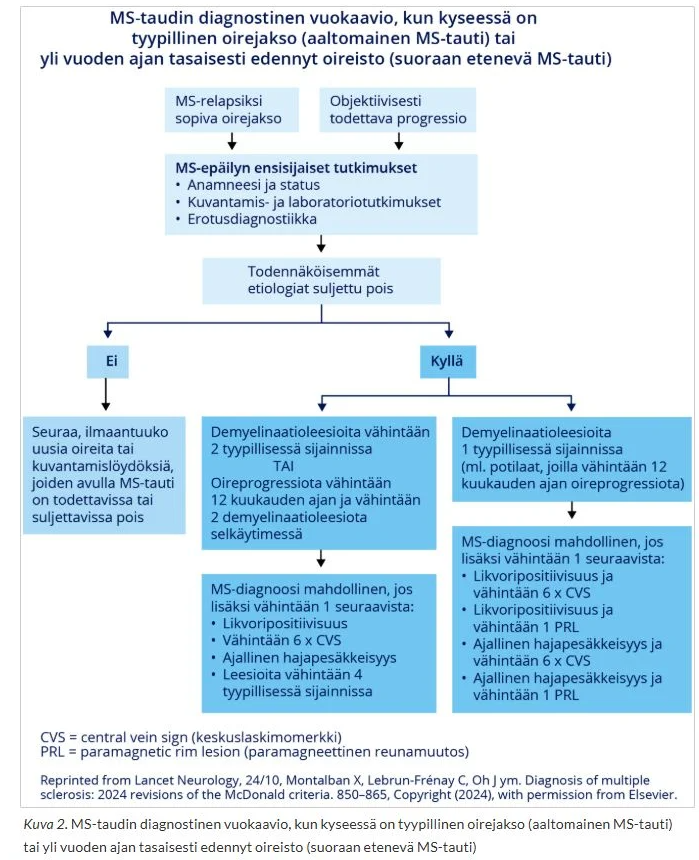
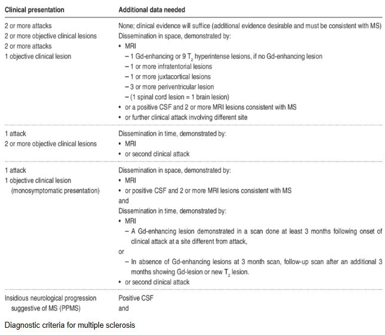

  

### Jalkaoireita

67-vuotias mies saapuu terveyskeskuksen vastaanotolle. Hänellä on anamneesissa prostatahyperplasia, verenpainetauti, sepelvaltimotauti, pitkä tupakkahistoria, mutta lopettanut tupakoinnin 5 vuotta sitten. Lääkitys atorvastatiini 40mg, ASA100mg, bisoprolol 5mg, ramipriili 5mg ja tamsulosiini 0,4mg. Selkäkipujen vuoksi viimeksi ollut vastaanotolla puoli vuotta sitten, tuolloin kiputilanne ohittunut särkylääkkeillä ja omatoimisilla harjoitteluilla. Nyt hakeutunut vastaanotolle noin kahden viikon sisään vähitellen tulleiden jalkaoireiden vuoksi. Alkuun pistelyä molemmissa jalkaterissä ja nyt viimeisen parin päivän aikana kokenut kävelyn vaikeutuneen. Statuksessa toteat aivohermostatuksen normaaliksi, yläraajoissa sensoriikan, voimat ja refleksit normaaleiksi ja symmetrisiksi. Kyykystä ylösnoustessa joutuu ottamaan tuolista tukea, samoin varpailla ja kantapäillä kävely tuottaa vaikeuksia. Sensoriikan raportoi normaaliksi. Patella +/+, akilles -/-, babinski -/-. Periferia lämmin ja pulssit palpoituvat normaalisti. 

- a. Mikä on todennäköisin diagnoosi? Perustele. (1p)
- b. Tarvitseeko potilas erikoissaanhoidon tutkimuksia? Jos tarvitsee niin mitä ja millä aikataululla? Perustele (3p)
- c. Kirjoita lähete tarpeelliseksi arvioimaasi RAD/KNF/KLF-tutkimukseen, jossa ovat kaikki tarvittavat tiedot sekä työhypoteesi
- d. Minkälaisia tuloksia odotat saavasi tästä tutkimuksesta? (1p)

  <button class="solution-button"
          data-label="a"
          data-hide-label="a - Piilota vastaus">
    a
  </button>
  

Potilaalla on alaraajapainotteinen nouseva, suhteellisen nopeasti kehittyvä oireisto, johon kuuluu etenevä lihasheikkous ja refleksipuutokset symmetrisesti sekä Babinski negatiivinen -> ei todennäköisesti ylämotoriperäistä. Pisteleviä tuntemuksia, toisaalta sensoriikka jaloissa normaali. Periferia lämmin ja pulssit ok ->  tuskin verisuoniperäinen. 

Herää epäily akuutista polyradikuliitista eli Guillain-Barrén oireyhtymästä. Polyradikuliitit ovat ryhmä hankittuja sairauksia, joissa elimistön oma immuunijärjestelmä hyökkää ääreishermostoa vastaan. Sen tyypillisiä ensioireita ovat alaraajoista alkavat pistely, puutuminen ja lihasheikkous, jotka nousevat symmetrisesti jalkateristä ylöspäin. Lihasheikkous dominoi taudinkuvaa. Laukaiseva tekijä on yleensä hengitystie- tai ruuansulatuskanavan infektio (yleisin on kampylobakteeri; muita mm. CMV, mykoplasma ja EBV), jota seuraavat oireet noin 2–3 viikon kuluttua. 

  

  <button class="solution-button"
          data-label="b"
          data-hide-label="b - Piilota vastaus">
    b
  </button>
  

Guillain-Barrén oireyhtymä etenee ylöspäin ja voi lopulta jopa 10-30%:lle aiheuttaa hengitystukea vaativan hengityshalvauksen, joka voi kehittyä todella nopeasti (jopa tunneissa). Tämän takia potilas kuuluu aina ESH:n päivystyshoitoon. Hengitystoiminnan seuranta päivystyksessä on todella tärkeää (vitaalikapasiteettia tuleekin seurata 4–6 tunnin välein).

Diagnostiikassa tutkitaan yleensä status, likvor, aivojen ja selkäytimen MRI sekä ENMG ja usein verikokeita (esim. serologia (usein myös kampylobakteeriviljely ulosteesta), muiden erotusdiagnostisten vaihtoehtojen, kuten botulismin ja infektioiden poissulkeminen). 

<li>Likvorissa suurentunut proteiinipitoisuus yhdessä kliinisen oirekuvan kanssa on diagnostinen löydös. Samalla nähdään vain lievä mononukleaarinen pleosytoosi (noin 10 leukosyyttia/mm3) (löydöstä nimitetään albumiinisytologiseksi dissosiaatioksi)</li>
  <ul>
    <li>On muistettava, että proteiinipitoisuus voi olla normaali oireiston alkupäivinä, jolloin potilas tulee hoitoon. Yleensä proteiini nousee 1. viikon jälkeen -> Tarkistuspunktio on siten hyvä tehdä toisen oireviikon lopulla, jolloin proteiinipitoisuus on suurentunut huomattavasti lähes kaikilla. Huipussaan se on 3 - 4 viikon kuluttua oireiston alusta ja alkaa sen jälkeen pienentyä. Pitoisuus voi olla tuhansia milligrammoja (viitealue alle 500 mg/l), eikä se korreloi selvästi taudin vaikeusasteeseen.</li>
  </ul>
<li>Selkäytimen MK:ssa voidaan nähdä hermojuurien tehostumista. Magneettikuvauksen merkitys on enemmän erotusdiagnostinen. Tavallisesti kuvataan selkäydin (kompressio, myelopatia) ja aivot (aivorunkopatologia). Muut radiologiset tutkimukset tehdään tapauskohtaisesti.</li>
<li>ENMG (etenkin neurografia) on rutiinitutkimus. Sairaalassa tutkimus tehdään usein ensimmäisellä oireviikolla, vaikka diagnostiset hermovauriolöydökset näkyvät tyypillisesti vasta kolmen viikon kuluttua alkuoireista.</li>
<li>Verinäytteestä tehtävää diagnostista testiä ei ole; gangliosidivasta-ainepitoisuuksia voidaan joskus käyttää harvinaisten oirekuvien diagnostiikan tukena.</li>
  

  <button class="solution-button"
          data-label="c"
          data-hide-label="c - Piilota vastaus">
    c
  </button>
  

ENMG-lähete 

67- vuotias mies, jolla taustalla prostatahyperplasia, verenpainetauti, sepelvaltimotauti, pitkä tupakkahistoria, mutta lopettanut tupakoinnin 5 vuotta sitten. Lääkitys atorvastatiini 40mg, ASA100mg, bisoprolol 5mg, ramipriili 5mg ja tamsulosiini 0,4mg. Selkäkivun takia puoli vuotta sitten vastaanotolla, tuolloin kiputilanne ohittunut särkylääkkeillä ja omatoimisilla harjoitteluilla.

2vk aikana kehittynyt jalkojen pistelytuntemus ja motorinen heikkous, kävely vaikeutunut. 

Oireisto etenkin sääristä alaspäin symmetrisesti, akillesrefleksit -/-, babinskit -/-, patella +/+. Kyykystä ylösnoustessa joutuu ottamaan tuolista tukea, samoin varpailla ja kantapäillä kävely tuottaa vaikeuksia. Periferia lämmin ja pulssit palpoituvat normaalisti. Sensoriikka subjektiivisesti normaali. Aivohermostatus normaali, yläraajoissa sensoriikka, voimat ja refleksit normaalit ja symmetriset.

P.k. alaraajojen ENMG. Akuuttiin polyradikuliittiin viittaavaa? Hermo-lihasvauriota?
  

  <button class="solution-button"
          data-label="d"
          data-hide-label="d - Piilota vastaus">
    d
  </button>
  

Tyypilliset piirteet ilmentyvät vasta n. 2-3vk kohdalla oireiden alusta, joten nyt voi jo olla löydöksiä. Ensimmäisen oireviikon aikana voidaan todeta demyelinaatiomuutoksia etenkin motorisissa hermoissa (johtumisnopeuden hidastumia, distaalilatenssien pidentymistä ja johtumiskatkoksia). Mahdolliset aksonivaurion merkit alkavat ilmaantua toisella oireviikolla. Vaikea aksonivaurio korreloi huonompaan ennusteeseen. ENMG rekisteröidään myöhemmin 1 - 2 kertaa paranemisvaiheessa.

Jo alkupäivinä voidaan usein todeta jalkojen F-vasteiden pienenemistä tai häviämistä hermojen proksimaalisten johtumiskatkosten seurauksena. Myös A-aallot lisääntyvät polyradikuliitin alkuvaiheessa. Niitä esiintyy osalla terveistäkin.

<li>F- vasteet ovat pienikokoisia motorisia vasteita, jotka ilmaantuvat suoran lihasvasteen eli M-vasteen jälkeen. F-vasteet syntyvät, kun sähköisellä stimulaatiolla aikaansaadut aktiopotentiaalit etenevät antidromisesti (vastavirtaan) motorisia hermosyitä pitkin selkäytimen etusarven motoneuroneihin. Osa näistä hermosoluista "syttyy" uudelleen ja lähettää impulssin takaisin alas lihakseen (Stimulaatiopiste → Selkäydin → Lihas) </li>
<li>Alkavissa polyneuropatioissa F-vasteiden poikkeavuudet voivat usein olla ensimmäinen poikkeava neurografialöydös. F-vasteiden määrä alenee erityisen nopeasti akuutissa polyradikuliitissa, jossa todetaan F-vasteiden määrän väheneminen tai puuttuminen proksimaalisen johtumiskatkoksen seurauksena ja mahdollisesti vielä esiin tulevien F-vasteiden latenssin pidentyminen</li>
  

### O/V

Parkinsonin taudissa todetaan kiihtyneet refleksit

  <button class="solution-button"
          data-label="Vastaus"
          data-hide-label="Piilota vastaus">
    Vastaus
  </button>
  

Väärin 

---

Parkinsonin taudissa jänneheijasteet ovat yleensä normaalit. Parkinsonin tauti on ekstrapyramidaalinen liikehäiriö, eikä siihen kuulu pyramidiradan vaurion merkkejä kuten kiihtyneitä refleksejä.

  

### O/V

Parkinsonin taudille on tyypillistä episodisen muistin vaikeus jo taudin alkuvaiheessa

  <button class="solution-button"
          data-label="Vastaus"
          data-hide-label="Piilota vastaus">
    Vastaus
  </button>
  

Väärin 

---

Parkinsonin taudissa kyllä voi kehittyä dementiaa. Tilastollisesti noin 50–80 % Parkinson-potilaista sairastuu jossain vaiheessa dementiaan, mutta tämä **tapahtuu tyypillisesti taudin myöhäisvaiheessa.**

Parkinsonin tauti kuuluu lewynkappaletaudin kanssa Lewyn kappale -tautiryhmään (LKT), jossa esiintyy muuntunutta alfasynukleiiniproteiinia (synukleopatia). Niiden tärkein erotteleva tekijä on oireiden ilmentymisjärjestys, jossa pätee ns. 1-year rule: Lewyn kappale -taudissa kognitiivinen alentuminen tapahtuu joko ennen tai viimeistään vuoden sisällä parkinsonimaisista motorisista oireista. Vrt. parkinsonin taudin dementiassa oireisto alkaa parkinsonismilla ja vasta merkittävästi myöhemmin kognitiiviset oireet.

  

### O/V

Dopamiinitransportterikuvauksen avulla voidaan selvittää onko potilaalla Parkinsonin tauti vai atyyppinen parkinsonismi eli ns. Parkinson plus sairaus

  <button class="solution-button"
          data-label="Vastaus"
          data-hide-label="Piilota vastaus">
    Vastaus
  </button>
  

Väärin 

---

Dopamiinitransportterikuvaus (DatScan) ei pysty erottamaan Parkinsonin tautia ja atyyppisia parkinsonismeja. Isotooppitutkimuksia (useimmiten dopamiinitransportteritutkimus (SPECT, CIT-SPECT, "DatScan"), mutta käytössä myös fluorodopatutkimus (PET)) käytetään pääasiassa silloin, kun tarvitaan tukea erotusdiagnostiikkaan ei-degeneratiivisista tiloista (yleisimmin essentiaalinen vapina) ja/tai potilas on nuori. 

*Atyyppiset parkinsonismit eli ns. Parkinson plus -oireyhtymät tarkoittavat sairauksia, joihin liittyy parkinsonismin lisäksi jokin muu löydös. Yleisimpiä oireyhtymiä ovat:

<li>Progressiivinen supranukleaarinen halvaus (PSP = rajoittuneet vertikaaliset silmänliikkeet)</li>
<li>Monisysteemiatrofia (MSA = huomattava ortostaattinen hypotonia tai virtsainkontinenssi jo alkuvaiheessa)</li>
<li>Kortikobasaalinen oireyhtymä (CBS = hyvin toispuolinen raajajäykkyys, raaja saattaa vääntyä dystoniseen pakkoasentoon, ”alien hand” -ilmiö (käsi toimii itsenäisesti) ja apraksia)</li>
<li>Joskus myös dementia Lewyn kappaleiden kanssa (Dementia with Lewy Bodies, DLB) eli lewynkappaletauti lasketaan Parkinson plus-diagnooseihin</li>

  

### O/V

Dopamiiniagonistit voivat aiheuttaa impulssikontrollihäiriöitä

  <button class="solution-button"
          data-label="Vastaus"
          data-hide-label="Piilota vastaus">
    Vastaus
  </button>
  

Oikein 

---

Dopamiiniagonistien yksi tunnetuimmista haittavaikutuksista on impulssikontrollin häiriöt, esim. hallitsematon uhkapelaaminen tai hyperseksuaalisuus. Muita tunnetuimpia haittoja ovat: 

<li>pahoinvointi, oksentelu</li>
<li>ortostaattinen hypotensio</li>
<li>perifeeriset turvotukset</li>
<li>uneliaisuus (jopa äkilliset nukahtamiskohtaukset)</li>
<li>muut psykiatriset oireet (hallusinaatiot, psykoosit)</li>

---

Haittavaikutusten takia hoito dopamiiniagonistit aloitetaan pienellä annokselle hitaasti annosta suurentaen usean viikon kuluessa. 

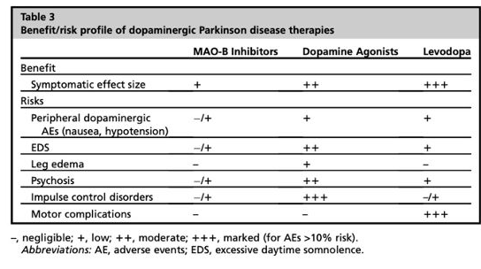
  

### O/V

Levottomat jalat oireyhtymän diagnoosia tukee statuksessa havaitut sensoriikan alenemat alaraajoissa

  <button class="solution-button"
          data-label="Vastaus"
          data-hide-label="Piilota vastaus">
    Vastaus
  </button>
  

väärin

---

Levottomien jalkojen oireyhtymässä (RLS) neurologinen status on yleensä normaali. Jos taas olisi esim. polyneuropatiaa oireiden taustalla -> värinätunto poikkeava, akillesrefleksit uupuvat, sukkamaiset tuntemukset. 
  

## Blokki 2 

### Oikean käden äkillinen heikkous

74-v nainen on varannut ajan vastaanotollesi Raision terveyskeskukseen 10 päivää sitten tapahtuneen ohittuneen käden toimintahäiriön vuoksi. Tuolloin ilman ennakko-oireita oikea käsi meni heikoksi niin, että puhelin putosi kädestä. Potilas yritti selittää tilannetta kylässä olleelle naapurilleen, mutta ei löytänyt oikeita sanoja. Tätä kesti n. 2 minuuttia. Sen jälkeen olo normalisoitui. Vasta tyttären kehotuksesta hakeutui terveyskeskukseen. Todettuina sairauksina potilaalla on verenpainetauti ja hyperkolesterolemia, joihin lääkitykset. Tupakoinut aiemmin n. 30 vuotta, nyt jo 10v sitten lopettanut. Pituus on 169cm ja paino 90kg. Nukkuu mielestään hyvin, mutta aamulla on väsynyt ja joskus päätä särkee, tyttären mukaan myös kuorsausta esiintyy. Vastaa alla oleviin kysymyksiin ranskalaisin viivoin.

- a. Mitä AVH riskitekijöitä potilaalla on? (1,5p)
- b. Voitko päätellä oirekuvan perusteella, minkä aivoverisuonitusalueen häiriöstä on ollut kyse? (0,5p)
- c. Tarvitseeko potilas neurologin arviota ja jos tarvitsee niin millä aikataululla? Mitä tutkimuksia neurologi ohjelmoi? (2p)
- d. Miten potilaan riskitekijät hoidetaan ja mitkä ovat tavoitteet? (2p)

  <button class="solution-button"
          data-label="a"
          data-hide-label="a - Piilota vastaus">
    a
  </button>
  

Ikä, verenpainetauti, hyperkolesterolemia, tupakkatausta, lihavuus ja kuorsaus (todennäköisesti uniapnea).

  

  <button class="solution-button"
          data-label="b"
          data-hide-label="b - Piilota vastaus">
    b
  </button>
  

Yläraajoihin painottuva heikkous ja puheen tuoton häiriöt viittaavat vahvasti MCA-suoneen (a. cerebri media). 

----

Voi ajatella simppelisti näin:

<li>ACA = mm. alaraajapainotteinen kontrateraalinen sensomotorinen pareesi/plegia</li>
<li>MCA =  mm. yläraaja- ja kasvopainotteinen kontralateraalinen sensomotorinen pareesi/plegia sekä puhehäiriöitä (dysfasia/dysartria) dominantin puolen infarkteissa ja non-dominantin puolen infarkteissa laajana jopa vastakkaisen puolen huomiotta jättäminen (neglect) sekä visuospatiaalisia ja visuokonstruktiivisia puutosoireita. Pään ja silmien deviaatio infarktin puolelle, jos kyseessä on laaja infarkti ja usein myös homonyymi hemianopsia</li>
<li>PCA = visuaaliset oireet (klassisesti kontralateraalinen homonyymi hemianopia ja makulan säästyminen)</li>

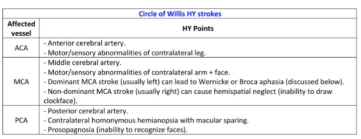
  

  <button class="solution-button"
          data-label="c"
          data-hide-label="c - Piilota vastaus">
    c
  </button>
  

Kyllä tarvitsee, alle 2 viikkoa vanha TIA-kohtaus on omatoimisella potilaalla aihe päivystyksellisille tutkimuksille. Neurologi tilaa pään kuvantamistutkimuksia,
ensisijaisesti pään TT:n ja kaulavaltimokuvantamiset (TT-angio). Päivystystutkimuksiin kuuluu lisäksi EKG (telemetria päivystyksessä olon ajan), verenpaineseuranta ja thx-rtg. Rutiinilaboratoriokokeet kuuluvat myös selvitteylyihin (perusverenkuva ja trombosyytit, CRP, kalium, natrium, kreatiniini, glukoosi, P-TT tai INR (varfariinihoito), P-APTT). Oireiden uusiessa on huomioitava myös liuotushoidon mahdollisuus, mikäli hoidon aikaikkuna ei ole umpeutunut. 

---

Potilaat ei aina tarvitse osastohoitoa. Osastohoidon aiheet: ABCD2 pistemäärä ≥ 4, kaulavaltimokuvantamista ei ole tehty (leikkausharkintaan kuuluvat potilaat), antikoagulaatiohoidon aloitus, vahva epäily kardiogeenisestä embolisaatiosta (telemetriaseuranta).

Potilaallamme kyllä ABCD2 on yli 4, joten kyseessä on suuren riskin TIA

  

  <button class="solution-button"
          data-label="d"
          data-hide-label="d - Piilota vastaus">
    d
  </button>
  

Iskeemisissä AVH-tapauksissa usein tarvitaan sekundaaripreventiivisesti antitromboottista tai antikoagulatiivista lääkitystä. Jos ei löydetä eteisvärinää (hoitona AK-lääkitys, yleensä NOAC), niin kyseessä on todennäköisesti ateroskleroottinen ongelma -> suuren riskin TIA:ssa (ABCD2 ≥ 4) ASA 100 mg × 1 + klopidogreeli 75 mg × 1 kolmen viikon ajan, jonka jälkeen yleensä klopidogreeli 75 mg × 1. 

<li>Pienen riskin TIA:ssa klopidogreeli 75 mg × 1, ASA:n ja dipyridamolin yhdistelmä 25/200 mg × 2 taijoskus pelkästään ASA 100 mg × 1</li>

---

Elämäntavat eli laihdutus ja painonhallinta tärkeää; voisivat myös vähentää kuorsaamista. Kuorsaamista ja uniapneaa tulee myös selvitellä yöpolygrafialla (potilaalla on STOP-BANG-kyselystä yli 3 pistettä).

Verenpainetavoite on kotimittauksissa alle 130/80. 

LDL-tavoite on yleensä LDL <1.4, mutta voi olla <1.8, jos kyseessä ei ole erittäin suuren riskin potilas (FINRISKI <15%, ei ole diabetesta, ei munuaisten vajaatoimintaa ja etiologiana on jokin muu kuin ateroskleroosi tai pienten suonten tauti).
  

### Ensikouristaja

35-vuotias mies tuodaan Tyksin päivystykseen saatuaan elämänsä ensimmäisen kouristuskohtauksen 2 h aiemmin. Sairaushistoriassa ei ole todettuja sairauksia eikä säännöllistä lääkitystä. Potilas työskentelee kuorma-auton kuljettajana. Tavatessa potilas on jo asiallinen, mutta hieman väsähtänyt. Neurologinen status on normaali. Kielessä näkyy puremajälki.

- a. Mitä anamnestisia seikkoja kysyt potilaalta, jotka voivat altistaa kouristukselle? (1p)
- b. Mitä tutkimuksia ohjelmoit päivystyksessä? Entä jatkoja poliklinikalle? (1p)
- c. Miten kouristuskohtaus vaikuttaa potilaan ajo-oikeuteen? (1p)

  <button class="solution-button"
          data-label="a"
          data-hide-label="a - Piilota vastaus">
    a
  </button>
  

Epileptisille kohtauksille altistavia tekijöitä ovat mm. 

<li>Päihteet (esim. alkoholi), korkeakuumeinen infektio, keskushermostoinfektio, hypoglykemia, elektrolyyttihäiriöt, äärimmäiset rasitustilat (valvominen, maratoonin juokseminen, voimamieskisat...) ja jotkut kohtauskynnystä madaltavat lääkkeet (trisykliset masennuslääkkeet, bupropioni, useat psykoosilääkkeet, tramadoli)</li>
<li>Myös rakenteelliset syyt ovat tärkeitä: esim. aivovammat, aivokasvaimet, aivoverenkiertohäiriöt, hippokampusskleroosi (taustalla esim. pitkittyneet kuumekouristukset, lapsuudessa, aivoinfektiot tai aikaisempi status epilepticus)</li>
<li>Sukuhistoria voi myös olla altistava tekijä</li>
<li>Psykiatriset sairaudet; psykogeeninen kohtaus on myös mahdollinen (kohtauskuvaus tärkeä)</li>

---

Potilaalta tulee siis kysyä erityisesti alkoholin ja muiden päihteiden käytöstä, infektio-oireista, viimeaikaisesta rasituksesta, lääkityksestä, aikaisemmista aivovammoista ja sukuhistoriasta. Anamneesissa on myös äärimmäisen tärkeää saada tapahtumakuvaus, erityisesti silminnäkijöitä haastatellen. Synkopee voi ilmentyä hyvin kouristusmaisesti, mutta se on usein anamnestisesti ja kohtauskuvauksen perusteella erotettavissa. 

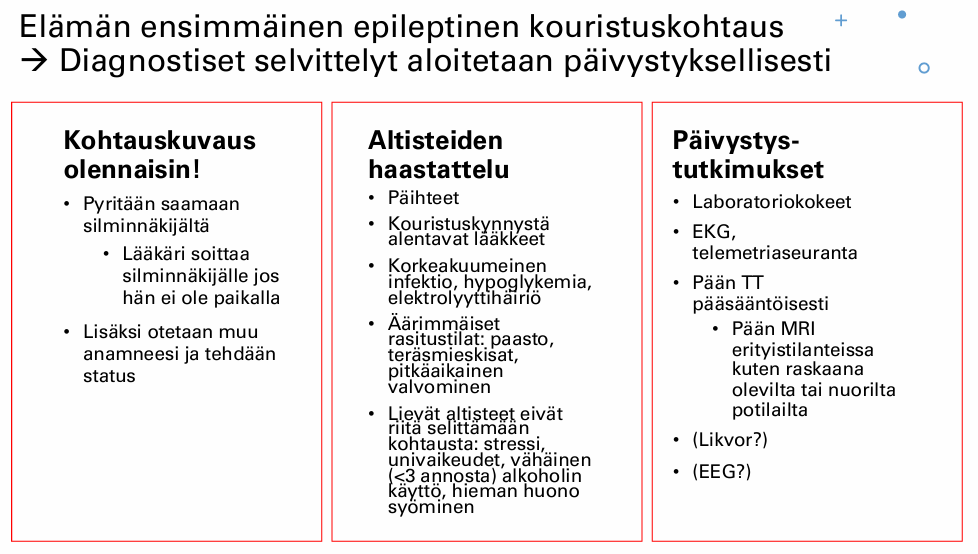
  

  <button class="solution-button"
          data-label="b"
          data-hide-label="b - Piilota vastaus">
    b
  </button>
  

EKG, telemetriaseuranta. 

Pään TT poissulkututkimukseksi. 

A-astrup, verilabrat (PVKT, Na, K, Krea, Ca-ion, CK, ALAT, CRP, TSH, glukoosi!), päihdekäyttöä epäiltäessä GT, B-PEth, U-huumeet. 

Likvor jos epäily CNS-infektiosta/ pään TT ei näy SAV, mutta oireet täsmäisivät.

Tehdään kiireellinen lähete neurologille, jos ei osoittaudu selkeää kiireellä hoidettavaa sekundaarista syytä kouristukselle (AVH, aivokasvain, infektio, aivovamma...). Seuranta 6h päivystyksessä, jonka jälkeen kotiutuminen jos kouristus ei  ole uusiutunut ja tajunnantila sekä muu status on normaali. Polikliinisesti sitten otetaan myöhemmin neurologin ohjelmoimana mm. pään MRI ja EEG-selvittelyitä.
  

  <button class="solution-button"
          data-label="c"
          data-hide-label="c - Piilota vastaus">
    c
  </button>
  

Ajokielto tulee jo koko epilepsiaselvityksien ajaksi. Yksittäisen epileptisen kohtauksen jälkeen ajokielto on R1 3kk ja R2 5v jo heti päivystyksessä määrättynä. Potilaalle siis määrätään sairaslomaa vaarallisista tehtävistä kuten rekan ajamisesta. Jos diagnosoidaan epilepsia tai todetaan 2 epileptistä kohtausta alle 3v. sisään, tulee kielto olemaan R1 vähintään 1v ja R2 käytännössä pysyvä.  
  

### Alaraajojen heikkous ja virtsaretentio

Olet kesäsijaisena keskussairaalassa ja teet myös neurologian päivystystä. Päivystykseen tulee 65-v mies, jolla on viikon sisään ilmaantunut molempien jalkojen heikkoutta ja virtsaretentio. Tutkiessasi toteat, että alaraajojen refleksit ovat vilkkaat eikä niissä ole puolieroja. Babinskit ovat positiiviset. Tuntoraja on navan tasolla ja siitä alaspäin toteat tuntopuutoksen.

- a. Millä hermoston tasolla syy todennäköisesti on? (1p)
- b. Mikä tämän voisi selittää, mitä epäilet? (1p)
- c. Mikä tutkimus olisi keskeinen? (1p)

  <button class="solution-button"
          data-label="a"
          data-hide-label="a - Piilota vastaus">
    a
  </button>
  

Kyseessä on todennäköisesti sentraalinen syy ja varsinkin herää epäily selkäydintason ongelmasta. Alaraajapareesi yhdistettynä selkeään tuntorajaan ja rakon toimintahäiröön viittaa selkäytimen ongelmaan, positiivinen Babinski ja vilkkaat refleksit ylämotoneuroniin. Leesio on todennäköisesti torakaalisen selkäytimen alatasoilla (Th10-dermatomi affisioitunut ja muutenkin lannerangan alueella cauda equinassa on enää hermojuuria eikä tiivistä ydintä). 
  

  <button class="solution-button"
          data-label="b"
          data-hide-label="b - Piilota vastaus">
    b
  </button>
  

Todennäköinen syy on selkäytimen kompressio, esimerkiksi nikamavälilevyn, maligniteetin tai absessin aiheuttamana. Voisi olla myös muu selkäytimen traumaattinen vamma.
  

  <button class="solution-button"
          data-label="c"
          data-hide-label="c - Piilota vastaus">
    c
  </button>
  

Selkärangan MRI päivystyksellisesti
  

### O/V

MS-tauti on autoimmuunitauti, jossa immuunisolut tuhoavat keskushermoston myeliiniä

  <button class="solution-button"
          data-label="Vastaus"
          data-hide-label="Piilota vastaus">
    Vastaus
  </button>
  

Oikein 

---

Multippeliskleroosi on krooninen autoimmuunisairaus, joka aiheuttaa keskushermoston myeliinin ja oligodendrosyyttien tuhoutumista. Kyseessä on tyypin IV yliherkkyysreaktio, erityisesti myelin basic -proteiinia vastaan. Soluvälitteisen (CD8-T-solut, makrofagit ja mikrogliasolut) tulehduksen ajatellaan olevan keskeisin, mutta myös B-soluilla on todennäköisesti tärkeä rooli. Aiheuttaa akuuttia myeliinin menetystä aksonien ympäriltä ja lopulta krooninen oligodendrosyyttien menetys johtaa remyelinaation epäonnistumiseen ja aksonimenetykseen.

  

### O/V

MS-tauti voi aiheuttaa myeliitin

  <button class="solution-button"
          data-label="Vastaus"
          data-hide-label="Piilota vastaus">
    Vastaus
  </button>
  

Oikein 

---

Suurimmalla osalla potilaista MS-tauti alkaa monosymptomaattisena eli ensimmäisen pahenemisvaiheen oireisto paikantuu vain yhdelle hermoston alueelle; yleisimmin:

<li>Näköhermon tulehdus (optikusneuriitti) - oireina näöntarkkuuden ja värinäön heikkeneminen ja silmän liikutteluarkuus</li>
<li>Selkäydin (myeliitti) – usein puutuminen, joskus heikkous, jossa mukana on usein rakko-oire</li>
<li>Aivorungon ja pikkuaivojen alue– esim kaksoiskuvat, silmien liikehäiriö kuten internukleaarinen oftalmoplegia, tasapainon ylläpidon vaikeus, ataksia</li>
  

### O/V

PPMS alkaa myöhemmällä iällä kuin RRMS

  <button class="solution-button"
          data-label="Vastaus"
          data-hide-label="Piilota vastaus">
    Vastaus
  </button>
  

Oikein 

---

Multippeliskleroosi (MS-tauti) voidaan jakaa kolmeen (- neljään) päätyyppiin: 

<li>Relapsoiva/remittoiva (RRMS) (yleisin)</li>
  <ul>
    <li>Tapahtuu oireiden täydellinen tai osittainen korjaantuminen relapsien (pahentumisvaiheiden) välillä; tämä muoto on n. 85%:lla potilaista alkuvaiheessa</li>
    <li>Alkaa yleensä 20-40v; yleisempää naisilla kuin miehillä</li>
  </ul>
<li>Primaaristi progredioiva (PPMS)</li>
  <ul>
    <li>Tyypillistä vähittäinen tautiprogressio heti taudin alkuvaiheista lähtien ilman oireiden korjaantumisvaiheita</li>
    <li>Alkaa yleensä n. 35-45v; yhtä yleistä miehillä kuin naisilla</li>
  </ul>
<li>Sekundaaristi progredioiva (SPMS; käytännössä RRMS:n myöhäisvaihe)</li>
  <ul>
    <li>Aaltomainen tauti voi siis edetä progressiiviseksi; 10 v. päästä sairastumisesta 50%:lla RRMS-potilaista on sekundaarisesti progressiivinen tauti (ja 25v päästä 90%:lla)</li>
  </ul>
<li>Progressivinen-relapsoiva (PRMS) (ei usein mainita ja harvinaisin)</li>
  <ul>
    <li>Selviä relapsivaiheita, mutta tauti on myös jatkuvasti progredioiva</li>
  </ul>

  

### O/V

Guillain-Barrén syndroomassa todetaan kiihtyneet refleksit

  <button class="solution-button"
          data-label="Vastaus"
          data-hide-label="Piilota vastaus">
    Vastaus
  </button>
  

Väärin 

---

Todetaan yleensä affisioituneiden alueiden jänneheijasteiden heikentymistä/puuttumista, koska kyseessä on ääreishermoston vaurio. 
  

### O/V

Guillain-Barrén syndrooma vaikuttaa vain raajojen toimintaan, mutta aivohermojen toiminta pysyy normaalina

  <button class="solution-button"
          data-label="Vastaus"
          data-hide-label="Piilota vastaus">
    Vastaus
  </button>
  

Väärin 

---

Voi esiintyä useinkin myös aivohermohalvauksia; esim. (bilateraalinen) facialispareesi jopa 50%:lla potilaista. Muita ilmentymiä ovat mm. nielemisvaikeudet (N. glossopharyngeus ja N. vagus) ja silmän liikuttajalihasten häiriöt (CN III, CN IV, CN VI) 

Aivohermojen affisioituminen on varoitus siitä, että affisioituminen on noussut aivorungon tasolle -> hengityslihakset (pallea) saattavat pian heikentyä, jolloin tehostettu seuranta tai hengityskonehoito voi tulla tarpeelliseksi. 

  

### O/V

Guillain-Barrén syndrooman hoitona käytetään plasmafereesiä

  <button class="solution-button"
          data-label="Vastaus"
          data-hide-label="Piilota vastaus">
    Vastaus
  </button>
  

Oikein 

---

GBS:n hoito toteutetaan päivystyksellisesti sairaalassa, jossa on hengitystuen mahdollisuus (voi edetä arvaamattoman nopeasti hengityslamaan ja erotusdiagnostiikkaan myös tarvitaan ESH:n tutkimuksia (likvor, MRI ja ENMG)). Hoitona on yleensä IVIG 0,4 g/kg /pv 5 päivänä; plasmafereesi nykyään harvemmin käytetty vaihtoehto, koska laskimoon annosteltava immunoglobuliini on paremmin siedetty ja se on helpommmin toteutettavissa. Periaatteessa GBS paranee itsestäänkin, mutta ilman hoitoa riski pysyvistä vaurioista ja kuolemasta on suurempi. 
  

### Huimaus on erittäin yleinen syy hakeutua lääkärin arvioon. Mitkä ovat huimauspotilaan tärkeimmät anamnestiset tiedot?

  <button class="solution-button"
          data-label="Vastaus"
          data-hide-label="Piilota vastaus">
    Vastaus
  </button>
  

Perusteellinen haastattelu on huimauksen diagnostiikan tärkein osa. Potilaalta tulee aina selvittää, mitä hän tarkoittaa huimauksella (onko kiertävää, kaatavaa, epävarmuutena tuntuvaa, keinuttavaa), onko pyörtymistä/tajunnan menetystä, onko esioireita (esim. mustumissa silmissä), pahentaako tietyt liikkeet/asennot, huippaako liikkuessa. Tosin tulee tiedostaa, että potilaat ovat yleensä huonoja kuvaamaan oireitaan ja pelkästään kuvaukseen siitä, miltä huimaus tuntuu, ei tulisi luottaa. 

Tietysti myös oireiden äkillisyys ja onko kohtauksellista/jatkuvaa, onko traumaa taustalla, onko muita liitännäisoireita (neurologiset, päänsärky, kuulonalenema, infektiot...), mitä lääkkeitä potilas käyttää, muut sairaudet ja sukuanamneesi. 

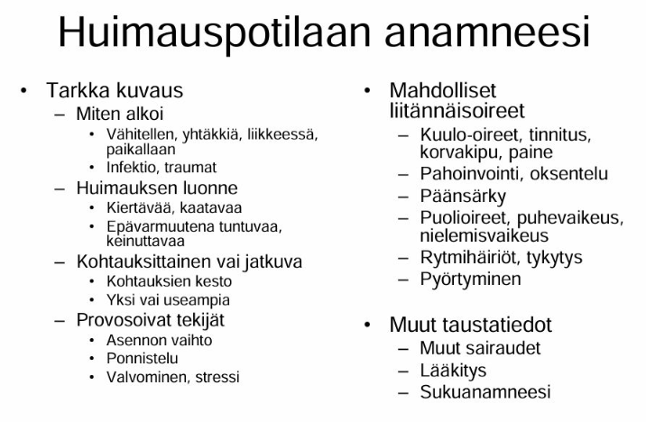
  

### Tensionaalisen päänsäryn ja migreenin keskeiset diagnostiset erot 

  <button class="solution-button"
          data-label="Vastaus"
          data-hide-label="Piilota vastaus">
    Vastaus
  </button>
  

Jännityspäänsärky on yleisin primaarinen päänsärky ja migreeni on toiseksi yleisin primaarinen päänsärky. 

<li>Tausta:</li>
  <ul>
    <li>Tensiopäänsäryssä ei usein perinnöllistä taustaa (liittyy henkiseen ja fyysiseen stressiin; sisältää sekä lihasjännityksestä johtuvat että henkisestä jännittyneisyydestä johtuvat päänsäryt; voi siis esiintyä ilman merkittävää lihaskireyttä)</li>
    <li>Sukutausta altistaa migreenipääsärylle</li>
  </ul>
<li>Esioireisuus</li>
  <ul>
    <li>Tensiopäänsäryssä ei esioireita</li>
    <li>Migreenikohtauksessa usein ennakko-oireita ja/tai auraoireita itse päänsärkyä edeltävästi. Ennakko-oireet ovat usein aika epäspesifisiä ja alkavat n. 1-3pv ennen kohtausta. Monet potilaat kuvaavat vain tunteen, että päänsärky on tulossa. Jotkut kuvaavat muutosta mielialassa, jotkut muutosta käytöksessä. Jotkut kuvaavat masennusta, kognitiivisten kykyjen laskua tai ruoanhimoa. Auraoireet kestävät n. 5-60 min ja päänsärkyvaihe 4-72h. Kohtauksen jälkeen voi vielä olla jälkioireita, jotka kestävät pari tuntia - pari päivää ja niitä voi yleensä kuvailla krapulamaisiksi</li>
  </ul>
<li>Kipukohtauksen kesto</li>
  <ul>
    <li>Tensiopäänsäryssä kipukohtaus voi kestää minuuteista-4-6h(-tai jopa kuukausia ja vuosia)</li>
    <li>Migreenikohtaus voi kestää 4-72h hoitamattomana</li>
  </ul>
<li>Päänsäryn tyyppi</li>
  <ul>
    <li>Tensiopäänsäryssä päänsärky on jatkuvaa pantamaista ja puristavaa koko pään alueella</li>
    <li>Migreenissä kipu sykkivää ja toispuoleista</li>
  </ul>
<li>Palpaatiolöydökset</li>
  <ul>
    <li>Tensiopäänsäryssä mahdollisesti aristuksia ohimoilla, takaraivossa, niskassa ja hartioilla</li>
    <li>Migreenissä ei palpoituvia kipupaikkoja kallon ulkopuolella</li>
  </ul>
<li>Fyysisen rasituksen vaikutus oireisiin</li>
  <ul>
    <li>Tensiopäänsäryssä oireet helpottavat fyysisessä rasituksessa</li>
    <li>Migreenissä oireet pahenevat fyysisessä rasituksessa</li>
  </ul>
<li>Liitännäisoireet</li>
  <ul>
    <li>Tensiopäänsäryssä ei usein liitännäisoireita tai vain yksi lievä oire kerrallaan (joskus kävellessä huimausta tai lievää pahoinvointia, mutta ei varsinaista oksentelua. Myös foto- ja fonofobiaa ilmenee. Näistä vain yksi voi olla kerrallaan!)</li>
    <li>Migreenille taas on tyypillistä, että esiintyy liitännäisoireita (ovat diagnostinen vaatimuskin; pahoinvointi, oksentelu, valo- ja ääniarkuus, komplisoituneissa jopa
puhe- ja halvaushäiriöitä)</li>
  </ul>

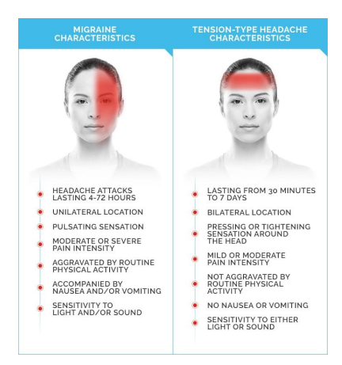
  

### Pitkäkestoinen yläraajaheikkous

53-vuotias I-tyypin diabetesta lapsuudesta asti sairastanut mies hakeutuu vastaanotollesi puolen vuoden ajan jatkuneen oikean yläraajan heikkouden vuoksi. Alkoholia käyttää >20 annosta viikossa ja tupakoi. Statuksessa toteat molempien yläraajojen distaalipainotteista heikkoutta ja käsien lihaksissa atrofiaa ja jatkuvia faskikulaatioita. Puhe on hieman puuromaista ja potilas raportoi nielemisvaikeuksia, mutta aivohermostatuksessa ei poikkeavaa. Sensoriikka normaalia. Jännevenytysheijasteet yläraajoissa selvästi vilkastuneet, enemmän oikealla. Hoffman l.a. positiivinen, babinskit indifferentit. 

- a. Tasodiagnostiikka - mihin osaan hermostoa vaurio paikantuu? Perustele. (2p)
- b. Mikä on todennäköisin syy (työdiagnoosi)? (1p)
- c. Mitä tutkimuksia neurologi ohjelmoi? (1p)
- d. Mitä löydöksiä odotat näistä tutkimuksista? (2p)

  <button class="solution-button"
          data-label="a"
          data-hide-label="a - Piilota vastaus">
    a
  </button>
  

Vaurio paikantuu sekä ylempään että alempaan motoneuroniin usealla eri tasolla (bulbaarialue ja kaularanka)

---

Distaalinen bilateraalinen yläraajaheikkous (vahvempaa oikealla), käsien atrofiaa ja faskikulaatioita, puuromaista puhetta, nielemisvaikeuksia. Aivohermostatus ok, sensoriikka ok. Yläraajarefleksit vilkastuneet, hoffman pos, babinskit indiff. 

<li>Normaali sensoriikka --> motorista systeemiä affisioiva tila, joten ääreishermoston neuropatia ja selkäytimen takajuosteen vauriot eivät ole todennäköisiä (tuskin siis selkäydinvaurio/puristustila tai diabeettinen neuropatia tai alkoholineuropatia).</li>
<li>Yläraajojen lihasheikkous, jonka yhteydessä atrofiaa, faskikulaatioita -> alamotoneuronin vaurio. Kuitenkin samalla vilkastuneet yläraajarefleksit sekä positiivinen Hoffmannin testi -> ylämotoneuronin vaurio.</li>
  <ul>
    <li>Hoffmannin testi = Yläraajojen ekvivalentti Babinskille = Ylempää motoneuronia testaava ylärajan testi, jossa potilaan keskisormen kynttä napautetaan nopeasti alaspäin. Positiivisessa tuloksessa potilas koukistaa ja abduktoi peukalonsa. Samalla voi tulla etusormen fleksio.</li>
  </ul>
<li>Puheen puuromaisuus ja nielemisvaikeudet viittaavat aivorunkotason (bulbaarialueen) ongelmaan</li>
  <ul>
    <li>Tensiopäänsäryssä ei usein liitännäisoireita tai vain yksi lievä oire kerrallaan (joskus kävellessä huimausta tai lievää pahoinvointia, mutta ei varsinaista oksentelua. Myös foto- ja fonofobiaa ilmenee. Näistä vain yksi voi olla kerrallaan!)</li>
    <li>Migreenille taas on tyypillistä, että esiintyy liitännäisoireita (ovat diagnostinen vaatimuskin; pahoinvointi, oksentelu, valo- ja ääniarkuus, komplisoituneissa jopa
puhe- ja halvaushäiriöitä)</li>
  </ul>

  

  <button class="solution-button"
          data-label="b"
          data-hide-label="b - Piilota vastaus">
    b
  </button>
  

Amyotrofinen lateraaliskleroosi (ALS) 

---

ALS on yleisin motoneuronitauti. Sille on tyypillistä etenevä sekä ylempien että alempien motoneuronien degeneraatio. Sensorisessa hermotoiminnassa häiriötä harvemmin. Ensioireena tyypillisesti toispuolisena (etenee bilateraaliseksi) käden tai alaraajan lihasten heikkous ja atrofia. Voi myös alkaa bulbaarisesti (alkuoireena puheen ja nielemisen heikentyminen; kielessä atrofiaa ja faskikulaatioita)  

  

  <button class="solution-button"
          data-label="c"
          data-hide-label="c - Piilota vastaus">
    c
  </button>
  

Amyotrofisen lateraaliskleroosin (ALS) ensisijainen diagnostiikkaa tukeva tutkimus on ENMG ja sen lisäksi tarvitaan pään ja selkäytimen MRI muiden sairauksien poissulkemiseksi. Diagnoosi kuitenkin voidaan tehdä periaatteessa kliinisestikin ESH:ssa. Laboratoriotutkimuksissa ei ole spesifisiä löydöksiä. Veren CK ja likvorin proteiini saattavat jonkin verran suurentua, jos ne mitattaisiin. 

  

  <button class="solution-button"
          data-label="d"
          data-hide-label="d - Piilota vastaus">
    d
  </button>
  

ENMG:ssä todetaan alemman motoneuronin degeneraatiolöydös. Usein tarvitaan kontrolli-ENMG (löydösten ollessa niukat, ENMG voidaan uusia 3–6 kuukauden kuluttua).

<li>Faskikulaatioita, aaltojen polyfasiaa</li>
<li>Denervoituneissa lihaksissa fibrillaatioita</li>
<li>Normaalit johtonopeudet (ei siis ole demyelinaatiohäiriö</li>
<li>Muutoksia usein oireettomissakin lihaksissa</li>
<li>Puheen puuromaisuus ja nielemisvaikeudet viittaavat aivorunkotason (bulbaarialueen) ongelmaan</li>

---

MRI on useimmiten normaali, tosin joitain epäspesifisiä löydöksiä voi olla: esim. kortikospinaaliradan hyperintensiteettejä T2- tai FLAIR-kuvissa tai lisääntynyt T1-signaali kielilihaksistossa (rasvainen korvautuminen denervaatiosta johtuen; ns. "bright tongue" sign). 
  

### Olet keskussairaalan päivystävä lääkäri ja yksityispuolelta lähetetään päivystykseen potilas, jolla on todettu pään kuvantamisessa aivoinfarkti.

- a. Mitkä ovat tärkeitä asioita, joihin kiinnität huomiota anamneesissa ja statuksessa? (2p)
- b. Mitkä ovat aivoinfarktin mahdolliset etiologiset tekijät ja miten niitä tutkitaan? (2p)
- c. Mitkä ovat sekundaaripreventiiviset hoitovaihtoehdot eri etiologioiden mukaan? (2p)

  <button class="solution-button"
          data-label="a"
          data-hide-label="a - Piilota vastaus">
    a
  </button>
  

Anamneesissa on usein tärkeintä selvittää, onko potilas liuotuskandidaatti:

<li>Kuvaus oireista; miksi otettu pään kuva. Halvaukset, aivohermojen toiminta, kognitio, yleisesti neurologiset ongelmat? Pahoinvointi, huimaus, päänsärky, tajunnan taso? Kouristelua? Miten alkoi? Pään vammaa taustalla?</li>
  <ul>
    <li>Selvä SAV-epäily (räjähdysmäisesti alkanut, elämän kovin päänsärky, usein mukana oksentelua ja niskajäykkyyttä), vaikka pään TT olisikin normaali, on liuotushoidon vasta-aihe -> usein tarkistetaan lannepiston kautta, onko verta likvorissa.</li>
  </ul>
<li>Oireiden aikataulu äärimmäisen tärkeä: Milloin alkoi? Heräsikö unesta vai tuliko keskellä päivää, kauan oireiden alusta on? </li>
  <ul>
    <li>Tärkeää siis selvittää, onko potilas rekanalisaatiohoitojen aikaikkunan sisällä</li>
  </ul>
<li>Esitiedoista perussairaudet, aikaisemmat toimenpiteet/verenvuodot ja lääkitys (etenkin RR-tauti, diabetes, hyperkolesterolemia, eteisvärinä, sepelvaltimotauti, myös voi selvitellä onko historiassa SLT ja tiedossa sydämen väliseinän aukko (paradoksikaalinen embolisaatio)</li>
  <ul>
    <li>Etenkin RR-tauti, diabetes, hyperkolesterolemia, eteisvärinä, sepelvaltimotauti, myös voi selvitellä onko historiassa SLT ja tiedossa sydämen väliseinän aukko (paradoksikaalinen embolisaatio</li>
    <li>Vasta-aiheita liuotukselle ovat aiempi spontaani intrakraniaalinen verenvuoto, GI-kanavan vuoto (3vk sisällä) tai neurokirurginen leikkaus/vaikea aivovamma/laaja aivoinfarkti (3kk sisällä)</li>
    <li>Lääkityksessä tärkeintä on selvittää, onko antikoagulatiivista hoitoa. AK-hoito hoitoannoksella (LMWH/hepariini 24h sisällä tai DOAC <48h) on vasta-aihe liuotukselle</li>
    <li>Onko tiedossa olevaa vakavaa sairautta, jonka takia elinajanodote lyhyt?</li>
  </ul>
<li>Potilaan toimintakyky ja omatoimisuus (mRS)</li>
<li>Myös elintavat (tupakointi, päihteet, ruokavalio) tärkeää selvittää myöhemmin; tosin ei näitä lähdetä kyselemään tietystikään ensimmäisenä akuutissa tilanteessa.</li>

---

Statuksessa erityisesti nopeasti:

<li>Kognitio ja tajunnan taso? Tarvittaessa intubaatio tietysti</li>
<li>Trauman merkit kehossa ja etenkin pään/kaulan alueella</li>
<li>Vitaaleissa RR, happeutuminen, lämpötila, EKG</li>
<li>Labroissa nopeasti pika-INR ja gluk; otetaan myös AVH-paketissa PVKT, na, k, krea, CRP, Gluk, TnT, CK, INR, APTT</li>

---

Lisäksi tietysti neurologinen status: 

<li>Puheen tuotto ja ymmärrys</li>
<li>Neglect</li>
<li>Silmät (osoittaako samaan suuntaan, devioiko, mustuaisissa eroja, reagoiko valoon...)</li>
<li>Halvausoireet (kasvot, kehon lihaksisto, kummalla puolella); motoriikka ja heijasteet</li>
<li>Koordinaatio</li>
<li>Sensoriikka</li>

  

  <button class="solution-button"
          data-label="b"
          data-hide-label="b - Piilota vastaus">
    b
  </button>
  

Yleensä etiologia tromboottinen/ embolinen. Iskeemisen infarktin lisäksi voi olla myös hemoraginen infarkti, mutta yleensä kun puhutaan aivoinfarktista, niin puhutaan iskeemisestä infarktista. Hemorragiset infarktit poissuljetaan akuuttivaiheessa pään natiivi-TT-kuvalla.

Tärkeimmät aivoinfarktin etiologiat ovat: sydänperäinen embolisaatio, suurten suonten ateroskleroosi (kallonsisäiset tai kaulavaltimot) (TT-/MRI-angio, tarv. DSA) ja kallonsisäisten pienten suonten tauti (pään TT/ MRI)

<li>Sydänperäisen embolisaation tärkein syy on eteisvärinä ja sitä tulee aktiisesti etsiä EKG:lla ja telemetrialla. Yleensä vielä UKG (etsitään trombeja niin sydämen lokeroista kuin aortasta), jos aivoinfarkti liittyy selvästi eteisvärinään tai akuuttiin sydäninfarktiin. Jos syytä ei löydy, voidaan harkita Holter-rekisteröintiä kotona tai osastolla.</li>
<li>Suurten suonten ateroskleroosin selvittelyissä yleensä ensisijaisesti kaulavaltimoiden TT-angiografia</li>
<li>Pienten suonten tauti usein aiheuttaa pieniä lakunaari-infarkteja, jotka tyypillisesti nähdään vain MRI:ssä</li>
<li>Tietysti myöhemmin myös selvitellään näiden riskitekijöitä, kuten hypertensiota, dyslipidemiaa (kolesterolilabrat) ja diabetesta (gluk, hba1c).</li>

---

Harvinaisempia syitä ovat mm. 

<li>Kaulavaltimodissekaatio (selvittelynä kaulasuonten tietokone- tai magneettiangiografia)</li>
<li>Paradoksaalinen embolisaatio: SLT embolisoituu ja potilaalla avoin kammioväliseinäaukko -> SLT suhteen status ja UÄ sekä sydänultra</li>

  

  <button class="solution-button"
          data-label="c"
          data-hide-label="c - Piilota vastaus">
    c
  </button>
  

  
AVH:n sekundaripreventio on todella tärkeää varsinkin alkuvaiheissa, koska AVH:n uusiutusmisriski on suurimmillaan ensimmäisten päivien ja 
viikkojen aikana, pitkäaikaisuusintariski 6,4%/vuosi (vaihtelee tietysti etiologian mukaan). Kaikille AVH-potilaille tehdään etiologian mukainen arvio sekundaaripreventiivisen verenkiertoon vaikuttavasta lääkityksestä ja sen aloitusajankohdasta. 

<li>Jos potilaalla on eteisvärinä, niin AK-hoito on ensisijainen sekundaaripreventiivinen hoito. Nykyään ensisijaisesti käytetään NOAC-lääkitystä (varfariini jos läppäperäinen eteisvärinä). Eteisvärinää pitää aktiivisesti etsiä AVH-potilailta. </li>
<li>Jos potilaalla on suurten suonten ateroskleroosi (pääasiassa kaulavaltimot) ja AVH:n puolella merkittävä kaulavaltimostenoosi (>50%), niin ensisijainen hoito on endarterektomia 2vk sisällä siihen soveltuvilla ja jatkoon klopidogreeli tai ASA+pyridamoli. Jos ahtauman aste on alle 50 %, niin ensisijainen hoito on pelkkä lääkehoito ilman kirurgiaa.</li>
<li>Pienten suonten taudissa tehdään vuotoriskin arvio ja jos se on pieni, niin ensisijaisesti aloitetaan klopidogreeli tai ASA+pyridamoli. Jos vuotoriski on iso, niin ASA yleensä.</li>
<li>Kaulavaltimodissekaatiossa infarktitilanteessa voidaan akuuttivaihe hoitaa liuotuksella kriteerien muutoin täyttyessä. Lääkehoidon tavoite liuotushoidon jälkeen – ja silloin kun potilas ei ole sitä saanut – on ehkäistä iskemian uusiutuminen ja lääkkeinä käytetään antikoagulaatiohoitoa tai asetyylisalisyylihappoa (ASA) tai DAPT-hoitoa, joista ensin mainittu on Suomessa yleisempää. Hoitoa jatketaan yleensä kuuden kuukauden ajan, minkä jälkeen, jos on jäänyt merkittävä stenoosi (arvioidaan kontrolli-CTA:lla/MRA:lla), siirrytään asetyylisalisyylihappoon. </li>

---

On myös äärimmäisen tärkeää saada yleiset riskitekijät aisoihin. Tärkeimpiä muokattavissa olevia riskitekijöitä ovat hyperlipidemia, hypertensio, hyperglykemia ja elintavat (tupakointi, alkoholin runsas käyttö, ylipaino, vähäinen liikunta). 

<li>Tavoite on yleensä LDL <1.4, mutta voi olla <1.8, jos kyseessä ei ole erittäin suuren riskin potilas (FINRISKI <15%, ei ole diabetesta, ei munuaisten vajaatoimintaa ja etiologiana on jokin muu kuin ateroskleroosi tai pienten suonten tauti).</li>
  <ul>
    <li>Hoitona siis korkea-annoksinen statiini, tarvittaessa etsetimibi ja jopa PCSK9-estäjä</li>
  </ul>
<li>Verenpaineen suhteen tavoite  kotimittauksissa <130/80 tai niin matala kuin ilman merkittäviä haittoja voidaan saavuttaa</li>
<li>Elintapamuutokset tärkeitä (tupakoimattomuus, alkoholin käyttö suositusmääriin, liikapainon vähentäminen, liikuntaa väh. 30 min päivässä, ruokavalio kuntoon yms yms.</li>

  

### Miten migreeniauran ja aivoverenkiertohäiriön aiheuttamat näköoireet eroavat oirekuvaltaan toisistaan?

  <button class="solution-button"
          data-label="Vastaus"
          data-hide-label="Piilota vastaus">
    Vastaus
  </button>
  

Migreenin näköauraoire on hitaasti tai vähintäänkin hitaammin kehittyvä (vähintään 5 minuutin aikana kehittyviä), positiivinen ja ohimenevä. Positiivinen näköoire tarkoittaa siis näkökenttään ilmestyviä ylimääräisiä ilmiöitä, kuten sahalaitakuviota tai väreilyä.  Ilmenee yleensä molempien silmien kautta samassa näkökentän puoliskossa (homonyymi oire), koska häiriö on aivokuorella. Jos potilas peittää toisen silmän, oire näkyy edelleen toisella. Joskus harvoin kyseessä voi olla verkkokalvoperäinen oire, jolloin näköhäiriö on pelkästään toisessa silmässä. 

Aivoverenkierronhäiriössä oire on äkillinen, negatiivinen eikä välttämättä ohitu. Se on maksimaalinen heti alussa eikä etene. AVH:n aiheuttama näköoire voi olla homonyyminen näkökenttäpuutos tai jos on a. ophtalmican ongelma, niin amaurosis fugax -tyylinen (toisen silmän näköpuutos). Aivoverenkiertohäiriössä on usein myös muita neurologisia puutosoireita.
  

### Lääkemuutoksia Parkinson-potilaalle

Toimit Kaarinan terveyskeskuksen vuodeosaston lääkärinä. Vuodeosastolle on otettu 81-vuotias Parkinsonin tautia sairastava mies yleistilan laskun vuoksi. Esitiedoissa
hänellä on 10 vuotta aiemmin diagnosoidun Parkinsonin taudin lisäksi TIA-kohtaus kolme vuotta aiemmin, verenpainetauti ja hyperkolesterolemia. 

Potilas on viime kuukausien aikana laihtunut ja hän on kärsinyt pahoinvoinnista ja näköhäiriöistä (ötököitä lavuaarissa, ihmishahmoja ikkunan takana). Potilaan kuulo ja kävely ovat pitkään olleet huonoja.

Statuksessa potilas on selinmakuulla. Kaikissa raajoissa toteat voimakasta lihastonuksen kasvua. Potilas ei kykene itse nousemaan istuvaan asentoon, hänet täytyy jäykkyyden vuoksi avustaa kainaloista ylös. Vapina on lievää, sitä näkyy käsissä sekä levossa että kannatuksessa. Jänneheijasteet eivät tule kunnolla esiin. Potilas on paikkaan ja aikaan desorientoitunut. 

PVK, elektrolyytin normaalit, CRP 12, kainalolämpö 37,2 C. EKG:ssa sinusrytmi 68/min. Potilaan lääkelista: ASA (Primaspan) 100 mg x 1, simvastatiini 20 mg x 1, metoklopramidi (Primperan) 10 mg x 2, losartaani (Cozaar) 50 mg x 1, pramipeksoli (Sifrol) 1.05 mg depot x 1 , levodopa/karpidopa (Sinemet) 100/25 mg 1 x 5, haloperidoli (Serenase) 1 mg x 2-3. 

Mitä lääkitysmuutoksia teet? Ilmoita muutos tai muutokset ja lyhyt perustelu (3p)

  <button class="solution-button"
          data-label="Vastaus"
          data-hide-label="Piilota vastaus">
    Vastaus
  </button>
  

Tärkeimpinä muutoksina metoklopramidi ja haloperidoli lopetetaan välittömästi. 

---

Parkinsonlääkkeiden käyttöön liittyy usein psykoosioireita (kuten potilaalla näköhäiriöitä), mutta näiden hoitoon ei saa koskaan antaa perinteisiä neuroleptejä, joista nyt tässä on käytössä **haloperidoli!**

<li>Neuroleptit toimivat dopamiinireseptorien antagonisteina ja kumoavat Parkinson-lääkityksen vaikutuksen, joka nyt johtanut potilaalla lisääntyneisiin motorisiin oireisiin</li>
<li>Pahimmillaan antipsykootit aiheuttavat malignin neuroleptioireyhtymän, jolle on tyypillistä vahva lihasjäykkyys, kuume, rabdomyolyysi ja enkefalopatia. Voi olla hengenvaarallinen. </li>
<li>Ensisijaisesti parkinsonlääkkeiden käyttöön liittyviä psykoosioireita voi hoitaa vähentämällä lääkkeitä ja karsimisessa noudetaan yleensä tiettyä järjestystä (antikolinergit -> amantadiini -> dopamiiniagonistit (potilaalla pramipeksoli) -> MAO-B-estäjät -> vasta viimeisenä levodopan ja sen tukilääkkeiden (dopadekarboksylaasin estäjät / COMT-estäjät) muutokset). Voidaan siis miettiä pramipeksolin hidasta vähentämistä ja kompensatorista levodopan nostoa, mutta neurologin konsultaation perusteella vain.</li>
<li>Joskus lääkitystä ei voida vähentää tarpeeksi ilman, että potilas jähmettyy täysin vuoteeseen. Tällöin joudutaan harkitsemaan 2. sukupolven psykoosilääkityksen aloittamista Parkinson-lääkityksen rinnalle. Käytännössä käytetään vain kahta lääkettä: ketiapiini (käytännössä ainoa sallittu PTH) ja klotsapiini (ESH:n käytössä) ja näitäkin yleensä pienillä annoksilla.</li>

---

Samoin pahoinvointilääke **metoklopramidi** toimii dopamiiniantagonistina, joten tämä tulee vaihtaa myös pois. Sallittuja ovat ondansetroni ja domperidoni (erityislupavalmiste; myös dopamiiniantagonisti, mutta ei läpäise BBB). Levodopan aiheuttama pahoinvointi johtuu usein sen konversiosta dopamiiniksi periferiassa. Joskus voi lisätä pelkän estolääkkeen määrää, mikä poistaa pahoinvoinnin vaikuttamatta itse Parkinson-oireisiin. Myös mm. dopamiiniagonisti pramipeksoli voi aiheuttaa pahoinvointia ja joskus kokeillaan dopamiiniagonistin vaihtoa toiseen dopamiiniagonistiin eli rotigotiiniin, josta on vatsaystävällisempi laastarivalmiste tarjolla. 

  

### O/V

Kaulavaltimon dissekaatio voi aiheuttaa Hornerin syndrooman 

  <button class="solution-button"
          data-label="Vastaus"
          data-hide-label="Piilota vastaus">
    Vastaus
  </button>
  

Oikein 

---

Hornerin oireyhtymä tarkoittaa sympaattisen rungon hermovaurion aiheuttamaa oirekuvaa, jolle on tyypillistä seuraava triadi: Ipsilateraalinen ptoosi + mioosi + anhidroosi. 

Taustasyitä esim. keskushermoston vauriot, keuhkojen yläosien kasvaimet, ICA:n dissekaatio, iatrogreeniset syyt. Erityisesti kun Hornerin oireyhtymään liittyy päänsärky, niin kannattaa muistaa kaulavaltimon dissekaation sekä mahdollisesti myös sarjoittaisen päänsäryn (Hortonin neuralgia, cluster headaches) mahdollisuus. Hornerin oireyhtymä voi olla kaula- ja nikamavaltimon dissekaation ainoa statuspoikkeavuus -> lähtökohtaisesti uutena kehittynyt Hornerin syndrooma vaatii päivystystutkimuksia.

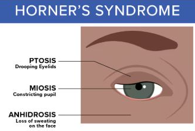
  

### O/V

Sarjoittaisen päänsäryn estohoidon ensilinjan lääke on karbamatsepiini tai okskarbatsepiini

  <button class="solution-button"
          data-label="Vastaus"
          data-hide-label="Piilota vastaus">
    Vastaus
  </button>
  

Väärin 

---

Sarjottaisen päänsäryn estohoidossa käytetään ensisijaisesti verapamiilia. Karbamatsepiini (tai okskarbatsepiini jos karbamatsepiini ei sovi) ovat taas ensisijaisia trigeminusneuralgian estolääkityksiä.

  

### O/V

Rimegepanttia voi käyttää migreenin kohtauslääkkeenä

  <button class="solution-button"
          data-label="Vastaus"
          data-hide-label="Piilota vastaus">
    Vastaus
  </button>
  

Oikein 

---

Rimegepantti (usein kauppanimellä Vydura) on CGRP-antagonisti (estää CGRP-välitteistä aivoverisuonten laajenemista sekä neurogeenistä tulehdusta ja kipusignaalien etenemistä trigeminushermon välityksellä trigeminuksen kaudaaliseen tumakkeeseen) ja on **ensisijainen migreenin kohtauslääke, jos tulehduskipulääkkeet/parasetamoli ja triptaanit eivät ole antaneet riittävää vastetta.** Rimegepantin rajoitettu Kelan peruskorvattavuus saadaan reseptimerkinnällä valitsemalla lääkemääräyksen kohdassa Erillisselvitys: ”Akuutti migreeni, triptaanit eivät sovellu”

Toinen käyttöaihe rimegepantille on episodisen migreenin estohoito. Muitakin CGRP-antagonisteja tai monoklonaalisia vasta-aineita voidaan käyttää migreenin hoidossa, mutta pääasiassa vain estohoidossa.
  

### O/V

CGRP-vasta-ainetta voi käyttää kunnes raskaustesti on positiivinen

  <button class="solution-button"
          data-label="Vastaus"
          data-hide-label="Piilota vastaus">
    Vastaus
  </button>
  

Väärin 

---

Varsinkin monoklonaalisia CGRP-vasta-aineita (s.c. tai i.v.; esim. erenumabi), mutta myös tablettimuotoisia CGRP-antagonisteja (rimegepantti, atogepantti) ei suositella raskauden aikana käytettäväksi eikä myöskään vauvaa yrittäessä. Varsinkin monoklonaalisilla vasta-aineilla on **todella pitkä puoliintumisaika** (monia viikkoja - kuukausia) -> CGRP-vasta-ainehoito tulisi keskeyttää vähintään 5-6 kuukautta ennen suunniteltua raskautta. Jos lääkettä käytettäisiin raskaustestin positiivisuuteen saakka, lääkeainetta olisi merkittäviä pitoisuuksia elimistössä sikiön kriittisen kehitysvaiheen aikana.

Vaikka tähänastinen tutkimusnäyttö ei ole osoittanut selvää teratogeenista riskiä, on vain vähän tietoja käytössä lääkkeiden turvallisuudesta. Tiedon puutteessa siis varovaisuusperiaatetta noudatetaan, varsinkin koska kyseessä ovat IgG-vasta-aineet, jotka läpäisevät istukan.

**Raskauden aikana migreenin estolääkityksen vaihtoehtoina on lähinnä metoprololi ja propranololi.** Perusterveydenhuollossa estohoitona usein käytetty kandesartaani on pääasiassa vasta-aiheinen raskaudessa, kuten myös trisykliset masennuslääkkeet ja epilepsialääkkeet. 

  

### O/V

Tensionaaliseen päänsärkyyn ei liity oksentelua

  <button class="solution-button"
          data-label="Vastaus"
          data-hide-label="Piilota vastaus">
    Vastaus
  </button>
  

Oikein 

---

Tensiopäänsäryssä ei yleensä esiinny migreenityyppisiä liitännäisoireita. Joskus harvoin näitä todetaan, mutta silloin vain yksi lievä oire kerrallaan (joskus kävellessä huimausta tai lievää pahoinvointia, mutta ei varsinaista oksentelua. Myös foto- ja fonofobiaa ilmenee.

  

### O/V

Trigeminusneuralgian akuutti hoidossa auttaa 100% hapen hengittäminen
 

  <button class="solution-button"
          data-label="Vastaus"
          data-hide-label="Piilota vastaus">
    Vastaus
  </button>
  

Väärin 

---

100% happea käytetään sarjoittaisen päänsäryn kohtaushoidossa: ensisijainen hoito on 100% O2 12-15l/min + nopeavaikutteinen triptaani (sumatriptaani s.c/i.n. tai tsolmitriptaani i.n.). Estohoitona sitten ensisijaisesti verapamiili tai litium (usein lyhyen pahenemisjakson lisähoidoksi ja estohoidon tehoa odotettaessa voidaan siltahoitona käyttää glukokortikoidia. Tablettiglukokortikoidin (prednisoni) annos on 60–100 mg/vrk 5 vrk:n ajan, minkä jälkeen annosta lasketaan 10 mg 4 vrk:n välein). 

Trigeminusneuralgian akuutissa hoidossa hyvää kohtauslääkettä ei tunneta, mutta voi kokeilla sumatriptaani 3mg s.c. ja 50mg p.o. x2 viikon ajan. Vaikean, pitkittyneen kolmoishermosäryn päivystykselliseen hoitoon suositellaan suonensisäistä fosfenytoiinia (annostus painon mukaan, monitoriseuranta) tai lidokaiinia infuusiona. Tutkimustietoa näistä hoidoista on vain vähän.

Estohoito (ensisijaisesti karbamatsepiini tai sen ollessa soveltumaton niin oksakarbatsepiini) on tärkeintä ja karbamatsepiini voidaan siis aloittaa PTH ja aloitusannos on 100 mg × 2. Sitä nostetaan tarpeen mukaan tasolle 1 200 mg/vrk. Alussa on hyvä seurata verenkuvaa ja maksaentsyymejä. Karbamatsepiinin pitoisuusmäärityksiä voi tehdä epäiltäessä yliannostelua (huimaus, väsymys, kaksoiskuvat, nystagmus). Muutaman kk:n oireettomuuden jälkeen harkitaan lääkityksen purkua.
  

### Kouristuskohtaus nuorella naisella

Toimit terveyskeskuslääkärinä, vastaanotollasi on arviossa 18-vuotias nainen, jolla taustalla astma ja ahdistuneisuushäiriö. Hän on 10 vuorokautta sitten saanut äkillisen
kohtauksen, jossa hän on menettänyt tajuntansa, ja kohtauksen nähneen kaverin mukaan samassa yhteydessä potilas on yläraajoillaan jotenkin kouristellut tai nykinyt ehkä noin minuutin ajan.

Mitä asioita sinun tulisi selvittää anamneesissa ja statuksessa? (4 p)

  <button class="solution-button"
          data-label="Vastaus"
          data-hide-label="Piilota vastaus">
    Vastaus
  </button>
  

Yleisesti tulee selvittää (silminnäkijää hyödyntäen): 

<li>Miten alkoi? Kuinka kauan kesti (ilmeisesti n. minuutin) </li>
<li>Oireiden symmetria ja luonne? Mahdolliset liitännäisoireet? Oliko silmät auki vai kiinni kohtauksen aikana? Millainen ihon väri oli kohtauksen aikana (oliko syanoosia, joka viittaisi epileptiseen kohtaukseen)? Ilmenikö inkontinenssia tai kieleen puremisen jälkiä?</li>
<li>Aiheutuiko vammoja (erityisesti löikö päätään)?</li>
<li>Millaiset muistikuvat kohtauksesta, jos sellaisia on?</li>
<li>Ennakko-oireita? Esim. aisti-, puhe-, motoriset, autonomiset oireet ja niiden paikantuminen. Oliko synkopeehen viittaavaa näön hämärtymistä, korvien soimista, hikoilua tai huonoa oloa?</li>
<li>Jälkitila: sekavuus ja sen kesto, väsymys, dysfasia, aggressiivisuus/ahdistuneisuus, motoriset oireet, neurologiset puutosoireet?</li>
<li>Mitään synkopeeta laukaisevaa tekijää, kuten kipua, pelkoa pitkää seisomista? Ilmenikö kohtaus esimerkiksi unen puutteen jälkeen?</li>
<li>Yleisesti muu anamneesi myös:</li>
  <ul>
    <li>Etiologiset tekijät eli mahdolliset aivosairaudet, kehityspoikkeavuudet, pään vammat...</li>
    <li>Lääkitys ja päihteet</li>
    <li>Runsas valvominen, raskaat fyysiset suoritukset?</li>
    <li>CNS-infektioiden riskitekijät (seksianamneesi, matkustusanamneesi, yleisesti sairastelu viime aikoina, läheisten sairastelu)</li>
    <li>Ahdistuneisuus viime aikoina?</li>
  </ul>

---

Statuksessa: 

<li>Yleisstatus: Pään ja niskan alueen palpaatio (trauman merkit), auskultaatio (infektiot ja sydämen toiminta), ihon kunto (infektiot, traumat), </li>
<li>Suu ja kieli (puremat)</li>
<li>Kattava neurologinen status</li>
<li>EKG, verenpaine</li>
<li>Labrat (a-astrup, glukoosi, PVK, elektrolyytit, Krea, ALAT, CK, TSH, CRP; troponiinit harkitusti ja päihdekäyttöä epäiltäessä puhallus, PEth, U-huumeet)</li>
  

### Kuumeilua ja sekavuutta ensikouristajalla

Toimit keskussairaalan konservatiivisena päivystäjänä. Potilaasi on 46-vuotias mies, jolla ei ole aiemmin todettuja pitkäaikaissairauksia, tupakoinut 19-vuotiaasta alkaen, alkoholia juo puolison mukaan viikonloppuisin 1–2 iltana 5–10 olutta kerralla. Ensihoito on tuonut potilaan päivystysarvioon samana päivänä tulleen hänen elämänsä ensimmäisen kouristuskohtauksen vuoksi. Hänellä on 4 päivää sitten alkanut päivittäinen fluktuoiva kuumeilu, kotona mitattuna kainalolämpö ad 39,2 C. Tämän lisäksi hän on ollut kovin väsynyt. Pientä nuhaakin ollut viime päivinä, toisaalta tälle kroonista taipumusta muutenkin. Ei muita hengitystieinfektion oireita. Potilas ja puoliso epäilleet taustalla influenssaa. Ei virtsaamisvaivoja tai ihomuutoksia. Puolison mukaan potilas on nyt parin viimeisen päivän ajan ollut puheissaan lievästi sekavan oloinen ja muistikin vaikuttanut reistailevan. 

Otetuissa laboratoriokokeissa CRP 9, lievä leukosytoosi 9.6, muilta osin PVK normaali, myoglobiini koholla 254, CK normaalirajoissa 213, Na, K ja Krea normaalit. Tavatessasi potilaan hän on tajuissaan, mutta hieman voipunut, desorientoitunut ja sekava. Potilaalla on ohjeiden noudattamisessa vaikeuksia, mikä hankaloittaa statuksen tekemistä, mutta ainakaan mitään ilmeisiä halvausoireita et totea. Paikalle saapunut puoliso arvioi potilaan voinnin olevan tällä hetkellä pitkälti samanlainen kuin jo pari edeltävää päivää ennen kouristusta. 

Mikä on ensisijainen työdiagnoosisi ja mitkä ovat tärkeimmät päivystykselliset jatkotutkimukset? (2 p)

  <button class="solution-button"
          data-label="Vastaus"
          data-hide-label="Piilota vastaus">
    Vastaus
  </button>
  

Enkefaliitti on ensisijainen työdiagnoosi, koska potilaalla on infektio-oireisto (korkea kuume), johon liittyy aivoparenkyymin affisioitumisen oireet (sekavuus, muistihäiriöt) ja fokaaliseen ärsytykseen viittaava kouristuskohtaus.

Tärkeimmät päivystykselliset jatkotutkimukset ovat likvornäyte ja pään TT. Usein lisäksi osastolla/tarv päivystyksessä jo EEG. 

<li>Päivystyksessä usein TT (erotusdiagnostiikassa tärkeä), jatkossa osastolla pään MRI tehosteaineella. Tietokonetomografia on perustutkimus muiden tautien pois sulkemiseksi. Enkefaliitin aiheuttamat TT-muutokset kehittyvät usein vasta parin vuorokauden oireilun jälkeen. Normaali TT ei sulje pois vakavankaan enkefaliitin mahdollisuutta.</li>
<li>Normaali aivo-selkäydinnestelöydös ei poissulje enkefaliittia, ja varsinkin alkuvaiheessa se voi olla normaali. Epäselvässä tilanteessa voi pyytää alkuun meningiittipaketin (solut, diffi, laktaatti, prot, gluk, bakteeriviljely ja –värjäys + varaputkia, joista otetaan PCR-tutkimuksia (esim. HSV1 ja 2, VZV, HIV, TBE yms.) Valkosolujen määrä nousee, mutta yleensä maltillisemmin kuin bakteerimeningiitissä ja valtaosa on lymfosyyttejä. Gluk normaali tai matala. Prot koholla.</li>

---

Käytännössä enkefaliitin hoito aloitetaan kliinisen epäilyn perusteella, koska selkäydinnestenäytetulokset tulevat viiveellä. Empiirinen hoito on asikloviiri+doksisykliini+keftriaksoni. Jatkohoito kohdistetaan PCR:n ja vasta-ainetutkimusten perusteella. 

<li>Matalahko CRP ja lievä leukosytoosi viittaa eniten virusenkefaliittiin (yleisin aiheuttaja on HSV), mutta ennen varmistusta käytetään empiiristä hoitoa.</li>
  

### Mihin oireisto todennäköisimmin lokalisoituu ja mikä on työdiagnoosisi? Mikä on ensisijainen jatkotutkimus? Perustele lyhyesti.

- a. 60v mies, jolla diabetes, verenpainetauti, pitkä tupakkahistoria ja runsasta alkoholinkäyttöä tulee vastaanotollesi eilen äkillisesti ilmaantuneen kivuttoman oikean alaraajan heikkouden vuoksi. Statuksessa potilas antaa hieman hitaan vaikutelman ja toteat oikean alaraajan lihasvoimat kauttaaltaan heikentyneiksi vasempaan verrattuna. Oikealta patella- ja akillesheijasteet vaimentuneet, babinskit fleksiot. Sensoriikka intakti. Yläraajoissa ei poikkeavia löydöksiä. (2p)
- b. 42v perusterve nainen tulee vastaanotollesi 3kk kestäneen, jatkuvasti pahenevan oireiston vuoksi raportoiden kipua ja tuntopuutosta vasemmalla keskisormessa, sekä vasemman yläraajan heikkoutta. Statuksessa toteat keskisormen lievän tunnonaleneman lisäksi heikkoutta kyynärnivelen extensiossa, ranteen flexiossa ja sormien extensiossa. Refleksit biceps vas/oik +/+, tri ceps -/+, brachioradialis +/+. Alaraajoissa ei poikkeavia löydöksiä. (2p)
- c. 50v mies, jolla lääkitykset verenpainetautiin, hyperkolesterolemiaan ja kilpirauhasen vajaatoimintaa, tulee vastaanotollesi kaksoiskuvien vuoksi. Oireiston ajallinen kehitys jää epäselväksi. Aamulla oireisto poissa, mutta pahenee usein iltaa kohden niin ettei pysty enää lukemaan kirjaa ellei sulje toista silmää. Statuksessa visus normaali, pupillareaktiot normaalit ja silmien liikkeet täydet, eikä aivohermojen osalta muutenkaan todeta poikkeavaa. Vasen luomi hieman oikeaa alempana, peittää osin mustuaisen. Pidempään ylöspäin katsoessa ilmaantuu kaksoiskuvia ja katseen dyskonjugaatiota. Sensomotoriikka ja refleksit raajojen osalta normaalit. (2p)

  <button class="solution-button"
          data-label="a"
          data-hide-label="a - Piilota vastaus">
    a
  </button>
  

Äkillinen kivuton asymmetrinen alaraajaheikkous, jossa alamotoneuronin vaurion kuva. Sensoriikka OK. -> mahdollisesti akuutti vasen ACA-infarkti. Ensisijainen jatkotutkimus on pään TT, kuten AVH-epäilyissä on tapana. 

<li>Huomio kohdistuu äkilliseen ykspuoleiseen kivuttomaan alaraajapareesiin, jonka yhteydessä potilaan kognitio mahdollisesti alentunut</li>
<li>Potilaalla on merkittävät vaskulaariset riskitekijät (diabetes, verenpaine, tupakka, alkoholi). Vaikka heijasteet ovat vaimentuneet (mikä voi selittyä pohjalla olevalla diabeettisella polyneuropatialla; joskus myös strokejen alkuvaiheissa on alamotoneuronilöydökset), oireen äkillinen alku, toispuoleisuus ja potilaan hitaus/psyykkinen jähmeys viittaavat vahvasti infarktiin. Kivuttomuus puhuu hermojuuriperäistä syytä vastaan.</li>

  

  <button class="solution-button"
          data-label="b"
          data-hide-label="b - Piilota vastaus">
    b
  </button>
  

Hitaasti ilmaantunut asymmetrinen yläraajan motorinen ja sensorinen alentuma, jossa keskisormen kiputila (C7 dermatomi) ja tricepsheijaste (C7:n heijaste) ei tule. Motorinen heikkous kyynärnivelen ojennuksessa, ranteen fleksiossa ja sormien ojennuksessa -> **C7-hermojuuren vaurio.**

Jatkotutkimuksena kaularangan magneettikuvaus (MK) on ensisijainen kuvantamismuoto. ENMG voi auttaa juuriperäisten ja muiden ääreishermohäiriöiden erottamisessa ja antaa tietoa vaurion iästä.

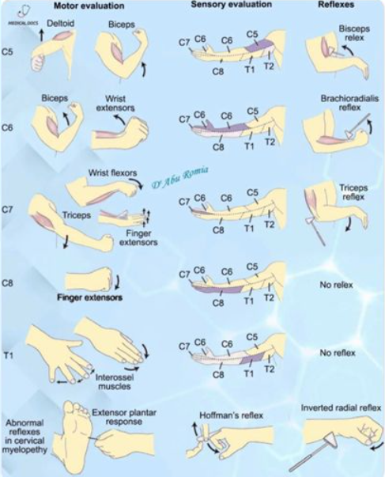
  

  <button class="solution-button"
          data-label="c"
          data-hide-label="c - Piilota vastaus">
    c
  </button>
  

Myasthenia gravis (okulaarinen muoto). Myasthenia graviksen yleisimmät ensioireet ovat silmän alueen lihasten heikkousoireet (ptoosi ja diplopia). Myastenia gravis ilmenee lihasheikkoutena, joka pahenee lihaksen käytössä; tämän takia potilaan oireet ovat poissa aamulla ja pahenevat päivän mittaan. Kaksoiskuvia/riippuluomea voi tuoda esille pyytämällä potilasta katsomaan ylöspäin pitkään -> lihasfatiikki. 

Myasthenia graviksen ensisijaisia diagnostisia tutkimuksia ovat myastenia-EMG (normaali ei riitä) ja vasta-ainelabrat (AChR ja tarvittaessa MuSK). 
  

## Blokki 4 

### Ambulanssi soittaa ennakkotiedon sairaalaan kuljetuksessa olevasta potilaasta, jolla on tunti sitten alkanut äkillisesti toisen puolen heikkous ja puhekyvyn vaikeus. Vastaa ranskalaisin viivoin.

- a. mitkä ovat todennäköisimmät erotusdiagnostiset vaihtoehdot (1p)?
- b. mitä tietoja yrität selvittää ensihoidolta ja sairaskertomusteksteistä? (2p)
- c. minkä akuuttihoitojen mahdollisuutta potilaan kohdalla arvioit? (1p)
- d. mitä tutkimuksia potilas tarvitsee sairaalassa ja mitä tekijöitä näillä tutkimuksilla pyrit selvittämään? (2p)

  <button class="solution-button"
          data-label="a"
          data-hide-label="a - Piilota vastaus">
    a
  </button>
  

Aivoverenkierron häiriöt (aivoinfarkti, aivoverenvuoto, TIA). Tietysti myös stroke mimics (mm. hypoglykemia, epileptiset kohtaukset, migreeniaurat).
  

  <button class="solution-button"
          data-label="b"
          data-hide-label="b - Piilota vastaus">
    b
  </button>
  

Pääasiassa selvittelyillä haetaan sitä, onko kyseessä liuotuskandidaatti.

Ensihoidolta: 

<li>Tarkka kellonaika, jolloin potilas viimeksi oli oireeton? Määrittää trombolyysi- ja trombektomia-ikkunan</li>
<li>Onko räjähdysmäisesti alkanutta, elämän kovinta päänsärkyä? Onko oksentelua tai niskajäykkyyttä?</li>
  <ul>
    <li>Selvä SAV-epäily, vaikka pään TT olisikin normaali, on liuotushoidon vasta-aihe -> usein tarkistetaan lannepiston kautta, onko verta likvorissa.</li>
  </ul>
<li>Mikä verenpaine? </li>
  <ul>
    <li>Systolinen verenpaine yli 185 tai diastolinen verenpaine yli 110, ellei verenpaineen alentaminen näihin rajoihin onnistu i.v. lääkkeillä, on merkattu relatiiviseksi vasta-aiheeksi liuotushoidolle. Yleisesti ottaen on kuitenkin syytä välttää koholla olevan verenpaineen merkittävää laskemista aivoinfarktin hoidon alkuvaiheessa, ellei ole syytä epäillä uhkaavaa elinvauriokomplikaatiota. Verenpainetta ei tule alentaa, jos ei olla liuottamassa potilasta ja verenpaine ei ylitä arvoa 220/120 mmHg. Jos taas liuotetaan niin tavoite on alle 185/110. Ensisijaisia verenpainelääkkeitä ovat labetaloli tai enalapriili i.v. Vasodilataattoreita ja äkillistä verenpaineen laskua tulee välttää.</li>
  </ul>
<li>Mikä verensokeri?</li>
  <ul>
    <li>Gluk <2.8 ob vasta-aihe liuotukselle (korjataan ensin >4)</li>
  </ul>
<li>Lisäksi mahdollisesti: Onko ollut pään vammaa taustalla? Infektio-oireita? Onko kouristelua esiintynyt?</li>
  <ul>
    <li>Infektio-oireista voisi mainita sen, että endokardiitti tai septinen embolus on vasta-aihe liuotukselle.</li>
  </ul>

---

Potilastiedoista:

<li>Onko käytössä antikoagulaatiohoito tai antitromboottihoito</li>
  <ul>
    <li>AK-hoito hoitoannoksella (LMWH/hepariini 24h sisällä tai DOAC <48h) on vasta-aihe liuotukselle</li>
  </ul>
<li>Potilaan toimintakyky ja omatoimisuus (mRS) ja muut sairaudet (esim. mikä voisi olla taustalla (vaikka eteisvärinää?))</li>
<li>Onko taustalla aiempi spontaani intrakraniaalinen verenvuoto, GI-kanavan vuoto (3vk sisällä) tai neurokirurginen leikkaus/vaikea aivovamma/laaja aivoinfarkti (3kk sisällä).</li>
<li>Onko tiedossa olevaa vakavaa sairautta, jonka takia elinajanodote lyhyt?</li>

  

  <button class="solution-button"
          data-label="c"
          data-hide-label="c - Piilota vastaus">
    c
  </button>
  

Iskeemiseen aivoinfarktiin liuotushoito ja mahdollisesti myös mekaaninen trombektomia. Jos kyseessä olisi aivoverenvuoto, niin neurokirurgiin yhteys ja operatiivisten hoitojen arvio. Stroke mimiceissä, kuten hypoglykemiassa hypoglykemian korjaaminen >4:ään. 
  

  <button class="solution-button"
          data-label="d"
          data-hide-label="d - Piilota vastaus">
    d
  </button>
  

Ohjelmoidaan jo etukäteen pään natiivi-TT ja liuotuslabrapaketti (pika-Gluk jos ei vielä ja B-PVKT,  P-APTT, P-CRP, PGluk, P-K, P-Na, eGFR, P-Trombai, P-INR, troponiini). Tehdään potilaan tullessa paikalle pikainen neurologinen status ja NIHSS-pisteiden arviointi ja siirretään nopeasti TT-kuville.

TT-kuvasta voidaan arvioida, onko kyseessä verenvuoto. Jos kyseessä on aivoverenvuoto, niin nopea neurokirurgin konsultaatio ja leikkaushoidon tarpeen ja mahdollisuuden arviointi. 

Jos kyseessä on non-hemorraginen infarkti ja ei ole vasta-aiheita (esim. jo laajaksi kehittynyt infarkti), niin voidaan miettiä rekanalisaatiohoitoja. Jos NIHSS on >5 (eli vähintäänkin kohtalainen) tai oirekuva on invalidisoiva, niin liuotushoito tPA:lla on ensisijainen hoitokeino, jos ei ole vasta-aiheita. Potilasta/omaisia informoidaan hoidon riskeistä (fataali vuoto) ja hyödyistä ja tämä kirjataan sairaskertomukseen myöhemmin. 

<li>Tenekteplaasi (Metalyse) i.v. on nykyään yleensä ensisijainen, koska nopeampi valmistella ja annetaan boluksena eikä vaadi infuusiota (vrt. alteplaasi)</li>
<li>Potilas on tulossa 4,5 tunnin aikaikkunan sisällä, joten ei tarvitse arvioida penumbraa, jos TT:ssä ei näy merkittävää infarktia. Aivoinfarktin liuotushoitoa harkittaessa vakiintuneen 4,5 tunnin aikaikkunan ulkopuolella on arvioitava, onko pysyvästi tuhoutunut infarktiydin vielä rajallinen (tyypillisesti alle 70 ml) ja onko kriittisesti iskeeminen alue (penumbra) edelleen merkittävästi tätä volyymia laajempi. Tässä tapauksessa otetaan siis perfuusio-TT-kuva. Aivoinfarktin liuotushoitoa voidaan siis vielä harkita oireiden alusta 4,5 tunnin jälkeenkin 9 tuntiin asti, mutta se vaatii perfuusio-TT-tutkimusta.</li>
  <ul>
    <li>Basilaaritromboosissa sallittu aikaraja on normaalia pidempi, koska basilaaritromboosin ennuste ilman rekanalisaatiota on todella huono (yli 90% kuolee).</li>
    <li>Basilaaritromboosin kliininen kuva voi olla monimuotoinen, mutta ekstensiotyyppinen jäykistely + tajunta säilyy → basillaaritrombi kunnes toisin todistettu. Mahdollisesti tajunnan häiriö ja takakierron oireet: dysartria, bulbaaripareesi, ataksia, oftalmoplegia, nystagmus, molemminpuoliset tai puolta vaihtavat raaja-oireet.</li>
  </ul>

---

Aivoinfarktin akuuttihoito voidaan nykyään toteuttaa tyypillisen tPA-liuotushoidon sijaan DAPT-hoidolla, jos potilaalla on NIHSS < 5 pistettä ja oireet eivät ole invalidisoivia. Aluksi loudaus ASA 250mg ja klopidogreeli 300mg. Jatkohoito ASA 100mg 1x1 ja klopidogreeli 75mg 1x1 3 vko ajan, jonka jälkeen jatko ensisijaisesti klopidogreeli 75mg 1x1 pysyvästi. 

---

Aivoinfarktipotilailta kuvataan useimmiten myös TT-angiografia (usein heti natiivi-TT-kuvan perään), jotta voidaan identifioida tai sulkea pois valtasuonen tukos (LVO) ja täten tarvittaessa hoitaa tukos mekaanisella rekanalisaatiohoidolla (trombektomia). Akuutti AVH-potilas siis tyypillisesti kuljetetaan ambulanssilla vähintään keskussairaalaan, jossa annetaan liuotushoito ja tehdään TT-angiografia, jolla tunnistetaan trombektomiaan soveltuvat potilaat, jotka lähetetään tarvittaessa vielä yliopistosairaalaan (tenekteplaasi on tämän takia hyvä, koska bolusannostuksen jälkeen on helppo lähettää eteenpäin). Trombektomian kriteerit aivoinfarktissa ovat seuraavat:

<li>Aikaikkuna 0-24h; jos >6h tai stroke herätessä, niin tarvitaan perfuusiokuvantamista edeltävästi</li>
<li>Akuutit suurten suonten oireiset tukokset TT- tai magneettiangiografiassa</li>
<li>NIHSS >6 tai tapauskohtaisesti lievemmissäkin</li>
<li>mRS 0-2 eli aiempi toimintakyky korkeintaan lievästi rajoittunut</li>
<li>Ei vasta-aiheita (esim. liian laaja infarkti, jodiallergia, hoitoon soveltumaton anatomia) </li>

  

### Parkinson-potilaalla ongelmia

Potilas on 65-vuotias Parkinsonin tautia 10 vuotta sairastanut mies. Tauti on bradykinesia ja rigiditeetti painotteinen, vapinaa on vain vähän. Muina sairauksina prostata hyperplasia. Hän asuu kotona vaimon kanssa ja pääasiassa hoitaa päivittäiset asiansa itse. Ongelmia aiheuttavat levodopan aiheuttamat pakkoliikkeet ja toisaalta yllättävät OFF-tilanteet, jolloin ei pääse liikkumaan. Näitä tulee päivittäin ja silloin tarvitsee vaimon apua. Lääkityksenä on selegiliini (MAO-B inhibiittori) 10mg x 1, Levodopa/karpidopa/entakaponi 100/25/200mg 2 tunnin välein ja amantadiini 100mg x2. Dopamiiniagonisti on purettu impulssikontrollihaittojen vuoksi pois. P.o. lääkitysmuutoksia käyty läpi kattavasti, mutta tilannetta ei ole saatu paremmaksi. 

Mitä arvelet neurologin ehdottavan seuraavalla kontrollikäynnillä? Perustelut? (3p)

  <button class="solution-button"
          data-label="Vastaus"
          data-hide-label="Piilota vastaus">
    Vastaus
  </button>
  

Kliinisen tilan päivittäinen vaihtelu on keskeinen ongelma pitkäaikaisessa, vuosia jatkuvassa levodopahoidossa. Tyypillistä tilanvaihtelun alkuvaiheille on se, että yksittäisen levodopatabletin vaikutusaika lyhenee (wearing-off) ja potilas alkaa kokemaan taas motorisia oireita vaikutuksen loppuvaiheilla (kuitenkin ennustettavasti). Taudin edetessä alkaa ilmenemään ennustamattomampia vaihteluja ja off-vaihe voi tulla todella nopeasti eikä levodopan annostelu nosta toimintaa taas halutulle tasolle yhtä ennustettavasti ("delayed on"). Samoin voi alkaa ilmentymään dyskinesioita dopamiinivaikutuksen ylittäessä terapeuttisen ikkunan (ON with dyskinesia; peak-dose-dyskinesia, tahattomia liikkeitä ilmaantuu lääkepitoisuuden huipun aikana). 

Levodopa-annoksen suurentaminen ei siis wearing-off tai on-off-tilanteessa auta, sillä se aiheuttaa usein vielä enemmän dyskinesioita eli tahattomia liikkeitä (liiallinen dopamiinivaikutus). **Tilanvaihteluita hoidetaan ensisijaisesti levodopan ottoväliä lyhentämällä ja kerta-annoksia pienentämällä ja/tai tukilääkkeen (kuten entakaponi) lisäämisellä / yhdistelmävalmisteeseen (esim. Stalevo) vaihtamisella. Mahdollisesti tarvittaessa voidaan kokeilla lääkeinfuusioita tai neuromodulaatiohoitoja (syväaivostimulaatio tai neuro-HIFU).**

<li>Potilaalla nyt jo levodopan annosväli 1h (tiheä) ja hän käyttää yhdistelmälääkitystä (entakaponi = COMT-estäjä; karpidopa = dopadekarboksylaasin estäjä; molemmat estävät levodopan hajoamista perifeerisesti ja nostavat sen hyötyosuutta). Potilaalla myös käytössä amantadiini, joka auttaa etenkin dyskinesioissa estämällä glutaminergisia NMDA-reseptoreita (yliaktiiviset pakkoliikkeissä).</li>
<li>Tästä huolimatta potilaalla on silti ongelmia tilanvaihteluiden kanssa -> **on aika erikoishoidoille.** Parkinsonin taudin edenneessä vaiheessa oirekuva alkaa usein vaatimaan laiteavusteista hoitoa. Käytettävissä on muutama eri hoitomuotoa kuten lääkeinfuusiot/-pumput, syväaivostimulaatio (DBS) tai neuro-HIFU</li>
  <ul>
    <li>Lääkkeellisistä hoidoisa on tarjolla jatkuva levodopa-karbidopa- tai levodopa-karbidopa-entakaponi-infuusiopumppu suoleen, jatkuva foslevodopa/foskarbidopa-infuusiopumppu s.c. ja apomorfiini-infuusiopumppu s.c.</li>
    <li>DBS on kirurginen hoitomuoto, jossa aivojen syviin osiin (esim. subtalaamiseen nukleukseen) asennetaan sähköstimulaatio. DBS-hoito on nykyisin yleisin kirurginen toimenpide edenneen Parkinsonin taudin hoidossa. Hoito ei paranna sairautta. Ikärajana on pidetty 70 vuoden ikää, mutta siitä voidaan poiketa joissakin tapauksissa potilaan muun terveydentilan ja tehtyjen esitutkimusten perusteella (klinikkakohtainen ikäraja). Taudin tulee olla kestänyt yli 5 vuotta, jolloin Parkinson plus -oireyhtymät on yleensä diagnosoitu (jos potilaalla on vaikea lääkeresistentti lepovapina, 5 vuoden aikarajaa ei tarvitse odottaa)</li>
    <li>HIFU (korkeaenerginen ultraäänihoito) on tarkasti aivojen rakenteita tuhoava menetelmä, jolla haluttu kohde voidaan “hävittää” aivoista ilman kirurgiaa. Käytetään erityisesti lääkeresistenteissä vapinoissa, mutta toimii myös tilanvaihteluissa.</li>
  </ul>

---

Epäilen neurologin ehdottavan syväaivostimulaatiota, koska potilas vaikuttaa olevan hyvä kandidaatti sille ja DBS on yleisin ja versatiilimpi vaihtoehto tilanvaihteluissa kuin HIFU sen säätömahdollisuuksien takia. 
  

### Postinkantajalla päänsärky

Toimit keskussairaalan yöpäivystäjänä. Potilas on 34-vuotias mies, aiemmin terve. Työskentelee postinkantajana. Harrastaa pyöräilyä ja kuntonyrkkeilyä. Lapsena joskus päänsärkyjä, joissa oksensi, mutta näitä ei 20 vuoteen ole ollut. Kaksi viikkoa sitten alkanut uusi päänsärky, joka herättää yöllä. On erittäin kovaa, oikealla puolella painottuen silmän seutuun. Kipu kestää noin tunnin ja saattaa alkaa hetken päästä uudestaan. Ibuprofeenia ja parasetamoli kokeillut, näistä ei apua. Nukkuminen surkeaa tästä syystä. Kivun aikana liikuskelee asunnossa, paikallaan olo vaikeaa. Kylmällä säällä ulkona on hieman parempi olo. Kipukohtauksen ohituttua vointi on normaali ja potilas on kyennyt käymään töissä ilman ongelmia. Nyt potilaalla jälleen kipu päällä, on tuskainen, kiroilee, pitelee oikeaa puolta päästään. Neurologisen statuksen tekeminen haastavaa tästä johtuen, potilaan vaikea olla paikallaan. Kasvot symmetriset, ei pupillipuolieroa ja muutoinkin toteat neurologisen statuksen normaaliksi. 

Mitä epäilet? Perustelut? Miten hoidat? (3p)

  <button class="solution-button"
          data-label="Vastaus"
          data-hide-label="Piilota vastaus">
    Vastaus
  </button>
  

Todennäköisimmäksi syyksi nousee **sarjoittainen päänsärky (Hortonin neuralgia, cluster headache).** Tyypillisenä oireena on voimakas, toispuoleinen päänsärky (yleensä silmän takana polttavana) ja erotuksena migreenistä siihen liittyy lähes aina levottomuus eli kävely helpottaa, eikä pahenna särkyä. Lisäksi oire on 95 % aina samalla puolella. Autonomiset oireet, kuten silmän verestys, kyynelvuoto ja nenän tukkoisuus ovat yleisiä, vaikka niitä nyt ei potilaallamme ole. Kohtaukseen voi myös liittyä Hornerin oireyhtymä eli ptoosi+mioosi(+anhidroosi) affisioidulla puolella.

Kohtaukset kestävät yleensä 15–180 minuuttia ja voivat toistua useita kertoja päivässä, tiettyyn vuodenaikaan liittyen, usein loppuvuonna ja keväällä. Kohtaukset alkavat useimmiten yöllä tunti - pari tuntia nukahtamisen jälkeen (voivat kuitenkin alkaa mihin tahansa aikaan) ja ovat tyypillisesti erittäin voimakkaita. 

Se on etupäässä 20–50-vuotiaiden miesten sairaus (vrt. muut primaariset päänsäryt enemmän naisilla), ja tähän ryhmään potilaammekin kuuluu. Sukupuolten välinen suhde on noin 5/1. 

**Yleensä akuuttina hoitona 100% O2 12-15l/min + nopeavaikutteinen triptaani (sumatriptaani s.c/i.n. tai tsolmitriptaani i.n.). Tarvitaan lisäksi estohoitoa, joka on ensisijaisesti verapamiili (litium 2. linjan).** Usein aloitetaan myös akuuttivaiheessa siltahoidoksi estohoidon tehon alkua odottaessa prednisoni 60-100mg/vrk 5vrk:n ajan ja sen jälkeen hidas purku. Mahansuojalääkkeen käyttöä suositellaan.

Hoitoresistenteissä muodoissa voidaan harkita myös mm. n. occipitalis -puudutusta (käytetään glukokortikoidia ja paikallispuudutetta) ja jopa kirurgista hoitoa (erilaiset stimulaattorit, kuten okkipitaalinen hermostimulaatio tai SPG-stimulaatio). 
  

### O/V

Normaali pään MRI poissulkee Alzheimerin taudin

  <button class="solution-button"
          data-label="Vastaus"
          data-hide-label="Piilota vastaus">
    Vastaus
  </button>
  

Väärin 

---

**Normaali pään MRI ei poissulje Alzheimerin tautia. Erityisesti taudin varhaisvaiheessa MRI saattaa olla löydöksetön.**

MRI kyllä kuuluu Alzheimerin taudin perusselvittelyihin. Diagnoosi on kliinis-biologinen: oireisto + biomarkkeri (MRI, likvor, PET). Löydökset MRI:ssä eivät kuitenkaan ole täysin spesifisiä Alzheimerille, vaikka olisikin tyypillisenä diagnoosia tukeva löydös. Tyypillisiä magneettikuvantamislöydöksiä amnestisessa muodossa ovat entorinaalisen kuorikerroksen ja hippokampuksen kutistuminen, yleinen sentraalinen ja kortikaalinen atrofia, posteriorisessa kortikaalisessa atrofiassa parietaalinen (usein pihtipoimuun eli gyrus cinguliin painottuva) atrofia ja logopenisessä etenevässä afasiassa vasemman posteriorisen Sylviuksen uurteen seudun ja parietaalisen kuorikerroksen atrofia

Nykyään käytetään etenevissä määrin likvortutkimuksia ja PET-kuvantamista diagnoosin vahventamisessa, varsinkin jos potilas on nuori, tilanne on epäselvä tai hatkitaan modifoivia hoitoja; niitä ei kuitenkaan absoluuttisesti aina tarvita ja jos niitä ei ole käytettävissä voi kliinisen diagnoosin tehdä, jos oirekuva on tyypillinen (amnestinen, posteriorisen kortikaalisen atrofian oirekuva tai etenevän afasian logopeninen muoto)
  

### O/V

Asetyylikoliiniesteraasin inhibiittori kuuluu aloittaa jo varhaisessa Alzheimerin taudissa

  <button class="solution-button"
          data-label="Vastaus"
          data-hide-label="Piilota vastaus">
    Vastaus
  </button>
  

Oikein 

---

Parhaiten tunnettu neurokemiallinen muutos Alzheimerin taudissa on etuaivojen pohjaosien kolinergisten neuronien, etenkin Meynertin tumakkeen (nucleus basalis) degeneraatio, mutta muissakin välittäjäaineissa, kuten glutamaatissa, on todettu muutoksia. Näiden häiriöiden korjaamisesta on todettu saatavan oireiden lievitystä ainakin osalle potilaista.

Hoidossa käytetäänkin usein asetyylikoliiniesteraasin estäjiä (rivastigmiini, donepetsiili, galantamiini) -> asetyylikoliinitasojen nosto. Varsinkin varhaisen ja lievän Alzheimerin taudin hoidossa AKE:n estäjät ovat ensisijaisia. Lääkkeet eivät paranna tai hidasta itse taudin etenemistä, mutta ne hidastavat oireiden etenemistä ja _auttavat säilyttämään potilaan toimintakyvyn ja omatoimisuuden mahdollisimman pitkään_ -> potilas selviytyy pidempään kotona. **Lääkkeen aloittamista harkitaan heti, kun diagnoosi on; ei tarvitse hidastella sen aloittamisen kanssa.**

Ennen AKE:n estäjän aloitusta tulee aina teettää EKG::tutkimus, jotta voidaan arvioida lääkehoidon siedettävyyttä ja poissulkea vasta-aiheita. Merkittävimpiä vasta-aiheita AKE:n estäjien käytölle ovat sydämen sairas sinus -oireyhtymä, ellei potilaalla ole tahdistinta, ja tuore mahahaava tai suolistoleikkaus (6 kk sisällä). Merkittävä bradykardia tai AV-johtumishäiriö on mahdollinen haittavaikutus, jos potilaalla on käytössä muita bradykardiaa aiheuttavia lääkkeitä (esim. digoksiini, beeta-adrenerginen salpaaja tai kalsiumin salpaaja). 

---

Kolinergisesti vaikuttavien lääkeaineiden lisäksi on Alzheimer-lääkkeenä yleisessä kliinisessä käytössä on memantiini, joka on glutamaatin NMDA-reseptoriantagonisti. Sitä käytetään etenkin keskivaikean tai vaikean Alzheimerin taudin hoidossa, usein yhdistettynä AKE:n estäjän kanssa. Memantiinia ei yleensä tulisi käyttää lieväasteisen Alzheimerin taudin hoidossa ja jos AKE-estäjä ei sovi, on tärkeää seurata säännöllisesti potilaan tilaa ja aloittaa memantiini, kun sairaus lähenee keskivaikeaa vaihetta.
  

### O/V

Frontotemporaalidegeneraatiossa lähimuisti voi säilyä hyvänä taudin alussa

  <button class="solution-button"
          data-label="Vastaus"
          data-hide-label="Piilota vastaus">
    Vastaus
  </button>
  

Oikein 

---

Otsa-ohimolohkorappeumat (FTLD) on muistisairauksien ryhmän yleisnimitys, jossa aivojen patologiset muutokset (erityisesti atrofia) keskittyvät aivojen etuosiin. Ryhmästä voidaan erottaa kaksi pääasiallista oirekokonaisuutta: frontotemporaalinen dementia (käyttäytymisvariantti, bvFTD) ja primaari progressiivinen afasia (kielelliset variantit)

Otsalohkodementiassa oirekuva painottuu siis alussa käyttäytymisen ja sosiaalisen vuorovaikutuksen muutoksiin, kun taas temporaalilohkoihin painottuvissa sairauksissa oirekuva painottuu alkuvaiheessa kielellisiin toimintoihin. Vasta myöhemmin taudinkulussa ilmenee muistihäiriöitä. 

  

### O/V

CERAD kuuluu perusterveydenhuollossa tehtäviin tutkimuksiin muistioireen selvittelyssä

  <button class="solution-button"
          data-label="Vastaus"
          data-hide-label="Piilota vastaus">
    Vastaus
  </button>
  

Oikein 

---

CERAD on yksi yleisimmin käytetyistä kognitiivisten toimintojen arviointimenetelmistä. Se on varsinkin vanhuksille ensisijainen muistitesti (validoitu yli 60-vuotiaille). Se sisältää laajassa muodossaan MMSE:n.

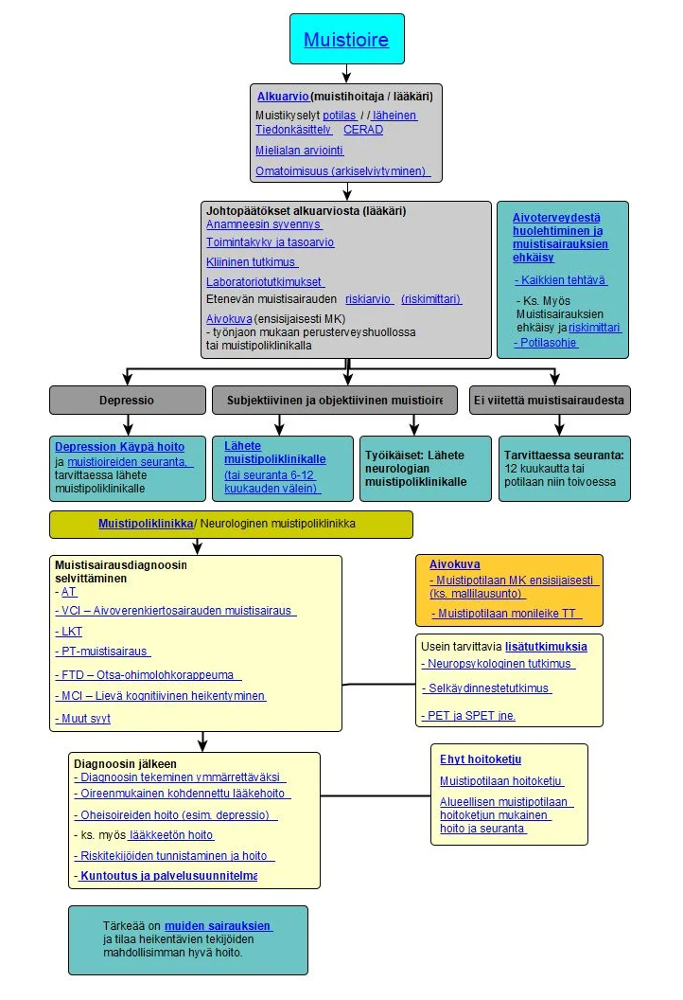
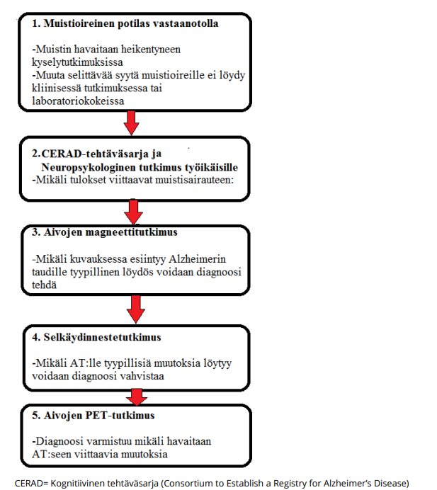
  

### O/V

Lewyn kappale -taudissa esiintyy tyypillisesti kuuloharhoja ensioireena

  <button class="solution-button"
          data-label="Vastaus"
          data-hide-label="Piilota vastaus">
    Vastaus
  </button>
  

Väärin 

---

Tyypillisiä harhoja ovat näköharhat, joita voi esiintyä jo taudin varhaisvaiheessa. 

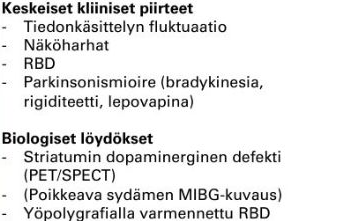

  

### O/V

PET-tutkimuksella voidaan tutkia aivojen amyloidikertymää

  <button class="solution-button"
          data-label="Vastaus"
          data-hide-label="Piilota vastaus">
    Vastaus
  </button>
  

Oikein 

---

Alzheimerin taudin diagnoosi perustuu tyypilliseen oirekuvaan sekä tautia tukeviin löydöksiin (MRI, likvor ja/tai PET). Nykyään käytetään etenevissä määrin likvortutkimuksia ja PET-kuvantamista diagnoosin vahventamisessa, varsinkin jos potilas on nuori, tilanne on epäselvä tai hatkitaan modifoivia hoitoja. 

Positroniemissiotomografia (PET) ja yksifotoniemissiotomografia (SPET) ovat isotooppikuvantamismenetelmiä, joilla on mahdollista tutkia muun muassa aivojen verenvirtausta, aineenvaihduntaa ja nykyisin myös erilaisten valkuaisaineiden, kuten beeta-amyloidin tai taun, kertymiä. Eniten käytetty PET-merkkiaine muistisairauksien tutkimuksessa on glukoosin johdannainen, fluorodeoksiglukoosi (FDG), jonka kertymä kuvaa aivojen aineenvaihduntaa ja epäsuorasti hermosolujen ja synapsien toimintaa. Tyypillinen löydös Alzheimerin taudissa on ohimo- ja päälaenlohkojen sekä precuneuksen / gyrus cingulin alueelle painottuva, usein symmetrinen glukoosin kulutuksen heikentyminen (hypometabolia).

Uudet PET-merkkiaineet mahdollistavat beeta-amyloidin tai tau-proteiinin kertymien kuvantamisen elävillä ihmisillä. Beeta-amyloidia kuvastavissa tutkimuksissa nähdään Alzheimerin taudissa tyypillisesti aivojen otsalohkojen, päälaenlohkojen ja posteriorisen gyrus cingulin alueelle painottuva merkkiainekertymä. 

  

### Aivovammat 

- a. Kuinka pitkään vamman jälkeinen tajuttomuus enintään kestää lieväksi luokittuvassa aivovammassa? (1 p)
- b. Kuinka pitkään vamman jälkeinen posttraumaattinen amnesia enintään kestää lieväksi luokittuvassa aivovammassa? (1 p)
- c. Tajuttomuuden aiheuttajat, luettele ranskalaisin viivoin. (2 p)
- d. Vertaile virusmeningiitin ja bakteerimeningiitin kliinisiä oireita ja löydöksiä. Mitä yhteistä näillä on? Miten nämä kliinisesti eroavat toisistaan?(2p)

  <button class="solution-button"
          data-label="a"
          data-hide-label="a - Piilota vastaus">
    a
  </button>
  

Enintään 30 minuuttia 

---

Aivovammapotilaan esitiedoissa on tärkeintä selvittää tajunnan menetys ja sen kesto sekä posttraumaattinen muistiaukko (PTA) ja sen kesto. Statuksessa tärkein on GCS. Nämä kaikki tulee aina kirjata aivovammapotilailta. 

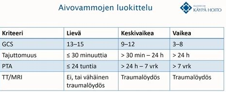

  

  <button class="solution-button"
          data-label="b"
          data-hide-label="b - Piilota vastaus">
    b
  </button>
  

Postraumaattinen amnesia (PTA) on lievässä vammassa enintään 24 tuntia 

  

  <button class="solution-button"
          data-label="c"
          data-hide-label="c - Piilota vastaus">
    c
  </button>
  

Tajuttomuuden yleisimmät syyt voi muistaa yleisessä käytössä olevasta muistisäännöstä "VOI IHME!"

<li>V = Vuoto kallon sisällä (spontaani, traumaattinen)</li>
<li>O = O2 puute (globaali anoksia, aivoinfarkti)</li>
<li>I = Intoksikaatio (muista epäillä!)</li>
<li>I = Infektio (meningiitti, enkefaliitti)</li>
<li>H = Hypoglykemia (muista mitata!)</li>
<li>M = Matala verenpaine</li>
<li>! = Simulaatio (poissulkudiagnoosi)</li>
  

  <button class="solution-button"
          data-label="d"
          data-hide-label="d - Piilota vastaus">
    d
  </button>
  

Yleistä molemmille ovat kuume, päänsärky ja niskajäykkyys ja valoherkkyys; voimakkaampia bakteerimeningiitissä.  

Virusmeningiitti on lievempi oirekuvaltaan. Oireet kehittyvät hitaammin (päivien) ja yleistila on parempi kuin bakteerimeningiitissä. Harvoin sekavuutta ja tajunnantasonhäiriötä (jolloin epäiltävä enkefaliittia, abskessia tai bakteerimeningiittiä). 

Bakteerimeningiitti on taas äkillinen ja vakava yleisinfektio. Kehittyy yleensä muutamassa tunnissa tai n. päivän sisällä) ja yleistila on vaikeampi kuin virusmeningiitissä. Korkea kuume, potilaat oikeasti sairaita. Tajunnantaso laskee monella. Kouristukset ovat mahdollisia. Meningokokki-infektioissa voi ilmentyä petekkioita iholla.  

---

Likvorlöydökset eroavat myös ja likvor onkin erottelun kannalta tärkein tutkimus. 

<li>Ulkonäkö: Bakteerimeningiitissä likvor on usein sameaa, virusmeningiitissä kirkasta</li>
<li>Valkosolut: Bakteerimeningiitissä erittäin korkeat (n. 1000-5000) ja neutrofiilivaltaisuutta; virusmeningiitissä lievemmin koholla (n. 20-200) ja lymfosyyttivaltaisuutta</li>
<li>Glukoosi: Bakteerimeningiitissä matala (< 2; bakteerit kuluttavat sokeria); virusmeningiitissä normaali (>2)</li>
<li>Laktaatti: Bakteerimeningiitissä selvästi koholla (> 2.5), virusmeningiitissä yleensä normaali (< 2)</li>
<li>Proteiini: Bakteerimeningiitissä selvästi koholla (> 1000), virusmeningiitissä lievemmin koholla (n. 500-800)</li>

  

### Raajojen pahenevaa puutumista ja polttavaa kipua

Vastaanotollesi tulee 66-vuotias juuri eläkkeelle jäänyt mies. Hänellä on aiemmin todettu hyperkolesterolemia ja käyttää lääkityksenä simvastatin 40mgx1. Alkoholinkäyttö maltillista, lopettanut tupakoinnin 10v sitten. Potilas raportoi n. vuoden verran alaraajoissa distaalisesti polviin asti puutumista ja pistelyä, sekä lieviä polttavia kipuja. Käsissä ja sormissa vastaavanlaista oiretta. Oireisto hiljalleen pahentunut. Statuksessa lihasvoimat ovat kauttaaltaan normaalit ja symmetriset. Sensoriikan osalta kosketus- ja vibraatiotunto ovat intaktit. Kylmätunto oirealueella puuttuu, kiputunto alentunut ja kevyt kosketuskin saa aikaan epämiellyttävää kivunkaltaista tuntemusta. Lihastonus ja jännevenytysheijasteet normaalit, babinskit fleksiot.

- a. Mihin oireisto lokalisoituu ja mikä on työdiagnoosisi? Perustele lyhyesti. (3p)
- b. Mitä kliinisen neurofysiologian (KNF) palveluita tilaisit tälle potilaallesi? (1p)
- c. Kirjoita KNF-lähete, jossa ovat kaikki tarvittavat tiedot sekä työhypoteesisi! (1p)
- d. Minkälaisia tuloksia odotat KNF:ltä saavasi? (1p)

  <button class="solution-button"
          data-label="a"
          data-hide-label="a - Piilota vastaus">
    a
  </button>
  

Raajojen sukka-hansikas-tyylistä puutumista, pistelyä, polttavia kipuja, kylmätunnon puuttumista, kiputunnon alentumista ja allodyniaa. Tämä sopii erityisesti sensoristen ohutsäikeiden vaurioon. 

Kosketus- ja vibraatiotunto normaalit -> ei sensoristen paksusäikeiden vaurioon viittaavaa. 

Lihasvoimat ja tonus ja refleksit normaalit, babinskit negatiiviset. Ei siis vaikuta motoristen hermojen tai keskushermoston vauriolta. 

---

Herää siis epäily ohutsäieneuropatiasta. 
  

  <button class="solution-button"
          data-label="b"
          data-hide-label="b - Piilota vastaus">
    b
  </button>
  

Vaikka potilaalla ei ole paksusäikeiden vaurioon viittaavaa, niin ohutsäieneuropatiaepäilyssäkin tutkitaan aina ennen ohutsäieselvittelyjä ENMG. ENMG mittaa siis kyllä vain paksuja säikeitä, mutta paksusäievaurioiden poissulku tai toteaminen kuuluu tehdä ennen ohutsäietutkimuksia, joita ovat ensisijaisesti termiset tuntokynnykset (QST) ja ihobiopsiat. Tilaisin siis ENMG ja sen perään QST ja ihobiopsia, josta hermosäikeiden tiheys. Aina ohutsäieselvityksiä ei kyllä tarvita, jos tulokset eivät muuttaisi mitään hoidossa. Tietysti olisi tärkeää myös selvitellä etiologiaa vähintään HbA1c ja gluk avulla, jos niitä ei ole hetkeen mitattu. 

Myös CHEP (Contact heat potentials (kipuherätevaste aivoelektrodeilta mitattuna kuumalle eli 54C)) ja LEP (Laser Evoked Potentials) usein poikkeavat.
  

  <button class="solution-button"
          data-label="c"
          data-hide-label="c - Piilota vastaus">
    c
  </button>
  

66-vuotias mies, jolla n. vuoden verran symmetrista alaraajojen distaalista puutumista, pistelyä ja polttelua. Käsissä samanlaiset oireet. Motoriikka OK, refleksit OK, sensoriikassa kylmätunto oirealueella puuttuu, kiputunto alentunut ja kevyestä kosketuksesta kivunkaltaista tunnetta.

P.k. Raajojen ENMG, QST ja ihobiopsian hermotiheysmittaus. Paksujen säikeiden vauriota ENMG:ssä? Ohutsäievaurioon viittavaa QST:ssä tai ihobiopsiassa? 
  

  <button class="solution-button"
          data-label="d"
          data-hide-label="d - Piilota vastaus">
    d
  </button>
  

ENMG on ohutsäieneuropatiassa normaali. QST:ssä kohonneet kynnykset lämpö- ja kylmätunnolle tai merkkejä poikkeavasta kipuvasteesta. Ihobiopsiassa näkyy vähentynyt hermosäikeiden tiheys epidermiksessä. 
  

