# 2024 

Tärpit monin paikoin suppeammin kirjoitettuja (ei aina tarkkaa kysymyksenasettelua tai potilastapausta kirjoitettu) wikiin kuin seuraavina vuosina. 

## Blokki 1 

### TIA vs. migreeniaura, miten oireet eroavat. Mihin lähetät potilaan, jolla ollut TIA n. viikko sitten ja millä kiireellisyydellä? 

  <button class="solution-button"
          data-label="Vastaus"
          data-hide-label="Piilota vastaus">
    Vastaus
  </button>
  

Migreenin näköauraoire on hitaasti tai vähintäänkin hitaammin kehittyvä (vähintään 5 minuutin aikana kehittyviä), positiivinen ja ohimenevä. Positiivinen näköoire tarkoittaa siis näkökenttään ilmestyviä ylimääräisiä ilmiöitä, kuten sahalaitakuviota tai väreilyä.  Ilmenee yleensä molempien silmien kautta samassa näkökentän puoliskossa (homonyymi oire), koska häiriö on aivokuorella. Jos potilas peittää toisen silmän, oire näkyy edelleen toisella. Joskus harvoin kyseessä voi olla verkkokalvoperäinen oire, jolloin näköhäiriö on pelkästään toisessa silmässä. Migreenissä motorinen oire (hemipareesi) on hyvin epätavallinen. Usein visuaalinen aura voi muuttua toiseksi auraoireeksi tai sen rinnalle voi kehittyä toinen aura, kuten puhe- tai tuntohäiriö ja sitten seuraa (ei aina) päänsärky.

Aivoverenkierronhäiriössä oire on äkillinen, negatiivinen eikä välttämättä ohitu (TIA:ssa kyllä ohittuu). Se on maksimaalinen heti alussa eikä etene. TIA:n aiheuttama näköoire voi olla homonyyminen näkökenttäpuutos tai jos on a. ophtalmican ongelma, niin amaurosis fugax -tyylinen (toisen silmän näköpuutos). Aivoverenkiertohäiriössä on usein myös muita neurologisia puutosoireita. TIA:sas myös usein motorisia oireita. TIAlta puuttuu migreenille tyypillinen asteittainen oireiden muuntuminen näköoireesta puhe- tai tuntohäiriöön ja usein näitä seuraavaan migreenipäänsärkyyn. Takaverenkierron TIAn (vertebrobasilaari-TIA) johto-oire on usein huimaus tai toispuolinen näkökenttäoire. Diagnoosi on siten vaativa, eikä vähiten siksi, että myös huimausoire liittyy usein myös migreenikohtauksiin.

**TIA-epäily kuuluu päivystykseen, jos oireistosta on alle 2 viikkoa.** Yli kaksi viikkoa vanhat kuuluvat kiireellisellä lähetteellä neurologialle. 

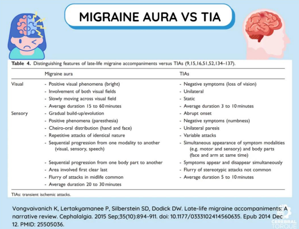
  

### Parkinson vs essentielli tremor 

Ei tarkempaa kysymyksenasettelua, mutta mieti

- a. Miten Parkinsonin tauti ja essentielli vapina eroavat toisistaan patofysiologisesti
- b. Miten erotat Parkinsonin ja essentiellin vapinan toisistaan anamneesin ja statuksen perusteella 
- c. Mitä tutkimuksia voi tilata tarkentamaan diagnoosia tarvittaessa 
- d. Ensisijaiset lääkitykset 

  <button class="solution-button"
          data-label="a"
          data-hide-label="a - Piilota vastaus">
    a
  </button>
  

Parkinsonin taudissa oirekuva johtuu progressiivisesta aivojen dopamiiniradastojen tuhoutumista. Pääasiassa siis tapahtuu substantia nigran dopaminergisten hermojen degeneraatiota ja tästä johtuen nigrostriataalisen radan häiriö. Striatumin tärkeimmät rakenteet ovat nucleus caudatus + putamen. Ne ovat siis tyvitumakkeita, joista motoriset viestit johdetaan kiihdyttävien ja inhiboivien yhteyksien kautta talamukseen. Radaston toimintahäiriö aiheuttaa motoriset oireet. Striatumin kolinerginen järjestelmä säilyy paremmin, mikä johtaa epätasapainoon kolinergisen ja dopaminergisen toiminnan välillä. Nämä neurokemialliset muutokset ovat olleet perustana Parkinsonin taudin lääkehoidon kehittämiselle.

Sairastuneihin hermosoluihin voi myös kertyä Lewyn kappaleita. Lewyn kappaleita on todettavissa jo ennen Parkinsonin taudin motoristen oireiden ilmaantumista suoliston ja sydämen autonomisissa hermoissa, hajuradan alueella ja aivorungossa varsinkin vagushermon tumakkeessa. Muutokset selittänevät potilailla usein esiintyviä pre-motorisia oireita, kuten väsymystä, REM-unen käyttäytymishäiriötä, lihaskipuja, masennusta, hajuaistin huonontumista, ummetusta yms. 

Parkinsonin tauti on yleensä sporadinen (n. 85-90%). Arviolta alle 5 % kaikista Parkinson-tapauksista johtuu yksittäisen geenin mutaatioista. Perinnöllisyys on merkittävämpää nuorena alkavissa tapauksissa. Sairauden taustalla on yleensä monen tekijän yhteisvaikutus, johon voivat kuulua perinnöllinen alttius, ikääntyminen ja ympäristötekijät. Parkinsonin tauti alkaa tavallisesti n. 50–70-vuotiaana (jos tauti puhkeaa alle 40–50-vuotiaana, sen perinnöllinen tausta on todennäköisempi ja geenitestit tulevat aiheellisiksi sukuhistorian ollessa positiivinen)

---

Essentiellin vapinan (ET) patofysiologia on epäselvempi, mutta sen uskotaan perustuvan dentatorubrotalaamisen radan oskilloivaan aktiivisuuteen, joka vastaa käsissä esiintyvän vapinan taajuutta. ET on voimakkaasti perinnöllinen, mutta selkeää geenivirhettä ei vielä ole osoitettu; periytynee autosomissa vallitsevasti. Potilaan ensimmäisen asteen sukulaisten sairastumisriski on 4–5-kertainen muuhun väestöön verrattuna. Vapina voi ilmaantua jo lapsuudessa, mutta tavallisimmin se alkaa keski-iässä tai sen jälkeen. Esiintyvyys kasvaa iän myötä ja yli 65-vuotiaiden ikäryhmässä esiintyvyys on n. 5 % (yleisin vapinasairaus). 

  

  <button class="solution-button"
          data-label="b"
          data-hide-label="b - Piilota vastaus">
    b
  </button>
  

Anamneesissa on tärkeää arvioida erityisesti vapinan tyyppi, sen kehittyminen, siihen vaikuttavat tekijät, muut oireet ja sukuhistoria.  

<li>**Vapinan laatu on tyypillisesti Parkinsonin taudissa lepovapinaa (klassisesti "pillerinpyöritystä"), kun taas essentiellissä vapinassa aktiovapinaa**</li>
  <ul>
    <li>ET:ssä vapinaa voi myös esiintyä äänessä tai päässä (tai vartalolla tai jaloissa). Pään alueella se on usein kääntöä sivulle (”ei-ei”-liike; hyvä huomata, että jos on tällaista pään vapinaa, niin silloin tila ei yleensä viittaa Parkinsonin tautiin -> "Ei-ei parkinsonismia"). Parkinsonismissakin vapinaa voi esiintyä pään (ja jalkojen yms) alueella, mutta erityisesti alahuulessa ja leuassa ja pää sen sijaan ei yleensä liiku. Parkinsonin taudissa ei myöskään ole äänen vapinaa, vaan ääni pikemminkin muuttuu hiljaisemmaksi ja monotooniseksi.</li>
    <li>On kuitenkin huomattava, että edenneissä taudeissa voi Parkinsonin taudissa lepovapinan ohella olla aktiovapinaa ja samoin ET:ssä aktiovapinan ohella lepovapinaa (joskus tästä käytetään termiä ET+, joka kuvaa ET:tä, jossa on lisäksi todettavissa lieviä neurologisia statuslöydöksiä; näitä ovat esim. lievä askelen epävarmuus, lievää dystonista asentoilua, lievä kognitiivinen alentuma, lievä neuropatia, lepovapina (ilman muita parkinsonismin piirteitä))</li>
  </ul>
<li>Parkinsonin taudissa vapina useimmiten alkaa toispuolisesti käsistä (tosin useimmiten etenee bilateraaliseksi; toisen puolen vapina kylläkin usein jää vaikeammaksi), kun taas ET:ssä symmetrisesti</li>
<li>Vaikuttavista tekijöistä yleensä kannattaa vähintään kysyä **alkoholin vaikutus oireisiin.**</li>
  <ul>
    <li>Essentiellissä tremorissa vapina tyypillisesti lievenee jo vähäisen alkoholin nauttimisen jälkeen. Ei kuitenkaan suositella hoidoksi, sillä on terveellisimpiäkin hoitomuotoja olemassa. Parkinsonin vapinaan alkoholista ei ole apua.</li>
    <li>Parkinsonin taudille on tyypillistä se, että kävely lisää käden vapinaa (voi kysyä ja myös arvioida statuksessa).</li>
    <li>Stressi, psyykkinen jännitys, vähäinen uni ja kofeiinin käyttö yleensä pahentaa varsinkin essentiaalista tremoria.</li>
  </ul>
<li>Essentiellissä tremorissa on usein todettavissa oleva positiivinen sukuhistoria (ei tietystikään aina). Myös Parkinsonissa se on mahdollinen, mutta yleensä sairaus on sporadinen.</li>
<li>Essentiellissä vapinassa ei tyypillisesti ole muita oireita kuin vapina. Parkinsonin taudissa on usein myös monia muita motorisia ja ei-motorisia oireita. Motorisia oireita ovat vapinan lisäksi mm. lihasjäykkyys, hypokinesia, tasapaino-ongelmat, kävelyvaikeudet ja mikrografia (pieni käsiala). Autonomisen hermoston häiriöt ovat yleisiä, samoin psykiatriset komorbiditeetit, kuten masennus ja ahdistuneisuus. Usein myöhäisessä vaiheessa ilmenee myös kognitiivisia häiriöitä, kuten hidastunutta ajatuksenkulkua ja lopulta jopa dementiaa. Ennakko-oireina on voinut jopa 20 vuotta ennen motorisia oireita ilmentyä mm. ummetusta, hajuaistin heikentymistä, REM-unen käyttäytymishäiriötä, päiväaikaista väsymystä ja lihaskipuja. </li>

---

Statuksessa tulee erityisesti arvioida:

<li>Vapina niin levossa (lepovapina), kannatuksessa (aktiovapina) kuin SNK:ssa (intentiovapina)</li>
<li>Vapinan arviossa on myös hyvä tutkia yläraajojen hienomotoriikkaa Arkhimedeen spiraalin, suorien viivojen piirtotestin ja lyhyen kirjoitustehtävän avulla. Nämä yleensä skannataan ja liitetään potilasasiakirjoihin. Parkinsonin taudille on tyypillistä vapinan väheneminen piirtäessä ja piirtämisen onnistuminen ihan hyvin, kun taas ET:ssä vapina on aktiossa juuri pahempaa. Parkinsonin taudissa kuitenkin käsiala menee usein pieneksi (mikrografia).</li>
<li>Tulee tutkia, onko Parkinsonin tautiin viittaavaa: Testataan rigiditeetti. Arvioidaan hypokinesia sormien naputuksella, nyrkistyksellä, DDK:lla ja jalkojen tamppaamisella. Posturaalinen instabiliteetti voidaan testaa mm. pull-testillä (vedetään potilasta takaapäin ja arvioidaan, onnistuuko tasapainottamaan itsensä nopeasti). Arvioidaan onko kävely parkinsonistista.</li>

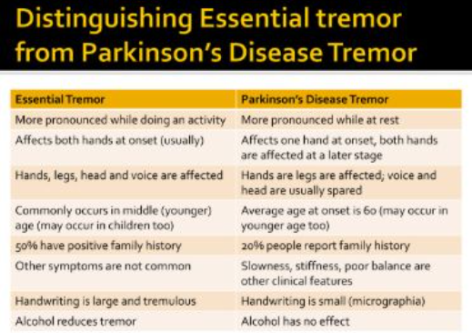
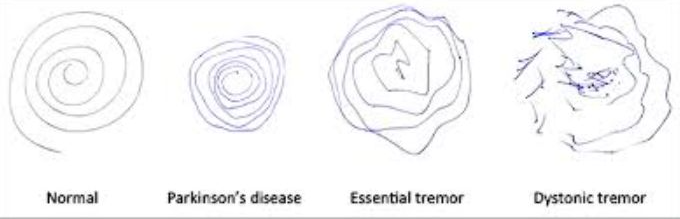
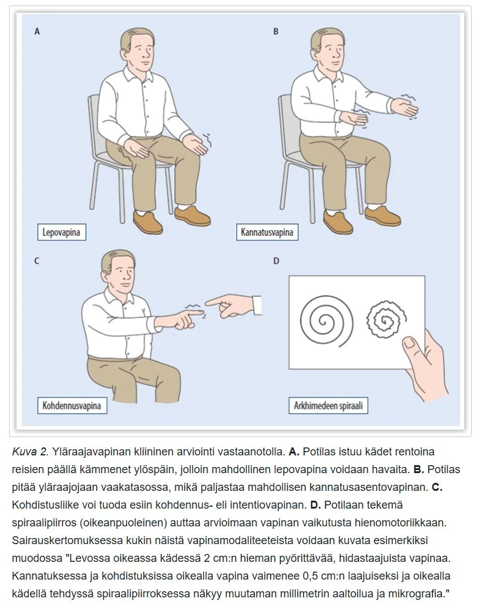
  

  <button class="solution-button"
          data-label="c"
          data-hide-label="c - Piilota vastaus">
    c
  </button>
  

Kummankaan taudin diagnoosi ei vaadi yleensä kuvantamistutkimuksia ja diagnoosit ovat ensisijaisesti kliinisiä. Parkinsonin taudin diagnoosista vastaavat neurologit; epäilyn herätessä potilas lähetetään neurologialle. Essentiellin vapinan hoito ja diagnostiikka on PTH:n heiniä. Verikokeillaakaan sairauksia ei voida todeta, mutta niitä usein määrätään, jotta voidaan varmistaa, että kyse ei ole jostain muusta sairaudesta. MRI-kuvantamista (toissijaisesti TT) käytetään myös joskus toisten aiheuttajien poissulkemiseen; eivät siis osoita spesifisiä muutoksia. 

Valikoiduissa tapauksissa käytetään ns. dopamiinikuvantamista (CIT-SPECT “DatScan”), jossa mitataan dopamiinia tuottavien hermosolujen määrä tyvitumakealueella. Se auttaa erottelemaan Parkinsonin taudin ei-degeneratiivista tiloista kuten juuri essentiaalisesta vapinasta. Essentiaalisessa vapinassa, lääkeparkinsonismissa ja vaskulaarisessa parkinsonismissa dopaminergisen järjestelmän toiminta on normaalia, kun taas Parkinsonin taudissa se on poikkeavaa. Dopamiinitransportterikuvaus ei kuitenkaan pysty erottamaan Parkinsonin tautia ja atyyppisiä parkinsonismeja (Parkinson-plus-taudit). 
  

  <button class="solution-button"
          data-label="d"
          data-hide-label="d - Piilota vastaus">
    d
  </button>
  

Kumpaankaan ei ole parantavaa hoitoa. Ensisijaisesti hoidetaan molempia lääkityksellä, mutta tarvittaessa neuromodulaatiohoitoja, kuten syväaivostimulaatiota (DBS) tai neuro-HIFU:a voidaan miettiä. 

Parkinsonin taudin hoidossa (ESH:n homma) ensisijainen lääkitys on yleensä levodopa (yhdessä aina yleensä karbidopa tai benseratsidi ja vielä usein COMT-estäjänä esim. entakaponi). Myös MAO-B-estäjiä, dopamiiniagonisteja ja amantadiinia on mahdollista käyttää. Antikolinergejä (esim. biperideeni) voidaan joskus käyttää vapinan hoitoon. 

Essentiellin vapinan hoidossa (PTH:n homma ensisijaisesti) ensisijainen lääkitys on propranololi, tarvittaessa voidaan miettiä gabapentiiniä (tai harvemmin topiramaattia), jos propranololi on vasta-aiheinen/ei sovi/tehoton. Erityislupavalmisteena vaikeisiin tapauksiin ESH:ssa käytössä primidoni, joskus myös botuliinitoksiini-injektiot lihaksiin.
  

### Polyneuropatia

- a. oireet ja statuslöydökset
- b. kolme aiheuttajaa
- c. kolme neuropaattisen kivun lääkettä

  <button class="solution-button"
          data-label="a"
          data-hide-label="a - Piilota vastaus">
    a
  </button>
  

Polyneuropatia on termi, joka tarkoittaa useita ääreishermoja laaja-alaisesti affisioivaa toimintahäiriötä. Polyneuropatia voi kohdistua sensorisiin (myös ohuet säikeet), motorisiin tai autonomisiin hermosäikeisiin tai kaikkiin näihin. Useimmiten (mutta ei välttämättä) symmetrinen, alkaa yleensä hermojen distaaliosissa ja leviää vähitellen proksimaalisesti. 

Sensorisia oireita

<li>Tuntopuutokset / tunnon alenema (voi olla niin kosketustuntoa (käsillä ja monofilamentilla), värinätuntoa (ääniraudalla) kuin asentotunnon alenemaa); enemmän paksusäievaurioon viittaavaa</li>
<li>Kipu/Polttelu/Pistely/Puutuminen/Kylmääminen (burning feet); enemmän ohutsäievaurioon viittaavaa</li>
<li>Allodynia ja hyperalgesia; enemmän ohutsäievaurioon viittaavaa</li>
<li>Lämpötunnon alenema; enemmän ohutsäievaurioon viittaavaa</li>

---

Motorisia oireita (alamotoneuronivaurion piirteet)

<li>Lihasheikkous, lihasatrofia</li>
<li>Faskikulaatioita</li>
<li>Vähentynyt tonus</li>
<li>Heikentyneet refleksit</li>
<li>Babinski negatiivinen</li>

---

Autonomisia oireita 

<li>GI-kanava (mm. gastropareesi, oksentelutaipumus, ripuli/ummetus, syljen erityksen vähentyminen)</li>
<li>Virtsarakko (mm. rakon täyttymisen havaitsemattomuus, rakon osittainen tyhjentäminen)</li>
<li>Verenkiertoelimistö (lepotakykardia, ortostaattinen hypotensio, angina pectoris -oireiden puuttuminen, erektiohäiriöt)</li>
<li>Iho (hikoiluhäiriöt; pääasiassa anhidroosi ja kuumaintoleranssi, joka voi ilmetä kompensatorisena liikahikoiluna muilla alueilla)</li>

----

Kombinoituja

<li>Tasapaino-ongelmat (proprioseptiikan ja yleisen sensoriikan alenema sekä lihasheikkoudet taustalla)</li>
<li>Virheasennot, varsinkin korkea jalkaholvi ja vasaravarpaat tyypillisiä. Motorinen denervaatio -> lihasatrofia -> lihasepätasapaino -> virheasento. Proprioseptiikan ja kiputunnon alenema -> keho ei enää osaa korjata asentoaan automaattisesti; potilas saattaa kävellä paino jatkuvasti jalkaterän ulkosyrjällä tai tietyillä nivelillä huomaamattaan -> aiheuttaa nivelten kulumista ja luiden hitaampaa muovautumista virheasentoon.</li>
<li>Polyneuropatia vaurioittaa usein myös pienten hikirauhasten toimintaa sääteleviä hermoja (autonominen neuropatia) -> kuivumat ja halkeamat -> infektiot. Vaurioille altistaa myös tietysti virheasennot ja sensoriikaan häiriöt, kun potilas ei tunne vaurioidenh kehittymistä.</li>

  

  <button class="solution-button"
          data-label="b"
          data-hide-label="b - Piilota vastaus">
    b
  </button>
  

Polyneuropatioiden kaksi yleisintä yksittäistä syytä ovat **diabetes ja alkoholi.** Näiden jälkeen yleensä mainitaan **B12-vitamiinin puute,** muut syyt ovat varsin harvinaisia (TSH kannattaa usein kuitenkin tarkastaa; hypotyreoosi voi myös siis aiheuttaa). Noin neljäsosassa tapauksista syy ei selviä tarkoissakaan tutkimuksissa. 

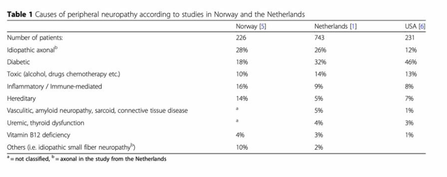
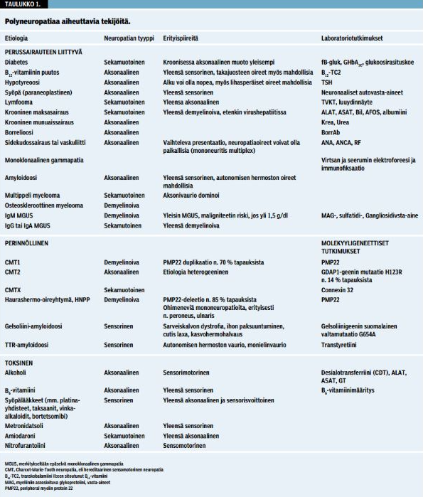
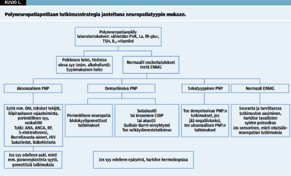
  

  <button class="solution-button"
          data-label="c"
          data-hide-label="c - Piilota vastaus">
    c
  </button>
  

Ensi linjan vaihtoehtoja neuropaattisen kivun hoitoon ovat trisykliset masennuslääkkeet (esim. nortriptyliini), SNRI-lääkkeet (esim. venlafaksiini tai duloksetiini) ja gabapentinoidit (esim. pregabaliini tai gabapentiini). 
  

### Potilastapaus virusmeningiitistä. Mikä diagnostinen tutkimus ja mitkä löydökset siinä? Hoito?

Ei siis tarkempaa potilastapausta annettu wikissä. Mikä on (virus)meningiitin tärkein diagnostinen tutkimus ja mitä virusmeningiitissä siinä nähdään. Miten virusmeningiitti hoidetaan?

  <button class="solution-button"
          data-label="Vastaus"
          data-hide-label="Piilota vastaus">
    Vastaus
  </button>
  

Meningiittiepäilyssä ensisijainen tutkimus on likvor (lannepisto), josta katsotaan vähintään solut, diffi, laktaatti, prot, gluk, bakteeriviljely ja –värjäys + varaputkista yleensä PCR-tutkimuksia. 

Virusmeningiitissä likvorissa on:

<li>Valkosoluja tyyypillisesti 20-200 *106/l ja tämä lievä leukosytoosi on lymfosyyttivoittoista</li>
<li>Glukoosi > 2 mmol/l (normaali tai lievästi alentunut)</li>
<li>Laktaatti normaali (< 2)</li>
<li>Proteiinipitoisuus 500-800 mg/l (lievästi koholla)</li>
<li>Likvori on ulkonäöltään kirkas</li>

---

Hoito on virusmeningiitissä lähtökohtaisesti oireenmukainen ja sairaalahoito on harvoin tarpeen

<li>Hoitopaikka valitaan diagnoosin varmistuttua yleistilan mukaan. Lieväoireiset kotihoitoon olojen ja potilaan voinnin mukaan.</li>
  <ul>
    <li>On hyvä huomioida, että likvornäytteen otto ei ole aina välttämätöntä hengitystieinfektion jälkeisessä lievässä meningeaaliärsytyksessä. Jos tapaa potilaan, joka on hyvin lieväoireinen ja suhteellisen hyvävointinen, CRP on vain lievästi koholla (<40) ja tila sopii hengitysinfektion jälkeiseen meningismukseen lievänä niskajäykkyytenä, niin periaatteessa voi diagnosoida kliinisesti aseptisen meningiitin ja lähettää potilaan kotiin tulehduskipulääkkeen kanssa sekä sanoa, että menee päivystykseen, jos vointi pahenee.</li>
  </ul>
<li>Jos sairaalahoito on tarpeen eikä potilas voi ottaa nesteitä p.o., aloitetaan laskimonsisäinen nesteytys.</li>
<li>Pahoinvointiin metoklopramidi, päänsärkyyn tulehduskipulääke riittävän suurilla annoksilla</li>
<li>Etiologianmukainen hoito tarvittaessa / harkinnan mukaan etiologian selventyessä. Esim. HSV:n tai VZV:n tapauksessa on viruslääkkeitä (esim. iv asikloviiri) käytettävissä</li>
<li>Jos heräisi epäily bakteerimeningiitistä (vaikeampi oirekuva), niin sen hoito tulisi aloittaa empiriisisesti ripeästi (Keftriaksoni 2 g x 2 iv + vankomysiini 1 g (15mg/kg) x 2 iv + tarvittaessa myös Listeriariskissä oleville ampisilliini 2g x 6 iv)</li>

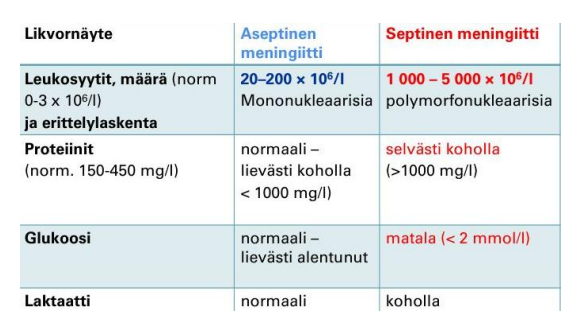
  

### O/V

PPMS alkaa yleensä nuoremmalla iällä kuin RRMS

  <button class="solution-button"
          data-label="Vastaus"
          data-hide-label="Piilota vastaus">
    Vastaus
  </button>
  

Väärin (myöhemmällä iällä)

---

Multippeliskleroosi (MS-tauti) voidaan jakaa kolmeen (- neljään) päätyyppiin: 

<li>Relapsoiva/remittoiva (RRMS) (yleisin)</li>
  <ul>
    <li>Tapahtuu oireiden täydellinen tai osittainen korjaantuminen relapsien (pahentumisvaiheiden) välillä; tämä muoto on n. 85%:lla potilaista alkuvaiheessa</li>
    <li>Alkaa yleensä 20-40v; yleisempää naisilla kuin miehillä</li>
  </ul>
<li>Primaaristi progredioiva (PPMS)</li>
  <ul>
    <li>Tyypillistä vähittäinen tautiprogressio heti taudin alkuvaiheista lähtien ilman oireiden korjaantumisvaiheita</li>
    <li>Alkaa yleensä n. 35-45v; yhtä yleistä miehillä kuin naisilla</li>
  </ul>
<li>Sekundaaristi progredioiva (SPMS; käytännössä RRMS:n myöhäisvaihe)</li>
  <ul>
    <li>Aaltomainen tauti voi siis edetä progressiiviseksi; 10 v. päästä sairastumisesta 50%:lla RRMS-potilaista on sekundaarisesti progressiivinen tauti (ja 25v päästä 90%:lla)</li>
  </ul>
<li>Progressivinen-relapsoiva (PRMS) (ei usein mainita ja harvinaisin)</li>
  <ul>
    <li>Selviä relapsivaiheita, mutta tauti on myös jatkuvasti progredioiva</li>
  </ul>

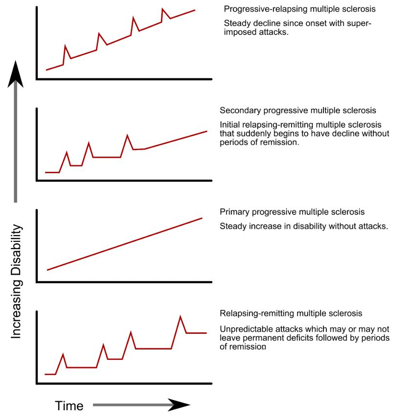

  

### O/V

Guillan-Barrén oireyhtymä on sama asia kuin CIDP

  <button class="solution-button"
          data-label="Vastaus"
          data-hide-label="Piilota vastaus">
    Vastaus
  </button>
  

Väärin 

---

Polyradikuliitit ovat ryhmä hankittuja sairauksia, joissa elimistön oma immuunijärjestelmä hyökkää ääreishermostoa vastaan. Jaetaan yleensä kahteen pääryhmään sen mukaan, kuinka nopeasti ne etenevät: Guillain-Barrén oireyhtymä (GBS, akuutti) ja CIDP (krooninen inflammatorinen demyelinoiva polyradikuloneuropatia). GBS:n yleisin alatyyppi on akuutti inflammatorinen demyelinoiva polyradikuloneuropatia (AIDP) ja näitä käytetäänkin yleensä synonyymeinä.

CIDP:ssä taudin aallonpohja saavutetaan vasta vähintään kahdeksan viikon kuluttua oireiden esille tulosta. 

Guillain-Barrén oireyhtymän tyypillinen taudinkulku taas on seuraava: prodromaalivaihe (infektio tms.; tyypillisesti oireet n. 2-3vk infektiosta) → etenemisvaihe (oireet kehittyvät enimmillään 4 viikkoon asti) → stabiili vaihe (1–4 viikkoa) → toipumisvaihe (kuukausia-2vkesto)
  

### O/V

Myastenia graviksessa todetaan positiiviset MUSK-vasta-aineet

  <button class="solution-button"
          data-label="Vastaus"
          data-hide-label="Piilota vastaus">
    Vastaus
  </button>
  

Väärin (wikissä näin; oikeasti sinänsä oikein)

---

Myastenia gravis (MG) johtuu tyypillisesti autovasta-aineista postsynaptisia asetyylikoliinireseptoreita vastaan hermo-lihasliitoksessa (NMJ). Oikea vastaus siis olisi enemmänkin, että todetaan positiiviset AChR-vasta-aineet (näitäkään ei siis kaikilla; va-positiivisia n. 85% yleistynyttä ja 50% okulaarista MG sairastavista). Harvinainen muoto myasteniasta on kuitenkin MuSK-myastenia, jossa vasta-aineita on lihasspesifisistä kinaasia vastaan (n. 4-5%:lla). On myös harvinaisesti seronegatiivisia myastenioita. 

  

### O/V

MS-tauti on autoimmuunitauti, jossa immuunisolut tuhoavat myeliinia 

  <button class="solution-button"
          data-label="Vastaus"
          data-hide-label="Piilota vastaus">
    Vastaus
  </button>
  

Oikein

---

MS-tauti on yleisin nuorten aikuisten vakava neurologinen sairaus ja demyelinaatiosairaus; 2.5 miljoonaa MS-potilasta maailmassa; Suomessa 13 000 MS-potilasta. Yleisin sairastumisikä on noin 20–40 vuotta; sairastuminen alle 16 tai yli 60 vuoden iässä on harvinaista. 

Kyseessä on tyypin IV yliherkkyysreaktio, erityisesti myelin basic -proteiinia vastaan. Multippeliskleroosin (MS-taudin) yhtenä laukaisevana tekijänä voi olla infektiot; merkittävin yhteys on Epstein-Barrin virukseen. Soluvälitteisen (CD8-T-solut, makrofagit ja mikrogliasolut) tulehduksen ajatellaan olevan keskeisin, mutta myös B-soluilla on todennäköisesti tärkeä rooli. Aiheuttaa akuuttia myeliinin menetystä keskushermoston aksonien ympäriltä ja lopulta krooninen oligodendrosyyttien menetys johtaa remyelinaation epäonnistumiseen ja aksonimenetykseen.

  

### O/V

Toistuvasti normaali CK poissulkee lihastaudin

  <button class="solution-button"
          data-label="Vastaus"
          data-hide-label="Piilota vastaus">
    Vastaus
  </button>
  

Väärin

---

Normaali CK ei poissulje lihastautia eikä edes myosiittia; osassa myopatioista CK voi olla normaali.  
  

### O/V

ALS-taudissa sekä ylemmän että alemman motoneuronin vaurion merkkejä

  <button class="solution-button"
          data-label="Vastaus"
          data-hide-label="Piilota vastaus">
    Vastaus
  </button>
  

Oikein

---

Amyotrofinen lateraaliskleroosi (ALS) on yleisin motoneuronitauti. ALS:lle on tyypillistä sekä ylempien että alempien motoneuronien degeneraatio. Alemman motoneuronin merkit ovat mm. velttohalvaus ja lihasatrofia, faskikulaatiot, hidastuneet refleksit ja negatiivinen Babinskin testi (isovarvan kipristyy jalkapohjan puolelle). Ylemmän motoneuronin merkit ovat mm. spastinen paralyysi, hyperrefleksia, positiivinen Babinskin testi. 
  

## Blokki 2 

Taas puuttellisia kysymyksenasetteluja paljon. 

### TIA-kohtauksesta potilastapaus: mies jolla oli 10 vrk sitten ollu joku tietty oirekuva ja siihen liittyen kysymyksiä

Puutteellinen tehtävänanto wikissä, mutta nämä kysymykset kerätty TIA-kohtaukseen liittyen: 

- a. millä kiireellisyydellä lähetetään ESH
- b. mitkä tutkimukset oleellisia 
- c. ajokiellon pituus 

  <button class="solution-button"
          data-label="a"
          data-hide-label="a - Piilota vastaus">
    a
  </button>
  

TIA-kohtauksesta alle 2vk --> (yliopisto-/keskus)sairaalapäivystykseen. Jos yli 2vk, niin kiireellisenä (1-7vrk) neurologian polille. 

---

2vk sisällä kohtauksen saaneet tulee lähettää päivystykseen, koska TIA-potilailla on huomattava riski saada myöhemmin aivoinfarkti. Näin on tärkeää selvittää nopeasti, mistä TIA-kohtaus johtui ja aloittaa etiologian mukainen tarvittava hoito. Jos taustalla kaulavaltimon ahtauma, niin endarterektomia tulisi tehdä 2 viikon kuluessa viimeisestä ennustetapahtumasta, koska sen jälkeen leikkauksesta koituva hyöty vähenee. Viikon kuluessa sairastumisesta aloitettu aktiivinen kuntoutus on myös selvästi tehokkaampaa kuin 2 viikon tai vasta kuukauden kuluttua tai vielä myöhemmin aloitettu.
  

  <button class="solution-button"
          data-label="b"
          data-hide-label="b - Piilota vastaus">
    b
  </button>
  

Anamneesi + yleis- ja neurologinen status. Diagnoosi perustuu anamneesiin ja kuvantamisella poissuljetaan muut tilat (aivoverenvuoto tai jo kehittynyt infarkti). Päivystyksellisesti yleensä otetaan pään TT (harkiten MRI esim. raskaana olevilta) ja kaulasuonten TT-angiografia (jolla etsitään mahdollista suuren suonen tukosta tai karotisstenoosia). Myös aina EKG (erityisesti eteisvärinän seulonta) ja tyypillisesti myös thorax-rtg. Tietysti myös verenpiaineet ja muut vitaalit. Labroista PVK, CRP, Na, K, krea, gluk, HBA1c, kol, CK, TnI, yleensä myös INR ja APTT.  

---

TIA-potilas on mahdollista usein kotiuttaa päivystyksestä ilman osastolle ottoa. Osastohoidon aiheet: ABCD2 pistemäärä ≥ 4, kaulavaltimokuvantamista ei ole tehty (leikkausharkintaan kuuluvat potilaat), antikoagulaatiohoidon aloitus, vahva epäily kardiogeenisestä embolisaatiosta (telemetriaseuranta)

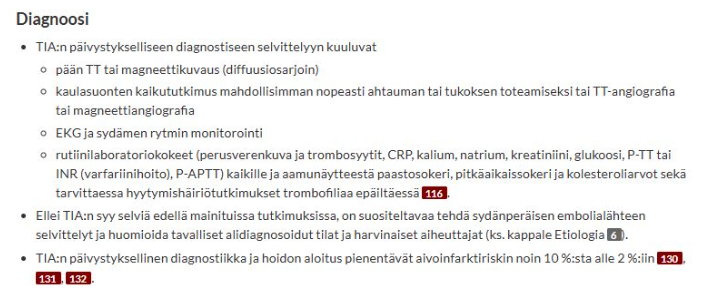
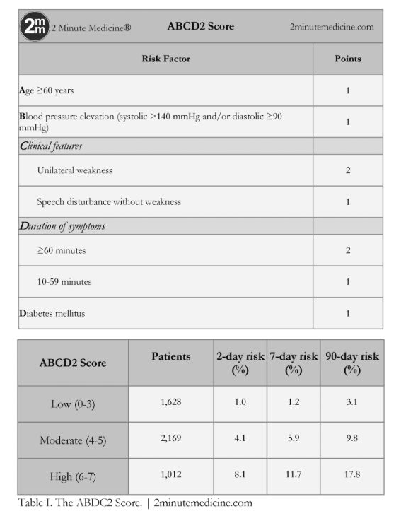
  

  <button class="solution-button"
          data-label="c"
          data-hide-label="c - Piilota vastaus">
    c
  </button>
  

TIA-kohtauksesta tulee ajokieltoa R1 vähintään 1kk (jos korkean riskin TIA niin arvio pidemmästä ajokiellosta), R2 6kk. 

---

Aivoinfarktissa ja ICH:ssa taas R1 vähintään 3kk ja R2 vähintään 6kk. 
  

### Epileptinen kohtaus potilastapaus

Ei taaskaan tarkempaa potilastapausta wikissä, mutta nämä kysymykset ilmeisesti esitetty: 

- a. Mitkä tutkimukset aiheellisia?
- b. Kuinka kauan pitää päivystyksessä seurata?
- c. Ajokiellon pituus? 

  <button class="solution-button"
          data-label="a"
          data-hide-label="a - Piilota vastaus">
    a
  </button>
  

Anamneesi, silminnäkijäanamneesi ja status. Anamneesissa on äärimmäisen tärkeää saada tapahtumakuvaus, erityisesti silminnäkijöitä haastatellen. Synkopee voi ilmentyä hyvin kouristusmaisesti, mutta se on usein anamnestisesti ja kohtauskuvauksen perusteella erotettavissa. Kohtauskuvauksen perusteella voidaan myös luokitella kohtaukset eri tyyppisiksi.

Anamneesissa on myös tärkeää haastatella epileptisille kohtauksille altistavia tekijöitä, joita ovat mm. 

<li>Päihteet (esim. alkoholi), korkeakuumeinen infektio, keskushermostoinfektio, hypoglykemia, elektrolyyttihäiriöt, äärimmäiset rasitustilat (valvominen, maratoonin juokseminen, voimamieskisat...) ja jotkut kohtauskynnystä madaltavat lääkkeet (trisykliset masennuslääkkeet, bupropioni, useat psykoosilääkkeet, tramadoli)</li>
<li>Myös rakenteelliset syyt ovat tärkeitä: esim. aivovammat, aivokasvaimet, aivoverenkiertohäiriöt, hippokampusskleroosi (taustalla esim. pitkittyneet kuumekouristukset, lapsuudessa, aivoinfektiot tai aikaisempi status epilepticus)</li>
<li>Sukuhistoria voi myös olla altistava tekijä</li>
<li>Psykiatriset sairaudet; psykogeeninen kohtaus on myös mahdollinen (kohtauskuvaus tärkeä)</li>
<li>Potilaalta tulee siis kysyä erityisesti alkoholin ja muiden päihteiden käytöstä, infektio-oireista, viimeaikaisesta rasituksesta, lääkityksestä, aikaisemmista aivovammoista ja sukuhistoriasta. </li>

---

Päivystyksessä EKG, A-astrup, verilabrat (PVKT, Na, K, Krea, Ca-ion, CK, ALAT, CRP, TSH, glukoosi!), päihdekäyttöä epäiltäessä puhallus, GT, B-PEth, U-huumeet. Pään TT poissulkututkimukseksi.** Epileptikolta voidaan määrittää epilepsialääkkeiden pitoisuudet. Likvor jos epäily CNS-infektiosta/ pään TT ei näy SAV, mutta oireet täsmäisivät.

EEG voidaan ottaa jo päivystyksessäkin, mutta ainakin jatkoselvittelyissä polikliinisesti sitten. EEG kiireellisesti vähintään jos kouristaa uudestaa (tai tulee päivystykseen kouristelevana/tajuttomana) tai otetaan osastolle.
  

  <button class="solution-button"
          data-label="b"
          data-hide-label="b - Piilota vastaus">
    b
  </button>
  

Seuranta-aika on päivystyksessä 6h, jos uusia kohtauksia ei ilmene ja tajunnantila sekä muu status on normaali. Tehdään kiireellinen lähete neurologille, jos ei osoittaudu selkeää kiireellä hoidettavaa sekundaarista syytä kouristukselle (AVH, aivokasvain, infektio, aivovamma...). Polikliinisesti sitten otetaan myöhemmin neurologin ohjelmoimana mm. pään MRI ja EEG-selvittelyitä.

  

  <button class="solution-button"
          data-label="c"
          data-hide-label="c - Piilota vastaus">
    c
  </button>
  

Ajokielto tulee heti epilepsiaselvittelyiden ajaksi. Provosoimaton ensikouristus johtaa heti R1-ajokieltoon 6kk ajaksi ja R2 5v.

Jos diagnosoidaan epilepsia tai todetaan 2 epileptistä kohtausta alle 3v. sisään on R1-ajokiellon pituus 1v (saa takaisin, jos on vuoden kohtauksettomana) ja R2 pysyvä (tarkemmin 10 v ilman lääkkeitä ja kohtauksettomana, mutta niin haastavaa saavuttaa, että voi ajatella olevan pysyvä ammattikuljettajan kortin menetys.
  

### O/V-kysymykset 

Vaikuttaa siltä, että O/V-kysymykset ovat samaa aihepiiriä kuin vuoden 2025 blokissa 4 eli Alzheimerin tautiin ja frontotemporaalidementiaan liittyviä. Tarkempia kysymyksiä ei ole wikiin kerätty, mutta nämä siis mainittu aiheina. Tässä näistä nopeat koosteet: 

  <button class="solution-button"
          data-label="Alzheimerin tauti"
          data-hide-label="Alzheimerin tauti - Piilota">
    Alzheimerin tauti
  </button>
  

Yleisin ja parhaiten tunnettu dementiaa aiheuttava rappeuttava aivosairaus; n. 70% kaikista dementiapotilaista (Suomessa n. 70 000 sairasta). Yleensä tauti on satunnainen (98-99%); ikä sekä APOE:n E4-alleeli tärkeimmät riskitekijät. Yleensä todetaan vasta yli 50-vuotiailla; n. 4-6% yli 65-vuotiaista ja jopa 15-30%:lla yli 80-vuotiaista. 2.	Periytyvä sairaus ilmenee aikaisemmin; autosomissa vallitsevasti ja toistaiseksi on tunnistettu kolme aiheuttavaa geenivirhettä: APP- sekä preseniliini 1- ja 2-geenien mutaatiot. Myös Downin oireyhtymä on yhteydessä aikaiseen Alzheimerin tautiin (<40v.). 

---

Sairaus etenee hitaasti ja tasaisesti; aiheuttaa oireita vaurioituneiden aivoalueiden mukaan tyypillisesti järjestyksellisesti. Alkaa yleensä muistihäiriöillä (alkaa lyhytkestoisen muistin ongelmilla ja etenee pitkäkestoisen muistin ongelmiin). Näin siis ns. amnestisessa muodossa, joka on yleisin (n. 85%) Alzheimerin taudin tyyppi. Muita oireita ovat mm:

<li>Muutokset persoonallisuudessa ja käytöksessä</li>
<li>Toiminnanohjauksen vaikeutuminen ja sanahaku </li>
<li>Motorisen tai sensorisen toiminnan häiriöitä ei ilmene vasta kuin hyvin myöhäisessä vaiheessa (sensorinen ja näköaivokuori säilyvät). </li>
<li>Lopulta potilaista tulee mykkiä ja vuoteenomia; infektio (aspiraatiopneumonia) on tavallisin välitön kuolinsyy</li>
<li>Varianttimuodoissa varhaisena oireena voi olla jokin muukin kuin muisti; esim. posteriorisessa variantissa hahmottamisen vaikeudet, frontaalisessa variantissa käytösoireet/toiminnanohjauksen vaikeudet ja logopenisessä afasiassa/etenevässä afasiassa kielellisten toimintojen ongelmat (esim. vaikeus toistaa lauseita tai nimetä esineitä).</li>

---

Olennaisimmat histolopatologiset muutokset ovat beeta-amyloidin ja HF-taun kertyminen tiettyihin aivoalueisiin. Beeta-amyloidi (Aβ-amyloidi) kertyy ja muodostaa neuriittiplakkeja soluvälitilaan. Neuriittiplakkikertymät aiheuttavat tulehdusresponssin ympärilleen sekä voivat myös kertyä verisuonien ympärille heikentäen verenkiertoa ja lisäten verenvuodon riskiä. Häiritsevät myös viestivälitystä synapsiväleissä sekä katalysoivat taun aggregaatiota neurofibrillivyyhteiksi (tau trigger), mikä on sytotoksista.	Hyperfosforyloituneet taukertymät siis muodostavat neurofibrillivyyhtejä solunsisäisesti. 

---

Diagnoosi ei ole poissulkudiagnoosi, vaan perustuu kliiniseen oirekuvaan ja tutkimuslöydöksiin. Muistiongelmaepäilyissä PTH:ssa yleensä ensiksi CERAD (seurannassa pienempi osa testiä eli MMSE; MMSE ei riitä lievien tilanteiden seulontaan). Peruslabrat normaalit. ESH:ssa yksittäisistä tutkimuksista yleisin on aivojen magneettikuvaus, jossa jo varhaisessa vaiheessa havaitaan sisemmän ohimolohkon kudoskatoa. PET-kuvauksilla voidaan tunnistaa proteiinikertymiä; toinen yleisesti käytetty biomarkkeritutkimus on likvoranalyysi, jossa voidaan nähdä fosforyloituneen tau-proteiinin (myös yleensä kokonais-taun) suurentuminen ja/tai beeta-amyloidi 42:n pieneneminen. Diagnoosi voidaan sinänsä 100% varmistaa vasta autopsiassa kuoleman jälkeen. 

---

Taudin kesto ensioireista kuolemaan on diagnoosi-iästä riippuen n. 3-12 vuotta. Ei ole olemassa kuratiivista hoitoa, hoidon tarkoitus on mahdollistaa oirekuvan lievittymistä niin, että potilas voi elää omatoimisena mahdollisimman pitkään. Ensisjainen lääkitys on asetyylikoliiniesteraasin inhibiittori (donepetsiili, rivastigmiini, galantamiini), joka aloitetaan heti diagnoosin asettamisen jälkeen jo lievässäkin taudissa. NMDA-antagonistia nimeltä memantiini käytetään keskivaikeaa/vaikeaan tautiin, usein yhdistettynä AKE:n estäjän kanssa. Lokakuussa 2025 Suomenkin markkinoille tuli beeta-amyloidi-vasta-aine Lekanemabi (mahdollisesti taudinkulkua modifoiva lääke), mutta sen käyttö on vähäistä.

Antipsykooteista risperidoni ja aripipratsoli ovat ensisijaisia muistisairauksiin liittyvien agitaatio- ja psykoosioireiden hoidossa. Masennusta tulee hoitaa, jos väh. keskivaikea masennus (lievissä tiloissa masennuslääkkeiden teho on heikko).
  

  <button class="solution-button"
          data-label="Otsa-ohimolohkorappeuma (FTLD)"
          data-hide-label="FTLD - Piilota">
    FTLD
  </button>
  

Otsa-ohimolohkorappeumat (FTLD; n. 10-15% dementiatapauksista) on muistisairauksien ryhmän yleisnimitys, jossa aivojen patologiset muutokset (erityisesti atrofia) keskittyvät aivojen etuosiin. Neuropsykologinen oirekuva on heterogeeninen, mutta kaksi pääasiallista oirekokonaisuutta voidaan erottaa:

<li>Otsalohkodementia (käyttäytymisvariantti, FTD, bvFTD) </li>
  <ul>
    <li>Otsalohkodementiassa oirekuva painottuu alussa käyttäytymisen ja sosiaalisen vuorovaikutuksen muutoksiin ennen muistihäiriöitä; tarkemmalta nimeltään onkin bvFTD (behavioral variant). Esim. luonnollisen estyneisyyden väheneminen, apatia, sisäänpäin kääntyneisyys, sympatian/empatian kokemisen menetys, toistuva/stereotyyppinen/pakonomainen käyttäytyminen, hyperoraalisuus (pakonomainen tarve laittaa suuhun jotakin), ruokavalion muutokset. Usein myöhäisessä vaiheessa esiintyy parkinsonimaisia motorisia piirteitä.</li>
  </ul>
<li>Primaari progressiivinen afasia (kielelliset variantit)</li>
    <li>Kielellisistä alatyypeistä voidaan vielä erottaa etenevä sujumaton afasia (NfvPPA),  semanttinen dementia (svPPA) ja logopeeninen afasia (lvPPA). Keskeinen (niin sairauden alkuvaiheessa kuin sairauden edetessä) kliininen oire on kielellinen vaikeus (afasia), joka on tärkein tekijä arkipäivän toimintojen vaikeutumisessa.</li>

---

Alkavat usein suhteellisen nuorella iällä (n. 45-70v); usein (n. 30%) perinnöllisiä. Otsalohkodementia vaikuttaa olevan erityisen yleinen Suomessa, ja se näyttää liittyvän väestössämme rikastuneeseen C9orf72-geenin toistojaksopidentymän monistumaan (sama geeni ALS:ssa pelissä). Histologisesti havaitaan alatyypistä riippuen erilaisia hermosoluihin kertyneitä patologisesti laskostuneita proteiineja (FTLD-TDP43 tässä mutaatiossa). Myös mm. FTLD-tau tavallinen (esim. Pickin taudissa Pickin kappaleet ovat tau-proteiinin kertymiä). 

---

Diagnoosissa tukena erityisesti oirekuva, kuvantamiset usein (MRI ensisijainen, TT, PET tai SPECT mahdollisia). Varma diagnoosi tässäkin vasta neuropatologisesti (tai jos todettu patogeeninen mutaatio). Peruslabrat normaalit. 

---

Mistisairauslääkkeistä (AKE:n estäjät/memantiini) ei ole hyötyä/näyttöä otsa-ohimolohkorappeumissa (FTLD). Muuta oirekuvan mukaista lääkitystä voidaan harkita (lääkehoidolla pyritään lähinnä lievittämään käytösoireita). Millään lääkkeellä ei ole virallista indikaatiota FTLD-sairauksien hoitoon ja oireenmukaisistakin lääkityksistä vähän tutkimustietoa. Psykososiaaliset tuet ensisijaisia hoidossa; puheterapiasta saattaa olla hyötyä. 

  

### Oireista tasodiagnostiikkaan

Ei tarkkaa potilastapausta wikissä, mutta ilmeisesti piti tehdä oireiden perusteella tasodiagnostiikkaa sen suhteen, että oliko ylemmän vai alemman motoneuronin ongelma sekä että mikä kuvantamistutkimus selvittelyssä ensisijainen (Th-rangan mri). Sitten oli vielä kysymys, että millainen sairaus voisi oireita aiheuttaa. Ilman nyt tarkempaa potilastapausta ei oikein voi rakentaa hyvää vastaustakaan, mutta käytetään tämä tilanne kertaamaan ylä- ja alamotoneuronivaurioiden erot statuksessa. 

  <button class="solution-button"
          data-label="Vastaus"
          data-hide-label="Piilota">
    Vastaus
  </button>
  

Ylemmän (UMN) ja alemman motoneurin (LMN) vaurioiden tärkeimpiä piirteitä ovat mm: 

<li>Lihasvoima: heikko (UMN) / heikko (LMN)</li>
<li>Refleksit: kiihtyneet ja klooniset (UMN) / heikentyneet tai puuttuvat (LMN)</li>
<li>Lihastonus: Spastinen (UMN) / Alentunut (LMN)</li>
<li>Lihasatrofia: vähäistä ja myöhäisempää (käyttämättömyydestä johtuvaa) (UMN) / enemmän ja aikaisempaa (denervaatiosta johtuvaa) (LMN)</li>
<li>Lihasfaskikulaatiot: ei todeta (UMN) / yleisiä (LMN)</li>
<li>Babinski: + eli fleksio eli epänormaali (UMN) / - eli ekstensio eli normaali (LMN)</li>

---

Erot perustuvat motoneuronien toimintaan ja sijaintiin kehossa. 

<li>Ylämotoneuroni säätelee alamotoneuronin toimintaa -> vaurio johtaa alamotoneuronin säätelemättömään aktivaatioon -> Näkyy lihaksessa kohonneena tonuksena (spastisuus),
hyperrefleksiana ja positiivisena babinskina tai hoffmanina. Lihasatrofia vähäistä ja johtuu enemmänkin käyttämättömmyydestä. Faskikulaatioita ei esiinny. Halvaus on spastista</li>
<li>Alamotoneuroni on se neuroni, joka suoraan siis käskyttää lihasta toimimaan. Jos se on vaurioitunut, niin lihas on veltto ja ei toimi. Leesiot johtavat lihaksen tonuksen vähentymiseen, refleksien heikentymiseen, lihasatrofiaan, velttohalvaukseen ja faskikulaatioihin. Faskikulaatiot ovat spontaania lihaksen värähtelyä (supistumista) johtuen viallisen motoneuronin spontaanista depolarisaatiosta.</li>

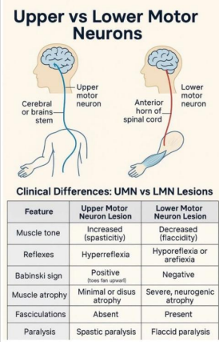
  

### Migreenin estohoito

- a. Millä indikaatioilla alotetaan (2p)
- b. Estolääkkeet (4p) 

  <button class="solution-button"
          data-label="a"
          data-hide-label="a - Piilota">
    a
  </button>
  

Ehdotonta kohtausmäärärajaa estohoidon aloittamiselle ei ole. Jatkuvasti ja tiheästi esiintyvissä kohtauksissa suositellaan estolääkkeen aloitusta (esim. jo 2 tai 3 migreenipäivää kuukaudessa voi olla aihe tai vähemmänkin, jos migreeni hankaloittaa jokapäiväistä elämää). Migreenin kroonistumisriski kasvaa, jos kohtauksia on jatkuvasti 4 tai enemmän kuukaudessa tai jos kipulääkkeiden käyttö on runsasta.

Ennen estolääkityksen aloitusta huomioidaan ja pyritään hoitamaan mahdolliset muut päänsäryt. Lääkkeettömiä hoitoja voidaan käyttää muiden hoitojen rinnalla tai niiden sijasta, varsinkin jos lääkkeiden käyttö on vasta-aiheista. 

  

  <button class="solution-button"
          data-label="b"
          data-hide-label="b - Piilota">
    b
  </button>
  

Migreenin estohoitoon on tähän saakka käytetty PTH:ssa ensisijaisesti beetasalpaajia (esim. propranololi), angiotensiinireseptorin salpaajia (esim. kandesartaani), trisyklisiä masennuslääkkeitä (esim. amitriptyliini tai nortriptyliini) sekä eräitä epilepsialääkkeitä (esim. topiramaatti tai harvemmin valproaatti). Uutena lääkeryhmänä ovat ESH:n käyttöön tulleet CGRP-vasta-aineet (monoklonaalisia biologisia lääkkeitä, kuten fremanetsumabi tai erenumabi) ja gepantit (pienimolekyyliset CGRP-reseptoriantagonistit, kuten rimegepantti tai atogepantti). Kroonisen migreenin hoitoon käytetään myös onabotuliinitoksiini s.c. 

Hoidon tavoitteena on migreenipäivien puolittuminen tai huomattava väheneminen. Vastetta voidaan arvioida 3 kk:n kuluttua, kun tavoiteannos on saavutettu. Tehokasta ennaltaehkäisevää hoitoa suositellaan jatkettavaksi vähintään 6 kk suun kautta otettavien lääkkeiden osalta ennen kuin harkitaan hoidon lopettamista. Jos tilanne lopetuksen jälkeen voimistuu, suositellaan hoidon jatkamista. Jos ensimmäinen migreeniä ehkäisevä lääke on tehoton tai huonosti siedetty, suositellaan lääkevaihtoa. 

  

## Blokki 3 

### Ohimennyt oikean käden heikkous 

63-v yrittäjämies hakeutuu Tyksin päivystykseen ohittuneen oikean käden heikkouden vuoksi. Potilaalla ei ole todettuja sairauksia. Hän tupakoi, terveystarkastuksessa ei ole käynyt muutamaan vuoteen. Hänellä on R1 ajokortti. Oire alkoi eilen äkisti töissä ja kesti noin 20 minuutta. Ei muita oireita. Neurologipäivystäjä tutkii potilaan ja toteaa neurologisen statuksen normaaliksi, verenpaineet 152/82, pulssi säännöllinen 70. 

- a. Mitä neurologipäivystäjä epäilee, mitä päivystyksellisiä tutkimuksia hän ohjelmoi ja miksi?
- b. Suunnittele potilaan sekundaaripreventio
- c. Asetetaanko potilaalle ajokielto? Jos asetetaan, kuinka pitkä ja ilmoitetaanko siitä poliisille?

  <button class="solution-button"
          data-label="a"
          data-hide-label="a - Piilota">
    a
  </button>
  

Kliinisesti TIA-epäily eli ohimenevä aivoverenkiertohäiriö. Potilaalla on ollut äkillinen, toispuoleinen ja paikallinen neurologinen puutosoire (oikean käden heikkous), joka on väistynyt ja palautunut täysin nopeasti (tässä 20 minuutissa; TIA kestää yleensä alle tunnin, tyypillisimmin 2–15 minuuttia). 

Oireiden väistyminen ei kuitenkaan tarkoita sitä, että tilanne olisi vaaraton. Melkein yhdellä kymmenestä potilaasta ilmenee aivoinfarkti (stroke) viikon sisällä TIA-oireesta, ja tämän vuoksi TIA vaatiikin kiireellistä selvittelyä ja hoitoa. . Päivystystutkimuksiin kuuluu pään TT ja kaulavaltimoiden TT-angiografia. Tietysti myös EKG (ja telemetriaseuranta päivystyksessä olon ajan) ja thx-rtg. Lisäksi tyypilliset AVH-labrat (pika-Gluk jos ei vielä ja B-PVKT,  P-APTT, P-CRP, P-Gluk, P-K, P-Na, eGFR, P-Trombai, P-INR, troponiini; pidempää hoitoa ajatellen aamunäytteestä myöhemmin mm. paastosokeri, pitkäaikaissokeri ja kolesteroliarvot sekä tarvittaessa hyytymishäiriötutkimukset trombofiliaa epäiltäessä).

---

On hyvä huomioida erilaiset AVH-mimicit, kuten hemipleginen migreeni (olisi alkanut hitaammin kehittyen eikä äkillisesti eikä ole tämän ikäisillä tyypillinen; usein myös muita auraoireita ja migreenipiirteitä), paikallisalkuinen epileptinen kohtaus ja sen jälkeinen Toddin pareesi (ei mainintaa raajan nykimisestä heikkoutta edeltävästi), hypoglykemia (tulee AINA tarkistaa) ja toiminnallinen oire (poissulkudiagnoosi, tyypillisesti kesto on kuitenkin pidempi tai oire vaihtelee tutkimuksen aikana). 
  

  <button class="solution-button"
          data-label="b"
          data-hide-label="b - Piilota">
    b
  </button>
  

Yleisten riskitekijöiden hallitseminen: Tupakoinnin lopettaminen, verenpainelääkitys ja kolesterolilääkitys. 

Aloitetaan myös yleensä sekundaaripreventiivinen antikoagulatiivinen/antitromboottinen lääkehoito. 

<li>Ei-sydänperäisessä TIA:ssa verihiutale-estäjähoito: asetyylisalisyylihapon (ASA) ja dipyridamolin (DP) yhdistelmä tai klopidogreeli</li>
<li>Eteisvärinäpotilaille tai muutoin sydänperäistä embolisaatiota epäiltäessä antikoagulaatiolääkitys: Yleensä ensisijaisest NOAC; läppäperäisessä eteisvärinässä varfariini</li>

---

Kaulasuonen endarterektomia toteutetaan lähipäivinä niille potilaille, joilla todetaan oireisella puolella merkittävä kaulasuoniahtauma.
  

  <button class="solution-button"
          data-label="c"
          data-hide-label="c - Piilota">
    c
  </button>
  

TIA-kohtauksessa tulee ajokieltoa:

<li>R1: yleensä 1kk, jos korkean riskin TIA niin arvio pidemmästä ajokiellosta (aivoinfarktissa kielto olisi väh. 3kk)</li>
<li>R2: väh. 6kk ajokielto (aivoinfarktissa olisi myös väh 6kk)</li>

---

< 6kk ajokiellot suullisia: niiden asetuksesta ja päättymisestä maininta sairaskertomuksessa. ≥6kk ajokielloista tehdään ilmoitus poliisille → palautus vaatii myös lausunnon poliisille, voi tehdä myös tk:sta</li>

<li>Potilaan R1-ajokiellosta ei siis tarvitse ilmoittaa poliisille, koska se on 1kk pituinen. Käydään läpi ajokiellon asettaminen potilaan kanssa ja kirjataan se sairaskertomukseen.</li>
  

### Luettele tyypillisimmät oireet ja statuslöydökset 

- a. Parkinsonin taudissa 
- b. Myastenia graviksessa

  <button class="solution-button"
          data-label="a"
          data-hide-label="a - Piilota">
    a
  </button>
  

Parkinsonin taudissa motoriset oireet ilmenevät alkuun tyypillisesti yläraajapainotteisesti ja unilateraalisesti (kehittyvät useimmiten bilateraalisiksi). Oireisto ilmaantuu hitaasti kuukausien ja vuosien aikana. Parkinsonin taudin tyypillisimmät kliiniset motoriset piirteet voi muistaa muistisäännöstä TRAPSS

<li>Tremor (pillerinpyörittäjävapina; lepovapinaa, joka katoaa liikkeessä)</li>
<li>Rigidity (rigiditeetti eli kohonnut lihastonus raajojen passiivisessa liikkeessä)</li>
<li>Akinesia/bradykinesia (liikkeen aloittamisen hitaus ja spontaanin liikehdinnän vähentyminen, liikesuorituksen hitaus; tähän sisältyy usein myös mm. kasvojen ilmeettömyys ja puheäänen hiljentyminen ja monotonisuus)</li>
<li>Postural instability (asennon ja tasapainon säätelyhäiriö; statuksessa esim. epänormaali pull-test)</li>
<li>Shuffling gait (Parkinsonimainen kävely, jolle on erityisesti tyypillistä on se, että kävelyn aloittaminen on hidasta, kävellessä askelpituus on lyhentynyt ja myötäliikkeet ovat vähentyneet tai poissa. Asento on etukumarainen. Varsinkin käännöksissä alkaa esiintyä epävarmuutta, ja kaatumisia voi tapahtua.)</li>
<li>Small handwriting (micrographia; usein vastaanotolla pyydetään kirjoittamaan jotain)</li>

---

Parkinsonin taudille on tyypillistä myös autonomisen hermoston häiriöt; varsinkin huimaus ylös noustessa (ortostaattinen hypotensio), ummetus, virtsarakon toiminnan häiriöt, impotenssi, syljen valuminen suusta (pääosin merkki heikentyneestä nielemistoiminnasta (myös itse erityksen häiriöstä)) ja heikentynyt libido ovat hyvin tavallisia. Autonomisen hermoston häiriöitä esiintyy lähes kaikilla Parkinsonin tautia sairastavilla taudin edetessä. 

Myös psykiatriset komorbiditeetit ovat yleisiä, varsinkin masennus ja ahdistuneisuus. Myös kognitiivisia häiriöitä esiintyy usein, mutta tyypillisesti vasta vuosia sairauden puhkeamisen jälkeen. Tyypillisiä piirteitä ovat mm. tarkkaavuuden ylläpidon, puheen sujuvuuden ja tavoitehakuisen toiminnan vaikeudet sekä kognitiivisen prosessoinnin hitaus (bradyfrenia)

  

  <button class="solution-button"
          data-label="a"
          data-hide-label="a - Piilota">
    a
  </button>
  

Parkinsonin taudissa motoriset oireet ilmenevät alkuun tyypillisesti yläraajapainotteisesti ja unilateraalisesti (kehittyvät useimmiten bilateraalisiksi). Oireisto ilmaantuu hitaasti kuukausien ja vuosien aikana. Parkinsonin taudin tyypillisimmät kliiniset motoriset piirteet voi muistaa muistisäännöstä TRAPSS

<li>Tremor (pillerinpyörittäjävapina; lepovapinaa, joka katoaa liikkeessä)</li>
<li>Rigidity (rigiditeetti eli kohonnut lihastonus raajojen passiivisessa liikkeessä)</li>
<li>Akinesia/bradykinesia (liikkeen aloittamisen hitaus ja spontaanin liikehdinnän vähentyminen, liikesuorituksen hitaus; tähän sisältyy usein myös mm. kasvojen ilmeettömyys ja puheäänen hiljentyminen ja monotonisuus)</li>
<li>Postural instability (asennon ja tasapainon säätelyhäiriö; statuksessa esim. epänormaali pull-test)</li>
<li>Shuffling gait (Parkinsonimainen kävely, jolle on erityisesti tyypillistä on se, että kävelyn aloittaminen on hidasta, kävellessä askelpituus on lyhentynyt ja myötäliikkeet ovat vähentyneet tai poissa. Asento on etukumarainen. Varsinkin käännöksissä alkaa esiintyä epävarmuutta, ja kaatumisia voi tapahtua.)</li>
<li>Small handwriting (micrographia; usein vastaanotolla pyydetään kirjoittamaan jotain)</li>

---

Parkinsonin taudille on tyypillistä myös autonomisen hermoston häiriöt; varsinkin huimaus ylös noustessa (ortostaattinen hypotensio), ummetus, virtsarakon toiminnan häiriöt, impotenssi, syljen valuminen suusta (pääosin merkki heikentyneestä nielemistoiminnasta (myös itse erityksen häiriöstä)) ja heikentynyt libido ovat hyvin tavallisia. Autonomisen hermoston häiriöitä esiintyy lähes kaikilla Parkinsonin tautia sairastavilla taudin edetessä. 

Myös psykiatriset komorbiditeetit ovat yleisiä, varsinkin masennus ja ahdistuneisuus. Myös kognitiivisia häiriöitä esiintyy usein, mutta tyypillisesti vasta vuosia sairauden puhkeamisen jälkeen. Tyypillisiä piirteitä ovat mm. tarkkaavuuden ylläpidon, puheen sujuvuuden ja tavoitehakuisen toiminnan vaikeudet sekä kognitiivisen prosessoinnin hitaus (bradyfrenia)

---

Ennen diagnostista oireyhtymää voi ilmentyä monenlaisia ennakko-oireita jopa 20 vuoden ajan. Näitä ovat mm. ummetus, REM-unen käytöshäiriö ja hajuaistin heikentyminen. 

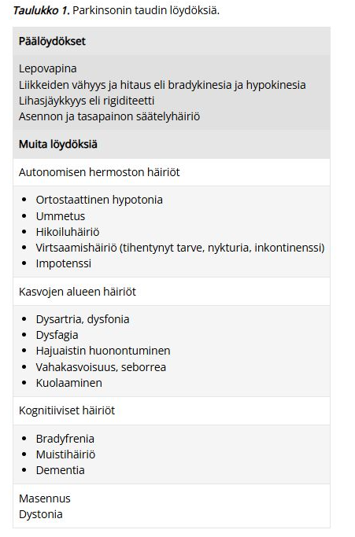

  

  <button class="solution-button"
          data-label="b"
          data-hide-label="b - Piilota">
    b
  </button>
  

Myasthenia gravikselle (autoimmuunisairaus yleensä hermo-lihasliitoksen asetyylikoliinireseptoreita vastaan) tyypillistä on vaihtelevan asteinen tahdonalaisten lihasten väsyvyys ja heikkous, joka pahenee rasituksessa ja lievittyy levossa. Aamulla vointi voi olla täysin normaali ja oireet saattavat ilmaantua iltaa myöden.

Yleisimmät ensioireet ovat silmän alueen lihasten heikkousoireet (ptoosi ja diplopia). Muita yleisiä ensioireita ovat bulbaarioireet (puheen nasaalisuus ja väsyminen ja nielemisvaikeudet); n. 20%:lla. Raajojen tyviosien tai selkärangan lihaksiston heikkoutta todetaan ensioireena vain n. 5-10%:lla, mutta usein (>80% tapauksista 2 vuoden sisällä) okulaarisesti alkanut tauti etenee sinnekin. 

Myastenia graviksen oireita voi vastaanotolla provosoida erilaisilla lihasväsyvyystesteillä. 

<li>Kaksoiskuvia/riippuluomea voi tuoda esille pyytämällä potilasta katsomaan ylöspäin pitkään; nopea silmien räpytys osoittaa decrementin ja voi tuoda esille ptoosia</li>
<li>Raajojen kannattelussa saatta tulla aikaista väsymistä</li>
<li>Käsien nyrkistyksessä decrementtiä ja hhidastumista lihasten heikentyessä</li>

  

### Miten pyörtyminen (syncope) ja epileptinen tajunnanmenetyskohtaus eroavat toisistaan kliinisesti?

  <button class="solution-button"
          data-label="Vastaus"
          data-hide-label="Piilota">
    Vastaus
  </button>
  

Synkopeen ja epileptisen kohtauksen erottelussa voi ajatella pääpiirteisesti seuraavanlaisesti kohtauskuvauksen perusteella (ei absoluuttisia piirteitä, mutta yleensä näin): 

Esioireet: 

<li>Epileptisessä kohtauksessa eniten aistioireita (esim. outo hajukokemus), psyykkisiä oireita</li>
<li>Synkopeessa tyypillisintä pahoinvointi, kalpeus, hikoilu, heikotus ja/tai näön hämärtyminen</li>

---

Kaatumisenaikainen lihastonus: 

<li>Epileptisessä kohtauksessa yleensä tooninen</li>
<li>Synkopeessä yleensä atooninen</li>

---

Lihasnykäysten määrä: 

<li>Epileptisessä kohtauksessa rytmisiä, voimakkaita ja voivat jatkua pidempään</li>
<li>Synkopeessa lyhyitä, epäsäännöllisiä ja niitä on vähän (usein alle 10 nykäystä; on olemassa ns. 10/20 rule eli <10 nykäystä viittaa synkopeehen ja >20 epileptiseen kohtaukseen)</li>
<li>Nykiminen alkaa synkopeessa vasta, kun henkilö on jo veltostunut ja kaatunut; epileptisessä kohtauksessa kohtaus yleensä alkaa heti kouristuksella</li>

---

Kesto: 

<li>Synkopee yleensä lyhytkestoisempi (n. 3-30s), epileptinen kohtaus yleensä vähän pidempi (30s-pari minuuttia)</li>

---

Palautuminen: 

<li>Epileptisessä kohtauksessa post-iktaalinen sekavuus, synkopeessa nopea palautuminen</li>

---

Kielen purenta: 

<li>Epileptisessä kohtauksessa yleisempää ja voi olla lateraalisestikin; synkopeessa korkeintaan kielen kärjen purenta</li>

---

Silmien avonaisuus: 

<li>Epileptisessä kohtauksessa usein auki, synkopeessa yleensä kiinni</li>

---

Inkontinenssi: 

<li>Yleisempää epileptisessä kohtauksessa</li>

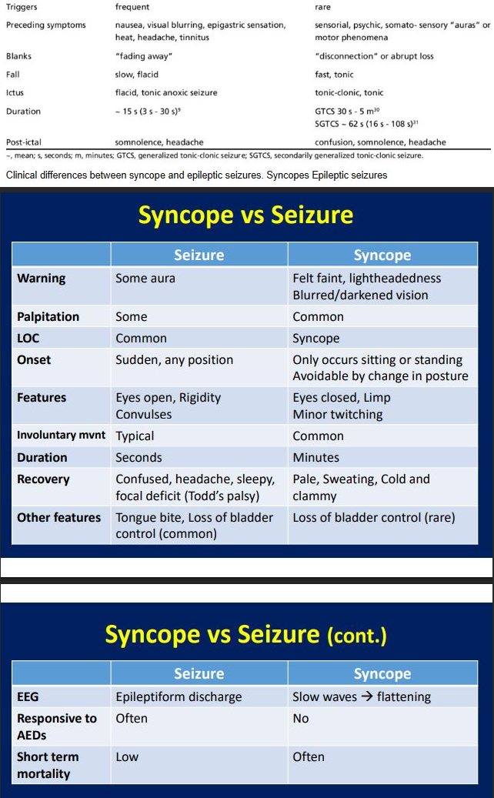
  

### Sarjoittainen päänsärky - O/V-kysymyksiä

- a. Yleisempi naisilla kuin miehillä
- b. Tuntuu toispuoleisena, silmän alueella ja tyypillisesti kosketus, syöminen tai puhuminen voi laukaista kivun
- c. Kipukohtaukset ovat lyhyitä, muutaman sekunnin mittaisia
- d. Kohtauslääkkeenä voi kokeilla sumatriptaania s.c. tai 100% happea
- e. Ensilinjan estolääke on karbamatsepiini
- f. Kipua esiintyy tyypillisesti kausittain

  <button class="solution-button"
          data-label="a"
          data-hide-label="a - Piilota">
    a
  </button>
  

Väärin 

---

Se on etupäässä 20–50-vuotiaiden miesten sairaus (vrt. muut primaariset päänsäryt enemmän naisilla). Sukupuolten välinen suhde on noin 5/1. Naisilla samanaikainen migreeni viivästyttää usein hoitoa ennen oikeaa diagnoosia.

  

  <button class="solution-button"
          data-label="b"
          data-hide-label="b - Piilota">
    b
  </button>
  

Väärin 

---

Sarjoittaisen päänsäryn kipu kyllä lokalisoituu tyypillisesti silmän taakse toispuolisesti, mutta kosketus/syöminen/puhuminen ei ole tyypillinen laukaiseva tekijä. Kohtaukset alkavat useimmiten yöllä tunti - pari tuntia nukahtamisen jälkeen, mutta voivat kuitenkin alkaa mihin tahansa aikaan. 

Kosketuksen/muiden pienien stimulaatioiden laukaisema unilateraalinen kipu on taas enemmän trigeminusneuralgiaan viittaavaa. Sille on tyypillistä äkilliset toistuvat lyhytaikaiset sähkömäiset kivut toisella puolella kasvoja, erityisesti leuan, posken tai hampaiden alueella; kevyt ärsyke (kosketus, ilmavirta) oirealueelle voi laukaista kivun. 

  

  <button class="solution-button"
          data-label="c"
          data-hide-label="c - Piilota">
    c
  </button>
  

Väärin 

---

Yleensä kipukohtaus kestää n. 15min-3t. Vertaa taas trigeminaalineuralgiaan, joka kestää yhdestä sekunnista n. 2 min:iin (yleensä muutaman sekunnin). 

  

  <button class="solution-button"
          data-label="d"
          data-hide-label="d - Piilota">
    d
  </button>
  

Oikein 

---

Sarjoittaisen päänsäryn ensisijainen kohtaushoito on 100% O2 12-15l/min + nopeavaikutteinen triptaani (sumatriptaani s.c/i.n. tai tsolmitriptaani i.n.). Usein akuuttivaiheessa aloitetaan tilannetta rauhoittamaan myös estohoidon siltahoitona prednisoni 60-100mg/vrk 5vrk:n ajan ja sen jälkeen hidas purku. 

  

  <button class="solution-button"
          data-label="e"
          data-hide-label="e - Piilota">
    e
  </button>
  

Väärin 

---

Estohoitona ensisijaisesti verapamiili (harvemmin litium). Hoitoresistenteissä muodoissa voidaan harkita myös mm. n. occipitalis -puudutusta (käytetään glukokortikoidia ja paikallispuudutetta) ja jopa kirurgista hoitoa (erilaiset stimulaattorit, kuten okkipitaalinen hermostimulaatio tai SPG-stimulaatio).

Karbamatsepiini on trigeminusneuralgian ensisijainen hoito. 
  

  <button class="solution-button"
          data-label="f"
          data-hide-label="f - Piilota">
    f
  </button>
  

Oikein 

---

Sarjoittaiselle päänsärylle on tyypillistä kipukohtaukset, jotka ilmaantuvat useimmiten muutaman viikon jaksoina tyypillisesti samoinana vuodenaikoina (ilmeisimmin valon määrän muutoksien myötä varsinkin kausien muuttuessa ja päivänseisauksien ympärillä). Jaksojen välillä voi olla parin kuukauden - usean vuoden mittaisia oireettomia aikoja. Kroonisessa sarjoittaisessa päänsäryssä kohtauksia ilmenee jatkuvasti ilman remissiota.
  

### KNF-tuki neuropaattisessa kivussa

Mitä KNF-tutkimuksia tilaisit potilaallesi, joka valittaa kroonista (> 3 kk jatkunutta) kipua alaraajoissa ja epäilet neuropaattista etiologiaa? Kuvaile lyhyesti kaksi esimerkkitilannetta ja perustele, miksi tilaisit juuri nämä tutkimukset, mitä niillä voisi selvitä? 

  <button class="solution-button"
          data-label="Vastaus"
          data-hide-label="Piilota">
    Vastaus
  </button>
  

Tapaus 1: Polyneuropatiaepäily, erityisesti ohutsäieaffision kanssa 

<li>Tyypillisimmät polyneuropatian aiheuttajat ovat diabetes ja alkoholi, mutta tietysti usein poissuljetaan lääkevaikutukset lääkeanamneesin perusteella ja labroilla myös mm. B12-vitamiinin puute ja hypotyreoosi.</li>
<li>Tyypillisin ensioire on sukka- ja hansikasmainen tuntopuutos raajojen kärkijäsenissä, usein alkaen alaraajoista. Tämän tuntopuutoksen taustalla on paksujen säikeiden vaurio.</li>
<li>Polyneuropatiaan liittyy myös usein positiivisia oireita, kuten esimerkiksi pistely, kihelmöinti, polttelu, allodynia, hyperalgesia ja tällaiset Nneuropaattiset kiputuntemukset voimistuvat tyypillisesti levossa ja haittaavat nukahtamista ja yöunia. Näiden taustalla on ohutsäievaurio. Oireyhtymään liittyy myös lämpö- ja asentotunnon häiriöitä, erityisesti pidemmälle edenneessä taudissa tai ohutsäieneuropatiassa.</li>
<li>KNF:ltä tukea polyneuropatiaan saa ENMG:stä, joka on ensisijainen tutkimus niin sekamuotoisessa kuin puhtaassa ohutsäieneuropatiassakin. Jos ENMG on puhdas (ei paksusäievauriota), mutta kuva sopii ohutsäieneuropatiaan, niin se voidaan varmistaa termisillä kynnysmittauksilla (QST:ssä kynnykset koholla) ja ihon stanssibiopsilla (hermosäikeiden tiheys epidermiksessä matala).</li>

---

Tapaus 2: Vamman / Toimenpiteen jälkeinen neuropaattinen kipu

<li>Potilaalla esimerkiksi tehty traumanjälkeinen polvileikkaus, jonka jälkeen ollut pitkäkestoista kipua. Usein paikallisesti ilmenee oirealueella tuntopuutosta, kylmä- ja lämpöhypoestesiaa, mutta myös allodyniaa/hyperalgesiaa. Jos olisi ns. CRPS (complex regional pain syndrome), niin olisi usein myös vasomotorisia oireita (lämpötilan asymmetria, ihonvärin vaihtelu tai asymmetria), hikoiluvaihtelua ja/tai motorisia/troofisia muutoksia: liikerajoitus, voiman heikkous, vapina, dystonia tai troofiset muutokset (karvoituksen, kynsien tai ihon muutokset).</li>
<li>Tässäkin tilanteessa ENMG on yleensä ensisijainen aluksi ja tämän jälkeen lämpötuntokynnykset (QST). Harvinaisempana lisänä SEP (somatosensoriset herätevasteet), jos epäillään, että vamma on vaurioittanut tuntoratoja hyvin proksimaalisesti (esim. hermojuurten irtoaminen selkäytimestä tai plexusvaurio), joita on vaikea tavoittaa perinteisellä ENMG.</li>

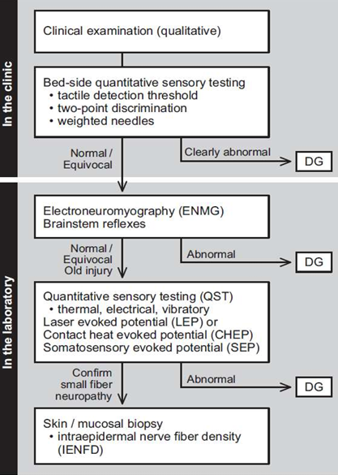
  

## Blokki 4 

### O/V

Potilas, jolla on ollut TIA kahden viikon sisään tulee lähettää AVH hälytyksenä sairaalaan

  <button class="solution-button"
          data-label="Vastaus"
          data-hide-label="Piilota">
    Vastaus
  </button>
  

Väärin 

---

AVH-hälytys tehdään potilaasta, jolla on akuutti käynnissä oleva oire. Ohittunut TIA ei ole aihe AVH-hälytykselle. TIA-kohtaukset tulee tosin lähettää päivystykseen, jos oireesta on kulunut alle 2vk. Ei vain tarvita ambulanssia pillit päällä menemään (potilas ei kuitenkaan saa itse ajaa päivystykseen, vaan ajokielto tulee määrätä jo epäilyssä).  

  

### O/V

Perfuusiokuvantaminen tehdään kaikille AVH hälytyksenä tulleille potilaille

  <button class="solution-button"
          data-label="Vastaus"
          data-hide-label="Piilota">
    Vastaus
  </button>
  

Väärin 

---

Perfuusiokuvantaminen tehdään erityisesti, jos mietitään liuotusta ja on kyseessä wake-up-stroke (herätessä oireet) tai oireen alusta on 4,5- 9h (jos trombektomiaa mietitään, niin wake-up-stroke tai >6h vaatii perfuusiokuvantamisen; aikaikkuna ad 24h).

Perfuusiokuvantamisen tarkoitus on arvioida, kuinka suuri penumbra on. Penumbra = Infarktiytimen ympärille oleva vielä pelastettavissa oleva aivokudoksen alue. Sen tulee yleensä olla merkittävästi isompi kuin infarktiytimen, jotta rekanalisaatiota mietittäisiin. Esimerkiksi trombektomiassa infarktin ytimen on oltava alle 70ml ja pelastettavaa kudosta suhteessa 1:2 (ydin:penumbra).

  

### O/V

Arteria cerebri anteriorin eli ACA:n infarktissa on alaraajapainotteinen hemipareesi

  <button class="solution-button"
          data-label="Vastaus"
          data-hide-label="Piilota">
    Vastaus
  </button>
  

Oikein  

---

ACA suonittaa liikeaivokuoren mediaalista osaa -> homunkuluksen mukaan osuu enemmän alaraajoihin. Mikäli myös yläraaja on affisioitunut, pareesi painottuu proksimaalisesti. Huom! kuitenkin, että isoloitu alaraajaoire on äärimmäisen harvoin aivoinfarktin oire tai ylipäätään aivoperäinen.

ACA-infarktissa voi myös olla psyykkisiä oireita: hidastuminen, jähmeys, puhumattomuus tai vähäpuheisuus, euforia tai apaattisuus ja frontaalistyyppinen kognitiivinen häiriö. Mahdollisesti myös virtsainkontinenssia, jos frontaalilohkon virtsakeskus on affisioitunut 

Simppelisti voi ajatella seuraavasti, kun päättelee, mikä aiheuttajasuoni aivohalvauksen taustalla on oireiden perusteella: 

<li>ACA = mm. alaraajapainotteinen kontrateraalinen sensomotorinen pareesi/plegia</li>
<li>MCA =  mm. yläraaja- ja kasvopainotteinen kontralateraalinen sensomotorinen pareesi/plegia</li>
<li>PCA = mm. näköhäiriöt (klassisesti kontralateraalinen homonyymi hemianopia ja makulan säästyminen)</li>

---

Vielä simppelimmin:

<li>Etukierto (karotisalue = a. carotis internan ruokkimat ACA+PCA) = mm. hemipareesi</li>
<li>Takakierto (vertebrobasilaarialue = vertebralisten ruokkimat basilaris, PCA ja pikkuaivovaltimot) = mm. näköhäiriöt, huimaus</li>

  

### O/V

Trombektomian vasta-aiheena on antikoagulaatiohoito

  <button class="solution-button"
          data-label="Vastaus"
          data-hide-label="Piilota">
    Vastaus
  </button>
  

Väärin  

---

Aktiivinen antikoagluaatio on liuotuksen vasta-aihe, mutta ei ole trombektomian vasta-aihe. Trombektomian vasta-aiheita ovat mm. liian suuri infarktin ydin, TT-angiossa hoitoon soveltumaton anatomia ja vasta-aihe varjoaineenkäyttämiseen (”jodiallergia” estää tmp suorittamisen). 
  

### O/V

Liuotusta ei tule aloittaa jos natiivi TT:ssä ei näy infarktia

  <button class="solution-button"
          data-label="Vastaus"
          data-hide-label="Piilota">
    Vastaus
  </button>
  

Väärin  

---

Natiivi-TT otetaan aivoinfarktiepäilyssä sen takia, että poissuljetaan verenvuodot, joka olisi liuotuksen vasta-aihe. Usein akuutissa vaiheessa ei TT:ssä näy mitään akuutisti iskeemistä (yleensä vasta >3h jälkeen jotain lieviä merkkejä), vaan aivoinfarktin diagnoosi on kliininen ja liuotus aloitetaan vasta-aiheiden poissulun jälkeen. 

  

### O/V

Oikeanpuoleisessa pikkuaivoinfarktissa on tyypillisenä löydöksenä saman raajapuolen kömpelyyttä ja ataksiaa

  <button class="solution-button"
          data-label="Vastaus"
          data-hide-label="Piilota">
    Vastaus
  </button>
  

Oikein  

---

On hyvä tiedostaa, että isoaivoinfarkteissa oireet ilmenevät kontralateraalisesti leesiosta, mutta pikkuaivot säätelevät koordinaatiota ja lihastonusta samanpuoleisesti -> oireet ipsilateraalisesti leesiosta.  
  

### Toistuvia päänsärkykohtauksia 

43-vuotias mies tuli vastaanotolle kolme viikkoa kestäneen päänsärkyoireen takia. Hän kertoi kovista päänsärkykohtauksista, joissa kipu paikantui vasemman silmän ja ohimon seutuun. Kipukohtauksia tuli 3-4 kertaa päivässä, ne kestivät tunnin verran kerrallaan ja niihin liittyi vasemman silmän kyyneleritys ja vasemman sieraimen vuoto. Sidekalvon verestystä tai silmäluomen roikkumista hän ei ollut huomannut. Yksi kohtauksista tuli aina yöllä klo 1.30 aikoihin. Hänellä oli ollut samanlaista päänsärkyä viikon ajan vuosi takaperin. Neurologinen statustutkimus oli normaali. 

- a. Mikä on diagnoosiehdotuksesi? Perustele
- b. Mitä akuuttihoitoa ja estohoitoa tarjoaisit potilaalle?

  <button class="solution-button"
          data-label="a"
          data-hide-label="a - Piilota">
    a
  </button>
  

Kohtauksittainen, silmän alueelle paikantuva, voimakas päänsärky ja autonomiset oireet (kyyneleritys, nenän tukkoisuus ja vuoto) sopivat sarjoittaiseen päänsärkyyn (Hortonin neuralgia). Kivun syklinen luonne (ilmeisesti viime vuonna samaan vuodenaikaan samanlaista.) ja potilaan ikä ja sukupuoli (pääasiassa sarjoittainen päänsärky on 20–50-vuotiaiden miesten sairaus) sopisivat sarjoittaiseen päänsärkyyn. Myös yöllä nukahtamisen jälkeen alkava kohtaus on tyypillistä sarjottaiseen päänsärkyyn.
  

  <button class="solution-button"
          data-label="b"
          data-hide-label="b - Piilota">
    b
  </button>
  

100% O2 12-15l/min + nopeavaikutteinen triptaani (sumatriptaani s.c/i.n. tai tsolmitriptaani i.n.). Estolääkkeenä ensisijaisesti verapamiili ja sen tehon alkamista odottessa voidaan lyhyen pahenemisjakson lisähoidoksia ja siltahoitona käyttää glukokortikoidia (tablettiglukokortikoidin (prednisoni) annos on 60–100 mg/vrk 5 vrk:n ajan, minkä jälkeen annosta lasketaan 10 mg 4 vrk:n välein). 
  

### Aurallinen migreeni

19-v nainen tulee vastaanotolle aurallisen migreenin vuoksi. Perussairauksina astma, johon tarvittaessa Ventoline (salbutamoli). Lisäksi käytössä yhdistelmä e-pillerit. Potilas harrastaa uintia kilpatasolla. Migreenikohtauksiin potilas käyttää ibuprofeeni 800mg+parasetamoli 1g. Kohtauslääkkeet auttavat hyvin. Kohtauksia on kuitenkin usein ja kohtauslääkkeitä tarvitsee päiväkirjan mukaan n. 4 päivänä viikossa.

Miten hoidat? (3 pistettä)

  <button class="solution-button"
          data-label="Vastaus"
          data-hide-label="Piilota">
    Vastaus
  </button>
  

Aurallinen migreeni on vasta-aihe yhdistelmäehkäisyn käytölle (aivoinfarktin riskiä nostava vaikutus; aurallinen migreeni on pienehkö riskitekijä aivoinfarktille ja estrogeeni lisää riskiä entisestään lisäämällä hyytymistaipumusta). **Ehkäisyvalmiste on vaihdettava esimerkiksi pelkkää progesteronia sisältäviin minipillereihin.**

---

Potilas myös syö runsaasti kipulääkkeitä (16 kertaa kuukaudessa ibuprofeeni 800mg+parasetamoli 1g). Potilas myös saa hyvän vasteen näistä, joten ei ole sen suhteen syytä vaihtaa kohtauslääkettä. Kuitenkin lääkepäänsäryn riski on koholla, jos todetaan särkylääkkeiden liikakäyttöä (NSAIDeja ja/tai parasetamolia 15 tai useampana päivänä kuukaudessa; triptaanien kanssa liikakäyttöä olisi 10 tai useampana päivänä kuukaudessa). Särkylääkepäänsäryn riski on erityisesti koholla, jos liikakäyttöä > 3 kk ajan. Potilas on siis korkeassa riskissä särkylääkepäänsärylle, vaikka sitä ei ehkä vielä olekaan kehittynyt (Särkylääkepäänsärky on päivittäistä tai lähes päivittäistä päänsärkyä. Se alkaa usein aamuyöllä, kun särkylääkkeen vaikutus loppuu. Särky on tylppää ja siihen voi liittyä pahoinvointia, ärtymystä ja univaikeuksia. Särky poikkeaa usein alkuperäisestä, hoitoa vaatineesta päänsärystä). 

Olisi siis järkevää saada potilasta vähentämään käyttämäänsä särkylääkemäärää, mutta tämä on ymmärrettävästi vaikeaa, jos oirepäiviä on runsaasti. Oirepäivien vähentämiseksi on tärkeää aloittaa estolääkitys. Ei ole tarkkaa rajaa sille, kuinka paljon kohtauksia tulee olla, jotta estolääkitys olisi indikoitua, mutta tässä tapauksessa se on selvästi tarpeen (yleensä jo 2 tai 3 migreenipäivää kuukaudessa voi olla aihe tai jos migreeni hankaloittaa jokapäiväistä elämää). PTH:ssa ensisijaisia lääkkeitä ovat beetasalpaajat (esim. propranololi), aniotensiinireseptorin salpaajat (esim. kandesartaani), trisykliset masennuslääkkeet (esim. amitriptyliini) ja jotkin epilepsialääkkeet (esim. topiramaatti). 

<li>Beetasalpaaja ei ole hyvä, koska potilaalla on astma (vasta-aihe) ja kilpauinti harrastuksena (laskee sykettä ja voi heikentää maksimaalista fyysistä suorituskykyä)</li>
<li>Muista lääkkeistä kandesartaani on paras, koska sillä on vähiten sivuvaikutuksia -> **aloitetaan estolääkkeeksi kandesartaani.** Jatkossa migreenipäiväkirjan pito jatkuu, kontrolli 3 kuukauden kuluttua. Hoidon tavoitteena on kuukauden migreenipäivien puolittuminen. Tehokasta ennaltaehkäisevää hoitoa suositellaan jatkettavaksi vähintään 6 kk suun kautta otettavien lääkkeiden osalta ennen kuin harkitaan hoidon lopettamista. Jos tilanne lopetuksen jälkeen voimistuu, suositellaan hoidon jatkamista.</li>
  

### Etenevää heikkoutta ja kömpelyyttä

62-v nainen hakeutuu tk:n vastaanotolle. Hän on havainnut puolen vuoden aikana etenevää heikkoutta ja kömpelyyttä, joka on nyt alkanut levitä muihin raajoihin. Statuksessa toteat oikeassa alaraajassa heikentyneen dorsifleksion, polven ekstension ja lonkan koukistuksen. Reisilihas on lievästi atrofioitunut oikealla. Havaitset myös faskikulaatioita reiden ja pohkeen alueella. Muidenkin raajojen lihasvoima vaikuttaa hieman alentuneelta ja kämmenten pikkulihaksissa on atrofiaa. Refleksistatus on kauttaaltaan vilkastunut molemminpuolin yläraajoissa ja alaraajoissa, babinski oikealla +, vasemmalla -. Tonus on hieman koholla oikeassa yläraajassa, alentunut oikeassa alaraajassa ja normaali vasemmassa raajaparissa.

- a. Mitä tarkentavia kysymyksiä esität potilaalle?
- b. Listaa oleellisimmat erotusdiagnostiset vaihtoehdot? Perustele. 
- c. Lähetät potilaan neurologialle jatkotutkimuksiin. Mitä tutkimuksia neurologi ohjelmoi ja miksi? 

  <button class="solution-button"
          data-label="a"
          data-hide-label="a - Piilota">
    a
  </button>
  

<li>Toimintakyky ennen ja nyt (Mihin oirekuva vaikuttaa? Työkyky? Urheilusuoritukset? yms</li>
<li>Muut sairaudet</li>
<li>Lääkkeet (esim. statiinit lihasheikkoudessa kannattaa aina kysyä)</li>
<li>Mistä kehonosasta ja miten oireisto tarkalleen alkoi? Miten nopeasti levinnyt muihin raajoihin?</li>
<li>Onko oirekuvassa vaihtelua?</li>
<li>Traumaa? Aikaisempia aivotapahtumia? Myrkytysmahdollisuutta?</li>
<li>Yleisoireita (väsymys, kuume, painonmenetys, yöhikoilu, nukkuminen, ruokahalu, ihoreaktioita,)?</li>
<li>Muita neurologisia oireita (tunto-oireita, virtsaamisen/ulostamisen ongelmia, sekavuutta, muistiongelmia, huimausta, päänsärkyä, puutosoireita aivohermoalueilla, hengitysvaikeuksia, nielemisvaikeuksia, mieliala (hallitsematonta naurua/itkua? tyypillistä vauriolle kortikobulbaarisessa radastossa esim. ALS, MS tai strokessa -> ns. pseudobulbaariaffekti))</li>
<li>Sukuanamneesi</li>

  

  <button class="solution-button"
          data-label="b"
          data-hide-label="b - Piilota">
    b
  </button>
  

Potilaalla on samaan aikaan sekä ylempien (UMN; vilkkaat refleksit, Babinski, hypertonia) että alempien (LMN; atrofia, faskikulaatiot) motoneuronien vaurio-oireita, jotka ovat edenneet suhteellisen nopeasti (6kk). Oireilu on oikealle painottuvaa, mutta vasen puolikin on affisioitunut. 

Parhaiten tilanne sopii amyotrofiseen lateraaliskleroosiin (ALS). ALS on yleisin motoneuronisairaus ja se vaurioittaa sekä ylempiä että alempia motoneuroneita. Sensorisessa hermotoiminnassa häiriötä harvemmin. Ensioireena tyypillisesti toispuolisena käden tai alaraajan lihasten heikkous ja atrofia. Voi myös alkaa bulbaarisesti (alkuoireena puheen ja nielemisen heikentyminen; kielessä atrofiaa ja faskikulaatioita). Tauti on progressiivinen ja lopulta hengityslihaksetkin lamaantuvat (yleisin kuolemansyy). Odotettu elinikä diagnoosin jälkeen on n. 2-5 vuotta. 

---

Voi myös pitää mielessä mm. kaularangan radikulomyelopatian (kaularangan kulumat voivat painaa sekä hermojuuria (LMN-oireet yläraajoissa) että selkäydintä (UMN-oireet alaraajoissa); yleensä ei kuitenkaan potilaan tapaan ilmene faskikulaatioita jaloissa; useimmiten myös sensorisia oireita ilmenisi) ja selkäytimen multippelit kasvaimet (sekamuotoisia oireita riippuen sijainnista). CIPD (krooninen tulehduksellinen demyelinoiva polyradikuloneuropatia) voisi myös käydä mielessä johtuen alaraaja-alkuisesti progressiivisesti >8vk edenneestä taudinkuvasta johtuen, mutta se affisioi vain perifeerisiä hermoja eikä selitä ylämotoneuronivaurion kuvaa. 
  

  <button class="solution-button"
          data-label="c"
          data-hide-label="c - Piilota">
    c
  </button>
  

Amyotrofisen lateraaliskleroosin (ALS) **ensisijainen diagnostiikkaa tukeva tutkimus on ENMG ja sen lisäksi tarvitaan pään ja selkäytimen MRI muiden sairauksien poissulkemiseksi.** ENMG:ssä tyypillistä on runsas aktiivinen alemman motoneuronin denervaatio ja normaali tuntohermojen toiminta. 

Verikokeita (esim. PVKT, elektrolyytit, Krea, ALAT, CK, CRP, glukoosi, harkiten B12, B9 ja päihdelabrat, raskasmetallit jos epäily altistumisesta) myös usein otetaan selvittelemään muita mimikoivia sairauksia, mutta ALS:ssa laboratoriotutkimuksissa ei ole spesifisiä löydöksiä, vaikka S-CK (johtuen denervaatioatrofiasta -> samoin ALAT vähän koholla) ja Li-Prot saattavat jonkin verran suurentua.
  

### Iltaisin pakottavaa tunnetta jaloissa

Potilas valittaa iltaisin jaloissa outoa pakottavaa tunnetta, kuin tarve liikutella niitä. Yöllä potilas heräilee samaan tunteeseen. Liikkuessa vaiva lievittyy, päivällä oireita ei esiinny. Mitä epäilet? Tyypilliset statuslöydökset? Mistä tutkimuksista voisi olla hyötyä? Miten hoidat? (4 pistettä) 

  <button class="solution-button"
          data-label="Vastaus"
          data-hide-label="Piilota">
    Vastaus
  </button>
  

Iltapainotteinen, vaikeasti kuvattavissa oleva tuntemus jaloissa, joka helpottaa niitä liikuttamalla herättää epäilyn levottomista jaloista (RLS). 

Tyypillisesti neurologisessa statuksessa ei tällaisella potilaalla löydy mitään poikkeavaa ja diagnoosi perustuukin muiden syiden poissulkemiseen ja anamneesiin. 

Usein otetaan laajalti laboratoriokokeita poissulkemaan sekundaarisesti tunteita aiheuttavia syitä (ferrit, TfFeSat, na, k, krea, ALAT, gluk, HbA1c, folaat, B12-TC2, TSH). Runsas kahvinjuonti, raskaus, uniapnea, alkoholi, litium, neuroleptit ja fenytoiini voivat pahentaa oireistoa -> kysellään siis kahvinjuonti, raskauden mahdollisuus, uniapneaoirekysely STOP-BANG, alkoholinkäyttö ja lääkitys. 

Diagnoosi on kliininen (ja sekundaariset syyt poissuljetaan); diagnoosi ja hoidon aloittaminen kuuluu PTH. Hoidoksi voi riittää alaraajojen hieronta, venyttely, liikunta, lämpimät ja viileät jalkakylvyt, itselle mieluisat aktiviteetit sekä riittävä uni. Pyritään myös välttämään altistavia aineita (esim. kofeiini). Potilaalle rautalisä, fos S-ferritiini <75 ug/l tai transferriinin saturaatio < 25 % (raudanpuute on yleinen sekundaarinen syy). Lääkehoidossa ensilinjana gabapentinoidit (ja/tai dopamiiniagonistit, mutta niillä riski augmentaatiolle, joten gabapentinoidit yleensä ensisijaisia); jos näillä ei helpota, niin tulee tehdä lähete neurologille. 

---

Potilaan yöllinen heräily voi liittyä itsenäisestikin levottomiin jalkoihin (kevyen unen vaiheessa herättävät), mutta suurella todennäköisyydellä liittyvät myös jaksottaiseen raajaliikehäiriöön (PLMD), jossa tapahtuu toistuvia stereotyyppisiä raajaliikkeitä unen aikana (suuri osa ei itse tunnista liikkeitä ja ne voivat itsessään pirstaloida unta ja aiheuttaa päiväväsymystä; lyhytkestoisista heräämisistä on taas RLS:n takia vaikea taas nukahtaa). Hoito on PLMD:hen kuitenkin sama kuin RLS:ään, joten sen selvittely ei sinänsä ole pakollista, jos ei ole muuta syytä tehdä yöpolygrafiaa (esim. uniapneaepäily; samalla siis arvioidaan jalka-antureilla liikehäiriötä). 
  

### Parkinson-potilaan tilanvaihteluiden ja pakkoliikkeiden hoito

71-vuotias kognitiivisesti hyvävointinen mies sairastaa edennyttä Parkinsonin tautia. Kattavasta lääkityskokeiluista huolimatta hänellä esiintyy tilanvaihteluita ja pakkoliikkeitä. Vapinaa potilaalla ei ole merkittävästi. Mitä hoitomuotoja potilaalle tulisi harkita? Perustele valintasi. (2 pistettä) 

  <button class="solution-button"
          data-label="Vastaus"
          data-hide-label="Piilota">
    Vastaus
  </button>
  

Tehtävänannossa kuvataan, että "kattavasta lääkityskokeilusta huolimatta" esiintyy on-off-ongelmaa ja dyskinesioita. Parkinsonin taudin edenneessä vaiheessa oirekuva alkaa usein siis vaatimaan laiteavusteista hoitoa, kun tyypillinen suun kautta otettava lääkehoito ei enää riitä. Käytettävissä on muutama eri hoitomuotoa:

<li>Syväaivostimulaatio eli deep brain stimulation (DBS)</li>
<li>Neuro-HIFU</li>
<li>Jatkuva levodopa-karbidopa- tai levodopa-karbidopa-entakaponi-infuusiopumppu suoleen</li>
<li>Jatkuva foslevodopa/foskarbidopa-infuusiopumppu s.c.</li>
<li>Apomorfiini-infuusiopumppu s.c.</li>

---

Potilas on kognitiivisesti hyväkuntoinen (DBS:n kriteeri on, ettei ole dementiaa) ja tauti vielä vastaa levodopaan (ennustaa hyvää DBS-vastetta). Ikärajana on tosin pidetty  70 vuoden ikää, mutta siitä voidaan poiketa joissakin tapauksissa potilaan muun terveydentilan ja tehtyjen esitutkimusten perusteella (klinikkakohtainen ikäraja).

Neuro-HIFUn teho on paras vapinaan, vaikka se kyllä tehoaa dyskinesioihinkin. HIFU-toimenpiteet ovat kuitenkin tällä hetkellä vain unilateraalisiin leikkauksiin hyväksyttyjä, mikä hieman rajoittaa sen käyttöä, jos oirekuva on erityisen häiritsevät molemmilla puolilla. Voidaan miettiä senkin mahdollisuutta, mutta DBS olisi tässä tapauksessa neuromodulaatioihoidoista todennäköisesti ensisijainen. 

Jos neuromodulaatiohoitoa ei halutakaan toteuttaa, niin sitten infuusiopumput ovat hyviä. 
  

### Ambulanssi tuo päivystykseen kouristaneen, tajuttoman aikuispotilaan. Tyks Akuutin lääkärinä tai amanuenssina sinun tulisi miettiä seuraavia asioita, vastaa kysymyksiin lyhyesti! (6 pistettä)

- a. Mistä kaikesta voi olla kyse?
- b. Mitä tietoja pyrit saaman tapahtuneesta sekä taustoista ja miten ne vaikuttavat jatkopäätöksiisi?
- c. Mitä muita kuin laboratoriotutkimuksia tilaat tai ehdotat?
- d. Mitä oletat näiden tutkimuksien avulla selviävän?
- e. Minkälaisiin hoitovaihtoehtoihin tutkimuslöydökset voivat johtaa?
- f. Mitä lisätutkimuksia voidaan jatkossa tarvita diagnoosin varmistamiseksi?

  <button class="solution-button"
          data-label="a"
          data-hide-label="a - Piilota">
    a
  </button>
  

Potilaalla voi olla ihan primaarinen epileptinen kouristus ilman altistavaa tekijää, mutta sekundaariset syyt tulee miettiä läpi myös. Epileptisen kohtauksen sekundaariset syyt voi muistaa muistisäännöstä VITAMINS

<li>Vascular (Aivoverenvuoto (ICH/SAV), aivoinfarkti)</li>
<li>Infection (bakteerimeningiitti tai enkefaliitti)</li>
<li>Trauma</li>
<li>Autoimmune</li>
<li>Metabolic (esim. hypoglykemia, hyponatremia, hypokalsemia, hypomagnesemia, hepaattinen enkefalopatia, uremia, hypoksemia...)</li>
<li>Ingestion or wIthdrawal (varsinkin alkoholi ja bentsot ja varsinkin niiden vieroitustilat; monet lääkkeetkin alentavat kouristuskynnystä, esim. klotsapiini, bupropioni, tramadoli, monet antibiootit, litiumim korkeat tasot...)</li>
<li>Neoplasm</li>
<li>pSych (esim. toiminnallinen kohtaus)</li>

---

Tietysti kohtausoireen erotteluun kuuluu aina synkopeen mahdollisuuden selvittäminen (vasovagaaliset, ortostaattiset ja kardiologiset syyt). 

---

Tehtävänannosta on hieman epäselvää, onko potilas siis vieläkin tajuton. Jos on kouristanut ja nyt ei enää kouristele, mutta on tajuton, niin kyseessä voi olla mahdollisesti myös nonkonvulsiivinen status epilepticus. 

---

Tajuttomuuden yleisimmät syyt voi muistaa muistisäännöstä VOI IHME! ja nämä syyt pääasiassa sisältyvät myös VITAMINS-muistisääntöön. Kertaukseksi kuitenkin: 

<li>Vuoto kallon sisällä (spontaani, traumaattinen)</li>
<li>O2 puute (globaali anoksia, aivoinfarkti)</li>
<li>Intoksikaatio</li>
<li>Infektio (meningiitti, enkefaliitti)</li>
<li>Hypoglykemia (muista mitata!)</li>
<li>Infektio (meningiitti, enkefaliitti)</li>
<li>Matala verenpaine</li>
<li>Epilepsia (postiktaalinen tila vs jatkuva status)</li>
<li>! = Simulaatio (poissulkudiagnoosi)</li>

  

  <button class="solution-button"
          data-label="b"
          data-hide-label="b - Piilota">
    b
  </button>
  

Tärkeää on saada kohtauskuvaus ja tapahtumatiedot. Potilaalta on näitä käytännössä mahdotonta usein saada itse kohtauksesta, mutta tulee kuitenkin kysyä edeltävistä tunteista (aisti-, puhe- , motoriset, autonomiset oireet ja niiden paikantuminen) ja kohtauksenjälkeisistä oireista, heti kun hän tokenee. Tietysti myös kannattaa kysyä, onko muistikuvia kohtauksesta. Tärkeää on löytää silminnäkijä ja kysyä häneltä, mitä kohtauksen aikana tapahtui. Miten alkoi? Kuinka kauan kesti? Oireiden symmetria ja luonne, mahdolliset liitännäisoireet, ihon väri, inkontinenssi, kieleen pureminen? Jälkitila: jälkiunen ja sekavuuden esiintyminen ja kesto, aggressiivisuus, ahdistuneisuus, puheen palautuminen ja mahdolliset halvausoireet. Loukkasiko potilas itseään kohtauksen aikana (ohjaa jatkotoimenpiteitä, jos merkittäviä vammoja). 

<li>Kuvaus kohtauksen alusta, kulusta ja jälkioireista auttaa selvittämään, onko kyseessä oikeasti ollut epileptinen kohtaus vai enemmänkin esim. synkopee</li>
  <ul>
    <li>Esioireet: Epileptisessä kohtauksessa eniten aistioireita (esim. outo hajukokemus) ja psyykkisiä oireita; Synkopeessa tyypillisintä pahoinvointi, kalpeus, hikoilu, heikotus ja/tai näön hämärtyminen</li>
    <li>Kaatumisenaikainen lihastonus: Epileptisessä kohtauksessa yleensä tooninen, synkopeessä yleensä atooninen</li>
    <li>Lihasnykäysten määrä: Epileptisessä kohtauksessa rytmisiä, voimakkaita ja voivat jatkua pidempään; Synkopeessa lyhyitä, epäsäännöllisiä ja niitä on vähän (usein alle 10 nykäystä; on olemassa ns. 10/20 rule eli <10 nykäystä viittaa synkopeehen ja >20 epileptiseen kohtaukseen). Nykiminen alkaa synkopeessa vasta, kun henkilö on jo veltostunut ja kaatunut; epileptisessä kohtauksessa kohtaus yleensä alkaa heti kouristuksella</li>
    <li>Kesto: Synkopee yleensä lyhytkestoisempi (n. 3-30s), epileptinen kohtaus yleensä vähän pidempi (30s-pari minuuttia)</li>
    <li>Kielen purenta: Epileptisessä kohtauksessa yleisempää ja voi olla lateraalisestikin; synkopeessa korkeintaan kielen kärjen purenta</li>
    <li>Silmien avonaisuus: Epileptisessä kohtauksessa usein auki, synkopeessa yleensä kiinni</li>
    <li>Inkontinenssi: Yleisempää epileptisessä kohtauksessa</li>
  </ul>
<li>Auttaa myös jo alustavasti selvittämään kohtaustyyppiä (paikallisalkuinen/suoraan yleistynyt)</li>

---

Taustoista on tärkeää selvittää aiempi epilepsia, pään vammat, aikaisemmat AVH:t, alkoholin/päihteiden käyttö, lääkitys yms. altistavat tekijät, kuten sukurasite ja äärimmäiset rasitustilat: paasto, teräsmieskisat, pitkäaikainen valvominen. Myös muut sairaudet tulee selvittää.

<li>Jos tiedossa on jo epilepsia, niin pään kuvantaminen ei ole yhtä tärkeää kuin ensikouristajilla</li>
<li>Onko potilaan lähistöltä löydetty lääkepurkkeja tyhjänä -> ohjaa ajattelua yliannostukseen</li>
<li>Altistavat tekijät ohjaavat jatkoselvittelyitä ja vaikutuksia diagnoosiin; ei siis ole sinänsä epilepsia kyseessä, jos kohtaus liittyy johonkin välittömään ja poikkeukselliseen altistavaan tekijään (akuuttiin aivovammaan, aivosairauteen, tai systeemiseen häiriöön) ja jos altistava tekijä voidaan poistaa tai hoitaa muutoin. Altisteisena kohtauksena pidetään 7 vrk kuluessa akuutista aivotapahtumasta esiintynyttä epileptistä kohtausta</li>

  

  <button class="solution-button"
          data-label="c"
          data-hide-label="c - Piilota">
    c
  </button>
  

EKG ja telemetriaseuranta kaikille. 

Pään TT (MRI raskaana olevilta tai nuorilta), jos ensikouristaja / potilas loukkasi päänsä kohtauksen yhteydessä / epäily kallonsisäisestä prosessista, joka tutkittava. 

EEG (usein vasta jatkoselvittelyinä polilla), jos potilas kouristaa uudestaan päivystyksessä tai tämä otetaan osastohoitoon hoidettavan syyn vuoksi. EEG myös aiheellinen, jos potilas on vieläkin tajuttomana pitkäkestoisesti päivystyksessä, koska EEG:llä voidaan todeta nonkonvulsiivinen status epilepticus. 

CNS-infektioepäilyssä (esim. potilaalla korkea kuume) likvor. 
  

  <button class="solution-button"
          data-label="d"
          data-hide-label="d - Piilota">
    d
  </button>
  

EKG voi selittää, onko tajuttomuuden ja sitä seuranneen kouristuksen taustalla rytmihäiriö. TT selvittää, onko vuoto tai aivoinfarkti taustalla. Joskus siitäkin voi nähdä viitteitä mahdollisesta tuumorista (MRI kuitenkin tähän paljon parempi). EEG voisi mahdollisesti osoittaa purkaustoimintaa. Enkefaliitissa (joka CNS-infektioista tyypillisin kohtausten aiheuttaja) likvorlöydös on yleensä aika samanlainen kuin virusmeningiitissä (leuk hieman koholla, diffissä lymfosyyttivaltaisuus, gluk normaali, prot lievästi koholla, laktaatti normaali). 
  

  <button class="solution-button"
          data-label="e"
          data-hide-label="e - Piilota">
    e
  </button>
  

Jos normaalit labrat, EKG ja kuvantaminen ensikouristajalla, niin seuranta 6h päivystyksessä, jonka jälkeen kotiutuminen jos kouristus ei  ole uusiutunut ja tajunnantila sekä muu status on normaali. Lähete neurologian poliklinikalle. Ajokielto vähintään selvittelyjen ajaksi: R1 3kk, R2 5v. 

Jos löytyy aivoverenvuoto -> Neurokirurginen konsultaatio ja verenpaineen hallinta

Jos enkefaliittiepäily likvorin perusteella -> empiirinen kolmoishoito (asikloviiri+doksisykliini+keftriaksoni; jatkohoito PCR ja vasta-ainetutkimusten perusteella)

Jos epäily nonkonvulsiivisesta status epilepticuksesta, niin status epilepticuksen hoitolinjojen mukaan bentsot ensin, sitten tarvittaessa iv epilepsialääkkeet ja vielä tarvittaessa sedaatio teho-osastolla propofolilla. 
  

  <button class="solution-button"
          data-label="f"
          data-hide-label="f - Piilota">
    f
  </button>
  

Neurologian poliklinikalla ensikouristajan jatkoselvitykset jatkuvat pään MRI-kuvantamisella ja EEG-selvittelyillä. 
  

