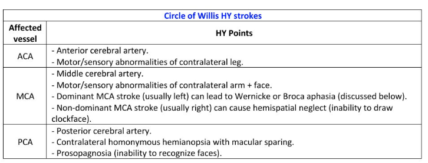
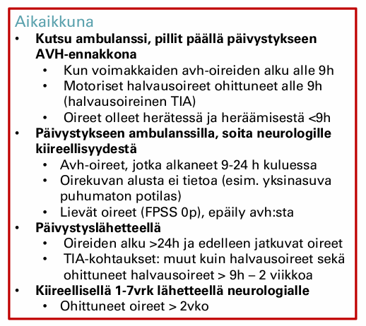
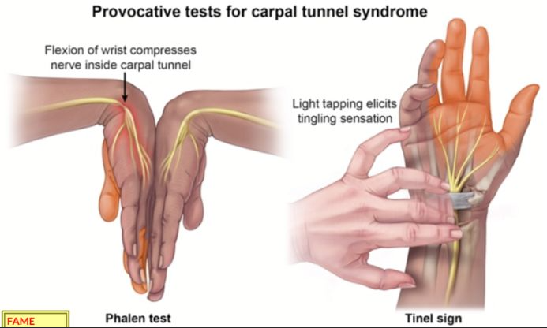
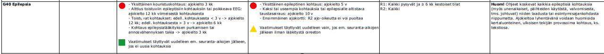

# 2023

## Blokki 1 

Pari samaa kysymystä kuin seuraavien vuosienkin tenteissä, joten ei niitä nyt uudestaan (oslivat Parkinsonin ja myastenia graviksen oireet+statuslöydökset sekä ensikouristajan anamneesi+tutkimukset+ajo-oikeus).
### AVH-epäily

Työskentelet terveyskeskuslääkärinä. 65-vuotias omatoimisesti kotona asuva mies saapuu akuuttiajalle klo 10. Tunti sitten (klo 9) kahvia keittäessä potilaan oikea käsi mennyt yhtäkkiä veltoksi. Pystynyt kuitenkin itse ajamaan auton terveyskeskukseen. Tavatessa tajunnantaso hyvä, oikea yläraaja laskeutuu kannatuksessa, puheessa lievä afasia.

- a. Minkä aivoalueen iskemiasta arvioit olevan kyse? (1p)
- b. Miten toimisit jos oireisto olisi jo ohittunut potilaan tullessa terveyskeskukseen (oireiden alusta 1h, mutta oireet ohittuneet potilaan tullessa vastaanotolle) ja miksi? Vastaa lyhyesti (2p)

  <button class="solution-button"
          data-label="a"
          data-hide-label="a - Piilota vastaus">
    a
  </button>
  

Oikean yläraajan pareesi, afasia -> vasen MCA

  

  <button class="solution-button"
          data-label="b"
          data-hide-label="b - Piilota vastaus">
    b
  </button>
  

Nopeasti ohittuneet AVH-oireet -> sopii TIA-kohtaukseksi. Alle 2 viikkoa vanha TIA-kohtaus vaatii päivystyksellistä selvittelyä, riskinä on kohtauksen uusiutuminen. Lähetän potilaan päivystykseen.

Potilas ei kuitenkaan saa itse ajaa sairaalaan, vaikka hän on omatoimisesti terveyskeskukseenkin tullut!! Halvausoireiset TIA-potilaat, joiden oireiden ohittumisesta on alle 9h kuuluvat sinänsä AVH-ennakkonna ambulanssilla pillit päällä päivystykseen. 

  

### Näköoireet ovat yleisiä oireita neurologisilla potilailla. Kuvaile lyhyesti minkälaisesta oireesta on kyse seuraavissa tapauksissa (esim. miten potilas kuvailee oiretta, mahdolliset statuslöydökset)

- a. Amaurosis fugax (TIA) (2p)
- b. Migreeniaura (2p)
- c. näköhermon tulehdus (2p)

  <button class="solution-button"
          data-label="a"
          data-hide-label="a - Piilota vastaus">
    a
  </button>
  

Amaurosis fugax tarkoittaa toisen silmän osittaista tai täydellistä näön menetystä/hämärrystä; on a. ophthalmican suonitusalueen verkkokalvoperäinen TIA. Lyhyen (alle 15 min) näköhäiriön ohella siihen ei liity muita oireita. Oireita voi ilmetä rasituksessa tai asennon muutoksessa jopa päivittäin. Toistuva saman silmän amaurosis fugax johtuu yleensä karotisstenoosista ja siihen liittyvästä embolisaatiosta.
  

  <button class="solution-button"
          data-label="b"
          data-hide-label="b - Piilota vastaus">
    b
  </button>
  

Aurallisessa migreenissä tyypilliset auraoireet ovat näköoireita (yleisin ja usein ensimmäinen, jos monia tyyppejä samaan aikaan), tuntohäiriöitä tai puheen tuoton ongelmia ja niille on ominaista täydellinen palautuvuus. Harvinaisia auraoireita ovat retinaaliset oireet, motoriset oireet hemiplegisessä migreenissä ja aivorunko-oireet aivorunkomigreenissä. 

<li>Näköoireita ovat mm. sahalaitaisuus, valoja, värejä, sokeita pisteitä</li>
<li>Sensorisia oireita ovat mm. ihon pistely, puutuminen ja kihelmöinti</li>
<li>Puheen tuoton ongelmista sananlöytämisen vaikeus yleisin oire</li>
<li>Motorisiin oireisiin kuuluu pääasiassa unilateraalinen lihasheikkous/paralyysi</li>
<li>Retinaalinen oire = näköhäiriö on pelkästään toisessa silmässä</li>
<li>Aivorunko-oireet = Puheen puuromaisuus, kiertohuimaus, korvien soiminen, kuulon heikentyminen, kaksoiskuvat, liikkeiden hapuilu, tajunnantason lasku</li>

---

Migreenin auraoireet tyypillisesti kehittyvät hitaasti laajeten vähintään 5 minuutin aikana (tärkeä ero aivoverenkiertohäiriöihin, jotka yleensä alkavat äkillisesti) tai 2 tai useampi oire seuraa toisiaan. Kukin auraoire kestää 5-60 minuuttia. Auraoireet ovat usein unilateraalisia, kuten päänsärkykin (tosin näköoireet useimmiten bilateraalisia). 

  

  <button class="solution-button"
          data-label="c"
          data-hide-label="c - Piilota vastaus">
    c
  </button>
  

Optikusneuriitin eli näköhermotulehduksen tyypillisimmät oireet ovat unilateraalinen näön hämärtyminen, värinäön heikentyminen (erityisesti punainen) ja silmäkipu (varsinkin silmän takana) erityisesti erityisesti silmää eri suuntiin liikuteltaessa. Oireiden paheneminen ruumiillisen rasituksen tai saunomisen yhteydessä sopii myös näköhermotulehduksen kuvaan (Uhthoffin oire).

Yleensä oireet ilmenevät tunneissa-parissa päivässä. Yleislääkäri lähettää näköhermotulehdusta epäiltäessä potilaan yleensä jatkohoitoon silmälääkärille, etenkin jos kyseessä on ensimmäinen kerta. Usein alkuvaiheessa tehdään värinäkötesti sekä herkästi myös näkökenttätutkimus. Mikäli näköhermotulehdus toistuu tai halutaan poissulkea muita samoin oirein ilmeneviä sairauksia, harkitaan usein pään magneettitutkimusta. 

Usein statuksessa ns. Marcus Gunnin pupilli eli heikentynyt pupillaarikonstriktio, kun lamppua näytetään affisioituneen silmän edessä verrattuna terveeseen silmään (relative afferent pupillary defect (RAPD), voi näkyä jopa dilataationa, kun siirretään lamppu affisioituneeseen silmään terveen silmän jälkeen). 

Näkö korjaantuu yleensä hyvin (ilman hoitoa alkaa parantua 2-3 viikossa n. 80%:lla ja palautuu usein kuuden kuukauden kuluessa; palautuminen voi jatkua vielä 12 kuukauteen asti), mutta värinäkö jää usein puutteelliseksi. Kortikosterodi nopeuttaa näön palautumista, mutta ei vaikuta paranemisen asteeseen. Suuriannoksista kortikosteroidihoitoa harkitaan, jos näöntarkkuus laskee tasolle alle 0.3 tai jos potilas haluaa kortikosteroidihoidon. 

Näköhermotulehduksen taustalla useimmiten näköhermon myeliinikato. Vahvin yhteys on demyelinaatiosairauksiin ja erityisesti MS-tautiin. 
  

### KNF

Luettele käden kivun, puutumisen ja heikkouden tutkimiseen sopivia KNF-tutkimuksia, ja kerro lyhyesti mitä kukin tutkimus voi asiassa selvittää ja mitä diagnostisia vaihtoehtoja voidaan KNF-tutkimuksin varmistaa. (6p) 

  <button class="solution-button"
          data-label="Vastaus"
          data-hide-label="Piilota vastaus">
    Vastaus
  </button>
  

ENMG:n toinen osa eli neurografia (NCS, Nerve Conduction Studies) mittaa sähköisen signaalin johtumisnopeutta ja amplitudia ääreishermoissa.

<li>Johtumisnopeuden hidastuminen viittaa demyelinaatioon (esim. pinnetilat). Amplitudin pieneneminen viittaa aksonaaliseen vaurioon</li>
<li>Käytetään mm. monien pinnetilojen aiheuttamien käden ongelmien varmistamiseen. Esim. rannekanavaoireyhtymä, kubitaalitunnelioireyhtymä, radialishermon pinne, Guyonin kanavan oireyhtymä</li>
<li>Myös mm. polyneuropatiassa paksujen säikeiden vauriossa voidaan todeta muutoksia; esim. symmetrinen amplitudin pieneneminen ja/tai johtumisnopeuden hidastuminen</li>
<li>Tuntohermovasteet ovat normaalit, jos vaurio on takajuuren ganglion proksimaalipuolella</li>

---

ENMG:n toinen osa eli neula-EMG (elektromyografia) mittaa lihaksen sähköistä aktiivisuutta levossa ja supistuksen aikana. Tällä menetelmällä on mahdollista mm.

<li>Tunnistaa tai varmistaa perifeerinen vaurio tai tauti</li>
<li>Erottaa neurogeeninen ja myogeeninen lihasheikkous. Paljastaa siis denervaation esimerkiksi vammasta johtuen.</li>
<li>Paikallistaa perifeerinen vauriopaikka tai häiriintyneen alueen laajuus. Myotomaalinen jakauma -> esim. kaularangan radikulopatia (juurivaurio). Pleksuksen mukainen jakautuma -> pleksusvaurio. Ääreishermon mukainen jakautuma -> ääreishermovaurio.</li>

---

Myastenia-EMG (koostuu yksittäiskuitu-EMG:stä ja toistustimulaatiosta). Testaavat hermo-lihasliitoksen toimintaa

<li>Myastenia gravis voi ilmentyä lihasheikkoutena varsinkin toistoliikkeissä. Diagnostiikassa myastenia-EMG tärkeä (normaali ENMG ei riitä)</li>
<li>Harvemmin ensilinjan tutkimus pelkässä käden puutumisessa tai jos oirekuva ei viittaa myasteniaan</li>

---

Myöhäisvasteet (F-aallot ja H-refleksi) tutkivat hermon proksimaalisia osia ja refleksiratoja. Siinä missä neurografian tavanomainen m-vaste mittaa sähköiskun kulkua suoraan stimulaatiopisteestä lihakseen, myöhäisvasteet (F ja H) tekevät "mutkan" selkäytimen kautta. Myöhäisvasteita mittaamalla saadaan tietoa ääreishermon proksimaaliosien toiminnasta erityisesti silloin, kun distaalisemmat johtonopeusmittaukset ovat normaaleja. F-vasteet syntyvät, kun sähköisellä stimulaatiolla aikaansaadut aktiopotentiaalit etenevät antidromisesti (vastavirtaan) motorisia hermosyitä pitkin selkäytimen etusarven motoneuroneihin. Osa näistä hermosoluista "syttyy" uudelleen ja lähettää impulssin takaisin alas lihakseen (Stimulaatiopiste → Selkäydin → Lihas). 

<li>Alkavissa polyneuropatioissa F-vasteiden poikkeavuudet voivat usein olla ensimmäinen poikkeava neurografialöydös.</li>
<li>F-vasteiden määrä alenee erityisen nopeasti akuutissa polyradikuliitissa, jossa todetaan F-vasteiden määrän väheneminen tai puuttuminen proksimaalisen johtumiskatkoksen seurauksena ja mahdollisesti vielä esiin tulevien F-vasteiden latenssin pidentyminen.  F-vasteiden tärkein yksittäinen diagnostiikkakohde onkin akuutit polyradikuliitit (Guillain-Barrén oireyhtymä).</li>

---

Lämpökynnykset (QST) ja ihobiopsia

<li>Jos on käden kipua ja puutumista, niin voi olla ohutsäieneuropatia kyseessä. Tässä kysymyksenasettelussa ei kuitenkaan olisi todennäköisesti puhdas ohutsäieneuropatia, koska on myös heikkoutta.</li>
<li>QST ja ihobiopsia voivat osoittaa ohutsäievauriot, joita ENMG taas ei osoita (mittaa vain paksuja säikeitä). Ne voidaankin joskus ottaa, jos epäillään ohutsäieneuropatiaa ja ENMG jää negatiiviseksi.</li>

---

Periaatteessa vielä MRI:n voisi laskea KNF:n testeihin. Voidaan tutkia esim. rangan aluetta ja osoittaa hermopinteet sekä ahtaumat, jotka voivat aiheuttaa radikulopatisia kipuja käteen ja aiheuttaa myös heikkoutta. Myös voidaan nähdä viitteitä esim. idiopaattisista neuropatioista eli "neuriiteista", jos on paksuuntumista ja läiskäistä tehostumista spinaalihermossa. 
  

## Blokki 2 

Yksi sama kysymys kuin seuraavinakin vuosina (Parkinson-potilaan lääkemuutokset; haloperidoli ja metoklopramidi käytössä)

### Käden äkillinen heikkous

54-v mies on varannut ajan vastaanotollesi Raision terveyskeskukseen 10 päivää sitten tapahtuneen ohittuneen käden toimintahäiriön vuoksi. Tuolloin ilman ennakko-oireita oikea käsi meni heikoksi niin, että puhelin putosi kädestä. Potilas yritti työkaverilleen selittää tilannetta, mutta ei löytänyt oikeita sanoja. Tätä kesti muutaman minuutin. Sen jälkeen olo normalisoitui ja potilas jatkoi työpäivän loppuun ilman ongelmia. Potilas ei olisi lääkäriin asian takia lähtenyt, ellei olisi vaimolleen sattunut mainitsemaan asiasta tänään, joka patisti varaamaan ajan. Potilas työskentelee yrittäjänä rakennusalalla. Todettuina sairauksina potilaalla on verenpainetauti ja hyperkolesterolemia, joihin lääkitykset. Tupakkaa mies on polttanut noin puoli askia päivässä n. 30 vuotta. Pituus on 182 cm ja paino 100 kg. Potilas nukkuu mielestään hyvin, mutta aamulla on väsynyt ja joskus päätä särkee, vaimon mukaan kuorsaa ja joskus hengityskatkoksiakin.

- a. Mitä AVH riskitekijöitä potilaalla on? (1p)
- b. Voitko päätellä oirekuvan perusteella, minkä aivoverisuonitusalueen häiriöstä on ollut kyse? (1p)
- c. Tarvitseeko potilas neurologin arviota ja jos tarvitsee niin millä aikataululla (päivystys/1-7pv/8-30 pv/kiireetön)? Mitä tutkimuksia neurologi ohjelmoi? (2p)
- d. Miten potilaan riskitekijät hoidetaan? (2p)

  <button class="solution-button"
          data-label="a"
          data-hide-label="a - Piilota vastaus">
    a
  </button>
  

Tupakkatausta, ylipaino, hyperkolesterolemia, verenpainetauti, uniapnea (epäily)

  

  <button class="solution-button"
          data-label="b"
          data-hide-label="b - Piilota vastaus">
    b
  </button>
  

Vasen MCA (sen tyyppioireina juuri yläraajapainotteinen hemipareesi kontralateraalisella puolella ja afasia)
  

  <button class="solution-button"
          data-label="c"
          data-hide-label="c - Piilota vastaus">
    c
  </button>
  

Potilas tulee arvioida päivystyksellisesti. Alle kaksi viikkoa vanha TIA-kohtaus, vaatii päivystyksellisen arvion. 

Päivystyksessä tehtävät tutkimukset : aivojen TT, TT-angiografia, keuhkokuva, EKG, verenpaine, syke, pika-glukoosi ja perus-AVH-labrat (B-PVKT, P-CRP, P-K, P-Na, PKrea, P-/B-Gluk, P-INR, P-APTT)
  

  <button class="solution-button"
          data-label="d"
          data-hide-label="d - Piilota vastaus">
    d
  </button>
  

<li>Kehotetaan lopettamaan tupakointi</li>
<li>Tehostetaan kolesterolilääkitystä (tavoite LDL<1,8 tai <1,4 jos etiologiana oli ateroskleroosi)</li>
<li>Tehostetaan verenpainelääkitystä (tavoite 130/80 kotimittauksissa)</li>
<li>Lisäksi antitromboottinen lääkitys, jos kohtaus ei ollut sydänperäinen (jos eteisvärinä niin AK-lääkitys, ensisijaisesti yleensä DOAC)</li>
  <ul>
    <li>Antitromboottinen lääkitys hieman vaihtelee TIA:n vaikeusasteen (onko ABCD2-pisteet ≥4) ja vuotoriskin mukaan</li>
    <li>Potilaan ABCD2-pisteet ovat tehtävänannon mukaan todennäköisesti 3 (verenpaine todnäk koholla 1p, toispuolinen raajaheikkous 2p), mutta mahdollisesti jos löytyisi diabetes perusselvittelyistä, niin voisi olla 4p.</li>
    <li>Suuren riskin TIAssa (ABCD2 ≥ 4) aloitetaan alkuvaiheessa yhdistelmähoito ASA 100 mg/vrk + klopidogreeli 75 mg/vrk 3 viikon ajaksi, jonka jälkeen jatketaan yhdellä antitrombootilla (esim. klopidogreeli). Jos antitromboottinen lääkitys ei ole ollut aiemmin käytössä (eikä ole kohonnutta vuotoriskiä), aloitetaan hoito latausannoksella ASA 250 mg tai klopidogreeli 300 mg.</li>
    <li>Matalan riskin TIAssa voi aloittaa suoraan antitromboosilääkityksen esim. vain klopidogreelillä</li>
  </ul>
<li>Tietysti myös endarterektomia, jos etiologisissa selvityksissä todetaan leesion samalla puolella merkittävä kaulavaltimostenoosi (>50%). Leikkaus tulisi tehdä 2 viikon kuluessa.</li>
<li>Uniapneaselvittelyt (yöpolygrafia) ja sen hoito esim. CPAP-maskilla tarvittaessa</li>

  

### Oikein-Väärin-väittämiä

30-vuotias maastopyöräilyä harrastava mies herää öisin käymään WC:ssä ja havaitsee puutumisen tunteen molemmissa käsissä. Puutuminen menee ohi kun hän ravistelee käsiä. Toimit terveyskeskuslääkärinä ja pohdit jatkotoimenpiteitä. 

- a. Ikä huomioiden kyseessä on todennäköinen MS-tauti. Lähetät jatkotutkimuksiin erikoissairaanhoitoon.
- b. 30-vuotiaan lisääntynyt öinen virtsaamistarve edellyttää jatkoselvittelyjä. Lähetät jatkotutkimuksiin erikoissairaanhoitoon
- c. Pyöräilijä on altistunut karpaalitunnelioireyhtymälle johon liittyvät puutumisoireet herättävät hänet öisin.
- d. Karpaalitunnelioireyhtymään liittyvä medianus-hermon vaurio johtaa vilkastuneisiin jännevenytysheijasteisiin kyseisessä yläraajassa.
- e. Epäilet karpaalitunnelioireyhtymää koska erityisesti hypothenaralueen oireet ja löydökset ovat vaikeat.
- f. Tinellin ja Phalenin testit ovat positiiviset ja neuvot tutkittavalle, miten välttää karpaalitunnelisyndrooma pyöräillessä (ranteen ekstensioasennon korjaaminen ja käsien pumppaaminen nyrkistämällä x10-15 esim 5 km välein). Mikäli nämä toimenpiteet auttavat, jatkotutkimuksia ei tarvita.

  <button class="solution-button"
          data-label="a"
          data-hide-label="a - Piilota vastaus">
    a
  </button>
  

Väärin

---

Vain yöaikaan esiintyvä, ravistelemalla lähtevä käden puutumisoire ei sovi MS-taudin oireeksi.
  

  <button class="solution-button"
          data-label="b"
          data-hide-label="b - Piilota vastaus">
    b
  </button>
  

Väärin 

---

Yksi yöllinen wc-käynti ei herätä jatkotutkimustarpeita. Nokturia eli yövirtsaisuus tarkoittaa vähintään kaksi kertaa yön aikana toistuvaa virtsaamstarvetta.

  

  <button class="solution-button"
          data-label="c"
          data-hide-label="c - Piilota vastaus">
    c
  </button>
  

Oikein 

---

Maastopyöräily on klassinen karpaalitunnelioireyhtymän (CTS) altistustekijä. Tärinä, ranteen ekstensio (ojennus) ja suora paine kämmenpohjaan ahtauttavat rannekanavaa. Öinen puutuminen, joka helpottaa kättä ravistelemalla, on lähes diagnostinen löydös CTS:lle.

  

  <button class="solution-button"
          data-label="d"
          data-hide-label="d - Piilota vastaus">
    d
  </button>
  

Väärin 

---

Karpaalitunnelioireyhtymä on ääreishermon (alempi motoneuroni) vaurio. Ääreishermovaurio johtaa heijasteiden vaimenemiseen tai pysymiseen normaalina. Vilkkaat heijasteet viittaisivat keskushermostovaurioon (ylempi motoneuroni).
  

  <button class="solution-button"
          data-label="e"
          data-hide-label="e - Piilota vastaus">
    e
  </button>
  

Väärin 

---

Karpaalitunnelioireyhtymässä atrofia (lihaskato) näkyy thenar-alueella (peukalo). Vaiva siis koskettaa medianusaluetta eli puutuminen, tuntohäiriöt ja kipu peukalon, etusormen, keskisormen ja nimettömän alueella ovat tyypillisiä oireita. Hypothenar (pikkusormen puoli) on kyynärhermon (n. ulnaris) aluetta.  
  

  <button class="solution-button"
          data-label="f"
          data-hide-label="f - Piilota vastaus">
    f
  </button>
  

Oikein 

---

Tinellin ja Phalenin testit ovat perinteisiä kliinisiä kokeita medianus-hermon pinteen tutkimiseen. Konservatiivinen hoito (ajoasennon korjaus, yölastat) on ensisijaista, ja jos se auttaa, ENMG-tutkimuksia ei tarvita.  

  

### 27-vuotias nainen tulee neurologian vastaanotolle silmälääkärin lähettämänä oikean puoleisen opticusneuriitin vuoksi. Oireet alkaneet noin viikko sitten pikkuhiljaa.

- a. Miksi arvelet silmälääkärin lähettäneen potilaan neurologin luo? Silmälääkäri epäilee (1p): kohonnutta kallonsisäistä painetta, MS-tautia vai keskushermostoinfektiota?
- b. Mitä tutkimuksia arvelet neurologin ohjelmoivan jatkoon ja miksi? (5p)

  <button class="solution-button"
          data-label="a"
          data-hide-label="a - Piilota vastaus">
    a
  </button>
  

Silmälääkäri epäilee MS-tautia. Opticusneuriitti on usein sairauden ensimmäinen kliininen ilmentymä.

---

Optikusneuriitti (silmähermon tulehdus) voi olla myös muista syistä johtuvaa, mutta sen vahvin yhteys on demyelinaatiosairauksiin ja erityisesti MS-tautiin 

Tyypillisiä oireita ovat äkillinen ohimenevä näön hämärtyminen toisessa silmässä, värinäön heikentyminen (dyskromatopsia; varsinkin punaisen näkemisen ongelmat) ja silmäkipu erityisesti liikkeessä. Näkö korjaantuu yleensä hyvin, mutta värinäkö jää usein puutteelliseksi. Uhthoffin oire eli näön hämärtyminen rasituksen tai saunomisen yhteydessä on melko tavallinen jälkioire. 

Usein statuksessa ns. Marcus Gunnin pupilli eli heikentynyt pupillaarikonstriktio, kun lamppua näytetään affisioituneen silmän edessä verrattuna terveeseen silmään (voi näkyä jopa dilataationa, kun siirretään lamppu affisioituneeseen silmään terveen silmän jälkeen)

---

Kohonnut kallonsisäinen paine → aiheuttaa yleensä papilledeeman, ei tyypillisesti toispuoleista opticusneuriittia. 

Keskushermostoinfektio → yleensä systeemioireita (kuume, yleisoireet), joita potilaalla ei ole. Opticusneuriitti ei myöskään mikään yleisin CNS-infektion komplikaatio ole. 

  

  <button class="solution-button"
          data-label="a"
          data-hide-label="b - Piilota vastaus">
    b
  </button>
  

Tavoite on saada MS-tauti diagnosoitua. MS-taudin diagnostiikka tehdään kliinisen oirekuvan (anamneesi ja status), likvoritutkimuksen ja magneettikuvauksen (pään ja selkäytimen) perusteella. 

MRI varjoaineisena on herkin ja tarkin kuvantaminen MS-taudin suhteen. Noin 95 %:lla kliinisesti varmoista MS-potilaista on magneettikuvauksessa näkyviä muutoksia keskushermoston valkean aineen alueella. Kuvaus ei ole kuitenkaan spesifinen.

Selkäydinnestetutkimus on tärkeä erotusdiagnostisena välineenä ja tulisi tehdä kaikille potilaille. Kliinisesti varmoissa MS-tapauksissa todetaan yleensä selkäydinnesteessä lievä leukosytoosi (50 %:lla potilaista), korkea IgG-konsentraatio (80 %:lla potilaista) ja IgG:n oligoklonaalinen jakautuminen elektroforeesissa (95 %:lla potilaista) merkkinä keskushermoston sisäisestä immunologisesta aktiivisuudesta. 

---

Labroilla voidaan poissulkea muita syitä, kuten esim. B12-vitamiinin puute ja  Lymen borrelioosi, ja niitä voidaan ottaa optikusneuriitin harvinaisempien syiden poissulkemiseksi tarpeen mukaan. Jos potilas olisi yli 50-vuotias, niin voisi olla järkevää ottaa La, CRP, PVK ja AFOS ohimovaltimotulehduksen sulkemiseksi pois sekä fS-ACE ja S-LZM sarkoidoosin sulkemiseksi pois. 

---

Joskus jos tila ei johdu MS-taudista tai MRI on epäselvä, niin voidaan tarvita näkehermoherätevasteita (VEP), joilla voidaan osoittaa hidastunut johtuminen näköhermossa ja siten saadaan objektiivinen näyttö demyelinaatiosta. 

---

Usein potilas lähetetään silmälääkärille kiireellisesti jatkotutkimuksiin ja arvioidaan tilan vaikeusastetta ja paranemista. 
  

### Päänsäryn hälytysmerkit (vastaa ranskalaisin viivoin lyhyesti) (6p)

  <button class="solution-button"
          data-label="Vastaus"
          data-hide-label="Piilota vastaus">
    Vastaus
  </button>
  

Päänsäryn hälytysmerkit (red flags) viittaavat sekundaariseen päänsäryn syyhyn ja merkeillä diffataan vaarallista tilaa päänsäryn taustalla. Oireet voi muistaa SNNOOP10-muistisäännöstä (Käypä Hoidossa opetetaan S2NOOP4, jossa on muutama oire vähemmän mainittu). 

<li>Systemic = Yleisoireet (mahdollisesti esim. keskushermostoinfektio)</li>
<li>Neurologic = Neurologiset oireet/löydökset (mukaanlukien tajuttomuuskohtaus ja tajunnantason lasku)</li>
<li>Neoplasm = Maligniteetti muualla elimistössä (mahdollinen metastaasi)</li>
<li>Old = Vanha ikä (>50v) ja uusi oire (esim. mahdollinen temporaaliarteriitti)</li>
<li>Onset = Äkillisyys ("thunderclap"; viittaa vahvasti verenvuotoon ja varsinkin subaraknoidaalivuotoon)</li>
<li>Pattern = Kivun tyylin vaihtuminen</li>
<li>Positional = Positionaalinen provokaatio (esim. postpunktionaalinen päänsärky pahempi seistessä tai istuessa)</li>
<li>Precipitated = Pahenee ponnistellessa tai yskiessä (viittaa kohonneeseen kallonsisäiseen paineeseen)</li>
<li>Papilledema = Papillödeema (viittaa kohonneeseen kallonsisäiseen paineeseen)</li>
<li>Progressive = Progressiivinen ja hoitoresistentti/atyyppinen (esim. endokrinologisia oireita) päänsärky</li>
<li>Puking (/Pregnancy) = Pahoinvointi (erityisesti aamulla), oksentelu</li>
<li>Painful eye = Kivulias silmä ja autonomisia oireita (viittaa Hortonin neuralgiaan eli sarjoittaiseen päänsärkyyn, joka on primaarinen päänsärky, mutta voi myös johtua rakenteellisista syistä ja usein kannattaa lähettää neurologin hoitoon)</li>
<li>Posttraumatic = Posttraumaattinen päänsärky</li>
<li>Pathology of the immune system = Immuunipuutos (kohonnut riski vaarallisille sekundaari- ja opportunisti-infektioille)</li>
<li>Painkillers = Kipulääkkeiden pitkäaikainen käyttö (särkylääkepäänsärky) tai uusi lääke päänsäryn ilmenemisen yhteydessä</li>

  

## Blokki 3 

Yksi sama kysymys kuin seuraavina vuosina (Polyneuropatian oireet/löydökset/aiheuttajat/lääkkeet)

### 43-v nainen sai influenssarokotuksen. 3 viikkoa rokotuksen jälkeen hän hakeutui vastaanotolle alaraajojen puutumisen takia. Toimit terveyskeskuslääkärinä, tutkit potilaan vastaanotolla kliinisesti ja pohdit jatkotoimenpiteitä (O/V ja 1p jokaisesta, max 6p)

- a. Patella- ja akillesheijasteet ovat kiihtyneet ja plantaariheijasteet ovat ekstensiot. Epäilet rokotuksen laukaisemaa myeliittiä ja lähetät potilaan erikoissairaanhoitoon päivystyslähetteellä
- b.  Kaikki alaraajaheijasteet ovat poissa, testatessa jalkaterän ekstensiovoima on heikko ja tunto on heikentynyt kipu- ja kosketustunnon osalta. Koska oireisto on kehittynyt nopeasti, muutaman päivän sisällä, epäilet Guillain-Barre oireyhtymää ja lähetät potilaan erikoissairaanhoitoon päivystyslähetteellä
- c. Kaikki alaraajaheijasteet ovat poissa, testatessa jalkaterän ekstensiovoima on heikko ja tunto on heikentynyt kipu- ja kosketustunnon osalta. Koska potilaalla on myös diabetes, ja oireisto on kehittynyt hitaasti vuosien aikana, tulkitset että tila selittyy diabeettisella neuropatialla. Tilaat laboratoriokokeita muiden mahdollisten neuropatian syiden poissulkemiseksi.
- d. Guillain-Barre oireyhtymä on sama kuin krooninen inflammatorinen demyelinoiva
- e. Inflammatoristen neuropatioiden tunnistaminen on tärkeää, jotta voidaan aloittaa hoito ja lievittää oireita ja parantaa potilaan toimintakykyä 
- f. Tärkein löydös neuropatiapotilaalla on kiihtyneet akillesheijasteet.

  <button class="solution-button"
          data-label="a"
          data-hide-label="a - Piilota vastaus">
    a
  </button>
  

Oikein 

---

Rokotteiden aiheuttamat vakavat neurologiset haitat, kuten poikittainen myeliitti (transversaalimyeliitti), ovat äärimmäisen harvinaisia, mutta mahdollisia. Myeliitti siis tarkoittaa selkäydintulehdusta ja täten ilmenee ylämotoneuronin vaurion piirtein. Päivystyslähete aiheellinen.
  

  <button class="solution-button"
          data-label="b"
          data-hide-label="b - Piilota vastaus">
    b
  </button>
  

Oikein 

---

Arefleksia + heikkous + tuntopuutokset ja nopea eteneminen alaraajoista ylöspäin on klassinen Guillain–Barrén oireyhtymä → aina päivystyslähete, koska voi edetä hengityslihaksiin vaarallisenkin nopeasti. 
  

  <button class="solution-button"
          data-label="c"
          data-hide-label="c - Piilota vastaus">
    c
  </button>
  

Oikein 

---

Hitaasti kehittyneet polyneuropatiaoireet diabetespotilaalla ovat tyypillisiä, mutta tyypillisesti muitakin syitä tulee poissulkea (esim. B12-puute, vähintään anamnestisesti alkoholin liikakäyttö). 

  

  <button class="solution-button"
          data-label="d"
          data-hide-label="d - Piilota vastaus">
    d
  </button>
  

Väärin 

---

Polyradikuliitit ovat ryhmä hankittuja sairauksia, joissa elimistön oma immuunijärjestelmä hyökkää ääreishermostoa vastaan. Jaetaan yleensä kahteen pääryhmään sen mukaan, kuinka nopeasti ne etenevät: Guillain-Barrén oireyhtymä (GBS, akuutti) ja CIDP (krooninen inflammatorinen demyelinoiva polyradikuloneuropatia). GBS:n yleisin alatyyppi on akuutti inflammatorinen demyelinoiva polyradikuloneuropatia (AIDP) ja näitä käytetäänkin yleensä synonyymeinä.

CIDP:ssä taudin aallonpohja saavutetaan vasta vähintään kahdeksan viikon kuluttua oireiden esille tulosta. 

Guillain-Barrén oireyhtymän tyypillinen taudinkulku taas on seuraava: prodromaalivaihe (infektio tms.; tyypillisesti oireet n. 2-3vk infektiosta) → etenemisvaihe (oireet kehittyvät enimmillään 4 viikkoon asti) → stabiili vaihe (1–4 viikkoa) → toipumisvaihe (kuukausia-2vkesto)
  

  <button class="solution-button"
          data-label="e"
          data-hide-label="e - Piilota vastaus">
    e
  </button>
  

Oikein 

---

Inflammatoriset demyelinoivat polyradikuloneuropatiat (eli siis Guillain-Barrén oireyhtymä ja CIDP) ovat hoidettavissa olevia. Guillain-Barré kyllä yleensä paranee itsestään, mutta hoito on yleensä indikoitua, koska ilman hoitoa riski pysyvistä vaurioista ja kuolemasta on suurempi. 

Guillain-Barrén oireyhtymän ensisijainen hoito on laskimonsisäinen immunoglobuliinihoito (IVIG); joskus harvemmin plasmafereesi. CIDP:n (krooninen polyradikuliitti) ensisijaisia hoitoja ovat kortikosteroidit tai IVIG ja taas plasmafereesi vaikeissa tapauksissa. Guillain-Barréssa ei siis käytetä kortikosteroideja, mutta ne ovat usein käytössä kroonisissa tautimuodoissa. 
  

  <button class="solution-button"
          data-label="f"
          data-hide-label="f - Piilota vastaus">
    f
  </button>
  

Väärin 

---

Polyneuropatiassa (ääreishermoston sairaus) tyypillistä ovat heikentyneet tai puuttuvat heijasteet, erityisesti akilles. Kiihtyneet heijasteet viittaavat sentraaliseen vaurioon, ei neuropatiaan. 
  

### Bussikuski kouristaa 

Ambulanssi tuo 48-vuotiaan linja-autonkuljettajan terveyskeskuspäivystykseen. Löydetty ruokakaupasta kouristamasta. Kouristi silminnäkijöiden mukaan 1 min ajan kaikilla raajoilla, virtsat alla, purrut kieleen. Anamneesissa on psoriasis ja hoitamaton verenpainetauti sekä alkoholin liikakäyttöä. Nyt ollut lomalla ja kouristamista edeltävästi lopetti 2 viikon alkoholinkäytön edellisenä päivän. Puhaltaa 0 promillea. Statuksessa ei fokaalista, potilas on somnolentti, mutta vastailee adekvaatisti. Vastaa lyhyesti:

- a. Tarvitaanko tutkimuksia, jos niin mitä? (2p)
- b. Kuinka pitkä seuranta tarvitaan päivystyksessä? (2p)
- c. Onko vaikutusta ajolupaan? Jos on, niin miten? (2p)

  <button class="solution-button"
          data-label="a"
          data-hide-label="a - Piilota vastaus">
    a
  </button>
  

Verenpaineiden ja muiden vitaalien (esim. lämpö) mittaus. EKG ja telemetria päivystyksessä olon ajaksi. 

Pään natiivi-TT, kuten ensikouristajilta yleensä otetaan, vaikka syy vaikuttaa vieroitusoireelta (Alkoholin käyttäjillä on myös suuri riski pään vammoille (SDH) ja potilaan hoitamaton verenpainetauti altistaa aivoverenvuodolle). 

Lisäksi peruslabrat, kuten pika-Gluk, B-PVK+T, P-K, P-Na, P-CRP, P-Krea, P-Ca-ion, P-CK. PEth arvioimaan alkoholinkäytön astetta objektiivisesti. U-Huum tarvittaessa.
  

  <button class="solution-button"
          data-label="b"
          data-hide-label="b - Piilota vastaus">
    b
  </button>
  

Ensikouristajilla seuranta on aina vähintään 6h päivystyksessä. Potilaalla on myös alkoholin vieroitustila, joten seuranta voi ehkä olla järkevämpää olla normaalia pidempi (esim. kokonainen päivä), jos muita vieroitusoireita ilmenee. 

Päivystyksessä annetaan tiamiinia, korjataan elektrolyytit ja nestevaje sekä voidaan hoitaa vieroitusoireita bentsodiatsepiineilla. 
  

  <button class="solution-button"
          data-label="c"
          data-hide-label="c - Piilota vastaus">
    c
  </button>
  

Kyllä on vaikutusta. Ensikouristajat yleensä lähetetään päivystyksen jälkeen jatkoselvittelyihin neuron poliklinikalle, jossa otetaan MRI ja EEG. Ennen selvittelyitä ja niiden ajaksi määrätään ensikouristajalle tyypillisesti ajokieltoa R1 3kk ja R2 5v. 

Kohtaus on todennäköisesti pitkäaikaisen alkoholinkäytön lopettamisen provosoima, mutta tällä ei kuitenkaan ole vaikutusta ajokieltoon. Traficomin ohjeet koskevat kaikkia epileptisiä kohtauksia (myös unenaikaiset, päihteiden käytöstä, valvomisesta, tms. johtuvat) niiden laadusta tai esiintymisajankohdasta riippumatta. Silläkään ei ole väliä, että potilas ilmoittaisi korjanneensa elämäntapojaan tältä osin. Ajokieltoa lyhentävänä voidaan kuitenkin huomioida kertaluonteinen, ulkoisen tekijän provosoima kohtaus.

  

### Mikä on todennäköisin diagnoosi? Vastaa yhdellä sanalla tai lauseella 

- a. Potilaalla sähköiskumaisia lyhytkestoisia kipuja oikealla puolella kasvoja, jotka tuntuvat erityisesti alaleuan alueella. Kasvojen peseminen ja parranajo laukaisevat kivun, joskus syöminenkin. Neurologinen status on normaali. 
- b. Potilaalla erittäin kovia kipukohtauksia, joiden kesto yleensä tunnin tai kaksi. Tuona aikana ei pysty tekemään mitään, levoton olo, tavalliset särkylääkkeet eivät auta. Kipu tuntuu vasemmalla ohimolla ja silmän takana. Vaimo sanonut, että tuona aikana potilaan silmäluomi alempana ja silmä verestävä. Tutkittaessa potilas kivuton ja neurologinen status normaali.
- c. Potilaalla n. 10-15 min kestoisia näköhäiriöitä, joissa näkökenttään ilmaantuu pikkuhiljaa laajeneva sahalaita. Peittänyt vuorotellen silmät ja sahalaita näkyy molemmissa silmissä. Oireen ohituttua ei päänsärkyä tai muita oireita. Neurologinen status normaali. 
- d. Potilaalla tullut ilman ennakko-oireita räjähtävä päänsärky ja mennyt hetkellisesti tajuttomaksi. Ensiavussa tajunta edelleen alentunut, potilas oksentelee, päänsärky on kovaa, verenpaineet ovat koholla, valittaa valonarkuutta. Statuksessa todetaan meningismusta.
- e. Potilaalla on kolmen viikon aikana ilmaantunut uusi päänsärky, joka jatkuvasti pahentunut. Alkuun herätti aamuyöstä, sittemmin särkyä päivälläkin ja siihen tullut mukaan pahoinvointia ja oksentelua. Neurologinen status muutoin normaali, mutta silmänpohjissa papillat ovat epätarkkarajaiset. 
- f. Potilaalla iltapäivästä paheneva päänsärky, joka tuntuu pantamaisena ja puristavana. Siihen liittyy välillä pahoinvointia, mutta ei oksentelua. Liikkuminen ei pahenna kipua, päinvastoin kävelyllä särky usein helpottaa. Neurologinen status normaali.

  <button class="solution-button"
          data-label="a"
          data-hide-label="a - Piilota vastaus">
    a
  </button>
  

Trigeminusneuralgia
  

  <button class="solution-button"
          data-label="b"
          data-hide-label="b - Piilota vastaus">
    b
  </button>
  

Sarjoittainen päänsärky (Hortonin neuralgia)
  

  <button class="solution-button"
          data-label="c"
          data-hide-label="c - Piilota vastaus">
    c
  </button>
  

Migreeniaura ilman päänsärkyä
  

  <button class="solution-button"
          data-label="d"
          data-hide-label="d - Piilota vastaus">
    d
  </button>
  

Subaraknoidaalivuoto (SAV)
  

  <button class="solution-button"
          data-label="e"
          data-hide-label="e - Piilota vastaus">
    e
  </button>
  

Kohonnut kallonsisäinen paine; mahdollisesti esim. tuumorista johtuen
  

  <button class="solution-button"
          data-label="f"
          data-hide-label="f - Piilota vastaus">
    f
  </button>
  

Jännityspäänsärky (tensiopäänsärky)
  

### Mitä KNF-tutkimuksia kannattaa käyttää tajunnanhäiriöiden selvittämisessä ja mitä ne kertovat potilaan tilanteesta ja ennusteesta? (6p)

  <button class="solution-button"
          data-label="Vastaus"
          data-hide-label="Piilota vastaus">
    Vastaus
  </button>
  

Yleisin ja tärkein näistä on EEG eli elektroenkefalografia. Se mittaa aivokuoren sähköistä toimintaa ja tarjoaa tietoa sekä diagnoosista että ennusteesta. Sitä käytetään esim. epileptisten kohtausten selvittelyssä ja sillä voidaan selvittää, onko kyseessä epilepsia ja mikä epilepsiatyyppi on kyseessä (vaikuttaa ennusteeseen ja lääkitykseen). 

Usein EEG-tutkimusta ei tarvita päivystyksessä epilepsiaepäilyiden ensiselvittelyssä, vaan se toteutetaan myöhemmin polikliinisissa selvittelyissä (valve-EEG provokaatioiden kanssa ja tarvittaessa mm. unideprivaatio-EEG, ambulatorinen EEG (jopa >24h seuranta kotona) ja video-EEG (1-5vrk sairaalassa)). Kuitenkin jatkuvan tajuttomuuden selvittelyssä sillä on tärkeä rooli ja se on **ainoa tutkimus, jolla voidaan todeta non-konvulsiivinen status epilepticus** eli pitkittyvä epileptinen kohtaus ilman päällepäin näkyvää kouristelua. Ennusteeseen vaikuttavat epileptisten purkausten kesto ja viive antiepileptisen hoidon aloitukseen, ei etiologia. 

EEG:tä tarvitaan usein myös enkefaliittiepäilyn selvittelyyn. EEG:ssä esimerkiksi ohimoalueen jaksoittaiset kompleksit viittaavat herpesenkefaliittiin. Paikallisen hidasaaltopesäkkeen toteaminen auttaa päättelemään onko kyseessä fokaalienkefaliitti, silloinkin kun sitä ei muuten voi todeta esimerkiksi potilaan ollessa tajuton. Toisin kuin esimerkiksi aivoverenkiertohäiriöissä ja traumoissa, alkuvaiheen yleishäiriö ei ennusta huonoa toipumista enkefaliitista. Sen sijaan paikallinen hidasaaltohäiriö ja paikalliset irritaation merkit viittaavat huonoon toipumiseen.

Voidaan myös käyttää sydänpysähdyksen jälkeisessä ennustamisessa; EEG-monitorointia suositellaan sydänpysähdyksen jälkeen varsinkin niillä potilailla, jotka eivät herää. EEG:tä voidaan myös käyttää aivokuoleman diagnoosin tukena, jos se on isoelektrinen (suora viiva). 

---

Myös herätevastetutkimuksia käytetään, tosin kaikki eivät sovi tajunnantason aleneman tutkimiseen, sillä potilas ei esim. välttämättä pysty katsomaan mitään tai suorittamaan kognitiivisia toimintoja. Tärkeimpiä koomapotilaiden ennusteen määrittämisessä ovat SEP (somatosensorinen herätevaste) ja BAEP (aivorungon kuuloherätevaste). Niitä käytetään myös aivokuoleman toteamisessa usein.

SEP tutkii radastoja raajoista aivokuorelle. Perifeeristä hermoa ärsytetään pienellä sähkösykäyksellä (yleensä n. medianus ranteessa tai n.tibialis nilkassa) molemmin puolin. Sitten arvioidaan stimulaatioiden vastetta korteksilla. Koomapotilaalla yläraajastimulaatiolla molemmin puolin puuttuva kortikaalinen SEP-vaste tarkoittaa huonoa ennustetta (ei heräämistä). Lähes kaikissa tutkimuksissa kukaan elvytetty aikuinen, jolla SEP-puuttui molemmin puolin, ei  toipunut ≈ 100% PPV heräämättömyydelle (kuolema/vegetatiivinen/minimally conscious state). Hieman huonompi  osuvuus traumapotilailla (95%) ja lapsilla – perifeeristen ratojen tila.

BAEP-tutkimuksessa potilaalle soitetaan naksuvaa ääniärsykettä ja korvan takana on iholla elektrodit, jotka mittaavat naksunnan aikaansaamaa vastetta aivorungossa. Voidaan käyttää myös mm. objektiivisen kuulon mittaamiseen pikkukeskosilla, mutta myös koomapotilaan ennusteen määrittämiseen ja aivorunkovaurion arvioimiseen. 

  

