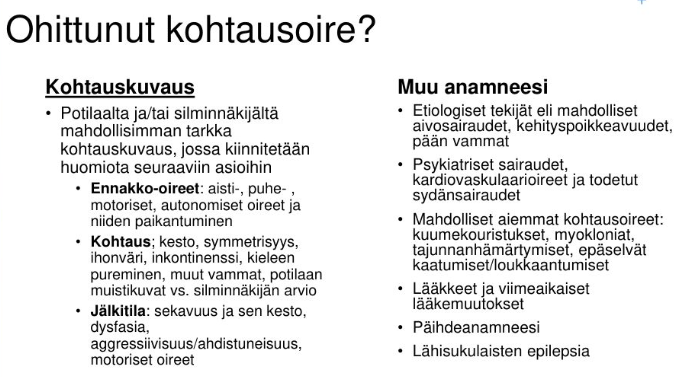
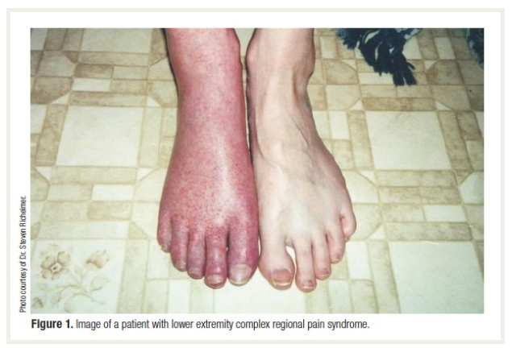
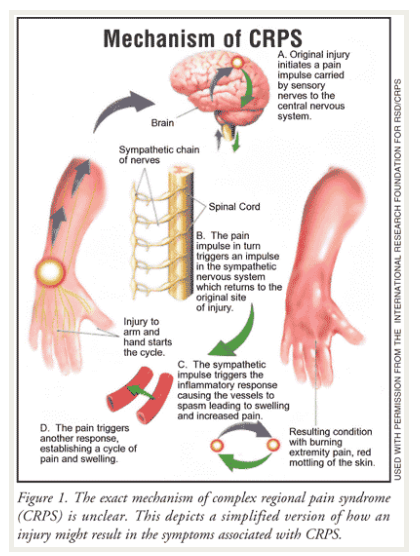

# 2022 

## Tentti 

Tästä taaksepäin wikissä vain yksi tentti per vuosi, ei blokeittain jaottelua

### Akuutin aivoinfarktin hoito 

Kysytty jo monesti eri tavoin myöhempien vuosien tenteissä, mutta kooste periaatteista alla:

  <button class="solution-button"
          data-label="Vastaus"
          data-hide-label="Piilota vastaus">
    Vastaus
  </button>
  

Potilaasta tulee usein ensihoidon kautta AVH-ennakkoilmoitus, jotta osataan valmistautua päivystyksessä. Ennen saapumista nopeasti arvioidaan teksteistä millainen potilas on kyseessä ja voisiko rekanalisaatiohoidoille olla vasta-aiheita. Esimerkiksi tarkistetaan, onko AK-lääkitystä käytössä, onko ollut viime aikoina aivoinfarkteja, neurokirurgisia toimenpiteitä tai GI-kanavan vuotoa tai onko koskaan ollut spontaania aivoverenvuotoa (ICH). Myös tulisi yrittää selvittää potilaan aikaisempi toimintakyky (matala aikaisempi toimintakyky on usein vasta-aihe trombektomialle) ja muut sairaudet (esim. jos elinajanodote on todella lyhyt muutenkin, niin ei usein rekanalisoida aktiivisesti AVH-kohtauksia).

Potilaan tullessa päivystykseen tehdään nopea tilannearvio: ensihoidon raportti (varsinkin kohtauksen alkuaika -> hoitoikkunat määrittyvät sen mukaan), nopea status (NIHSS-pisteytys) ja mennään sitten nopeasti kuville.

<li>Ensihoidon toimesta on myös usein otettu pika-Gluk, joka on usein käytännössä ainoa labra, joka tarvitaan ennen liuotushoitoa. Gluk <2.8 tulee korjata ennen muuta hoitoa >4:ään. Pika-INR (liuotuksen vasta-aihe >1.7) otetaan, jos potilaalla on käytössä varfariini tai on muutoin syytä epäillä hyytymisjärjestelmän häiriötä. </li>
  <ul>
    <li>Muita labroja kuin glukoosi kyllä otetaan, mutta niillä ei ole niin kiire ja ne voidaan ottaa kuvantamisen jälkeen. Tyks AVH-paketissa päivystyksessä PVK, CRP, Na, K, krea, gluk, CK, TnI. Joissain muissa lähteissä mainitaan, että kaikilta myös mm. INR, APTT, Trombai.</li>
  </ul>
<li>NIHSS-pisteytyksessä arvioidaan tajunta, katse, näkökenttä, facialistoiminta, yläraajan motoriikka, alaraajan motoriikka, raaja-ataksia, sensoriikka, kielen afaattisuus, artikulaatio ja neglect-oireisto. Jos pisteet ovat <5p ja oireet lievät (ei-invalidisoivat), niin kyseessä on lievä AVH ja "liuotuksena" käytetään usein DAPT-loudausta. Jos taas pisteet ovat vähintään 5p tai oireet invalidisoivat, niin kyseessä on vähintään kohtalainen AVH ja liuotuksena perinteinen tPA-liuotus (nykyään ensisijaisesti tenekteplaasi).</li>
  <ul>
    <li>Tenekteplaasi (Metalyse) on nykyään yleensä ensisijainen, koska nopeampi valmistella ja annetaan boluksena (0,25 mg/kg) eikä vaadi infuusiota. Aikaisemmin enemmän käytetty alteplaasi annostellaan 0,9 mg/kg (kokonaisannos enintään 90 mg) perifeeriseen laskimoon 10 %:n boluksena ja loput yhden tunnin infuusiona (infuusion valmisteluun menee jonkin verran aikaa ja siksi alteplaasin lyhytkestoisen injektion ja infuusion aloittamisen väliin tulee yleensä viivettä -> tenekteplaasi mahdollistaa nopeammat siirrot yliopistosairaalaan, jos potilas on trombektomiakandidaatti).</li>
    <li>Lievissä strokeissa voidaan nykyään käyttää DAPT-loudausta. Aluksi ASA 250mg ja klopidogreeli 300mg, jonka jälkeen jatkohoitona ASA 100mg 1x1 ja klopidogreeli 75mg 1x1 3 vko ajan, jonka jälkeen jatko ensisijaisesti klopidogreeli 75mg 1x1 pysyvästi.</li>
  </ul>
<li>Natiivi-pään TT poissulkee verenvuodon, samalla kuvausreissulla usein angio-TT, joka voi näyttää pään ja kaulan alueella suuren suonen tukoksen. Usein tehdään siis niin, että jos natii-TT on puhdas (ei vuotoa tai isoa iskeemistä aluetta), niin voidaan heti annostella liuotus ja sen perään sitten varjoaine ja kuvata angiografia. Toimintatavat riippuvat paikasta, joissakin potilas otetaan kuvaushuoneesta pois ja liuotetaan ja siirretään takaisin kuvannettavaksi, Tyksissä ainakin hiottu nopeammaksi ja tehdään kuvantamispömpelin äärellä temppuja ripeästi.</li>

---

Tarvittavat kuvantamiset ja hoitojen mahdollisuudet riippuvat eniten siitä, kuinka kauan oireiden alusta on. 

<li>Alle 4,5 tuntia on vakiintunut AVH:n liuotushoidon aikaikkuna, jonka sisällä pelkkä pään TT, anamneesi ja status riittää päätöksentekoon liuotushoidosta </li>
<li>Jos oireen alusta on 4,5-9 tuntia, niin on arvioitava, onko pysyvästi tuhoutunut infarktiydin vielä rajallinen (tyypillisesti alle 70 ml) ja onko kriittisesti iskeeminen alue (penumbra) edelleen merkittävästi tätä volyymia laajempi (1:2) ja osoittaa puolivarjon. TT-perfuusiokuvaus auttaa tässä arvioinnissa; osoittaa infarktiytimen ja sitä ympäröivän penumbran (pelastettavissa olevan kudosalueen) ja näiden suhteen perusteella voidaan mahdollisesti liuottaa potilas vielä 4,5-9 tunnin alueellakin.</li>
  <ul>
    <li>Infarktialue on hyvin altis verenvuodolle liuotuksessa ja halutaan, että liuotusriskiä otettaessa pelastettavan kudoksen määrä on vähintään järkevä</li>
  </ul>
<li>Jos AVH:n oireista on yli 9h, on liuotushoito vasta-aiheista.</li>
  <ul>
    <li>Poikkeuksena kallonpohjavaltimon tukos (basilaaritromboosi), jossa annetaan liuotushoito, jos oireiden alusta on kulunut alle 12 tuntia (massiivinen oireisto) tai vaikeaksi etenevässä oireistossa alle 48 tuntia. Pidemmät rajat siksi, että basilaaritromboosin ennuste ilman rekanalisaatiota on todella huono (yli 90% kuolee)</li>
  </ul>
<li>Aivoinfarktissa voidaan vielä miettiä liuotuksen lisäksi trombektomiaa eli tukoksen mekaanista poistoa. Trombektomian aikaikkuna aivoinfarktin hoidossa on 0-24 tuntia. Trombektomiakandidaatit tunnistetaan TT-angiografialla. >6h tai WUS (wake up stroke) vaatii perfuusiokuvantamisen. Trombektomiakandidaatit lähetetään ripeästi yliopistosairaalaan (keskussairaalatasollakaan ei yleensä trombektomioita tehdä); yleensä siis keskussairaalassa nopeasti liuotushoito ja sitten yliopistosairaalaan ambulanssilla. Kriteerit trombektomialle ovat:</li>
  <ul>
    <li>Aikaikkuna 0-24h</li>
    <li>Akuutit suurten suonten oireiset tukokset TT- tai magneettiangiografiassa</li>
    <li>NIHSS >6 tai tapauskohtaisesti lievemmissäkin</li>
    <li>mRS (modifioitu Rankin asteikko) 0-2 eli aiempi toimintakyky korkeintaan lievästi rajoittunut</li>
    <li>Ei vasta-aiheita (esim. liian laaja infarkti, jodiallergia, hoitoon soveltumaton anatomia) </li>
  </ul>

---

Hoito jatkuu AVH-valvonnassa omatoimisilla potilailla ja AVH-osastolla (tai TK-vuodeosastolla) ei-omatoimisilla potilailla. Tärkeää on mm. peruselintoimintojen varmistaminen, komplikaatioiden esto (esim. infektio-, immobilisaatio- ja sydänkomplikaatiot, delirium, korkean kallonsisäisen paineen lasku tarvittaessa esim. hemikraniektomialla laajoissa MCA-infarkteissa), etiologian selvitys, riskiarvio ja varhaiskuntoutus. 

<li>Infektioiden ehkäisyssä tärkeää mm. nielemistestaus ja asento -> aspiraation ehkäisy. Virtsatieinfektioiden ehkäisyssä katetrihygienia</li>
<li>Immobilisaatio altistaa laskimotukoksille -> tarvittaessa trombiprofylaksia ja pumppusukat. Makuuhaavojen ehkäisyssä asentohoito ja sopivat patjat</li>
<li>Sydänkomplikaatioiden ehkäisyssä rytmihäiriöiden hoito ja sydäninfarktien tyypillinen hoito</li>
<li>Deliriumin ehkäisyssä mm. orientaatio, lääkelistan tarkistaminen, hyvä kivun hoito, nesteytyksestä huolehtiminen yms yms.</li>
<li>Mahdollisten traumojen hoito tarvittaessa</li>

---

AVH-potilailta tulee myös arvioida kohtauksen etiologiaa. Tämän takia päivystyksessä otetaan aina EKG ja pidetään potilas telemetriaseurannassa. Tämän tarkoituksena on pääasiassa eteisvärinän (tärkein sydänperäisen embolian syy) etsiminen. Sydämen kaikututkimus tehdään embolialähteen selvittämiseksi, kun epäillään sydänperäistä emboliaa, erityisesti silloin kun potilaalla ei esiinny eteisvärinää. UKG:ssa (sydänultrassa; tarvittaessa tehdään TTE:n lisäksi vielä TEE (transesofageaalinen echo)) etsitään esim. infektoituneita läppiä tai trombeja sydämessä; myös aorttaperäinen embolisaatio (nousevan aortan tai aortan kaaren ateroskleroottisen plakin vuoksi) on suht. yleistä, mutta alidiagnosoitua (diagnostiikka vaatii ruokatorven kautta tehtävän sydämen kaikututkimuksen tai aorttaan ulottuvan TT- tai MK-angiografiatutkimuksen). Jos syytä ei löydy, voidaan harkita Holter-rekisteröintiä kotona tai osastolla; rutiininomaisella 24 tai 48 tunnin Holter-rekisteröinnillä löydetään kohtauksittainen eteisvärinä noin 5 %:lla. 

Otetaan usein myös thx-rtg. Pään ja kaulan valtimoiden TT-angiografialla on jo yleensä ensimmäisillä kuvantamiskerroilla selvitelty suurten suonten ateroskleroosin mahdollisuutta, joka on myös yksi yleisimmistä aivoinfarktin etiologioista. Pienten suonten tautia voidaan joskus selvitellä myöhemmin MRI-kuvantamisen avulla. Jos syy jää epäselväksi (eikä sovi pienten suonten tautiinkaan), niin AVH jää "kryptogeeniseksi" eli salasyntyiseksi. 

---

Potilaalle kuuluu etiologiansa mukainen sekundaaripreventiivinen hoito. Eteisvärinässä se on yleensä NOAC, suuren suonen ateroskleroosissa DAPT 3vk ja myöhemmin klopidogreeli-monoterapia (endartektomia soveltuville). Pienten suonten taudissa useimmiten sama kuin suuren suonen ateroskleroosissa, mutta isossa vuotoriskissä pelkkään ASAan pitää usein tyytyä akuuttivaiheessa. 

Riskitekijöiden hoidossa on tärkeää saada verenpaine aisoihin (tavoite alle 130/80), LDL alas (tavoite on yleensä LDL <1.4, mutta voi olla <1.8, jos kyseessä ei ole erittäin suuren riskin potilas (FINRISKI <15%, ei ole diabetesta, ei munuaisten vajaatoimintaa ja etiologiana on jokin muu kuin ateroskleroosi tai pienten suonten tauti)) ja muutenkin elintavat kuntoon (tupakoimattomuus, alkoholin käyttö suositusmääriin, liikapainon vähentäminen, liikuntaa väh. 30 min päivässä, ruokavalio terveellisemmäksi yms.)

---

Ajokieltoa AVH:sta tulee aina. Aivoinfarktissa ja ICH:ssa R1 väh. 3kk ajokielto ja R2 väh 6kk. TIA-kohtauksessa R1 yleensä 1kk ja R2 väh 6kk ajokielto. Ennen ajamiseen paluuta ajoterveysvaatimusten täyttymisen arviointi yleisimmin omassa terveyskeskuksessa yleisten ajoterveysvaatimusten mukaisesti. 6kk ajokielloista ilmoitus poliisille ja palautus vaatii myös lausunnon poliisille. 

  

### Migreenin diagnostiikka ja estohoito

  <button class="solution-button"
          data-label="Vastaus"
          data-hide-label="Piilota vastaus">
    Vastaus
  </button>
  

Migreenidiagnoosi perustuu pääasiassa kohtauskuvaukseen. Migreeni jaetaan migreeniin ilman auraa (n. 75%) ja auralliseen migreeniin (n. 25%), joiden diagnostiset kriteerit hieman eroavat. Kriteerit on alla olevissa kuvissa (tentissä tietysti tekstinä). 

Migreenin hoidossa yleensä pidetään päänsärkypäiväkirjaa, joka auttaa tilanteen kartoituksessa ja hoitovasteen seurannassa sekä altistavien tekijöiden tunnistamisessa. Estohoidon aloittamiselle ei ole ehdotonta kohtausmäärärajaa.  Kun potilas kokee migreenikohtauksista sen verran haittaa, että hän on itse halukas käyttämään säännöllistä lääkitystä niiden vähentämiseksi, niin voi kokeilla. Aloitetaan lähtökohtaisesti pth:ssa, jossa tarvittaessa kokeillaan ainakin 2-3 eri estolääkettä ennen lähettämistä neurologin arvioon. Ensisijaisia ovat beetasalpaajat (esim. propranololi,ATR-salpaajat (esim. kandesartaani) tai trisyklinen masennyslääke (esim. Amitriptyliini.) Myös joitakin epilepsialääkkeitä kuten topiramaattia tai valproaattia voidaan käyttää migreeniprofylaksiassa. Raskauden aikana vaihtoehtoina lähinnä metoprololi ja propranololi. Hoidon tavoitteena on migreenipäivien puolittuminen tai huomattava väheneminen. Vastetta voidaan arvioida 3 kk:n kuluttua, kun tavoiteannos on saavutettu. Jos ensimmäinen migreeniä ehkäisevä lääke on tehoton tai huonosti siedetty, suositellaan lääkevaihtoa. Neurologialla voidaan miettiä tarvittaessa vaikeahoitoiseen migreeniin CGRP-vasta-aineita tai gepantteja. Joskus harvoin myös onabotuliinitoksiinia mietitään. 

Lääkkeetön hoito on myös tärkeää:

<li>Säännöllinen liikunta! (vähintään 3 x/vk; ei toki kohtauksen aikana)</li>
<li>Ravinto- ja nautintoaineet (alkoholi, tupakka, säännöllinen ruokavalio)</li>
<li>Ympäristö (ärsyttävien tekijöiden välttäminen)</li>
<li>Unihäiriöiden rotiin saaminen</li>

  

### Ensikouristaja taas

46-vuotias mies, jolla ei ole todettuja sairauksia eikä säännöllistä lääkitystä. Työskentelee rakennusvalvojana. R1 ja R2 ajokortit. Kouristanut työpaikalla palaverin aikana, työkaverit silminnäkijöinä. Silminnäkijöiden mukaan yhtäkkiä pudonnut tuolilta ja kouristanut kaikilla raajoilla, virtsannut alle ja purrut kieleensä. Kouristus kestänyt n. 2 minuuttia. Ambulanssin saapuessa paikalle 10 minuuttia myöhemmin potilas maannut maassa, ollut väsähtänyt, mutta noudatti kehotuksia. Tapaat potilaan Tyksin ensiavussa päivystysaikana 45 min kouristuksen jälkeen. Potilas on edelleen hieman väsähtänyt ja kertoo, ettei aiemmin ole kouristanut.

- a. Mitä anamnestisia lisätietoja kaipaat? 
- b. Miten tutkit?
- c. Potilas kotiutuu hyväkuntoisena 6 h seurannan jälkeen. Epäilet neurologista syytä kouristukseen. Miten ohjeistat potilasta ja sovitko jatkoja?

  <button class="solution-button"
          data-label="a"
          data-hide-label="a - Piilota vastaus">
    a
  </button>
  

Kiinnostaa varsinkin kohtauksille altistavien tekijöiden kartoittaminen: 

<li>Päihteet (esim. alkoholi), onko korkeakuumeista infektiota, keskushermostoinfektioon viittaavaa, diabetesta (hypoglykemiamahdollisuus), elektrolyyttihäiriöille altistavaa (ripulointi, oksentelu yms), äärimmäistä rasitustilaa (valvominen, maratoonin juokseminen, voimamieskisat...) ja lääkitys (kouristuskynnystä alentaa mm. trisykliset masennuslääkkeet, bupropioni, useat psykoosilääkkeet, tramadoli)</li>
<li>Myös rakenteelliset syyt ovat tärkeitä: esim. aivovammat, aivokasvaimet, aivoverenkiertohäiriöt, hippokampusskleroosi (taustalla esim. pitkittyneet kuumekouristukset, lapsuudessa, aivoinfektiot tai aikaisempi status epilepticus)</li>
<li>Sukuhistoria voi myös olla altistava tekijä</li>
<li>Psykiatriset sairaudet; psykogeeninen kohtaus on myös mahdollinen (kohtauskuvaus tärkeä)</li>

---

Potilaalta tulee siis kysyä erityisesti alkoholin ja muiden päihteiden käytöstä, infektio-oireista, viimeaikaisesta rasituksesta, lääkityksestä, aikaisemmista aivovammoista ja sukuhistoriasta. Anamneesissa on myös äärimmäisen tärkeää saada tapahtumakuvaus, erityisesti silminnäkijöitä haastatellen. Potilaalta kannattaa kysyä esioireista, mitä muistaa kohtauksesta ja millainen vointi sen jälkeen oli. Ilmenikö vammoja? 

Synkopee voi ilmentyä hyvin kouristusmaisesti, mutta se on usein anamnestisesti ja kohtauskuvauksen perusteella erotettavissa. 

  

  <button class="solution-button"
          data-label="b"
          data-hide-label="b - Piilota vastaus">
    b
  </button>
  

EKG, telemetriaseuranta päivystyksessä olon ajaksi. 

Pään natiivi-TT poissulkututkimukseksi. 

A-astrup, verilabrat (PVKT, Na, K, Krea, Ca-ion, CK, ALAT, CRP, TSH, glukoosi!), päihdekäyttöä epäiltäessä GT, B-PEth, U-huumeet. 

Likvor jos epäily CNS-infektiosta/ pään TT ei näy SAV, mutta oireet täsmäisivät.

  

  <button class="solution-button"
          data-label="c"
          data-hide-label="c - Piilota vastaus">
    c
  </button>
  

Tehdään kiireellinen lähete neurologille, jos ei osoittaudu selkeää kiireellä hoidettavaa sekundaarista syytä kouristukselle (AVH, aivokasvain, infektio, aivovamma...). Seuranta 6h päivystyksessä, jonka jälkeen kotiutuminen jos kouristus ei  ole uusiutunut ja tajunnantila sekä muu status on normaali. Polikliinisesti sitten otetaan myöhemmin neurologin ohjelmoimana mm. pään MRI ja EEG-selvittelyitä.

Ensikouristajalle annetaan jo heti päivystyksessä ajokieltoa R1 3kk ja R2 5v. Työturvallisuus on myös huomioitava, rakennustyöntekijänä potilas ei saa nyt työskennellä
korkeissa paikoissa tai sellaisten koneiden parissa, joissa tajunnan menetys aiheuttaa hengenvaaran. 
  

### Vapina tulosyynä

Toimit Maskun terveyskeskuksen lääkärinä. Vastaanotollesi tulee 57-vuotias mies käsien vapinan vuoksi. Potilas ei oikein osaa sanoa kuinka pitkään kädet ovat vapisseet, ainakin vuosia, mutta viime aikoina ongelma on pahentunut. Kädet tuntuvat myös kömpelöiltä ja hitailta. Anamneesissa on lonkkanivelartroosi, kaksisuuntainen mielialahäiriö ja krooninen nuha. Potilaan pikkuserkulla oli Parkinsonin tauti ja isoisällä käsien vapinaa. Säännöllisenä lääkityksenä hän käyttää selekoksibia (Celebra) 100 mg x 2, olantsapiinia (Olanzapin) 10 mg x 1 ja ipratropiumbromidia (Rinivent) 21 ug/annos, 2 suihketta kumpaankin sieraimeen x 2. Statuksessa toteat sekä kannatus- että lepovapinaa yläraajoissa vasenpainotteisesti. Lihastonus on hivenen koholla vas. yläraajassa. Diadokkokineesissä on myös pieni puoliero (vasen aavistuksen oikeaa hitaampi). Potilas on oikeakätinen.

Luettele kolme keskeisintä erotusdiagnostista vaihtoehtoa; perustele

  <button class="solution-button"
          data-label="Vastaus"
          data-hide-label="Piilota vastaus">
    Vastaus
  </button>
  

Vapinan erottelussa yleisesti kaksi tärkeintä erotusdiagnostista vaihtoehtoa ovat yleisestikin essentiaalinen vapina (ET) ja Parkinsonin tauti (PD). Lisäksi potilaalla on käytössään dopamiiniantagonisti (olantsapiini), jonka yksi tunnetuista haittavaikutuksista on lääkeaineparkinsonismi, joka on yksi vapinan mahdollisuus tässä tapauksessa. Tietysti on mahdollista, että potilaalla on näiden yhdistelmää (essentiaalinen vapina ja Parkinsonin tauti voivat esiintyä yhdessä ja kun tähän vielä lisää antipsykootin, niin oirekuva pahenee entisestään).

---

Essentiaalinen vapina ilmenee yleensä kannatusvapinana, jota potilaalla todettiin. Se yleensä kuitenkin aiheuttaa sitä symmetrisesti ja se ei yleensä aiheuta lepovapinaa, mutta voi joskus ilmentyä hieman vahvempana toisella puolella sekä myös joskus lepovapinan kanssa (ns. ET-plus). Potilaan isoisällä on ollut käsien vapinaa ja ET on tunnetusti hyvin periytyvä sairaus. Oireet ovat myös kestäneet monia vuosia, ja virallinen ET-diagnoosi tyypillisesti tehdään 3 vuoden oireiden jälkeen (Jos vapina pysyy muuttumattomana (vain liikevapinana ilman muita oireita) kolmen vuoden ajan, on tilastollisesti erittäin epätodennäköistä, että kyseessä olisi Parkinson). 

---

Parkinsonin taudille on tyypillistä lepovapina, joka usein alkaa asymmetrisesti. Lisäksi on usein kohonnutta lihastonusta (rigiditeetti) ja hitausta (hypokinesia, joka näkyy potilaalla diadokokineesissä). Heikompi sukuyhteys kuin essentiaalisessa vapinassa (Valtaosa (85–90 %) tapauksista on niin sanotusti sporadisia eli satunnaisia. Jos tauti puhkeaa alle 40–50-vuotiaana, sen perinnöllinen tausta on todennäköisempi). 

---

Lääkeaineparkinsonismi tarkoittaa parkinsonismia, joka usein johtuu antipsykoottilääkityksestä tai muusta dopamiiniantagonistista. Voi aiheuttaa täysin Parkinsonin tautia muistuttavan oirekuvan (vapina, hitaus, kankeus). Lääkeaineparkinsonismi on usein symmetristä toisin kuin parkinsonin tauti, mutta se voi esiintyä myös joskus epäsymmetrisenä (varsinkin jos potilaalla on taustalla alkava, vielä oireeton Parkinsonin tauti, jonka lääkitys tuo esiin). 

  

### O/V

Vastaanotollesi tulee 24-vuotias nainen, jolla on kahden viikon ajan esiintynyt pistelyä vasemman käden sormissa ja vasemman jalan varpaissa. Ei lääkityksiä. Ei aiempaa neurologista. Statuksessa toteat vas. biceps-, triceps- ja brachioradialis-heijasteet oikeata vilkkaammiksi. Patella-heijasteet ovat bilateraalisesti vilkkaat, oik. akilles on vilkas, vas. akilles on klooninen. Babinski on oikealla indifferentti, vasemmalla lievä ekstensio. Lihastonus, kävely ja tasapaino ovat normaaleja.

- a. Tarvitaan ENMG-tutkimus
- b. Tarvitaan lähete neurologian poliklinikalle
- c. Tarvitaan aivojen ja kaularangan MRI-tutkimus gadolinium-tehosteisena
- d. Tarvitaan päivystyslähete neurologian ensiapupoliklinikalle
- e. Tarvitaan ohutsäieneuropatian tutkimukset (kylmä-lämpö)

  <button class="solution-button"
          data-label="a"
          data-hide-label="a - Piilota vastaus">
    a
  </button>
  

Väärin 

---

Nuorella naisella on ylämotoneuronin vaurion kuva vasemmassa raajaparissa, oikeassa alaraajassa myös heijastevilkkautta, ei kohonnutta lihastonusta tai tasapaino-ongelmaa, ei mainintaa motorisesta heikkoudesta. Sensorisia oireita myös ilmenee: pistelyä samoissa raajoissa. 

Tila ei sovi ALS:ään, joss aolisi ylä- ja alamotoneuronin vauriokuva. Ei polyradikuliittia (alamotoneuronin vauriokuva). Polyneuropatia ei selitä ylämotoneuronin vauriota. AVH:ssa olisi muitakin oireita ja tilanne olisi akuutimpi. CNS-infektiossa olisi enemmän infektiivinen yleiskuva ja esim. päänsärkyä, kuumetta, valoherkkyyttä yms. 

Potilaan ikä ja oirekuva huomioiden kyseessä on epäily MS-taudista. Myös selkäydinkompressio kaularangan alueella mahdollinen. Molempien tilojen tärkein tutkimus on kuitenkin sama: aivojen ja selkärangan MRI-kuvaus. ENMG tutkii ääreishermoja ja lihaksia. Se on normaali, kun vaurio on keskushermostossa (kuten Babinski ja vilkkaat heijasteet osoittavat; tietysti neula-EMG voi olla esim. etusarven alamotoneuronivaurioissa lopulta poikkeavakin).
  

  <button class="solution-button"
          data-label="b"
          data-hide-label="b - Piilota vastaus">
    b
  </button>
  

Oikein 

---

MS-diagnostiikka ja hoito kuuluu ESH:n piiriin. 
  

  <button class="solution-button"
          data-label="c"
          data-hide-label="c - Piilota vastaus">
    c
  </button>
  

Oikein 

---

Varjoainetehosteinen MRI on MS-taudin kuvantamisessa paras. 
  

  <button class="solution-button"
          data-label="d"
          data-hide-label="d - Piilota vastaus">
    d
  </button>
  

Väärin (varovaisesti; tentissä ei tullut miinusta päivystykseen lähettämisestä)  

---

Kyseessä on kyllä kiireinen asia, mutta päivystykselliselle hoidolle ei vaikuta olevan aihetta.

Potilaan oirekuva ei tehtävänannon perusteella vaikuta toimintakykyä heikentävältä. MS-taudin pahenemisvaiheessa hoitoa (ensisijaisesti kortisonipulssihoito) tarvitaan ensisijaisesti vain silloin, kun akuutit oireet heikentävät toimintakykyä (lievemmätkin oireet voidaan hoitaa, elleivät ne ala muutamassa viikossa korjautua itsestään). Diagnosoidunkin MS-taudin pahenemisvaiheessa ei aina siis tarvitse ihan päivystyksellistä hoitoa ja toimintakykyäkin lievemmin alentavassa pahenemisvaiheessa potilas voi odottaa seuraavaan arkiaamuun, jos selviytyy oireidensa kanssa kotona siihen asti. Vaikea pahenemisvaihe usein kuitenkin kyllä vaatii päivystyksellistä hoitoa, kun potilas ei pärjää kotona: nopea oireiston ilmaantuminen, vaikea näköhäiriö, liikkumisvaikeus, rakon toimimattomuus ja yleinen toimintakyvyn lasku. 

Kaularangan kompressioissa päivystykseen kyllä voitaisiin mennä, mutta tilanne ei sen suhteen vaikuta erityisen vaikealta. Jos ilmenisi lihasheikkoutta, kovaa kipua tai kyseessä olisi vamman myötä syntynyt oireisto, niin pääivystyshoitoa tarvittaisiin. 
  

  <button class="solution-button"
          data-label="e"
          data-hide-label="e - Piilota vastaus">
    e
  </button>
  

Väärin 

---

Hyödynnetään perifeeristen ohuiden säikeiden tutkimiseen, ei sovi nyt tähän oirekuvaan (vaikka onkin raajojen pistelyä), kun on selkeitä ylämotoneuronivaurion merkkejä. 
  

### KNF

Vastaanotollesi tulee keski-ikäinen nainen, joka valittaa konservatiivisesti kipsihoidetun nilkkamurtuman jälkeen ilmaantunutta puutumista/pistelyä, sähköttävää kipua ja lähes jatkuvaa polttavaa taustakipua oikean säären alaosassa lateraalisesti, nilkan edessä ja jalkapöydän iholla. Kävely on kankeaa, ja kipu valvottaa. Murtuma tapahtui laskettelurinteessä 4 kuukautta ennen vastaanotollesi tuloa. 

- a. Mistä voi olla kyse? Miten tutkit potilaan kliinisesti ja mitä voit löytää? Mihin tutkimuksiin lähetät hänet KNF:lle ja miksi? 
- b. Kirjoita lähete KNF:lle perustuen historiaan ja statuslöydöksiisi. Mitä odotat KNF-lääkärin sinulle vastaavan ja miten KNF-lausunto todennäköisesti vaikuttaa potilaasi jatkohoitoon?

  <button class="solution-button"
          data-label="a"
          data-hide-label="a - Piilota vastaus">
    a
  </button>
  

4kk sitten nilkkamurtuma ja sen hoidosta asti positiiviset sensoriset oireet (puutuminen, pistely, sähköttävä kipu, jatkuva polte alaraajassa distaalisesti). Kävely on kankeaa (liikerajoitus, motorinen toimintahäiriö?). Mitä todennäköisimmin potilaalla on kroonistunut neuropaattinen kiputila. Oireiden anatominen sijainti (säären alaosan lateraalipinta, nilkan etuosa ja jalkapöydän iho) viittaa vahvasti pohjehermon pinnallisen haaran (Nervus peroneus superficialis) vaurioon tai puristustilaan. Vaurio on voinut syntyä itse vammassa tai kipsihoidon aiheuttamassa puristuksessa. 

Mahdollisesti kyseessä voi olla ns. CRPS eli monimuotoinen paikallinen kipuoireyhtymä, mutta sen diagnosoiminen vaatii tarkemman statuksen ja anamneesin. 

CRPS:n voi laukaista lievä tai kohtalainen kudosvaurio, kuten tässä nilkkamurtuma. Se on siis raajan pitkäaikainen paikallinen kipuoireisto, jolle ovat ominaista tunnon ja motoriikan muutokset sekä autonomisen hermoston toiminnan poikkeavuus.

Tulee siis kysellä vasomotorisista oireista (ihonlämpötilan asymmetriaa, ihovärin vaihtelua/asymmetriaa), hienerityksen muutoksista ja turvotuksesta. Vaikeaan CRPS:ään liittyy myös troofisia muutoksia, kuten osteoporoosia, ihon, kynsien ja karvoituksen muutoksia ja nivelkapselien jäykistymistä. 

Statuksessa tehdään täysi neurologinen status sekä kiinnitetään erityistä huomiot jalkojen eroihin niin motoriikan, sensoriikan kuin ihon kunnon osalta. 

<li>Oikealta löytyy todennäköisesti hyperalgesiaa ja/tai allodyniaa. Tuntoaisti voi myös olla alentunutta (hypestesia). Testataan myös kliinisesti lämpötunto (todennäköisesti alentunut).</li>
<li>Kävely voi kivuista johtuen olla haastavaa, vaikka itse motoriset voimat saattavatkin olla normaalit. Voimat voivat kylläkin olla oikeastikin heikot käyttämättömyysatrofiasta johtuen tai jos vammassa meni motorisia hermoja pahemmin rikki (esim. n. peroneus superficialis-vammassa nilkan eversio heikkoa).</li>
<li>CRPS:ään viitaten voi mahdollisesti löyty verenkierron muutoksia (lämpö-/väriero), hikoilun asymmetriaa tai turvotuksia. Iho voi myös olla muuttunutta (ohutta/paksua/kiiltävää yms) ja karvoitus liiallista/liian vähäistä.</li>

---

KNF:n tutkimuksistä tärkein on ENMG, koska sillä voidaan objektiivisesti osoittaa hermovaurio, sen vaikeusaste (aksonaalinen vaurio vs. johtumiskatos) ja tarkka sijainti. Jos se on negatiivinen, niin voidaan miettiä lämpötuntokynnyksiä (QST) (ja tarvittaessa ihobiopsiaa).

  

  <button class="solution-button"
          data-label="b"
          data-hide-label="b - Piilota vastaus">
    b
  </button>
  

Lähete: 50-vuotias perusterve nainen, ei säännöllisiä lääkityksiä. Murtanut laskettelurinteessä oikean nilkkansa 4kk sitten. Päädytty konservatiiviseen kipsihoitoon, jonka jälkeen potilaalle ilmaantunut puutumista/pistelyä, sähköttävää kipua ja lähes jatkuvaa polttavaa taustakipua oikean säären alaosassa lateraalisesti, nilkan edessä ja jalkapöydän iholla. Kävely on kankeaa, ja kipu valvottaa. VAS 6 jatkuvasti.

Statuksessa allodyniaa ja hypoestesiaa jalkapöydän iholla. Jalkaterän eversio voima 4/5, dorsifleksio 5/5. Akillesrflx +/+, babinski neg. Ei selviä trofisia muutoksia. 

P.k. Oikean jalan ENMG. Hermovauriota? Vaurion vaikeusaste? 

---

Lausunnossa todetaan todennäköisesti oikean n. peroneus superficialiksen sensorisen vasteen puuttuminen tai merkittävä mataluus (amplitudin lasku) verrattuna terveeseen puoleen. 

ENMG:n osoittaessa hermovaurio saadaan vahvistus työdiagnoosille (neuropaattinen kipu). ENMG myös auttaa arvioimaan toipumismahdollisuuksia. Jos vaikuttaisi selvältä pinteeltä, niin operatiivista hoitoa voidaan miettiä. Jos ENMG viivästyisi, niin sen ei tosin tulisi hidastaa hoidon ja kuntoutuksen aloitusta. Voidaan siis aloittaa neuropaattisen kivun lääkitys (esim. gabapentiini) ja fysioterapia. 
  

