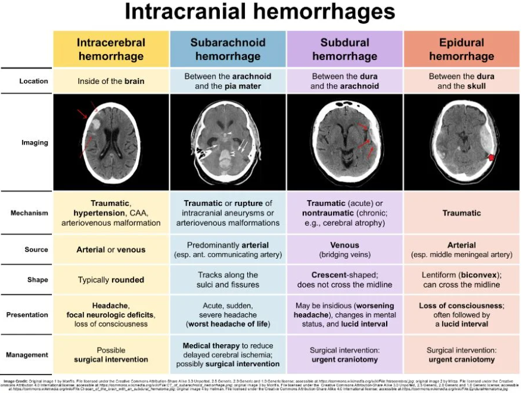
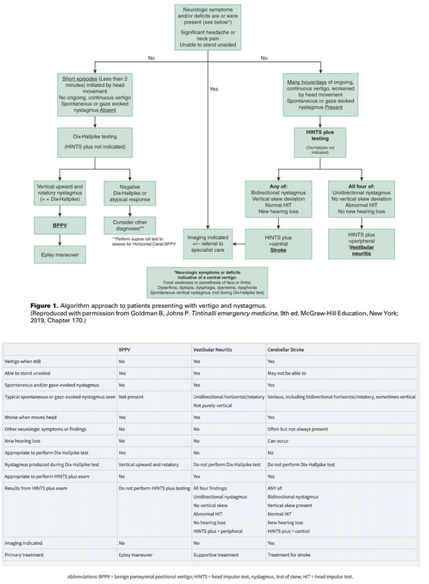
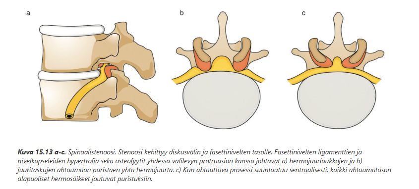
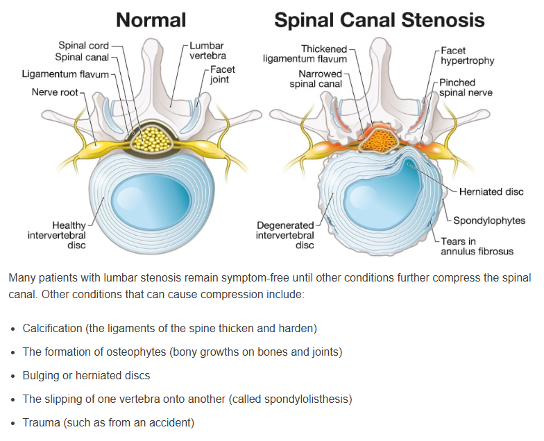

# 2019 

## Tentti

Vuotta 2020 ei ole wikissä, joten siirrytään vuoden 2019 tenttiin. Potilastapauksista annettu vain otsikot, joten niiden suhteen ei voida muodostaa järkeviä mallivastauksia. Yleisistä esseistä migreenin estohoidon indikaatiot ja lääkevaihtoehdot on jo käyty läpi, joten ei sitä uudestaan. Tässä alla uudet aiheet. 

### Kallonsisäiset verenvuodot: selitä etiologia, oireet, löydökset ja hoito

  <button class="solution-button"
          data-label="Vastaus"
          data-hide-label="Piilota vastaus">
    Vastaus
  </button>
  

Kallonsisäistä verenvuotoa on epäiltävä pään vamman saaneella potilaalla, jolla on vamman jälkeen lisääntyviä oireita (esim. päänsärky, oksentelu, sekavuus, levottomuus), neurologisia puolioireita (lähinnä pareesi), epileptisiä kohtauksia, tajunnantason laskua yms. Kallonsisäiset verenvuodot voidaan jakaa neljään päätyyppiin niiden anatomisen sijainnin mukaan. 

Epiduraalivuoto (EDH) = Veri kertyy kovakalvon (dura mater) ja kallon luun väliin

<li>Taustalla yleensä kalloon kohdistuva trauma. Tyypillinen nuorten ja lasten vamma. </li>
<li>Oireena voi olla nopea tajunnan menetys traumassa, jonka jälkeen virkoaminen hetkeksi (lucid interval) ja sitten tajunta laskee pian uudelleen verihyytymän painaessa aivoja. Mustuainen voi laajentua vuodon puolella (anisokoria).</li>
<li>Kyseessä on valtimovuoto ja voikin nopean etenemisen takia olla potentiaalisesti kuolemaan johtava ja vaatii ripeän diagnoosin</li>
  <ul>
    <li>Keskimmäisen aivokalvovaltimon (a. meningea media) repeämä on kovakalvon ulkopuolisen verenpurkauman eli epiduraalihematooman syynä valtaosalla (85–90 %:lla) tapauksista, ja sijainti on temporoparietaalinen.</li>
  </ul>
<li>Yleensä hoito operatiivinen (joskus lievissä voi olla konservatiivinen). Kookas vuoto (>10mm) tai jos puutosoireita tai tajunnan tason laskua -> kiireinen kallon avaus (kraniotomia; myös porattu reikä voi toimia toisen linjan vaihtoehtona) ja veri poistetaan. Veren poistamisella aivopaine laskee ja aivokudos pääsee laajenemaan takaisin normaaliin tilavuuteensa. Operatiivisella hoidolla on kiire koska epiduraalinen hematooma on valtimovuoto ja jatkuessaan vie potilaan nopeasti hautaan.</li>
<li>Toipuminen on nopea ja täydellinen, ellei ole lisäksi aivoruhjevammaa eikä hoito ole viivästynyt</li>

---

Subduraalivuoto (SHD) = Veri kertyy kovakalvon (dura mater) ja lukinkalvon (arachnoidea mater) väliin

<li>Taustalla usein trauma, joka voi varsinkin vahuksilla olla hyvinkin lievä. Yli 50-vuotiailla (ja varsinkin alkoholisteilla atrofian takia) vähäinenkin vamma voi aiheuttaa verenvuodon, sillä laskimoiden vapaana kulkeva matka pitenee.</li>
<li>Kyseessä on laskimovuoto (johtuu aivokuorelta durasinuksiin kulkevien siltaavien laskimoiden repeämisestä. Laajenee tämän takia hitaammin kuin epiduraalinen vuoto. Yleisimmin vanhusten vamma.</li>
<li>Oireena voi akuutissa vuodossa olla nopeakin tajunnan heikkeneminen/muut neurologiset oireet, mutta krooninen vuoto voi olla hyvinkin hitaasti kehittyvä (viikkojen aikana kehittyvä sekavuus, muistihäiriöt, päänsärky yms.)</li>
<li>Oireisen akuutin subduraalihematooman ensisijainen hoito on yleensä kraniotomia ja kroonisen vuodon hoito taas trepanaatio (Burr hole). Leikkauskriteerinä paksuus yli 10 mm tai puutosoireita tai tajunnan tason lasku. Veri poistetaan -> helpottaa oireita (käytännössä siis sama hoito kuin epiduraalihematoomassa, mutta kiirellisyys on vähäisempi, koska ei ole valtimovuoto kyseessä)</li>
<li>Suuri osa akuuteista vuodoista paranee konservatiivisella hoidolla, kuolleisuus on kymmeniä prosentteja (kroonisessa parempi)</li>

---

Lukinkalvonalainen (subaraknoidaalinen, SAV) vuoto = Verta aivokalvojen väliseen tilaan (lukinkalvon ja pehmeäkalvon väliin), jossa aivo-selkäydinneste kiertää

<li>Vuoto voi olla traumaattinen tai atraumaattinen (primaarisen vuodon yleisin syy on valtimoaneurysman puhkeaminen; muita ovat AV-malformaatiot ja muut verisuoniepämuodostumat.</li>
<li>Oireena on klassinen räjähtävä päänsärky (elämän kovin), joka saavuttaa huippunsa välittömästi. Siihen liittyy usein oksentelu ja pahoinvointi, niskajäykkyys ja valonarkuus (veri ärsyttää aivokalvoja). Mahdollisesti paikantavia oireita (raajahalvaus, puhevaikeus, kaksoiskuvat), kouristelua tai tajunnanmenetys. Oireiden voimakkuus vaihtelee paljon. Potilaalle voi syntyä nopeasti syvä tajuttomuus, ja toisessa ääripäässä on taksilla lääkäriin saapuva hyväkuntoinen potilas.</li>
<li>Ilmenee traumassa usein epiduraali- tai subduraalihematooman kanssa; aivovammapotilaista n. 10–15 %:lla on TT:ssä löydöksenä subraknoidaalivuoto. Jos kuitenkin traumaattinen SAV on ainoa aivovammapotilaalla todettu vamma, toipuminen on yleensä melko nopeaa – veri häviää muutaman viikon kuluessa aivo-selkäydinnesteen joukosta.</li>
<li>Hoito traumaattisessa vuodossa yleensä konservastiivinen ja keskittyen vitaalien ja oireiden hoitoon. Leikkaushoito (kraniotomia) tulee kyseeseen vain, jos potilaalla on tSAH:n lisäksi muita leikkaushoitoa vaativia muutoksia, kuten suuri epiduraali- tai subduraalivuoto tai aivoja painava ruhje.</li>
<li>Aneurysmaattisessa vuodossa angiografian perusteella voidaan hoitaa aneurysma ja estää uusintavuoto (endovaskulaarinen tai kirurginen hoito tilanteesta riippuen).</li>
<li>Vasospasmia estämään nimodipiinia (ei käytetä ehkä rutiininomaisesti traumaattisessa SAV:ssa)</li>

---

Intraparenkymaalinen eli intrakerebraalinen vuoto (ICH) = verenvuoto itse aivoparenkyymiin (ns. aivoverenvuoto)

<li>Primaarisen vuodon etiologia on yleensä hypertensiivinen tai diabeettinen mikroangiopatia tai aivojen amyloidisuonisairaus. Aivovaltimoaneurysmat voivat aiheuttaa SA-vuodon lisäksi myös ICH:n (tarvittaessa siis aivovaltimoiden TT-angiografia, jos epäily herää). Voi myös johtua traumasta ja silloin liitty usein diffuusiin aivoruhjevammaan. Antikoagulaatiohoito suurentaa aivoverenvuodon riskin 8–10-kertaiseksi. Antikoagulaatiohoidon aikana saatu aivoverenvuoto on myös ennusteeltaan kaikkein synkin: akuutissa vaiheessa yli puolet potilaista menehtyy. </li>
<li>Oireet ja löydökset usein kuin aivoinfarktissa (löydökset riippuvat myös vamman mekanismista; esim. kaatuminen aiheuttaa erityisesti otsalohkon alaosan ja ohimolohkon vuotoja) -> hemorraginen infarkti. Tajunnantaso voi laskea nopeasti aivopaineen noustessa.</li>
<li>Kaikki ennestään omatoimiset potilaat tulisi hoitaa AVH-yksikössä tai neurokirurgisessa yksikössä. Hoito edellyttää usein toistuvia TT-tutkimuksia ja kallonsisäisen paineen seurantaa teho-osastolla.</li>
<li>Aivoverenvuodon hoito on melkein aina konservatiivinen. Neurokirurgista hoitoa tulee harkita mm., jos vuoto on kortikaalinen ja sillä on henkeä uhkaava massavaikutus. Aivokammioihin purkautunut vuoto on vakava ja johtaa yleensä likvorikierron häiriöön, jota joudutaan hoitamaan aivokammioon asetetun katetrin kautta likvoria dreneeraamalla. Hoito on usein pitkäkestoinen.</li>
<li>Vuodon suureneminen on tavallista 1. vuorokauden aikana, ja näin tapahtuu yhteensä noin 38 %:lle potilaista. Vuodon jatkumiseen vaikuttavat käytössä ollut antikoagulaatiohoito, verenpaine, hyytymishäiriöt, vuotokohta ja ympäröivien verisuonien repeäminen. Verenpaineen alentaminen on tärkeää, jos se on koholla. Systolisena verenpainerajana voidaan pitää < 140 mmHg tai keskipaineen rajana < 110 mmHg. Käytetään lyhytvaikutteisia suonensisäisiä lääkkeitä (esim. labetaloli).</li>
<li>Antikoagulaatio ja muu vuototaipumus on kumottava, jos toipumisen edellytykset ovat olemassa. Varfariinihoitoa saavien potilaiden hyytymistekijävajeen kumoamiseen käytetään protrombiinikompleksitiivistettä, mikäli potilas on vuodon saatuaan päässyt nopeasti sairaalahoitoon ja on tajuissaan. Tavallisesti hoitoon liitetään myös K-vitamiinihoito. Mikäli aivoverenvuoto on ilmaantunut fraktioimattoman tai pienimolekyylisen hepariinin (LMWH) käytön aikana, kumotaan hepariinin vaikutus protamiinisulfaatilla. Joskus voidaan myös NOAC:ien kumoamista miettiä, mutta annokset ovat todella kalliita.</li>
<li>Hoito ei tapahdu makuuasennossa paitsi tajuttomilla ja silloinkin pääpuoli noin 30 astetta kohotettuna. Asento- ja liikehoito aloitetaan jo tajuttomuuden aikana ja liikunnallinen kuntoutus alkaa heti potilaan tultua tajuihinsa. Se onnistuu yleensä hitaammin kuin aivoinfarktin yhteydessä, koska potilas on vakavammin sairas. Toisaalta hematooman resorboiduttua oireet voivat korjautua nopeasti, jos vuoto ei ole katkaissut pyramidirataa tai muita tärkeitä ratayhteyksiä.</li>

---

Erot kuvantamisessa näiden kaikkien välillä: 

<li>Akuutille epiduraaliselle hematoomalle on tyypillistä linssimäisen (bikonveksi, kaksoiskupera) muotoinen hyperdensinen veren kertymä TT-kuvassa. Ei ylitä kallon saumoja, mutta voi ylittää keskilinjan.</li>
<li>Subduraalisessa hematoomassa havaitaan sirpin (puolikuu) muotoinen vuoto kallon TT-kuvassa (akuutissa hyperdensinen, kroonisessa hypodensinen; uusi veri siis on kirkasta natiivi-TT:ssä ja vanha on tummaa). Voi ylittää saumalinjoja, mutta ei ylitä keskilinjaa.</li>
<li>Lukinkalvonalainen veri näkyy TT-kuvissa aivouurteiden ja basaalisisternojen (interpedunkulaarinen sisterna) hyperdensisenä muutoksena. Aivo-selkäydinnesteen virtauksen takia verta kulkeutuu muualle, ja sitä keräytyy painovoiman vaikutuksesta esimerkiksi sulcus Sylviin pohjalle. Jos verta vuotaa aivokammioon, voidaan nähdä aivo-selkäydinnesteen ja veren välistä kerrostumista.</li>
<li>Lukinkalvonalainen veri näkyy TT-kuvissa aivouurteiden ja basaalisisternojen (interpedunkulaarinen sisterna) hyperdensisenä muutoksena. Aivo-selkäydinnesteen virtauksen takia verta kulkeutuu muualle, ja sitä keräytyy painovoiman vaikutuksesta esimerkiksi sulcus Sylviin pohjalle. Jos verta vuotaa aivokammioon, voidaan nähdä aivo-selkäydinnesteen ja veren välistä kerrostumista.</li>
<li>Aivoverenvuoto näkyy hyperdensinä pesäkemäisenä vuotona intraparenkymaalisesti. Vuodon ympärillä voi näkyä tummempaa aluetta, joka viittaa ödeemaan.</li>

  

### Vertigon eli kiertohuimauksen erotusdiagnostiikka

  <button class="solution-button"
          data-label="Vastaus"
          data-hide-label="Piilota vastaus">
    Vastaus
  </button>
  

Kiertohuimauksen (vertigon) erotusdiagnostiikassa on tärkeintä osata napata sentraaliset syyt ja erityisesti niistä aivoverenkiertohäiriöt (AVH), koska ne voivat aiheuttaa huimausta. Kolme yleisintä perifeeristä syytä vertigolle ovat yleisyysjärjestyksessä hyvänlaatuinen asentohuimaus (HAH, BPPV), vestibulaarineuroniitti (eli vestibulaarineuriitti) ja Menieren tauti (harvinainen ja kaksi ensimmäistä ovat tärkeimmät).

---

Erotusdiagnostiikka alkaa anamneesilla (kesto, muut oireet yms) ja oireen kuvauksella (kaikki eivät tarkoita huimauksella sinänsä kiertohuimausta, vaan voi olla paljon epämääräisempi). On heti tärkeää poissulkea selvimmät aivoverenkiertohäiriöön viittaavat oireet. Sentraalista vertigoa ja varsinkin aivorunko-/pikkuaivoinfarktia tulee epäillä, jos potilaalla on seuraavia liitännäisoireita:

<li>Merkittävä päänsärky (mahd. pikkuaivohemorragia) tai merkittävä niskakipu (mahd. kaulavaltimodissektio)</li>
<li>Ei pysty seisomaan/kävelemään ilman apua (muista aina kävelyttää potilas, jos se on mahdollista)</li>
<li>Fokaalinen heikkous tai parestesia kasvoissa tai raajoissa</li>
<li>Takaverenkierron häiriön Deadly D’s: dysartria, diplopia/dyskonjugaatio, dysfagia, dysmetria/dysdiadokokinesia, dysfonia</li>
<li>Spontaani vertikaalinen nystagmus</li>

---

Seuraavaksi jos näitä ei ole todettavissa, niin ei tarvitse välittömästi kuvantaa potilasta, vaan voidaan tutkia statusta tarkemmin. Yksi isoimmista erottelevista löydöksistä on nystagmus, joka voi olla joko jatkuvaa tai jaksoittaista. Nystagmuksesta huomioidaan myös sen suunta, joka määritetään silmävärveen nopeamman komponentin suuntana. Huomioidaan myös mahdollinen rotatorinen osuus. Jos nystagmus on vertikaalista, se viittaa sentraaliseen syyhyn (kts. yllä).

Jos nystagmus ja vertigo on jatkuvaa, niin tulee ensisijaisesti erottaa toisistaan sentraalinen syy ja vestibulaarineuriitti. Jos nystagmus tapahtuu vain jaksoittaisten ja lyhytkestoisten vertigokohtausten yhteydessä, on kyseessä todennäköisesti BPPV.

---

Vestibulaarineuriitti ja takaverenkierron häiriö usein ilmenevät samankaltaisesti, jonka takia tilaa voi usein kutsua yhteisnimellä akuutti vestibulaarioireyhtymä (AVS), jos todetaan pitkittynyttä jatkuvaa vertigoa ja spontaanista/katseen siirtämisen indusoimaa nystagmusta (pikkuaivoinfarktissa ei siis aina ole neurologisia puutosoireita, joiden perusteella siirryttäisiin suoraan kuvantamistutkimuksiin). Sentraalisen syyn ja vestibulaarineuriitin erotusdiagnostiikassa ensisijainen tutkimusprotokolla on HINTS plus-tutkimus.

Suurimmalla osalla AVS-potilaista on vestibulaarineuriitti. Pienemmällä osalla on selvä stroke, jota voi epäillä liitännäisoireiden perusteella (esim. diplopia, dysartria yms.). Vielä pienemmällä osalla on stroke, joka ei ilmene suoraan liitännäisoireista ja tällöin tarvitaan HINTS plus-tutkimusta erottamaan vestibulaarineuriitti ja stroke toisistaan. HINTS plus koostuu neljästä eri komponentista, joiden perusteella tutkimus on nimettykin: Head Impulse test (HIT, päännykäisytesti, impulssitesti), Nystagmus, Test of (vertical) Skew ja plus (kuulon arviointi bedside). HINTS plus tulisi tehdä vain, jos potilaalla on spontaani nystagmus ja jatkuva huimaus. Sitä EI tule tehdä kohtauksittaisesta huimauksesta kärsivälle, jolla ei ole spontaania nystagmusta (ei nystagmusta -> ei HINTSiä). Jos potilaalla on jaksoittaista lyhytkestoista huimausta ja vain niiden yhteydessä nystagmusta, diagnosoidaan tilanne ensisijaisesti Dix-Hallpiken testillä.

---

HIT:ssä potilaan katse kohdistetaan suoraan eteen tutkijan nenään ja pää nykäistään nopeasti sivulle (molempia puolia testataan epäsäännöllisessä rytmissä). Samalla arvioidaan tapahtuuko korjausliikettä (epänormaali) vai säilyykö katse fiksoituna. Arvioidaan siis, että toimiiko okulovestibulaarinen refleksi, joka mahdollistaa katseen pitämisen kohteessa, vaikka päätä käännetään siitä pois. HUOM! normaali HIT on huolestuttava löydös ja viittaa sentraaliseen syyhyn. Jos taas löydös on epänormaali, niin se viittaa taas enemmän vestibulaarineuriittiin, joka häiritsee okulovestibulaarista refleksiä (löydös on epänormaali affisioidulle puolelle käännettäessä).

Nystagmuksen arvioimisessa arvioidaan tietysti jo aikaisemmin tarkasteltua, eli onko kyseessä jatkuva tai jopa vertikaalinen nystagmus. Erityisesti nyt kuitenkin arvioidaan, että onko nystagmus bidirektionaalinen eli suuntaa vaihtava. Sentraalisessa syyssä nystagmus vaihtaa suntaa katsetta kohdistettaessa ensin toiselle sivulle ja sitten toiselle, kun taas vestibulaarineuriitissa on unilateraalinen nystagmus (nopea komponentti aina samaan suuntaan).

Skew:n testauksessa potilas kohdistaa katseen tutkijan nenään ja peitetään toinen potilaan silmistä, jota seuraten parin sekunnin välein vaihdetaan peitettävää silmää. Vaihtojen aikana arvioidaan juuri paljastettua silmää. Sentraaliseen vertigon syyhyn viittaa dyskonjugaatio eli voidaan havaita paljastetun silmän vertikaalista korjausliikettä (Kun silmä on peitettynä, se hakeutuu vertikaaliseen virheasentoon (usein alaspäin osoittavaan asentoon). Kun peitto poistetaan ja siirretään käsi toisen silmän päälle, niin paljastettu silmä lähtee korjaamaan virheasentoaan -> vertical skew. Pelkästään horisontaaliset korjaukset ovat benignejä).

“Plus”-osa HINTS plus -tutkimusta tarkoittaa kuulon tutkimista bedside (esim. kuuleeko potilas sormien hieromisen korvien lähellä symmetrisesti ja normaalisti). Jos potilaalla on uusi kuulovika vertigon yhteydessä, niin se herättää epäilyn sentraalisesta syystä. Kuulon tutkiminen on lisätty perinteiseen HINTS-tutkimukseen sen takia, että voitaisiin napata herkemmin kiinni AICA (Anterior Inferior Cerebellar Artery) stroket, sillä ne voivat aiheuttaa unilateraalista kuulonalenemaa. Myös perifeerinen syy, erityisesti labyrintiitti, voi aiheuttaa samanlaisen ilmenemisen, mutta se on hyvin harvinainen -> uusi kuulonalenema äkillisen jatkuvan vertigon yhteydessä tulisi primäärisesti herättää epäily AVH:sta.

  

### Spinaalistenoosin syyt ja oireet (ja ekstrana anamneesi/status, diagnostiikka ja hoito)

  <button class="solution-button"
          data-label="Vastaus"
          data-hide-label="Piilota vastaus">
    Vastaus
  </button>
  

Spinaalistenoosi tarkoittaa selkäydinkanavan ahtaumaa. Ahtauma voi olla sentraalista tai lateraalista. Sentraalinen stenoosi tarkoittaa koko ydinkanavan ahtautumista, kun taas lateraalinen stenoosi tarkoittaa juuritaskun (rekessin) ahtautumista. Lateraalinen stenoosi voi jatkua hermojuuriaukkoon (forameniin), joka voi myös yksinään olla ahtautunut. Jako sentraaliseen ja lateraaliseen stenoosiin on radiologinen; sekamuotoinen stenoosi on tavallisin.

Spinaalistenoosi voi tapahtua millä tahansa selkärangan tasolla, mutta yleisintä se on lannerangan alueella ja sen jälkeen kaularangan alueella. Rintarangan alue on stabiili kylkiluiden takia, jonka takia sen stenoosi on harvinaisempaa. Yleisimmät tasot ovat L4-L5 (yleisin), L5-S1 ja L3-L4. Kaularangansta yleisimmin C6-C7 (yleisin) tai C6-C6. Rintarangassa yleisimmät lokaatiot ovat Th11-Th12 ja Th12-L1 (transitio lannerankaan).

---

Degeneraatiomuutokset ovat yleisin ahtauman syy (osteofyytit, ligamenttien paksuuntuminen; myös välilevyprotruusio tai prolapsi voi olla mukana). 

<li>Fasettinivelien rappeutuminen aiheuttaa synoviaalireaktion tai synoviaalikystan ja rustopintojen ohenemisen (nivelen dysfunktio), mikä voi johtaa fasettinivelien subluksaatioon ja degeneratiiviseen spondylolisteesiin (instabiliteetti). Tämä puolestaan aiheuttaa ligamenttien ja fasettinivelien hypertrofian ja yleisen osteofyyttimuodostuksen (stabilisointi). Samanaikaisesti välilevyn rappeutumisen seurauksena välilevy madaltuu ja leviää (protruusio), mikä johtaa puolestaan nikamien päätelevyjen leviämiseen (spondyloosi). Nämä prosessit ahtauttavat sentraalista ja lateraalista selkäydinkanavaa sekä hermojuuriaukkoja.</li>
<li>Tietysti taustalla voi myös olla trauma (murtuman tai leikkauksen jälkitila) tai kasvaimen aiheuttama kompressio</li>
<li>Ongelma voi myös olla synnynnäinen (kongenitaalinen ahdas selkäydinkanava; esimerkiksi lyhyet pedikkelit)</li>

---

Lannerangan sentraaliselle spinaalistenoosille tyypillinen oire on spinaalinen katkokävely: kävellessä potilaan alaraajat kipeytyvät pakaroista alkaen, puutuvat ja saattavat tulla voimattomiksi. Nämä oireet tulevat usein myös pitkään seistessä. Alamäkeen kulkeminen saattaa olla erityisen hankalaa, koska tällöin selkää on yleensä pidettävä ekstensiossa. Oire provosoituu selän ojennuksen aiheuttamasta muutoksesta selkäydinkanavan läpimitassa. 

<li>Oireet lievittyvät istuessa tai eteen kumartuessa (esim. nojaa ostoskärryihin). Eteenpäin taivutus avaa selkäydinkanavaa ja antaa tilaa hermoille.</li>
<li>Katkokävelyoire voi vaihdella päivästä toiseen – ei ole epätavallista, että yhtenä päivänä potilaan kävely ei ole rajoittunut lainkaan ja toisena hän voi kävellä pysähtymättä vain 100 metriä.</li>
<li>Lateraalinen spinaalistenoosi ja hermojuuriaukkostenoosi aiheuttavat tyypillisiä, usein toispuoleisia säteilyoireita. Kyseessä on varsinaisesti hermojuuren pinneoire. Lateraalirekessipotilaalla voi olla hermojuuriklaudikaatio, joka vastaa edellä kuvailtuja katkokävelyoireita, mutta vain yhdessä dermatomissa.</li>
<li>Spinaalistenoosipotilailla voi olla myös alaselkäkipua, joka kertoo ennemminkin lannerangan degeneratiivisesta prosessista kuin spinaalistenoosista sinällään. Tosin moni potilas pitää risti- ja häntäluun sekä pakaroiden kipua selkäkipuna, vaikka kyseessä onkin stenoosin aiheuttama säteilykipu.</li>
<li>Virtsaamisvaikeudet tai ulosteen pidätyskyvyn häiriöt viittaavat cauda equina -oireyhtymään; vaatii päivystyshoitoa. Spinaalistenoosi tosin kuitenkin harvoin aiheuttaa cauda equinaa (yleensä sen taustalla on nikamavälilevytyrä)</li>

---

Lannerangan spinaalistenoosipotilaan (LSS) statuksessa yleisiä löydöksiä ovat: 

<li>Kyfosoitunut ryhti</li>
<li>Lannerangan eteen taivuttaminen onnistuu yleensä hyvin, mutta taaksetaivutus voi olla vaikeutunut. </li>
<li>Alaselkä voi olla palpoidessa arka tai jopa kivulias, mutta yhtä hyvin kivutonkin</li>
<li>Alaraajoissa voi olla lihasheikkouksia (jopa parapareesi), lihasatrofioita ja refleksipuutoksia (lannerangassa ei ole enää selkäydintä, vaan vain hermojuuria, joten vaurio on ääreishermostossa -> alamotoneuronilöydökset)</li>
<li>Seisominen voi provosoida oireita, istuminen ja etukumara asento helpottaa</li>
<li>Lasegue on yleensä negatiivinen; voi kyllä ollea positiivinenkin. Positiivinen hermovenytyskoe (Lasègue, femoralisvenytys) viittaa prolapsiin, muttei poissulje LSS:ää</li>
<li>Toisaalta varsin usein katkokävelypotilaan lepostatus on täysin normaali, ja niinpä silloin diagnoosi perustuu puhtaasti anamneesiin ja radiologisiin löydöksiin!</li>
<li>Aina tulisi arvioida virtsaretentio ja tuseerata potilas (arvioida sfinktertonus) sekä tutkia ratsupaikka-alueen tunto (cauda equina-oireiden selvittäminen).</li>
<li>Tärkeää on osata erottaa verisuoniklaudikaatio (useimmiten valtimoperäinen; ASO-tauti siis taustalla) neurogeenisestä klaudikaatiosta.  </li>
  <ul>
    <li>Palpoidaan alaraajapulssit (ATP ja ADP); normaali palpaatiolöydös poissulkee merkittävän verisuoniahtauman. Valtimoperäisessä katkokävelyssä oireet eivät yleensä lievity eteen kumartuessa. Ei myöskään yleensä pahene seisomisesta. Pyöräily pahentaa, toisin kuin spinaalistenoosissa. Kipu yleensä alkaa distaalisesti ja etenee proksimaalisesti (neurogeenisessä taas alkaa proksimaalisesti ja etenee distaalisesti). Vaskulaarisessa klaudikaatiossa myös usein iholöydöksiä iskemiasta johtuen.</li>
  </ul>
  
---

Selkärangan natiiviröntgentutkimus ei ole välttämätön ennen magneettikuvausta, eikä se anna riittävää informaatiota LSS:n diagnostiikkaa varten. Lähtökohtaisesti erikoislääkäri tekee MK-kuvantamispäätöksen (kuvauksen oikean kohdentamisen, lausunnon tulkinnan ja jatkohoidon optimoimiseksi), joten spinaalistenoositapauksessa konsultointi tärkeää. Usein myös TT tarkastelemaan luurakenteita paremmin. Voidaan myös ottaa natiivitaivutuskuvia ja seisontakuvia. MK-lähetteeseen kirjataan oireiden puolisuus sekä oletettu pinteen taso/tasot lannerangassa.  

---

Hoito voi tilanteesta riippuen olla konservatiivinen tai operatiivinen. Konservatiivisen hoidon aiheet: Potilas sietää oireet riittävän hyvin, ja päivittäinen toimintakyky on riittävä / Potilas ei halua leikkausta; leikkausriskien arviointi tapahtuu yleensä erikoissairaanhoidossa. Hoitona konservatiivisesti fysioterapia, lanneselän tukiliiki, kipulääkitys, ylipainon pudottaminen yms. 

Kirurginen hoito on aiheellista, jos on selvästi haittaava tai sietämätön kipu tai merkittävä toimintakyvyn haitta, jotka eivät helpotu konservatiivisella hoidolla. Lisääntyvät kävelyvaikeudet ovat tärkeä leikkausaihe (yleensä <200-300 metriä aihe; tosin kävelymatka on kuitenkin suhteutettava muihin oireisiin, sairauksiin ja potilaan ikään -> nuorilla lievempikin oire voi haitata paljon ja leikkaus voi olla aiheellinen, vaikka kävelymatka olisi yli kilometrinkin). 

<li>Leikkauksena dekompressio (laminektomia): Poistetaan nikaman takakaari ja paksuntuneet nivelsiteet, jotta hermoille saadaan lisää tilaa</li>
<li>Tarvittaessa luudutus dekompressionm yhteydessä, jos selkärangassa on merkittävää epävakautta (esim. nikamasiirtymä)</li>

---

Huom! Kaularangan alueella stenoosi voi aiheuttaa sekä hermojuuren pinteen (radikulopatia) että selkäytimen pinteen (myelopatia); lannerangan alueella ei ole selkäydintä (päättyy L1/L2), joten ei ole myelopatiakaan siellä. 

Tästä johtuen kaularangan ongelmat voivat aiheuttaa mm. radikulopatian kautta säteilykipua ja alamotoneuronioireita yläraajoihin ja myelopatian kautta ylämotoneuronioireita alaraajoihin -> kävelyvaikeudet, spastinen pareesi.

Ehdottomia leikkausaiheita ovat akuutti halvaus ja sietämätön kipu; suhteellisia ovat lievempi kipu, joka ei hellitä kons. hoidolla, lihasheikkoudet ja kookkaat prolapsit. Myelopatia yleensä vaatii leikkausta. 

  

### Dementian syyt ja erotusdiagnostiset tutkimukset

  <button class="solution-button"
          data-label="Vastaus"
          data-hide-label="Piilota vastaus">
    Vastaus
  </button>
  

Dementia tarkoittaa oireyhtymää, jossa muistin heikkeneminen ja muiden kognitiivisten kykyjen lasku alentavat potilaan kykyä selviytyä itsenäisesti normaaleista arjen toiminnoista. Dementia on oiretermi, ei erillinen sairaus. 

Dementian syy voi olla etenevä muistisairaus (esim. Alzheimerin tauti), pysyvä jälkitila (esim. aivovamma) tai hoidolla parannettava sairaus (esim. kilpirauhasen vajaatoiminta). Dementiaan johtavia muistisairauksia (esim. AT) kutsutaan nykyään eteneviksi muistisairauksiksi. Yleisesti koska eri muistisairaudet voidaan tunnistaa ja diagnosoida jo ennen kuin henkilöllä on dementian tasoista heikentymistä, on alettu puhua muistisairauksista ja dementia-termin käyttö on vähentynyt. 

Yleisimmät etenevät muistisairaudet ovat:

<li>Alzheimerin tauti (AT) n. 65–70 %</li>
<li>Vaskulaarinen kognitiivinen heikentymä (VCI) eli aivoverenkiertosairauden (AVH) muistisairaus n. 15 %</li>
<li>Lewyn kappale -patologiaan liittyvät sairaudet, kuten Lewyn kappale -tauti (LKT) ja Parkinsonin taudin muistisairaus (PT-muistisairaus) n. 15 %</li>
<li>Otsa-ohimolohkorappeumat (otsalohkodementia ja primaariset etenevät afasiat) n. 5–10 %</li>
<li>Muut, kuten prionitaudit (esim. CJD) </li>

---

Etenevien muistisairauksien ulkopuolella yleisimpiä muistivaikeuksien syitä ovat mm. 

<li>Pysyvät jälkitilat:</li>
  <ul>
    <li>aivovamma (usein ohimeneväkin, jos lievä vamma)</li>
    <li>aivoinfarkti</li>
    <li>enkefaliitti (mahdollisesti voi parantua kokonaan, mutta välillä pysyvä vaurio)</li>
    <li>alkoholidementia tai Wernicke-Korsakoff</li>
    <li>sädehoito</li>
  </ul>
<li>Hoidettavat ja ohimenevät syyt:</li>
  <ul>
    <li>Psyykkiset syyt (esim. masennus, uupumus, PTSD); masennus on tärkeää tunnistaa ja se on yleisin muistihäiriöitä aiheuttava psykiatrinen sairaus</li>
    <li>Aineenvaihduntahäiriöt (mm. hypotyreoosi, hyper- ja hypokalsemia)</li>
    <li>Puutostilat (esim. B12, B9)</li>
    <li>Normaalipaineinen hydrokefalia (NPH)</li>
    <li>Univaje</li>
    <li>Keskushermostoinfektiot</li>
    <li>Aivojen hypoksia (uniapnea, keuhkosairaus)</li>
    <li>Lääkkeet ja päihteet (esim. bentsodiatsepiinit, unilääkkeet, antikolinergit, opioidit, päihteistä esim. alkoholi)</li>
    <li>Epileptiset kohtaukset ja niiden jälkitilat</li>
  </ul>

---

Perusterveydenhuollon lääkärin tärkein tehtävä muistihäiriöiden selvittelyssä on poikkeavan oireen tunnistaminen ja perusselvitys, johon kuuluu: 

<li>potilaan ja läheisen kuuntelu ja kattava anamneesi tilanteesta</li>
<li>kartoitetaan mahdollisia syitä (esim. mieliala (tukena masennuskyselyt, kuten PHQ-9; vanhuksilla esim. GDS-15), päihdekäyttö, lääkkeet, uni, stressitekijät, mahdolliset pään vammat)</li>
<li>oirearvio (muistikyselyt)</li>
<li>neurologinen perusstatus (ja yleisstatus ja psykiatrinen status)</li>
<li>Aineenvaihduntahäiriöt (mm. hypotyreoosi, hyper- ja hypokalsemia)</li>
<li>muistitestit (CERAD vanhuksille ensisijainen, MMSE useimmiten edenneissä tapauksissa ja seurannassa; MoCA myös käytössä paljon varsinkin työikäisillä); yleensä muistihoitaja tekee</li>
<li>muistisairauksien peruslaboratoriotutkimukset (PVK, glukoosi, krea, natrium, kalium, kalsium, tsh+t4v, ALAT, GT, D-25, B12 vitamiini, harkinnanvaraisesti lipidit, lasko ja folaatti, EKG)</li>

---

Jatkotutkimukset tilanteissa, joissa ei löydy selkeää hoidettavaa syytä, ovat yleensä ensisijaisesti pään MRI ja tilanteen mukaan jotain muitakin, kuten PET-kuvantaminen tai likvor (esim. Alzheimerissa voidaan löytää diagnostisia löydöksiä, kuten beeta-amyloidipeptidi 42:n pitoisuuden pieneneminen ja fosforyloituneen tau-proteiinin pitoisuuden suureneminen). Paikallisen saatavuuden ja ohjeistusten mukaan joskus tk:ssa pään MRI tai iäkkäillä esim. vuodon poissulkuun pään TT. Nykyisen työnjaon mukaan erikoislääkäri (neurologi, geriatri tai psykogeriatri) varmistaa diagnoosin ja laati ensivaiheen hoito-ohjeet ja mm. yhteenvedon tutkimuksista. 

  

