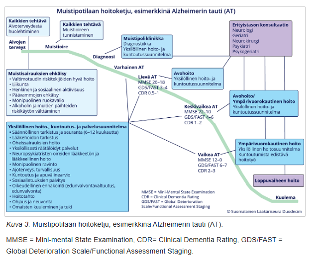
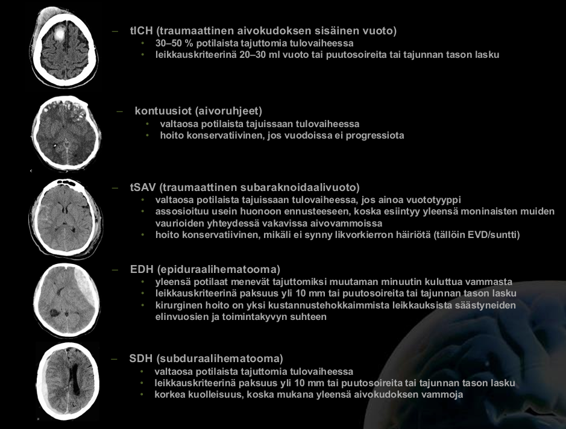
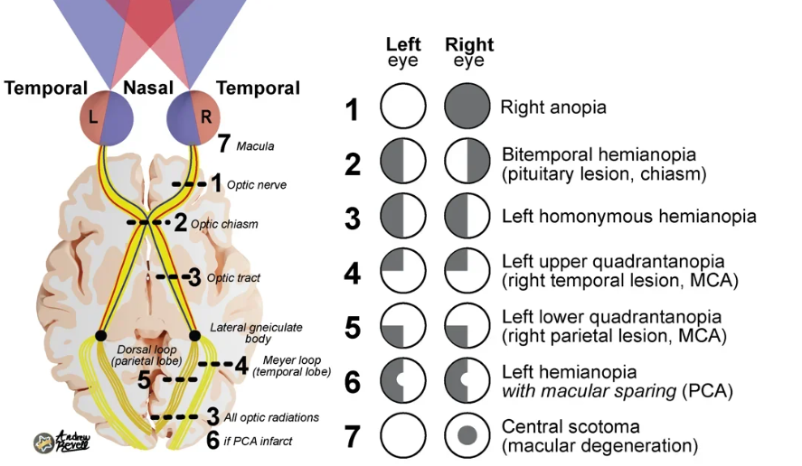

# 2018 

## Tentti 

Taas potilastapauksista vain aiheet: Parkinson, polyneuropatia, MS-taudin ensimmäinen pahenemisvaihe; skipataan taas. 

### Kroonisesti muistisairaan hoitopolku perusterveydenhuollosta erikoissairaanhoitoon

  <button class="solution-button"
          data-label="Vastaus"
          data-hide-label="Piilota vastaus">
    Vastaus
  </button>
  

Kts. 2019 viimeinen kysymys tarkempaa selvittelyä varten. Periaatteessa PTH:ssa havaitaan oirekuva, tehdään alkuselvittelyt (CERAD, mahdollisesti MoCA; sekundaaristen syiden labrat, masennuksen selvittely) ja tehdään tarvittaessa lähete muistisairausepäilystä ESH (alle 70-75-vuotiaista herkästi lähete ESH, iäkkäistä paikallisen saatavuuden rajoissa geriatrin konsultaatio; työikäiset ohjataan neurologille, ellei selkeää hyvänlaatuista taustaselittäjä (työikäisten alkuselvittelyt usein työterveyshuollossa)). Diagnostiikan apuna ESH:ssa MRI, selkäydinneste; tarvittaessa PET-kuvantaminen, SPECT-kuvantaminen, neuropsykologiset tutkimukset yms muut tarkentavat tutkimukset. Aloitetaan mahdollisuuksien mukaan lääkehoito (esim. Alzheimerin taudissa yleensä asetyylikoliiniesteraasin estäjä ja keskivaikeassa/vaikeassa taudissa lisäksi memantiini). 

Kun diagnoosi on asetettu ja lääkitys vakiintunut, vastuu hoidosta siirtyy yleensä takaisin perusterveydenhuoltoon. Yleensä potilasteksteissä on suunnitelma lääkityksen tehostamisesta ja tilanteen seuraamisesta. Tarvittaessa ESH:n konsultaatio (vanhuksilla siis usein geriatria; neurologia vastaaalle 65-70-vuotiaiden henkilöiden muistisairauksien tutkimisesta ) matalalla kynnyksellä.  

  

### Aivovammapotilaan tärkeimmät esitiedot ja mitkä kallonsisäiset vammat sopii aivovammapotilaalle? 

  <button class="solution-button"
          data-label="Vastaus"
          data-hide-label="Piilota vastaus">
    Vastaus
  </button>
  

<li>Tapahtumatiedot</li>
  <ul>
    <li>Vammamekanismin kuvaaminen; varsinkin siis vammaenergian arvioiminen</li>
    <li>Mahdollisimman tarkka tapahtuma-ajankohta</li>
  </ul>
<li>Oireet</li>
  <ul>
    <li>Tajuttomuus ja sen kesto</li>
    <li>Potilaan muistikuvat ennen vammautumista ja sen jälkeen (posttraumaattisen amnesian (PTA) kesto)</li>
    <li>Kouristelu</li>
    <li>Sekavuus, desorientaatio</li>
    <li>Päänsärky, pahoinvointi ja oksentelu</li>
    <li>Neurologiset puutosoireet</li>
    <li>Oireiden kehittyminen (etenevätkö)</li>
  </ul>
<li>Muut tarpeelliset tiedot</li>
  <ul>
    <li>Käytössä olevat lääkkeet, erityisesti veren hyytymiseen vaikuttavat</li>
    <li>Päihteiden käyttö</li>
    <li>Aiemmat aivovammat ja –sairaudet</li>
    <li>Muut sairaudet</li>
    <li>Aikaisempi toimintakyky</li>
  </ul>

---

Kaikilta aivovammapotilailta tulee selvittää ja kirjata vähintään GCS, PTA:n kesto ja tajuttomuuden kesto. Niiden perusteella määritetään kliinisesti vamman vaikeusaste. 

---

Kallonsisäisistä vammoista yleisimpiä ovat epi- ja subduraalihematoomat, subaraknoidaalivuodot, aivokontuusiot (ja usein niihin liittyen intrakerebraaliset verenvuodot) ja diffuusit aksonivauriot (DAI; syntyy yleensä kiihdytys-hidastuvuusvammassa, kun aksonit venyttyvät ja vaurioituvat; usein vaikeita ja pitkäkestoisia tajuttomuuksia aiheuttavia). Tietysti myös kallonmurtumat ovat oma kapittelinsa. 

  

### Migreenin hoito (niin kohtaushoito kuin estohoito)

- a) perusterveydenhuollossa  
- b) neurologian polilla (mitä lääkkeitä voidaan määrätä, joita ei yleensä PTH:ssa voida)
- c) päivystyksessä?

  <button class="solution-button"
          data-label="a"
          data-hide-label="a - Piilota vastaus">
    a
  </button>
  

Migreenikohtausten päänsäryn hoidossa ensisijaiset lääkkeet ovat NSAIDit ja parasetamoli p.o. (Esim. ibuprofeeni 800 mg tai naprokseeni 500-750 mg ja parasetamoli 1000 mg; tulee siis ottaa suhteellisen korkea annos, jotta apua saadaan). Kipulääke otetaan tyypillisesti mahdollisimman pian päänsäryn alettua. Opioideja ei käytetä (eivät okein toimi kovin hyvin)! Pahoinvointiin voidaan ottaa metoklopramidia esim. 10 mg p.o. 
 
Mikäli ei saavuteta hoitovastetta (hoitovasteen saavuttaminen = kivuttomuus tai kivun merkittävä väheneminen 2 t:n kuluessa lääkkeen otosta, vaikutuksen kesto 24 t:n ajan sekä lisäksi lääkkeen vähäiset haittavaikutukset ja toimintakyvyn palautuminen.), suositellaan seuraavien kohtausten hoitoon triptaaneja (monoterapiana yleensä). Triptaanien vasta-aiheita ovat mm. iskeeminen sydänsairaus (sepelvaltimotauti, aikaisempi sydäninfarkti, Prinzmetalin angina), hallitsematon hypertonia tai taustalla olevat aivoverenkiertohäiriöt. Triptaanit voivat aiheuttaa sepelvaltimoiden vasospasmeja. Yleisen vasokonstriktion takia ovat vasta-aiheisia potilailla, joilla on keskivaikea tai vaikea hypertensio tai lievä kontrolloimaton hypertensio. Vasokonstriktion takia aivoverenkiertohäiriöt ovat myös vasta-aihe. Triptaaneja ei myöskään tule käyttää hemipleegiseen migreeniin tai aivorunkomigreeniin (ei ole näyttöä). 

---

Estohoidon aloitukselle ei ole tarkkoja rajoja, mutta voidaan aloittaa, kun potilas kokee migreenikohtauksista sen verran haittaa, että hän on itse halukas käyttämään säännöllistä lääkitystä niiden vähentämiseksi (esimerkiksi esim. jo 2 tai 3 migreenipäivää kuukaudessa voi olla aihe tai vähemmänkin, jos migreeni hankaloittaa jokapäiväistä elämää). 

Estohoito aloitetaan lähtökohtaisesti pth:ssa, jossa tarvittaessa kokeillaan ainakin 2-3 eri estolääkettä ennen lähettämistä neurologin arvioon. Ensisijaisia ovat beetasalpaajat (esim. propranololi,ATR-salpaajat (esim. kandesartaani; aloitus 8-16 mg, nosto 1-2 vk välein ad 16-32 mg/vrk) tai trisyklinen masennyslääke (esim. Amitriptyliini.) Myös joitakin epilepsialääkkeitä kuten topiramaattia tai valproaattia voidaan käyttää migreeniprofylaksiassa. Raskauden aikana vaihtoehtoina lähinnä metoprololi ja propranololi. Hoidon tavoitteena on migreenipäivien puolittuminen tai huomattava väheneminen. Vastetta voidaan arvioida 3 kk:n kuluttua, kun tavoiteannos on saavutettu. Jos ensimmäinen migreeniä ehkäisevä lääke on tehoton tai huonosti siedetty, suositellaan lääkevaihtoa.

---

Lääkkeetön hoito on myös tärkeää:

<li>Säännöllinen liikunta! (vähintään 3 x/vk; ei toki kohtauksen aikana)</li>
<li>Ravinto- ja nautintoaineet (alkoholi, tupakka, säännöllinen ruokavalio)</li>
<li>Ympäristö (ärsyttävien tekijöiden välttäminen)</li>
<li>Unihäiriöiden rotiin saaminen</li>

  

  <button class="solution-button"
          data-label="b"
          data-hide-label="b - Piilota vastaus">
    b
  </button>
  

Vaikeahoitoisemmissa migreenikohtauksissa voidaan kokeilla määrätä rimegepanttia (CGRP:n pienimolekyylinen reseptoriantagonisti), jos triptaanit ei riitä. Usein sen aloituksen arvio on neurologin heiniä, koska sekä CGRP-mabien että rimegepantin Kelan rajoitetun peruskorvattavuuden perusteena on lääkärinlausunto B erikoissairaanhoidon neurologian yksiköstä tai alan erikoislääkäriltä, kun korvausoikeutta haetaan ensimmäisen kerran ja kun korvausoikeudelle haetaan ensimmäisen kerran jatkoa. 

---

CGRP-mabit ja gepantit tulevat myös vaikeahoitoisen migreenin estohoidossa rooliin. Korvattavuus myönnetään ainoastaan vaikeahoitoisessa migreenissä, jossa kohtauksia on 8 tai enemmän kuukaudessa 3 kk:n seurannassa (tosin indikaatio on vähintään 4 kohtausta/kk) ja on käytetty 2 estohoitolääkettä tehottomina tai haittavaikutuksia aiheuttavina. Näitä ei käytetä raskaana oleville (ei turvallisuustietoa). 

Joskus voidaan estohoidossa vielä miettiä onabotuliinitoksiini A-pistoksia, jos kyseessä on vaikea krooninen migreeni (päänsärkypäiviä esiintyy 3 kuukauden ajan 15:nä tai useampana päivänä kuukaudessa ja migreenikriteerit täyttyvät vähintään 8 päivänä kuukaudessa). 

  

  <button class="solution-button"
          data-label="c"
          data-hide-label="c - Piilota vastaus">
    c
  </button>
  

Pitkittynyt migreenikohtaus on yleinen syy päätyä ensiapuun. Lääkkeiden parenteraalinen annostelu on hoidon kulmakivi. Komplisoituneissa tilanteissa voi neurologin konsultaatio olla tarpeen. Jos migreeni kestää yhtäjaksoisesti yli 72 tuntia sitä kutsutaan status migrenosukseksi. Migreenistatuksen hoitoon kuuluu aina ensin sekundaaristen päänsäryn aiheuttajien sulkeminen pois (SNOOP10- tai S2NOOP4-muistisäännöt)

Tärkeää on dehydraation korjaus sekä usein annetaan ns. migreenitippa (ketorolaakki 30mg + metoklopramidi 10mg + deksametasoni 4mg i.v. ja yleensä lisäksi parasetamolia 1000mg i.v.; joskus voidaan antaa lisäksi diatsepaamia, jos ahdistusta/lihastensiota mukana). Pitkittyneen auran hoidossa valproaatti voi auttaa (vasta-aiheinen raskaana oleville). 

  

### AVH riskitekijät ja sekundaaripreventio

  <button class="solution-button"
          data-label="c"
          data-hide-label="c - Piilota vastaus">
    c
  </button>
  

AVH:n sekundaripreventio on todella tärkeää varsinkin alkuvaiheissa, koska AVH:n uusiutusmisriski on suurimmillaan ensimmäisten päivien ja 
viikkojen aikana, pitkäaikaisuusintariski 6,4%/vuosi (vaihtelee tietysti etiologian mukaan). Kaikille AVH-potilaille tehdään etiologian mukainen arvio sekundaaripreventiivisen verenkiertoon vaikuttavasta lääkityksestä ja sen aloitusajankohdasta. 

<li>Jos potilaalla on eteisvärinä, niin AK-hoito on ensisijainen sekundaaripreventiivinen hoito. Nykyään ensisijaisesti käytetään NOAC-lääkitystä (varfariini jos läppäperäinen eteisvärinä). Eteisvärinää pitää aktiivisesti etsiä AVH-potilailta. </li>
<li>Jos potilaalla on suurten suonten ateroskleroosi (pääasiassa kaulavaltimot) ja AVH:n puolella merkittävä kaulavaltimostenoosi (>50%), niin ensisijainen hoito on endarterektomia 2vk sisällä siihen soveltuvilla ja jatkoon klopidogreeli tai ASA+pyridamoli. Jos ahtauman aste on alle 50 %, niin ensisijainen hoito on pelkkä lääkehoito ilman kirurgiaa.</li>
<li>Pienten suonten taudissa tehdään vuotoriskin arvio ja jos se on pieni, niin ensisijaisesti aloitetaan klopidogreeli tai ASA+pyridamoli. Jos vuotoriski on iso, niin ASA yleensä.</li>
<li>Kaulavaltimodissekaatiossa infarktitilanteessa voidaan akuuttivaihe hoitaa liuotuksella kriteerien muutoin täyttyessä. Lääkehoidon tavoite liuotushoidon jälkeen – ja silloin kun potilas ei ole sitä saanut – on ehkäistä iskemian uusiutuminen ja lääkkeinä käytetään antikoagulaatiohoitoa tai asetyylisalisyylihappoa (ASA) tai DAPT-hoitoa, joista ensin mainittu on Suomessa yleisempää. Hoitoa jatketaan yleensä kuuden kuukauden ajan, minkä jälkeen, jos on jäänyt merkittävä stenoosi (arvioidaan kontrolli-CTA:lla/MRA:lla), siirrytään asetyylisalisyylihappoon. </li>

---

On myös äärimmäisen tärkeää saada yleiset riskitekijät aisoihin. Tärkeimpiä muokattavissa olevia riskitekijöitä ovat hyperlipidemia, hypertensio, hyperglykemia, kuorsaus ja uniapnea ja elintavat (tupakointi, alkoholin runsas käyttö, ylipaino, vähäinen liikunta). 

<li>Tavoite on yleensä LDL <1.4, mutta voi olla <1.8, jos kyseessä ei ole erittäin suuren riskin potilas (FINRISKI <15%, ei ole diabetesta, ei munuaisten vajaatoimintaa ja etiologiana on jokin muu kuin ateroskleroosi tai pienten suonten tauti).</li>
  <ul>
    <li>Hoitona siis korkea-annoksinen statiini, tarvittaessa etsetimibi ja jopa PCSK9-estäjä</li>
  </ul>
<li>Verenpaineen suhteen tavoite  kotimittauksissa <130/80 tai niin matala kuin ilman merkittäviä haittoja voidaan saavuttaa</li>
<li>Elintapamuutokset tärkeitä (tupakoimattomuus, alkoholin käyttö suositusmääriin, liikapainon vähentäminen, liikuntaa väh. 30 min päivässä, ruokavalio kuntoon yms yms.</li>

  

### Neurologiset näköhäiriöt

  <button class="solution-button"
          data-label="Vastaus"
          data-hide-label="Piilota vastaus">
    Vastaus
  </button>
  

Neurologiset näköhäiriöt syntyvät, kun aivojen alueet, jotka vastaanottavat ja käsittelevät näköaistimuksia, vaurioituvat tai toimivat poikkeavasti. Yleisimpiä neurologisia näköhäiriöitä ovat:

Näköhermotulehdus (optikusneuriitti)
<li>Voi aiheuttaa äkillistä näön heikkenemistä, erityisesti toisen silmän alueella. Oireet voivat sisältää näön sumentumista, väriherkkyyden heikkenemistä sekä silmän takana tuntuvaa kipua, erityisesti liikuttaessa silmää. Oireisiin liittyy myös usein väsymystä ja huonovointisuutta</li>
<li>Näköhermotulehdus voi liittyä moniin sairauksiin, kuten multippeliskleroosiin (MS-tauti), ja se voi uusiutua.</li>

---

Aivoverenkiertohäiriöt 

<li>A. ophtalmican TIA-kohtaus johtaa äkilliseen toispuoleiseen sokeuteen (amaurosis fugax)</li>
<li>Homonyymi hemianopia (samanpuoleisen näkökentän puoliskon puutos molemmista silmistä) voi johtua PCA:n (yleensä makula säästynyt) tai MCA:n infarktista</li>
<li>Superiorinen tai inferiorinen kvadrantanopia yleensä johtuu MCA:n infarktista</li>

---

Migreeniaura 

<li>Migreenin näköaura on usein vähitellen minuuttien kuluessa kehittyvä positiivinen näköoire. Positiivisellä näkoireella tarkoitetaan näkökenttään ilmestyviä ylimääräisiä ilmiöitä, kuten sahalaitakuviota tai väreilyä. Migreenin auraoire kestää tavallisesti 5-60 minuuttia. Migreeniaura usein edeltää migreenipäänsärkyä ja siihen voi liittyä myös muita liitännäisoireita.</li>

---

Muut vauriot, sairaudet ja tuumorit 

<li>Tuumorit, jotka painavat optista kiasmaa, voivat aiheuttaa bitemporaalista hemianopiaa (esim. kraniofaryngeoomat lapsilla tai hypofyysiadenoomat aikuisilla)</li>
<li>Silmän liikehermojen halvaus (voi olla mm. AVH, tuumori tai trauma taustalla) -> diplopia yleistä</li>
<li>Myasthenia gravis aiheuttaa usein diplopiaa silmän liikehermojen heikkouden ja ptoosin takia</li>

  

## Uusintatentti

Taas potilastapauksista vain otsikot, joten skipattu ne. Aiheina ilmeisesti epilepsia-pt ja uusi provosoitu kohtausoire, nuoren potilaan näkö-/auraoire, muistisairaus-pt, AVH-epäily ja vapinaoireisto (Parkinson vs. essentiaalinen vapina). Skipattu myös yksi essee, joka jo tulevien vuosien tenteissä käyty läpi (Äkillisen kiertohuimauksen erotusdiagnostiikka). 

### Subduraalihematooman syyt, oireet, hoito

  <button class="solution-button"
          data-label="Vastaus"
          data-hide-label="Piilota vastaus">
    Vastaus
  </button>
  

Subduraalivuoto (SHD) = Veri kertyy kovakalvon (dura mater) ja lukinkalvon (arachnoidea mater) väliin

<li>Taustalla usein trauma, joka voi varsinkin vahuksilla olla hyvinkin lievä. Yli 50-vuotiailla (ja varsinkin alkoholisteilla atrofian takia) vähäinenkin vamma voi aiheuttaa verenvuodon, sillä laskimoiden vapaana kulkeva matka pitenee.</li>
<li>Kyseessä on laskimovuoto (johtuu aivokuorelta durasinuksiin kulkevien siltaavien laskimoiden repeämisestä. Laajenee tämän takia hitaammin kuin epiduraalinen vuoto. Yleisimmin vanhusten vamma.</li>

---

Oireena voi akuutissa vuodossa olla nopeakin tajunnan heikkeneminen/muut neurologiset oireet, mutta krooninen vuoto voi olla hyvinkin hitaasti kehittyvä (viikkojen aikana kehittyvä sekavuus, muistihäiriöt, päänsärky yms.)

---

Oireisen akuutin subduraalihematooman ensisijainen hoito on yleensä kraniotomia ja kroonisen vuodon hoito taas trepanaatio (Burr hole). Leikkauskriteerinä paksuus yli 10 mm tai puutosoireita tai tajunnan tason lasku. Veri poistetaan -> helpottaa oireita (käytännössä siis sama hoito kuin epiduraalihematoomassa, mutta kiirellisyys on vähäisempi, koska ei ole valtimovuoto kyseessä)

<li>Suuri osa akuuteista vuodoista paranee konservatiivisella hoidolla, kuolleisuus on kymmeniä prosentteja (kroonisessa parempi)</li>

  

### Diabeettinen neuropatia

  <button class="solution-button"
          data-label="Vastaus"
          data-hide-label="Piilota vastaus">
    Vastaus
  </button>
  

Diabeteksessa voi tapahtua hermojen osmoottisia vaurioita, kun glukoosia muutetaan sorbitoliksi kudoksissa aldoosireduktaasin toimesta; reaktioreittiä kutsutaan polyolitieksi. Sorbitoli on hyvin osmoottista ja kertyessään soluihin aiheuttaa niiden turvotusta ja vaurioita. 

N. 50% diabeetikoista kehittää lopulta polyneuropatian (diagnoosihetkellä on jo jopa 20%:lla; yleisempää tyypin 2 diabeteksessa). Diabeettinen neuropatia affisioi yleensä niin somaattisia hermoja (sensorisia ja motorisia) kuin autonomisiakin hermoja. Käytännössä affisioi kaikkia ääreishermoja (myös aivohermoja; yleisimmin CN III) kehon eri osissa. Tavallisin ja eniten tutkittu diabeettisen neuropatian muoto on distaalinen sensomotorinen neuropatia eli raajojen ääreishermoihin ja tuntoaistiin ja lihasten toimintaan vaikuttava hermovaurio (stocking-glove neuropathy = hansikas-sukka-tyyppisesti ja symmetrisesti ylä- ja alaraajoissa). 

<li>Tavallisimmat oireet ovat jalkaterien puutuminen tai pistely, vihlovat tai polttelevat kivut ja tuntohäiriöt. Noin puolella neuropatia voi olla täysin oireeton, mikä korostaa seulonnan merkitystä</li>
<li>Tyypillisesti neuropatian oireet tuntuvat voimakkaammin levossa, esimerkiksi öisin. Tilanteen vaikeutuessa oireet ilmenevät myös proksimaalisemmin alaraajoissa ja myös käsissä.</li>
<li>Statuksessa kosketustunnon heikkeneminen (monofilamenttikoe), värinätunnon häviäminen (ääniraudalla) sekä akillesheijasteen puuttuminen ovat herkimmät diabeettisen neuropatian kliiniset osoittajat. Mittaavat paksujen hermosäikeiden toimintaa; ohutsäieneuropatian diagnoosi perustuu pitkälti tyypillisiin oireisiin (kipu, lämpötilan erotuskyky alentunut), mutta haastavissa tapauksissa voidaan tutkia QST, ihobiopsia tai CHEP.</li>
<li>Vasaravarpaat ja pes cavus ovat yleisiä löydöksiä. Kuvaavat voiman ja venyvyyden epätasapainoa fleksorien/ekstensorien välillä neuropatiasta johtuen. Alentunut tunto raajoissa myös johtaa virheasentojen pahenemiseen. Vaikein komplikaatio on Charcot'n jalka (muistuttaa septistä niveltulehdusta tai ruusua, ja prosessi johtaa nivelten tuhoutumiseen, jalkaholvin romahtamiseen ja epämuodostumiin)</li>

---

Autonominen neuropatia voi affisioida elinjärjestelmiä laajasti, esim: 

<li>GI-kanava (mm. gastropareesi, oksentelutaipumus, ripuli/ummetus)</li>
<li>Virtsarakko (mm. rakon täyttymisen havaitsemattomuus, rakon osittainen tyhjentäminen)</li>
<li>Verenkiertoelimistö (lepotakykardia, ortostaattinen hypotensio, angina pectoris -oireiden puuttuminen, erektiohäiriöt)</li>
<li>Iho (hikoiluhäiriöt; esim. jaloissa hikoilun väheneminen -> jalkojen iho tulee kuivaksi ja haavautumisriski lisääntyy. Samalla kuitenkin voi esiintyä liiallista hikoilua esim. pään alueen hikoilupuuskina, erityisesti ruokailun yhteydessä (gustatorinen hikoilu))</li>

  

### Essentiaalisen vapinan kliininen kuva

  <button class="solution-button"
          data-label="Vastaus"
          data-hide-label="Piilota vastaus">
    Vastaus
  </button>
  

Essentiaalinen vapina (ET) on yleisin patologisen aktiovapinan syy (Esiintyvyydeksi on arvioitu 1 % väestöstä; yli 65-vuotiaiden ikäryhmässä se on noin 5 % ja vanhimmassa ikäryhmässä jopa 20 %. Voi ilmaantua jopa lapsuudessa.). Voimakkaasti perinnöllinen, mutta selkeää geenivirhettä ei vielä ole osoitettu; periytynee autosomissa vallitsevasti. Selvintä vapina on kannatusasennossa, kuten eteen ojennetuissa käsissä. Lepovapina ei ole tyypillistä (mahdollista kuitenkin; ns. ET +). 

Johto-oireena on yleensä molempien käsien aktio- ja asentovapina. Vapinaa voi olla myös vartalolla, jaloissa, äänessä ja päässä, jossa se on usein kääntöä sivulle (”ei-ei”-liike; hyvä huomata, että jos on tällaista pään vapinaa, niin silloin tila ei viittaa Parkinsonin tautiin). Psyykkinen jännitys lisää vapinaa, joka on pahinta seurassa, kuten kahvikutsuilla (ns. kahvikuppineuroosi). Vapina pahenee käden tarkkuutta vaativissa tehtävissä (esim. nimikirjoitus) ja usein lievenee jo vähäisen alkoholin nauttimisen jälkeen (tärkeä piirre ja tulee muistaa kysyä)s. 

Status on yleensä muuten löydöksetön. Tauti ei etene mitenkään erityisen nopeasti yleensä (ei-degeneratiivinen sairaus) ja jos vapina pysyy muuttumattomana (vain liikevapinana ilman muita oireita) kolmen vuoden ajan, on tilastollisesti erittäin epätodennäköistä, että kyseessä olisi Parkinson (ennen kolmea vuotta voi ET olla kyllä työdiagnoosi ja epäily, mutta yleensä virallinen diagnoosi tehdään vasta 3v kohdalla). 

  

### Epilepsiapotilas perusterveydenhuollossa a) Diagnostiikka b) Seuranta

  <button class="solution-button"
          data-label="a"
          data-hide-label="a - Piilota vastaus">
    a
  </button>
  

Selvitetään kohtauskuvaus ja muu anamneesi. Statustetaan potilas ja voidaan ottaa perustason tutkimukset (EKG, pvk, crp, gluk, na, k, krea, ca, CK, ALAT, TSH, tarvittaessa GT, PEth, U-huumeet). 

Jos kohtausoire sopii epileptiseksi, on voimakas/motorinen/tajunnanhäiriö ja potilas on tk-arviossa samana päivänä, niin tehdään päivystyslähete ESH-arvioon (tällöin labrat ja tutkimukset voi ottaa sielläkin, jos saatavuus on hidas/huono TK:ssa). Jos kyseessä ei ole ensikouristaja, niin ei aina tarvitse päivystysarviota, vaan voi konsultoida tarpeen mukaan neurologia. 

Jos oirekuva on lievä/epäspesifi, potilas on hakeutunut arvioon vasta päivien kuluttua kohtauksesta ja neurologinen status normaali, mutta herättää epilepsiaepäilyn → 1-7 vrk lähete neurologialle (epilepsiaepäilyssä muista asettaa potilas ajokieltoon). 

Jos kohtausoire ei ole selvästi epileptinen, kannattaa selvitellä kardiologista taustaa tarkemmin (kardiologin konsultaatio tarpeen mukaan). 
  

  <button class="solution-button"
          data-label="b"
          data-hide-label="b - Piilota vastaus">
    b
  </button>
  

Kohtauksettoman potilaan seuranta siirretään tk:hon. Siellä yleinen terveydentilan seuranta, reseptien uusinnat sekä mahdollisten turvakokeiden ohjelmointi ja seuranta. Ajokyvyn ja työkyvyn jatkuva arviointi kuuluu tehtäviin. Hoidon yhteydessä tulisi myös huomioida epilepsiaan ilman suoraa syy-yhteyttä yhdistyvät liitännäissairaudet, kuten oppimishäiriöt, autismikirjon häiriöt, depressio ja AVH-riskitekijät. 

Epilepsiapotilas kuuluu päivystykseen, jos kouristaa ja kohtauksen kesto on pitkittynyt (yli 5min; tk:ssa voidaan antaa bentsot ja lähettää päivystykseen), esiintyy useita kohtauksia 24h sisällä (sarjakohtaus) tai tajunnan palautuminen pitkittyy/esiintyy uusia neurologisia oireita. 

Poliklinikalle tehdään lähete, jos seurannassa oleva pitkään kohtauksettomana ollut potilas saa epilepsiakohtauksen (epilepsian hoidon tavoitteena yleensä on kohtauksettomuus ilman merkittäviä haittavaikutuksia), suunnittelee raskautta (tai on raskaana), toivoo lääkityksen lopettamista tai kokee lääkitysongelmia. Jos potilaalla hoitokontakti neurologialla epilepsian suhteen niin hän voi itse aina olla epilepsia-asioissa virka-aikaan yhteydessä poliklinikalle ellei toisin ole ohjeistettu.

  

