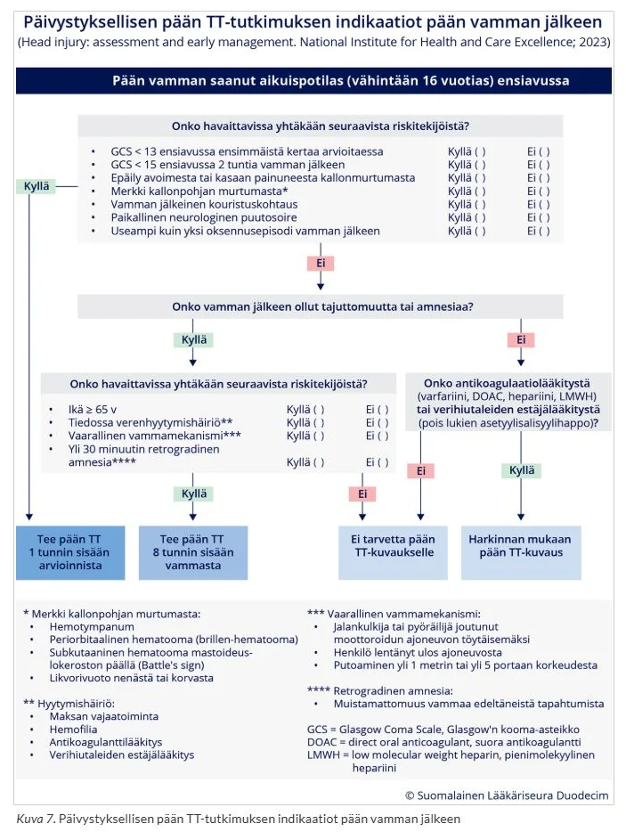
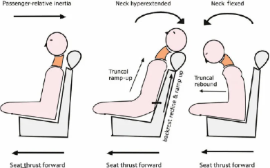
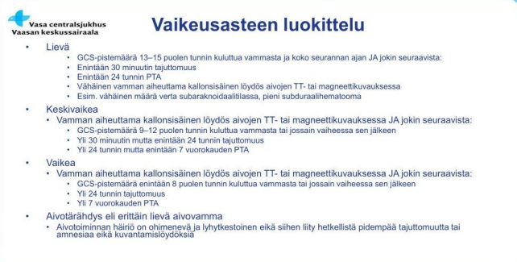
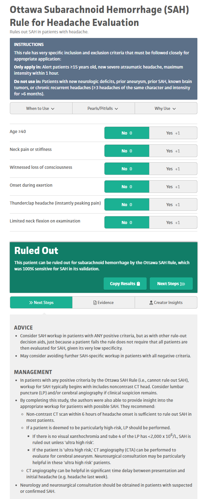
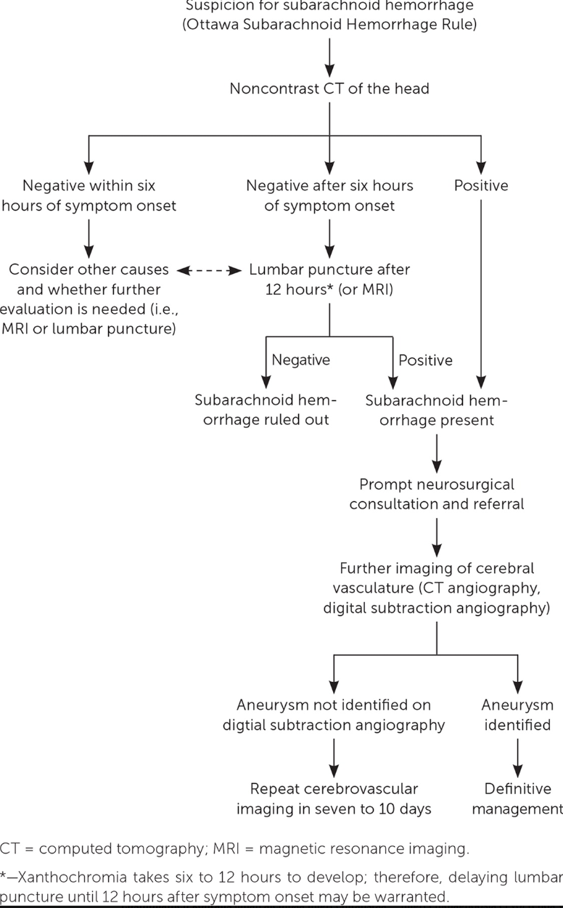
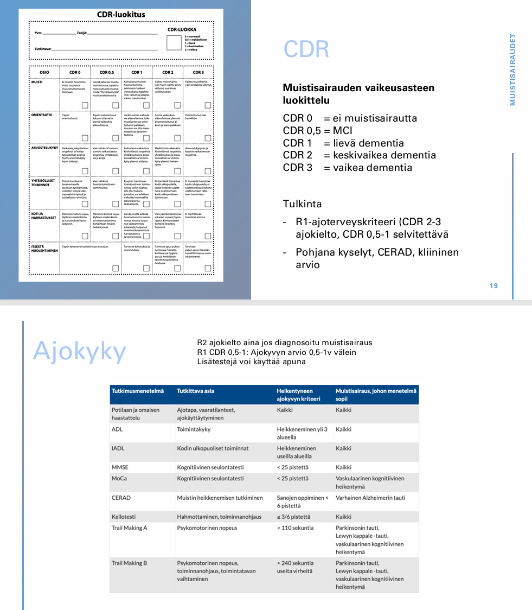

# 2017 

## Tentti 

Yksi esseekysymys sama kuin tulevina vuosina (päänsäryn vaaran merkit).

### Polyneuropatia 

- a. Polyneuropatian syyt ja kliininen kuva
- b. Kivuliaan polyneuropatian hoito

  <button class="solution-button"
          data-label="a"
          data-hide-label="a - Piilota vastaus">
    a
  </button>
  

Polyneuropatioille on useita eri syitä (geneettiset, immunologiset, hankinnaiset…), mutta kattavien tutkimustenkin jälkeen etiologia jää epäselväksi n. 1/3 polyneuropatiatapauksista. 

Yleisimmät kaksi syytä ovat diabetes ja alkoholi. Muita ovat mm. B12-vitamiinin puutos, hypotyreoosi, maksan/munuaisten vajaatoiminta, B6-toksisuus, sytostaatit/muut lääkkeet...

Yleisin perinnöllinen polyneuropatia on Charcot-Marie-Toothin (CMT) tauti (hereditaarinen motosensorinen neuropatia (HMSN). CMT:stä on monia eri tyyppejä, mutta alkavat useimmiten n. 5-25-vuotiaana ja yleisin periytymistapa on autosomissa vallitsevasti. 

Periaatteessa myös polyradikuliitit (Guillain-Barrén oireyhtymä ja CIDP) voidaan laskea polyneuropatioihin. Ne ovat autoimmuunisairauksia. 

---

Polyneuropatiat voivat affisioida sensorisia hermoja, motorisia hermoja ja/tai autonomisia hermoja ja täten aiheuttaa monia erilaisia oireita. Sensoriset oireet voidaan luokitella "negatiivisiin" ja "positiivisiin". Negatiivisilla oireilla tarkoitetaan tunnon heikentymistä tai puuttumista. Positiivisilla oireilla tarkoitetaan lisääntyneitä tai muuttuneita ihon tunto-oireita (esimerkiksi pistely, kihelmöinti, polttelu sekä allodynia, jossa ei-kivulias stimulus koetaan kipuna, sekä hyperalgesia, jossa kipuaistimus koetaan liiallisena; hermokivut ovat yleensä pahimmillaan ilta- ja yöaikaan eli levossa). Useimmiten oirekuva on symmetrinen ja alkaa yleensä hermojen distaaliosissa ja leviää vähitellen proksimaalisesti. Tyypillisin ensioire on siis sukka- ja hansikasmainen tuntopuutos raajojen kärkijäsenissä, usein alkaen alaraajoista. Jalkapohjien tuntopuutokset johtavat helposti tasapainovaikeuksiin ja kävelyn heikentymiseen. Statuksessa kosketustunnon heikkeneminen (monofilamenttikoe), värinätunnon häviäminen (ääniraudalla) sekä akillesheijasteen puuttuminen ovat herkimmät alaraajojen neuropatian kliiniset osoittajat. Mittaavat paksujen hermosäikeiden toimintaa. Ohutsäieneuropatian diagnoosi perustuu pitkälti tyypillisiin oireisiin (kipu, lämpötilan erotuskyky alentunut), mutta haastavissa tapauksissa voidaan tutkia QST, ihobiopsia tai CHEP.

Motoristen hermojen affisioituminen johtaa lihasheikkouteen, -atrofiaan, -kouristuksiin tai vapinaan. Jännevenytysheijasteet heikentyvät ja lihasheikkouksia voi esiintyä; babinskit negatiiviset. Motoriset ongelmat voivat tuntopuutosten kanssa aiheuttaa rakenteellisia muutoksia, kuten korkeita jalkaholveja ja vasaravarpaita. 

Autonominen neuropatia voi aiheuttaa mm. GI-oireita (esim. ummetus ja gastropareesi), rakon tyhjenemisongelmia, verenkierrollisia ongelmia (esim. ortostatismi) ja hikoiluhäiriöitä (ja aiheuttaa jaloissa mm. kuivumia ja halkeamia -> altistaa infektioille).
  

  <button class="solution-button"
          data-label="b"
          data-hide-label="b - Piilota vastaus">
    b
  </button>
  

Etiologian ja taustasairauden mukainen hoito on tärkeää (esim. diabeteksen hoitotasapaino, alkoholin käytön vähentäminen, B12-lisä yms). Kuntoutus, apuvälineet ja jalkahoito ovat yleisesti käytettyjä tukitoimia. 

Kivun lääkehoito on tyypillistä neuropaattisen kivun hoitoa; käytössä siis trisykliset masennuslääkkeet (nortriptyliini, amitriptyliini), SNRI-lääkkeet (duloksetiini, venlafaksiini) ja gabapentinoidit (gabapentiini, pregabaliini). Joskus harvoin voidaan käyttää heikkoja opioideja lyhytaikaisesti.
  

### Toistuvat tajunnanmenetykset 

- a. syyt 
- b. tarvittavat tutkimukset; keskity tutkimuksissa erotusdiagnostiikkaan

  <button class="solution-button"
          data-label="a"
          data-hide-label="a - Piilota vastaus">
    a
  </button>
  

Tajunnanmenetyksen (ei siis jatkuvan tajuttomuuden; siihen VOI IHME!) syyt voi jakaa periaatteessa kolmeen pääryhmään: synkopee, epileptiset kohtaukset ja muut. 

---

Synkopee voidaan edelleen jakaa kolmeen pääryhmään: heijasteperäinen (yleensä vasovagaalinen), ortostaattinen ja sydänperäinen. 

<li>Vasovagaalinen synkopee on yleisin; pelko, kipu, pitkä seisominen laukaisee vagushermon kautta ääreisvastuksen heikkenemisen ja/tai sykkeen hidastumisen ja sitä kautta globaalin hypoperfuusion aivoissa -> synkopee</li>
<li>Ortostaattinen johtuu verenpaineen tippumisesta asentoa muuttaessa (esim. makuulta seisomaan); Syynä usein lääkitys, kuivuminen, autonomisen hermoston häiriö, ikääntyminen</li>
<li>Kardiogeeninen on vaarallisin ja johtuu esim. rytmihäiriöistä tai aorttastenoosista (rasituksessa)</li>

---

Epileptiset kohtaukset 

<li>Aivojen epänormaali sähköinen purkaustoiminta. Kyseessä voi olla yleistynyt kohtaus tai paikallisalkuinen tajuntaa hämärtävä kohtaus</li>
<li>Taustalla voi olla monia sekundaarisia tekijöitä (esim. AVH, enkefaliitti, trauma, autoimmuunienkefaliitti, metaboliset syyt (esim. hypoglykemia, elektrolyyttihäiriöt), intoksikaatiot/Vieroitukset (esim. alkoholi tai bentsot), CNS-tuumori) tai kyseessä voi olla primaari epileptinen kohtaus (ei altistetta)</li>

---

Muut, kuten 

<li>Psykogeeniset kohtaukset ja simulaatiot</li>
<li>Hypoglykemiat</li>
<li>AVH:t harvemmin aiheuttavat tajuttomuutta, mutta kuitenkin mahdollista</li>
<li>Toistuvat pään traumat</li>

  

  <button class="solution-button"
          data-label="b"
          data-hide-label="b - Piilota vastaus">
    b
  </button>
  

Kaikkein tärkeintä on saada anamneesi ja kohtauskuvaus tajunnanmenetyksistä. Tulee siis selvittää tuntemukset, oireet ja tilanne ennen kohtausta, kohtauksen aikana ja kohtauksen jälkeen. Potilas ei usein pysty näitä kuvaamaan (ainakaan kohtauksen aikaista), joten silminnäkijähaastattelu on äärimmäisen tärkeä. 

<li>Kuvaus kohtauksen alusta, kulusta ja jälkioireista auttaa erityisesti selvittämään, onko kyseessä oikeasti ollut epileptinen kohtaus vai enemmänkin esim. synkopee</li>
  <ul>
    <li>Esioireet: Epileptisessä kohtauksessa eniten aistioireita (esim. outo hajukokemus) ja psyykkisiä oireita; Synkopeessa tyypillisintä pahoinvointi, kalpeus, hikoilu, heikotus ja/tai näön hämärtyminen</li>
    <li>Kaatumisenaikainen lihastonus: Epileptisessä kohtauksessa yleensä tooninen, synkopeessä yleensä atooninen</li>
    <li>Lihasnykäysten määrä: Epileptisessä kohtauksessa rytmisiä, voimakkaita ja voivat jatkua pidempään; Synkopeessa lyhyitä, epäsäännöllisiä ja niitä on vähän (usein alle 10 nykäystä; on olemassa ns. 10/20 rule eli <10 nykäystä viittaa synkopeehen ja >20 epileptiseen kohtaukseen). Nykiminen alkaa synkopeessa vasta, kun henkilö on jo veltostunut ja kaatunut; epileptisessä kohtauksessa kohtaus yleensä alkaa heti kouristuksella</li>
    <li>Kesto: Synkopee yleensä lyhytkestoisempi (n. 3-30s), epileptinen kohtaus yleensä vähän pidempi (30s-pari minuuttia)</li>
    <li>Kielen purenta: Epileptisessä kohtauksessa yleisempää ja voi olla lateraalisestikin; synkopeessa korkeintaan kielen kärjen purenta</li>
    <li>Silmien avonaisuus: Epileptisessä kohtauksessa usein auki, synkopeessa yleensä kiinni</li>
    <li>Inkontinenssi: Yleisempää epileptisessä kohtauksessa</li>
  </ul>
<li>Auttaa myös jo alustavasti selvittämään kohtaustyyppiä (paikallisalkuinen/suoraan yleistynyt)</li>

---

Toiminnallisten kohtausten (ei epileptistä sähköistä aktiivisuutta; taustalla psykologinen mekanismi; potilaat eivät teeskentele oireitaan) erot epilepsiaan ovat myös usein kohtauskuvauksen perusteella selviteltävissä. Oireiston alkua edeltää useimmiten akuutti tai pitkäkestoinen poikkeuksellinen psykososiaalinen stressi.

<li>Toiminnallinen kohtaus on yleensä pitkäkestoisempi</li>
<li>Toiminnallisessa kohtauksessa silmät ovat yleensä kiinni</li>
<li>Toiminnallisessa kohtauksessa voidaan saada ulkoisesti vaikutettua oireeseen; esim. puhe- tai muun vaasteen saaminen (yllättävälle) ärsykkeelle</li>
<li>Toiminnallisessa kohtauksessa on kohtauskuvauksen vaihtelua/monimuotoisuutta kerrasta toiseen. Epilepsiassa taas usein stereotyyppisiä henkilölle itselleen </li>
<li>Toiminnallisessa kohtauksessa ei yleensä post-iktaalista sekavuutta ja toipuminen on nopeaa</li>
<li>Toiminnallisessa kohtauksessa esiintyy usein muistikuvia kohtauksesta</li>
<li>Toiminnallisessa kohtauksessa pään kääntely puolelta toiselle on yleistä</li>

---

Taustoista on tärkeää selvittää aiempi epilepsia, pään vammat, aikaisemmat AVH:t, alkoholin/päihteiden käyttö, lääkitys yms. altistavat tekijät, kuten sukurasite ja äärimmäiset rasitustilat: paasto, teräsmieskisat, pitkäaikainen valvominen. Myös muut sairaudet tulee selvittää.

<li>Jos tiedossa on jo epilepsia, niin pään kuvantaminen ei ole yhtä tärkeää kuin ensikouristajilla</li>
<li>Onko potilaan lähistöltä löydetty lääkepurkkeja tyhjänä -> ohjaa ajattelua yliannostukseen</li>
<li>Altistavat tekijät ohjaavat jatkoselvittelyitä ja vaikutuksia diagnoosiin; ei siis ole sinänsä epilepsia kyseessä, jos kohtaus liittyy johonkin välittömään ja poikkeukselliseen altistavaan tekijään (akuuttiin aivovammaan, aivosairauteen, tai systeemiseen häiriöön) ja jos altistava tekijä voidaan poistaa tai hoitaa muutoin. Altisteisena kohtauksena pidetään 7 vrk kuluessa akuutista aivotapahtumasta esiintynyttä epileptistä kohtausta</li>

---

Statuksessa: 

<li>Yleisstatus: Pään ja niskan alueen palpaatio (trauman merkit), auskultaatio (infektiot ja sydämen toiminta), ihon kunto (infektiot, traumat), </li>
<li>Suu ja kieli (puremat)</li>
<li>Kattava neurologinen status</li>

---

EKG, verenpaine kaikille. Synkopee-epäilyssä ortostaattinen koe mahdollisesti. UKG tarvittaessa ja muutenkin kardiovaskulaarinen arvio, varsinkin jos synkopee-epäily.

Jos tänään kouristellut, niin päivystykseen (ensikouristajat päivystykseen, jossa pään TT). Päivystyksessä myös labrat (a-astrup, glukoosi, PVK, elektrolyytit, Krea, ALAT, CK, TSH, CRP; troponiinit harkitusti ja päihdekäyttöä epäiltäessä puhallus, PEth, U-huumeet). Jos potilas on tullut vasta myöhempinä päivinä vastaanotolle, niin epileptisiä kohtauksia epäiltäessä neurologialle kiireellinen lähete, siellä MRI ja EEG. 

CNS-infektioepäilyssä (esim. potilaalla korkea kuume) likvor. 
  

### Parkinsonin taudin neljä pääoiretta ja niiden erotusdiagnostiikka

  <button class="solution-button"
          data-label="Vastaus"
          data-hide-label="Piilota vastaus">
    Vastaus
  </button>
  

Parkinsonin taudin pääoireet voi muistaa muistisäännöstä TRAPSS ja näistä neljä ensimmäistä eli TRAP ovat ns. pääoireet (S x2 on siis shuffling gait eli parkinsonimainen kävely ja small handwriting (mikrografia)).  

<li>Tremor (lepovapina)</li>
<li>Rigiditeetti (lihasjäykkyys)</li>
<li>Akinesia/Bradykinesia</li>
<li>Posturaalinen instabiliteetti (tasapainovaikeudet)</li>

---

Vapinan erotusdiagnostiikassa yleisin erotusdiagnostinen vaihtoehto on essentiaalinen vapina (ET). ET taas on aktiovapina (esiintyy käsiä kannatellessa ja tehdessä, esim. juodessa), on symmetristä, voi affisioida ääntä ja päätä, on usein suvuttaista ja lievittyy alkoholilla. Parkinsonin vapina taas on on lepovapinaa (esiintyy levossa ja lievittyy liikkeessä), voi olla asymmetristä tai symmetristä, ei yleensä affisioi päätä tai ääntä (Parkisnonin taudissa ääni kyllä voi mennä hiljaisemmaksi ja monotooniseksi, mutta äänivärinää ei yleensä esiinny; samoin päässä leuka voi vapista, mutta pään heilumista sivuille ei yleensä nähdä), ei lievity alkoholilla ja sukuyhteys on yleensä heikompi. 

Tietysti myös tulee pitää mielessä lääkkeiden aiheuttama parkinsonismi (esim. psykoosilääkkeet ja muut antidopaminergit). 

---

Rigiditeetti on passiivisen liikkeen aikana tuntuvaa vastusta, joka ei riipu liikkeen nopeudesta (toisin kuin spastisuus, joka on ylemmän motoneuronin vaurion merkki ja vastus on nopeusriippuvaista (nopeampi passiivinen liike -> spastinen jäykkyys); liittyy myös kiihtyneet heijasteet). Usein mukana on "hammasratasilmiö", kun jäykkyyteen yhdistyy vapina.

---

Parkinsonismin ns. pakollinen oire diagnoosin kannalta on hypokinesia eli siis akinesia (liikkeen aloittamisen hitaus ja spontaanin liikehdinnän vähentyminen) tai bradykinesia (liikesuorituksen hitaus). Se näkyy mm. vaikeutena aloittaa liike, liikealan pienenemisenä (esim. mikrografia eli pieni käsiala) ja kasvojen ilmeettömyytenä (maskikasvot). Statuksessa toistoliikkeet (esim. DDK tai nyrkistys) hitaita ja usein myös decrementti nähtävissä. 

Erotusdiagnostistesti mm. masennus tai hypotyreoosi voi olla hidastuneisuuden taustalla. Decrementissä voi myös miettiä mm. myastenia gravista, mutta se ei yleensä ilmene hitautena levon jälkeen. Tietysti vanhuksen yleinen rappeutuminen voi olla hitauden taustalla. 

---

Tasapainovaikeuksissa potilaan asento muuttuu etukumaraksi ja suunnanmuutokset kävellessä muuttuvat epävarmoiksi. Pull-testissä (retropulsion testi) potilasta vedetään yllättäen taaksepäin olkapäistä ja Parkinsonin taudissa potilaalla on vaikeaa saada tasapainoa vedon jälkeen (normaali vaste on alle 2 korjausaskelta). 

Muita tasapaino- ja kävelyongelmien aiheuttajia ovat mm. normaalipaineinen hydrokefalia (NPH; triadina kävelyvaikeus, muistihäiriö ja virtsankarkailu), pikkuaivoatrofia alkoholismin takia, MS-tauti, korvaperäiset huimaukset, TULES-ongelmat yms.  
  

### Aivoinfarktipotilaan komplikaatioiden esto ja hoito AVH-yksikössä

  <button class="solution-button"
          data-label="Vastaus"
          data-hide-label="Piilota vastaus">
    Vastaus
  </button>
  

Omatoimisilla potilailla hoito jatkuu akuutin hoidon (trombolyysi, endovaskulaaritoimenpiteet, vaikeaoireinen tila) jälkeen AVH-valvonnassa ja ei-omatoimisilla AVH-osastolla tai TK-vuodeosastolla. 

Yleinen tavoite on fysiologisten muuttujien seuranta ja normalisointi sekä komplikaatioiden esto ja hoito. 

---

Verenpaine: alussa voidaan sallia korkeampikin paine; periaatteena on, ettei lievästi kohonnutta verenpainetta alenneta ja hypotensiota vältetään akuutissa vaiheessa aivoperfuusion turvaamiseksi. Yli 80 %:lla aivoinfarktipotilaista verenpaine kohoaa reaktiivisesti akuuttivaiheessa normalisoituen jälleen viikon kuluessa. Verenpaineen äkillinen laskeminen etenkin vasodilatoivilla lääkkeillä voi akuutissa vaiheessa heikentää aivojen perfuusiota. Jos verenpaine ylittää 220/120 mmHg:n tason, sitä hoidetaan aktiivisesti. Antikoagulaation ja trombolyysin yhteydessä verenpainetavoite on huomattavasti tiukempi – verenpaineen tulee tällöin olla alle 185/105 mmHg. Verenpaineen akuuttihoidossa ensisijaisia lääkkeitä ovat labetaloli ja enalapriili.

---

Hengitys- ja keuhkokomplikaatioiden ehkäisy on todella tärkeää. Aspiraatiokeuhkokuume selittää jopa neljänneksen aivoinfarktin akuutin vaiheen kuolleisuudesta. Testataan nielemiskykyä (valtaosalla aivoinfarktipotilaista esiintyy akuuttivaiheessa nielemisvaikeuksia, joten potilaalle ei anneta mitään suun kautta, kunnes nieleminen on asianmukaisesti testattu ja sen on todettu toimivan turvallisesti), pidetään asentoa sopivana, tarvittaessa annetaan antibiootteja (kaikkien tajuttomien tai pitkään maanneina löydettyjen tai oksentaneiden voidaan olettaa aspiroineen, aspiraatiokeuhkokuumeen mikrobilääkehoito aloitetaan herkästi). Akuutissa vaiheessa keuhkokuvasta havaitaan usein lievä verekkyyden korostuminen, joskus neurogeeninen keuhkoödeema.

---

Keuhkoembolia on tavallisimpia aivohalvauspotilaiden välittömiä kuolinsyitä. Riskiä voidaan vähentää varhaisella mobilisaatiolla, antiemboliasukilla ja ihonalaisella lyhytketjuisella hepariinilla.

---

Hyperglykemian hoito. 

Joka viidennellä aivoinfarkti- tai aivoverenvuotopotilaalla todetaan suurentunut veren glukoosipitoisuus akuutissa vaiheessa. Hyperglykemian on osoitettu olevan yhteydessä akuutin vaiheen suurentuneeseen kuolleisuuteen, koska se altistaa infarktin laajentumiselle ja aivoödeemalle ja lisää selvästi infarktin vuotoriskiä, erityisesti rekanalisaation ja trombolyysin yhteydessä. Glukoosipitoisia infuusionesteitä tai oraalista glukoosia ei anneta lainkaan parin ensimmäisen päivän aikana, ja arvon 8 mmol/l ylittävää plasman glukoosipitoisuutta pienennetään lyhytvaikutteista insuliinia käyttäen myös potilailla, jotka eivät sairasta diabetesta.

---

Lievä lämmönnousu on tavallista aivoinfarktin akuutissa vaiheessa myös ilman infektiota. Koska kohonnut lämpötila jo itsessään huonontaa toipumisennustetta, jo 37,5 °C ylittävää kuumeilua on syytä hoitaa. Lämpöä voidaan laskea mekaanisesti keventämällä peitteitä tai tuulettimen avulla viilentäen, ja lääkkeiksi sopivat oraalinen ja suoneen annettava parasetamoli. Lämpötilan kontrollointi on oleellista erityisesti laajassa aivoinfarktissa, johon liittyy ödeemataipumusta, sillä jo yhdellä asteella voi olla ratkaiseva merkitys kallonsisäisen paineen kannalta. 

---

Usein potilaat ovat immobilisoituja akuutissa vaiheessa ja tämän takia makuuhaavat ovat riski -> asentohoito tärkeää. 

---

Riski rytmihäiriöille ja sydäninfarktille on koholla akuutissa vaiheessa -> näiden tilanteen seuraaminen telemetrialla ja tarvittaessa hoito. 

---

Muita yleisiä komplikaatioita ovat mm. delirium, traumat kaatumisen yhteydessä, nestetasapainon ongelmat yms. Näiden hoitaminen tyypilliseen tapaan kuuluu asiaan. 
  

### Väitteitä potilastapauksesta O/V (huom. tämä ja seuraavat potilastapaukset ulkomuistista kirjoitettuja; ei täysin samoja kuin tentissä silloin)

23-v mies, kaatunut 2vko sitten skeittilaudalla, lyönyt päänsä. Omasta mielestä ei menettänyt tajuntaa, kaveri sanonut että oli muutaman minuutin tokkurainen. Tila palautui, meni kotiin. Illalla pahoinvointia ja väsyneisyyttä. Seuraavana päivänä pahoinvointi väistynyt ja alkanut takaraivolla tuntuva päänsärky. Ottanut siihen burana 600mg, josta saanut apua. (muistaakseni liittynyt jokin neurologinen oire). Nyt vastaanotolla orientoitunut ja asiallinen. Ei muistiaukkoja. Päätä särkee edelleen. Biceps ++/+, Triceps ++/+, patella +/+, akilles +/+. Oikeassa yläraajassa hieman spastisuutta. Aivohermostatuksessa ei poikkeavaa.

- a. Potilaalla on vasemman plexuksen vaurio
- b. Määräät 3kk ajokiellon tajunnanmenetyskohtauksen takia
- c. Lähetät potilaan päivystyksenä neurologialle
- d. Potilaalla on niskan retkahdusvamma
- e. Potilaalla on keskivaikea aivovamma, koska oireet ovat jatkuneet kaksi viikkoa

  <button class="solution-button"
          data-label="a"
          data-hide-label="a - Piilota vastaus">
    a
  </button>
  

Väärin 

---

Potilaan oikeanpuolisesti voimistuneet refleksit ja spastisuus viittaavat ylämotoneuronin vaurioon. Plexusvamma taas on ääreishermoston eli alamotoneuronin vaurio. 
  

  <button class="solution-button"
          data-label="b"
          data-hide-label="b - Piilota vastaus">
    b
  </button>
  

Väärin 

---

Aivovammoissa ajokieltoa tulee lievissä vammoissa 1kk, keskivaikeissa 3kk ja vähintään 6kk vaikeissa. Potilaalla vaikuttaa kertomuksen mukaan olevan lievä aivovamma, koska PTA ei ole yli päivää ja tajunnanmenetys ei ollut yli 30min. 
  

  <button class="solution-button"
          data-label="c"
          data-hide-label="c - Piilota vastaus">
    c
  </button>
  

Oikein 

---

Potilaalla paikallisia neurologisia puutosoireita pään vamman jälkeen -> vaatii pään kuvantamista (natiivi TT), joten lähetetään päivystykseen.

  

  <button class="solution-button"
          data-label="d"
          data-hide-label="d - Piilota vastaus">
    d
  </button>
  

Väärin 

---

Potilas lyönyt päätään, joten kyseessä ei ole tyypillinen niskan retkahdusvamma (whiplash eli piiskaniskuvamma), joka syntyy pään heilahtaessa äkillisesti ja hallitsemattomasti taaksepäin ja sen jälkeen voimakkaaseen etutaivutukseen (tyypillinen vammamekanismi on peräänajokolari). Piiskaniskuvammassa ei ole refleksin muuttumisia yms (vaikka ilmeneekin niskakipua, säteilykipua yläraajoihin, päänsärkyä yms). 

  

  <button class="solution-button"
          data-label="e"
          data-hide-label="e - Piilota vastaus">
    e
  </button>
  

Väärin 

---

Keskivaikea aivovamma tarkoittaa, että potilaan GCS on 9-12 puolen tunnin kuluttua vammasta tai jossain vaiheessa sen jälkeen / tajuttomuus on 30min-24h / PTA on 24h-7vrk. Oireet kuten päänsärky ja jotkut kognitiiviset oireet kestävät usein lievässäkin vammassa monia viikkoja, mutta aivovamman vaikeusaste määräytyy GCS:n, tajuttomuuden keston ja posttraumaattisen amnesian keston perusteella. 

  

### Väitteitä potilastapauksesta O/V

64-vuotias nainen, aamulla 6.30 alkanut huimaus, pahoinvointia, ei oksentanut. Katseen kohdistus ei onnistu. Aiemmin ollut kaksi kohtausta, päänsärkyä ja lievää tasapainovaikeutta. Tk vastaanotolla 12.30. Statuksessa jatkuva nystagmus. Romberg ei onnistu. Lievää dysmetriaa. 

- a. teen epleyn manööverin, koska tyypillinen BPPV
- b. epäily vestibulaarineuriitista, lähetän KNK päivystykseen
- c. liuotushoitoa ei ole syytä harkita
- d. lähetän päivystyksenä pään kuvauksiin
- e. kiireellisenä lähetteenä MS-taudin poissulkuun

  <button class="solution-button"
          data-label="a"
          data-hide-label="a - Piilota vastaus">
    a
  </button>
  

Väärin 

---

Hyvänlaatuinen asentohuimaus (BPPV) ilmenee max 1-2 min pituisina huimauskohtauksina, eikä statuksessa ilmene jatkuvaa nystagmusta, kuten tällä potilaalla.
  

  <button class="solution-button"
          data-label="b"
          data-hide-label="b - Piilota vastaus">
    b
  </button>
  

Väärin 

---

Potilaalla huimausta ja katseen kohdistuksen vaikeuksia -> epäily sentraalisesta prosessista eikä vestibulaarineuriitista.  
  

  <button class="solution-button"
          data-label="c"
          data-hide-label="c - Piilota vastaus">
    c
  </button>
  

Väärin 

---

Potilaan oirekuva on kestänyt kuusi tuntia (6.30-12.30). Liuotus on kyllä mahdollista 4,5h tunnin jälkeenkin ad 9h, mutta se vaatii perfuusiokuvantamista. Myös basilaaritrombooseissa (joka tilanne sinänsä voi olla), on liuotusikkuna normaalia pidempi (akuuteissa ad 12h ja hitaasti kehittyneissä jopa 48h).
  

  <button class="solution-button"
          data-label="d"
          data-hide-label="d - Piilota vastaus">
    d
  </button>
  

Oikein 

---

Potilaalla on huimaus ja katseen kohdistamisen ongelmia. Lievää dysmetriaa. Kävely/romberg vaikeaa. AVH-epäily ja tällöin vaatii päivystyksellisen pään TT:n. 

  

  <button class="solution-button"
          data-label="e"
          data-hide-label="e - Piilota vastaus">
    e
  </button>
  

Väärin 

---

AVH-epäily primaaristi kyseessä. 
  

### Väitteitä potilastapauksesta O/V

54-v mies, muutaman kuukauden ajan käsien vapinaa. Viime aikoina ylitöitä, vaikeita asentoja työssä. Alkoa menee 12/vko tasaisesti vkloppuun painottuen. Nyt ei kolmeen päivään. Statuksessa kannatusvapinaa, kaikki muu norm. 

- a. Todennäköisin vaihtoehto fysiologinen vapina 
- b. Ei sovi alkoholin aiheuttamaksi 
- c. Potilas epäilee itsellään Parkinsonin tautia. Sinulla on kuitenkin riittävät todisteet jättää lähete kirjoittamatta.
- d. Alkoholin aiheuttaman polyneuropatian poissulkuun tulisi tehdä ENMG
- e. Aloitat beetasalpaajan ja sovit puhelinkontrollin 1kk päähän

  <button class="solution-button"
          data-label="a"
          data-hide-label="a - Piilota vastaus">
    a
  </button>
  

Oikein 

---

Potilaalla on kannatusvapina, joka on korostunut stressin (ylityöt), vaikeiden työasentojen (lihasväsymys) ja mahdollisesti alkoholin vieroitusoireiden tai runsaan käytön seurauksena. Korostunut fysiologinen vapina on tässä tilanteessa kaikkein todennäköisin selitys, kun muu status on normaali.
  

  <button class="solution-button"
          data-label="b"
          data-hide-label="b - Piilota vastaus">
    b
  </button>
  

Väärin 

---

Vapina on hyvin yleinen oire alkoholin vieroitusoireena. Vaikka 12 annosta/viikko ei täytä miehillä suuren riskin käyttöä, niin viikonloppuun painottuva juominen voi tarkoittaa toistuvia suuria annoksia ja niistä palautuessa voi ilmentyä vapinaa yms muita vieroitusoireita.
  

  <button class="solution-button"
          data-label="c"
          data-hide-label="c - Piilota vastaus">
    c
  </button>
  

Oikein 

---

Potilaalla ei ole mitään Parkinsonin tautiin viittavaa (lepovapina, rigiditeetti, hypokinesia, posturaalinen instabiliteetti). 
  

  <button class="solution-button"
          data-label="d"
          data-hide-label="d - Piilota vastaus">
    d
  </button>
  

Väärin 

---

Polyneuropatia aiheuttaa tyypillisesti tuntohäiriöitä, kipuja ja heijasteiden vaimenemista alaraajoissa, ei käsien kannatusvapinaa. ENMG ei ole ensilinjan tutkimus vapinan selvittelyssä. Lisäksi diagnoosi on ensisijaisesti kliininen. 
  

  <button class="solution-button"
          data-label="e"
          data-hide-label="e - Piilota vastaus">
    e
  </button>
  

Väärin (tai ainakin väärähkö)

---

Tärkeää on beetasalpaajan sijasta altistavien tekijöiden eliminointi ensin: Ylitöiden vähentäminen, riittävä lepo, alkoholinkäytön vähentäminen, kofeiinin rajoittaminen — tehostunut fysiologinen vapina usein häviää, kun provosoivat tekijät poistuvat. 

Taustalla voi myös olla mm. hypertyreoosi, elektrolyyttiongelmia, hypoglykemiaa yms -> näiden tarkistaminen. 

Oireenmukaisena hoitona kyllä voidaan käyttää epäselektiivistä beetasalpaajaa (propranololi), mutta taustasyyn selvittäminen ja lievittäminen on sitä tärkeämpää.
  

### 

18-v mies. Juoksulenkillä tauolla parrua nostellessa alkanut kova päänsärky. Kehittynyt maksimiinsa noin tunnissa, VAS 8. Ei ennakko-oireita. Ei aiempaa migreenitaustaa. Äidin burana 600mg käyttänyt 1-2kpl/pvä, vain hetkellinen apu. Yrittänyt helpottaa kävelylenkillä, tämä vain pahentanut. Lievää dysfasiaa. Statuksessa sormiperimetriassa perifeerisesti näkökenttäpuutosta, oftalmoskopiassa valoarkuutta, papilla tasainen, venapulsaatio +/+.

- a. Päivystyksenä TT SAV:n poissulkuun
- b. Diagnosoit aurattoman migreenin
- c. Jos TT-normaali, tehtävä likvor josta erytrofagit yms.
- d. Potilaalla on lääkepäänsärky
- e. Oirekuva ja löydökset sopivat kaikki aukottomasti migreeniin.

  <button class="solution-button"
          data-label="a"
          data-hide-label="a - Piilota vastaus">
    a
  </button>
  

Oikein

---

Uusi, voimakas päänsärky ilman migreenitaustaa. Rasitukseen liittyvä alku. Neurologisia puutosoireita. Hälyttävä päänsärkytilanne ja vaatii päivystysselvittelyitä kallonsisäisten verenvuotojen suhteen -> natiivi-TT. 

Vaikka särky kehittyi maksimiinsa tunnin kuluessa (eikä sekunneissa, kuten tyypillisimmässä "salamapäänsäryssä"), ponnistukseen liittyvä kova särky on aina aihe päivystykselliselle pään tietokonekerroskuvaukselle (TT). Joskus harvoin SAV voi kehittyä ad 1h, jos on pienempi verenvuoto. Läheskään kaikilta ei löydy mitään erityistä jatkotutkimuksissa -> useimmiten jonkinlaisia benignejä ponnistuspäänsärkyjä. 

  

  <button class="solution-button"
          data-label="b"
          data-hide-label="b - Piilota vastaus">
    b
  </button>
  

Väärin

---

Migreenidiagnoosia ei voi tehdä ensimmäisen rajun päänsäryn kohdalla ennen kuin vaaralliset syyt on suljettu pois. Lisäksi potilaalla on dysfasiaa ja näkökenttäpuutosta, jotka ovat neurologisia puutosoireita (aura-oireita tai fokaalisia löydöksiä), joten "auraton" ei joka tapauksessa sopisi kuvaan.
  

  <button class="solution-button"
          data-label="c"
          data-hide-label="c - Piilota vastaus">
    c
  </button>
  

Oikein

---

Jos TT on tehty <6 tuntia oireiden alusta ja on normaali, se sulkee SAV:n pois lähes varmasti (sensitiivisyys ~98,7 %) potilailla ilman fokaalisia neurologisia oireita. Tällä potilaalla on kuitenkin fokaalisia oireita (dysfasia, näkökenttäpuutos), jolloin nämä tutkimukset eivät ole yhtä yleispäteviä päde ja pelkkä negatiivinen TT ei ehkä riitä. Tekstistä myös ei ihan käy selväksi, kuinka kauan kohtauksen alusta on, mutta todennäköisesti >6h, jolloin likvor tulisi ottaa. 

Verenvuodon merkkejä etsitään yleensä aikaisintaan 12 tuntia säryn alkamisesta. Livorista otetaan peruskokeet (solut, Prot, Gluk), spektri (näyte suojattava valolta) ja varaputket.

  

  <button class="solution-button"
          data-label="d"
          data-hide-label="d - Piilota vastaus">
    d
  </button>
  

Oikein / Väärin

---

Lääkepäänsärky kehittyy kuukausien kuluessa särkylääkkeiden liiallisesta käytöstä (yleensä > 10–15 päivänä kuukaudessa). Tämä särky alkoi äkillisesti parrua nostellessa.

  

  <button class="solution-button"
          data-label="e"
          data-hide-label="e - Piilota vastaus">
    e
  </button>
  

Väärin

---

Migreeni on mahdollinen (esim. hemipleginen migreeni tai auraoireinen migreeni), mutta ponnistusalku, kova voimakkuus (VAS 8) ensioireena ja objektiivinen näkökenttäpuutos statuksessa tekevät tilanteesta sekundaarisen päänsäryn (kuten SAV tai aivolaskimotukos), kunnes toisin todistetaan. Statuksen "perifeerinen näkökenttäpuutos" ei ole tyypillinen migreeniaura, joka on usein skintilloiva skotooma tai laajeneva sahalaitalinja.
  

### Väitteitä potilastapauksesta O/V

84-vuotias mies, kr. FA, DM2, verenpainetauti. Asianmukaiset hoidot. Tyttären tuomana vastaanotolle. 6kk ajan liikkeiden hitautta, tuttujen nimien unohtelua, kävely muuttunut töpötteleväksi. Potilaan päivittäiset raha-asiat, kaupassakäynnit onnistuu, ajaa ammattimiehen taidolla (R1-kortti). Potilas itse mielestään täysin terve, ei ongelmaa arjessa. Statuksessa: kävely töpöttelevää, jalat tömähtävät maahan, käännöksissä sivuaskel. Myötäliikkeet tallella, symmetriset. Koordinaatiokokeissa (SNP, KPK, DDK) ei moitittavaa. Ei vapinaa. Noudaa kehoituksia, mutta hieman hitaasti. Biceps +/+, triceps +/+, akilles -/-, Babinski -/-. Värinätunto malleolitasolla heikentynyt. 

- a. Lähetät potilaan neurologian muistipoliklinikalle muistilabroja ja CERAD:ia varten
- b. Mikäli muistilabroissa tai CERADissa poikkeavaa, et kuitenkaan tee lähetettä, sillä pystyt toteamaan tyypillisen Alzheimerin taudin ja aloitat lääkityksen
- c. Potilaan pää olisi syytä kuvata, vaikka muistilabrat olisivat normaalit
- d. Oirekuva sopii deliriumiin
- e. Toteat potilaan ajokelvottomaksi ja teet viranomaisilmotuksen

  <button class="solution-button"
          data-label="a"
          data-hide-label="a - Piilota vastaus">
    a
  </button>
  

Väärin

---

Diagnostiikka aloitetaan perusterveydenhuollossa. Muistikoordinaattori/hoitaja tekee CERAD-testin ja lääkäri tilaa muistilaboratoriokokeet terveyskeskuksessa.
  

  <button class="solution-button"
          data-label="b"
          data-hide-label="b - Piilota vastaus">
    b
  </button>
  

Väärin

---

Oirekuva ei ole tyypillinen Alzheimer. Alzheimer alkaa yleensä episodisen muistin häiriöllä. Tällä potilaalla korostuvat kävelyn häiriö ("jalat tömähtävät maahan", töpöttely) ja lievä hidastuneisuus, mutta arjen toimintakyky on yllättävän hyvä (ajaa autoa, hoitaa raha-asiat).

Näin iäkkäistä yleensä tehdään paikallisen saatavuuden rajoissa vähintään geriatrin konsultaatio (muistikeskukset!). Usein vaikka olisikin suhteellisen tyypillinen Alzheimer, niin yleensä silti tehdään lähete ESH, jossa otetaan MRI/PET ja muita tarvittavia erotusdiagnostisia selvittelyjä (esim. likvor).
  

  <button class="solution-button"
          data-label="c"
          data-hide-label="c - Piilota vastaus">
    c
  </button>
  

Oikein

---

Potilaalla on aika vahva NPH-epäily (normaalipaineinen hydrokefalia). Siihen kuuluu triadi: 1. Kävelyhäiriö (magneettikävely, jalat "liimautuvat" maahan), 2. Muistioireet (subkortikaalinen hidastuneisuus), 3. Virtsankarkailu (ei mainittu tässä, mutta tulee usein myöhemmin).

Myös vaskulaariset muutokset (leukoaraioosi) ja siten vaskulaarisen dementian alku ovat mahdollisia FA:ta ja verenpainetautia sairastavalla.

Pään kuvantaminen (MRI/CT) on välttämätön näiden erottamiseksi.
  

  <button class="solution-button"
          data-label="d"
          data-hide-label="d - Piilota vastaus">
    d
  </button>
  

Väärin

---

Oireet ovat kestäneet 6 kuukautta. Delirium on äkillinen (tunteja/päiviä kestävä) sekavuustila.
  

  <button class="solution-button"
          data-label="e"
          data-hide-label="e - Piilota vastaus">
    e
  </button>
  

Väärin

---

Diagnosoimaton muistihäiriö ei ole suora aihe ajokortin ottamiselle pois. Potilaan kanssa kyllä voi keskustella siitä, että nyt ei ole ehkä järkevää ajaa ennen kuin selvittelyt on käyty läpi. Potilas kuitenkin selviytyy päivittäisistä toiminnoista (raha-asiat, kaupassa käynti) ja ajaa tyttären mukaan "ammattimiehen taidolla" (R1-kortti). Tämä viittaa siihen, että kognitiivinen heikentyminen on vielä lievää. 

Diagnosoidussakin muistisairaudessa on R1 mahdollinen (R2 aina kyllä kielto). R1-ajoterveyskriteerit: CDR 2-3 ajokielto (vähintään keskivaikea), CDR 0,5-1 selvitettävä (lievä kognitiivinen alenema - lievä dementia).

  

