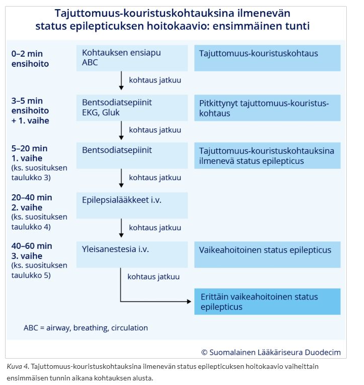
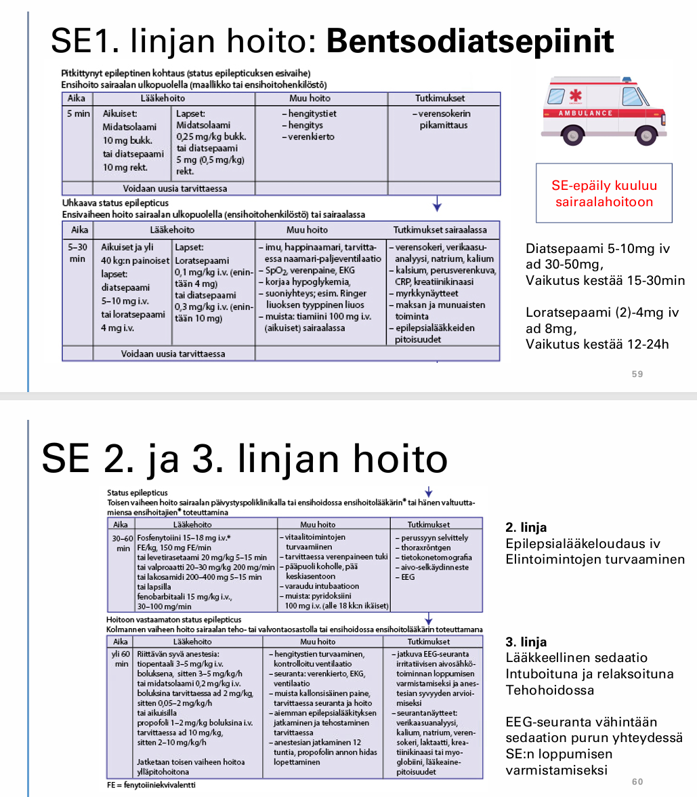

# 2015 

## Tentti

2016 ei löydy wikistä, joten hypätään vuoteen 2015. Samoja aiheita kuin seuraavina vuosina on "aivoinfarktin komplikaatioiden hoito" ja ehkäisy sekä "vapinan erotusdiagnostiikka ja hoito" - ei niitä uudestaan. Potilastapauskysymykset samoja kuin vuoden 2017 lopussa.

### Neuropaattisen kivun diagnostiset kriteerit, kliiniset oireet ja hoito

  <button class="solution-button"
          data-label="Vastaus"
          data-hide-label="Piilota vastaus">
    Vastaus
  </button>
  

Neuropaattisen kivun määritelmä on kipu, jonka syynä on looginen, osoitettavissa oleva somatosensorisen järjestelmän vaurio tai sairaus. Suurempi riski neuropaattiselle kivulle on lievemmissä vaurioissa verrattuna täydellisiin vakaviin katkeamisiin. 

Neuropaattisen kiputilan diagnoosin edellytyksiä ovat kivun neuroanatomisen sijainnin loogisuus ja tuntoaistin poikkeavaan toimintaan liittyvät statuslöydökset. 

Hermoston muutosten seurauksena tuntoaisti toimii poikkeavasti, jolloin aikaisempi kivuton ärsyke, esim. kosketus, saattaa aiheuttaa voimakkaan kivun (allodynia). Voi myös olla spontaania kipua. Usein lisäksi pistelyä, kihelmöintiä, polttelua yms. Neuropaattiset kiputuntemukset voimistuvat tyypillisesti levossa ja haittaavat nukahtamista ja yöunia
Toisaalta voidaan todeta tunnon heikentymistä eri ärsykkeille. Usein myös motorisia heikkouksia vaurioituneen hermon alueella (ellei nyt pelkkää sensorista vauriota tai puhdasta ohutsäievauriota). 

---

Diagnostinen ketju alkaa anamneesilla ja statuksella. Statuksessa voidaan testata painetuntoa, lämpötuntoa, värinätuntoa, asentotuntoa yms. sekä arvioida allodyniaa (esim. pistetään terävällä puutikulla). Tämä voi jo anamneesin ja mahdollisen altistavan tekijän (esim. leikkaus tai trauma; suurin osa (ehkä kaikki) pitkittyvästä postoperatiivisesta ja posttraumaattisesta kivusta on neuropaattista) kanssa tehdä diagnoosista aika varman. Normaali kliininen status ei kuitenkaan poissulje hermovauriota tai neuropaattista 
kipua. Usein tehdään kuitenkin varmistavia testejä, joista ensimmäinen on ENMG, joka osoittaa paksujen säikeiden vaurion. Jos se jää negatiiviseksi, niin voidaan osoittaa ohuiden säikeiden vaurio lämpökynnysmittauksilla (QST) ja ihobiopsian ohutsäietiheysmittauksella. 

---

Hoidon tavoitteena on kivun lievitys, unen parantaminen ja toimintakyvyn palauttaminen. Tavalliset tulehduskipulääkkeet tai parasetamoli eivät yleensä tehoa kovinkaan hyvin neuropaattiseen kipuun. 1. linjan lääkkeitä ovat trisykliset masennuslääkkeet (amitriptyliini, nortriptyliini), gabapentinoidit (gabapentiini, pregabaliini) ja SNRI-lääkkeet (duloksetiini, venlafaksiini). Joskus voidaan kokeilla tramadolia. Harvemmin voidaan kokeilla myös mm. kapsaisiinia ja jopa puudutusaineita.
  

### Deliriumpotilas. Tyypilliset kliiniset oireet? Mitä tutkimuksia tilaat ja miksi?

  <button class="solution-button"
          data-label="Vastaus"
          data-hide-label="Piilota vastaus">
    Vastaus
  </button>
  

Deliriumin diagnostiset kriteerit ovat DSM-IV:n ja niiden mukaisen CAM-testin mukaan seuraavat: Potilaalla on delirium, jos alla olevista kriteereistä täyttyvät kohdat 1 ja 2 (pääkriteerit) sekä 3 tai 4.

<li>1 - Äkillinen alku ja vaihteleva oireiston kulku; Äkillinen alku tarkoittaa oireiden kehittymistä tunneissa tai muutamassa päivässä. Muistisairaudet tai masennus eivät ala näin nopeasti. Deliriumin kulku on vaihteleva: oireiden vaikeus vaihtelee ja ne voivat olla välillä kokonaan poissa. Äkillisen alun ja vaihtelevan oireiston kulun havaitseminen edellyttää riittäviä tietoja potilaan tuntevilta henkilöiltä (omaiset, hoitaja) ja potilaan seurantaa.</li>
<li>2 - Tarkkaavaisuuden häiriö (esim. MOTYB-testillä eli kuukaudet takaperin -testillä seulonta); Potilaan on vaikea keskittää ja ylläpitää huomiota. Hänen on vaikeuksia keskittyä tekeillä olevaan asiaan ja pysyä puhutussa asiassa.</li>
<li>3 - Hajanainen ajattelu; Potilaan ajattelu on hajanaista ja sekavaa. Puhe on harhailevaa tai asiaankuulumatonta, ajatustenvirta epäselvää tai epäloogista tai potilas siirtyy ennakoimattomasti asiasta toiseen</li>
<li>4 - Poikkeava vireystila (hypo- ja/tai hyperaktiivinen); hyperaktiivisessa deliriumissa potilas on levoton ja säpsähtelevä, hypoaktiivisessa (yleisempi) deliriumissa apaattinen, unelias, nukahteleva tai tajuton.</li>

---

Deliriumin hoidossa tärkeintä on löytää sen laukaisija. Tutkimukset tähtäävät yleisimpien syiden (infektio, aineenvaihdunta, lääkkeet) löytämiseen. Labroista esim. astrup, PVK, CRP, Na, K, Ca, Gluk, Krea, ALAT, Bil, TSH, U-Kemseul. Tarpeen mukaan PEth, U-huum.

Tärkeää myös tarkistaa vitaalit: verenpaine, syke, SpO2, lämpö: Sepsis, hypoksia, sokki. EKG tärkeä. Yleensä otetaan myös keuhkokuva. Pään TT, jos tuore vamma, neurologisia löydöksiä yms. Likvoria voidaan miettiä, jos sopii CNS-infektioon. 
  

### Status epilepticus –potilas; miten hoidat: 

- a) kadulla 
- b) perusterveydenhuollon vastaanotolla 
- c) keskussairaalan ensiapupoliklinikalla

  <button class="solution-button"
          data-label="a"
          data-hide-label="a - Piilota vastaus">
    a
  </button>
  

Kadulla on tärkeää suojella potilaan päätä (esim. takki pään alle). Älä yritä estää liikkeitä väkisin äläkä laita mitään potilaan suuhun. Tulee soittaa 112. 

Kun kouristelu vähenee / loppuu, käännä potilas kylkiasentoon hengitysteiden turvaamiseksi.

Jos omaisilla / potilaalla on mukana potilaan "kohtauslääkettä" (usein bukkaalinen midatsolaami tai peräruiskeriatsepaami), se voidaan annostella ohjeen mukaan.
  

  <button class="solution-button"
          data-label="b"
          data-hide-label="b - Piilota vastaus">
    b
  </button>
  

ABCDE, hypoglykemian mittaaminen ja korjaaminen. Ensilinjan SE-lääkkeen voi antaa (bentsodiatsepiini, kuten midatsolaami 10mg bukkaalisesti). Ambulanssilla siirto sairaalaan saatettuna.
  

  <button class="solution-button"
          data-label="c"
          data-hide-label="c - Piilota vastaus">
    c
  </button>
  

Keskussairaalassa annetaan ensilinjan lääkitys, jos sitä ei ole vielä annettu tai uusitaan se. Jos status epilepticus ei rajoitu 1. vaiheen hoidolla ja lääkkeillä, annetaan 2. vaiheen hoitoon tarkoitetut laskimonsisäiset epilepsialääkkeet latausannoksin (ensisijaisia ovat levetirasetaami, fosfenytoiini ja valproaatti). 2. vaiheen lääkehoito voidaan aloittaa jo ensihoidossa viiveiden minimoimiseksi, jos matka keskussairaalaan on pitkä. 

3. linjan lääkityksenä käytetään suonensisäisesti annosteltavaa anesteettia. Potilas intuboidaan ja monitoroidaan EEG:tä jatkuvasti. Yleensä aikuisilla ensisijaisesti valitaan propofoli ja tarvittaessa lisätään midatsolaami-infuusio tai tiopentaaliboluksia (lapsilla ei propofolia vaan ensisijaisesti tiopentaali ja midatsolaami). Anestesiaa jatketaan 12 tuntia. Tämän jälkeen propofolin anto lopetetaan hitaasti, esimerkiksi 6–12 tunnin aikana potilaan kliinisiä oireita ja EEG:tä seuraten. Tiopentaalin ja midatsolaamin käytön asteittainen lopettaminen ei ole tarpeen, koska ne kumuloituvat pitkän anestesian aikana elimistöön ja niiden poistuminen elimistöstä on hidasta. 

  

