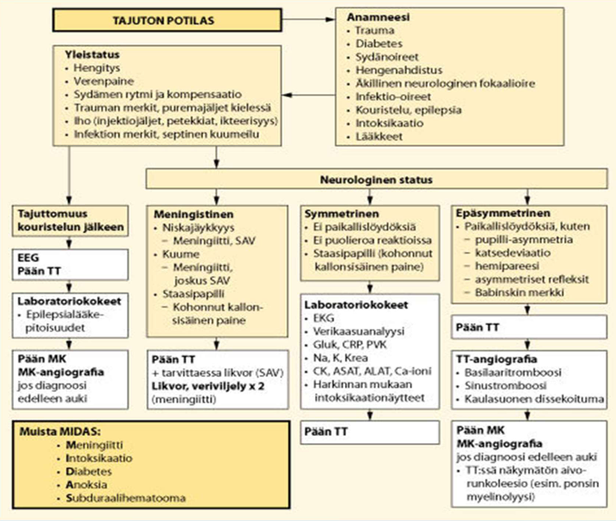

# 2014 

## Tentti 

Kolme samaa esseetä kuin tulevissa tenteissä: "Aivoperäiset näköhäiriöt. Niiden kliiniset kuvat. Millä alueella vika on niissä?" (tämä tosin vuoden 2018 tentissä otsikolla neurologiset näköhäiriöt, mutta siinä käydään samat asiat läpi) ja "Diabeettinen neuropatia" ja "muistisairaan tutkimukset PTH ja ESH". Potilastapauksia ja niistä O/V-väittämiä ilmeisesti oli, mutta väittämiä ei ole wikissä, joten ohitetaan kyseinen tehtävä.

### TIA: oireet, tutkimukset, hoito. Perusterveydenhuollon ja erikoissairaanhoidon välinen tehtävien jako.

  <button class="solution-button"
          data-label="Vastaus"
          data-hide-label="Piilota vastaus">
    Vastaus
  </button>
  

TIA-oireita ovat tyypillisiä AVH-oireita ja alkavat äkillisesti. Tyypillisesti ne kestävät alle tunnin, usein vain 2–15 minuuttia (jos oireet ovat vielä päällä potilaan tullessa vastaanotolle, kyseessä on aivoinfarktiepäily). Tyypillisiä oireita ovat mm. kasvojen toispuolinen roikkuminen/tunnottomuus, toispuoleinen raajaheikkous/puutuneisuus, puheen/ymmärtämisen muutos (afasia) tai epäselvä puhe (dysartria). Näkömuutoksina esim. toispuoleinen näönmenetys (amaurosis fugax) tai näkökenttäpuutos tai esim. diplopiaa (vaikka aivorungon TIA). Huimausta voi esiintyä. 

---

TK:ssa on tärkeää tunnistaa oirekuva ja lähettää potilaat tarpeellisella kiireellisyydellä ESH. Jos kohtauksesta on alle 2vk, niin potilas kuuluu päivystykseen. Jos taas yli 2vk niin kuuluu 1-7vrk kiireellisyydellä neurologialle. 

Päivystyksessä otetaan pään TT (poissuljetaan vuoto tai jo kehittynyt infarkti) ja TT-angiografia. Jos TT-angiografiassa todetaan merkittävä kaulavaltimoahtauma (>50%) oireen puolella, endarterektomia tulisi tehdä mieluiten 2 viikon sisällä. Lisäksi etiologisena selvittelynä EKG ja telemetriaseuranta. Tietysti myös mm. verenpaine, vitaalit, labrat (PVK, CRP, Na, K, krea, gluk, CK, TnI). 

Arvioidaan ABCD2-pisteytyksellä TIA:n riski ja tarvittaessa otetaan potilas osastolle, jos korkean riskin (pisteitä yli 4) potilas. Korkean riskin TIA:ssa myös yleensä DAPT-loudaus, 3vk DAPT ja lopuksi jatko klopidogreelillä. Jos eteisvärinää niin AK-hoito.

TK:n roolina on seurata, että riskitekijät saadaan kuntoon. Esimerkiksi LDL ja verenpaine tulee saada suosituksiin. Jatkossa ajokunnon arvio ja kiellon poisto (TIA:ssa R1 yleensä 1kk ja R2 väh 6kk).
  

### Ei-traumaattisen tajuttoman potilaan tutkimukset (muut kuin status). Tajuttomuuden aiheuttajat, tutkimukset ja mitä niillä haetaan?

  <button class="solution-button"
          data-label="Vastaus"
          data-hide-label="Piilota vastaus">
    Vastaus
  </button>
  

Tajuttomuuden yleisimmät syyt voi muistaa yleisessä käytössä olevasta muistisäännöstä "VOI IHME!"

<li>V = Vuoto kallon sisällä (spontaani, traumaattinen)</li>
<li>O = O2 puute (globaali anoksia, aivoinfarkti)</li>
<li>I = Intoksikaatio (muista epäillä!)</li>
<li>I = Infektio (bakteerimeningiitti, enkefaliitti)</li>
<li>H = Hypoglykemia (muista mitata!)</li>
<li>M = Matala verenpaine</li>
<li>! = Simulaatio (poissulkudiagnoosi)</li>

---

Kun elintoiminnot (ABC) on varmistettu, aloitetaan selvittely. Ensimmäisenä haetaan hypoglykemiaa (pika-Gluk), joka periaatteessa yleensä kuuluu D-osioon ABCDE-protokollasta. Lisäksi otetaan EKG, seurataan telemetriaa ja mitataan verenpaine, saturaatio, lämpö yms. 

Lisäksi labroja, kuten a-astrup, PVK, CPR, Na, K, Ca, Mg, CK, Krea, ALAT, GT, INR, troponiini. Mahdollisesti EtOH, muut alkoholit, veriviljelyt, urea, fosfaatti, albumiini, karboksi-Hb, virtsan huumeseula, epilepsialääkepitoisuudet yms. Jos meningistinen niin likvor yleensä tarpeen (tosin pään TT:n jälkeen; suljetaan pois rakenteellisesta syystä johtuva kohonnut ICP). 

Akuutissa vaiheessa voi tarvita sydämen ultraa (etsitään esim. oikean puolen rasittumista tai tamponaatiota). Usein tarvitaan pään TT (ensisijainen päivystystutkimus rakenteellisen vian (vuoto, laaja infarkti, kasvain) poissulkemiseksi); joskus vielä TT-angiografiakin sen perään. Lisäksi usein EEG on vaadittua (non-konvusiivisen statuksen poissulku). Keuhkokuva (voi antaa viitteitä samanaikaisista infektioista, kuten keuhkokuumeesta tai aspiraatiosta; samoin viitteitä sydämen vajaatoiminnasta). 

  

