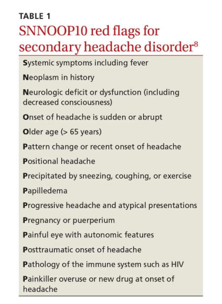
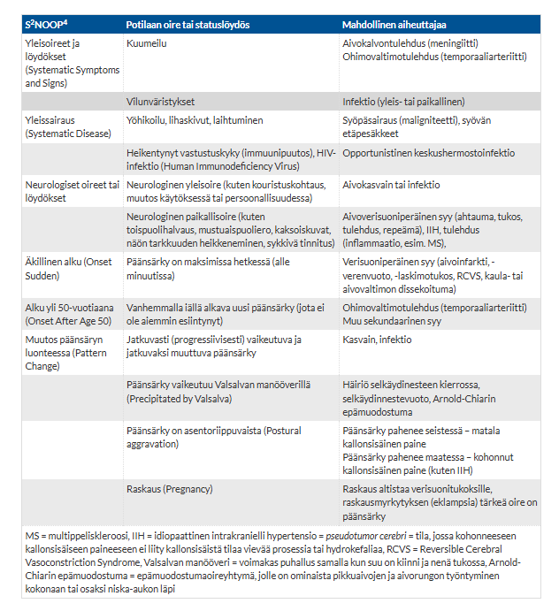

# 2011

## Tentti 

Vuoden 2012 tentin kysymyksistä kaikki on jo käyty tulevien vuosien yhteydessä läpi, joten hypätään vuoteen 2011. Tentistä puolet ovat uusia kysymyksiä (jo käytyjä ovat "TIA dg ja hoito", "Parkinsonin taudin oireet" ja "Pitkittyneen epileptisen kohtauksen hoito"). 

### Vertaile Alzheimerin tautia ja vaskulaarista dementiaa

  <button class="solution-button"
          data-label="Vastaus"
          data-hide-label="Piilota vastaus">
    Vastaus
  </button>
  

Alzheimerin tauti (yleisin yksittäinen muistisairaus; n. 70%) ja vaskulaarinen dementia (toiseksi yleisin yksittäinen muistisairaus) ovat kaksi yleisintä muistisairautta. Vaikka puhutaan usein Alzheimerin taudista tai vaskulaarisesta dementiasta omina kokonaisuuksinaan, ovat muistisairaudet hyvin usein sekamuotoisia, varsinkin vaskulaarinen + alzheimer on yleinen kombo. Niillä on paljon yhteisiä riskitekijöitä kuten korkea verenpaine, korkea kolesteroli, diabetes, tupakointi ja ikääntyminen. Mitä iäkkäämpi potilas on, sitä todennäköisempää on, että aivoista löytyy sekä rappeumamuutoksia (Alzheimer) että verenkiertohäiriöitä (vaskulaarinen). 

<li>Alzheimerin taudissa lisäksi on erikoisempia tunnistettuja riskitekijöitä, kuten esim. APOE4-alleeli.</li>

---

Patofysiologia karkeasti:

<li>Alzheimerin tauti johtuu amyloidi- ja tau-kertymistä. Amyloidikertymät aiheuttavat tulehdusresponssin ympärilleen sekä voivat myös kertyä verisuonien ympärille lisäten verenvuodon riskiä. Tau-kertymät taas häiritsevät solujen toimintaa ja johtavat solukuolemaan. Alzheimerin tauti on siis neurodegeneratiivinen sairaus ja aiheuttaa aivojen atrofiaa.</li>
<li>Vaskulaarinen dementia tarkoittaa, että erityyppiset aivoverenkierron häiriöt ja niiden aiheuttamat muutokset aivojen toiminnassa aiheuttavat kognitiivisia oireita. Taustalla siis iskeemiset vauriot aivoissa.</li>

---

Oireiden alku ja eteneminen:

<li>Alzheimerin tauti alkaa hiipivästi; etenee hitaasti ja tasaisesti</li>
<li>Vaskulaarinen dementia alkaa ja etenee hieman eri tavoin riippuen aivoverenkiertohäiriöiden etiologiasta ja affisioituneista alueista. Klassisesti sille ajatellaan olevan tyypillistä äkillinen ja portaittainen alku ja eteneminen, kun jokainen infarkti aiheuttaa porrasmaisen kognition alentuman. Suurten suonten taudissa tämänkaltaista portaittaisuutta voi kyllä ilmentyä, mutta kuitenkin selkeänä vain alle puolella potilaista. Pienten suonten taudissa oireiden hiipivä ja vähittäinen eteneminen on huomattavasti tyypillisempää, jolloin oireiden alku ja eteneminen eivät anna luotettavaa tietoa oireiden etiologiasta. </li>

---

Oirekuva ja löydökset: 

<li>Alzheimerin taudissa (ainakin sen tyypillisessä muodossa eli amnestisessa muodossa) tyypillisin ensioire on episodisen muistin alenema eli vaikeus painaa mieleen uusia asioita (lyhytkestoinen muisti). Vanhat muistot säilyvät pidempään.</li>
  <ul>
    <li>Seuraavaksi esiintyy lisääntyviä muutoksia muissakin tiedonkäsittelyn toiminnoissa (kielelliset toiminnot, hahmotuskyky, ajan- ja paikantaju), kätevyys heikkenee ja ilmenee muutoksia persoonallisuudessa ja käytöksessä (apaattisuus, masennus, alaoitekyvyttömyys, aggressiivisuus, vetäytyminen sosiaalisista tilanteista, arviointikyvyn heikentyminen).</li>
    <li>Potilas voi vaikuttaa fyysisesti erittäin hyväkuntoiselta, vaikka kognitio olisi jo merkittävästi laskenut. Neurologinen status on alkuvaiheessa usein täysin normaali.  Lievää yleistä motoriikan hidastumista ja laihtumista saattaa esiintyä jo lievässä taudin vaiheessa, mutta selvät ekstrapyramidaalioireet (vähäilmeisyys, hypokinesia, rigiditeetti, etukumararyhti) sekä kävelykyvyn heikentyminen (apraktis-ataktinen ja ekstrapyramidaalinen häiriö) ilmaantuvat vasta taudin edetessä. </li>
  </ul>
<li>Tapahtumamuisti on yleensä paremmin säilynyt vaskulaarisessa muistisairaudessa kuin Alzheimerin taudissa. Vaskulaarisen muistisairauden oirekuva vaihtelee infarktien lokaation ja laajuuden perusteella. Usein kuitenkin enemmän neurologisia statuslöydöksiä kuin AT:ssa (esim. motorisia tai puheellisia oireita; saattaa esiintyä myös vaskulaarista parkinsonismia) ja toiminnanohjaus heikentyy yleensä ennen muistioireita.</li>

---

Kuvantamislöydökset ja labrat: 

<li>Alzheimerin taudissa nähdään MRI:ssä yleisimmin hippokampusatrofiaa. Aivot voivat myös yleisesti atrfoioitua -> ventrikkelien ilmeneminen suurempana. Löydökset MRI:ssä ei kuitenkaan ole täysin spesifisiä Alzheimerille, vaikka olisikin tyypillisenä diagnoosia tukeva löydös. Lisäksi voidaan joskus ottaa PET-kuva ja likvortutkimuksia, varsinkin jos potilas on nuori, tilanne on epäselvä tai hatkitaan modifoivia hoitoja.</li>
  <ul>
    <li>Likvorissa tyypillistä on beeta-amyloidipeptidi 42:n pitoisuuden pieneneminen, fosforyloituneen tau-proteiinin pitoisuuden suureneminen, beeta-amyloidi 42:n ja 40:n suhteen pieneneminen ja beeta-amyloidi 42:n ja fosforyloituneen tau-proteiinin suhteen pieneneminen.</li>
    <li>Tyypilliset verilabrat voivat olla ihan normaalit. Nykyään on myös periaatteessa käytössä verinäytepohjaisia merkkiainetestejä, kuten p-tau217. Mikäli likvoritutkimukset ovat vasta-aiheisia ja amyloidi-PET-tutkimusta ei ole saatavilla, voidaan harkintaa käyttäen hyödyntää myös veren pTau217-määritystä. Erityisesti työikäisten diagnostiikassa tulee kuitenkin käyttää ensisijaisesti likvoritutkimusta.</li>
  </ul>
<li>Vaskulaarisessa dementiassa löydöksenä on usein useita pieniä infarkteja (lakuna-infarkteja) tai laaja-alaisia valkean aineen muutoksia (leukoaraioosi), jotka viittaavat pienten suonten tautiin</li>
  <ul>
    <li>Ei tyypillisiä likvorlöydöksiä tai muita diagnostisia labralöydöksiä.</li>
  </ul>

---

Hoito: 

<li>Alzheimerin taudissa aloitetaan heti asetyylikoliiniesteraasin (AKE) estäjä, kuten donepetsiili, galantamiini ja rivastigmiini, jos niille ei ole vasta-aiheita (esim. SSS ilman tahdistinta, tuora mahahaava tai suolistoleikkaus 6kk sisällä; AV-katkos, bradykardia, pidentynyt QT ovat relatiivisia vasta-aiheita -> näiden syiden takia otetaan vähintään EKG ennen lääkityksen aloitusta). Käytössä on myös antiglutamaatit eli NMDA-reseptorin estäjät, joista pääasiassa vain memantiinia käytetään. Sitä käytetään etenkin keskivaikean tai vaikean Alzheimerin taudin hoidossa (ei siis lievässä taudissa), usein AKE:n estäjän rinnalla.</li>
  <ul>
    <li>Hoito ei ole taudinkulkua muokkaavaa, mutta lievittää oireita ja mahdollistaa elämisen omatoimisena pidempään.</li>
    <li>Suomen markkinoille lokakuussa 2025 on tullut beta-amyloidiin kohdistuva lääke nimeltä lekanemab, joka on tällä hetkellä ainoa taudinkulkua muokkaava lääke Suomessa (saattaa hidastaa etenemistä). Käyttö ei ole niinkään yleistä.</li>
  </ul>
<li>Puhtaassa vaskulaarisessa muistisairaudessa näillä lääkkeillä ei ole virallista käyttöaihetta. Tärkeintä hoidossa on AVH-riskitekijöiden hyvä hoito: RR, lipidit, sydänsairaudet, tupakointi, diabetes, kolesterolit, antitrombootti/antiokoagulantti. Jos on samanaikainen Alzheimer (kuten usein on), niin silloin usein kyllä käytetään AKE:n estäjiä/memantiinia (näistä voi olla hyötyä ilman Alzherimerin tautiakin, mutta ei ole virallista indikaatiota).</li>

  

### Kohtauksellisen päänsäryn erotusdg

  <button class="solution-button"
          data-label="Vastaus"
          data-hide-label="Piilota vastaus">
    Vastaus
  </button>
  

Tärkeää on selvittää, onko potilaalla jotain vaaralliseen sekundaariseen päänsärkyyn viittaavaa (SN2NOOP4 tai SNNOOP10). Jos on syytä muistisääntöjen perusteella epäillä jotain vaarallista syytä, niin harkitse päivystykseen tai esh-pkl:lle lähettämistä tilanteen mukaan -> tarvittaessa herkästi konsultoi päivystäjää. Jos on epäily subaraknoidaalivuodosta, on ollut tajunnanmenetys/aleneminen, uusi neurologinen statuslöydös, epäily keskushermoston infektiosta, ponnistelun/yskimisen yhteydessä alkava päänsärky tai löytyy staasipapilla, niin aina päivystykseen; useimmiten otetaan vähintään pään natiivi-TT päivystyksellisesti. Muiden kanssa voi miettiä vähän enemmän. Tärkeä kysymys on aina: Onko särky uusi ja äkillinen vai toistuva ja tuttu? 

<li>Systemic = Yleisoireet (mahdollisesti esim. keskushermostoinfektio)</li>
<li>Neurologic = Neurologiset oireet/löydökset (mukaanlukien tajuttomuuskohtaus, tajunnantason lasku, niskajäykkyys yms)</li>
<li>Neoplasm = Maligniteetti muualla elimistössä (mahdollinen metastaasi)</li>
<li>Old = Vanha ikä (>50v) ja uusi oire (esim. mahdollinen temporaaliarteriitti)</li>
<li>Onset = Äkillisyys ("thunderclap"; viittaa vahvasti verenvuotoon ja varsinkin subaraknoidaalivuotoon)</li>
<li>Pattern = Kivun tyylin vaihtuminen</li>
<li>Positional = Positionaalinen provokaatio (esim. postpunktionaalinen päänsärky pahempi seistessä tai istuessa)</li>
<li>Precipitated = Pahenee ponnistellessa tai yskiessä (viittaa kohonneeseen kallonsisäiseen paineeseen)</li>
<li>Papilledema = Papillödeema (viittaa kohonneeseen kallonsisäiseen paineeseen)</li>
<li>Progressive = Progressiivinen ja hoitoresistentti/atyyppinen (esim. endokrinologisia oireita) päänsärky</li>
<li>Puking (/Pregnancy) = Pahoinvointi (erityisesti aamulla), oksentelu</li>
<li>Painful eye = Kivulias silmä ja autonomisia oireita (viittaa Hortonin neuralgiaan eli sarjoittaiseen päänsärkyyn, joka on primaarinen päänsärky, mutta voi myös johtua rakenteellisista syistä ja usein kannattaa lähettää neurologin hoitoon)</li>
<li>Posttraumatic = Posttraumaattinen päänsärky</li>
<li>Pathology of the immune system = Immuunipuutos (kohonnut riski vaarallisille sekundaari- ja opportunisti-infektioille)</li>
<li>Painkillers = Kipulääkkeiden pitkäaikainen käyttö (särkylääkepäänsärky) tai uusi lääke otettu käyttöön päänsäryn ilmenemisen yhteydessä</li>

---

Jos ei ole mitään epäilyä sekundaarisesta syystä tai ne on poissuljettu, niin primaarisia hyvänlaatuisia päänsärkyjä ovat mm. jännityspäänsärky, migreeni, sarjoittainen päänsärky ja muut (esim. trigeminusneuralgia). Erotusdiagnostiikka perustuu pitkälti anamneesiin ja kuvaukseen särystä ja muista oireista. 

---

Jännityspäänsärky on yleisin päänsäryn syy. Se sisältää sekä lihasjännityksestä johtuvat että henkisestä jännittyneisyydestä johtuvat päänsäryt; voi siis esiintyä ilman merkittävää lihaskireyttä. 

<li>Jännityspäänsäryn kipukohtausten kesto vaihtelee minuuteista vuosiin.</li>
<li>Siihen ei liity auraoireita.</li>
<li>Särky tuntuu useana päivänä yleensä ohimoilla ja niskassa takaraivolla, alkuun enemmän toisella puolella mutta säryn pahentuessa koko päässä. Klassinen kuvaus on pantamainen purista/kiristävä jatkuva (ei sykkivä) särky. </li>
<li>Kaulan lihasten jännittymiseen voi liittyä niskalihasten kipua ja käsien yöllistä puutumista</li>
<li>Voi esiintyä huimausta ja tasapainon menettämisen tunnetta (niskaperäinen huimaus)</li>
<li>Valonarkuutta/ääniherkkyyttä voi esiintyä, samoin pahoinvointia, mutta vain yksi tällainen liitännäisoire voi esiintyä kerrallaan, jotta voidaan päänsäryn sanoa olevan puhtaasti jännityspäänsärkyä.</li>
<li>Liikkuminen lievittää oireita</li>
<li>Usein pahimmillaan ilta-aikaan, kun päivällä kertynyt stressi ja lihasjännitys pahentaa oireita. Joskus oireet kuitenkin voivat olla pahempia aamulla johtuen esim. huonosta nukkumisasennosta, uniapneasta tai bruksismista (hampaiden narskuttamisesta)</li>
<li>Statuksessa voidaan usein todeta aristuksia ohimoilla tai takaraivolla sekä niskassa ja hartioissa. </li>

---

Migreeni 

<li>Toiseksi yleisin primaarinen päänsärky (jännityspäänsärkyä voi tosin esiintyä migreenin ohella). Jaetaan auralliseen (n. 15%) ja aurattomaa (n. 85%) päämuotoon</li>
<li>Jaetaan auralliseen (n. 15%) ja aurattomaa (n. 85%) päämuotoon</li>
<li>Aurallisessa migreenissä tyypilliset auraoireet ovat näköoireita (yleisin aura), tuntohäiriöitä tai puheen tuoton ongelmia ja niille on ominaista täydellinen palautuvuus. Harvinaisia auraoireita ovat retinaaliset oireet, motoriset oireet hemiplegisessä migreenissä ja aivorunko-oireet aivorunkomigreenissä. Esioireet kestävät 5-60 minuuttia. Toisinaan auraoiretta ei seuraa päänsärky, ja joskus auraoireet pitkittyvät. Harvinaiset oireet edellyttävät tilannearviota ja diagnosointia erikoissairaanhoidossa.</li>
<li>Migreenin päänsärkykohtaukset kestävät tyypillisesti 4-72 tuntia ilman hoitoa tai jos hoito ei tehoa. Samalla potilaalla voi esiintyä kestoltaan ja voimakkuudeltaan vaihtelevia kohtauksia, sekä aurallisena että aurattomana.</li>
<li>Migreenin päänsärkykohtaukset kestävät tyypillisesti 4-72 tuntia ilman hoitoa tai jos hoito ei tehoa. Samalla potilaalla voi esiintyä kestoltaan ja voimakkuudeltaan vaihtelevia kohtauksia, sekä aurallisena että aurattomana</li>
<li>Päänsärky on tyypillisesti voimakasta, toispuoleista ja sykkivää (erottelee jännityspäänsärystä, joka ilmenee pantamaisena, puristavana särkynä koko pään alueella). </li>
<li>Rasitus pahentaa migreenin päänsärkyä (vrt. jännityspäänsärky, jossa lievittää)</li>
<li>Tyypillisesti ilmenee liitännäisoireita, kuten pahoinvointia/oksentelua, valoarkuutta (fotofobia) ja/tai ääniarkuutta (fonofobia)</li>

---

Sarjoittainen päänsärky (Hortonin neuralgia, cluster headaches)

<li>Yleisempää miehillä (vrt. muut primaariset päänsäryt enemmän naisilla. Sukupuolten välinen suhde on noin 5/1). Alkaa tyypillisesti 20-50 v iässä. Kyseessä on harvinainen sairaus, jota esiintyy noin 0,1–0,9 % väestöstä.</li>
<li>Kohtaukset kestävät 15–180 minuuttia ja voivat toistua useita kertoja päivässä, tiettyyn vuodenaikaan liittyen, usein loppuvuonna ja keväällä (usein erityisesti vuodenajan vaihteissa liittyen valonmäärän muutoksiin).</li>
<li>Oireena on erittäin voimakas (lempinimeltään suicide headaches, koska itsemurha-ajatukset vaikeista kivuista johtuen ovat yleisiä), toispuoleinen päänsärky (yleensä silmän takana polttavana) ja erotuksena migreenistä siihen liittyy lähes aina levottomuus eli kävely helpottaa, eikä pahenna särkyä. Lisäksi oire on 95 % aina samalla puolella. </li>
<li>Autonomiset oireet, kuten silmän verestys, kyynelvuoto, nenän tukkoisuus ovat yleisiä</li>
<li>Oirekuvaan voi liittyä Hornerin oireyhtymä eli ptoosi+mioosi(+anhidroosi) affisioidulla puolella.</li>

---

Trigeminusneuralgia (kolmoishermosärky)

<li>Valtaosalla (n. 75%) potilaista trigeminusneuralgian oireisto selittyy kolmoishermon juuren verisuonikompressiolla aivorungossa; tätä kutsutaan klassiseksi kolmoishermosäryksi (sekundaarisen (n. 15%) tyypin taustalla taas olisi esim. MS-tauti tai aivorunkokasvain; idiopaattisia on n. 10% tapauksista)</li>
<li>Sairaus alkaa yleensä 50–60 vuoden iässä</li>
<li>Tyypillistä äkilliset toistuvat lyhytaikaiset sähkömäiset kivut toisella puolella kasvoja, erityisesti leuan, posken tai hampaiden alueella; kevyt ärsyke (kosketus, ilmavirta) oirealueelle voi liipaista kivun esiin. Kipu on yleensä erittäin voimakas estäen pahimmillaan mm. syömisen</li>
<li>Kipujakso kestää yhdestä sekunnista n. 2 min:iin ja se voi toistua lukuisia kertoja päivän mittaan. Oireilu voi kestää viikkoja tai kuukausia. Pitkäkestoista kasvokipua esiintyy lyhytkestoisten kipusävähdysten lisäksi n. 25–50 %:lla potilaista. Se tuntuu samalla alueella kuin lyhyet kipusävähdykset. Kivun luonne on esim. polttavaa tai sykkivää.</li>

  

### LS-rangan degeneraatiosta johtuvat neurologiset oireyhtymät

  <button class="solution-button"
          data-label="Vastaus"
          data-hide-label="Piilota vastaus">
    Vastaus
  </button>
  

Yleisiä ikääntymiseen liittyviä degeneratiivisia sairauksia ovat mm. kaula- ja lannerangan välilevyrappeuman eriasteiset ilmenemismuodot, diskusprolapsi, degeneratiivinen spondylolisteesi (= nikamansiirtymä; syntyy useimmiten joko nikamankaaren höltymän (spondylolyysi) tai välilevyrappeuman seurauksena) ja muut yleiset rangan kulumismuutokset. Niiden aiheuttamat neurologiset oireyhtymät johtuvat tyypillisesti hermojuurten tai selkäydinkanavan ahtautumisesta.

Lannerangan alueella ei enää ole selkäydintä, vaan se loppuun n. tasolle L1-L2. Tästä johtuen lannerangan ahtauttavat muutokset aiheuttavat yleensä hermojuurioireita eivätkä ylämotoneuronivaurioita. Yleisimpiä oireyhtymiä ovat lanneselän radikulopatia (iskiaskipu), spinaalistenoosi ja cauda equina -oireyhtymä. Kuitenkin selkäytimen alakärjen eli conuksen vaurio L1-L2 tasolla on harvoin mahdollista ja tällöin aiheuttaa ns. conus medullaris -oireyhtymän. 

---

Lanneselän radikulopatia (iskiaskipu)

<li>Yleisin syy on välilevytyrä (prolapse; n. 80%:ssa) tai luupiikkien (osteofyyttien) aiheuttama hermojuuren puristus juuriaukossa; taustalla voi siis olla lateraalinen spinaalistenoosi. Spondylolisteesikin periaattessa voi aiheuttaa. Muita ovat mm. hermojuuren kemiallinen ärsytys/iskemia, kasvain, infektio...</li>
<li>Hermopinne ja välilevyn tyrä sijaitsee >  95 % tapauksissa L4-L5- ja/tai L5-S1-välissä</li>
<li>Kipu säteilee selästä tietyn hermojuuren (dermatomin) alueelle, usein polven alapuolelle nilkkaan tai varpaisiin asti. Puutuminen, pistely tai tunnon heikkeneminen vastaavalla alueella yleistä. Lihasvoiman heikkeneminen myös usein sopii kyseiseen hermojuureen (esim. L5-hermo -> vaikeus kävellä kantapäillä; S1 -> vaikeus kävellä varpailla). Kyseisen juuren heijasteen vaimentuminen tyypillistä (esim. L4-juuri -> polviheijaste, S1-juuri -> akillesheijaste)</li>
<li>SLR-testi (Straight Leg Raise) tai Laseguen testi tyypillisesti positiivinen</li>

---

Spinaalistenoosi (LSS)

<li>Periaatteessa tarkoittaa vain selkäydinkanavan ahtaumaa. Ahtauma voi olla sentraalista tai lateraalista. Sentraalinen stenoosi tarkoittaa koko ydinkanavan ahtautumista, kun taas lateraalinen stenoosi tarkoittaa juuritaskun (rekessin) ahtautumista. Lateraalinen stenoosi voi jatkua hermojuuriaukkoon (forameniin), joka voi myös yksinään olla ahtautunut. Jako sentraaliseen ja lateraaliseen stenoosiin on radiologinen; sekamuotoinen stenoosi on tavallisin.</li>
<li>Degeneraatiomuutokset ovat yleisin ahtauman syy (osteofyytit, ligamenttien paksuuntuminen; myös välilevyprotruusio tai prolapsi voi olla mukana)</li>
<li>Lannerangan sentraaliselle spinaalistenoosille tyypillinen oire on spinaalinen katkokävely: kävellessä potilaan alaraajat kipeytyvät pakaroista alkaen, puutuvat ja saattavat tulla voimattomiksi. Nämä oireet tulevat usein myös pitkään seistessä. Alamäkeen kulkeminen saattaa olla erityisen hankalaa, koska tällöin selkää on yleensä pidettävä ekstensiossa. Oire provosoituu selän ojennuksen aiheuttamasta muutoksesta selkäydinkanavan läpimitassa (varsinkin spondylolisteesissa ekstensio aiheuttaa mekaanista selkäkipua ja pahentaa oireita).</li>
  <ul>
    <li>Oireet lievittyvät istuessa tai eteen kumartuessa (esim. nojaa ostoskärryihin). Eteenpäin taivutus avaa selkäydinkanavaa ja antaa tilaa hermoille.</li>
    <li>Katkokävelyoire voi vaihdella päivästä toiseen – ei ole epätavallista, että yhtenä päivänä potilaan kävely ei ole rajoittunut lainkaan ja toisena hän voi kävellä pysähtymättä vain 100 metriä.</li>
    <li>Oireet lievittyvät istuessa tai eteen kumartuessa (esim. nojaa ostoskärryihin). Eteenpäin taivutus avaa selkäydinkanavaa ja antaa tilaa hermoille.</li>
    <li>Lateraalinen spinaalistenoosi ja hermojuuriaukkostenoosi aiheuttavat tyypillisiä, usein toispuoleisia säteilyoireita. Kyseessä on varsinaisesti hermojuuren pinneoire. Lateraalirekessipotilaalla voi olla hermojuuriklaudikaatio, joka vastaa edellä kuvailtuja katkokävelyoireita, mutta vain yhdessä dermatomissa.</li>
    <li>Spinaalistenoosipotilailla voi olla myös alaselkäkipua, joka kertoo ennemminkin lannerangan degeneratiivisesta prosessista kuin spinaalistenoosista sinällään. Tosin moni potilas pitää risti- ja häntäluun sekä pakaroiden kipua selkäkipuna, vaikka kyseessä onkin stenoosin aiheuttama säteilykipu.</li>
  </ul>
<li>Statuksessa lannerangan eteen taivuttaminen onnistuu yleensä hyvin, mutta taaksetaivutus voi olla vaikeutunut. Alaselkä voi olla palpoidessa arka tai jopa kivulias, mutta yhtä hyvin kivutonkin. Alaraajoissa voi olla lihasheikkouksia (jopa parapareesi), lihasatrofioita ja refleksipuutoksia. </li>

---

Cauda equina -oireyhtymä 

Selkäkipu- ja iskiaskipupotilailta tulee aina selvittää, voisiko kyseessä olla cauda equina -oireyhtymä, joka vaatii päivystyksellisiä selvittelyjä. Se johtuu massiivisesta välilevyn pullistumasta tai muusta äkillisestä ahtaudesta, joka puristaa useita hermojuuria lannerangan alaosassa (cauda equina, hevosen häntä). 

<li>Tyyppioireita ovat ratsupaikka-anestesia (tuntopuutos peräaukon, välilihan ja sukuelinten alueella) ja virtsaamis- ja ulostamishäiriöt (ulosteiden pidätysvaikeus, virtsaretentio); usein liittyy merkittäviin ja eteneviin alaraajaheikkouksiin ja radikuloiviin kipuihin</li>
<li>Vaatii kiirellistä MRI-kuvausta ja löydöksen mukaista operatiivista hoitoa</li>

---

Conus medullaris -oireyhtymä kuuluu myös LS-rangan neurologisten oireyhtymien piiriin, mutta se on anatomisesti ja kliinisesti eri asia kuin Cauda equina -oireyhtymä. Siinä missä Cauda equina -oireyhtymässä vaurioituvat selkäytimen jatkeena olevat hermojuuret, Conus medullaris -oireyhtymässä vaurio on itse selkäytimen alimmassa kärjessä (conus), joka sijaitsee tyypillisesti nikamien L1–L2 tasolla. Taustalla on yleensä spondylolisteesi, tuumorit tai trauma (prolapsit ja spinaalistenoottiset degeneraatiot harvinaisempaa ylempänä lannerankaa lähellä stabiilia rintarankaa).

<li>Koska vaurioittaa selkäydintä, niin edustaa ylemmän motoneuronin vauriota (voi olla alempaakin mukana) -> hyperrefleksia alaraajoissa; positiiviset babinskit</li>
<li>Usein alku on äkillinen ja symmetrinen.</li>
<li>Virtsa- ja ulostepidätyskyvyn häiriöt sekä impotenssi ilmaantuvat usein taudin varhaisessa vaiheessa. Ratsupaikka-anestesiaa tyypillisesti</li>
<li>Radikulaariset alaraajakivut tyypillisesti vähäisempiä kuin caudassa. Alaselän kipu taas on yleensä merkittävämpää.</li>

---

Päivystykselliseen arvioon siis kuuluvat cauda equina, conus medullaris, etenevät lihashalvaukset ja sietämättömät kivut. Jos kyseessä ei ole hätätilanne (cauda/conus tai akuutti etenevä laaja toimintakykyä häiritsevä pareesi tai kipua ei saada hallittua), leikkausta harkitaan yleensä vasta, kun konservatiivista hoitoa on kokeiltu riittävästi (yleensä 6–12 viikkoa). Suurin osa tavallisista iskiaspotilaista paranee ilman leikkausta (aktiivinen liikkumisen jatkaminen, kivun hoito parasetamoli/NSAID/mieto opioidi/neuropaattisen kivun lääkkeet, fysioterapia). 

Välilevytyrissä tyrä voidaan leikata, spinaalistenoosissa voidaan tehdä dekompressio (laminektomia) ja spondylolisteesissa voidaan tehdä dekompressio ja usein luudutusleikkaus. 
  

