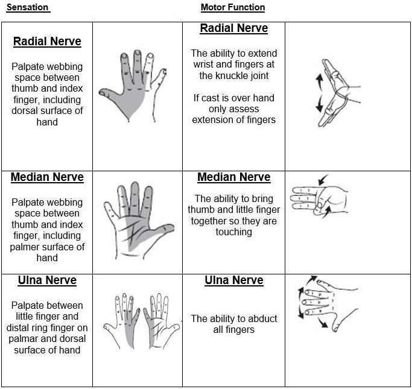

# 2008 

## Tentti 

Vuoden 2009 kysymyksiä ei wikissä ole. Vuoden 2009 tentistä jo käytyjä aiheita ovat "Aivoinfarktin sekundaaripreventio", "Tajunnanmenetyskohtauksen saaneen potilaan anamneesi" ja sarjoittaisen päänsräyn hoito/estohoito. 

### Glioblastooma multiforme

  <button class="solution-button"
          data-label="Vastaus"
          data-hide-label="Piilota vastaus">
    Vastaus
  </button>
  

Suurin osa aikuisten maligneista primaareista aivokasvaimista ovat histologiselta päätyypiltään glioomia ja yleisin aivojen gliooman päätyyppi on astrosytooma. Astrosytoomat voidaan jakaa molekyyligeneettisesti IDH-mutantteihin ja IDH-wildtype (IDH-mutatoitumattomat) astrosytoomiin

IDH-wildtype astrosytoomat viittaavat glioblastoomiin (primaarinen glioblastoma multiforme, pGBM), jotka ovat aikuisten yleisin ja samalla aggressiivisin aivokasvaintyyppi. Sekundaarinen glioblastoma multiforme tarkoittaa gradus IV:n IDH-mutantti-astrosytoomaa ja se on harvinaisempi ja ennusteeltaan parempi kuin villityyppi-astrosytooma. pGBM:n ennuste on huono. Hoidonkin kanssa keskimääräinen selviytymisaika on n. 15kk (uusimmissa tutkimuksissa yli 25 % potilasta elää yli 2 vuotta; sekundaarisen mediaani-ennuste on n. 3 vuotta). Sekundaarista ja primaarista glioblastoomaa ei voi erottaa histologisesti, mutta molekyyligenetiikka auttaa (IDH-mutaatiot). 

---

Epileptiset kohtaukset, paikallinen neurologinen puutos ja kognitiiviset häiriöt ovat tavallisia oireita. Yleisestikin siis aivotuumorien yleisimpiä oireita ovat epileptiset kohtaukset fokaalioireet ja kohonneen kallonsisäisen paineen oireet (päänsräky, pahoinvointi ja oksentelu aamupainotteisesti, kognitiiviset oireet, hidastuminen, uneliaisuus, staasipapilla, näön heikentyminen).

---

Glioblastooma ilmenee tyypillisesti kookkaana, rengasmaisesti latautuvana kasvaimena varjoainetehosteisessa MRI-kuvassa. Ilmi tullessaan astrosytooma on usein jo tunkeutunut syvälle valkeaan aineeseen ja voi ulottua corpus callosumin kautta vastakkaiseen isoaivohemisfääriin (tämä näkyisi ns. butterfly-glioblastoomana). 

---

Aivokasvainten aiheuttaman turvotuksen/massavaikutuksen hoidossa tärkeää on deksametasoni (alku 5–10 mg; usein 4–8 mg/vrk leikkaukseen asti). Glukokortikoidi vähentää vasogeenista aivoödeemaa, lievittää oireita ja alentaa kallonsisäistä painetta. Usein jatketaan maligneissa tuumoreissa leikkauksen ja sädehoidon jälkeenkin.

Jos kasvain sijaitsee niin, että sitä voidaan leikata, näin yleensä tehdään. Tavanomaisesti kasvaimesta poistetaan niin paljon kuin on mahdollista ilman että aiheutetaan liikaa oireita. Mikäli kasvain sijaitsee hyvin hankalasti tai potilas on huonokuntoinen, voidaan joutua tyytymään pelkkään koepalaan.

Hoitoon liittyy lisäksi sädehoito ja solunsalpaajahoidot. Mikäli potilas on iäkkäämpi tai/ja huonokuntoisempi tyydytään usein lyhempään sädehoitoon ja joissakin tilanteissa annetaan pelkästään solusalpaajia, varsinkin, jos kasvaimessa on MGMT mutaatio eli se on herkempi solusalpaajille. Yleisimmin käytetty solusalpaaja on temotsolamidi. 

Uusintakasvaimen hoidot vaihtelevat suuresti. Usein hyväkuntoiset potilaat leikataan uudelleen, lisäsäde­hoitoja annetaan tai solusalpaajat aloitetaan uudestaan. Lisäksi on kokeellisia hoitoja.
  

### Traumaattinen aksonivaurio

  <button class="solution-button"
          data-label="Vastaus"
          data-hide-label="Piilota vastaus">
    Vastaus
  </button>
  

Aivojen aksonivauriosta käytetään yleisesti nimeä diffuusi aksonivaurio (diffuse axonal injury, DAI), vaikka usein vaurio ei ole diffuusi, vaan pikemminkin multifokaalinen. Toisinaan traumaattinen aksonivaurio (traumatic axonal injury, TAI) on terminä kuvaavampi, kun vaurio on paikallinen. Määritelmällisesti DAI:ssa valkean aineen diffuusiomuutoksia, pistemäisiä verenpurkaumia, turvotusta tai veriaivoesteen vaurio on todettavissa yli kolmessa lokalisaatiossa, kun taas TAI:ssa vastaavat vammamuutokset rajoittuvat 1 - 3 lokalisaatioon. 

Aksonivaurio syntyy aksonien venyttymisestä aivoalueiden erisuuntaisissa liikkeissä. Tyyppiesimerkki on liikenneonnettomuus. 

Diffuusi aksonivaurio aiheuttaa usein tajuttomuutta, joka voi olla hyvinkin pitkäkestoista. Lievemmät DAI:t voivat kestää tajuttomuudeltaan yleensä alle 2 viikkoa, vaikeammissa tapauksissa kuukausia tai heräämistä ei koskaan tapahtu. DAI-muutoksia nähdään useimmiten aivojen syvissä rakenteissa, aivorungossa ja aivokurkiaisessa, sekä aivopuoliskojen harmaan ja valkean aineen rajapinnalla. Aivojen syvät rakenteet ovat elintärkeitä muun muassa hengityksen, vireystilan ja tajunnantason säätelyssä, ja näille alueille syntyneet vauriot johtavat usein syvään tajuttomuuteen ja vaikeaan vammautumiseen.

TT:ssä voidaan joskus nähdä pieniä verenpurkaumia, mutta radiologisesti ei varhaisessa vaiheessa muuten välttämättä näy mitään. MRI on parempi kuvantaminen. Diffuusi hermosoluyhteyksien vaurio voi jatkua jopa kuukausia vamman jälkeen biokemiallisten mekanismien kautta (arpeutumista, atrofiaa...). Pistemäiset verenpurkaumat eli mikrohemorragiat ovat epäsuora viite aksonivauriosta, sillä ne edustavat todellisuudessa aksoneita ympäröivien pienten verisuonihaarojen ja veri-aivoesteen vuotoa. Mikrohemorragiat voidaan todeta melko luotettavasti MK:n magnetoituvuuskuvaussekvenssillä (susceptibility weighted imaging, SWI). Lievänkin aivovamman saaneista potilaista 6 - 28 %:lla on nähtävissä DAI-muutoksia MK:ssa. MK otetaan, jos pään TT on normaali ja aivovammaan kuuluu usean minuutin tajuttomuus tai usean tunnin PTA. Otetaan myös rutiinisti, jos kyseessä on suurienergiainen onnettomuus tai pään TT ei selitä oirekuvaa. Parhaan diagnostisen arvon omaavan MK:n ajankohta on myös edelleen epäselvä. Kansainvälisiä näyttöön perustuvia suosituksia ei ole. Asiantuntijakonsensukseen perustuen Käypä hoito -suosituksessa suositellaan MK:ta 2 - 3 viikon aikana vammasta

Tällä hetkellä TAI-potilaiden hoito keskittyy sekundääristen vaurioiden (esimerkiksi aivoödeema, kallonsisäisen paineen laskeminen) ehkäisemiseen sekä kuntoutukseen, sillä täydellisesti parantavaa hoitoa ei ole. Magneettikuvissa nähtävät muutokset saattavat myös korjautua ajan kuluessa, ja kuukauden kuluttua vammasta pienimpiä verenvuotoja ei välttämättä enää nähdä. Sitä ei kuitenkaan tiedetä, korjaantuvatko itse aivosoluvauriot vai tapahtuuko aivoissa muovautumista ja muut aivosolut ottavat vaurioituneiden alueiden tehtäviä hoitaakseen. TAI:sta ei voi parantua täysin, mutta sen tuomia oireita, jotka ovat yleensä psyykkisiä ja neurologisia, voidaan helpottaa lääkityksellä ja säännöllisellä terapialla. Kuntouttaminen onkin isossa roolissa aivovammapotilaiden kohdalla ja se edistää toipumista, jolloin potilaiden arjessa pärjääminen helpottuu

  

### Yläraajan tavallisimmat mononeuropatiat, oireet ja kliininen kuva lyhyesti

  <button class="solution-button"
          data-label="Vastaus"
          data-hide-label="Piilota vastaus">
    Vastaus
  </button>
  

Yläraajan mononeuropatiat johtuvat tyypillisesti hermon puristustilasta (pinne) anatomisesti ahtaassa kohdassa. Yleisimmin affisioituneet hermot ovat plexus brachialiksen ääreishermot ja erityisesti siis n. medianus, n. ulnaris ja n. radialis. Diagnostisissa selvittelyissä statuksen ja anamneesin lisäksi yleensä ENMG on ensisijainen tutkimus.

---

Yleisin mononeuropatia koko ihmiskehossa on **rannekanavaoireyhtymä** eli n. medianuksen pinnetila canalis carpin alueella flexor retinaculumin ja ranneluiden välissä. Tyypillinen oirekuva on peukalon, etusormen, keskisormen ja nimettömän (n. medianuksen alue) puutuminen, kihelmöinti, tuntohäiriöt ja kipu (tosin kipu ei ole päällimmäinen oire lievässä rannekanavaoireyhtymässä. Jos tärkein oire on kipu -> ota ranteen rtg (nivelrikkoa mahdollisesti)). Puutuminen usein herättää yöllä ja tunteita helpottaa käden ravistaminen. Vaikeassa taudissa hermopinne aiheuttaa thenar-lihasten atrofiaa ja peukalon loitonnus- sekä oppositiovoima heikentyy. 

Tunnetuimpia statuskokeita ovat Tinelin ja Phalenin kokeet. Tinelin kokeessa koputetaan kevyesti keskihermoa sormenpäällä tai refleksivasaralla rannekanavan alueelta. Positiivinen löydös on, jos potilas tuntee sähköiskumaiset tuntemukset keskihermon hermottamalla ihoalueella. Phalenin kokeessa taas potilas painaa ranteitaan 90° fleksiossa kämmenselät vastakkain 20–60 sekuntia. Positiivinen löydös on, jos potilas kokee pistelyä tai puutumista keskihermon hermottamalla ihoalueella.

Rannekanavaoireyhtymän ensisijainen hoito on yleensä konservatiivinen (tarrakiinnitteinen rannelasta yökäyttöön, työergonomia, käytön vähentäminen, omatoimiset fysioterapeuttiset harjoitteet). Potilaille, joiden rannekanavanoireyhtymän oireet ovat voimakkaita, eli erityisesti todetaan peukalovoimien heikkenemistä ja/tai lihasatrofiaa tai medianusalueen pysyvää tunnottomuutta, voidaan suositella leikkausta ensisijaiseksi hoidoksi (leikkaushoitoa voidaan miettiä lievemmässä tapauksessa jos konservatiivinen hoito ei auta). Injektiohoitoa (kortisoli-injektio) voidaan kokeilla ennen leikkaushoitoa.

*Ylemmässä n. medianus -varuiossa (esim. kyynärpään alueella), voi ilmentyä ns. hand of benediction -virheasento kädessä, kun sitä yrittää sulkea nyrkiksi (1., 2. ja 3. sormen fleksio ei onnistu ja ne pysyvät ekstensiossa). Tätä ei näy karpaalikanavaoireyhtymässä, koska se ei affisioi käsivarren lihaksia. 

---

Kyynärhermon (n. ulnaris) pinne on toiseksi yleisin ja puristuu useimmiten kyynärpäässä (sulcus n. ulnaris tai cubital tunnel); mahdollisesti voi myös olla pinne ranteen tasolla (Guyonin kanavan oireyhtymä). Oireena on pikkusormen ja nimettömän ulkosivun puutuminen ja pistely; kyynärpäähän nojailu tai pitkäaikainen koukistus pahentaa oireita. Voi aiheuttaa interosseus-lihasten atrofiaa sekä myös adductor pollicis -lihaksen heikkoutta (tämän klassinen testi on ns. Fromentin merkki, jossa potilaan peukalon IP-nivel koukistuu, kun hän yrittää puristaa paperia peukalon ja etusormen väliin). Voi myös kehittyä ns. "ulnar claw", jossa nähdään 4. ja 5. sormien koukkuuntumista (MCP-hyperekstensiota ja IP-nivelten fleksiota). 

Jos ENMG:ssä todetaan selkeä vaurio tai lihasatrofia etenee, niin voidaan tehdä hermon vapautusleikkaus. 

---

N. radialiksen pinne tapahtuu useimmiten olkavarren tasolla ja klassinen syntytapa on nukkuminen humalassa käsivarsi sängyn/tuolin reunan yli roikkuen (”Saturday night palsy”) -> radialis painautuu humerukseen. 

Aamulla herätessä ranne roikkuu (wrist drop): ranteen ja sormien ojennus heikentynyt tai puuttuu. Tuntohäiriö ”nuuskakuopassa”/ kädenselässä peukalon puolella. 

Suurin osa on tilapäisiä (paineen aiheuttamia neurapraksioita) ja paranevat itsestään viikoissa tai kuukausissa. Rannelastaa tarvitaan toimintakyvyn säilyttämiseksi odotusvaiheessa. Fysioterapia estää nivelten jäykistymistä.

  

