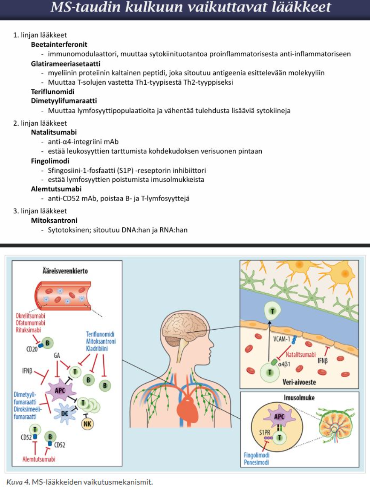
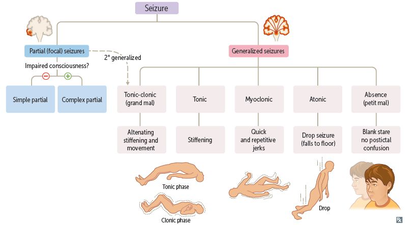
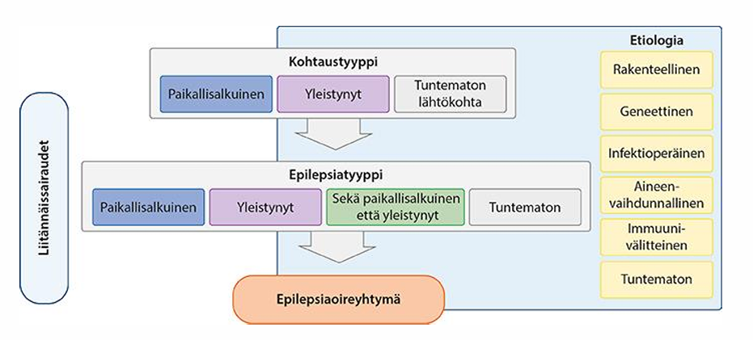
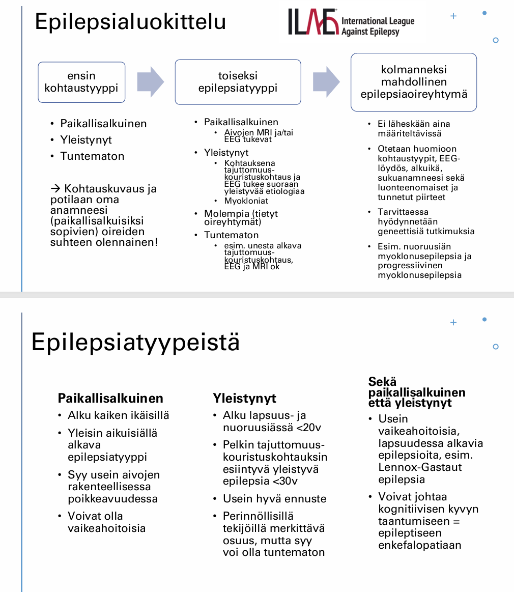
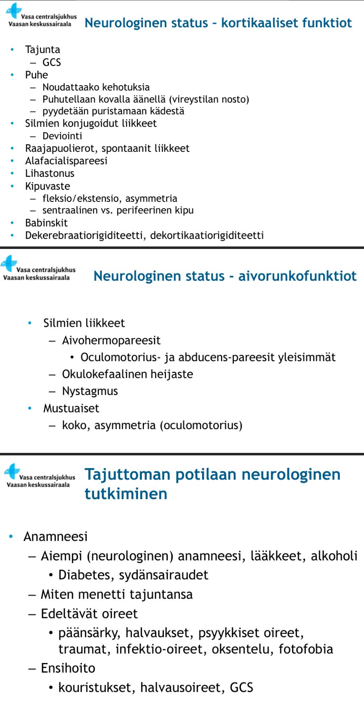
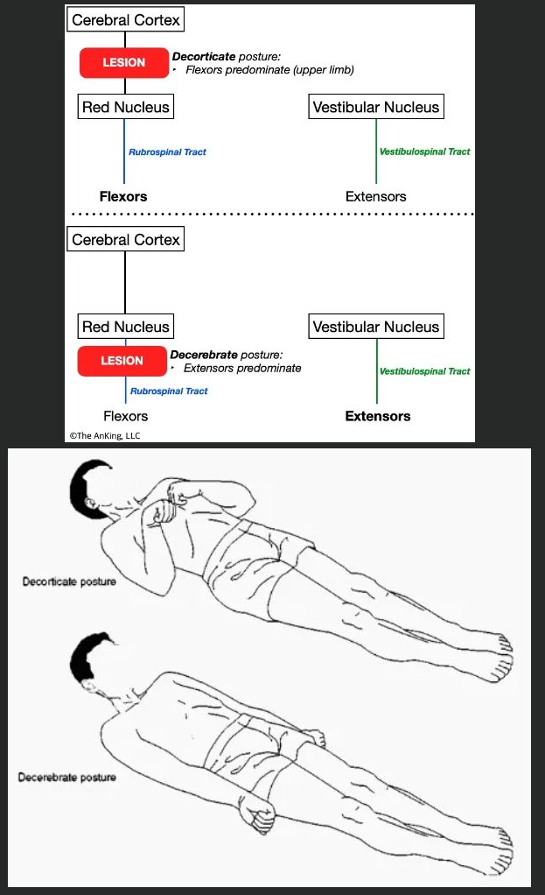
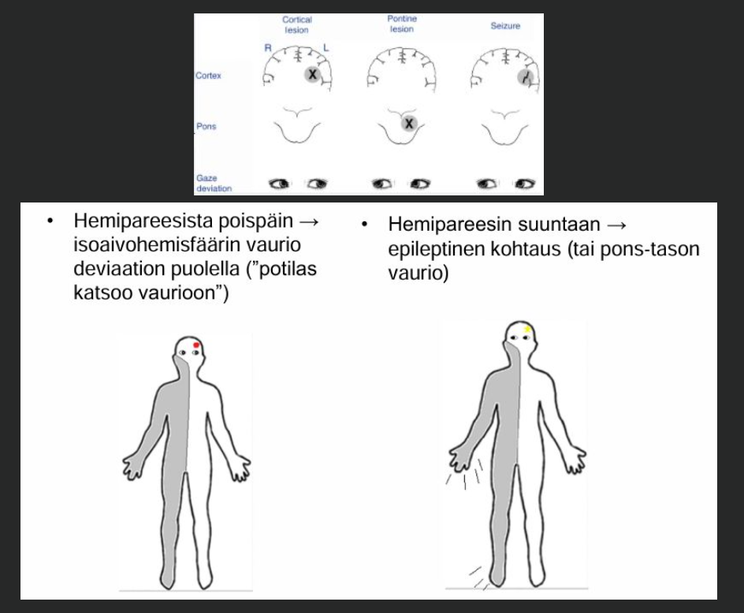

# Joltain vuodelta 

## Tentti 

Wikissä ei annettu tentin vuotta - vain mainittu sen olevan joltain vuodelta. Kysymyksistä käyty jo läpi "Aivoinfarktin sekundaaripreventio", "Milloin lähetän päänsärkypt:aan päivystyksenä neurologisiin jatkotutkimuksiin ja miksi?" (ainakin käytännössä käyty läpi päänsäryn punaisen lipun oireiden (S2NOOP4 tai SNNOOP10) yhteydessä) ja "Polyneuropatian tavallisimmat etiologiset tekijät". 

### MS-taudin lääkehoito

  <button class="solution-button"
          data-label="Vastaus"
          data-hide-label="Piilota vastaus">
    Vastaus
  </button>
  

Pahenemisvaiheet voidaan hoitaa iv (osalla myös po) metyyliprednisolonilla, jos pahenemisvaiheesta on toiminnallista haittaa eli se heikentää potilaan liikunta-, toiminta- tai näkökykyä (optikusneuriitti). Mahdollinen bakteeri-infektio poissuljetaan tai hoidetaan ennen glukokortikoidihoitoa (komplisoitumattomat virtsatietulehdukset voidaan hoitaa mikrobilääkkeellä samanaikaisesti glukokortikoidihoidon kanssa). Kortisonihoito yleensä kestää 3 vuorokautta; lisäksi annetaan H2-salpaaja ulkus-profylaksiaksi. Hoidon tarkoitus on nopeuttaa toipumisprosessia. Pitemmällä tähtäimellä relapsin lääkehoito ei vaikuttane toipumisen lopputulokseen tai sairauden etenemiseen. Niinpä hoito on syytä rajata tapauksiin, joihin liittyy selkeä toiminnallinen haitta. Lievemmätkin oireet voidaan hoitaa, elleivät ne ala korjautua itsestään. Vaikeissa tapauksissa voidaan käyttää plasmafereesia, jos kortisonista ei ole apua. 

---

MS-taudille ei ole parantavaa hoitoa, vaikka nykyään kyllä on taudinkulkuun vaikuttavia lääkkeitä paljon; ne eivät kuitenkaan paranna tautia, vaan estävät uusia vaurioita syntymästä (estävät pahenemisvaiheita ja tasaista toimintakyvyn alenemista). Taudinkulkua modifioivat vaikuttavat pääasiassa keskushermoston ulkopuolella, sillä veri-aivoeste estää useimpien MS-lääkemolekyylien merkittävän pääsyn keskushermostoon. Immunologisten lääkehoitojen vaikutusmekanismit liittyvät lymfosyyttien toimintaan. Nykyiset MS-lääkkeet estävät fokaali-inflammaatiota ja relapseja ja vaikuttavat parhaiten taudin alkuvaiheessa. Myöhemmissä vaiheissa (esim. sekundaarisessa progressiivisessa) on kuitenkin tarve lääkkeille, jotka penetroituvat keskushermostoon ja targetoivat siellä meneillään olevia patogeneettisiä mekanismeja –esim mikroglia (nämä lääkitykset ovat nykyään kehityksessä).

MS-taudin 1. linjan lääkkeitä (aloitetaan, jos ei ole erityisen aggressiivinen) ovat 

<li>beetainterferoni (injektiona i.m. tai s.c.)</li>
<li>glatirameeriasetaatti (Copaxone; s.c.)</li>
<li>teriflunomidi (Aubagio; p.o)</li>
<li>dimetyylifumaraatti (Tecfidera; p.o)</li>
<li>Toisen linjan lääkkeitä ovat mm. natalitsumabi, fingolimodi ja alemtutsumabi. </li>
<li>Kolmannen linjan lääkkeisiin kuuluu mm. mitoksantroni ja atsatiopriini; näitä solunsalpaajia käytetään erityistapauksissa </li>
<li>D-vitamiinilisä on yleensä suositeltua MS-taudin hoidossa ja myös mahdollisesti estossa; pieni seerumin D-vitamiinipitoisuus on ollut yhteydessä suurentuneeseen pahenemisvaiheiden riskiin</li>

---

Potilaat ovat yleensä erikoissairaanhoidon piirissä niin kauan kuin saavat aktiivista immunologista hoitoa. Kun tauti etenee sekundaarisesti etenevään (SPMS) vaiheeseen eikä enää immunologista hoitoa ole tarjolla (perinteiset immunomoduloivat lääkkeet tehoavat yleensä huonosti tähän vaiheeseen, koska prosessi on kompartmentalisoidumpi kuin rappeuttava kuin systeemisesti tulehduksellinen), siirtyminen PTH:n piiriin (oireenmukainen hoito, kuntoutussuunitelmat ja muut etuisuusasiat). Jos pahenemisvaiheita vielä esiintyy toissijaisesti etenevänkin vaiheen aikana, niin immunologista lääkehoitoa voidaan vielä käyttää.

---

MS-taudissa myös oireenmukainen lääkitys on usein aiheellista

<li>Spastisuus on yleinen oire ja sen oireenmukaisena lääkityksenä toimii ensisijaisesti baklofeeni tai titsanidiini; spastisuus ei tosin ole aina haitallista, vaan se saattaa ratkaisevasti tukea lihasvoimiltaan heikkoa alaraajaa ja helpottaa liikkumista</li>
<li>Uupumus (fatiikki) on tavallisimpia MS-tautiin liittyviä oireita, ja osalla se on keskeisimpiä ongelmia työkyvyn ja arjen hallinnan kannalta. Lääkkeistä amantadiini ensisijainen (myös jotkut masennuslääkkeet, kuten bupropioni). Uupumuksen hoidossa on oleellista tunnistaa ja eliminoida kaikki tilannetta vaikeuttavat seikat, erityisesti unen määrää ja laatua heikentävät tekijät. </li>
<li>Yliaktiivisen virtsarakon hoitoon ensisijaisesti antikolinergit tai mirabegroni</li>
<li>Kävelyä vahvistava lääke voi olla mm. 3,4-diaminopyridiini (erityislupavalmiste); toimii hermojohtumisen vahvistamisen kautta</li>
<li>Ummetusta hoidetaan mm. pyridostigmiinilla tai laksatiiveilla tai metoklopramidilla</li>

  

### Epileptisten kohtausten luokitus

  <button class="solution-button"
          data-label="Vastaus"
          data-hide-label="Piilota vastaus">
    Vastaus
  </button>
  

Epilepsioiden luokittelu on portaittainen prosessi, jossa ensin määritetään kohtaustyyppi, sen jälkeen epilepsiatyyppi ja sitten mahdollinen epilepsiaoireyhtymä (epilepsiaoireyhtymä on kokonaisuus, jonka muodostavat epilepsiaan liittyvät oireet (esim. kohtaustyyppi), kohtausten alkamisikä ja tutkimuslöydökset (esim. EEG-löydös)). Eli aluksi arvioidaan kohtauskuvauksen perusteella kohtaustyyppi, sitten jatkoselvittelyiden (esim. MRI, EEG) tai uusien kohtausten perusteella saadaan mahdollisesti epilepsia tarkemmin diagnosoitua ja aikaisempien tutkimusten ja myös mahdollisesti mm. alkamisikä, laukaisevat tekijät, sukuanamneesi yms. huomioiden asetettua tietty epilepsiaoireyhtymä diagnoosiksi. 

Epilepsiadiagnoosi edellyttää, että potilaalla ollut ilman merkittäviä altistavia tekijöitä joko:

<li>Vähintään kaksi epileptistä kohtausta ja niiden välillä on kulunut yli 24h</li>
<li>Yksi epileptinen kohtaus, jos aivoissa todetaan pitkäaikainen kohtauksille altistava rakenteellinen syy, jonka vuoksi kohtausten uusimisriski on yli 60% seur. 10v aikana (esim. aiempi AVH, aivovamma, hippocampussleroosi) tai</li>
<li>Oireiden ja tutkimuslöydösten perusteella todetaan erityinen epilepsiaoireyhtymä kuten nuoruusiän myoklonusepilepsia</li>

---

Yksittäinen kohtaus luokitellaan karkeasti tyypiltään paikallisalkuiseksi tai yleistyneeksi. Tässä selvittelyssä kohtauskuvaus ja anamneesi olennainen. Paikallisalkuisuudella tarkoitetaan epileptisen purkaushäiriön alkamista rajallisella alueella toisessa aivopuoliskossa. Aivosähkötoiminnan häiriö voi pysyä rajoittuneena tai levitä molempiin aivopuoliskoihin, jolloin kohtaus yleistyy. Yleistyneissä (joskus sanotaan "suoraan yleistyneissä") kohtauksissa aivosähkötoiminta häiriintyy äkillisesti ja yhtäaikaisesti molemmissa isoaivopuoliskoissa. Tällöin kohtauksen kliiniset piirteet ja EEG-löydökset ilmenevät molempien aivopuoliskojen tai niiden osien yhtäaikaisena aktivoitumisena. Epileptisistä kohtauksista ei aina ole riittävästi tietoa, jonka perusteella ne voitaisiin luokitella paikallisalkuisiksi tai yleistyneiksi, ja ne ovat luokitukseltaan tuntemattomia kohtauksia.

Kohtaustyyppien yleisyys vaihtelee iän mukaan. Pääosa yleistyneistä epilepsiaoireyhtymistä alkaa lapsuus- tai nuoruusiässä; fokaalisia kohtauksia kyllä myös tapahtuu. Aikuisuudessa ja varsinkin vanhuksilla epilepsia on yleensä paikallisalkuista; voi ajatella, että koska suuri osa varsinkin vanhusten epilepsioista johtuu hankituista syistä (pääasiassa AVH:t), niin epileptiset kohtaukset ovat näiden vaurioiden taustalta paikallisalkuisia. 

---

Yleistyneet epileptiset kohtaukset voidaan kohtauspiirteiden ja EEG:n perusteella jakaa pääasiassa toonis-kloonisiin (ja tietysti vain toonisiin ja vain kloonisiin), myokloonisiin, atonisiin ja poissaolokohtauksiin. 

Jos ajattelee stereotyyppistä epileptistä kohtausta, niin todennäköisesti ajattelee toonis-kloonista kohtausta, joka tunnetaan myös nimillä tajuttomuus-kouristuskohtaus ja vanhemmalta nimeltään grand mal -kohtauksena; myös paikallisalkuinen kohtaus voi edetä tajuttomuus-kouristuskohtaukseksi. Tyypillistä sille on äkillinen tajunnan menetys, jonka lisäksi todetaan vaiheittain vartalon jäykistyminen (tooninen vaihe) ja nykivät kouristukset (klooninen vaihe); kouristukset ovat symmetrisiä

Myokloninen kohtaus viittaa epileptiseen kohtaukseen, jolle on tyypillistä äkilliset, yleensä yläraajojen / kaulan lihaksissa ilmenevät nykäykset. Yksittäinen nykäys on todella lyhytkestoinen (sekunnin murto-osan), mutta nykäykset voivat tapahtua ryppäissä. Henkilö on useimmiten hereillä ja tietoinen ympäristöstään. Liittyvät yleisimmin nuoruusiän myoklonusepilepsiaan (JME) tai progressiiviseen myoklonusepilepsiaan (PME). 

Atoninen kohtaus on äkillinen, sekunteja kestävä lihasjänteyden menetys, joka johtaa usein varoittamatta kaatumiseen (ns. "drop attack") tai pään nyökkäämiseen. Tajunta menetetään. 

Poissaolokohtaukset (abscence seizures, petit mal) ovat lyhyitä 4–20 sekuntia kestäviä poissaolokohtauksia, joissa henkilön toiminta katkeaa yhtäkkisesti ja palaa samalla tavalla yhtäkkisesti. Kohtauksen aikana henkilö tuijottaa tyhjyyteen muutaman sekunnin ajan; kohtauksiin voi liittyä silmien räpsymistä tai kiertymistä ylöspäin. Henkilö ei muista poissaolokohtauksen aikaisia tapahtumia, mutta sitä edeltävät ja välittömästi sen jälkeiset tapahtumat hän muistaa. Merkittävää post-iktaalista tilaa ei siis ole. Tyypillistä lapsuudessa (alkaa yleisimmin 5-7 –vuotiaana tai teini-iässä).

---

Paikallisalkuiset kohtaukset voidaan jakaa sen mukaan, ilmeneekö niissä tajunnan hämärtymistä (complex partial) vai säilyykö tajunta niissä täysin (simple partial). Paikallisalkuisiin kohtauksiin liittyy usein auraoireita (esim. psyykkiset oireet tai aistioireet), joka on itse asiassa pieni paikallisalkuinen kohtaus.  

Yksinkertaisessa paikallisalkuisessa kohtauksessa potilas kokee kohtauksen subjektiivisena tuntemuksena ja/tai hänellä voi esiintyä ulkopuolisenkin havaitsema oire, mutta hän säilyttää täysin tajuntansa ja muistaa kohtauksen aikaiset tapahtumat. Yksinkertaisen paikallisalkuisen kohtauksen oireet riippuvat täysin siitä, missä kohdassa aivoja purkaushäiriö sijaitsee. 

Monimuotoiselle paikallisalkuiselle kohtaukselle on ominaista tajunnan osittainen hämärtyminen. Kohtauksen luonne riippuu epilepsiapesäkkeen paikasta, ja kohtaus kestää muutamia kymmeniä sekunteja tai minuutteja. Potilas ei vastaa tai reagoi mielekkäästi kysymyksiin eikä muihin ulkoisiin ärsykkeisiin eikä muista kohtauksen aikaisia tapahtumia. Motorinen oire voi olla esim. raajakouristelu, katseen tai pään asentoon liittyvä oire tai automatismi kuten esim. suupielten lipomista tai kuljeskelu. Tajunta palaa usein asteittain, ja potilaalla on myös jälkioireita, kuten sekavuutta.

---

  

### Tajuttoman potilaan neurologinen tutkimus

Auskultoidaan sydän ja keuhkot, palpoidaan vatsa. Arvioidaan GCS. Mahdollisen katsedeviaation suuntaa voi myös arvioida raottamalla silmiä. Samalla voi katsoa pupillien koot. Anisokoria viittaisi aivorunkovaurioon. Neurologisessa statuksessa yleisesti etsitään epäsymmetrisyyttä. Meningismuksen arviointi päätä taivuttamalla. Etsitään vamman merkkejä. Arvioidaan, onko iholla petekkioita (esim. meningokokkisepsis) ja minkä värinen se on. 

  <button class="solution-button"
          data-label="Vastaus"
          data-hide-label="Piilota vastaus">
    Vastaus
  </button>
  

Potilaan saavuttua arvioidaan uudelleen ABCDE, vitaalit, tarvittaessa intuboidaan yms. Potilas on syytä pitää kytkettynä EKG:n, verenpaineen ja pulssin rekisteröivään monitoriin sekä oksimetriin ja hänen kehonlämpöään tulee seurata. Tämän jälkeen voidaan turvallisesti keskittyä tasodiagnoosiin, millä tarkoitetaan ennen kaikkea sen tutkimista, onko tajuttomuuden taustalla aivosairaus vai systeeminen syy (VOI IHME! apuna). Etenkin välitöntä spesifistä hoitoa vaativat sairaudet kuten meningiitti, status epilepticus, intoksikaatiot, hypoglykemia, elektrolyyttihäiriö, epiduraali- tai subduraalihematooma ja basilaaritromboosi pyritään joko diagnosoimaan tai sulkemaan pois välittömästi. Sairaankuljettajilta tiedustellaan oireita ja mahdollisia tilan muutoksia kuljetuksen aikana. Jotta sairausanamneesia ja potilaan terveystietoja voidaan tarvittaessa täydentää, potilaan saattajia tai omaisia ei päästetä lähtemään ennen puhelinyhteystietojen saantia.

Yleisstatuksessa havainnoidaan yleistila, pää, niska, kieli, iho, kehon lämpötila, hengityksen haju, hengitystyyppi, sydämen ja verenkierron tila (verenpaine, syke, happisaturaatio), keuhkoauskultaatio, vatsa, raajat yms. Etsitään merkkejä traumasta (myös suun sisältä), infektiosta, niskajäykkyydestä, hyper- tai hypotensiosta, kroonisesta sairaudesta (maligniteetti, keuhkot, maksa, munuaiset, sydänsairaus, immuunipuutos), myrkytyksestä (mm. pistosjäljet).

---

Neurologinen status pyrkii paikallistamaan tai sulkemaan pois tajuttomuuteen johtaneen aivovaurion. 

<li>Tajunnantaso</li>
  <ul>
    <li>Arvioidaan GCS:n perusteella (silmien avaamisen vaste, motorinen vaste ja puhevaste)</li>
  </ul>
<li>Kallonsisäinen paine ja meningeaaliset oireet</li>
  <ul>
    <li>Näköhermon nystyn turvotus (staasipapilli) ja sen reunan epäselvyys, puuttuva laskimopulsaatio tai verenvuodot verkkokalvolla kertovat kohonneesta kallonsisäisestä paineesta esimerkiksi subaraknoidaalivuodon, aivoverenvuodon tai meningiitin seurauksena</li>
    <li>Kallonsisäisen paineen kohoamiseen voivat viitata myös puristustilalle alttiit III ja VI aivohermojen kompressiosta johtuvat oireet kuten mustuaisdilataatio ja valoreaktion puuttuminen (okulomotorius) ja abdukenspareesi(t) (ns. false localizing signs)</li>
    <li>Aivokalvojen ärsytys (inflammaatio) aiheuttaa subaraknoidaalivuotoon tai meningiittiin liittyvän niskajäykkyyden, joka on syytä tutkia huolellisesti</li>
  </ul>
<li>Aivorunkostatus</li>
  <ul>
    <li>Tajuttomaltakin voidaan aina tutkia aivorunkoheijasteet, joita ovat mustuaismotoriikka, korneaheijaste (luomiräpäys kosketettaessa korneaa pumpulilla), okulokefaalinen heijaste (kierretään päätä nopeasti sivusuunnassa kummallekin puolelle; normaalisti katseakseli siirtyy liikettä vastaan; Nukensilmäheijaste: katse kääntyykin pään liikkeen mukana = aivorunkovamman merkki), okulovestibulaarinen heijaste (silmävärve kun ruiskutetaan korvakäytäviin jäävettä), vagaalinen heijaste (silmämunien hieronta, karotisbifurkaation hieronta seuraten vastetta hemodynamiikkaan) sekä reaktio nielun ja trakean ärsytykseen (nieluheijaste, laryngotrakeaalinen heijaste reaktiona imuun tai intubaatioputken heiluttamiseen). Epäiltäessä kaularankamurtumaa okulokefaalista heijastetta ei pidä tutkia!</li>
    <li>Pääsääntönä voidaan pitää, että jos aivorunkoheijasteet ovat tallella, tajuttomuus ei ole primaarisesti aivorunkovauriosta johtuva. Toisaalta aivorunkotoimintojen puuttuminen voi ilmetä ilman aivorunkovauriotakin, esim. intoksikaation seurauksena.</li>
  </ul>
<li>Motoriikan tutkimus</li>
  <ul>
    <li>Motoristen ja sensoristen toimintojen tutkimuksen avulla pyritään selvittämään, onko potilaalla puolieroja, jotka voisivat viitata fokaaliseen aivomuutokseen. Sitä varten on tärkeää rekisteröidä spontaanit liikkeet, lihastonus, jänneheijasteet ja kipureaktiot. Myös toispuoliset epileptiformiset kouristelut voivat viitata paikalliseen aivomuutokseen. Aina tutkitaan myös Babinskin merkki, joka mittaa pyramidiradan integriteettiä.</li>
    <li>Ylemmän motoneuronin vauriossa halvaantunut puoli on alkuvaiheessa aina veltto ja spastisuus kehittyy vasta useiden päivien kuluttua. Toispuolinen spastisuus vastikään tajuttomaksi menneellä potilaalla onkin useimmiten merkki aiemmin sairastetusta aivosairaudesta.</li>
    <li>Aivovaurion tason mukaan tajuttoman potilaan asento ja lihastonus (ns. posturaatio) voivat olla tyypillisiä. Isoaivojen syvissä tai talamuksen vauriossa yläraajat ovat koukistuneina, adduktiossa ja sisärotaatiossa ja alaraajat ojentuneina (dekortikaatioasento). Aivorungon vauriossa (tyypillisesti väliaivojen ja ponsin välillä) yläraajat ovat ojentuneina adduktiossa ja sisärotaatiossa, alaraajat ovat ojentuneina (dekerebraatioasento). Tällöin voi olla kyse voimakkaasti tilaaottavasta supratentoriaalisesta prosessista, joka etenee kohti aivojen transtentoriaalista herniaatiota.</li>
  </ul>
<li>Sensoriikan tutkimus</li>
  <ul>
    <li>Mietojen tuntostimulusten kuten kosketuksen ja värinän tutkiminen ei luonnollisesti ole mahdollista yhteistyökyvyn puuttuessa. Aivorungon kosketustuntoa välittäviä sensorisia ratoja voidaan tosin mitata korneaheijasteen avulla. Kipuaistimuksen aiheuttama liikevaste arvioidaan raajoista esim. kynsiä puristamalla tai kasvoista painamalla tylpästi supraorbitaaliselta alueelta.</li>
  </ul>
<li>Neuro-oftalmologia</li>
  <ul>
    <li>Kaikilta tajuttomilta potilailta tutkitaan mustuaisreaktiot, rekisteröidään mustuaisten koko, muoto ja symmetria (isokoria) sekä tarkastetaan, onko katse konjugoitu ja onko se kääntyneenä neutraaliasennosta pois (konjugoitu tai dyskonjugoitu katsedeviaatio).</li>
    <li>Katsedeviaatio antaa merkittävää informaatiota vaurion paikasta. Pääsääntöisesti konjugoitu katsedeviaatio hemipareesin vastakkaiselle puolelle viittaa isoaivohemisfäärin vaurioon deviaation puolella ("potilas katsoo vaurioon"). Koska okulomotorinen dekussaatio sijaitsee ponsin ja mesenkefalonin rajalla ja pyramidiratojen dekussaatio alempana, ydinjatkeessa, konjugoitu katsedeviaatio hemipareesin puolelle viittaa pons-tason vaurioon (tai epileptiseen kohtaukseen) deviaation vastakkaisella puolella ("potilas katsoo pois vauriosta"). </li>
    <li>Normaalisti reagoivat mustuaiset osoittavat, että keskiaivot (okulomotoriustumake) ovat toimintakunnossa. Pienet (1 mm) valoon reagoivat, isokooriset mustuaiset voivat johtua, paitsi kolinergisesta lääkityksestä, usein ponsin laajasta vauriosta (infarkti tai vuoto). Halkaisijaltaan kokoon 3–5 mm suurentuneet, valoon reagoimattomat mustuaiset viittaavat vaurioon keskiaivojen tegmentumissa. Sen sijaan laajat isokooriset mustuaiset voivat vihjata kohonneeseen kallonsisäiseen paineeseen. Anisokoria eli mustuaisten epäsymmetrisyys ja unilateraalinen mustuaismotoriikkahäiriö, joskus soikea muoto, yhdistyneenä subtotaaliin okulomotoriuspareesiin dilatoituneen mustuaisen puolella saattaa aiheutua silmän liikehermon puristuksesta esim. toisen isoaivohemisfäärin ekspansion tai transtentoriaalisen herniaation takia. Kyse voi myös olla III aivohermon tumaketasoisesta vauriosta tai aneurysman pullistumisesta. Hornerin oireyhtymä voi viitata vaurioon hypotalamuksen, aivorungon, lateraalisen ydinjatkeen tai a. carotis internaa ympäröivän sympaattisen pleksuksen (dissekaatio tai okkluusio) tasolla.</li>
    <li>Vertikaalinen katsedyskonjugaatio viittaa yleensä CN III:n tai sen tumakkeen tai CN IV:n tai sen tumakkeen pareesiin. Horisontaalinen katsedyskonjugaatio voi viitata tumaketason vaurioon, mutta se voi ilmetä myös tilanteessa, jossa silmälihastonus alenee esim. intoksikaation aiheuttaman uneliaisuuden tai metabolisen enkefalopatian takia. Tämä saattaa korostua, jos potilaalla on entuudestaan karsastusta.</li>
    <li>Tajuttomalla potilaalla esiintyy joskus myös spontaaneja silmäliikkeitä, kuten harhaileva suuntaa vaihtava konjugoitu katse (ns. roving eye movements) tai ping-pong katse (pääosin horisontaaliset, konjugoituneet hitaat liikkeet). Näitä tavataan usein bilateraalisissa hemisfäärivaurioissa, jolloin intakti aivorunko mahdollistaa lateraalisen katseen siirron.</li>
  </ul>

---

Statuksen lisäksi selvittelyyn kuuluu usein pään tietokonetomografia (TT). Näin voidaan todeta merkitsevä kallonsisäisen paineen nousu esimerkiksi kallonsisäisen verenvuodon tai likvorikierron häiriön (hydrokefalus) pohjalta. Mikäli tajuttomuuden syy jää epäselväksi ja neurologinen status sopii primaariseen aivoperäiseen syyhyn, tutkimusta täydennetään magneettikuvauksella (MK). Likvoritutkimus joudutaan usein tekemään erityisesti kallonsisäisen infektion tai tietokonetomografiassa näkymättä jääneen kliinisesti epäillyn SAV:n poissulkemiseksi. Erityisen tärkeää nopea likvoritutkimus on bakteerimeningiittiä epäiltäessä, jolloin hoitopäätös joudutaan tekemään jo ennen kuin mikrobiologiset tulokset ovat käytettävissä. EEG on hyödyksi diagnosoinnissa varsinkin, jos epäillään non-konvulsiivista status epilepticusta. Sen avulla voidaan usein todeta myös kouristuksen jälkitila. 

  

