# MEDigi -minitentit 

MEDigissä (samassa paikassa kuin alkutentti) on oppimisen seurantaa varten minitenttejä eri aihepiireistä. Niiden kysymysten läpikäyminen voi olla hyvää lisäharjoittelua. Tähän koottu kaikki kysymykset kaikista minitenteistä. Kysymyksissä on aina vain yksi oikea vastaus. 

## Aivoverenkiertohäiriöt {#AVH}

### TIA-kohtauksen diagnoosi perustuu tyypillisiin löydöksiin TT-kuvassa

- a. Oikein
- b. Väärin

  <button class="solution-button"
          data-label="Vastaus"
          data-hide-label="Piilota vastaus">
    Vastaus
  </button>
  

b - väärin 

---

TIA-kohtauksen diagnoosi perustuu anamneesiin. Pään TT kuuluu TIA-kohtauksen perusselvittelyihin, mutta iskeemisiä muutoksia ei nähdä.

  

### Aivoinfarktiepäilyssä pään TT kuvataan ainoastaan, mikäli potilas tulee sairaalaan alle 7 h sisällä oireiden alusta

- a. Oikein 
- b. Väärin 

  <button class="solution-button"
          data-label="Vastaus"
          data-hide-label="Piilota vastaus">
    Vastaus
  </button>
  

b - väärin 

---

Pään TT tehdään yleensä kaikille aikaikkunasta huolimatta, sillä poissuljetaan verenvuoto. 
  

### Verkkokalvo-TIA:ssa (amaurosis fugax) molemmat silmät sokeutuvat kivuttomasti

- a. Oikein 
- b. Väärin 

  <button class="solution-button"
          data-label="Vastaus"
          data-hide-label="Piilota vastaus">
    Vastaus
  </button>
  

b - väärin 

---

Amaurosis fugaxissa (a. ophtalmican TIA) vain toinen silmä sokeutuu tai sen näkö hämärtyy kivuttomasti. 
  

### Sinustromboosisssa VÄÄRIN:

- a. Diagnosoidaan natiivi-TT:llä
- b. Sijaitsee useimmiten sinus sagittalis superioriksessa tai sinus transversaliksessa
- c. Oireena voi olla vaihtelevaa usein päiviä/viikkoja jatkuvaa päänsärkyä
- d. Hoitona on AK-hoito vähintään 6 kk ajan

  <button class="solution-button"
          data-label="Vastaus"
          data-hide-label="Piilota vastaus">
    Vastaus
  </button>
  

a 

---

Aivojen sinustromboosi diagnosoidaan ensisijaisesti MR-venografialla (tai TT-venografialla; TT-venografia on magneettivenografian veroinen sinustromboosin osoittamiseksi, mutta magneettikuvauksen etuna on parempi aivokudoksen muutosten erottelukyky sekä säteettömyys). Normaalin natiivi-TT-tutkimuksen tai veren pienen D-dimeeripitoisuuden perusteella ei voida luotettavasti sulkea pois sinustromboosin mahdollisuutta.

a: Sinus sagittalis superioris on yleisin ja sinus transversalis toiseksi yleisin. Sinus sigmoidalis ja syvät laskimot ovat myös usein affisioituja; sinus cavernosuksen trombit harvinaisempia. Sinustromboosi ilmenee useimmiten hyperkoagulatiivisessa tilassa (esim. raskaus, maligniteetti, perinnöllinen hyytymisalttius, yhdistelmäehkäisy). Kattaa n. 0,5% kaikista avh:sta, n. 60% naisia.

c: Kliininen kuva monimuotoinen: Päänsärky (90%), epileptiset kohtaukset (40%), fokaalioireet (40%), papillaturvotus (30%). Oireisto voi kehittyä akuutisti, mutta useimmiten päivien-viikkojen kuluessa progressiivisesti

d: Sinustromboosin sairastaneiden potilaiden ennuste on paljon parempi kuin aivohalvauspotilaiden keskimäärin. Sinustromboosin hoidon kulmakivi on viivytyksettä aloitettu antikoagulaatio pienimolekyylisellä hepariinilla, myös silloin kun potilaalla todetaan sinustromboosiin liittyvää aivojensisäistä verenvuotoa. Kohonneen kallonsisäisen paineen alentaminen, epileptisten kohtausten esto ja hoito sekä kivunhoito ovat myös olennaisia.

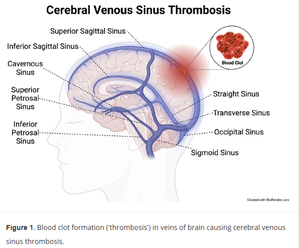
  

### Toispuoleinen halvausoire EI voi esiintyä oireena:

- a. Takakierron infarktissa
- b. Pikkuaivoinfarktissa
- c. Aivorungon infarktissa
- d. Karotisalueen infarktissa

  <button class="solution-button"
          data-label="Vastaus"
          data-hide-label="Piilota vastaus">
    Vastaus
  </button>
  

b

---

Halvausoire syntyy pyramidiradan vauriossa, joten se voi syntyä esimerkiksi aivokuoren motorisen alueen infarktissa (etukierron aluetta) tai aivorungon infarktissa (takakierron aluetta), mikäli infarkti on pyramidiradan alueella. Pikkuaivoinfarktissa ei ole halvausoireita.

Pikkuaivoinfarktin oireita ovat tavallisimmin huimaus, tasapainon epävarmuus ja ataksia liikkeissä. Myös mm. dysmetriaa, intentiovapinaa ja nystagmusta ilmenee usein. 
  

### Kaikille aivoinfarktin ja TIA:n sairastaneille tulisi harkita verenpaineen lääkehoitoa riippumatta verenpaineen lähtötasosta

- a. Oikein 
- b. Väärin 

  <button class="solution-button"
          data-label="Vastaus"
          data-hide-label="Piilota vastaus">
    Vastaus
  </button>
  

a*

---

Kohonnut verenpaine on tärkein aivoinfarktien ja TIA-kohtausten hoidettavissa oleva riskitekijä. 20 mmHg korkeampaan systoliseen tai 10 mmHg korkeampaan diastoliseen verenpaineeseen liittyy keskimäärin aivohalvausriskin kaksinkertaistuminen. Suhde on nuorilla jyrkempi kuin vanhoilla. Suhde säilyy aina tasolle 115/75 mmHg saakka.

Useimmiten hoitotavoitteeksi voi asettaa kotimittauksissa <130/80, mutta tietysti iäkkäillä geriatriset realiteetit ja haitat huomioiden voi olla sen tasoinen, että siitä ei aiheudu merkittäviä haittoja. 

*Periaatteessa jos kysymyksen ottaa täysin kirjaimellisesti, niin eihän verenpainetta tarvitse tietystikään hoitaa, jos potilaalla on verenpaineet esim. 100/60, mutta tällainen tilanne harvoin on. Käytännössä kaikki siten voivat mahdollisesti hyötyä verenpaineen laskusta. NNT 45, jos verenpaine on koholla ja NNT 118, jos verenpaine on normaali.
  

### Kaula-/nikamavaltimon dissekaatiossa VÄÄRIN:

- a. Ei esiinny alle 40-vuotiailla
- b. Kyseessä on valtimon seinämän intiman ja/tai median repeämä ja verenvuoto kerrosten väliin
- c. Tyypillisiä oireita ovat päänsärky, kasvo- tai kaulakipu ja Hornerin oireyhtymä.
- d. Dissekaatiossa voidaan antaa aivoinfaktin i.v. trombolyysi normaalin hoitokäytännön mukaisesti

  <button class="solution-button"
          data-label="Vastaus"
          data-hide-label="Piilota vastaus">
    Vastaus
  </button>
  

a

---

Alle 40-vuotiailla dissekaatio on yleisin aivoinfarktin syy. Tilan tunnistaminen on tärkeää, koska varhain aloitettu antikoagulanttihoito voi estää tukokseen liittyvän tromboosin etenemisen ja embolisaation, joka vasta johtaa infarktiin. Ensisijainen diagnostinen tutkimus on kaulasuonten tietokone- tai magneettiangiografia (tietysti aivoinfarktioireileville pään natiivi TT aina ensimmäiseksi poissulkemaan verenvuoto). 

b: Valtimon seinämän kerrokset eroavat jostain syystä (trauma tai spontaani) -> verta virtaa intimaan -> hematooma seinämään -> tämä false lumen aiheuttaa valtimon stenoosia ja estää verenvirtausta aivoihin -> AVH

c: Nämä oireet vievät pitkälti ajatuksia kaulavaltimon dissekoitumaan. Alkuoire on useimmiten toispuolinen tai silmäntakainen sykkivä päänsärky, joka voi muistuttaa migreeniä. Noin puolessa tapauksista kipua tuntuu myös kaulalla. Hornerin oireyhtymä tarkoittaa sympaattisen rungon hermovaurion aiheuttamaa oirekuvaa, jolle on tyypillistä seuraava triadi: ipsilateraalinen ptoosi + mioosi + anhidroosi. Lähtökohtaisesti uutena kehittynyt Hornerin syndrooma vaatiikin päivystystutkimuksia. Se voi myös liittyä mm.  sarjoittaiseen päänsärkyyn (Hortonin neuralgia, cluster headaches) ja keuhkojen yläosien kasvaimiin (pancoast tumor). 

d: Jos oirekuvana akuutti neurologinen oirekuva (aivoinfarkti) -> tyypilliseen tapaan liuotushoito. Jos taas ei vaikuta infarktilta, niin aloitetaan antitromboottinen hoito -> AK-hoito (varfariini tai DOAC; vaihtoehtona ASA tai DAPT); Hoitoa jatketaan yleensä kuuden kuukauden ajan, minkä jälkeen, jos on jäänyt merkittävä stenoosi (arvioidaan kontrolli-CTA:lla/MRA:lla), siirrytään asetyylisalisyylihappoon. 

  

### Aivoinfarkti ja aivoverenvuoto erotetaan toisistaan kliinisten löydösten perusteella

- a. Väärin
- b. Oikein

  <button class="solution-button"
          data-label="Vastaus"
          data-hide-label="Piilota vastaus">
    Vastaus
  </button>
  

a

---

Neurologiset oireet riippuvat vuodon tai infarktoituneen alueen sijainnista ja voivat siten olla molemmissa samanlaisia. Erotusdiagnostiikka tapahtuu aivojen natiivi-TT:llä. Natiivi-TT:tä ei siis oteta aivoinfarktiepäilyissä sen takia, että sillä todettaisiin aivoinfarkti, vaan ensisijaisesti siksi, että sillä poissuljetaan verenvuoto.
  

### Hemikraniektomia aivoinfarktin hoidossa

- a. On rekanalisoiva toimenpide
- b. Indikaationa on maligni MCA-infarkti
- c. Lisää mahdollisuutta toipua täysin ennalleen
- d. Ikä ei vaikuta hoitopäätökseen

  <button class="solution-button"
          data-label="Vastaus"
          data-hide-label="Piilota vastaus">
    Vastaus
  </button>
  

b

---

Indikaationa on aivoinfarkteissa iso keskimmäisen aivovaltimon tukoksen aiheuttama infarkti. Laaja-alaiseen ja vaikeaan aivoinfarktiin voi liittyä merkittävä aivoturvotuksen riski, joka lisää kuolleisuutta ja vakavia komplikaatioita. Aivoturvotuksen aiheuttamasta oireesta käytetään maligni MCA-oireyhtymä nimitystä (käytännössä
tämä tarkoittaa laajaa keskivaltimoalueen infarktia, jossa vaurio käsittää yli 50 % suonitusalueesta). Aivojen turvotus kehittyy tyypillisesti 1–2 vuorokauden jälkeen infarktiin sairastumisesta. Nuori ikä lisää aivoturvotuksen riskiä.

a: Hemikraniekromia ei ole rekanalisoiva toimenpide, vaan sen tarkoituksena on vähentää aivoturvotuksen massavaikutusta. 

c ja d: Alle 60-vuotiailla se vähentää huomattavasti kuolleisuutta ja mahdollisuutta toipua kohtalaiseen kuntoon, mutta toisaalta lisää merkittävästi myös päivittäisissä toimissa jatkuvasti apua tarvitsevien määrää. Yli 60-vuotiailla vähentää kuolleisuutta, mutta toisaalta ei lisää mahdollisuutta toipua kohtalaiseen kuntoon ja kaksinkertaistaa päivittäisissä toimissa apua tarvitsevien määrän, joten tässä ikäryhmässä hoitopäätös tehtävä erittäin suurta harkintaa käyttäen. 

  

### TIA-kohtauksessa

- a. Oireet alkavat vähitellen
- b. Oireisto on ohimenevä
- c. Oireisto eroaa aivoinfarktin oireista
- d. Aivoinfarktin riski ei ole lisääntynyt

  <button class="solution-button"
          data-label="Vastaus"
          data-hide-label="Piilota vastaus">
    Vastaus
  </button>
  

b

---

Oireiden alku on äkillinen, oireet kehittyvät alle 5 minuutin aikana ja menevät usein ohi tunnissa, yleensä 2-15 min aikana. Oireet muistuttavat aivoinfarktia, mutta ovat ohimeneviä.

d: TIA lisää aivoinfarktiriskiä 10-kertaiseksi verrattuna normaaliväestöön.
  

### TIA-kohtauksessa oireena on harvoin

- a. Näköhäiriöinä valoilmiöt esim. sahalaitakuviot
- b. Toispuoleinen raajaheikkous
- c. Näkökenttäpuutos
- d. Puheen tuoton häiriö

  <button class="solution-button"
          data-label="Vastaus"
          data-hide-label="Piilota vastaus">
    Vastaus
  </button>
  

b

---

Oireiden alku on äkillinen, oireet kehittyvät alle 5 minuutin aikana ja menevät usein ohi tunnissa, yleensä 2-15 min aikana. Oireet muistuttavat aivoinfarktia, mutta ovat ohimeneviä.

d: TIA lisää aivoinfarktiriskiä 10-kertaiseksi verrattuna normaaliväestöön.
  

### Kaulavaltimoahtauman operatiivinen hoito on indisoitu oireilevalla potilaalla, mikäli ahtauma on vähintään lievä eli 30-49 %

- a. Oikein
- b. Väärin

  <button class="solution-button"
          data-label="Vastaus"
          data-hide-label="Piilota vastaus">
    Vastaus
  </button>
  

b

---

Jos potilas on sairastunut juuri AVH:n ja hänellä on kaulavaltimostenoosi, mutta ahtauman aste on alle 50 %, niin ensisijainen hoito on pelkkä lääkehoito ilman kirurgiaa. Kaulavaltimoahtauman operatiivisesta hoidosta on taas selkeää hyötyä potilaille, joilla on tuoreen TIA-oireen tai aivoinfarktin aiheuttanut samanpuoleinen tiukka >50% kaulavaltimoahtauma (hoitona ensisijaisesti endarterektomia 2vk sisällä). 
  

### TIA-kohtauksessa VÄÄRIN

- a. Jos kohtauksesta on yli 2 vk, voi aloittaa estohoidon ja tehdä lähetteen neurologian poliklinikalle
- b. Vaatii päivystyksellisiä tutkimuksia, mikäli tapahtuneesta alle 2 vk
- c. Välitön tutkimus ja hoito vähentää aivoinfarktin riskiä merkittävästi
- d. Sekundaaripreventioksi aloitetaan LMWH + dipyridamoli

  <button class="solution-button"
          data-label="Vastaus"
          data-hide-label="Piilota vastaus">
    Vastaus
  </button>
  

d

---

Sekundaaripreventiona on ASA+dipyridamoli tai vaihtoehtoisesti klopidogreeli, sydänperäisen etiologian ollessa kyseessä AK-hoito

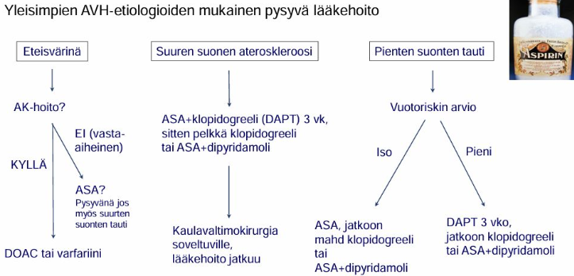
  

### TIA-kohtauksen etiologisiin selvittelyihin kuuluu

- a. Vaskulaaririskitekijöiden arviointi
- b. Kaulasuonten TT-angio tai doppler-UÄ
- c. EKG
- d. Kaikki mainitut

  <button class="solution-button"
          data-label="Vastaus"
          data-hide-label="Piilota vastaus">
    Vastaus
  </button>
  

d

---

EKG:lla etsitään pääasiassa eteisvärinää ja kaulasuonten kuvantamisella niiden ahtaumaa. 
  

### Aivoinfarktissa

- a. Ensimmäiset oireet tulevat usein minuuttien kuluessa
- b. Pysyvät vauriot syntyvät vasta yli vuorokauden kuluttua tukoksen synnystä
- c. Tukoksen kestolla ei ole merkitystä pysyvään infarktin kokoon
- d. Suurin osa tukoksista ilmenee vertebrobasilaarikierron alueella

  <button class="solution-button"
          data-label="Vastaus"
          data-hide-label="Piilota vastaus">
    Vastaus
  </button>
  

a

---

Aivoinfarkteille on tyypillistä äkillisesti kehittyvät oireet

b: Pysyvät vauriot kehittyvät tunneissa. 

c: Mitä aiemmin tukos saadaan poistettua, sitä pienempi infarktoituneen alueen koko on ("time is brain")

d: Suurin osa tukoksista on karotiskierron alueella. 

  

### SAV-potilaan hoitopaikkana toimii neurokirurgian vuodeosasto

- a. Oikein
- b. Väärin

  <button class="solution-button"
          data-label="Vastaus"
          data-hide-label="Piilota vastaus">
    Vastaus
  </button>
  

b

---

SAV:n primaarivuodosta selvinnyt on välittömän uusintavuodon vaarassa, joten neurotehohoito on tarpeen. Mahdollisen aneurysman sulku tehdään yleensä viimeistään seuraavana päivänä.

  

### Kaula-/nikamavaltimon dissekaatioon liittyen VÄÄRIN:

- a. Diagnosoidaan pään ja kaulasuonten CT/CTA:lla tai MRI/MRA:lla
- b. Kirurginen hoito on tarpeen kaikille
- c. Voi syntyä trauman seurauksena tai spontaanisti
- d. Ennuste on hyvä, mikäli dissekaatio ei ehdi aiheuttaa distaalista embolisaatiota

  <button class="solution-button"
          data-label="Vastaus"
          data-hide-label="Piilota vastaus">
    Vastaus
  </button>
  

b

---

Hoidetaan AK-hoidolla, mikä estää tukokseen liittyvän tromboosin etenemisen ja distaalisen embolisaation. Kirurginen tai endovaskulaarinen hoito erityistapauksissa.

  

### I.v. trombolyysi etukierron aivoinfarktissa voidaan tehdä, mikäli oireiden alusta on kulunut alle

- a. 4.5 - 9 h
- b. 48 h
- c. 12 h
- d. 24 h

  <button class="solution-button"
          data-label="Vastaus"
          data-hide-label="Piilota vastaus">
    Vastaus
  </button>
  

a

---

I.v. trombolyysi on indisoitu, jos oireiden alusta on kulunut alle 4,5 h eikä ole kontraindikaatioita. I.v. trombolyysi voidaan antaa valikoiden 4,5 - 9 tunnin aikaikkunassa ja myös oireisina heränneille potilaille, mikäli perfuusio-CT:ssä ei todeta laajaa infarktia.

b ja c: Poikkeuksena tyypillisiin aikaikkunoihin on kallonpohjavaltimon tukos (basilaaritromboosi), jossa annetaan liuotushoito, jos oireiden alusta on kulunut alle 12 tuntia (massiivinen oireisto) tai vaikeaksi etenevässä oireistossa alle 48 tuntia. Pidemmät rajat siksi, että basilaaritromboosin ennuste ilman rekanalisaatiota on todella huono (yli 90% kuolee).

d: Tämä on trombektomian aikaikkuna

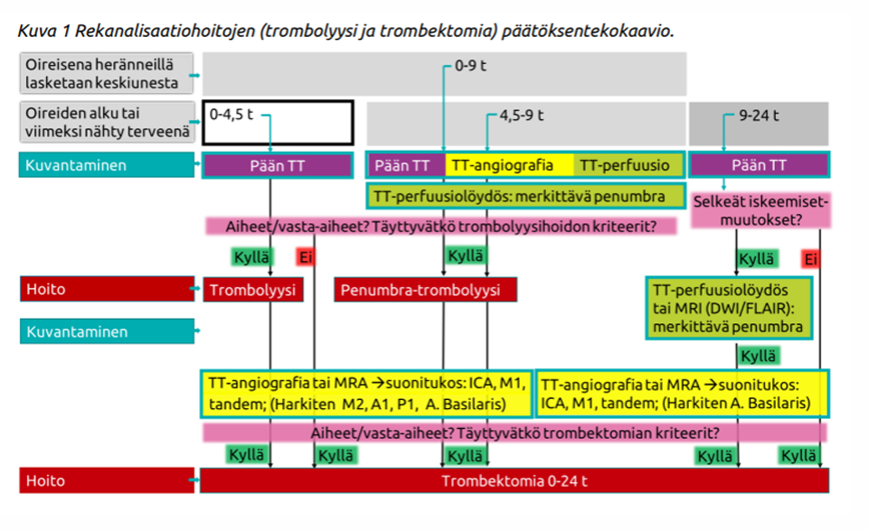
  

### A. basilariksen tukoksessa aikaikkuna i.v. trombolyysille on alle:

- a. 12 h
- b. 4,5 h
- c. 48 h
- d. 24 h

  <button class="solution-button"
          data-label="Vastaus"
          data-hide-label="Piilota vastaus">
    Vastaus
  </button>
  

c

---

Poikkeuksena tyypillisiin aikaikkunoihin on kallonpohjavaltimon tukos (basilaaritromboosi), jossa annetaan liuotushoito, jos oireiden alusta on kulunut alle 12 tuntia (massiivinen oireisto) tai vaikeaksi etenevässä oireistossa alle 48 tuntia. Pidemmät rajat siksi, että basilaaritromboosin ennuste ilman rekanalisaatiota on todella huono (yli 90% kuolee).

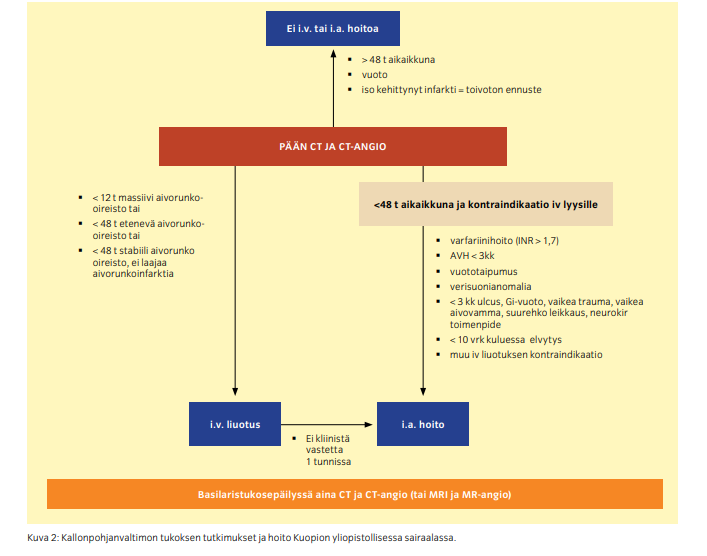
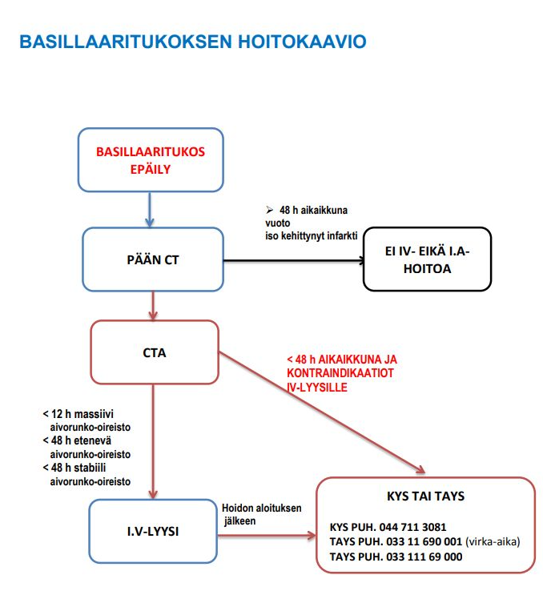
  

### Sydänperäisen aivoembolian yleisin aiheuttaja on

- a. Mekaaninen tekoläppä
- b. Eteisvärinä
- c. Dilatoiva kardiomyopatia
- d. Sydäninfarkti

  <button class="solution-button"
          data-label="Vastaus"
          data-hide-label="Piilota vastaus">
    Vastaus
  </button>
  

b

---

Periaatteessa kaikki voivat aiheuttaa trombien muodostumista ja siten embolisaatioita, mutta eteisvärinä on selvästi yleisin ja tärkein. 
  

### Dominantin hemisfäärin infarkti voi aiheuttaa globaalia afasiaa

- a. Oikein
- b. Väärin

  <button class="solution-button"
          data-label="Vastaus"
          data-hide-label="Piilota vastaus">
    Vastaus
  </button>
  

a

---

Valtaosalla ihmisistä vasen aivopuolisko on dominantti kielellisten toimintojen osalta. Infarkti siellä voi siten aiheuttaa globaalia afasiaa eli sekä puheen tuottamisen (Brocan alue) että ymmärtämisen (Wernicken alue) häiriön. Yleensä taustalla on MCA:n laaja infarkti. 
  

### Mikä seuraavista EI ole aivoinfarktin liuotushoidon vasta-aihe

- a. INR > 1.7
- b. Kallonsisäinen verenvuoto
- c. Potilaalla on käytössä klopidogreelilääkitys
- d. Epäily endokardiitista

  <button class="solution-button"
          data-label="Vastaus"
          data-hide-label="Piilota vastaus">
    Vastaus
  </button>
  

c

---

Käytössä oleva verihiutaleiden estolääkitys (kuten aspiriini tai klopidogreeli) ei ole liuotushoidon vasta-aihe. Taas aktiivinen AK-hoito on vasta-aihe. 

a: INR mitataan yleensä vain, jos potilaalla on varfariini käytössä tai muuten epäillään hyytymishäiriötä. Jos varfariinin käyttäjällä on INR koholla, niin varfariini voidaan kumota (PCC+K-vitamiini) ja annostella liuotushoito. 

b: Tämän poissulkemiseksi juuri otetaan pään TT ennen liutoushoitoa 

d: Sydänläpän tulehdus (endokardiitti) voi aiheuttaa septisiä embolioita, jotka vaurioittavat suonen seinämää (mykoottiset aneurysmat). Näissä tilanteissa liuotushoitoon liittyy erittäin korkea aivoverenvuodon riski, ja siksi se on vasta-aihe.

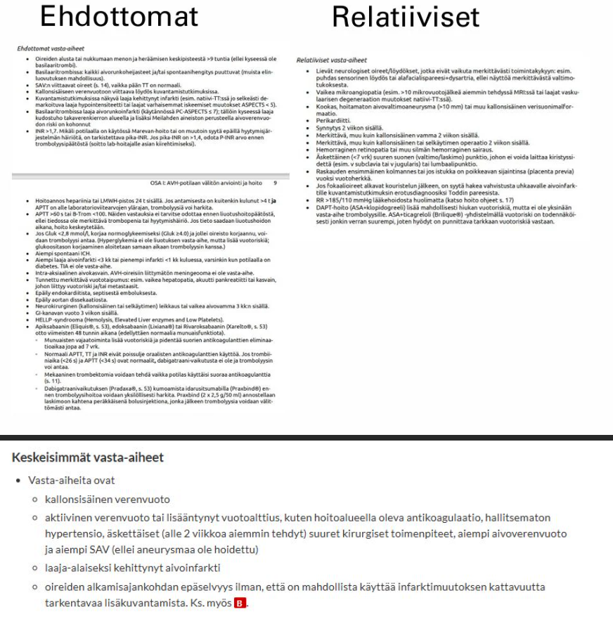
  

### Etukierron aivoinfarktissa alle 4,5 h aikaikkunassa sairaalaan saapuvista kaikille tehdään i.a. trombektomia

- a. Oikein
- b. Väärin

  <button class="solution-button"
          data-label="Vastaus"
          data-hide-label="Piilota vastaus">
    Vastaus
  </button>
  

b

---

I.a. trombektomia tulee kyseeseen, mikäli potilaalla on proksimaalinen suonitukos eli ICA tai M1 ja M2 tukos ja i.v. trombolyysistä ei ole kliinistä tehoa (vain pieni osa proksimaalisista suonitukoksista aukeaa i.v. trombolyysillä) tai i.v. trombolyysille on kontraindikaatio.

Trombektomian (MT) kriteerit aivoinfarktissa ovat seuraavat: 

<li>Aikaikkuna 0-24h</li>
<li>Akuutit suurten suonten oireiset tukokset TT- tai magneettiangiografiassa</li>
<li>NIHSS >6 tai tapauskohtaisesti lievemmissäkin</li>
<li>mRS 0-2 (aiempi toimintakyky korkeintaan lievästi rajoittunut)</li>
<li>Ei vasta-aiheita (esim. liian laaja infarkti, jodiallergia, hoitoon soveltumaton anatomia)</li>

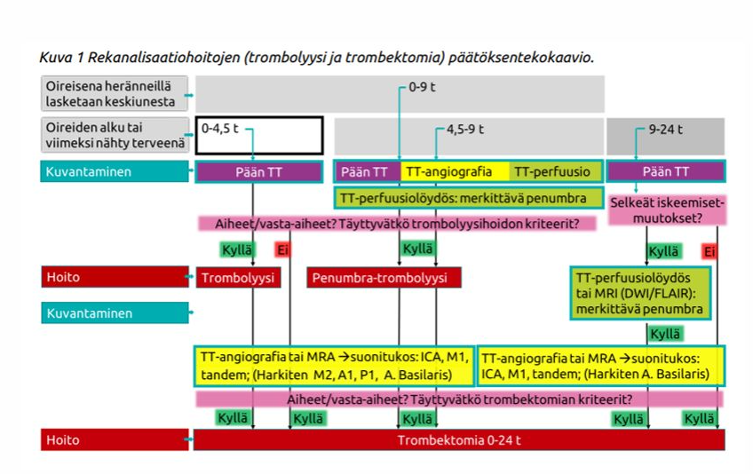

  

### Aivoinfarktin liuotushoito

- a. Verenpaineen on oltava alle 185/100 mmHg
- b. Oireisen aivoverenvuodon riski on noin 10 %
- c. Tehoaa hyvin proksimaalisiin tukoksiin
- d. Tehdään kaikille huolimatta siitä, olipa potilas ennestään omatoiminen tai ei

  <button class="solution-button"
          data-label="Vastaus"
          data-hide-label="Piilota vastaus">
    Vastaus
  </button>
  

a

---

Systolinen verenpaine yli 185 tai diastolinen verenpaine yli 110, ellei verenpaineen alentaminen näihin rajoihin onnistu i.v. lääkkeillä, on merkattu relatiiviseksi vasta-aiheeksi liuotushoidolle. Yleisesti ottaen on kuitenkin syytä välttää koholla olevan verenpaineen merkittävää laskemista aivoinfarktin hoidon alkuvaiheessa, ellei ole syytä epäillä uhkaavaa elinvauriokomplikaatiota. Verenpainetta ei tule alentaa, jos ei olla liuottamassa potilasta ja verenpaine ei ylitä arvoa 220/120 mmHg. Jos taas liuotetaan niin tavoite on alle 185/110. Ensisijaisia verenpainelääkkeitä ovat labetaloli tai enalapriili i.v. 

b: Oireisen ICH:n riski on noin 1-2 %.

c: Liuotushoito tehoaa huonosti proksimaalisiin tukoksiin.

d: Ennestään ei-omatoimisella potilaalla (mRS 3-5) liuotushoito on kontraindisoitu
  

### SAV:n diagnoosi perustuu ensisijaisesti

- a. MRA:aan
- b. Anamneesiin
- c. TT-kuvaukseen
- d. Likvornäytteeseen

  <button class="solution-button"
          data-label="Vastaus"
          data-hide-label="Piilota vastaus">
    Vastaus
  </button>
  

c

---

Diagnoosi perustuu TT-kuvaukseen, jossa vuoto näkyy subaraknoidaalitilassa. TT-angiolla voidaan löytää mahdollinen vuotanut aneurysma. 

a: MRA on paras sinustromboosin kuvantamistutkimus

b: Anamneesi on tärkeä, mutta se ei ole suoraan diagnostinen 

d: Jos TT on normaali tehdään tarvittaessa lumbaalipunktio, koska veren hemolyysin vuoksi pidemmän ajan kuluessa (6 -12 h) pään TT:ssä ei välttämättä enää erotu verta.
  

### Vertebrobasilaarialueen eli takakierron iskemiaan EI liity

- a. Ataksia
- b. Nielemisvaikeus
- c. Neglect
- d. Tajunnanhäiriö

  <button class="solution-button"
          data-label="Vastaus"
          data-hide-label="Piilota vastaus">
    Vastaus
  </button>
  

c

---

Neglect liittyy yleensä etukierron iskemiaan

a: Ataksia on tyypillistä takakierron iskemialle (affisioi helposti pikkuaivoja -> ataksia)

b: Aivorungon alueen vaurio aiheuttaa bulbaarioireita, joista yleinen on dysfagia 

d: Takakierron iskemiaan voi hyvinkin liittyä tajunnanhäiriö, mikäli kyseessä on a. basilariksen tukos. Aivorungossa sijaitsee vireyttä säätelevät laajat bilateraaliset verkostot, joista tärkein on ns. (A)RAS-systeemi (the (Ascending) Reticular Activating System). Tajunnan tilaa pystyy ylläpitämään vain toisen puolen toiminta -> fokaali korteksileesio tai vain toisen puolen talamuksen vaurio ei tyypillisesti johda tajuttomuuteen. Taas fokaali leesio esim. aivorungon tai alempien väliaivojen tasolla proksimaalisemmin järjestelmässä voi johtaa tajuttomuuteen anatomisen kompaktiuden takia. Leesion silti pitää siis yleensä affisioida molempia puolia esim. aivorungosta, mutta koska alue on niin kompakti, niin infarktit (esim. basilaristukos) ja kompressiot (esim. herniaatiosta) affisioivat aluetta bilateraalisesti

  

### Aivoinfarktin ja TIA:n estohoitona käytetään, kun etiologiana on pienten tai suurten suonien ateroskleroottinen tauti tai etiologia on epäselvä

- a. ASA
- b. ASA + dipyridamoli
- c. DOAC
- d. Varfariini

  <button class="solution-button"
          data-label="Vastaus"
          data-hide-label="Piilota vastaus">
    Vastaus
  </button>
  

c

---

Ehkä yleisemmin kuitenkin klopidogreelia (Plavix).

  

### Kaikki seuraavat ovat AVH:n riskitekijöitä; mikä näistä on merkittävin hoidettavissa oleva riskitekijä?

- a. Dyslipidemia
- b. Tupakointi
- c. Verenpainetauti
- d. Eteisvärinä

  <button class="solution-button"
          data-label="Vastaus"
          data-hide-label="Piilota vastaus">
    Vastaus
  </button>
  

c

---

Kaikki näistä ovat tärkeitä riskitekijöitä, mutta verenpainetauti on tärkein. 20 mmHg korkeampaan systoliseen tai 10 mmHg korkeampaan diastoliseen verenpaineeseen liittyy keskimäärin aivohalvausriskin kaksinkertaistuminen. Suhde on nuorilla jyrkempi kuin vanhoilla. Suhde säilyy aina tasolle 115/75 mmHg saakka. Systolisen verenpaineen alentaminen 10 mmHg pienentää aivohalvausriskiä noin 35 %.

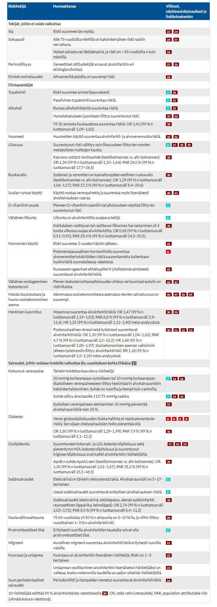
  

### Mitä enemmän NIHSS -pisteitä aivoinfarktipotilas saa, sitä huonompi ennuste on

- a. Väärin
- b. Oikein

  <button class="solution-button"
          data-label="Vastaus"
          data-hide-label="Piilota vastaus">
    Vastaus
  </button>
  

c

---

National Institute of Health Stroke Scale (NIHSS) on työkalu, jota käytetään arvioimaan AVH:n oirekuvaa ja vaikeusastetta. Sairastetun aivoinfarktin 13 keskeisintä oirealuetta pisteytetään ja summataan; 0 pistettä on normaali 

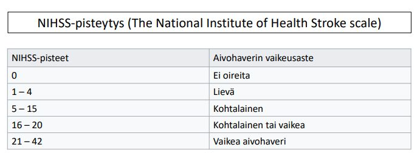
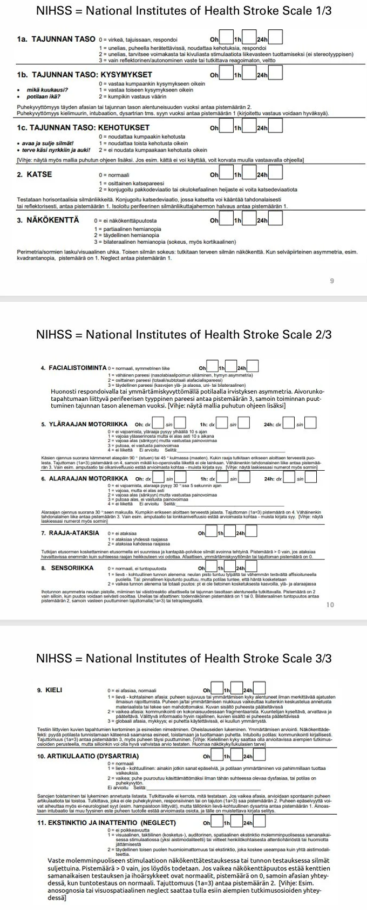
  

### Yleisin sydänperäisen aivoinfarktin syy

- a. Dilatoiva kardiomyopatia
- b. Läppävegetaatio
- c. Eteisvärinä
- d. Sairastettu sydäninfarkti, joka johtaa kammion seinämän liikehäiriöön

  <button class="solution-button"
          data-label="Vastaus"
          data-hide-label="Piilota vastaus">
    Vastaus
  </button>
  

c

---

Periaatteessa kaikki voivat embolisaation kautta aiheuttaa aivoinfarktin, mutta eteisvärinä on selvästi yleisin ja tärkein. 

  

### Stroke-TT kuvantamiseen kuuluu TT-angio, jonka avulla voidaan määrittää:

- a. Onko potilaalla proksimaalinen valtimotukos
- b. Onko potilaalla penumbraa
- c. Onko potilaalla iskemia vai vuoto
- d. Onko i.v. trombolyysi indisoitu

  <button class="solution-button"
          data-label="Vastaus"
          data-hide-label="Piilota vastaus">
    Vastaus
  </button>
  

c

---

TT-angiolla määritetään kollateraalit ja onko osoitettavaa suonitukosta (joka voitaisiin mekaanisella trombiektomialla hoitaa). Parempi kollateraalikierto korreloi parempaan ennusteeseen.

b: Tämä tehdään perfuusio-TT:llä

c: Natiivi-TT:llä erotetaan iskemia ja vuoto. TT-perfuusiolla arvioidaan aivokudoksen tila.

d: Liuotushoidon indikaatiot perustuvat mm. aikaikkunaan ja vasta-aiheisiin; natiivi-TT on tässä tärkeämpi, koska sillä poissuljetaan kallonsisäinen verenvuoto, joka on liuotuksen vasta-aihe
  

### Päivystykseen saapuu potilas, jolla todetaan CT:ssä aivoverenvuoto. Valitset aktiivisen hoitolinjan ja turvaat ensin peruselintoiminnot. Mitä sen jälkeen hoidoksi?

- a. Liuotushoito alteplaasilla
- b. AK-hoitoa saavilla hoidon kumoaminen
- c. Annetaan FVIIa -hyytymistekijää
- d. Päivystyksellinen leikkaus ja hematooman poisto

  <button class="solution-button"
          data-label="Vastaus"
          data-hide-label="Piilota vastaus">
    Vastaus
  </button>
  

b

---

Esimerkiksi varfariinipotilailla hyytymistekijäkonsentraatti ja K-vitamiini. 

a: Liuotushoito on aivoverenvuodoissa kontraindikoitu tietysti. Sitä käytetään iskeemisten infarktien hoitoon 

c: FVIIa:sta ei ole näyttöä.

d: Joskus leikkaushoito tarpeen, etenkin subkortikaalisessa vuodossa intrakraniaalisen massavaikutuksen vähentämiseksi. Yleensä kuitenkin ICH:t hoidetaan konservatiivisesti

  

### Aivovaltimotukoksen liuotus tapahtuu

- a. LMWH:lla
- b. Alteplaasilla
- c. Rivaroksabaanilla
- d. Reteplaasilla

  <button class="solution-button"
          data-label="Vastaus"
          data-hide-label="Piilota vastaus">
    Vastaus
  </button>
  

b

---

tPA-analogit tenekteplaasi ja alteplaasi i.v. ovat ensisijaisia liuotuslääkkeitä aivoinfarkteissa. Tenekteplaasi (Metalyse) yleensä ensisijainen, koska nopeampi valmistella ja annetaan boluksena eikä vaadi infuusiota -> Tenekteplaasia käytettäessä siirto yliopistosairaalaan voidaan siis tehdä nopeammin kuin ennen. On myös monissa tutkimuksissa osoittautunut jopa tehokkaammaksi sekä on halvempi kuin alteplaasi (Actilyse); alteplaasi annostellaan lyhytkestoisen injektion lisäksi tunnin kestoisena infuusiona (alteplaasi-infuusion valmisteluun menee jonkin verran aikaa ja siksi alteplaasin lyhytkestoisen injektion ja infuusion aloittamisen väliin tulee yleensä viivettä) 

tPA = Tissue Plasminogen Activator = kudosplasminogeenin aktivaattori. tPA muuttaa plasminogeenia plasmiiniksi; tPA on osa ihmisen normaalia fibrinolyysiä ja toteuttaa fibrinolyysin ensimmäisen vaiheen 

Annokset: 

<li>Tenekteplaasi boluksena 0,25 mg/kg</li>
<li>Alteplaasia 0,9 mg/kg (kokonaisannos enintään 90 mg) perifeeriseen laskimoon 10 %:n boluksena ja loput yhden tunnin infuusiona</li>

  

### Vertebrobasilaarialueen eli takakierron iskemiaan EI liity

- a. Afasia
- b. Kaksoiskuvat
- c. Eriasteiset halvausoireet
- d. Huimaus

  <button class="solution-button"
          data-label="Vastaus"
          data-hide-label="Piilota vastaus">
    Vastaus
  </button>
  

a

---

Jos takakierron iskemiassa on mukana puhehäiriö, niin se on usein dysartriaa, joka johtuu kielen ja nielun lihaksiston toimintahäiriöstä tai lihasten säätelyn häiriöstä. 

Afasia liittyy etukierron iskemiaan ja erityisesti dominantin aivopuoliskon MCA-alueen infarkteihin 

b: Kaksoiskuvia syntyy helposti aivorungon alueen vaurioissa, kun silmän liikkeitä säätelevät tumakkeet vaurioituvat

c: Aivorungon kautta kulkevat kaikki raajojen liikkeitä säätelevät radat. Takakierron infarkti voi aiheuttaa jopa neliraajahalvauksen tai "locked-in" -oireyhtymän.

d: Erityisesti pikkuaivoinfarkti tai aivorungon tasapainotumakkeiden iskemia aiheuttaa voimakasta kiertohuimausta ja tasapainohäiriöitä. Huimauksen yhteydessä on yleensä liitännäisoireita (aivorunkoinfarktissa aina, pikkuaivoinfarktissa useimmiten)
  

### SAV:n yleisin syy on

- a. Aivovaltimoaneurysma
- b. Trauma
- c. Valtimosairauksien riskitekijät, erityisesti verenpainetauti ja tupakointi
- d. AV-malformaatio

  <button class="solution-button"
          data-label="Vastaus"
          data-hide-label="Piilota vastaus">
    Vastaus
  </button>
  

a (oikeasti b)

---

Primaarisen subaraknoidaalivuodon (ei-traumaattisen) selvästi yleisin aiheuttaja on aivovaltimoaneurysman puhkeaminen (n. 80% tapauksista). Mahdollisesti voi myös olla AV-malformaation tai muun verisuoniepämuodostaman (esim. kavernoottisen hemangiooman eli kavernooman tai arterivenoosin fistelin) vuoto (n. 5%). 

Noin 10 %:ssa vuodoista ei ole neuroradiologisesti todettavaa syytä, jolloin angiografiatutkimus yleensä vielä uusitaan, mutta mikäli siinäkään ei syytä löydy, on kyseessä hyvän ennusteen perimesenkefaalinen vuoto. Non-aneurysmaattisen perimesenkefaalisen vuodon syy on toistaiseksi vielä tuntematon, mutta eri tutkimusten mukaan syyksi on epäilty muun muassa hyvin pienen aivovaltimon eli niin sanotun perforantin vuotoa tai laskimoperäistä vuotoa.

b: Monissa lähteissä SAV:n yleisin aiheuttaja on trauma, mutta yleensä tenteissä halutaan, että tietää primaaristen subaraknoidaalivuotojen yleisimmän etiologian 
  

### Primaarisen ICH:n syynä on useimmiten

- a. Valtimosairauksien riskitekijät, erityisesti verenpainetauti ja tupakointi
- b. Aivoissa sijaitseva rakenteellinen tekijä esim. aneurysma
- c. Huumeiden käyttö
- d. AK-hoito tai antitromboottien käyttö

  <button class="solution-button"
          data-label="Vastaus"
          data-hide-label="Piilota vastaus">
    Vastaus
  </button>
  

a

---

Hoitamaton verenpainetauti on ylivoimaisesti merkittävin primaarisen ICH:n aiheuttaja. Pitkäaikainen korkea verenpaine vaurioittaa aivojen syvien osien pieniä valtimoita, mikä tekee niiden seinämistä hauraita ja alttiita repeämiselle. Toinen yleinen syy on amyloidiangiopatia. 

b, c: Sekundaarisen ICH:n taustalla 

d: Myötävaikuttava tekijä ja riskitekijä, mutta ne eivät yleensä "aiheuta" vuotoa yksinään
  

### Eteisvärinä voi synnyttää vasempaan eteiskorvakkeeseen verihyytymän. Hyytymä ajautuu useimmiten aivojen etuverenkierron alueelle

- a. Oikein
- b. Väärin

  <button class="solution-button"
          data-label="Vastaus"
          data-hide-label="Piilota vastaus">
    Vastaus
  </button>
  

a

---

Sydänperäinen embolia kulkee useimmiten carotis communikseen ja sieltä carotis internaan ja usein johonkin keskimmäisen aivovaltimon haaroista. Harvemmin takakierron alueelle.

  

## Epilepsia 

### Nuoruusiän myoklonusepilepsiassa pitää paikkansa:

- a. Lähes kaikilla on MRI:ssä poikkeavaa
- b. Lähes kaikilla on tajuttomuus-kouristuskohtauksia
- c. Lähes kaikilla epilepsialääkitys voidaan nopeasti lopettaa
- d. Lähes kaikilla on poissaolokohtauksia

  <button class="solution-button"
          data-label="Vastaus"
          data-hide-label="Piilota vastaus">
    Vastaus
  </button>
  

b

---

Nuoruusiän myokloninen epilepsia käsittää noin 4 % kaikista epilepsioista. Alkamisikä on 8–26 vuotta, mutta selvä alkamishuippu on todettavissa 12. ja 18. ikävuoden välillä. Myoklonisia nykäyksiä esiintyy joko yksittäisinä tai toistuvina tavallisesti yläraajojen ojentajalihaksissa tajunnan säilyessä normaalina. Nykinät esiintyvät etenkin aamuisin pian heräämisen jälkeen. Valvominen lisää kohtausriskiä. Neurologisessa tutkimuksessa ei tule poikkeavaa esiin.

Myoklonioihin liittyy hyvin usein yleistyneitä tajuttomuus-kouristuskohtauksia, poissaolokohtauksia tai molempia. Tajuttomuus-kouristuskohtaukset ovat yleisimpiä ja lähes kaikilla (n. 90 %) potilaista ilmenee niitä. 

a: Pään MRI on lähes poikkeuksetta normaali

c: JME on luonteeltaan elinikäinen. Vaikka kohtaukset saadaan yleensä erittäin hyvin hallintaan lääkityksellä (esim. valproaatti tai levetirasetaami), kohtaukset uusiutuvat herkästi, jos lääkitys lopetetaan. Lääkehoito on useimmiten elinikäinen.
  

### Ohimolohkoepilepsia. Mikä seuraavista EI pidä paikkaansa?

- a. Aivojen MRI on normaali
- b. Kyseessä on paikallisalkuinen epilepsia
- c. Alkaa yleisimmin lapsuudessa tai nuoruudessa
- d. Voidaan hoitaa myös leikkauksella

  <button class="solution-button"
          data-label="Vastaus"
          data-hide-label="Piilota vastaus">
    Vastaus
  </button>
  

a

---

Tavallisin symptomaattinen (rakenteellisesta syystä johtuva) tai kryptogeeninen paikallisalkuinen epilepsia on temporaali- eli ohimolohkoepilepsia. Ohimolohkoepilepsiassa MRI-kuvauksessa löytyy hyvin usein patologinen muutos. Tyypillisin löydös on hippokampusskleroosi (arpeutuminen ja kutistuminen, jonka taustalla voi mm. olla pitkittyneet kuumekouristukset lapsuudessa, aivoinfektiot tai status epilepticus), mutta syynä voi olla myös mm. hyvänlaatuinen kasvain, verisuoniepämuodostuma tai kortikaalinen dysplasia (kehityshäiriö).

b: Potilaalla esiintyy tavallisimmin monimuotoisia paikallisalkuisia kohtauksia. Kohtauksen ennakkotuntemuksia esiintyy usein. Ohimolohkon sisäosista, amygdalasta ja hippokampuksesta, alkavissa kohtauksissa potilaalla on vaihtelevia subjektiivisia oireita, kuten epigastrinen aura (nouseva tuntemus ylävatsalta rintakehälle), déjà vu -elämys (ennen koetun tunne) ja pelon tai paniikin tunne. Jos kohtaukset alkavat ohimolohkon lateraaliosista tai operculum-alueelta, esiintyy näkö- tai kuuloharhoja, dysfasiaa, pään kääntymistä, toispuolisia tuntohäiriöitä tai haju-makuelämyksiä. 

Ennakko-oireiden jälkeen ohimolohkoperäisissä kohtauksissa on tyypillistä toiminnan pysähtyminen, tuijotus ja tajunnan hämärtyminen. Kohtauksen aikana potilas ei pysty reagoimaan normaalisti ulkoisiin ärsykkeisiin eikä muista kohtauksen aikaisia tapahtumia. Kohtaukseen liittyvät olennaisesti automatismit, jotka ovat tahattomia, epätarkoituksenmukaisia liikkeitä tai liikesarjoja. Tavallisimmin automatismit ovat suun alueen mutristelua ja nieleskelyä, mutta oireet voivat olla myös varsin monimutkaisia liikesarjoja, esim. riisuuntumista tai pukeutumista. Osalla potilaista esiintyy myös toissijaisesti yleistyviä kohtauksia.

c: Ohimolohkoepilepsia alkaa yleisimmin myöhäisessä lapsuusiässä ja nuoruusiällä, mutta se voi ilmaantua missä iässä tahansa. 

d: Vaikean epilepsian hoidossa epilepsiakirurgialle vastaa parhaiten paikallisalkuinen ohimolohkoepilepsia, varsinkin hippokampusskleroosillinen. Amygdalohippokampektomia on tavallisin epilepsiakirurginen leikkaus. 
  

### Mikä seuraavista epilepsiatyypeistä on hankalahoitoisin?

- a. Poissaoloepilepsia
- b. Nuoruusiän myoklonusepilepsia
- c. Unverricht-Lundborgin tauti
- d. Lennox–Gastaut'n oireyhtymä

  <button class="solution-button"
          data-label="Vastaus"
          data-hide-label="Piilota vastaus">
    Vastaus
  </button>
  

d

---

Lennox–Gastaut’n oireyhtymä (LGS) on vaikea, lapsuudessa (<8v) alkava epilepsiaoireyhtymä. EEG:ssä usein havaittavissa sekä fokaalisia purkaumia että yleistynyttä piikkiaktiivisuutta -> Potilaalla siis esiintyy paikallisalkuisia kohtauksia että suoraan yleistyviä kohtauksia. **Voivat johtaa kognitiivisen kyvyn taantumiseen (epileptiseen enkefalopatiaan).** Lennox-Gastaut’n oireyhtymän ennuste on usein heikko, koska epilepsian hyvän hoitotasapainon saavuttaminen voi olla vaikeaa ja toistuvat epilepsiakohtaukset heikentävät kognitiivisia taitoja. Arvioidaan, että noin 5 % lapsista menehtyy oireyhtymään ennen kymmentä ikävuottaan. 

a: Ennuste on yleensä erinomainen. Kohtaukset reagoivat hyvin lääkitykseen (esim. etosuksimidi), ja suuri osa lapsista paranee sairaudesta kokonaan murrosikään mennessä.

b: Nuoruusiän myoklonusepilepsia vastaa yleensä hyvin lääkkeisiin, vaikka lääkitys on usein elinikäinen

c: Myokloniset kohtaukset liittyvät yleisimmin nuoruusiän myoklonusepilepsiaan (JME) tai progressiiviseen myoklonusepilepsiaan (PME). Suomessa tavallisin progressiivinen myoklonusepilepsia (PME) on autosomissa peittyvästi periytyvä Unverricht–Lundborgin tyyppi. PME on juveniilia harvinaisempi ja vaikeammin kontrolloitavissam koska se on neurodegeneratiivinen ja etenevä; hoitovasteet täten yleensä huonompia. Kohtaushoidossa on kuitenkin saavutettu kohtalaisia tuloksia, eikä se yleensä aiheuta yhtä varhaista ja vaikeaa kognitiivista romahdusta kuin Lennox–Gastaut
  

### Potilas saa kouristuskohtauksen, anamneesissa runsasta alkoholinkäyttöä, missä tilanteessa tarvitaan neurologin konsultaatiota?

- a. Neurologin konsultaatio tarvitaan aina kaikista kouristaneista potilaista
- b. Ei koskaan tarvita, potilas kuuluu päihdehuollon piiriin
- c. Aina mikäli anamneesissa on aikaisempia alkoholiin liittyviä kouristuskohtauksia
- d. Aina mikäli kyseessä on ensimmäinen kouristuskohtaus

  <button class="solution-button"
          data-label="Vastaus"
          data-hide-label="Piilota vastaus">
    Vastaus
  </button>
  

d

---

Ensimmäinen kouristus kuuluu aina päivystykseen ja yleensä neurologisiin selvityksiin, vaikka taustalla olisikin epäily runsaasta alkoholinkäytöstä tai muusta altisteesta. 

a: Jos potilas on tunnettu epilepsiapotilas tai hänellä on toistuvia, aiemmin selvitettyjä vieroituskouristuksia, joiden syy tiedetään ja tilanne on vakiintunut, jokainen yksittäinen kohtaus ei välttämättä vaadi neurologin konsultaatiota

b: Alkoholiongelma ei poissulje muita kouristuksen syitä. 

c: Jos kohtaukset ovat toistuvia ja niiden syy on jo aiemmin tutkittu ja todettu alkoholiin liittyväksi, uusi konsultaatio ei ole automaattisesti välttämätön, ellei kohtauksen luonne muutu
  

### Mikä seuraavista EI ole epilepsialääkityksen tyypillinen haittavaikutus?

- a. Neutropenia
- b. Anemia
- c. Trombosytopenia
- d. Hyponatremia

  <button class="solution-button"
          data-label="Vastaus"
          data-hide-label="Piilota vastaus">
    Vastaus
  </button>
  

b

---

Vaikka lähes mikä tahansa lääke voi harvinaisissa tapauksissa vaikuttaa verenkuvaan, anemia ei ole epilepsialääkkeiden yleisesti valvottava haittavaikutus. Sen sijaan muut vaihtoehdot ovat klassisia ja tunnettuja tiettyjen epilepsialääkkeiden sivuvaikutuksia. Karbamatsepiini kyllä voi myös aiheuttaa aplastista anemiaa, mutta harvinaisemmin. 

a: Erityisesti karbamatsepiini voi aiheuttaa valkosolujen, erityisesti neutrofiilien, määrän laskua. Lievempi leukopenia on aika yleistä (osin annoksesta riippuva ja usein reversiibeli), mutta hoito on lopetettava, jos neutrofiilit ovat alle 1 × 109/l (agranulosytoosi). 

c: Valproaatti on tunnettu siitä, että se voi laskea verihiutaleiden määrää

d: Tämä on tyypillinen haittavaikutus karbamatsepiinilla ja erityisesti okskarbatsepiinilla; aiheuttavat SIADH ja sitä kautta hyponatremian
  

### Kuinka pitkä ryhmän 1 ajokielto on yksittäisen kouristuskohtauksen jälkeen, mikäli epilepsiaa ei todeta?

- a. 3 kk
- b. 1 kk
- c. 1 v.
- d. 6 kk

  <button class="solution-button"
          data-label="Vastaus"
          data-hide-label="Piilota vastaus">
    Vastaus
  </button>
  

a

---

Ensimmäisen kohtauksen jälkeen määrätään ajokieltoon (R1 3kk, R2 5v) heti. Tutkimukset kyllä vielä jatkuvat poliklinikalla kotiutumisen jälkeen, mutta potilas määrätään ajokieltoon jo päivystyksessä. 

Jos diagnosoidaan epilepsia tai todetaan 2 epileptistä kohtausta alle 3v. sisään:

<li>R1-ajokielto vähintään 1v, ajoluvan palautukseen vaaditaan 1v. kohtauksettomuus</li>
<li>R2-ajokielto käytännössä pysyvä (virallisesti väh. 10v kohtaukseton ilman lääkitystä -> voi miettiä kiellon poistoa)</li>

  

### Missä tapauksessa kiireellinen lähete erikoissairaanhoitoon riittää?

- a. Pitkittynyt kohtaus
- b. Yksittäinen ohimennyt kohtaus, ilman yleisoireita
- c. Useita kohtauksia saman vuorokauden aikana
- d. Poikkeava neurologinen status

  <button class="solution-button"
          data-label="Vastaus"
          data-hide-label="Piilota vastaus">
    Vastaus
  </button>
  

b

---

Jos kohtausoire sopii epileptiseksi ja potilas on tk-arviossa samana päivänä -> päivystyslähete ESH-arvioon (elämänsä ensimmäisen epileptiformisen kohtauksen saaneet arvioidaan pääsääntöisesti päivystyksessä)

Jos potilas on hakeutunut arvioon vasta päivien kuluttua kohtauksesta ja neurologinen status normaali -> 1-7 vrk lähete neurologialle; muista asettaa potilas ajokieltoon! 

a: Pitkittynyt kohtaus (>5min) on uhkaava status epilepticus -uhka. Se on hengenvaarallinen hätätilanne, joka vaatii välitöntä ensihoitoa ja sairaalahoitoa kohtauksen katkaisemiseksi.

c: Sarjoittaiset kohtaukset viittaavat herkkään aivotoimintaan ja korkeaan riskiin status epilepticukseen. Potilas tarvitsee päivystyksellistä lääkehoidon aloitusta tai tehostamista.

d: Varsinkin jos kohtauksen jälkeen potilaalle jää pitkittyviä neurologisia puutoksia (esim. halvausoire, puhehäiriö tai jatkuva sekavuus), on välittömästi suljettava pois aivoverenkiertohäiriö, verenvuoto tai muu akuutti aivovaurio päivystyksellisellä kuvantamisella (TT/MRI). Epilepsia voi kylläkin aiheuttaa postiktaalisesti halvausoireita (Toddin pareesi; kohtauksenaikainen voimakas lihastoiminta tietyssä raajassa johtaa sen heikkouteen kohtauksen jälkeen, kun sitä säätelevät neuronit väsyvät kohtauksen aikana). 
  

### Voiko epilepsiaa sairastava tehdä vuorotyötä?

- a. Kyllä
- b. Ei

  <button class="solution-button"
          data-label="Vastaus"
          data-hide-label="Piilota vastaus">
    Vastaus
  </button>
  

a

---

Vaikka vuorotyö on epilepsiaa sairastavalle haasteellista, se ei ole ehdoton este. Asiaa tarkastellaan aina yksilöllisesti potilaan kohtaustyypin, lääkevasteen ja työnkuvan mukaan.
  

### Mikä seuraavista EI tyypillisesti liity epilepsiaan?

- a. Sosiaalisen toimintakyvyn heikkeneminen
- b. Muistin heikkeneminen
- c. Kognition alenema
- d. Päänsärky

  <button class="solution-button"
          data-label="Vastaus"
          data-hide-label="Piilota vastaus">
    Vastaus
  </button>
  

d

---

Vaikka päänsärky on erittäin yleinen vaiva ja sitä voi esiintyä kouristuskohtauksen jälkeen (ns. postiktaalinen päänsärky), se ei ole epilepsian tyypillinen liitännäissairaus tai sairauden pitkäaikaisvaikutus samalla tavalla kuin muut listatut vaihtoehdot

a: Voi johtua sairauteen liittyvästä stigmasta, ajokielloista, rajoituksista työelämässä tai liitännäissairauksista, kuten masennuksesta ja ahdistuksesta

b: Erityisesti ohimolohkoepilepsia vaurioittaa usein hippokampusta, joka on keskeinen alue uusien asioiden mieleenpainamisessa; ohimolohkoepilepsia voi myös johtua hippokampusvaurioista. 

c: Pitkäkestoinen tai huonossa hoitotasapainossa oleva epilepsia voi johtaa kognitiivisten toimintojen hidastumiseen
  

### Kuinka pitkä ryhmän 1 ajokielto (kohtauksetonta aikaa) on epilepsian diagnosoimisen jälkeen?

- a. 1 v.
- b. 3 kk
- c. 1 kk
- d. 6 kk

  <button class="solution-button"
          data-label="Vastaus"
          data-hide-label="Piilota vastaus">
    Vastaus
  </button>
  

a

---

Ensimmäisen kohtauksen jälkeen määrätään ajokieltoon (R1 3kk, R2 5v) heti. Tutkimukset kyllä vielä jatkuvat poliklinikalla kotiutumisen jälkeen, mutta potilas määrätään ajokieltoon jo päivystyksessä. 

Jos diagnosoidaan epilepsia tai todetaan 2 epileptistä kohtausta alle 3v. sisään:

<li>R1-ajokielto vähintään 1v, ajoluvan palautukseen vaaditaan 1v. kohtauksettomuus</li>
<li>R2-ajokielto käytännössä pysyvä (virallisesti väh. 10v kohtaukseton ilman lääkitystä -> voi miettiä kiellon poistoa)</li>

  

### Epilepsian lääkehoidossa pitää paikkansa:

- a. Kaikki potilaat reagoivat hyvin lääkitykselle
- b. N. 50% saa hyvän vasteen ensimmäisenä aloitetusta lääkkeestä
- c. Harva potilas saadaan täysin kohtauksettomaksi
- d. N. 50% potilaista on hoitoresistenttejä

  <button class="solution-button"
          data-label="Vastaus"
          data-hide-label="Piilota vastaus">
    Vastaus
  </button>
  

b

---

Nykyään 70-80%:lla potilaista kohtaukset loppuvat tai ne saadaan hallittua tyydyttävästi lääkityksellä (ei aina siis ensimmäisellä, vaan voidaan ehkä kokeilla toisiakin lääkkeitä tarvittaessa). 20-30%:lla epilepsiapotilaista kohtaukset ovat kuitenkin vaikeahoitoisia
  

### Mitä laboratoriokokeita epilepsiapotilailla seurataan?

- a. S-Na okskarbatsepiinin käyttäjiltä
- b. PVK ja ALAT 3 kk välein osalta
- c. PVK ja ALAT kaikilta kerran vuodessa
- d. S-Na valproaatin käyttäjiltä

  <button class="solution-button"
          data-label="Vastaus"
          data-hide-label="Piilota vastaus">
    Vastaus
  </button>
  

a

---

Okskarbatsepiini (ja karbamatsepiini) voivat aiheuttaa haittavaikutuksena hyponatremiaa johtuen niiden indusoimasta SIADH:sta. 

b ja c: Nykyiset hoitosuositukset ovat siirtyneet pois rutiininomaisesta "kaikilta peruskokeet" seurannasta. Laboratoriokokeita seurataan nykyään yksilöllisesti käytössä olevan lääkkeen haittavaikutusprofiilin mukaan.

d: Valproaatin käyttäjiltä seurataan yleensä PVK:ta (verihiutaleet) ja maksa-arvoja (ALAT), mutta se ei tyypillisesti vaikuta natriumtasoon

  

### Kuinka pitkä ryhmän 2 ajokielto on yksittäisen kouristuskohtauksen jälkeen, mikäli epilepsiaa ei todeta?

- a. 1 v.
- b. 3 v.
- c. 2 v.
- d. 5 v.

  <button class="solution-button"
          data-label="Vastaus"
          data-hide-label="Piilota vastaus">
    Vastaus
  </button>
  

d

---

Ensimmäisen kohtauksen jälkeen määrätään ajokieltoon (R1 3kk, R2 5v) heti. Tutkimukset kyllä vielä jatkuvat poliklinikalla kotiutumisen jälkeen, mutta potilas määrätään ajokieltoon jo päivystyksessä. 

Jos diagnosoidaan epilepsia tai todetaan 2 epileptistä kohtausta alle 3v. sisään:

<li>R1-ajokielto vähintään 1v, ajoluvan palautukseen vaaditaan 1v. kohtauksettomuus</li>
<li>R2-ajokielto käytännössä pysyvä (virallisesti väh. 10v kohtaukseton ilman lääkitystä -> voi miettiä kiellon poistoa)</li>

  

### Miten epilepsialääkityksen tehoa yleensä aikuisilla seurataan?

- a. Seurataan lääkeainepitoisuutta kaikilta karbamatsepiinia käyttäviltä 1x/vuosi
- b. Seurataan lääkeainepitoisuutta kaikilta valproaattia käyttäviltä 1x/vuosi
- c. Tehoa seurataan ensisijaisesti kohtaustilanteen perusteella kaikilla
- d. Tehoa seurataan ensisijaisesti lääkeainepitoisuuden ja kohtaustilanteen perusteella kaikilla

  <button class="solution-button"
          data-label="Vastaus"
          data-hide-label="Piilota vastaus">
    Vastaus
  </button>
  

c

---

Epilepsialääkityksen tehoa seurataan ensisijaisesti kohtaustilanteen perusteella. Tavoite epilepsian hoidossa on kohtauksettomuus ilman merkittäviä lääkityksen haittavaikutuksia. 

a, b, d: Erityistilanteissa voidaan käyttää lääkepitoisuuksien mittaamista (mikäli saatavilla) esimerkiksi lääkekomplianssia arvioitaessa tai epäiltäessä lääkeyhteisvaikutuksia. Rutiinisti sitä ei kuitenkaan tarvita.

  

### Kuinka pitkä ryhmän 2 ajokielto (kohtauksetonta aikaa) on epilepsian diagnosoimisen jälkeen?

- a. 3 v. kohtaukseton lääkityksen purun jälkeen
- b. Pysyvä
- c. 5 v. kohtaukseton lääkityksen purun jälkeen
- d. 10 v. kohtaukseton lääkityksen purun jälkeen

  <button class="solution-button"
          data-label="Vastaus"
          data-hide-label="Piilota vastaus">
    Vastaus
  </button>
  

d

---

Ensimmäisen kohtauksen jälkeen määrätään ajokieltoon (R1 3kk, R2 5v) heti. Tutkimukset kyllä vielä jatkuvat poliklinikalla kotiutumisen jälkeen, mutta potilas määrätään ajokieltoon jo päivystyksessä. 

Jos diagnosoidaan epilepsia tai todetaan 2 epileptistä kohtausta alle 3v. sisään:

<li>R1-ajokielto vähintään 1v, ajoluvan palautukseen vaaditaan 1v. kohtauksettomuus</li>
<li>R2-ajokielto käytännössä pysyvä (virallisesti väh. 10v kohtaukseton ilman lääkitystä -> voi miettiä kiellon poistoa)</li>

  

### Mikä seuraavista ei todennäköisesti aiheuta epilepsiaa?

- a. Kavernooma
- b. Aivokasvain
- c. Sinustromboosi
- d. Alzheimerin tauti

  <button class="solution-button"
          data-label="Vastaus"
          data-hide-label="Piilota vastaus">
    Vastaus
  </button>
  

c

---

Periaatteessa kaikki näistä voivat olla epileptisen kohtauksen taustalla, mutta yksittäinen epileptinen kohtaus ei tarkoita epilepsiaa suoraan. Sinustromboosi on akuutti sairaus ja voi aiheuttaa kouristuskohtauksia akuutissa vaiheessa (jopa 40 %:lla potilaista), mutta ne luokitellaan usein "akuuteiksi symptomaattisiksi kohtauksiksi". Jos itse tukos saadaan hoidettua ja aivokudos ei vaurioidu pysyvästi (infarkti tai verenvuoto), potilaalle ei yleensä kehity kroonista epilepsiaa.

a: Verisuoniepämuodostuma, joka vuotaa usein pieniä määriä verta ympäröivään kudokseen. Veren hajoamistuotteet (kuten hemosideriini) ärsyttävät aivokuorta ja aiheuttavat erittäin herkästi epilepsian.

b: Kasvaimet ovat tyypillinen aikuisiällä alkavan epilepsian syy. Noin 30–50 %:lla potilaista ensimmäinen merkki kasvaimesta on uusi, aikuisiällä alkava paikallisalkuinen epileptinen kohtaus (voi yleistyä tajuttomuus-kouristuskohtaukseksi). Nyrkkisääntö: Aikuisiällä alkava paikallisalkuinen epilepsia johtuu aivokasvaimesta kunnes toisin todistettu

d: Hermosolujen rappeutuminen ja amyloidiplakit muuttavat aivokuoren sähköistä tasapainoa, ja Alzheimer-potilailla on noin 6–10-kertainen riski sairastua epilepsiaan muuhun väestöön verrattuna
  

### Ensiapu epilepsiakohtauksesssa: Mitä EN tee?

- a. Asetan potilaan kylkiasentoon
- b. Rauhoittelen potilasta pitämällä hänestä kiinni
- c. Soitan 112
- d. Huolehdin ettei potilas vahingoita itseään

  <button class="solution-button"
          data-label="Vastaus"
          data-hide-label="Piilota vastaus">
    Vastaus
  </button>
  

b

---

Kouristavaa potilasta ei saa yrittää estää liikkumasta tai pitää väkisin paikallaan. Kouristus ei lopu kiinni pitämällä. 

a: Tämä tehdään heti, kun kouristukset helpottavat. Kylkiasento turvaa ilmatiehyet ja estää mahdollista oksennusta tai sylkeä joutumasta keuhkoihin.

c: 112 ei aina tarvita, jos potilaalla on tunnetusti epilepsia ja kohtaus ei pitkity, toistu ja potilas ei loukkaa itseään 

d: Pään suojaaminen esim. tyynyllä on järkevää
  

### Mistä epileptinen kohtaus johtuu?

- a. Aivojen välittäjäaineiden liiallinen vapautuminen
- b. Aivojen verenkierron häiriö
- c. Aivojen välittäjäaineiden vajavainen vapautuminen
- d. Aivojen sähkötoiminnan häiriö

  <button class="solution-button"
          data-label="Vastaus"
          data-hide-label="Piilota vastaus">
    Vastaus
  </button>
  

d

---

Epileptinen kohtaus tarkoittaa poikkeavan purkauksellisen aivosähkötoiminnan seurauksena ilmenevää ohimenevää aivotoiminnan häiriötä. 
  

### Ryhmän 1 ajokortin hallitsijalla alkoholin käyttöön liittyvän ensimmäisen kouristuksen jälkeen ajo-oikeus voidaan palauttaa:

- a. 1 kk kohtauksettomuuden jälkeen
- b. 1 kk kohtauksettomuuden ja päihteettömyyden jälkeen
- c. 3 kk kohtauksettomuuden ja päihteettömyyden jälkeen
- d. 3 kk kohtauksettomuuden ja todennetun päihteettömyyden jälkeen

  <button class="solution-button"
          data-label="Vastaus"
          data-hide-label="Piilota vastaus">
    Vastaus
  </button>
  

d

---

Alkoholilla ei ole vaikutusta siihen, miten ajokieltoja määrätään epileptisistä kohtauksista. 

Ensimmäisen kohtauksen jälkeen määrätään ajokieltoon (R1 3kk, R2 5v) heti. Tutkimukset kyllä vielä jatkuvat poliklinikalla kotiutumisen jälkeen, mutta potilas määrätään ajokieltoon jo päivystyksessä. 

  

### Mitä on muistettava epilepsiapotilaan raskaudenehkäisyä suunniteltaessa?

- a. Kierukka ei ole hyvä vaihtoehto epilepsiapotilaalle
- b. Yhdistelmäehkäisy ei sovi käytettäväksi
- c. Progestiiniehkäisy ei sovi käytettäväksi
- d. Epilepsialääkkeet voivat heikentää ehkäisyvalmisteiden tehoa

  <button class="solution-button"
          data-label="Vastaus"
          data-hide-label="Piilota vastaus">
    Vastaus
  </button>
  

d

---

Monet vanhemmat epilepsialääkkeet (kuten karbamatsepiini, fenytoiini ja okskarbatsepiini) kiihdyttävät maksan entsyymitoimintaa (erityisesti sytokromi P450 -järjestelmää). Tämä johtaa siihen, että ehkäisyvalmisteiden hormonit (estrogeeni ja progestiini) pilkkoutuvat elimistössä tavallista nopeammin, jolloin niiden pitoisuus veressä laskee ja ehkäisyteho pettää. Tässä yhteisvaikutus toimii myös toisinpäin: ehkäisypillereiden estrogeeni voi laskea lamotrigiinin pitoisuutta veressä jopa puoleen, mikä voi laukaista kouristuskohtauksia.

a: Päinvastoin, hormonikierukka tai kuparikierukka ovat usein parhaita vaihtoehtoja epilepsiaa sairastavalle. Niiden teho on paikallinen, eivätkä maksan entsyymejä indusoivat lääkkeet yleensä heikennä niiden ehkäisytehoa merkittävästi.

b ja c: Ne sopivat käytettäväksi, mutta tulee olla tarkka lääkeinteraktioiden kanssa
  

### Milloin epilepsian leikkaushoitoa tulisi harkita?

- a. Vaikeahoitoinen yleistynyt epilepsia
- b. 1 v. päästä siitä, kun kohtauksia on alkanut esiintyä toistuvasti
- c. Potilas kokee lääkehoidon hankalaksi
- d. Vaikeahoitoinen paikallisalkuinen epilepsia

  <button class="solution-button"
          data-label="Vastaus"
          data-hide-label="Piilota vastaus">
    Vastaus
  </button>
  

d

---

Leikkaushoito perustuu siihen, että se aivokudoksen osa, josta kohtaukset saavat alkunsa, voidaan poistaa tai eristää. Siksi paikallisalkuinen epilepsia, kuten ohimolohkoepilepsia, on paras ehdokas kirurgialle. 

Vaikean epilepsian hoidossa voidaan invasiivisina hoitoina harkita epilepsiakirurgiaa tai stimulaatiohoitoja. Vaikea epilepsia tarkoittaa tilaa, jossa asianmukaisesta lääkehoidosta huolimatta esiintyy merkittäviä arkielämää haittaavia epilepsiaan liittyviä oireita. (Asianmukaisella hoidolla = kahdella kohtaustyypin tai oireyhtymän mukaan valitulla ja riittävinä annoksina käytetyllä lääkityksellä (ainoana lääkkeenä tai yhdistelmälääkityksenä) EI ole saavutettu kohtauksettomuutta)

a: Jos sähköhäiriö alkaa samanaikaisesti molemmilta aivopuoliskoilta, ei ole olemassa yhtä poistettavaa kohdetta -> leikkaus ei yleensä tule kysymykseen 

b: Mitään kiinteää aikarajaa ei ole; tärkeämpää on, että on kokeiltu lääkehoitoja ja todettu ne riittämättömiksi

c: Pelkkä lääkehoidon kokeminen hankalaksi (esim. annostelun muistaminen tai lievät sivuvaikutukset) ei ole peruste aivoihin kohdistuvalle leikkaukselle, jos lääkkeet kuitenkin pitävät kohtaukset poissa
  

### Mikä seuraavista EI ole valproaatin aiheuttama sikiöhäiriö?

- a. Huuli-suulakihalkio
- b. Oppimiskyvyn häiriöt
- c. Spina bifida
- d. Hammaskiilteen vauriot

  <button class="solution-button"
          data-label="Vastaus"
          data-hide-label="Piilota vastaus">
    Vastaus
  </button>
  

d

---

Valproaatti on yleensä ensisijainen lääkevaihtoehto yleistyneissä epilepsioissa. Sillä on kuitenkin tunnetusti teratogeenisia vaikutuksia ja sen käyttöä hedelmällisessä iässä olevilla naisilla vältetäänkin nykyään aina, kun se on mahdollista. Hammaskiilteen vauriot eivät kuitenkaan ole tyypillinen tai tunnettu osa valproaattialtistukseen liittyvää oireistoa.

a: Rakennepoikkeavuudet, kuten huuli-suulakihalkiot, raajojen epämuodostumat ja sydänviat ovat yleisiä 

b: Valproaatille kohdussa altistuneilla lapsilla on todettu merkittävästi enemmän oppimisvaikeuksia, alhaisempi älykkyysosamäärä sekä suurentunut riski autismikirjon häiriöihin

c: Valproaatti häiritsee folaattiaineenvaihduntaa, mikä nostaa merkittävästi hermostoputken sulkeutumishäiriöiden riskiä
  

## Huimaus 

### Proprioseptisen eli asentotuntoinformaation häiriössä huimaus on yleensä kiertävää eli karusellimaista

- a. Väärin
- b. Oikein

  <button class="solution-button"
          data-label="Vastaus"
          data-hide-label="Piilota vastaus">
    Vastaus
  </button>
  

a

---

Potilaan kuvaus huimauksen laadusta on yleensä epäluotettava eikä siihen voi perustaa kliinistä päättelyään liikaa. On kuitenkin hyvä tiedostaa, mistä tyypillisimmät huimauksen kuvaukset oppikirjamaisesti johtuvat. 

Karusellimainen kiertohuimaus on tyypillinen oire vestibulaarijärjestelmän häiriössä. Proprioseptisen informaation häiriössä kuten niska- ja hartiaseudun jännitystiloissa huimaus on yleensä keinuttavaa (”laivankansimaista”) tai heittävää huimausta. Proprioseptinen huimaus korostuu erityisesti pimeässä tai silmien ollessa kiinni (positiivinen Rombergin koe), koska tällöin potilas ei voi korvata puuttuvaa asentotuntoa näköaistin avulla.

  

### Molemminpuoleisen tasapainoelimen vajaatoiminnan löydöksenä EI ole:

- a. Oskillopsia (=näkökentän liikkuminen)
- b. Tasapainovaikeudet
- c. Kiertohuimaus
- d. Näön epätarkkuus yhtä aikaa pään liikkuessa

  <button class="solution-button"
          data-label="Vastaus"
          data-hide-label="Piilota vastaus">
    Vastaus
  </button>
  

c

---

Kiertohuimaus syntyy, kun tasapainojärjestelmä on toispuoleisesti epätasapainossa. Jos molemmat tasapainoelimet ovat vioittuneet samanaikaisesti tai tasaisesti (bilateraalinen vestibulopatia), aivot eivät saa ristiriitaista pyörimisviestiä, joten varsinaista karusellimaista huimausta ei esiinny.

Molemminpuolinen tasapainoelinten toiminnanvajaus on melko harvinainen mutta mahdollinen huimauspotilaan oireiden syy. Syitä molempien tasapainoelinten toiminnan sammumiseen on monia (esim. ototoksiset lääkkeet, infektiot, autoimmuunisairaudet, geneettiset syyt, CANVAS), ja arviolta 50 %:ssa tapauksista syy jää epäselväksi. Diagnoosin teko ei ole aina helppoa tai yksiselitteistä. Oirekuva vaihtelee sen mukaan, missä elämänvaiheessa ja miten nopeasti tai hitaasti vaurio on kehittynyt. Nuoret pystyvät melko hyvin kompensoimaan vauriota käyttämällä muita aistejaan, kuten asento- ja liike- sekä näköaistiaan. Varsinkin lapsilla aivojen muovautuvuus korvaa paljon tasapainoelimen toiminnan puuttumisesta, tosin ongelmia ilmenee pään nopeitten kiertoliikkeiden aikana sekä pimeässä. Iäkkäämmille potilaille vaurio voi aiheuttaa vaikeita ongelmia.

Idiopaattiseen molemminpuoliseen tasapainoelinten vaurioon ei ole spesifistä hoitoa. Vaurion kehittymistä voivat edeltää kiertohuimauskohtaukset, jotka vaurion edetessä loppuvat. Tasapainon kuntoutus ja liikkuminen ylläpitävät toimintakykyä, ja spontaania paranemista tavataan harvoin. 

a: Oskillopsia tarkoittaa, että potilaat kokevat näköaistimuksen epävakauden tai liikkeen tunnetta, ikään kuin ympäristön esineet liikkuisivat edestakaisin. Oskillopsiasta kärsivien henkilöiden on varsinkin kävellessään ja juostessaan tyypillisesti vaikeaa tunnistaa esimerkiksi vastaantulijan kasvoja tai liikennemerkkejä. Tuntuu kuin katsoisi maailmaa tärisevän kameran läpi. Tämä johtuu siitä, että silmiä stabiloiva vestibulaariheijaste (VOR) puuttuu -> näkökenttä "hyppii" tai tärisee potilaan liikkuessa (esim. kävellessä). Voi ilmentyä paikallaankin ollessa

b: Potilaat kärsivät huomattavasta epävarmuudesta ja horjuvuudesta erityisesti hämärässä tai epätasaisella alustalla

d: Tämä johtuu samasta syystä kuin oskillopsia
  

### Vestibulaarineuroniitissa:

- a. Kohtaukset ovat tyypillisesti uusiutuvia
- b. Oireisto alkaa yleensä äkillisesti
- c. Oireisto kestää muutamia tunteja
- d. Aiheuttajana on välikorvan tulehdus

  <button class="solution-button"
          data-label="Vastaus"
          data-hide-label="Piilota vastaus">
    Vastaus
  </button>
  

b

---

Vestibulaarineuroniitin tarkka etiologia on tuntematon. Ylemmän tasapainohermohaaran turvotus ja pinnetila ahtaassa luukanavassaan jonkin laukaisevan tekijän takia on yksi patofysiologinen hypoteesi. Taustalla usein ollut muutama viikko edeltävästi ylähengitystievirusinfektio. 

Oireisto alkaa yleensä nopeasti ja hankala huimaus kestää 1-2 viikon ajan, minkä jälkeen lievää tasapainovaikeutta voi jatkua vielä pidempään. Huimaus on tyypiltään jatkuvaa, ei kohtauksellista kuten BPPV:ssä. 

Paranee itsestään, mutta joskus hoidossa voidaan käyttää kortikosteroideja. Pääasiassa hoito on oireenmukaista (annetaan tilanteen mukaan mm. pahoinvointilääkettä ja suonensisäisiä nesteitä)

a: Kohtaus on yleensä kertaluonteinen eikä uusiudu. 

d: Kyseessä on vestibulaarihermon tulehdus
  

### Kroonisen tensionaalisen huimauksen hoitoon kuuluu:

- a. Amitriptyliini
- b. Liikunta
- c. Altistavien tekijöiden hoito
- d. Kaikki mainitut

  <button class="solution-button"
          data-label="Vastaus"
          data-hide-label="Piilota vastaus">
    Vastaus
  </button>
  

d

---

Kroonisen tensionaalisen huimauksen hoitoon kuuluu säännöllinen liikunta ja tarvittaessa niska-hartiaseudun fysioterapia. Hoitoon kuuluu myös altistavien tekijöiden hoito kuten työergometrian tarkistus, purenta- ja näköongelmien hoito. Lääkehoitona voidaan käyttää estohoitona amitriptyliiniä tai nortriptyliiniä ja titsanidiinia kuuriluontoisesti/tarvittaessa.

  

### Menieren tautiin EI liity:

- a. Pullottava tärykalvo
- b. Kuulonalenema
- c. Tinnitus
- d. Paineen tunne korvassa

  <button class="solution-button"
          data-label="Vastaus"
          data-hide-label="Piilota vastaus">
    Vastaus
  </button>
  

a

---

Ménièren tauti = idiopaattinen endolymfaattinen hydrops; tasapainoelimen nestetilojen, peri- ja endolymfan ionipitoisuuksien ja määrien ajatellaan häiriintyvän ja sen seurauksena tasapainoelimen toiminta häiriintyy kohtauksellisesti. 

Ménièren taudin diagnoosi perustuu kliiniseen kuvaan. Tyypilliset oireet ovat 4H:ta

<li>Huimaus (voimakas kiertohuimaus)</li>
<li>Humina (suhina, paineen tunne korvassa)</li>
<li>Huonokuuloisuus matalilla äänillä (sensorineuraalinen)</li>
<li>Huonovointisuus, oksentelu</li>

  

### Hyvänlaatuista asentohuimausta koskien seuraavista on OIKEIN:

- a. Yleisimmin sakka on kertynyt lateraaliseen eli horisontaaliseen kaarikäytävään
- b. Nystagmus on suuntaavaihtava
- c. Huimaus on yleensä jatkuvaa ja useita päiviä kestävää
- d. Oireistoon liittyy usein pahoinvointia

  <button class="solution-button"
          data-label="Vastaus"
          data-hide-label="Piilota vastaus">
    Vastaus
  </button>
  

d

---

a: 85-95 %:ssa tapauksista sakka (otoconia) on kertynyt posterioriseen kaarikäytävään

b: Nystagmus ei vaihda suuntaa.

c: Huimaus on kohtauksittaista pään kääntämisen yhteydessä ja kestää alle 1-2 minuuttia. 

  

### Huimauksen taustalla voi olla psykogeeninen syy

- a. Oikein
- b. Väärin

  <button class="solution-button"
          data-label="Vastaus"
          data-hide-label="Piilota vastaus">
    Vastaus
  </button>
  

a

---

Esim. paniikkikohtaus voi aiheuttaa huimausta.

  

### Hyvänlaatuista asentohuimausta koskien seuraavista on OIKEIN:

- a. Hoito kuuluu erikoissairaanhoitoon
- b. Potilaalla voi olla oireena kaksoiskuvia
- c. Spontaani paranemistaipumus
- d. Huimaus on kaatavaa

  <button class="solution-button"
          data-label="Vastaus"
          data-hide-label="Piilota vastaus">
    Vastaus
  </button>
  

c

---

Yleensä BPPV hoidetaan manöövereillä (esim. Epleyn manööveri), joilla saadaan sakka pois kaarikäytävästä. Suurin osa tapauksista kyllä paranee myös ilman tätä hoitoakin, kun kivet liukenevat muutamien kuukausien aikana; tällä aikavälillä oireet kuitenkin voivat olla vaikeat ja hyvinkin rajoittavat, joten asentohoito on tärkeää palautumisen nopeuttamiseksi. 

a: Hoidetaan perusterveydenhuollossa ja vaikeissa tapauksissa konsultoidaan korvalääkäriä.

b: Hyvänlaatuinen asentohuimaus on korvaperäistä huimausta ja siihen ei liity korvaperäisten oireiden (asentoriippuvainen huimaus, pahoinvointi) lisäksi neurologisia puutosoireita.

d: BPPV:ssä huimaus on lyhytkestoista ja kiertävää, ei tyypillisesti kaatavaa

  

### Asennonvaihdoksessa alkavan lyhytkestoisen (muutama minuutti) huimauskohtauksen aiheuttaja on todennäköisimmin:

- a. Menieren tauti
- b. Hyvänlaatuinen asentohuimaus
- c. Vestibulaarineuroniitti
- d. TIA-kohtaus

  <button class="solution-button"
          data-label="Vastaus"
          data-hide-label="Piilota vastaus">
    Vastaus
  </button>
  

b

---

Hyvänlaatuisessa asentohuimauksessa ja TIA-kohtauksessa huimaus kestää yleensä vain muutaman minuutin. Hyvänlaatuinen asentohuimaus on asentoriippuvaista. TIA-kohtauksessa potilaalla on huimauksen lisäksi muita pikkuaivo- tai aivorunkoperäisiä löydöksiä. 

a: Menieren taudin kohtaus kestää paristakymmenestä minuutista useisiin tunteihin; n. 20min-12t

c: Vestibulaarineuroniitin aiheuttama huimaus on pitkäkestoista (päiviä) 
  

### Pikkuaivoperäistä huimausta koskien seuraavista on VÄÄRIN:

- a. Neurologisessa statuksessa voidaan osalla todeta dysartriaa
- b. Neurologisessa statuksessa voidaan osalla todeta afasiaa
- c. Huimaus on yleensä toiselle puolelle tai taakse kaatavaa
- d. Neurologisessa statuksessa voidaan osalla todeta ataksiaa

  <button class="solution-button"
          data-label="Vastaus"
          data-hide-label="Piilota vastaus">
    Vastaus
  </button>
  

b

---

Afasia on isoaivoperäinen oire, kum Brocan ja/tai Wernicken alueet vaurioituvat

a: Pikkuaivovauriossa puheen lihaskoordinaatio häiriintyy. Puhe muuttuu tyypillisesti "skandeeraavaksi", sammaltavaksi tai epäselväksi. Tämä on puheen tuottamisen motorinen häiriö, ei kielellinen häiriö (kuten afasia)

c: Pikkuaivoperäisessä huimauksessa potilaalla on usein vartaloataksia ja tasapainohäiriö, joka saa hänet horjumaan tai kaatumaan vaurion puolelle tai taaksepäin. Romberg/peruskoe kaataa.

d: Ataksia on pikkuaivovaurion ydinoire. Se tarkoittaa liikkeiden hapuilua ja koordinaatiokyvyn puutetta, mikä näkyy statuksessa esimerkiksi sormi-nenänpää-kokeessa tai polvi-kantapää-kokeessa; kävely on leveäraiteista ja epäkoordinoitua. 

  

### Menieren tautiin liittyvä kuulonalenema on pysyvä

- a. Oikein
- b. Väärin

  <button class="solution-button"
          data-label="Vastaus"
          data-hide-label="Piilota vastaus">
    Vastaus
  </button>
  

b

---

Alkuun kuulonalenema on kohtauksittaista, matalia taajuuksia affisioivaa ja paranee kohtausten välillä normaaliksi, mutta lopulta siitä tulee pysyvää. Lopulta taudin pitkittyessä ilmenee pysyviä vaurioita. Kuulovika jää pysyväksi, jopa kaikkia taajuuksia koskevaksi. Tauti ei kuitenkaan kuurouta korvaa täysin. Osalla potilaista kuulonalenema muuttuu molemminpuoleiseksi.

  

### Hyvänlaatuista asentohuimausta koskien seuraavista on VÄÄRIN:

- a. Huimaus alkaa usein aamulla kylkeä kääntäessä
- b. Oireistoon liittyy horisontalis-rotatorinen nystagmus, joka vaimenee fiksoitaessa tai toistettaessa.
- c. Oireistoon liittyy kuulonalenema
- d. Huimaus on luonteeltaan kiertohuimausta

  <button class="solution-button"
          data-label="Vastaus"
          data-hide-label="Piilota vastaus">
    Vastaus
  </button>
  

c

---

BPPV ei affisioi kuuloa 

a: Pään kääntäminen sängyssä on yksi yleisimmistä ilmoitetuista kohtauksen laukaisevista tekijöistä 

b: BPPV:n nystagmusta havannoidaan ensisijaisesti DIX-Hallpiken testissä, jossa voidaan havaita vertikaalis-rotatorinen nystagmus alaspäin osoittavaan (eli testattavaan eli sairaaseen) korvaan. Joissain lähteissä (ja tenttikysymyksissäkin) listattu horisontaalis-rotatorisena, vaikka on kyllä enemmän vertikaalis-rotatorinen. Pelkästään vertikaalinen se ei ole (herättäisi huolen sentraalisesta huimauksesta). 

d: BPPV on yleisin vertigon aiheuttaja 
  

### Kiertävän eli karusellimaisen huimauksen ensisijainen etiologia on:

- a. Sisäkorvaperäinen
- b. Vanhuksen monitekijäinen huimaus
- c. Pikkuaivoperäinen
- d. Proprioseptisen informaation häiriö

  <button class="solution-button"
          data-label="Vastaus"
          data-hide-label="Piilota vastaus">
    Vastaus
  </button>
  

a

---

Esim. BPPV, vestibulaarineuriitti ja Menieren tauti. 

b: Tämä tuntuu yleensä huteruutena, epävarmuutena kävellessä tai "hönttinä" olona. Se johtuu näön, asentotunnon ja verenpaineen säätelyn yhteisestä heikkenemisestä. 

c: Vaikka pikkuaivovaurio (kuten infarkti) voi aiheuttaa huimausta, se tuntuu usein enemmänkin voimakkaana horjuvuutena; voi myös kyllä ilmentyä vertigona, eikä muutenkaan potilaiden kuvauksiin huimauksen laadusta tule liikaa luottaa 

d: Asentotunnon häiriö (esim. tensionaalinen huimaus) aiheuttaa kävelyn epävarmuutta ja horjuvuutta, ei klassista kiertohuimausta
  

### Lähetän potilaan erikoissairaanhoitoon, mikäli potilaalla on:

- a. Jatkuvaa voimakasta huimausta ja pahoinvointia
- b. Ylösnoustessa huimausta ja silmien sumenemista
- c. Asennonvaihdoksissa ilmenevää voimakasta huimausta ja oksentelua
- d. Liikkuessa tuntuvaa tasapainon epävarmuuden tunnetta

  <button class="solution-button"
          data-label="Vastaus"
          data-hide-label="Piilota vastaus">
    Vastaus
  </button>
  

a

---

Viittaa akuuttiin vestibulaarioireyhtymään, jolloin on tarpeen erottaa pääasiassa vestibulaarineuriitti ja sentraalinen huimaus. Periaatteessa jos pystyy HINTS-plus-protokollan mukaan poissulkemaan sentraalisen huimauksen, niin voi hoitaa PTH, mutta usein potilas on etenkin taudin alkuvaiheessa niin huonovointinen, että hänen tilansa edellyttää sairaalaseurantaa muutaman päivän ajan. Kannattaa vähintään konsultoida korvalääkäriä; hoidossa käytetään usein glukokortikoideja, mutta suuri osa suomalaisista artikkeleista ottaa kannan, että glukokortikoidihoidon käyttöä ei voida pitää erityisen hyvin perusteltuna. 

b: Viittaa ortostaattiseen hypotensioon

c: Viittaa hyvänlaatuisen asentohuimaukseen 

d: Usein vanhusten monitekijäistä huimausta tai liittyy asentotunnon heikkenemiseen

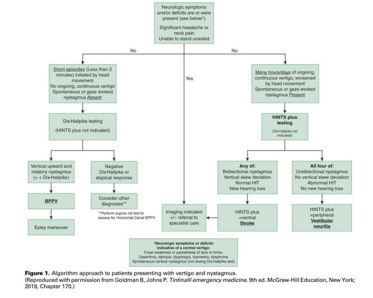
  

### Akuutissa tensionaalisessa huimauksessa hyvä hoitokeino EI ole:

- a. Asentohoito
- b. Kipulääke
- c. Lihasrelaksantti
- d. Liikunta

  <button class="solution-button"
          data-label="Vastaus"
          data-hide-label="Piilota vastaus">
    Vastaus
  </button>
  

a

---

Asentohoito on hyvänlaatuisen asentohuimauksen hoitokeino.

b, c, d: Niska-hartiaseudun rentouttavat harjoitteet ja liikunta on suositeltavia. Akuutissa tilanteessa lääkehoidoksi sopii kuuriluonteisesti käytettävät kipulääke ja lihasrelaksantti kuten akuutin tensionaalisen päänsäryn hoidossakin. Amitriptyliiniä tai nortriptyliiniä voidaan käyttää "estohoitona". 

  

### Mihin seuraavista on hoitona Epleyn manööveri:

- a. Pikkuaivoperäinen huimaus
- b. Tensionaalinen huimaus
- c. Hyvänlaatuinen asentohuimaus
- d. Molemminpuoleinen tasapainoelimen vajaatoiminta

  <button class="solution-button"
          data-label="Vastaus"
          data-hide-label="Piilota vastaus">
    Vastaus
  </button>
  

c

---

Hyvänlaatuinen asentohuimaus johtuu kaarikäytävän sakasta (otoconia), ja sen poistumista voidaan edesauttaa asentohoidolla (Epleyn manööveri, kun sakka on posteriorisessa kaarikäytävässä (n. 90% tapauksista); muille kaarikäytäville on omia manöövereitaan).

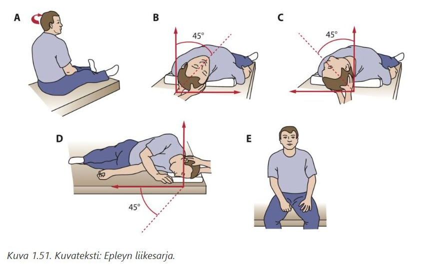
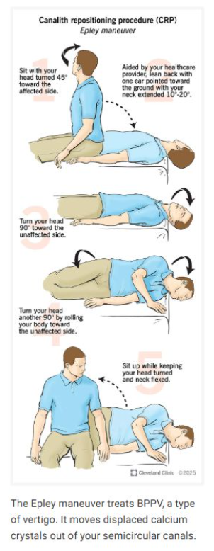
  

### Missä seuraavista oireiden alku EI yleensä ole äkillinen?

- a. Pikkuaivoinfarkti
- b. Vestibulaarineuroniitti
- c. Tensionaalinen huimaus
- d. Hyvänlaatuinen asentohuimaus

  <button class="solution-button"
          data-label="Vastaus"
          data-hide-label="Piilota vastaus">
    Vastaus
  </button>
  

c

---

Tensionaalinen huimaus on luonteeltaan kroonista ja pitkäkestoista sekä kehittyy yleensä vähitellen lihasjännityksen myötä. 

a: Verisuonitapahtumana tämä on erittäin äkillinen

b: Alku on tyypillisesti raju ja nopea

d: Huimauskohtaus alkaa välittömästi tietyssä pään liikkeessä (esim. sängyssä kylkeä kääntäessä)
  

### Mikä seuraavista on hyvänlaatuisen asentohuimauksen hoito:

- a. Glukokortikoidit
- b. Beetahistidiini
- c. Amitriptyliini
- d. Asentohoito

  <button class="solution-button"
          data-label="Vastaus"
          data-hide-label="Piilota vastaus">
    Vastaus
  </button>
  

d

---

Hyvänlaatuisella asentohuimauksella on spontaani paranemistaipumus, mutta paranemista voidaan edistää asentohoidolla, useimmiten Epleyn manööverillä.

  

### Tensionaalisessa huimauksessa:

- a. Huimaus on kiertävää eli karusellimaista
- b. Niskalihakset ovat jännittyneet
- c. Huimaus liittyy asennonvaihdoksiin
- d. Rombergin koe kaataa

  <button class="solution-button"
          data-label="Vastaus"
          data-hide-label="Piilota vastaus">
    Vastaus
  </button>
  

b

---

Niskaperäiselle huimaukselle on tyypillistä jatkuva pitkäkestoinen ("kuukausia, vuosia") intensiteetiltään vaihteleva huimaus. Siihen liittyy usein pään puristus- ("panta pään ympärillä") ja niskatuntemuksia samoin kuten niskaperäiselle päänsärylle

a: Tensionaalinen huimaus (proprioseptisen informaation häiriö) ilmenee useimmiten keinuttavana huimauksena.

c: Asennonvaihtoihin liittyvä huimaus on usein hyvänlaatuista asentohuimausta.

d. Rombergin testissä potilas voi huojua, mutta ei kaadu.

  

### Hyvänlaatuisessa asentohuimauksessa sakka (otoconia) kertyy useimmiten sisäkorvan

- a. Lateraaliseen kaarikäytävään
- b. Anterioriseen kaarikäytävään
- c. Posterioriseen kaarikäytävään
- d. Sacculukseen tai utriculukseen

  <button class="solution-button"
          data-label="Vastaus"
          data-hide-label="Piilota vastaus">
    Vastaus
  </button>
  

c

---

Otoliitteja utriculuksesta (soikea rakkula) kulkee semisirkulaarisiin kanaaleihin ja aiheuttaa tuntokarvojen ei-toivottua stimulaatiota -> Huimausta koetaan tyypillisesti pään asennonmuutoksissa otoliittien liikkuessa; erityisesti vuoteeseen käydessä tai vuoteessa käännyttäessä. 

Useimmiten (85-95%) otoliitteja on takimmaisessa (posteriorisessa) kaarikäytävässä, mutta voivat myös löytyä joskus horisontaalisesta kaarikäytävästä (5-15%). Superioriseen kaarikäytävään kertyminen on harvinaista. 

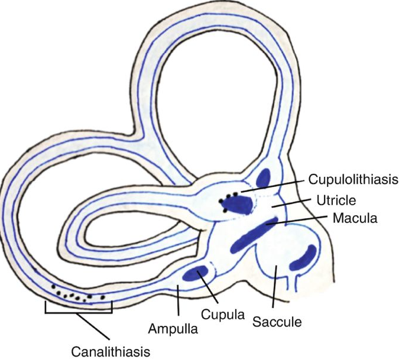
  

### Tension neckin oireisiin tai löydöksiin EI kuulu:

- a. Rajoittuneet niskan liikkeet
- b. Keinuttava huimaus
- c. Puristava päänsärky
- d. Nystagmus

  <button class="solution-button"
          data-label="Vastaus"
          data-hide-label="Piilota vastaus">
    Vastaus
  </button>
  

d

---

Silmävärve syntyy tasapainoelimen tai aivojen silmää kontrolloivien alueiden häiriöstä; tension neck on tuki- ja liikuntaelinsairaus, joka ei vaikuta näihin hermoratoihin

a: Niskalihasten kireys rajoittavat pään kääntämistä ja taivuttamista.

b: Jännitysniskaan liittyy usein nimenomaan keinuttava tai epävarma huimaus. Se johtuu niskan proprioseptiikan (asentotuntoaistimusten) häiriintymisestä, kun lihaskireys lähettää aivoille ristiriitaista tietoa pään asennosta

c: Niskaperäinen huimaus ja jännityspäänäsrky kulkevat käsi kädessä. Päänsärky on tyypillisesti "pantamainen", puristava ja molemminpuoleinen.
  

### Vestibulaarineuroniitin huimaukseen EI kuulu:

- a. Voimakas kiertohuimaus
- b. Nystagmus
- c. Provosoituminen vain tietyssä asennossa
- d. Normaali kuulo

  <button class="solution-button"
          data-label="Vastaus"
          data-hide-label="Piilota vastaus">
    Vastaus
  </button>
  

c

---

Vestibulaarineuroniitissa huimaus ei provosoidu vain tietyssä asennossa, toisin kuin hyvänlaatuisessa asentohuimauksessa. Vestibulaarineuroniittiin liittyy voimakas kiertohuimaus ja spontaani horisontalis-rotatorinen nystagmus terveeseen korvaan päin. Siihen ei liity kuulo-oireita.

  

### Proprioseptisen- eli asentotuntoinformaation häiriötä voi aiheuttaa esim. niska- ja hartiaseudun lihasjännitys.

- a. Oikein
- b. Väärin

  <button class="solution-button"
          data-label="Vastaus"
          data-hide-label="Piilota vastaus">
    Vastaus
  </button>
  

a

---

Niskassa on paljon proprioreseptoreita ja niska- ja hartiaseudun jännitystilassa proprioreseptorit ovat ylistimuloituja aiheuttaen kiihtynyttä informaatiota keskushermoston tasapainokeskukseen.

  

### Dix-Hallpiken testillä voidaan diagnosoida:

- a. Vestibulaarineuroniitti
- b. Menieren tauti
- c. Hyvänlaatuinen asentohuimaus
- d. Sentraalinen huimaus

  <button class="solution-button"
          data-label="Vastaus"
          data-hide-label="Piilota vastaus">
    Vastaus
  </button>
  

c

---

Dix-Hallpiken testiä käytetään posteriorisen kaarikäytävän hyvälaatuisen asentohuimauksen (BPPV) diagnosoimiseen. Joskus kivi voi olla horisontaalisessa kaarikäytävässä. Tällöin diagnostiikassa käytetään muun muassa Supine roll -testiä tai Rahkon walk-rotate-walk (WRW) -testiä. 

Dix-Hallpiken testi suoritetaan näin 

<li>Potilas istuu tutkimuspöydällä jalat suorina</li>
<li>Käännä potilaan pää n. 45 astetta testattavalle puolelle</li>
<li>Potilas ohjataan makuuasentoon niin, että lopulta pää on tutkimuspöydän yli ja sitä tuetaan 30 asteen ekstensiossa</li>
<li>Katso silmiä ja arvioi nystagmusta</li>

---

Kiertohuimaus alkaa sekuntien viiveen jälkeen ja kestää tavallisesti kymmeniä sekunteja. Samalla nähdään vertikaalis-rotatorinen sairaan korvan puolelle kiertävä nystagmus; kestää tavallisesti n. 10-30s

  

### Missä seuraavista määräisit potilaalle hoidoksi beetahistidiiniä?

- a. Vestibulaarineuroniitti
- b. Hyvänlaatuinen asentohuimaus
- c. Tensionaalinen huimaus
- d. Menieren tauti

  <button class="solution-button"
          data-label="Vastaus"
          data-hide-label="Piilota vastaus">
    Vastaus
  </button>
  

d

---

Ménièren taudin kohtausten ensilinjan estohoito on elämäntapamuutokset (stressin vähentäminen ja suolarajoitus) ja lääkehoito. 

Lääkehoidosta peruslääkkeenä on käytetty beetahistiiniä (aloitusannos on 24 mg × 2, ja ylläpitoannos tilanteen rauhoituttua on 12–24 mg × 2. Voinnin vakaannuttua lääkityksen voi purkaa asteittain pois.), diureettia (esim. hydroklooritiatsidi) tai näiden yhdistelmää. Kohtausten varalle kotiin myös antiemeettejä reseptille.
  

### Menieren taudin aiheuttaa:

- a. Sisäkorvan tulehdus
- b. Akustikusneurinooma
- c. Sisäkorvan kaarikäytävään kertynyt sakka
- d. Endolymfan lisääntynyt määrä sisäkorvassa

  <button class="solution-button"
          data-label="Vastaus"
          data-hide-label="Piilota vastaus">
    Vastaus
  </button>
  

d

---

Menieren taudissa endolymfan määrä on lisääntynyt sisäkorvassa = idiopaattinen endolymfaattinen hydrops. Tasapainoelimen nestetilojen, peri- ja endolymfan ionipitoisuuksien ajatellaan häiriintyvän ja sen seurauksena tasapainoelimen toiminta häiriintyy kohtauksellisesti

a: Sisäkorvan tulehdus (labyrinthiitti) on vakava infektio

b: Akustikusneurinooma on kuulo-tasapainohermon hyvänlaatuinen, harvinainen kasvain.

c: Hyvänlaatuisessa asentohuimauksessa kaarikäytävään kertynyt sakka aiheuttaa oireet. 

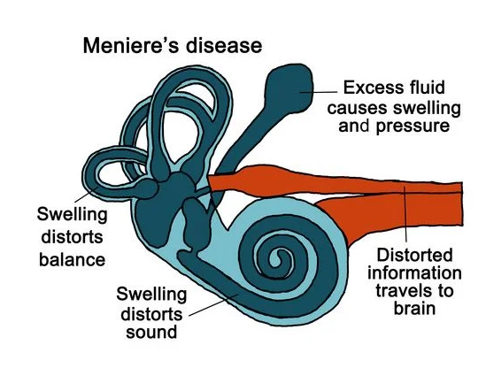
  

### Menieren taudin kohtauksessa EI esiinny:

- a. Näköhäiriöitä
- b. Nystagmusta
- c. Pahoinvointia ja oksentelua
- d. Kiertohuimausta

  <button class="solution-button"
          data-label="Vastaus"
          data-hide-label="Piilota vastaus">
    Vastaus
  </button>
  

a

---

Tyypilliset oireet ovat 4H:ta

<li>Huimaus (voimakas kiertohuimaus); kohtauksen aikana voi esiintyä nystagmusta</li>
<li>Humina (suhina, paineen tunne korvassa)</li>
<li>Huonokuuloisuus matalilla äänillä (sensorineuraalinen)</li>
<li>Huonovointisuus, oksentelu</li>

  

## Liikehäiriöt 

### Essentiaalinen vapina

- a. On epäsymmetristä
- b. Potilailla on muita neurologisia poikkeavuuksia
- c. Alkoholi lievittää
- d. On lepovapinaa

  <button class="solution-button"
          data-label="Vastaus"
          data-hide-label="Piilota vastaus">
    Vastaus
  </button>
  

c

---

Pienehkön alkoholimäärän nauttiminen vaimentaa tilapäisesti vapinan jopa 80 %:lla potilaista. Ei kuitenkaan suositella hoidoksi, sillä on terveellisimpiäkin hoitomuotoja olemassa; on kuitenkin hyvä osata kysyä potilaalta, että miten alkoholi vaikuttaa vapinaan, koska se vahvistaa essentiaalisen vapinan kliinistä diagnoosia. 

a: ET on symmetristä, yleensä molemmissa yläraajoissa 

b: ET:n diagnostisissa kriteereissä on kriteeri, että ei todeta muuta neurologista poikkeavuutta (poikkeuksena lievät statuslöydökset ET+ oireistossa). ET+ siis tarkoittaa essentiaalista vapinaa, jossa on lisäksi todettavissa lieviä neurologisia statuslöydöksiä (ns. soft signs), kuten lievä askelen epävarmuus, lievää dystonista asentoilua, lievä kognitiivinen alentuma, lievä neuropatia, lepovapina (ilman muita parkinsonismin piirteitä). Nämä eivät kuitenkaan siis kuulu tyypilliseen essentiaaliseen vapinaan 

d: ET:n vapina on aktiovapinaa; lepovapina on tyypillisempää Parkinsonin taudille   
  

### Essentiaalisen vapinan ensisijainen lääkehoito on:

- a. Propranololi
- b. Diatsepaami
- c. Dopamiiniagonisti
- d. Amitriptyliini

  <button class="solution-button"
          data-label="Vastaus"
          data-hide-label="Piilota vastaus">
    Vastaus
  </button>
  

a

---

Ensisijainen lääkehoito on epäselektiivinen beetasalpaaja, ensisijaisesti propranololi, riittävän isolla annoksella.

Lääkitystä käytetään yleensä säännöllisesti, mutta lievemmissä tapauksissa voidaan käyttää myös vain tarvittaessa. Perusterveydenhuollossa voi kokeilla hoitona myös gabapentiiniä, jos beetasalpaaja ei auta tai sille on kontraindikaatio (esim. pahentaa astmaa). Erikoissairaanhoitoon lähetetyissä vaikeissa tapauksissa voidaan lääkehoitona kokeilla mm. primidonia, klonatsepaamia tai topiramaattia. Myös DBS-hoito on hyvä vaihtoehto vaikeaoireiselle potilaalle, joka soveltuu DBS-hoitoon.

  

### Terveyskeskuksen vastaanotolle tulee 80-vuotias mies vapinan ja tasapaino-ongelmien vuoksi. Potilas kertoo huomanneensa aika ajoin oikeassa kädessä hetkellistä vapinaa kävellessä, vapina ei ole jatkuvaa. Tasapaino on heikentynyt ja herkästi kompastelee epätasaisessa maastossa esimerkiksi marjastaessa. Neurologisessa statustutkimuksessa toteat potilaan ryhdin hieman etukumaraksi, oikean käden myötäliike on vaimeampi kuin vasemmalla ja oikeassa kädessä näkyy hetkittäin kävellessä pyörittävää vapinaa. Oikeassa yläraajassa toteat lievää hammasratasmaista rigiditeettiä. Oireiden ja löydösten perusteella epäilet Parkinsonin tautia. Miten toimit?

- a. Aloitan potilaalle levodopa-lääkityksen
- b. Teen kiireettömän lähetteen neurologille
- c. Aloitan potilaalle dopamiiniagonistilääkityksen
- d. Teen päivystyslähetteen neurologille

  <button class="solution-button"
          data-label="Vastaus"
          data-hide-label="Piilota vastaus">
    Vastaus
  </button>
  

b

---

Parkinsonin taudin diagnostiikka ja hoidon aloitus kuuluu ESH:n tehtäviin. Kyseessä ei ole hätätilanne, joten kiireetön lähete neurologialle riittää. 
  

### Dopamiiniagonistit Parkinsonin taudin hoidossa

- a. Haittavaikutuksena esiintyy usein dyskinesioita
- b. Puoliintumisaika on lyhyt, vain n. 1,5 h
- c. Kokeillaan, jos muista lääkkeistä ei ole apua
- d. Eri lääkeaineilla ei ole osoitettu olevan tehoeroja

  <button class="solution-button"
          data-label="Vastaus"
          data-hide-label="Piilota vastaus">
    Vastaus
  </button>
  

d

---

Lääkkeiden välillä kyllä on pieniä eroja, mutta ne ovat suunnilleen yhtä tehokkaita Parkinsonin taudin hoidossa. Useimmiten käytettyjä ovat pramipeksoli (esim. Sifrol), ropiniroli (esim. Requip) ja rotigotiini (esim. Neupro-laastari). Rotigotiini on ainoa, jonka saa laastarivalmisteena. Pramipeksolin on todettu olevan tehokkain samanaikaiseen masennukseen. 

a: Dyskinesiat ovat ensisijaisesti levodopahoidon haittavaikutus. Dopamiiniagonistit aiheuttavat yleensä vähemmän dyskinesioita kuin levodopa. Tämä on yksi keskeisimmistä syistä sille, miksi erityisesti nuoremmilla potilailla hoidon aloittamista dopamiiniagonistilla suositaan

b: Pitkän vaikutusajan vuoksi ne annostellaan kerran vuorokaudessa. Dopamiiniagonistien vaikutusaika on yleensä pidempi kuin perinteisen levodopan. Ne tarjoavat aivoille tasaisemman ja jatkuvamman stimulaation.

c: Dopamiiniagonistit ovat tavallinen aloituslääke, varsinkin lieväoireisilla alle 60-65-vuotiailla ja kognitiivisesti & psyykkisesti terveillä. Alkuvaiheen lääkehoidon valintaan vaikuttavat mm. potilaan ikä, oireiden voimakkuus ja ei-motoriset oireet. Päätös on aina yksilöllinen. Lopulta kaikki potilaat kyllä tarvitsevat levodopaa. 

  

### Vaskulaariseen parkinsonismiin EI viittaa:

- a. Alaraajojen kömpelyys ja kävelyvaikeudet
- b. Hyvä levodopavaste
- c. Lievä symmetrinen vapina, josta on vain vähäistä subjektiivista haittaa
- d. Potilaalla on vaskulaarisia riskitekijöitä

  <button class="solution-button"
          data-label="Vastaus"
          data-hide-label="Piilota vastaus">
    Vastaus
  </button>
  

b

---

Vaskulaarinen parkinsonismi (eli verenkiertohäiriöperäinen parkinsonismi; taustalla siis pienet infarktit) eroaa merkittävästi idiopaattisesta Parkinsonin taudista juuri lääkevasteensa osalta. Vaskulaarisessa parkinsonismissa aivojen dopamiiniradat eivät yleensä ole ensisijaisesti rappeutuneet, vaan vaurio on rakenteellinen (pienet infarktit tai valkean aineen muutokset). Tästä syystä levodopa-lääkitys auttaa yleensä huonosti. 

a: Tämä on vaskulaarisen parkinsonismin tyyppioire. Sairautta kutsutaan usein "lower body parkinsonismiksi", koska oireet painottuvat jalkoihin yläraajojen sijaan: kävely on hidasta, lyhytaskelista ja jalat tuntuvat liimautuvan lattiaan.

c: Toisin kuin Parkinsonin taudissa, jossa lepotärinä on usein toispuoleista ja voimakasta, vaskulaarisessa muodossa vapina on usein vähäistä tai puuttuu kokonaan. Jos sitä on, se on tyypillisesti symmetristä.

d: Tämä on diagnoosin edellytys. Potilaalla on yleensä taustalla verenpainetauti, diabetes, tupakointia tai aiempia aivoverenkiertohäiriöitä. Näkyvät yleensä aivojen magneettikuvassa pienten suonten tautina.
  

### Parkinson plus -sairauksissa esiintyviä oireita EI ole:

- a. Pään ja käsien aktiovapina
- b. Supranukleaarinen katsepareesi eli ylöspäin katsominen ei onnistu
- c. Nopeasti alkavat vaikeat autonomiset oireet
- d. Kognitiivinen heikentyminen jo taudin alkuvaiheessa

  <button class="solution-button"
          data-label="Vastaus"
          data-hide-label="Piilota vastaus">
    Vastaus
  </button>
  

a

---

Atyyppiset parkinsonismit eli ns. Parkinson plus -oireyhtymät tarkoittavat sairauksia, joihin liittyy parkinsonismin lisäksi jokin muu löydös. Tärkeimpiä ovat:

<li>Progressiivinen supranukleaarinen halvaus (PSP = rajoittuneet vertikaaliset silmänliikkeet)</li>
<li>Monisysteemiatrofia (MSA = huomattava ortostaattinen hypotonia tai virtsainkontinenssi jo alkuvaiheessa)</li>
<li>Kortikobasaalinen oireyhtymä (CBS = hyvin toispuolinen raajajäykkyys, raaja saattaa vääntyä dystoniseen pakkoasentoon, ”alien hand” -ilmiö (käsi toimii itsenäisesti) ja apraksia)</li>
<li>Myös dementia Lewyn kappaleiden kanssa (Dementia with Lewy Bodies, DLB) eli Lewyn kappale -tauti kuuluu usein Parkinson plus-diagnooseihin. Sille on tyypillistä kognitiivinen alenema ennen motorisia oireita tai viimeistään vuoden sisällä motoristen oireiden alusta (ns. 1-year rule)</li>

  

### Kognition heikkeneminen on Parkinsonin taudin varhaisoire

- a. Oikein
- b. Väärin

  <button class="solution-button"
          data-label="Vastaus"
          data-hide-label="Piilota vastaus">
    Vastaus
  </button>
  

b

---

Kognition heikkeneminen ei ole Parkinsonin taudin varhaisoire. Mikäli kognition heikkeneminen liittyy jo varhaisvaiheessa ekstrapyramidaalioireisiin, on kyseessä todennäköisesti Lewyn kappale -tauti (1-year rule). 

Parkinson-dementia kehittyy yleensä vasta vuosien tai vuosikymmenten sairastamisen jälkeen. Tilastollisesti noin 50–80 % Parkinson-potilaista sairastuu jossain vaiheessa dementiaan, mutta tämä tapahtuu tyypillisesti taudin myöhäisvaiheessa
  

### Edenneen Parkinsonin taudin hoidossa

- a. Levodopahoito on stimulaattorihoitoa merkittävästi tehokkaampi hoito
- b. Apomorfiinia voidaan annostella s.c. kerran kuukaudessa
- c. Levofopainfuusio s.c. sopii edenneeseen tautiin, kun tilanvaihteluita ei saada hallintaan
- d. Stimulaattorihoitoa aloitettaessa potilaalla tulee olla vielä levodopalle vastetta

  <button class="solution-button"
          data-label="Vastaus"
          data-hide-label="Piilota vastaus">
    Vastaus
  </button>
  

d

---

Parkinsonin taudin edenneessä vaiheessa oirekuva alkaa usein vaatimaan laiteavusteista hoitoa. Käytettävissä on muutama eri hoitomuotoa ja hoito valitaan yksilöllisesti

<li>syväaivostimulaatio eli deep brain stimulation (DBS); stimulaatiohoitoa aloitettaessa levodopalle on oltava vielä vastetta, muuten sen teho on heikko. Stimulaatiohoidon teho on keskimäärin sama kuin lääkkeellisten hoitojenkin.</li>
<li>neuro-HIFU (ei sinänsä laite, vaan ultraäänellä tehtävä operaatio)</li>
<li>jatkuva levodopa-karbidopa- tai levodopa-karbidopa-entakaponi-infuusiopumppu suoleen</li>
<li>jatkuva foslevodopa/foskarbidopa-infuusiopumppu s.c.; huom ei siis tyypillistä levodopaa -> c väärin</li>
<li>apomorfiini-infuusiopumppu s.c.; apoformiinin puoliintumisaika on lyhyt, joten sitä tulee annostella ihon alle 1-10 x päivässä tai jatkuvana infuusiona.</li>

  

### Parkinsonin taudin vapinan luonteesta VÄÄRIN:

- a. Alkuvaiheessa symmetristä
- b. Laajaa ja hidastaajuista
- c. Vaimenee tai häviää liikkeessä
- d. Voi esiintyä sormissa, raajoissa, leuassa ja perioraalisesti

  <button class="solution-button"
          data-label="Vastaus"
          data-hide-label="Piilota vastaus">
    Vastaus
  </button>
  

a

---

Parkinsonin taudissa oireisto on yleensä etenkin taudin alkuvaiheessa epäsymmetristä. Edenneessäkin vaiheessa oireisto on usein toisella puolella vahvempi.
  

### Ekstrapyramidaalijärjestelmän vaurio voi olla hypokineettinen, jolloin liike vähenee, tai hyperkineettinen, jolloin syntyy poikkeavia ja tahattomia liikkeitä. Sairaus, missä nähdään hypokineettinen liikehäiriö seuraavista on:

- a. Essentiaalinen vapina
- b. Parkinsonin tauti
- c. Dystoninen vapina
- d. Levottomat jalat

  <button class="solution-button"
          data-label="Vastaus"
          data-hide-label="Piilota vastaus">
    Vastaus
  </button>
  

b

---

Hypokinesialla tarkoitetaan liikkeiden hitautta ja jähmeyttä. Siinä voidaan erottaa akinesia eli liikkeen aloittamisen hitaus ja spontaanin liikehdinnän vähentyminen sekä bradykinesia eli liikesuorituksen hitaus. Usein tällaista jakoa ei kuitenkaan tehdä, vaan termejä käytetään toistensa synonyymeinä.

Parkinsonin tauti on tyypillisin sairaus, jossa esiintyy hypokinesiaa. Pelkästään akinesiaa ilman muita parkinsonismilöydöksiä havaitaan joskus iäkkäillä ihmisillä. Tämän ajatellaan johtuvan aivojen frontobasaalisten osien degeneraatiosta.

a, c ja d ovat kaikki hyperkineettisiä häiriöitä. 

a: Kyseessä on tahaton ylimääräinen liike (vapina), joka voimistuu toiminnassa

c: Tahattomia liikkeitä (dyskinesioita) ovat dystonia, korea, atetoosi, hemiballismi, myoklonus ja tic. Dystonialla tarkoitetaan liikehäiriötä, jossa tahattomat lihassupistukset aiheuttavat kiertäviä ja toistuvia liikkeitä ja epänormaaleja asentoja. Dystoniat voi jaotella ilmiasun perusteella paikallisiin, segmentaalisiin, multifokaalisiin ja yleistyneisiin dystonioihin sekä hemidystoniaan. Dystonia voi esiintyä isoloituneena tai yhdistyneenä muuhun neurologiseen oireeseen. Paikallisia dystonioita ovat mm. servikaalinen dystonia, blefarospasmi (luomikouristus), spasmodinen dysfonia, toimintaspesifiset dystoniat (esim. kirjoittajan kramppi eli mogigrafia). Kervikaalinen dystonia ylivoimaisesti yleisin aikuisiän dystonia, muut mainitut sen jälkeen seuraavaksi yleisempiä. Yleisin sairastumisikä kervikaaliseen dystoniaan on 30–50 vuotta, ja tauti on naisilla kaksi kertaa yleisempi kuin miehillä. Oireet alkavat vähitellen: pää kiertyy tahattomasti (torticollis), tai kääntyy sivulle (laterocollis), taakse (retrocollis) tai harvemmin eteen (antecollis). Tavallisimmassa muodossa pää kiertyy ja kääntyy sivulle ja taakse. Samalla kiertymisen puoleinen hartia nousee.
Hoitona paikallisissa dystonioissa käytetään yleensä botuliinia ruiskutettuna liian aktiivisiin lihaksiin

d: Potilaalla on pakottava tarve liikuttaa jalkojaan, eli oireena on nimenomaan liiallinen, tahaton liikeaktiviteetti (usein levossa)
  

### Pikkuaivoperäisessä vapinassa OIKEIN:

- a. Neurologisessa statuksessa ei ole muuta poikkeavaa
- b. Etiologia on aina tunnistettavissa
- c. On aina epäsymmetristä
- d. On aktiovapinaa

  <button class="solution-button"
          data-label="Vastaus"
          data-hide-label="Piilota vastaus">
    Vastaus
  </button>
  

d

---

Pikkuaivoperäinen vapina on klassisesti intentiovapinaa, joka tarkoittaa vapinaa, joka voimistuu liikkeen lähestyessä kohdetta; AKA kohdennusvapina. 

Aktiovapinaa tutkitaan siis kahdessa vaiheessa. Ensimmäiseksi potilasta pyydetään ojentamaan molemmat yläraajansa suoriksi eteen vaakatasoon kämmenet ylöspäin. Tässä asennossa esiintyvä vapina on kannatusasentovapinaa (posturaalinen vapina), joka on yleinen löydös esimerkiksi essentiaalisessa vapinassa. Vapinan voimakkuus ja symmetrisyys arvioidaan silmämääräisesti - tyypillisesti essentiaalisessa vapinassa vapina on jokseenkin samankaltaista molemmissa käsissä ja suhteellisen nopeataajuista (8-12 Hz) 

Toisessa vaiheessa potilas ohjataan suorittamaan kohdistusliikkeitä, kuten tekemään sormi-nenänpääkokeen tai koskettamaan vuorotellen omaa nenäänsä ja tutkijan sormea. Tässä tilanteessa havaittava vapina on kohdennusvapinaa (intentiovapina), joka kuuluu aktiovapinan alatyyppeihin. Jos vapina voimistuu liikkeen lähestyessä kohdetta, kyseessä on kohdennusvapina, joka voi viitata pikkuaivoperäiseen sairauteen. 

a: Neurologisessa statuksessa on yleensä myös muita pikkuaivo-oireita ja -löydöksiä kuten ataksiaa ja koordinaatiovaikeuksia. 

b: Etiologiana voi olla mm. alkoholi, MS-tauti tai pikkuaivojen kasvaimet ja aivoverenkiertohäiriöt, mutta etiologia jää usein myös epäselväksi. 

c: Alkoholin aiheuttama pikkuaivovapina on yleensä symmetristä, muista tekijöistä johtuvana se voi olla myös epäsymmetristä.

  

### Terveyskeskuksen vastaanotolle tulee 65-vuotias nainen suun seudun pakkoliikkeiden vuoksi. Perussairauksina potilaalla on skitsofrenia, verenpainetauti ja hyperkolesterolemia. Potilas tupakoi noin askin päivässä. Statuksessa potilas kävelee hitaasti, molemmissa yläraajoissa on lievää rigiditeettiä. Suun seudussa ja kielessä on jatkuvaa pyörittävää pakkoliikettä. Lääkityksenä potilaalla on käytössä lääkelistan mukaan kandesartaani 16 mg x1, atorvastatin 20 mg x1, risperidoni 6 mg x1, oksatsepaami 15 mg tarvittaessa 1-3 kertaa vuorokaudessa.  Mikä potilasta todennäköisimmin vaivaa?

- a. Parkinsonin tauti
- b. Huntingtonin tauti
- c. Tardiivi dyskinesia
- d. Servikaalinen dystonia

  <button class="solution-button"
          data-label="Vastaus"
          data-hide-label="Piilota vastaus">
    Vastaus
  </button>
  

c

---

Potilas käyttää risperidonia, joka on antipsykootti. Vaikka se onkin 2. polven lääke, niin niilläkin on riski antipsykooteille tyypillisille ekstrapyramidaalioireille (riski on kyllä merkittävästi isompi perinteisillä 1. sukupolven neurolepteillä). Tyypilliset oireet, kuten suun seudun, huulten ja kielen jatkuvat, märehtivät tai kiertelevät pakkoliikkeet (ns. oro-bucco-linguaalinen dyskinesia) ovat tardiivin dyskinesian ydinoireita. Statuksessa todettu hidas kävely ja molemminpuolinen rigiditeetti (jäykkyys) viittaavat lääkeparkinsonismiin, joka on eri asia kuin Parkinsonin tauti (primaarinen parkinsonismi). 

Antipsykoottien aiheuttamat ekstrapyramidaalioireet ja niiden ilmenemisjärjestyksen voi muistaa muistisäännöstä ADAPT: 

<li>Akuutti dystonia (pään/kaulan/kasvojen/kielen äkillisiä spasmeja); minuutteja-päiviä</li>
<li>Akatisia (levottomuus ja pakottava tarve liikkumiselle); päiviä-kuukausia</li>
<li>Parkinsonimaiset oireet (jäykkyys, vapina, bradykinesia, tasapainohäiriö); päiviä-kuukausia</li>
<li>Tardiivinen dyskinesia (hitaasti kehittyneitä pakottavia liikkeitä); kuukausia-vuosia</li>

---

a: Parkinsonin taudissa vapina on yleensä toispuoleista (ainakin alussa) ja lepotyyppistä. Suun alueen voimakkaat pakkoliikkeet eivät kuulu Parkinsonin taudin ensioireisiin (elleivät ne ole pitkään jatkuneet levodopa-hoidon sivuvaikutusta, jota tällä potilaalla ei ole)

b: Perinnöllinen sairaus, joka aiheuttaa laaja-alaisempaa koreaa (tanssitautia) ympäri kehoa sekä etenevää dementiaa

d: Tarkoittaa niskan alueen paikallista dystoniaa, joka kääntää päätä virheasentoon (torticollis); ei selitä suun pakkoliikkeitä tai yleistä liikkumisen hidastumista
  

### Vastaanotollesi tulee 75-vuotias mies yöllisten oireiden vuoksi, jotka ilmaantuneet viimeisen vuoden aikana. Puoliso kertoo, että potilas on öisin hyvin levoton ja puoliso joutunut siirtymään toiseen huoneeseen nukkumaan, koska potilas usein yöllä potkii ja huitoo. Kertaalleen potilas käynyt puolison kimppuunkin yöllä. Aamulla potilas ei muista näistä yöllisistä tilanteista mitään. Mistä on todennäköisesti kysymys?

- a. Yöllisistä epilepsiakohtauksista
- b. REM-unen aikaisista käytöshäiriöistä
- c. Levottomista jaloista
- d. Unikauhukohtauksista

  <button class="solution-button"
          data-label="Vastaus"
          data-hide-label="Piilota vastaus">
    Vastaus
  </button>
  

b

---

REM-unen käyttäytymishäiriö on melko harvinainen yleensä yli 60-vuotiailla esiintyvä häiriö, jossa normaalisti REM-unen aikana esiintyvä lihasatonia puuttuu ja potilaalla esiintyy unen sisältöön liittyvää motorista aktiivisuutta ja jopa väkivaltaista käytöstä. Puolella potilaista tämä häiriö liittyy keskushermoston degeneroivaan sairauteen ja saattaa edeltää muita oireita jopa vuosia. REM-unihäiriö ennakoi erityisesti alfa-synukleiinisairauksien (Parkinsonin tauti, multisysteemiatrofia, lewynkappaledementia) alkamista myöhemmin. REM-unen käyttäytymishäiriötä voi esiintyä myös nuorilla potilailla (usein yhdessä unissakävelyn kanssa), jolloin siihen ei liittyne lisääntynyttä neurodegeneratiivisen sairauden riskiä. 
 
a: Nämä ovat yleensä lyhytkestoisia (sekunneista muutamaan minuuttiin) ja liikkeet ovat tyypillisesti rytmisiä (kouristuksia) tai kaavamaisia. Monimutkaiset kamppailuliikkeet eivät ole epilepsialle tyypillisiä.

c: Tuntuu valveilla ollessa, yleensä nukkumaan mennessä epämiellyttävänä tuntemuksena jaloissa, joka pakottaa liikuttamaan niitä. Oireyhtymään kyllä usein liittyy PLMD (Periodic Limb Movement Disorder), jolle on tyypillistä jaksoittaiset toistuvat raajaliikkeet (ojennus-koukistusliikkeet, erityisesti jaloissa). 

d: Unikauhuhäiriöpotilas herää äkillisesti syvästä (N3) unesta huutaen ja henkeä haukkoen. Häntä on yleensä mahdotonta saada täysin hereille, ja kohtauksen jälkeen hän yleensä palaa nukkumaan heräämättä kunnolla välillä. Ei yleensä aiheuta monimutkaisia kamppailuliikkeitä eikä yleensä ala näin vanhalla iällä (yleisintä lapsilla). 

  

### Parkinsonin taudin oireena EI voi esiintyä:

- a. Ataksia
- b. Hypokinesia
- c. Akinesia
- d. Bradykinesia

  <button class="solution-button"
          data-label="Vastaus"
          data-hide-label="Piilota vastaus">
    Vastaus
  </button>
  

a

---

Hypokinesialla tarkoitetaan liikkeiden hitautta ja jähmeyttä. Siinä voidaan erottaa akinesia eli liikkeen aloittamisen hitaus ja spontaanin liikehdinnän vähentyminen sekä bradykinesia eli liikesuorituksen hitaus. Usein tällaista jakoa ei kuitenkaan tehdä, vaan termejä käytetään toistensa synonyymeinä. Nämä kaikki ovat Parkinsonin taudille tyypillisiä oireita

Ataksia tarkoittaa yksinkertaisesti liikkeen koordinaation häiriötä; ns. hapuilu. Tunnusomaista on liikesuoritusten muuttuminen haparoiviksi eli liikkeiden sujuvuus on häiriintynyt. Ataksia on yleensä merkki pikkuaivojen tai niiden ratayhteyksien sairaudesta tai viasta, mutta se voi johtua myös selkäytimen takajuosteiden vauriosta (sensorinen ataksia) tai joskus perifeerisestä sensorisesta neuropatiasta

  

### Dopamiiniagonistien kohdalla VÄÄRIN:

- a. Haittavaikutuksena voi olla jalkojen turvotusta
- b. Käytetään myös levottomat jalat -oireyhtymässä
- c. Aloitetaan, kun muista lääkkeistä ei ole enää apua
- d. Niillä on myös antidepressiivistä vaikutusta

  <button class="solution-button"
          data-label="Vastaus"
          data-hide-label="Piilota vastaus">
    Vastaus
  </button>
  

c

---

Dopamiiniagonistit ovat Parkinsonin taudin alkuvaiheissa yleisesti käytössä ensilinjan lääkkeenä, varsinkin nuorilla ja muuten hyvävointisilla. Kun teho ei enää riitä, niin on syytä aloittaa levodopa.

Dopamiiniagonistien (esim. ropiniroli/pramipeksoli/rotigotiini) tärkeimpiä haittoja ovat:

<li>pahoinvointi, oksentelu</li>
<li>ortostaattinen hypotensio</li>
<li>perifeeriset turvotukset</li>
<li>uneliaisuus (jopa äkilliset nukahtamiskohtaukset)</li>
<li>psykiatriset oireet (hallusinaatiot, psykoosit)</li>
<li>impulssikontrollin häiriö (esim. hallitsematon uhkapelaaminen tai hyperseksuaalisuus)</li>

  

### Essentiaaliselle vapinalle on tyypillistä

- a. Toispuoleinen käden lepovapina
- b. Symmetrinen käsien kannatteluvapina
- c. Toispuoleinen käden aktiovapina
- d. Symmetrinen käsien lepovapina

  <button class="solution-button"
          data-label="Vastaus"
          data-hide-label="Piilota vastaus">
    Vastaus
  </button>
  

b

---

Essentiaalisen vapinan (ET) diagnostiset kriteerit ovat: 

<li>Molemminpuolinen yläraajojen liikevapina (tai pään vapina ilman dystoniaa)</li>
<li>Ei muuta neurologista poikkeavuutta (poikkeuksena lievät statuslöydökset ET+ oireistossa)</li>
<li>Oireiden kesto vähintään 3 vuotta</li>
  <ul>
    <li>Kolmen vuoden raja on asetettu siksi, että monet muut sairaudet – ennen kaikkea Parkinsonin tauti – voivat alkuvaiheessa muistuttaa essentiaalista vapinaa. Jos vapina pysyy muuttumattomana (vain liikevapinana ilman muita oireita) kolmen vuoden ajan, on tilastollisesti erittäin epätodennäköistä, että kyseessä olisi Parkinson. Ennen kolmea vuotta voi ET olla kyllä työdiagnoosi ja epäily, mutta yleensä virallinen diagnoosi tehdään vasta 3v kohdalla.</li>
  </ul>

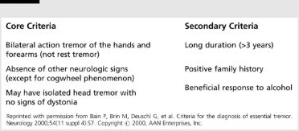
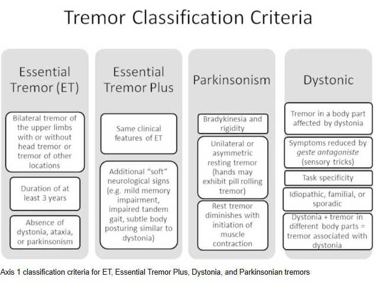
  

### Parkinsonin taudin oireet ovat pelkästään motorisia

- a. Oikein
- b. Väärin

  <button class="solution-button"
          data-label="Vastaus"
          data-hide-label="Piilota vastaus">
    Vastaus
  </button>
  

b

---

Parkinsonin tautiin liittyy laaja skaala ei-motorisia oireita, joita ovat mm. ummetus, unihäiriöt, masennus, kognition heikkeneminen ja impulssikontrollin häiriöt.

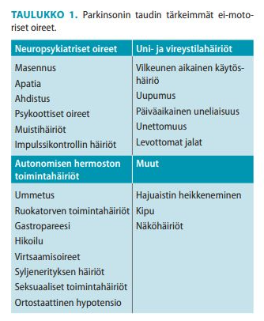
  

### Parkinsonin taudissa rappeutuu:

- a. Dopaminergiset hermoradat
- b. GABAergiset hermoradat
- c. Noradrergiset hermoradat
- d. Kolinergiset hermoradat

  <button class="solution-button"
          data-label="Vastaus"
          data-hide-label="Piilota vastaus">
    Vastaus
  </button>
  

a

---

Parkinsonin taudille on tyypillistä substantia nigrassa sijaitsevien dopaminergisten neuronien degeneraatio. Nigrostriataalinen rata siis tuhoutuu vähitellen ja tämä johtaa motorisiin oireisiin. Striatumin dopamiinipitoisuuden laskettua 60–80 % normaalista havaitaan ensimmäiset taudin oireet. Sen sijaan striatumin (nucleus caudatus + putamen) dopamiinireseptorit pääosin säilyvät taudin loppuvaihetta lukuun ottamatta.

  

### Essentiaalisen vapinan diagnostiikka tapahtuu erikoissairaanhoidossa ja perustuu pään TT - kuvaan

- a. Väärin
- b. Oikein

  <button class="solution-button"
          data-label="Vastaus"
          data-hide-label="Piilota vastaus">
    Vastaus
  </button>
  

a

---

Essentiaalisen vapinan diagnoosi perustuu ensisijaisesti hyvään anamneesiin ja statukseen. Diagnostiikka ja hoito tapahtuvat perusterveydenhuollossa.
  

### Levodopan vaikutusmekanismi

- a. Estää aivoissa dopamiinia hajottavaa MAO-B -entsyymiä
- b. Stimuloi aivojen dopamiinireseptoreita
- c. Muuttuu aivoissa dopamiiniksi
- d. Estää dopaminergisten ratojen toimintaa

  <button class="solution-button"
          data-label="Vastaus"
          data-hide-label="Piilota vastaus">
    Vastaus
  </button>
  

c

---

Levodopa (L-DOPA) on dopamiinin esiaste, joka pystyy läpäisemään veri-aivoesteen. Itse dopamiini ei siis läpäise -> Parkinsonin taudin hoidossa ei voi antaa suoraan dopamiinia

a: MAO-B-estäjiä voidaan käyttää Parkinsonin taudissa itsenäisesti tai levodopan ohella estämään dopamiinin hajoamista aivoissa. 

b: Levodopa ei itse toimi aktiivisena aivoissa, vaan se hajoaa dopamiiniksi ensin 

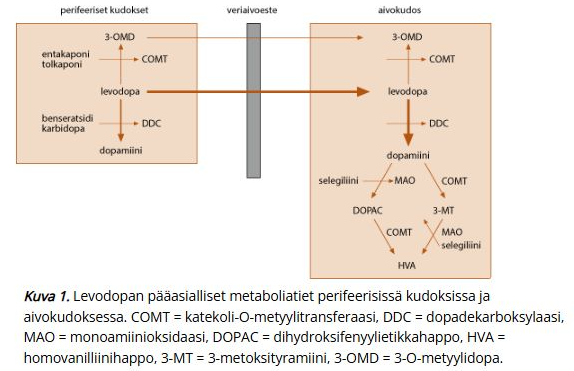
  

### Parkinsonin tautiin EI kuulu:

- a. Hienomotoriikan kömpelöityminen
- b. Hypomimia
- c. Hemipareesi
- d. Rigiditeetti

  <button class="solution-button"
          data-label="Vastaus"
          data-hide-label="Piilota vastaus">
    Vastaus
  </button>
  

c

---

Hemipareesi tarkoittaa toispuoleista lihasheikkoutta tai osittaista halvausta. Se viittaa yleensä ylemmän motoneuronin vaurioon, kuten aivoinfarktiin, aivoverenvuotoon tai kasvaimen aiheuttamaan vaurioon aivokuorella tai sisäkotelossa (capsula interna). Vaikka Parkinsonin taudin oireet alkavat tyypillisesti toispuoleisesti, kyse on kankeudesta, hitaudesta ja vapinasta – ei varsinaisesta lihasvoiman puutteesta (halvauksesta).

a: Johtuu hypokinesian ja rigiditeetin yhteisvaikutuksesta. Potilaan on vaikea esimerkiksi napittaa paitaa, käyttää ruokailuvälineitä tai kirjoittaa (käsiala muuttuu pieneksi, mikrografia).

b: Tämä tarkoittaa kasvojen ilmeikkyyden vähenemistä. Se johtuu kasvojen pienten lihasten hypokinesiasta ja on yksi tyypillisimmistä kliinisistä löydöksistä.

d: Tämä on yksi Parkinsonin taudin neljästä ydinoireesta. Se on passiivisen liikkeen aikana tuntuvaa vastusta, joka on usein tasaista ("lyijyputkimainen") tai nykivää ("hammasratasilmiö"), jos mukana on vapinaa.
  

### Ekstrapyramidaalijärjestelmän vauriossa statuslöydöksenä EI voi esiintyä:

- a. Normaalit jännevenytysheijasteet
- b. Rigiditeetti
- c. Vapina
- d. Positiivinen Babinski

  <button class="solution-button"
          data-label="Vastaus"
          data-hide-label="Piilota vastaus">
    Vastaus
  </button>
  

d

---

Positiivinen Babinski on pyramidiradan vaurion merkki (ylämotoneuronivaurio). 

Ekstrapyramidaalijärjestelmän vauriossa mahdollisia statuslöydöksiä ovat rigiditeetti ja vapina, raajaheijasteet ovat normaalit.

  

### Essentiaalinen vapina EI voi ilmetä:

- a. Pään alueella
- b. Yläraajoissa
- c. Äänessä
- d. Pelkästään suun ja leuan alueella

  <button class="solution-button"
          data-label="Vastaus"
          data-hide-label="Piilota vastaus">
    Vastaus
  </button>
  

d

---

Jos vapina rajoittuu pelkästään leuan, huulten tai kielen alueelle, se viittaa enemmän Parkinsonin tautiin tai lääkeaineen aiheuttamaan oireistoon. Essentiaalinen vapina ei tyypillisesti esiinny eristettynä alakasvojen alueella. 

a: Usein liike ilmenee koko päässä ja aiheuttaa ns. "ei-ei" (vaakasuuntainen) -liikettä.

b: Essentiaalisen vapinan yleisin ilmenemismuoto on yläraajoissa

c: Äänivapina on melko yleistä ET-potilailla; ääni voi affisioitua myös Parkinsonin taudissa, mutta ääni muuttuu monotoniseksi ja vaimeaksi vapinan sijasta 

  

### Levodopa Parkinsonin taudin aloituslääkkeenä

- a. Voidaan aloittaa nuorillakin potilailla, jos motoriset oireet ovat hyvin vaikeat
- b. Aloitetaan mahdollisimman suurella annoksella
- c. On yleensä aloituslääke vähäoireiselle potilaalle
- d. On yleensä aloituslääke kaikille

  <button class="solution-button"
          data-label="Vastaus"
          data-hide-label="Piilota vastaus">
    Vastaus
  </button>
  

a

---

Dopamiiniagonisteja (esim. ropiniroli, pramipeksoli tai rotigotiini) käytetään usein ainoana lääkkeenä taudin alkuvaiheessa. Ne aiheuttavat yleensä vähemmän dyskinesioita kuin levodopa, mikä on yksi keskeisimmistä syistä sille, miksi erityisesti nuoremmilla potilailla hoidon aloittamista dopamiiniagonistilla suositaan. 

Aikaisemmin on ollut käsitys, että levodopan aloitusta tulisi pyrkiä lykkäämään mahdollisimman pitkään, koska sen käyttö aikaistaisi dyskinesioiden ilmaantumista. Tämä on kuitenkin kumottu eli aikainen levodopahoito ei nopeuta sen tehon menetystä ja haittavaikutusten ilmaantumista -> nykyään levodopan aloitusta ei vältellä yhtä hanakasti kuin aikaisemmin. 

b: Aloitetaan pienellä annoksella ja titrataan siihen saakka, että oireet ovat minimissä. Jos aloittaa suurella annoksella, niin tulee helposti merkittäviä haittavaikutuksia. 

c: Vähäoireisilla ja nuorilla potilailla dopamiiniagonistit tai MAO-B-estäjät ovat usein ensisijaisia. 
  

### Essentiaalisen vapinan hoidossa ensisijaisena lääkehoitona on beetasalpaaja. Seuraavista väittämistä OIKEIN on:

- a. Voidaan käyttää jatkuvana tai tarvittaessa
- b. Beetasalpaajista huonoin vaihtoehto on propranololi
- c. Beetasalpaajan lisäksi muita lääkehoitovaihtoehtoja ei ole
- d. Hoito toteutetaan erikoissairaanhoidossa

  <button class="solution-button"
          data-label="Vastaus"
          data-hide-label="Piilota vastaus">
    Vastaus
  </button>
  

a

---

b: Ensisijaisesti juuri valitaan propranololi ja usein tarvitaan kohtalaisen suuri annos. 

c: Jos ei se tehoa, niin perusterveydenhuollossa voi kokeilla esim. gabapentiinä. 

d: Hoito toteutetaan ensisijaisesti perusterveydenhuollossa, mutta vaikeat tapaukset on syytä lähettää neurologin arvioon. Jos lääkehoito ei auta, niin joissakin tapauksissa voidaan harkita botuliinitoksiini-injektioita tai vaikeassa oireistossa syväaivostimulaatiota (DBS).

  

### Levodopan kohdalla VÄÄRIN:

- a. Aiheuttaa tilanvaihteluita pitkäaikaiskäytössä
- b. Aiheuttaa hyvin usein sekavuutta vanhuksille
- c. Aminohapot kilpailevat imeytymisestä levodopan kanssa, joten otettava 1 h ennen ruokailua
- d. Puoliintumisaika on lyhyt, vain n. 1,5 h

  <button class="solution-button"
          data-label="Vastaus"
          data-hide-label="Piilota vastaus">
    Vastaus
  </button>
  

b

---

Sopii käytössä olevista lääkkeistä parhaiten iäkkäille potilaille, sillä aiheuttaa muita lääkkeitä harvemmin sekavuutta. Levodopan haittavaikutukset ovat enemmänkin fyysisiä (dyskinesiat, on-off-tilanvaihtelut) kuin psyykkisiä (esim. psykoottiset oireet); vrt. dopamiiniagonistit, jotka taas aiheuttavat enemmän psyykkisiä oireita kuin fyysisiä 

c: Taudin alkuvaiheessa levodopan voi ottaa ruoan kanssa, jos kokee lääkkeestä pahoinvointia (annostelu ruoan kanssa auttaa pahoinvointiin), mutta myöhemmässä taudin vaiheessa levodopa on parasta ottaa n. tunti ennen ruokailua tyhjään vatsaan, koska valkuaispitoiset ruoat voivat vähentää sen imeytymistä.

d: Totta, tämän takia annostelutiheys on korkea. Alkuvaiheessa annostelutiheys on kolme kertaa päivässä; n. 5 t:n välein esim. klo 7, 12, 17, jos potilas on valveilla klo 7–22. Myöhemmin annoksien määrää usein nostetaan
  

### Vastaanotollesi tulee 50- vuotias nainen, jolla on ollut muutamien vuosien ajan hiljalleen lisääntyvää vapinaa molemmissa käsissä. Potilas kertoo vapinan olevan hankalampaa oikeassa kädessä. Vapina on hankalimmillaan tarkkaa työtä tehdessä ja esimerkiksi syöminen on hankaloitunut vapinan vuoksi. Vapina lisääntyy jännittävissä tilanteissa. Potilas kertoo huomanneensa, että alkoholi kuitenkin lievittää vapinaa. Statuksessa huomaat potilaan päässä ei-ei tyyppistä vapinaa. Molemmissa yläraajoissa on käsiä kannatellessa vapinaa. Muuten neurologinen status on normaali. Mikä potilasta todennäköimmin vaivaa?

- a. Essentiaalinen vapina
- b. MS-tauti
- c. Dystonia
- d. Parkinsonin tauti

  <button class="solution-button"
          data-label="Vastaus"
          data-hide-label="Piilota vastaus">
    Vastaus
  </button>
  

a

---

Molempien käsien aktiovapina, joka vahvistuu jännityksen myötä ja lievittyy alkoholilla. Pään alueella ei-ei-tyyppistä vapinaa (ei-ei -> ei-Parkinsonia; Parkinson affisioi pään alueella tyypillisesti vain leukaa ja suuta, ei koko päätä). Muuten neurologinen status normaali. 

Tästä herää vahva epäily essentiaalisesta vapinasta ja diagnoosin voi melkein asettaa suoraan, koska potilaalla on jo ollut oireita useita vuosia. 

  

### Levodopa

- a. Teho on hyvä myös ei-motorisiin oireisiin
- b. Tulee ottaa yhdessä dopadekarboksylaasin inhibiittorin kanssa, sillä hajoaa muuten nopeasti ennen keskushermostoon pääsyä
- c. Haittavaikutusten ilmetessä annosta tulee pienentää ja annosväliä harventaa
- d. Yleensä käytetään depotvalmisteita

  <button class="solution-button"
          data-label="Vastaus"
          data-hide-label="Piilota vastaus">
    Vastaus
  </button>
  

b

---

Levodopaa ei anneta käytännössä koskaan yksin, vaan sen tehokkutta lisätään vähintään dopadekarboksylaasin estäjillä (esim. karbidopa, benseratsidi) yhdistelmävalmisteena.

a: Tehoaa yleensä huonosti ei-motorisiin oireisiin. Motorisista oireista vaste on arvaamattomin vapinaan (noin kolmasosa potilaista kärsii vapinasta, joka ei reagoi levodopaan kunnolla, vaikka lääkeannosta nostettaisiin -> levodoparesistentti lepovapina )

c: Aiheuttaa pitkäaikaiskäytössä vaikutusajan lyhenemää, tilanvaihteluita ja dyskinesioita, joiden vuoksi levodopan annosta joudutaan usein pienentämään ja annosväliä tihentämään jopa 7-8 kertaa vuorokaudessa otettavaksi.

d: Pidempivaikutteisten depotvalmisteiden ongelmana on matalaksi jäävä lääkeaineen huippupitoisuus, joten yleensä käytetään standardivalmisteita. Depotvalmisteet voivat kuitenkin toimia hyvin esimerkiksi yöaikaisiin oireisiin.

  

### Ekstrapyramidaalijärjestelmän vauriossa statuslöydöksenä voi esiintyä:

- a. Halvausoire
- b. Klooniset raajaheijasteet
- c. Spastinen lihastonus
- d. Rigiditeetti

  <button class="solution-button"
          data-label="Vastaus"
          data-hide-label="Piilota vastaus">
    Vastaus
  </button>
  

d

---

Ekstrapyramidaaliradan vauriossa voi esiintyä potilaan raajoja passiivisesti liikutellen tuntuvaa jatkuvaa tai hammasratasmaista rigiditeettiä. 

a, b, c: Halvausoire, klooniset raajaheijasteet ja spastinen lihastonus kuuluvat pyramidiradan vaurioon liittyviin statuslöydöksiin. 

---

Ekstrapyramidaalijärjestelmään kuuluu nimensä mukaan kaikki ne aivojen motoriset tumakkeet ja radat, jotka eivät kuulu pyramidaalijärjestelmään

Pyramidaalijärjestelmään kuuluu kortikobulbaarinen (signaalit korteksilta aivorunkoon aivohermoihin) ja kortikospinaalinen radasto (signaalit korteksilta selkäytimeen), jotka tuottavat tahdonalaista liikettä. Nimitetään pyramidaalisiksi radoiksi, koska kulkevat medullaarisen pyramidin läpi (parilliset valkoisen aineen rakenteet medulla oblongatan anteriorisella puolella). Pyramidaalijärjestelmä on siis primaari motorinen aivokuori + sieltä laskevat ylemmät motoriset radastot (kortikospinaali ja -bulbaari)

Ekstrapyramidaalijärjestelmän radat taas eivät kulje pyramidien kautta. Järjestelmään kuuluu erityisesti tyvitumakkeet (basal ganglia eli n. caudatus, putamen, globus pallidus, substantia nigra ja n. subthalamicus), talamus ja ekstrapyramidaaliradastot (aksoniratoja, jotka laskevat aivorungosta kohti alempia motoneuroneita säätelemään liikettä; radastoja ovat esim. retikulospinaalinen, vestibulospinaalinen, rubrospinaalinen, tektospinaalinen) sekä pikkuaivot. 

Ekstrapyramidaalijärjestelmä ohjaavat ei-tahdonalaisesti liikkeiden suunnittelua ja säätelyä sekä liikesarjojen aikaansaamista. Säätelee myös tasapainorefleksejä. 

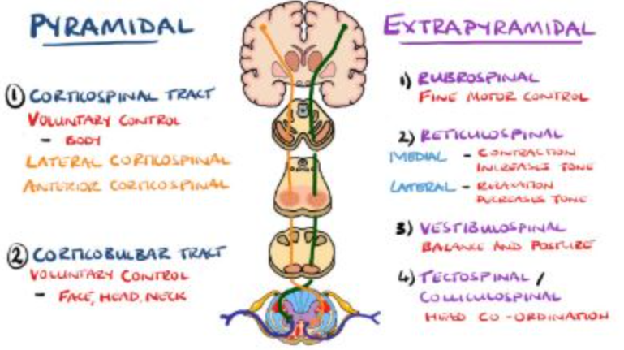
  

### Mikä seuraavista väittämistä on VÄÄRIN? Fysiologinen vapina:

- a. Taustalla on aina jokin neurologinen sairaus
- b. On aktiovapinaa
- c. Esiintyy hetkittäin
- d. Diagnoosi on kliininen

  <button class="solution-button"
          data-label="Vastaus"
          data-hide-label="Piilota vastaus">
    Vastaus
  </button>
  

a

---

Fysiologinen vapina on aktiovapinaa eli esiintyy liikkeen aikana. Se ilmenee hetkittäin, ei jatkuvana, ja on jonkin tekijän aiheuttamaa esim. katekoliamiinit, stimuloivat nautintoaineet, jokin lääkeaine tai aineenvaihduntasairaus (esim. hypertyreoosi) voi sitä korostaa. Diagnoosi on kliininen ja taustalla ei ole neurologista sairautta (nimensäkin mukaan fysiologista).

  

### Parkinsonin taudin diagnostiikasta OIKEIN:

- a. Geenitestaus tehdään kaikille potilaille
- b. Aivojen MRI on Parkinsonin taudissa tyypillisesti normaali
- c. Funktionaalinen aivokuvaus (beeta-CIT-SPECT/ DaTSCAN) tehdään aina diagnoosin varmistamiseksi
- d. Laboratoriotutkimukset eivät ole tarpeen

  <button class="solution-button"
          data-label="Vastaus"
          data-hide-label="Piilota vastaus">
    Vastaus
  </button>
  

b

---

a: Parkinsonin taudin taustalla on vain harvoin yhden geenin aiheuttama perinnöllinen mutaatio, joten geenitestaus tehdään vain erityistapauksissa (lähinnä, jos sukuanamneesi sopii vallitsevaan periytymistapaan, potilas on sairastuessaan alle 40-vuotias tai potilas on sairastuessaan 40-50 vuotias ja hänellä on positiivinen sukuanamneesi).

c: Funktionaalista kuvantamista voidaan käyttää tarvittaessa esim. jos potilaalla on epätyypillinen oirekuva tai erotusdiagnostisesti mietitään lääkeaineparkinsonismin mahdollisuutta. DaTSCAN eli dopamiinikuvantaminen voi auttaa erottamaan Parkinsonin taudin ei-degeneratiivisista tiloista, mutta ei erottele Parkinsonia ja Parkinson-plus-diagnooseja.

d: Laboratoriotutkimuksia (esim. PVK, TSH, Ca, Pi, B12-vit, Krea, ALAT) tehdään monesti erotusdiagnostikan vuoksi.
  

### Alkuvaiheen Parkinsonin taudille on tyypillistä ei-motorisina oireina ilmenevä

- a. REM-unen aikainen käytöshäiriö
- b. Näköharhat
- c. Ripuli
- d. Virtsankarkailu

  <button class="solution-button"
          data-label="Vastaus"
          data-hide-label="Piilota vastaus">
    Vastaus
  </button>
  

a

---

Periaatteessa REM-unen käytöshäiriö (RBD) on motorinen oire, mutta ilmenee unen aikana. REM-unen aikana esiintyvä lihasatonia puuttuu -> esiintyy unen sisältöön liittyvää motorista aktiivisuutta ja jopa väkivaltaista käytöstä. REM-unihäiriö ennakoi erityisesti alfa-synukleiinisairauksien (Parkinsonin tauti, multisysteemiatrofia, lewynkappaledementia) alkamista myöhemmin. 

Muita alkuvaiheen oireita ovat mm. hajuaistin heikkeneminen, ummetus, väsymys, lihaskivut ja masennus/ahdistuneisuus. 

b: Liittyvät lewyn kappale -tautiin 

c: Ummetus on yleinen Parkinsonin taudin esioireena

d: Virtsaamispakko tai -karkailu ovat yleisempiä taudin edetessä. Alkuvaiheessa ne ovat harvinaisia, ja niiden varhainen esiintyminen saattaa viitata johonkin Parkinson plus-oireyhtymään, erityisesti monisysteemiatrofiaan (MSA).

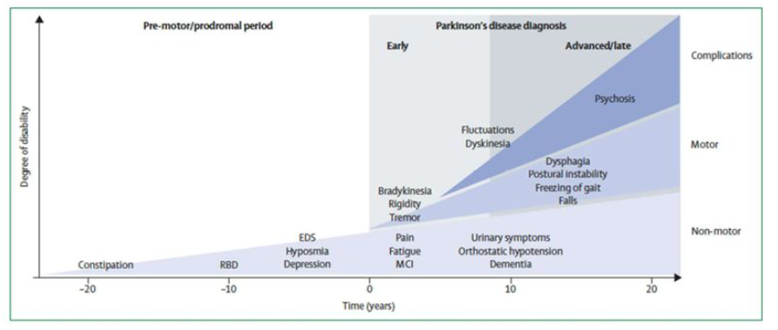
  

### Dopamiiniagonistien mahdollisiin haittavaikutuksiin EI kuulu:

- a. Vaikutusajan lyhenemä
- b. Näköharhat
- c. Impulssikontrollin häiriöt
- d. Sekavuus

  <button class="solution-button"
          data-label="Vastaus"
          data-hide-label="Piilota vastaus">
    Vastaus
  </button>
  

a

---

Psykoottiset oireet (sekavuus ja näköharhat) sekä impulssikontrollin häiriöt ovat Parkinsonin lääkkeistä juuri dopamiiniagonisteille yleisimpiä. Dopamiiniagonistien kanssa ei tyypillisesti ilmene vaikutusajan lyhenemää ja sen aiheuttamaa wearing-off-ilmiötä, vaan se on tyypillisempää levodopalle, kun taudin edetessä aivojen kyky varastoida dopamiinia heikkenee.
  

### Dyskinesialla tarkoitetaan

- a. Jäykkyyttä liikesarjojen suorittamisessa
- b. Vaikeutta suorittaa opittuja tahdonalaisia liikkeitä
- c. Liikkeiden hidastumista
- d. Poikkeavia tahattomia liikkeitä

  <button class="solution-button"
          data-label="Vastaus"
          data-hide-label="Piilota vastaus">
    Vastaus
  </button>
  

d

---

Kroonisen levodopahoidon aikana voidaan havaita dyskinesiaa (tahattomia liikkeitä), kun annoksen vaikutus ylittää terapeuttisen ikkunan ja toivotun "On"-vaiheen tason (peak-dose-dyskinesia). 

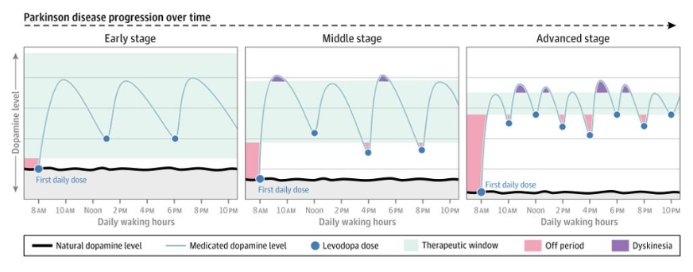
  

### Levodopa on ensisijainen aloituslääke kaikilla Parkinsonin tautia sairastavilla oireiden vaikeusasteesta ja potilaan iästä riippumatta

- a. Ei, sillä markkinoilla on tehokkaampiakin lääkkeitä, kuten MAO-B-estäjät
- b. Kyllä, sillä se on tehokkain markkinoilla oleva Parkinsonin taudin lääke
- c. Kyllä, sillä sen käytöllä ei ole pitkäaikaishaittoja
- d. Ei, sillä pitkäaikaisessa käytössä se aiheuttaa tilanvaihteluita ja dyskinesioita

  <button class="solution-button"
          data-label="Vastaus"
          data-hide-label="Piilota vastaus">
    Vastaus
  </button>
  

d

---

Levodopan varhainen aloittaminen ei itsessään näytä nopeuttavan on-off-ilmiön tai muiden haittojen syntymistä. Pitkään uskottiin, että levodopan käyttö pitäisi säästää viime hetkeen, mutta on osoitettu, että on-off-vaihtelut johtuvat ensisijaisesti itse sairauden etenemisestä, eivät lääkkeen käytetystä kokonaismäärästä tai hoidon kestosta

Tämä ajatus johti siihen, että levodopan aloittamista pyrittiin välttämään mahdollisimman pitkään. Nykyään tätä ajatusta ei ole, mutta ei levodopaa silti aloiteta automaattisesti kaikille, vaan ensilääkkeen valintaan vaikuttavat potilaan ikä, oireiden voimakkuus ja ei-motoriset oireet. Usein nuorilla lieväoireisilla potilailla ensisijaislääke on esim. dopamiiniagonisti. Lopulta kaikki potilaan kuitenkin tarvitsevat levodopaa; se on tehokkain lääke parkinsonin taudissa. 

  

### Vastaanotollesi tulee 75-vuotias mies kävelyvaikeuksien vuoksi. Viimeisen vuoden aikana huomannut liikkumisen hidastuneen ja kaatuilee herkästi. Anamneesia ottaessasi tulee esille, että puoliso on huolissaan potilaan lisääntyneistä muistiongelmista, potilas unohtelee keskusteltuja asioita ja sovittuja menoja. Potilas itse ei ole huomannut minkäänlaisia muistiongelmia. Puoliso kertoo, että naapureiden kanssa tullut ristiriitoja, kun potilas alkanut epäillä naapurin varastelevan työkaluja pihan puuvajasta. Tästä kysyttäessä potilas kertoo, että välillä nähnytkin, että pihalla joku hiippailee puuvajan ympärillä. Puoliso kertoo näissä tilanteissa olleensa paikalla ja kertoo, ettei ole pihalla nähnyt ketään, mutta potilas ei tätä tahdo uskoa. Neurologisessa statuksessa toteat kaikissa raajoissa lievää rigiditeettiä, joka korostuu kontra-aktivaatiossa. Kävellessä askelmitta on lyhentynyt ja käännökset hitaat. Ryhti on etukumara. Potilas on hypomiiminen. Mitä epäilet?

- a. Lewyn kappale -tauti
- b. Parkinsonin tauti
- c. Skitsofrenia
- d. Alzheimerin tauti

  <button class="solution-button"
          data-label="Vastaus"
          data-hide-label="Piilota vastaus">
    Vastaus
  </button>
  

a

---

Tässä korostuu kolme lewyn kappale -taudin ydinoiretta: parkinsonismi, kognitiivinen heikentyminen (ja erityisenä piirteenä ne fluktuoivat päivästä toiseen ja päivän aikanakin) ja näköhallusinaatiot (potilas näkee pihalla "hiippailijoita"). 

b: Parkinsonin taudissa motoriset oireet (kuten vapina ja kankeus) alkavat yleensä vuosia ennen muistiongelmia tai hallusinaatioita. Lewyn kappale -taudissa kognitiiviset oireet alkavat joko ennen motorisia oireita tai viimeistään vuoden sisällä motoristen oireiden alusta (ns. 1-year rule).

c: Skitsofrenia puhkeaa tyypillisesti nuorella aikuisiällä. 75-vuotiaana alkavat hallusinaatiot ja harhaluulot yhdistettynä liikuntakyvyn muutoksiin viittaavat useimmiten johonkin muuhun kuin psykoosisairauteen. Potilaalla myös ilmenee parkinsonismioireita, mikä vie ajatuksia pois skitsofreniasta. 

d: Alzheimerin taudissa muistioireet (uuden oppimisen vaikeus) ovat hallitsevia, mutta parkinsonismin oireet (kuten rigiditeetti) ja näköhallusinaatiot ilmaantuvat yleensä vasta taudin hyvin myöhäisessä vaiheessa.

---

Lewyn kappale -taudin diagnoosi on kliininen tai kliinis-biologinen:

<li>2 keskeistä kliinistä piirrettä TAI 1 keskeinen kliininen piirre + 1 biologinen löydös</li>
<li>1-year-rule (erotuksena Parkinson-dementiasta</li>

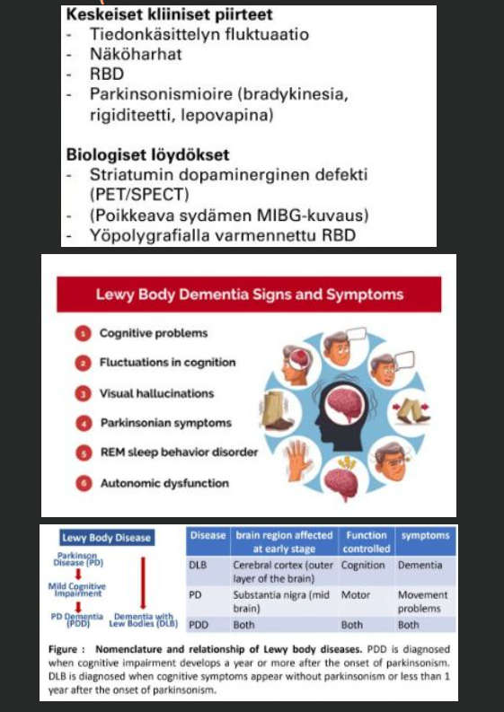
  

### Parkinsonin taudin diagnostiikka perustuu

- a. Levodopahoitokokeiluun
- b. Muiden syiden poissulkuun verikokeilla
- c. Neurologiseen statustutkimukseen
- d. Aivojen magneettitutkimuksen löydöksiin

  <button class="solution-button"
          data-label="Vastaus"
          data-hide-label="Piilota vastaus">
    Vastaus
  </button>
  

c

---

Parkinsonin taudin diagnoosista vastaavat neurologit; epäilyn herätessä potilas lähetetään neurologialle. Diagnoosi on ensisijaisesti kliininen ja perustuu eri vaiheisiin. Ensin pitää diagnosoida parkinsonismi, joka kriteerit ovat: 

<li>Hypokinesia (hidastunut liikkeen aloittaminen ja etenevä toistuvien liikesuoritusten hidastuminen ja laajuuden vähentyminen) + ainakin yksi seuraavista</li>
<li>rigiditeetti eli lihasjäykkyys</li>
<li>(4–6 Hz:n) lepovapina</li>
<li>tasapainon epävakaus (jota ei aiheuta visuaalinen, vestibulaarinen, pikkuaivoperäinen tai proprioseptiivinen häiriö)</li>

---

Ei-motoristen oireiden esiintymisestä (esim. hajuaistin heikentyminen, ummetus, RBD, väsymys, autonomisen hermoston häiriöt) voi saada lisätukea Parkinsonin tautia epäiltäessä

---

Verikokeilla sairautta ei voida todeta, mutta niitä usein määrätään, jotta voidaan varmistaa, että kyse ei ole jostain muusta sairaudesta. 

---

MRI-kuvantamista (toissijaisesti TT) käytetään usein toisten aiheuttajien poissulkemiseen; eivät siis osoita spesifisiä muutoksia. Valikoiduissa tapauksissa käytetään ns. dopamiinikuvantamista (CIT-SPECT “DatScan”) erottamaan degeneratiivisen parkinsonismin ei-degeneratiivista tiloista kuten essentiaalisesta vapinasta. Essentiaalisessa vapinassa, lääkeparkinsonismissa ja vaskulaarisessa parkinsonismissa dopaminergisen järjestelmän toiminta on normaalia, kun taas Parkinsonin taudissa se on poikkeavaa.

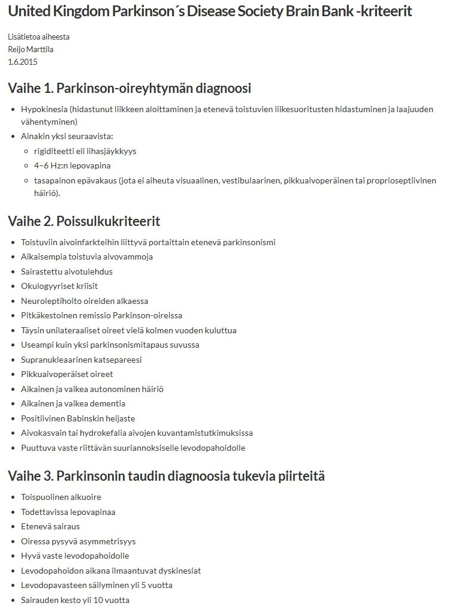
  

### Essentiaaliseen vapinaan EI kuulu:

- a. Bilateraalinen aktiovapina yläraajoissa
- b. Jatkuva tai usein toistuva esiintyminen
- c. Tyypilliset löydökset pään TT:ssä
- d. Osalla potilaista positiivinen sukuanamneesi

  <button class="solution-button"
          data-label="Vastaus"
          data-hide-label="Piilota vastaus">
    Vastaus
  </button>
  

c

---

Pään TT:tä ei tarvita diagnoosin tekemiseen, mutta jos se on muusta syystä tehty, niin siihen ei liity löydöksiä.

a: Essentiaalinen vapina on symmetristä aktiovapinaa. 

b: Ilmenee jatkuvasti tai vähintään fysiologistakin vapinaa korostavien tekijöiden pahentamana (esim. jännittyneisyys, stressi yms)

d: Yli 60 %:lla potilaista on positiivinen sukuanamneesi, periytyminen autosomissa dominantisti. Ei ole yksittäisiä tunnistettuja geenejä, joita seulottaisiin.

  

### Parkinsonin taudin nykylääkityksellä pyritään hidastamaan taudin etenemistä

- a. Väärin
- b. Oikein

  <button class="solution-button"
          data-label="Vastaus"
          data-hide-label="Piilota vastaus">
    Vastaus
  </button>
  

a

---

Lääkkeillä ei voida vaikuttaa taudin etenemiseen, vaan hoito on oireiden hillitsemistä.

  

### Lääkkeiden aiheuttamassa parkinsonismissa OIKEIN:

- a. Hoitona on dopamiiniagonistit
- b. Oireena lähinnä vapinaa eikä juurikaan rigiditeettiä
- c. Neuroleptit ovat yleisin aiheuttaja
- d. Oireet ilmaantuvat usein vuosia lääkkeen aloituksen jälkeen

  <button class="solution-button"
          data-label="Vastaus"
          data-hide-label="Piilota vastaus">
    Vastaus
  </button>
  

c

---

Neuroleptit (Varsinkin 1. sukupolven) ovat dopamiiniantagonisteja -> loogisesti aiheuttavat parkinsonimaisia oireita (Parkinsonin tauti juuri johtuu dopamiinivajeesta). Myös mm. metoklopramidi (pahoinvointilääke) on antidopaminerginen ja tunnettu ekstrapyramidaalioireiden aiheuttaja.

a: Hoitona on lääkkeen lopetus ja toipuminen tapahtuu yleensä muutamien kuukausien aikana.

b: Tyypillisesti potilaalla on symmetristä rigiditeettiä, vapina ei yleensä ole hallitseva oire.

d: Oireet ilmaantuvat yleensä muutaman kuukauden sisällä lääkkeen aloituksesta. Tardiivinen dyskinesia on se antipsykoottien haittavaikutus, joka ilmenee vuosien skaalalla 

  

### Parkinsonin taudin ei-motorisiin oireisiin EI kuulu:

- a. Autonomisen hermoston häiriöt
- b. Unihäiriöt
- c. Harhat
- d. Näköaistin heikkeneminen

  <button class="solution-button"
          data-label="Vastaus"
          data-hide-label="Piilota vastaus">
    Vastaus
  </button>
  

d

---

Parkinsonin tauti ei vaurioita silmän rakenteita (kuten verkkokalvoa) tai näköhermoa tavalla, joka aiheuttaisi perinteistä näön heikkenemistä.

a: Erittäin yleisiä; tyypillisimpiä oireita ovat mm. ummetus, ortostaattinen hypotensio, virtsaamishäiriöt ja hikoilun säätelyn ongelmat

b: Unihäiriöistä tunnetuin on REM-unen aikainen käytöshäiriö (RBD). Voi myös esiintyä mm. levottomien jalkojen oireyhtymää (RLS) tai liiallista päiväaikaista väsymystä (EDS; vaikka yöunet olisivat näennäisesti riittävät, potilas saattaa kärsiä voimakkaasta uupumuksesta ja nukahtelusta keskellä päivää)

c: Näköharhat (hallusinaatiot) ovat tyypillisiä erityisesti taudin edetessä. Ne voivat liittyä itse sairausprosessiin tai olla lääkityksen (erityisesti dopamiiniagonistien) aiheuttamia sivuvaikutuksia.

  

### Parkinsonin tautiin EI kuulu:

- a. Myötäliikkeiden väheneminen
- b. Refleksipoikkeavuudet
- c. Etukumara ryhti
- d. Askelmitan lyheneminen

  <button class="solution-button"
          data-label="Vastaus"
          data-hide-label="Piilota vastaus">
    Vastaus
  </button>
  

b

---

Parkinsonin taudissa todetaan tyypillisesti normaalit jänneheijasteet. Parkinsonin tauti on ekstrapyramidaalinen lliikehäiriö, eikä siihen kuulu pyramidiradan vaurion merkkejä kuten kiihtyneitä refleksejä

A,c ja d kuvailevat tyypillistä parkinsonistista kävelyä. Parkinsonin taudille on tyypillistä kävelyvaikeudet ja erityisesti tyypillistä on se, että kävelyn aloittaminen on hidasta, kävellessä askelpituus on lyhentynyt ja myötäliikkeet ovat vähentyneet tai poissa. Taudin edetessä potilaan asento muuttuu etukumaraiseksi ja tasapaino huononee. 

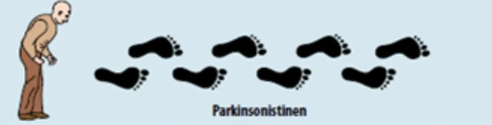
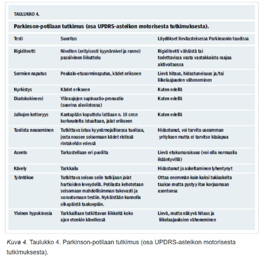
  

### Essentiaalisen vapinan hoidossa:

- a. Hoito parantaa ennustetta
- b. Neurogirurginen hoito (syväaivostimulaatio) on aiheellinen suurimmalle osalle
- c. Lääkehoidolla saadaan paras teho yläraajojen alueella
- d. Botuliinitoksiinihoito on ensisijainen hoitomuoto

  <button class="solution-button"
          data-label="Vastaus"
          data-hide-label="Piilota vastaus">
    Vastaus
  </button>
  

c

---

Essentiaalisen vapinan hoito on oireenmukaista, eli hoidetaan vain jos oireista on potilaalle haittaa. Ensisijainen hoito on lääkehoito (beetasalpaaja), ja jos oireita ei sillä saada hallintaan, voidaan joissain tapauksissa harkita botuliinitoksiini-injektioita ja vaikeassa vapinassa neurokirurgista hoitoa (DBS tai neuro-HIFU). Lääkehoito tehoaa raajoja huonommin pään ja äänen vapinaan.

  

### Lääkeparkinsonismia voivat aiheuttaa

- a. Verenpainelääkkeet (esim. ramipriili)
- b. Triptaanit (esim. sumatriptaani)
- c. Kolesterolilääkkeet (esim. rosuvastatiini)
- d. Pahoinvointilääkkeet (esim. metoklopramidi)

  <button class="solution-button"
          data-label="Vastaus"
          data-hide-label="Piilota vastaus">
    Vastaus
  </button>
  

d

---

Metoklopramidi on D2-dopamiiniantagonisti -> aiheuttaa dopamiiniantagonistien tapaan esktrapyramidaalioireita ja lääkeparkinsonismia. Tunnetuimmat ja yleisimmät aiheuttajat kuitenkin ovat neuroleptit. 
  

### Metaboliseen sairauteen liittyvässä vapinassa VÄÄRIN:

- a. Etiologiana on useimmiten alkoholi
- b. Esiintyy yleensä distaalisesti
- c. On yleensä aktiovapinaa
- d. Vapina on yleensä vain sairauden sivulöydös

  <button class="solution-button"
          data-label="Vastaus"
          data-hide-label="Piilota vastaus">
    Vastaus
  </button>
  

a

---

a: Metabolinen vapina on oheisoire metabolisesta sairaudesta, kuten hypertyreoosi, maksa- ja munuaissairaudet, B12-vitamiinin puutos ja polysytemia. Pitkäaikainen alkoholinkäyttö vaurioittaa usein erityisesti pikkuaivoja ja aiheuttaa vapinan lisäksi muita pikkuaivoperäisiä oireita.

b: Metabolinen vapina näkyy tyypillisesti raajojen kärkiosissa, kuten sormissa ja kämmenissä. Esimerkki tästä on maksan tai munuaisten vajaatoiminnan aiheuttama asterixis ("liver flap"; kts. alla), jossa kädet alkavat heilumaan niiden ekstension johdosta. Myös mm. CO2-retentio voi aiheuttaa tällaisia ns. ureemisia nykinöitä

c: Totta

d: Useimmiten vapina on vain sivulöydös ja muut sairauden oireet ovat hallitsevampia.

  

## Muistisairaudet 

### Mitä tarvitaan aivoverenkiertosairauden muistisairauden diagnoosiin?

- a. Tyypillinen oirekuva riittää
- b. Tyypillinen oirekuva ja laboratoriokoelöydökset
- c. Tyypillinen oirekuva ja kuvantamislöydökset
- d. Tyypillinen oirekuva ja kliiniset löydökset

  <button class="solution-button"
          data-label="Vastaus"
          data-hide-label="Piilota vastaus">
    Vastaus
  </button>
  

c

---

Vaskulaarinen muistisairaus tarkoittaa, että erityyppiset aivoverenkierron häiriöt ja niiden aiheuttamat muutokset aivojen toiminnassa aiheuttavat kognitiivisia oireita. Verisuoniperäiset muutokset ovat toiseksi yleisin syy dementiatasoiseen kognitiiviseen heikentymään (yleisin on Alzheimerin tauti). Kognitiivisten oireiden luonne ja vaikeus riippuvat aivoverenkiertohäiriöiden sijainnista ja laajuudesta. Näin ollen vaskulaarisessa kognitiivisessa heikentymässä ei ole määriteltävissä tyypillistä kognitiivista oirekuvaa ja etenemisjärjestystä samalla tavoin kuin AT:ssa. Vaskulaarisessa kognitiivisessa heikentymässä voidaan erottaa kaksi alatyyppiä: pienten ja suurten suonten tauti. Koska aivomuutokset näissä alatyypeissä ovat erilaiset, on niillä myös erityyppiset kognitiiviset oirekuvat. Diagnoosi edellyttää, että potilaalla on kognitiivinen heikentymä (usein painottuen toiminnanohjaukseen ja hitauteen) ja pään kuvantamisessa (ensisijaisesti yleensä MRI) todetaan merkittäviä vaskulaarisia muutoksia.

Pienten aivoverisuonten taudista johtuvassa vaskulaarisessa muistisairaudessa on tyypillistä subkortikaaliset ns. lakunainfarktit ja valkean aineen muutokset, jota kutsutaan leukoaraioosiksi. Suurten suonten taudille on tyypillistä erityisesti kortikaaliset infarktit. 
  

### Mitä tulee huomioida työikäisellä potilaalla?

- a. CERAD voi olla normaali
- b. CERAD-tutkimusta ei ole tarpeen tehdä
- c. Työnantaja voi huolestua turhaan
- d. Ensimmäiset oireet huomataan usein kotona

  <button class="solution-button"
          data-label="Vastaus"
          data-hide-label="Piilota vastaus">
    Vastaus
  </button>
  

a

---

CERAD-tehtäväsarja = The Consortium to Establish a Registry for Alzheimer's disease. Nimensä mukaan CERAD on siis kehitetty erityisesti Alzheimerin taudin seulontaan ja tunnistaa erityisesti siten Alzheimer-tyyppisen heikentymän; käytetään kuitenkin ihan yleisestikin muistiongelmien selvittelyssä 

Validoitu yli 60-vuotiaille eikä siten ole paras työikäisillä. Työikäisillä on usein korkea kognitiivinen reservi, jolloin he pystyvät suoriutumaan tehtäväsarjasta hyvin, vaikka heidän työkykynsä olisi jo heikentynyt. 

b: CERAD voidaan tehdä työikäisilläkin (MoCA myös käytössä paljon varsinkin työikäisillä), vaikka se ei ole yksinään riittävä. Työikäiset yleensä tarvitsevat neuropsykologisia selvittelyitä

c ja d: Työelämässä muutokset usein todellisia ja varhaisia merkkejä. Oireet näkevät töissä ennen kotoa, koska töissä on usein korkeampi vaatimus kognitiivisille kyvyille

  

### Muistisairauksien seuranta kuuluu:

- a. Perusterveydenhuoltoon
- b. Erikoissairaanhoitoon

  <button class="solution-button"
          data-label="Vastaus"
          data-hide-label="Piilota vastaus">
    Vastaus
  </button>
  

a

---

Nykyisen työnjaon mukaan muistisairauksien tunnistaminen kuuluu PTH -> konsultoidaan ja tarvittaessa lähetetään ESH. Erikoislääkäri (neurologi, geriatri tai psykogeriatri) varmistaa diagnoosin ja laati ensivaiheen hoito-ohjeet ja mm. yhteenvedon tutkimuksista. Potilas yleensä palaa PTH:n huostaan seurantaan. 
  

### Mikä ”tutkimuspaketti” olisi paras muistisairausepäilyssä, ja tehdään perusterveydenhuollossa?

- a. CERAD, Läheisen muistikysely, EKG, ”muistilaboratoriokokeet”
- b. CERAD, MMSE, EKG, ”muistilaboratoriokokeet”
- c. CERAD, MMSE, ADCS-ADL, ”muistilaboratoriokokeet”
- d. MMSE, Läheisen muistikysely, EKG, ”muistilaboratoriokokeet”

  <button class="solution-button"
          data-label="Vastaus"
          data-hide-label="Piilota vastaus">
    Vastaus
  </button>
  

a

---

Perusterveydenhuollon lääkärin tärkein tehtävä muistihäiriöiden selvittelyssä on poikkeavan oireen tunnistaminen ja perusselvitys, johon kuuluu: 

<li>potilaan ja läheisen kuuntelu ja kattava anamneesi tilanteesta</li>
<li>kartoitetaan mahdollisia syitä (esim. mieliala (tukena masennuskyselyt, kuten PHQ-9; vanhuksilla esim. GDS-15), päihdekäyttö, lääkkeet, uni, stressitekijät, mahdolliset pään vammat)</li>
<li>oirearvio (muistikyselyt)</li>
<li>neurologinen perusstatus (ja yleisstatus ja psykiatrinen status)</li>
<li>Aineenvaihduntahäiriöt (mm. hypotyreoosi, hyper- ja hypokalsemia)</li>
<li>muistitestit (CERAD vanhuksille ensisijainen, MMSE useimmiten edenneissä tapauksissa ja seurannassa; MoCA myös käytössä paljon varsinkin työikäisillä); yleensä muistihoitaja tekee</li>
<li>muistisairauksien peruslaboratoriotutkimukset (PVK, glukoosi, krea, natrium, kalium, kalsium, tsh+t4v, ALAT, GT, D-25, B12 vitamiini, harkinnanvaraisesti lipidit, lasko ja folaatti, EKG)</li>

  

### Mikä seuraavista sopii parhaiten Alzheimerin tautiin?

- a. Lähimuistin heikentyminen
- b. Aloitekyvyn heikentyminen
- c. Aistiharhat
- d. Tarkkaavuuden ja vireyden säätelyn häiriö

  <button class="solution-button"
          data-label="Vastaus"
          data-hide-label="Piilota vastaus">
    Vastaus
  </button>
  

a

---

Alzheimerin taudin yleisin (n. 85%) tyyppi on amnestinen eli ns. muistipainotteinen muoto. Se alkaa yleensä muistihäiriöillä (alkaa lyhytkestoisen muistin ongelmilla ja etenee pitkäkestoisen muistin ongelmiin). Sitä seuraavat muutokset persoonallisuudessa, käytöksessä, toiminnanohjauksessa ja vasta myöhäisessä vaiheessa ilmenee motorisen tai sensorisen toiminnan häiriöitä. 

b: Vaikka tätä esiintyy Alzheimerin taudissakin, se on tyypillisempi ja varhaisempi oire otsalohkodementiassa tai vaskulaarisessa muistisairaudessa

c: Aistiharhat ovat muistisairauksista tyypillisimpiä lewyn kappale -taudille

d: On tyypillistä Lewyn kappale -taudille, jossa potilaan vireystila ja kognitiivinen suoriutuminen voivat vaihdella suuresti jopa saman päivän aikana. Tietysti myös kannattaa pitää mielessä delirium, mutta sen oirekuva on yleensä selvä sen alkamisnopeuden takia. 
  

### Mikä seuraavista sopii parhaiten Lewyn kappale -tautiin?

- a. Estottomuus
- b. Toiminnanohjauksen heikentyminen
- c. Näköhallusinaatiot
- d. Ajan ja paikantajun häiriö

  <button class="solution-button"
          data-label="Vastaus"
          data-hide-label="Piilota vastaus">
    Vastaus
  </button>
  

c

---

a: Tämä on tyypillinen oire otsalohkodementiassa, jossa potilaan persoonallisuus ja sosiaalinen käyttäytyminen muuttuvat.

b: Tätä esiintyy Lewyn kappale -taudissa, mutta se on hyvin yleinen oire myös vaskulaarisessa dementiassa ja Alzheimerin taudissa, joten se ei ole yhtä spesifinen oire kuin näköharhat.

d: Tämä on klassinen Alzheimerin taudin oire, joka liittyy hippokampuksen ja päälakilohkon vaurioihin. Lewyn kappale -taudissa eksyminen ei yleensä ole ensimmäinen tai hallitsevin oire.

Lewyn kappale -taudin diagnoosi on kliininen tai kliinis-biologinen (kts. alla):

<li>2 keskeistä kliinistä piirrettä TAI 1 keskeinen kliininen piirre + 1 biologinen löydös</li>
<li>1-year-rule (erotuksena Parkinson-dementiasta</li>

  

### Mikä seuraavista voi olla Lewyn kappale -taudin ensioire?

- a. Kuulohallusinaatiot
- b. Luonteen muutos
- c. Hahmottamisvaikeus
- d. Puheen tuottamisen vaikeus

  <button class="solution-button"
          data-label="Vastaus"
          data-hide-label="Piilota vastaus">
    Vastaus
  </button>
  

c

---

Lewyn kappale -taudissa (LBD) kognitiivinen heikentyminen painottuu usein jo varhaisvaiheessa näköavaruudelliseen hahmottamiseen ja tarkkaavuuteen. LBD vaurioittaa varhain aivojen takaosia (takaraivo- ja päälakilohkoja), mikä johtaa vaikeuksiin hahmottaa etäisyyksiä, muotoja ja esineiden sijaintia. Potilaalla voi olla vaikeuksia esimerkiksi portaiden kulkemisessa, esineisiin tarttumisessa tai monimutkaisten kuvioiden kopioinnissa (kuten kellon piirtämisessä).

a: Näköhallusinaatiot ovat tyypillisiä

b: Persoonallisuuden muutos ja estottomuus ovat otsalohkodementian tyypillisiä ensioireita

c: Afasia viittaa muistihäiriöiden kontekstissa usein otsa-ohimolohkorappeuman kielellisiin muotoihin (etenevä sujumaton afasia, semanttinen dementia, logopeeninen afasia)
  

### Mikä seuraavista EI ole tyypillinen Alzheimerin taudin neuropatologinen löydös?

- a. Neurofibrillikimput
- b. Beeta-amyloidiplakit
- c. Valkean aineen muutokset
- d. Aivoatrofia

  <button class="solution-button"
          data-label="Vastaus"
          data-hide-label="Piilota vastaus">
    Vastaus
  </button>
  

c

---

Vaikka Alzheimer-potilaan aivoissa voi esiintyä valkean aineen muutoksia (varsinkin jos potilaalla on samanaikaisesti pienten suonten tauti ja vaskulaarista kognitiivista alenemaa), ne eivät ole taudin diagnostinen tai tyypillinen neuropatologinen tunnusmerkki.

a: Alzheimerin taudissa nähtävät tau-proteiinien neurofibrillivyyhdit ovat solujen sisäpuolisia kertymiä. Tau on mikrotubuluksiin liittyvä proteiini ja hyperfosforyloituessaan ei enää pysty stabiloimaan mikrotubuluksia, mikä aiheuttaa neuronien kuolemaa. 

b: Alzheimerin taudin histologialle on tyypillistä beeta-amyloidista koostuvat ns. neuriittiplakit harmaassa aineessa. Muodostuu amyloid precursor proteiinista (APP, kromosomissa 21) sen beta- ja gamma-pilkkoutuessa. Neuriittiplakkikertymät aiheuttavat tulehdusresponssin ympärilleen sekä voivat myös kertyä verisuonien ympärille lisäten verenvuodon riskiä

d: Alzheimerin taudille on tyypillistä erityisesti hippokampuksen atrofia. Myös muut alueet atrofioituvat.

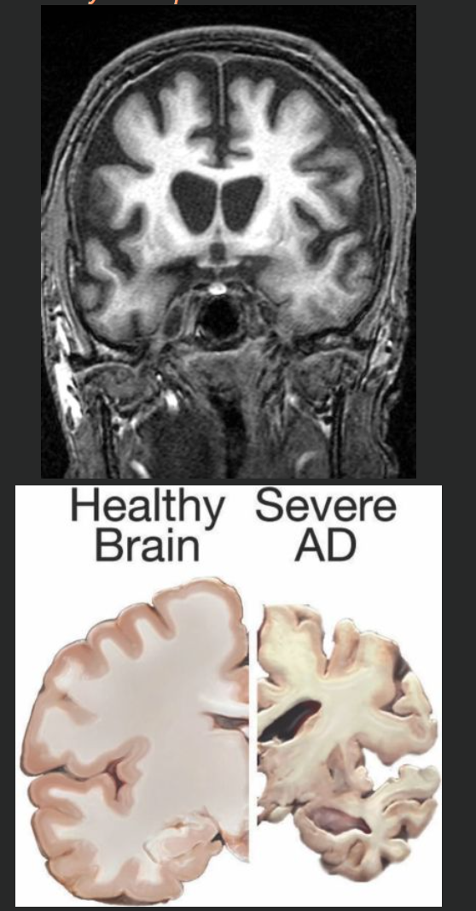
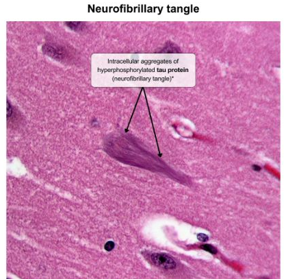
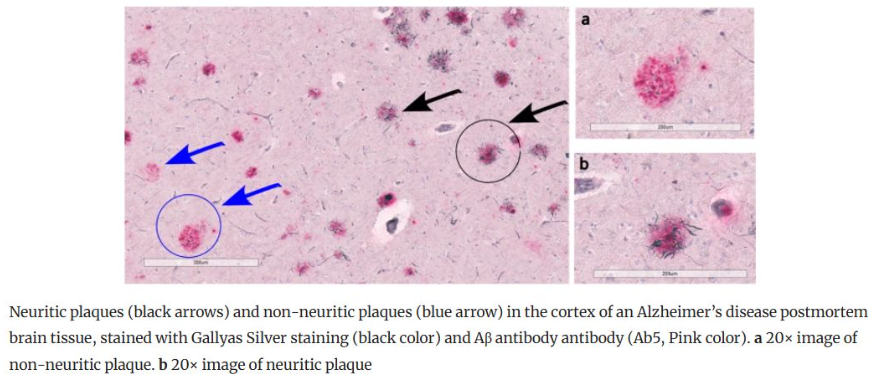
  

### Posteriorinen kortikaalinen atrofia: mikä seuraavista EI ole diagnostinen kriteeri varhaisessa tai lievässä taudissa?

- a. Normaali kliininen neurologinen status
- b. Hahmottamisvaikeus
- c. Ajan ja paikantajun häiriö
- d. Lukemisen vaikeus

  <button class="solution-button"
          data-label="Vastaus"
          data-hide-label="Piilota vastaus">
    Vastaus
  </button>
  

c

---

Alzheimerin taudin tyypillisimmät variantit ovat amnestinen (yleisin, n. 85%), posteriorinen kortikaalinen atrofia), frontaalinen ja logopeninen etenevä afasia. 

Varianttimuodoissa varhaisena oireena voi olla jokin muukin kuin muisti; esim. posteriorisessa variantissa hahmottamisen vaikeudet, frontaalisessa variantissa käytösoireet/toiminnanohjauksen vaikeudet ja logopenisessä afasiassa/etenevässä afasiassa kielellisten toimintojen ongelmat (esim. vaikeus toistaa lauseita tai nimetä esineitä).

Hahmottamisen vaikeuksien lisäksi posterioriselle variantille on tyypillistä normaali kliininen neurologinen status ja lukemisen vaikeus (johtuu vaikeudesta seurata riviä tai tunnistaa kirjaimia ja sanoja visuaalisesti, vaikka näkökyky itsessään on tallella). 
  

### Mikä seuraavista EI pidä paikkaansa Alzheimerin taudissa?

- a. Antipsykootteja voidaan käyttää oireiden hoidossa
- b. Oireenmukaista lääkehoitoa ei kannata kokeilla kaikille
- c. Lääkkeettömät hoitokeinot ovat tärkeitä sairauden hoidossa
- d. Varhaisessa vaiheessa voi kliinisestä ravintovalmisteesta (Souvenaid) olla hyötyä

  <button class="solution-button"
          data-label="Vastaus"
          data-hide-label="Piilota vastaus">
    Vastaus
  </button>
  

b

---

Alzheimerin taudin ensisijainen lääkitys eli AKE:n estäjät (esim. rivastigmiini, donepetsiili, galantamiini) aloitetaan yleensä heti, kun on diagnoosi ja lääkitystä harkitaan aina kaikille. Lääkkeet eivät paranna tai hidasta taudin etenemistä, mutta ne vähentävät oireita ja auttavat säilyttämään potilaan toimintakyvyn ja omatoimisuuden mahdollisimman pitkään -> potilas selviytyy pidempään kotona. 

Tietysti huomioidaan vasta-aiheet. Jos AKE:n estäjää ei vasta-aiheiden takia voida aloittaa ja potilaalla on lievä tauti, niin yleensä odotetaan, kunnes tila etenee keskivaikeaksi ja sitten aloitetaan memantiini (memantiinia ei käytetä lievässä taudissa). Jos potilaalla on jo AKE:n estäjä käytössä ja oireet etenevät keskivaikeiksi, niin memantiini yleensä yhdistetään AKE:n estäjän rinnalle. 

a: Dementiapotilaan käytöshäiriöiksi kutsutaan muistisairauksiin liittyviä neuropsykiatrisia oireita, joita ovat mm. potilaalle epätavanomainen käyttäytyminen, todellisuudentajun vääristyminen tai mielialaoireet. Neuropsykiatrisia oireita pitää hoitaa pääsääntöisesti silloin, kun ne rasittavat potilasta tai heikentävät kykyä huolehtia itsestä, sosiaalista vuorovaikutusta tai toimintakykyä. Hoito on aiheellista myös silloin, kun oireet aiheuttavat vaaratilanteita potilaalle itselleen tai muille, oireet vaikuttavat hoitopaikkaratkaisuun tai omaiset eivät enää niiden vuoksi jaksa hoitaa potilasta. Lääkehoidossa muistisairauslääkkeet ovat ensisijaisia lääkkeitä myös muistisairauteen liittyvien neuropsykiatristen oireiden hoidossa. Erilaisten oirekuvien yhteydessä käytetään vielä erilaisia tilanteeseen sopivia lääkkeitä: esim. psykoosilääkkeet (esim. risperidoni), masennuslääkkeet (tosin suhteellisen heikko teho yleensä, mutta aiheellinen erityisesti, jos potilaalla on ollut aiemmin depressiojaksoja; yleensä vasta jos masennus on vähintään keskivaikea, koska lievissä tiloissa teho on heikko), bentsot...

c: Totta 

d: Souvenaid on kliininen ravintolisä, joka sisältää tärkeitä ravintoaineita varhaista Alzheimerin tautia sairastaville. Tutkimusten mukaan Alzheimerin tautia sairastavien elimistössä on vähemmän esimerkiksi omega-3-rasvahappoja, tiettyjä vitamiineja, koliinia ja uridiinia kuin terveillä samanikäisillä. Näitä ravintoaineita tarvitaan muun muassa normaalin aivotoiminnan ylläpitämiseen. Souvenaid-juoma on helppo ottaa osaksi päivittäistä rutiinia; yksi pullo päivässä riittää. Souvenaidin hyödyt ovat havaittavissa 3–6 kuukauden säännöllisen käytön jälkeen. 

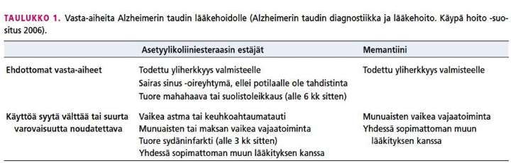

  

### Mikä seuraavista sopii parhaiten ohimolohkodementiaan?

- a. Muistivaikeudet
- b. Luonteen muutos
- c. Hahmottamisen vaikeudet
- d. Näköoireet

  <button class="solution-button"
          data-label="Vastaus"
          data-hide-label="Piilota vastaus">
    Vastaus
  </button>
  

b

---

Ohimolohkodementialla tässä tarkoitetaan todennäköisesti otsa-ohimolohkorappeumaa (FTLD), joka voidaan jakaa kahteen isoon oirekuvaluokkaan: otsalohkodementia (FTD) ja primaari etenevä afasia (kielelliset alatyypit). 

Otsalohkodementiassa oirekuva painottuu alussa käyttäytymisen ja sosiaalisen vuorovaikutuksen muutoksiin ennen muistihäiriöitä; tarkemmalta nimeltään onkin bvFTD (behavioral variant). Esim. luonnollisen estyneisyyden väheneminen, apatia, sisäänpäin kääntyneisyys, sympatian/empatian kokemisen menetys, toistuva/stereotyyppinen/pakonomainen käyttäytyminen, hyperoraalisuus (pakonomainen tarve laittaa suuhun jotakin), ruokavalion muutokset.

a: Toisin kuin Alzheimerin taudissa, FTD-potilaan lähimuisti ja orientoituminen säilyvät sairauden alkuvaiheessa hyvinä.

c: Nämä viittaavat tyypillisesti aivojen takaosien affisioitumiseen (esim. posteriorinen kortikaalinen atrofia)

d: Näköhallusinaatiot kuuluvat tyypillisimmin Lewyn kappale -tautiin
  

### Alzheimerin taudin lääkehoito: Mikä seuraavista väittämistä pitää paikkaansa?

- a. Jos yhdestä AKE-estäjästä tulee haittoja, ei kannata vaihtaa toiseen AKE-estäjään
- b. Aloitetaan pienellä annoksella ja pyritään mahdollisimman pieneen annokseen
- c. Aloitetaan pienellä annoksella ja pyritään mahdollisimman suureen annokseen
- d. Lääkehoito aloitetaan perusterveydenhuollossa heti, kun herää epäily Alzheimerin taudista

  <button class="solution-button"
          data-label="Vastaus"
          data-hide-label="Piilota vastaus">
    Vastaus
  </button>
  

c

---

Hoito aloitetaan pienellä annoksella haittojen kontrolloimiseksi ja annosta suurennetaan n. kuukauden välein. Pyritään suurimpaan siedettyyn annokseen, koska AKE:n estäjillä on annoksesta riippuvainen vaste oireiden lievittämisessä. Memantiinikin yleensä aloitetaan pienellä annoksella (n. 5mg) ja titrataan viikon välein ylöspäin (tutkittu korkein annos on 20mg (10mg x2), joka on myös tavoite). 

a: Voi olla järkevää testata toisia, sillä valmisteiden välillä on eroja sekä anto-muodoissa (esim. rivastigmiini laastarina) että lievästi myös vaikutusmekanismeissa (esim. rivastigmiini on sekä asetyyli- että butyryylikoliiniesteraasien palautumaton estäjä, kun taas donepetsiili ja galantamiini ovat reversiibeleitä AKE:n estäjiä), ja vaihto voi poistaa haitat tai parantaa vastetta. Lääkkeiden välillä ei todennäköisesti kuitenkaan ole merkittäviä kliinisiä tehoeroja AT:n pitkäkestoisessa hoidossa. 

d: Diagnoosin asettaminen ja hoidon aloittaminen kuuluu yleensä erikoislääkärin (neurologi tai geriatri) tehtäviin 
  

### Mikä seuraavista voi esiintyä yhdessä frontotemporaalidementian kanssa?

- a. Parkinsonin tauti
- b. ALS-tauti
- c. Myastenia gravis
- d. MS-tauti

  <button class="solution-button"
          data-label="Vastaus"
          data-hide-label="Piilota vastaus">
    Vastaus
  </button>
  

b

---

ALS ja otsa-ohimolohkorappeuma (FTLD) jakavat usein samoja patogeneettisiä piirteitä; erityisesti C9orf72-geenin mutaatioihin liittyen TDP-43:n kertymien aiheuttamat atrofia. 
  

### Mikä seuraavista EI ole Alzheimerin taudin tyypillinen oire?

- a. Sairaudentunnon heikkeneminen
- b. Oppimisen heikkeneminen
- c. Laskemiskyvyn heikkeneminen
- d. Näköharhat

  <button class="solution-button"
          data-label="Vastaus"
          data-hide-label="Piilota vastaus">
    Vastaus
  </button>
  

d

---

Näköharhat ovat muistisairauksista tyypillisimpiä Lewyn kappale -taudille 

a: Tämä on hyvin tyypillistä Alzheimerin taudissa. Potilas ei itse usein huomaa muistinsa ja toimintakykynsä heikkenemistä, vaan pitää itseään terveenä, vaikka läheiset olisivat hyvin huolissaan.

b: Sairaus vaurioittaa varhain hippokampusta, mikä häiritsee lähimuistia ja siten uuden tiedon tallentumista. 

c: Kognitiivisten toimintojen laaja-alainen heikkeneminen on osa tautia. Laskutehtävät vaativat työmuistia ja abstraktia päättelykykyä -> heikkenee taudin edetessä usein jo lievässä vaiheessa
  

### Mikä seuraavista EI kuulu muistisairauksien perustutkimuksiin?

- a. CERAD
- b. MRI
- c. ADCS-ADL
- d. FDG-PET

  <button class="solution-button"
          data-label="Vastaus"
          data-hide-label="Piilota vastaus">
    Vastaus
  </button>
  

d

---

FDG-PET-kuvantamista käytetään tarpeen mukaan erotusdiagnostisena jatkotutkimuksena. Esimerkiksi Alzheimerin taudissa PET-kuvantamista voidaan käyttää diagnoosin vahventamisessa, varsinkin jos potilas on nuori, tilanne on epäselvä tai hatkitaan modifoivia hoitoja

a: Muistisairauksien diagnostiikassa yleisimmin käytetty kognitiota testaava tehtäväsarja

b: Pään kuvantaminen on useimmiten osa muistisairauksien perustutkimuksia ja ensisijainen metodi on MRI 

c: Alzheimer's Disease Cooperative Study Activities of Daily Living Inventory (ADCS-ADL) -haastattelulla kartoitetaan tutkittavan päivittäistä toimintakykyä perustoiminnoissa ja välineellisissä sekä toiminnanohjausta vaativissa toiminnoissa. ADCS-ADL-haastattelulla voidaan arvioida toimintakykyä muistisairauden kaikissa vaiheissa. 
  

### Alzheimerin taudin tyypillinen ensioire?

- a. Harhat
- b. Sairaudentunnon heikentyminen
- c. Sanojen merkityksen ymmärtämisen vaikeus
- d. Uuden oppimisen ja lähimuistin heikentyminen

  <button class="solution-button"
          data-label="Vastaus"
          data-hide-label="Piilota vastaus">
    Vastaus
  </button>
  

d

---

a: Kuuluvat Lewyn kappale -taudin oireisiin

b: Hyvin yleistä Alzheimerin taudissa, mutta se seuraa usein muistioireiden alkamista tai kehittyy niiden rinnalla. Sairaudentunnottomuus ei tietystikään myöskään ole se oire, jonka takia potilas yleensä hakeutuisi vastaanotolle

c: Sanojen merkityksen ymmärtämättömyys on tyypillistä otsa-ohimolohkorappeuman semanttinen dementia -alatyypille, jolle on tyypillistä sujuva puhe, mutta se on sisällöltään tyhjää; vaikeuksia myös nimeämisessä ja ymmärtämisessä. 
  

### Mikä seuraavista on tärkein tiedonkäsittelykyvyn seulontamenetelmä muistisairauksissa?

- a. CERAD
- b. ADCS-ADL
- c. Muistikysely läheiselle
- d. MMSE

  <button class="solution-button"
          data-label="Vastaus"
          data-hide-label="Piilota vastaus">
    Vastaus
  </button>
  

a

---

CERAD on yksi yleisimmin käytetyistä kognitiivisten toimintojen arviointimenetelmistä. Se sisältää mm. MMSE, kielellisen sujuvuuden arvioinnin, kopiointitehtäviä yms. 

b: Tärkeä potilaan toimintakyvyn arvioinninssa, mutta ei käytetä suoraan kognition seulontaan

c: Välttämätön osa kokonaisarviota, mutta se ei ole objektiivinen tiedonkäsittelykyvyn testi tai seulontamenetelmä samassa mielessä kuin kognitiiviset testit

d: MMSE sisältyy CERAD:iin ja sitä käytetään edenneen dementia-asteisen muistisairauden seulontaan ja seurantaan. Testi ei kuitenkaan sovellu varhaisen tai lievän muistisairauden seulontaan.

  

### Missä sairauksissa esiintyy motoriikan vaikeutta sairauden lievässä vaiheessa?

- a. Lewyn kappale -taudissa ja Parkinsonin taudin muistisairaudessa
- b. Alzheimerin taudissa ja Lewyn kappale -taudissa
- c. Alzheimerin taudissa ja Parkinsonin taudin muistisairaudessa
- d. Otsa-ohimolohkorappeumissa ja Lewyn kappale -taudissa

  <button class="solution-button"
          data-label="Vastaus"
          data-hide-label="Piilota vastaus">
    Vastaus
  </button>
  

a

---

Molemmille on ominaista parkinsonismi. 

b ja c: Alzheimerin taudissa motoriikka säilyy tyypillisesti hyvänä taudin lievässä vaiheessa. Ongelmat ilmaantuvat yleensä vasta taudin edetessä vaikeaan vaiheeseen.

d: Tyypillisissä otsa-ohimolohkorappeumissa motoriikka on lievässä vaiheessa usein täysin normaalia, ja oireet painottuvat persoonallisuuden tai kielellisten toimintojen muutoksiin
  

### Missä taudissa EI käytetä Alzheimerin taudin lääkehoitoa?

- a. Parkinsonin taudin muistisairaudessa
- b. Lewyn kappale -taudissa
- c. Sekamuotoisessa muistisairaudessa (Alzheimerin tauti+vaskulaaridementia)
- d. Otsalohkodementiassa

  <button class="solution-button"
          data-label="Vastaus"
          data-hide-label="Piilota vastaus">
    Vastaus
  </button>
  

d

---

AKE:n estäjien tai memantiinin hyödystä ei ole näyttöä, eikä niitä tule käyttää otsa-ohimolohkorappeuman hoidossa, mutta muuta oirekuvan mukaista lääkitystä voidaan harkita (lääkehoidolla pyritään lähinnä lievittämään käytösoireita). Millään lääkkeellä ei ole virallista indikaatiota FTLD-sairauksien hoitoon ja oireenmukaisistakin lääkityksistä vähän tutkimustietoa

a ja b: Parkinsonin taudin muistisairaudessa ja Lewyn kappale -taudissa AKE:n estäjät usein hyödyttävät potilaita paljonkin. Rivastigmiini on ensisijainen ja donepetsiili toissijainen; korvattavuus kuitenkin vain jos samanaikainen Alzheimerin tauti

c: On tietysti virallisesti indikoitua hoitaa Alzheimerin tautia, vaikka sen yhteydessä olisikin vaskulaarista dementiaa (kuten usein onkin). Pelkässä vaskulaarisessakin muistisairaudessa saattaa olla hyötyä muistisairauslääkkeistä, mutta tässä tilanteessa ei olisi virallista käyttöaihetta.
  

### Missä tilanteessa Souvenaid-valmistetta suositellaan käytettäväksi?

- a. Varhaisessa vaskulaaridementiassa
- b. Varhaisessa Alzheimerin taudissa
- c. Varhaisessa Lewyn kappale -taudissa
- d. Varhaisessa Parkinsonin taudin muistisairaudessa

  <button class="solution-button"
          data-label="Vastaus"
          data-hide-label="Piilota vastaus">
    Vastaus
  </button>
  

b

---

Souvenaid on kliininen ravintolisä, joka sisältää tärkeitä ravintoaineita varhaista Alzheimerin tautia sairastaville. Tutkimusten mukaan Alzheimerin tautia sairastavien elimistössä on vähemmän esimerkiksi omega-3-rasvahappoja, tiettyjä vitamiineja, koliinia ja uridiinia kuin terveillä samanikäisillä. Näitä ravintoaineita tarvitaan muun muassa normaalin aivotoiminnan ylläpitämiseen. Souvenaid-juoma on helppo ottaa osaksi päivittäistä rutiinia; yksi pullo päivässä riittää. Souvenaidin hyödyt ovat havaittavissa 3–6 kuukauden säännöllisen käytön jälkeen. 
  

### Kuinka moni suomalainen kärsii eri tasoisista tiedonkäsittelyn ongelmista (lähimpänä tarkkaa lukua)?

- a. >500 000
- b. >300 000
- c. >900 000
- d. >100 000

  <button class="solution-button"
          data-label="Vastaus"
          data-hide-label="Piilota vastaus">
    Vastaus
  </button>
  

b

---

Tiedonkäsittelyn ongelmia kokee 5,3–16,3 % 45-vuotiaista tai sitä vanhemmista ja jopa joka kolmas yli 65-vuotiaista valkoihoisista. Suurimmalla osalla ei kuitenkaan ole kyseessä muistisairaus, sillä ohimeneviä muistivaikeuksia voivat aiheuttaa muutkin syyt, kuten esimerkiksi kiire, stressi, väsymys ja masennus. 

Suomessa on aiemmin arvioitu kansainvälisiin epidemiologisiin tutkimuksiin perustuen olevan yli 200 000 henkilöä, joilla tiedonkäsittely on lievästi heikentynyt ja Suomessa on yli 150000 henkilöä, joilla on diagnosoitu muistisairaus (Käypä Hoito 2026). 

d: Tämä olisi siis oikea vastaus, jos virallisia diagnosoituja muistisairauksia kysyttäisiin
  

### Mikä seuraavista EI ole tyypillinen oire varhaisessa otsa-ohimolohkorappeumassa?

- a. Puheen ymmärtämisen vaikeus
- b. Toiminnanohjauksen vaikeus
- c. Mieleen palauttamisen vaikeus
- d. Puheen tuottamisen vaikeus

  <button class="solution-button"
          data-label="Vastaus"
          data-hide-label="Piilota vastaus">
    Vastaus
  </button>
  

c

---

Vaikka otsa-ohimolohkorappeumat (FTLD) ovat monimuotoisia, niiden alkuvaihetta leimaavat yleensä muutokset persoonallisuudessa, käyttäytymisessä tai kielellisissä toiminnoissa, ei niinkään muistissa.

a: Semanttinen dementia (svPPA) on otsa-ohimolohkorappeumien yksi alatyypeistä, jolle on tyypillistä sujuva puhe, mutta se on sisällöltään tyhjää; vaikeuksia myös nimeämisessä ja ymmärtämisessä

b: Käyttäytymispainotteisen muodon (bvFTD) yleinen oire; potilaan on vaikea suunnitella, aloittaa tai viedä loppuun monivaiheisia tehtäviä, ja hänen kykynsä säädellä impulsseja heikkenee

d: Etenevä sujumaton afasia (NfvPPA) on otsa-ohimolohkorappeumien yksi alatyypeistä, jolle on tyypillistä työläs puheentuotto, virheet puheessa, yksinkertaiset lauserakenteet ja mahdollisesti luku- ja kirjoitusvaikeudetkin
  

### Posteriorinen kortikaalinen atrofia: tyypillinen ensioire?

- a. Vaikeudet uuden oppimisessa
- b. Vaikeudet kuullun ymmärtämisessä
- c. Vaikeudet puheen tuottamisessa
- d. Vaikeudet nähdyn hahmottamisessa

  <button class="solution-button"
          data-label="Vastaus"
          data-hide-label="Piilota vastaus">
    Vastaus
  </button>
  

d

---

Kyseessä on Alzheimerin taudin epätyypillinen variantti. Posterioriselle kortikaaliselle atrofialle on nimensä mukaisesti tyypillistä, että aivoatrofia paikantuu aivokuoren taka-alueille, ja se on usein voimakkaampaa oikeassa aivopuoliskossa. 

Kognitiivisessa oirekuvassa korostuu visuospatiaalisen ja -konstruktiivisen hahmottamisen vaikeudet sekä agnostiset (aivot eivät kykene tunnistamaan tai tulkitsemaan kohteita, kasvoja, ääniä tai hajuja) vaikeudet. Visuaalisen hahmottamisen häiriöt voivat olla poikkeuksellisen vaikea-asteiset verrattuna muuhun oirekuvaan. Myöhemmin oirekuvaan ilmaantuu usein apraksiaa, lukemisen, kirjoittamisen ja laskemisen erityishäiriöitä. Muistitoiminnot säilyvät yleensä alkuvaiheessa selvästi paremmin kuin perinteisessä taudin muodossa.

  

### Milloin tulisi epäillä otsalohkodementiaa?

- a. Kun potilaalla esiintyy erinäisiä näköhäiriöitä
- b. Kun iäkkään potilaan uuden oppiminen on heikentynyt
- c. Kun potilas eksyy tutussa ympäristössä
- d. Kun iäkkäällä potilaalla esiintyy ensimmäisen kerran psykiatrista oireilua

  <button class="solution-button"
          data-label="Vastaus"
          data-hide-label="Piilota vastaus">
    Vastaus
  </button>
  

d

---

Otsalohkodementian (bvFTD) ensioireet muistuttavat usein psykiatrisia sairauksia. Potilas voi vaikuttaa masentuneelta (apatia, vetäytyminen) tai maanisuuteen taipuvaiselta (estottomuus, impulsiivisuus, harkintakyvyn puute). Muistitestit voivat hämäävästi olla alkuvaiheessa normaalit. 

a: Viittaavat muistisairauksista Lewyn kappale -tautiin

b: Erityisesti Alzheimerin taudin tyyppioire

c: Eksyminen ja paikantajun häiriöt liittyvät tyypillisesti Alzheimerin tautiin
  

## Päänsärky 

### Mikä on päänsärkypotilaan tutkimuksen kulmakivi?

- a. Niska-hartiaseudun palpointi
- b. Yleisstatus
- c. Anamneesi
- d. Pään TT

  <button class="solution-button"
          data-label="Vastaus"
          data-hide-label="Piilota vastaus">
    Vastaus
  </button>
  

c

---

Hyvä anamneesi paljastaa mm. säryn laadun, kehittymisnopeuden, sijainnin, keston, liitännäisoireet sekä särkyä pahentavat ja helpottavat tekijät. Näiden perusteella pystyy yleensä erottamaan vaarattomat primaaripäänsäryt vaarallisista sekundaarisista syistä.

  

### Mikä seuraavista ei ole tensionaaliselle päänsärylle tyypillinen oire?

- a. Vihlova päänsärky
- b. Toispuoleinen päänsärky
- c. Pantamainen päänsärky
- d. Puristava päänsärky

  <button class="solution-button"
          data-label="Vastaus"
          data-hide-label="Piilota vastaus">
    Vastaus
  </button>
  

b

---

Jännityspäänsärky on tyypillisesti bilateraalinen (alkuun voi tuntua enemmän toisella puolella) ja useimmiten sitä kuvataan pantamaiseksi puristavaksi kivuksi. Siihen liittyy usein repäiseviä, viiltäviä kipuja päässä. Päänahka tuntuu kireältä.

Jännityspäänsärky on yleisin päänsäryn syy ja sisältää sekä lihasjännityksestä johtuvat että henkisestä jännittyneisyydestä johtuvat päänsäryt; voi siis esiintyä ilman merkittävää lihaskireyttä. Mekanismi käytännössä tuntematon; ei olla päästy yksimielisyyteen siitä, missä määrin särky johtuu puhtaasti lihasten jännityksestä ja kuinka paljon mukana on aivoperäisiä tekijöitä tai psykogeenistä jännitystä. 

  

### Kuinka monta kohtausta vaaditaan aurattoman migreenin diagnoosiin?

- a. 3
- b. 2
- c. 5
- d. 7

  <button class="solution-button"
          data-label="Vastaus"
          data-hide-label="Piilota vastaus">
    Vastaus
  </button>
  

c

---

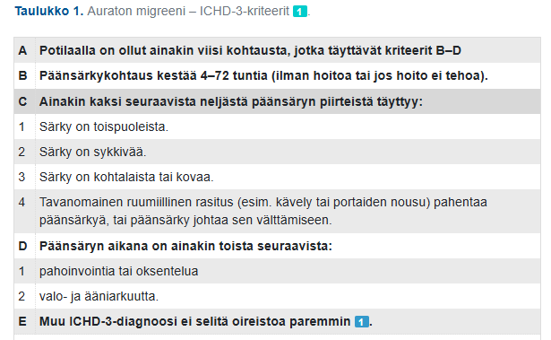
  

### Migreenipotilaiden diagnostiikka ja hoito tapahtuu

- a. Erikoissairaanhoidossa
- b. Perusterveydenhuollossa

  <button class="solution-button"
          data-label="Vastaus"
          data-hide-label="Piilota vastaus">
    Vastaus
  </button>
  

b

---

Neurologin konsultaatiota tarvitaan, jos on kyseessä vaikeahoitoinen tai epäselvä tapaus 
  

### Diagnosoit potilaalla terveyskeskuksessa trigeminusneuralgian. Mitä aloitat ensisijaisesti lääkehoidoksi?

- a. Natriumvalpoaatti annosta vasteen mukaan nostaen
- b. Tulehduskipulääke esim. ibuprofeeni/ketoprofeeni isolla annoksella
- c. Karbamatsepiini annosta vasteen mukaan nostaen
- d. Indometasiini kuuriluontoisesti 50 mg kahdesti päivässä

  <button class="solution-button"
          data-label="Vastaus"
          data-hide-label="Piilota vastaus">
    Vastaus
  </button>
  

c

---

Trigeminusneuralgian diagnoosi ja lääkealoitus voidaan tehdä perusterveydenhuollossa. Karbamatsepiinin aloitusannos on yleensä 100 mg × 2. Sitä nostetaan tarpeen mukaan tasolle 1 200 mg/vrk. Alussa on hyvä seurata verenkuvaa ja maksaentsyymejä. Karbamatsepiinin pitoisuusmäärityksiä voi tehdä epäiltäessä yliannostelua (huimaus, väsymys, kaksoiskuvat, nystagmus). Muutaman kk:n oireettomuuden jälkeen lääkityksen purku

Karbamatsepiinin vaihtoehtona – erityisesti, jos siitä tulee haittavaikutuksia (väsymys, huimaus) tai kun on tarvetta välttää sen interaktioita muiden lääkkeiden kanssa – on okskarbatsepiini (ei kuulu erityiskorvattavuuden piiriin). Toisen linjan lääkkeenä esim. lamotrigiini rinnalle tai vaihdetaan tilalle, jos ensisijaiset lääkkeet eivät tehoa. Jos tilanne on hoitoresistentti ja/tai on todettu oireinen, aivojen MK:ssa näkyvä neurovaskulaarinen kompressio, potilas saatetaan lähettää neurokirurgian klinikkaan arvioon. Tavallisesti tarvitaan ensin neurologin arvio tilanteesta.

---

Trigeminusneuralgia eli kolmoishermosärky on yhden tai useamman haaran alueelle paikantuva erittäin kovina lyhytkestoisina kiputuikkauksina esiintyvä kiputila, joka voi olla välillä pitkäänkin oireeton. Potilas saa äkisti toistuvia, toispuoleisia lyhytaikaisia sähköiskumaisia kipuja tavallisesti n. maxillariksen tai n. mandibulariksen alueelle eli ylä- alaleuan alueelle (harvoin V1 eli n. ophtalmicuksen alueella ja aiheuttaa kipua otsassa ja silmän ympärillä)

Kipujakso kestää yhdestä sekunnista n. 2 min:iin ja se voi toistua lukuisia kertoja päivän mittaan. Oireilu voi kestää viikkoja tai kuukausia. Kipu on yleensä erittäin voimakas estäen pahimmillaan mm. syömisen. Pitkäkestoista kasvokipua esiintyy lyhytkestoisten kipusävähdysten lisäksi n. 25–50 %:lla potilaista. Se tuntuu samalla alueella kuin lyhyet kipusävähdykset. Kivun luonne on esim. polttavaa tai sykkivää.

Diagnoosi on kliininen ja perustuu anamneesiin sekä kliiniseen tutkimukseen.

  

### Lievän-kohtalaisen migreenikohtauksen kohtauslääkkeenä

- a. Ensisijainen lääke on opiaattiryhmän analgeetti (esim. kodeiini/tramadoli)
- b. Ensisijainen lääke on tavallinen kipulääke (esim. ibuprofeeni/parasetamoli/ketoprofeeni)
- c. Ensisijainen lääke on pahoinvointilääke (metoklopramidi/proklooriperatsiini)
- d. Ensisijainen lääke on triptaani (esim. sumatriptaani/eletriptaani/frovatriptaani).

  <button class="solution-button"
          data-label="Vastaus"
          data-hide-label="Piilota vastaus">
    Vastaus
  </button>
  

b

---

Iso osa lievistä kohtauksista voidaan hoitaa ilman lääkkeitä tai suositellulla särkylääkeannoksella. Lääkehoitoa suositellaan, jos kohtaukset tyypillisesti heikentävät toimintakykyä. Lääke suositellaan otettavaksi jo lievässä kipuvaiheessa. 

Ensimmäisiksi lääkehoitokokeiluiksi ehdotetaan tulehduskipulääkkeitä ja/tai parasetamolia joko metoklopramidin kanssa tai ilman. Mikäli tulehduskipulääkkeitä tai parasetamolia käyttämällä ei saavuteta hoitovastetta 2 tunnin kuluessa tai jos kipu palaa nopeasti, suositellaan seuraavien kohtausten hoitoon triptaaneja.

a: Opioideja ei tulisi käyttää migreenin hoidossa
  

### 35-vuotiaalla miehellä on alkanut pari viikkoa sitten oikean silmän seudun poraavat, erittäin kovat kipukohtaukset, jotka kestävät noin tunnin kerrallaan. Potilas kertoo heräävänsä lähes joka yö kovaan kipuun. Oikean silmän seudun kipukohtaus on nyt yöllä päivystyksessä parhaillaan päällä ja neurologisessa statuksessa havaitset potilaan oikeasta silmästä valuvan kyyneleitä, oikea sidekalvo verestää ja oikealla on ptoosi. Muuten neurologinen status on normaali. Potilas on rauhattoman ja kivuliaan oloinen ja ravaa odotushuoneessa levottomana edestakaisin. Mitä epäilet ja miten tutkit ja hoidat potilaan?

- a. Epäilen Hornerin syndroomaa => määrään parasetamolia 100:0mg i.v. ja määrään tehtäväksi pään TT+ pään ja kaulasuonten TT-angiografiatutkimuksen
- b. Epäilen silmäperäistä syytä taustalla, mahdollisesti avokulmaglaukoomakohtaus => määrään parasetamolia 100:0 mg i.v. ja teen päivystyslähetteen silmälääkärille arvioon
- c. Kyseessä on migreenikohtaus => määrään potilaalle ibuprofeenia 800:mg p.o ja metoklopramidia
- d. Kyseessä on sarjoittainen päänsärky => määrään potilaalle 100: %:sen hapen hengitystä sammakkomaskilla 15-20 min, virtaus 7-10 l/min

  <button class="solution-button"
          data-label="Vastaus"
          data-hide-label="Piilota vastaus">
    Vastaus
  </button>
  

d

---

Sarjoittaisen päänsäryn (Hortonin neuralgia) oireena on voimakas, toispuoleinen päänsärky (yleensä silmän takana polttavana) ja erotuksena migreenistä siihen liittyy lähes aina levottomuus eli kävely helpottaa, eikä pahenna särkyä. Autonomiset oireet, kuten silmän verestys, kyynelvuoto, nenän tukkoisuus ovat yleisiä. Kohtaukset kestävät 15–180 minuuttia ja voivat toistua useita kertoja päivässä; usein tiettyyn vuodenaikaan tai vuodenajan muutoksiin liittyen.

Yleensä vain sumatriptaani-injektio ja happihengitys (100 % happi, 12–15 l/min, maskin kautta; tehoaa 70–80 %:lla) auttavat kohtauksen hoitoon. Kohtauksien estohoitona käytetään yleensä verapamiilia (kalsiumkanavan salpaaja, ensisijainen vaihtoehto), litiumia (jos verapamiili ei tehoa) tai topiramaattia (epilepsialääke, joskus käytetään lisälääkkeenä). Estohoidon siltahoitona käytetään usein prednisoni 60-100mg/vrk 5vrk:n ajan ja sen jälkeen hidas purku; ns. rauhoittaa tilannetta nopeasti. 

  

### Mikä seuraavista ei ole tyypillistä Hortonin neuralgialle:

- a. Kipu on toispuoleista
- b. Kipu on invalidisoivaa
- c. Kipu lievittyy liikkeessä
- d. Kipu lievittyy levossa

  <button class="solution-button"
          data-label="Vastaus"
          data-hide-label="Piilota vastaus">
    Vastaus
  </button>
  

d

---

Sarjoittaisen päänsäryn (Hortonin neuralgia) oireena on voimakas, toispuoleinen päänsärky (yleensä silmän takana polttavana) ja erotuksena migreenistä siihen liittyy lähes aina levottomuus eli kävely helpottaa, eikä pahenna särkyä. 

Autonomiset oireet, kuten silmän verestys, kyynelvuoto, nenän tukkoisuus ovat yleisiä. Kohtaukset kestävät 15–180 minuuttia ja voivat toistua useita kertoja päivässä; usein tiettyyn vuodenaikaan tai vuodenajan muutoksiin liittyen.

b:Sarjoittaisen päänsäryn kipukohtaukset ovat tyypillisesti erittäin vaikeita, jonka takia sairaus tunnetaan myös nimellä itsemurhapäänsäryt (suicide headaches); itsemurha oireyhtymän kivuista johtuen on kuitenkin harvinaista, mutta itsemurhan ajatukset kivuista johtuen ovat yleisiä
  

### Mikä seuraavista väittämistä on totta?

- a. Neuroradiologinen kuvantaminen on syytä tehdä kaikille potilaille, joilla on ollut migreeniaura
- b. Migreenin diagnoosi perustuu anamneesiin, neurologiseen statukseen ja päänsäryn loppumiseen triptaanin oton jälkeen
- c. Migreenin diagnoosin voi asettaa vain neurologi tai neurologian yksikössä työskentelevä lääkäri tai yleislääkäri, jos ensin on konsultoitu neurologia
- d. Neuroradiologinen kuvantaminen ei ole aiheellista tyypillisessä migreenissä potilaalla, jonka neurologinen status on normaali

  <button class="solution-button"
          data-label="Vastaus"
          data-hide-label="Piilota vastaus">
    Vastaus
  </button>
  

d

---

Migreenin diagnostiikka perustuu pääasiassa anamneesiin ja kuvaukseen oireista. Neurologinen status on normaali. Diagnostiikka ja hoito kuuluu pääasiassa perusterveydenhuoltoon.  
  

### Migreenin estohoidossa

- a. Lääkehoidon kesto on vähintään 2-3 vuotta
- b. Lääkehoidon kesto on vähintään 2-3 viikkoa
- c. Lääkehoidon kesto arvioidaan yksilöllisesti, mutta sen ei tule ylittää 12 kuukautta
- d. Lääkehoidon kesto on vähintään 2-3 kuukautta

  <button class="solution-button"
          data-label="Vastaus"
          data-hide-label="Piilota vastaus">
    Vastaus
  </button>
  

d

---

Hoidon pituus pitää arvioida yksilöllisesti, mutta estolääkityksen tehoa ja sietoa arvioidaan 2–3 kuukauden kuluttua sen aloituksesta. Sen jälkeen mietitään, miten jatketaan. Episodisessa migreenissä hoitotaukoa voidaan harkita 3–6 kuukauden kuluttua hoitotasapainon saavuttamisesta. Kroonisessa tai vaikeahoitoisessa migreenissä hoitotaukoa suositellaan vastaavasti 12–18 kuukauden kuluttua. Tauon aikana seurataan migreenin taajuutta, joka jossain tapauksissa lisääntyy jo 2–4 kuukauden tauon aikana. Näissä tilanteissa estolääke aloitetaan uudestaan
  

### 50-vuotiaalla naisella on ollut parin viikon ajan sähköiskumaisia, lyhyitä teräviä kipuja vasemmalla puolen kasvoja posken seudussa. Välillä kivut ovat poissa, mutta esimerkiksi hampaiden pesu ja posken kosketus laukaisevat kipuja. Mitä epäilet anamneesin perusteella potilaallasi?

- a. Sarjoittainen päänsärky
- b. Migreeni
- c. Trigeminusneuralgia
- d. Tensionaalinen päänsärky

  <button class="solution-button"
          data-label="Vastaus"
          data-hide-label="Piilota vastaus">
    Vastaus
  </button>
  

c

---

Trigeminusneuralgia eli kolmoishermosärky on yhden tai useamman haaran alueelle paikantuva erittäin kovina lyhytkestoisina kiputuikkauksina esiintyvä kiputila, joka voi olla välillä pitkäänkin oireeton. Potilas saa äkisti toistuvia, toispuoleisia lyhytaikaisia sähköiskumaisia kipuja tavallisesti n. maxillariksen tai n. mandibulariksen alueelle eli ylä- alaleuan alueelle (harvoin V1 eli n. ophtalmicuksen alueella ja aiheuttaa kipua otsassa ja silmän ympärillä). Laukaisevana tekijänä on usein alueen koskeminen, syöminen, hampaiden harjaaminen yms. 

Kipujakso kestää yhdestä sekunnista n. 2 min:iin ja se voi toistua lukuisia kertoja päivän mittaan. Oireilu voi kestää viikkoja tai kuukausia. Kipu on yleensä erittäin voimakas estäen pahimmillaan mm. syömisen. Pitkäkestoista kasvokipua esiintyy lyhytkestoisten kipusävähdysten lisäksi n. 25–50 %:lla potilaista. Se tuntuu samalla alueella kuin lyhyet kipusävähdykset. Kivun luonne on esim. polttavaa tai sykkivää.

Diagnoosi on kliininen ja perustuu anamneesiin sekä kliiniseen tutkimukseen.

  

### Mikä seuraavista EI ole sekundaarisen päänsäryn aiheuttaja?

- a. Sinuiitti
- b. CNS-infektio
- c. Niska- hartiaseudun lihasjännitys
- d. Alkoholin vieroitusoireet

  <button class="solution-button"
          data-label="Vastaus"
          data-hide-label="Piilota vastaus">
    Vastaus
  </button>
  

c

---

Primaariset päänsärkysairaudet voidaan pääasiassa jakaa neljään luokkaan: Tensio- eli jännityspäänsärky, Migreeni, Sarjoittainen päänsärky (Hortonin neuralgia, cluster headache) ja muut kolmoishermon autonomiset päänsäryt, Muut primaariset päänsäryt. Yleisin näistä on jännityspäänsärky eli tension neck; arviolta 40–75 % aikuisista ihmisistä kokee ainakin kerran elämässään jännityspäänsärkyä

a, b, d: Nämä ovat sekundaarisia syitä

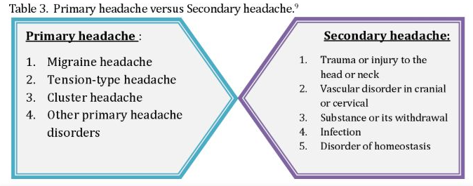
  

### Migreenidiagnoosiin tarvitaan:

- a. Pään MRI
- b. Huolellinen anamneesi ja status
- c. Pään TT
- d. Neurologian esh:n konsultaatio

  <button class="solution-button"
          data-label="Vastaus"
          data-hide-label="Piilota vastaus">
    Vastaus
  </button>
  

b

---

Yleisesti päänsärkyjen diagnostiikassa huolellinen anamneesi on tärkein työkalu. Statuksella usein poissuljetaan sekundaarisia päänsäryn syitä.  
  

### Mikä seuraavista on hyvä ensisijainen migreenin estolääkevaihtoehto nuorelle potilaalle?

- a. Metoprololi
- b. Venlafaksiini
- c. Kandesartaani
- d. Verapamiili

  <button class="solution-button"
          data-label="Vastaus"
          data-hide-label="Piilota vastaus">
    Vastaus
  </button>
  

c

---

Migreenien estolääkityksenä on tällä hetkellä käytössä: 

<li>Beetasalpaajat</li>
<li>Angiotensiinireseptorin salpaajat</li>
<li>Tietyt masennuslääkkeet (trisykliset ja harvoin SNRI)</li>
<li>Epilepsialääkkeet (topiramaatti tai valproaatti)</li>
<li>CGRP-estäjät (niin monoklonaaliset vasta-aineet kuin pienimolekulaariset gepantit)</li>
<li>Kroonisen migreenin estohoidossa mahdollisesti onabotuliinitoksiini A</li>

---

Perusterveydenhuollossa yleisimmin aloitettavat migreenin estohoitolääkevaihtoehdot ovat beetasalpaaja (esim. propranoloni), angiotensiinireseptorin salpaaja (esim. kandesartaani) tai masennuslääke (esim. trisyklinen). Ensimmäiset estolääkekokeilut tulisi aloittaa perusterveydenhuollossa. 

a: Beetasalpaajat voivat aiheuttaa haittavaikutuksena fyysisen suorituskyvyn heikkenemistä (syke ei nouse urheillessa) -> ei useimmiten paras urheilullisilla nuorilla 

b: SNRI-lääkkeitä ei käytetä yhtä yleisesti kuin trisyklisiä masennuslääkkeitä tai beetasalpaajia tai angiotensiinireseptorin salpaajia

d: Käytetään ensisijaisesti sarjoittaisen päänsäryn (Hortonin neuralgian) estoon

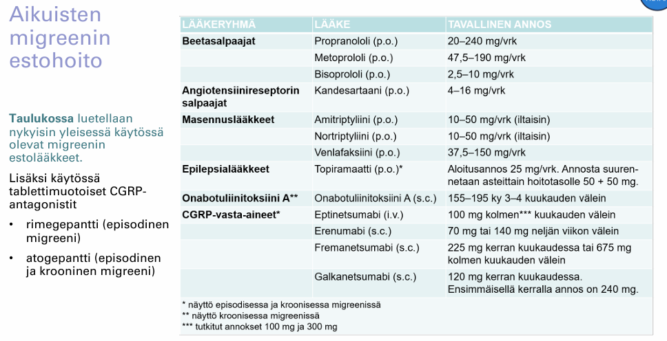
  

### Migreenisäryssä

- a. Päänsärky alkaa äkisti räjähtävän kovana
- b. Liikunta helpottaa särkyä
- c. Liikunta pahentaa särkyä
- d. Päänsärky on puristavaa

  <button class="solution-button"
          data-label="Vastaus"
          data-hide-label="Piilota vastaus">
    Vastaus
  </button>
  

c

---

Se, että liikunta pahentaa särkyä, on osa diagnostisia kriteerejäkin. 

a: Viittaa vaaralliseen sekundaariseen syyhyn ja erityisesti subaraknoidaalivuotoon 

b: Esim. tensiopäänsärky helpottaa liikunnan myötä

d: Tensiopäänsärky on tyypillisesti puristavaa. Migreeniä kuvaillaan yleensä sykkivänä

  

### Mikä seuraavista on migreenin estohoidon aihe?

- a. Kohtauksia esiintyy 4-5 päivänä/kk
- b. 5 kertaa esiintynyt migreenikohtaus
- c. NSAID+metoklopramidi ei tuo tarvittavaa helpotusta kohtauksiin
- d. Migreenikohtausta edeltää auraoire

  <button class="solution-button"
          data-label="Vastaus"
          data-hide-label="Piilota vastaus">
    Vastaus
  </button>
  

c

---

Estolääkityksen aloittamiselle ei ole mitään tarkkaa rajaa ja usein hoitoa mietitään, kun kohtausket häiritsevät potilasta ja potilas sitoutuisi estohoitoon. Esim. jo 2 tai 3 migreenipäivää kuukaudessa voi olla aihe tai jos migreeni hankaloittaa jokapäiväistä elämää. Migreenin kroonistumisriski kasvaa, jos kohtauksia on jatkuvasti 4 tai enemmän kuukaudessa -> yleensä viimeistään tässä vaiheessa. 
  

### Terveyskeskuksessa päivystysvastaanotollesi tulee 30-vuotias nainen, jolla on alkanut vähitellen voimistunut, toispuoleinen jyskyttävä päänsärky, johon liittyy valonarkuutta ja pahoinvoivaa oloa. Potilas kertoo, että rasitus pahentaa päänsärkyä. Neurologinen status on normaali. Mikä on todennäköisin diagnoosi?

- a. Migreenikohtaus
- b. Subaraknoidaalivuoto
- c. Tensionaalinen päänsärky
- d. Sarjoittainen päänsärky

  <button class="solution-button"
          data-label="Vastaus"
          data-hide-label="Piilota vastaus">
    Vastaus
  </button>
  

a

---

Potilas kuvaa tyypillistä migreenikohtausta 

b: SAV alkaisi äkillisesti ja saavuttaisi huippuvoimakkuutensa räjähdysmäisesti 

c: Ei yleensä toispuolista tai jyskyttävää. Rasitus/liikunta yleensä lieventää päänsärkyä. Liitännäisoireita kuten foto- tai fonofobiaan tai pahoinvointia voi esiintyä (ei saa esiintyä oksentelua), mutta vain yksi tällainen liitännäisoire voi esiintyä kerrallaan, jotta voidaan päänsäryn sanoa olevan puhtaasti jännityspäänsärkyä. Migreenille taas on tyypillistä, että esiintyy pahoinvointia/oksentelua ja valo- ja ääniarkuutta samaan aikaan

d: Tämä särky on huomattavasti rajumpaa (poraavaa), kestoltaan lyhyempää (15–180 min) ja siihen liittyy tyypillisesti autonomisia oireita (silmän kyynelehtiminen, nuhanenä), joita tässä tapauksessa ei kuvattu
  

### Mikä seuraavista ei ole migreenipäänsäryn tyypillinen ominaispiirre?

- a. Särky on sykkivää
- b. Toispuoleinen sijainti
- c. Särky on kohtalaista tai kovaa
- d. Särky on puristavaa

  <button class="solution-button"
          data-label="Vastaus"
          data-hide-label="Piilota vastaus">
    Vastaus
  </button>
  

d

---

Puristava särky useimmiten viittaa tensiopäänsärkyyn. Muut vaihtoehdot kuvailevat tyypillistä migreenipäänsärkyä

  

### Mitä seuraavista ei tyypillisesti käytetä migreenin estohoidossa?

- a. SSRI-lääkkeet
- b. Beetasalpaajat
- c. Trisykliset masennuslääkkeet
- d. ATR-salpaajat

  <button class="solution-button"
          data-label="Vastaus"
          data-hide-label="Piilota vastaus">
    Vastaus
  </button>
  

a

---

Migreenien estolääkityksenä on tällä hetkellä käytössä: 

<li>Beetasalpaajat</li>
<li>Angiotensiinireseptorin salpaajat</li>
<li>Tietyt masennuslääkkeet (trisykliset ja harvoin SNRI)</li>
<li>Epilepsialääkkeet (topiramaatti tai valproaatti)</li>
<li>CGRP-estäjät (niin monoklonaaliset vasta-aineet kuin pienimolekulaariset gepantit)</li>
<li>Kroonisen migreenin estohoidossa mahdollisesti onabotuliinitoksiini A</li>

  

### Mikä seuraavista EI yleensä kuulu päänsärkypotilaan statukseen?

- a. Niska-hartiaseudun tutkiminen
- b. Verenpaineen mittaaminen
- c. Hampaiden, purennan ja leukanivelen tutkiminen
- d. Kuulon tutkiminen

  <button class="solution-button"
          data-label="Vastaus"
          data-hide-label="Piilota vastaus">
    Vastaus
  </button>
  

d

---

Kuulo-oireet eivät liity tyypillisiin päänsärkysairauksiin

a: Lihasjännitysten, palpaatioarkuuksien ja liikerajoitusten arviointi auttaa tunnistamaan mm. jännityspäänsäryn 

b: Kuuluu rutiinitutkimuksiin. Vaikka lievästi kohonnut verenpaine ei yleensä aiheuta päänsärkyä, erittäin korkea verenpaine (hypertensiivinen kriisi) voi olla säryn suora syy. Lisäksi verenpainetaso vaikuttaa estolääkityksen valintaan.

c: Purentaelimistön kipu ja toimintahäiriöt (temporomandibular disorders, TMD) ovat yleinen syy päänsärylle 

  

### Tensionaalisessa päänsäryssä on tyypillistä

- a. Puristava, vannemainen päänsärky
- b. Liikunta pahentaa päänsärkyä
- c. Päänsäryn lisäksi pyörittävä huimaus
- d. Päänsäryn lisäksi pahoinvointi ja oksentelu

  <button class="solution-button"
          data-label="Vastaus"
          data-hide-label="Piilota vastaus">
    Vastaus
  </button>
  

a

---

Särky on yleensä molemminpuolista, painavaa ja tasaista

b: Tämä on migreenin piirre. Jännityspäänsärky ei yleensä pahene tavallisessa fyysisessä rasituksessa ja kevyt liikunta ulkoilmassa yleensä helpottaa oireita.

c: Jännityspäänsärkyyn voi liittyä niskaperäistä huimausta, jolle on tyypillistä proprioseptiikan häiriö. Proprioseptisen informaation häiriössä huimaus on yleensä keinuttavaa (”laivankansimaista”) tai heittävää huimausta. Kyseessä ei ole yleensä karusellimainen pyörittävä vertigo. 

d: Liitännäisoireita kuten foto- tai fonofobiaan tai pahoinvointia voi esiintyä jännityspäänsäryssäkin, mutta oksentelua ei sinänsä saisi esiinty ja vain yksi tällainen liitännäisoire voi esiintyä kerrallaan, jotta voidaan päänsäryn sanoa olevan puhtaasti jännityspäänsärkyä. Migreenille taas on tyypillistä, että esiintyy pahoinvointia/oksentelua ja valo- ja ääniarkuutta samaan aikaan

  

### Missä seuraavista tapauksista potilas tulee lähettää perusterveydenhuollosta jatkotutkimuksiin päivystyksellisesti

- a. Jos päänsärky on alkanut äkisti ponnistustilanteessa
- b. Jos päänsärkyyn liittyy työkykyongelma
- c. Jos päänsärkyyn liittyy kuumetta
- d. Jos päänsärky on jatkunut pari viikkoa eikä NSAID-lääkkeet auta

  <button class="solution-button"
          data-label="Vastaus"
          data-hide-label="Piilota vastaus">
    Vastaus
  </button>
  

a

---

Tämä on punaisen lipun oire (voi muistaa S2NOOP4 tai SNNOOP10). 

c: Kuumeinen päänsärky on todella yleistä (esim. flunssa yms). Kuitenkin kuumeinen päänsärkypotilas kannattaa tutkia tarkasti, sillä esim. keskushermostoinfektioon viittaavat löydökset tulee poissulkea. 
  

### Aurallisen migreenin diagnostisiin kriteereihin kuuluu, että

- a. Potilaalla on ollut vähintään kaksi kohtausta, joissa on ollut yli 5 minuutin kestoiset auraoireet
- b. Potilaalla on ollut vähintään kaksi kohtausta, joissa on ollut yli 15 minuutin kestoiset auraoireet
- c. Potilaalla on ollut vähintään viisi kohtausta, joissa on ollut yli 5 minuutin kestoiset auraoireet
- d. Potilaalla on ollut vähintään kaksi kohtausta, joissa on ollut yli 60 minuutin kestoiset auraoireet

  <button class="solution-button"
          data-label="Vastaus"
          data-hide-label="Piilota vastaus">
    Vastaus
  </button>
  

a

---

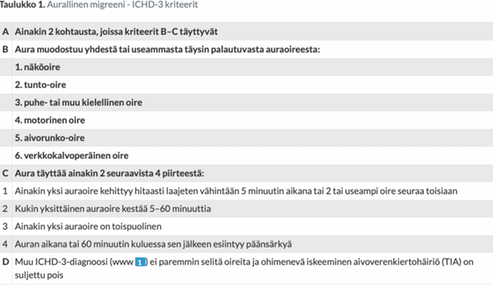
  

### Mikä seuraavista EI ole vaarallisen päänsäryn merkki?

- a. Kipu maksimissaan alle 1 minuutissa
- b. Ensimmäinen ja elämän kovin päänsärky
- c. Päänsärkyyn liittyy yleisoireita tai löydöksiä
- d. Sahalaitanäköhäiriö päänsärkyä edeltävästi

  <button class="solution-button"
          data-label="Vastaus"
          data-hide-label="Piilota vastaus">
    Vastaus
  </button>
  

d

---

Viittaa migreeniin. Muut ovat vaarallisia piirteitä (voi muistaa S2NOOP4 tai SNNOOP10)

  

### Mitä seuraavista ei pitäisi löytyä tensionaalisesta päänsärystä kärsivällä potilaalla?

- a. Matala mieliala
- b. Perikraniaalisten lihasten palpaatioarkuus
- c. Niska-hartiaseudun lihaskireys
- d. Toispuoleisesti heikentynyt tuntoaisti

  <button class="solution-button"
          data-label="Vastaus"
          data-hide-label="Piilota vastaus">
    Vastaus
  </button>
  

d

---

Merkittävä neurologinen puutosoire -> päänsäryn red flag 

a: Jännityspäänsärky ja mielialaoireet kulkevat usein käsi kädessä. Pitkittynyt särky voi laskea mielialaa, ja toisaalta psyykkinen kuormitus on yksi merkittävimmistä jännityspäänsäryn laukaisevista tekijöistä.

b: Yleinen statuslöydös jännityspäänsäryssä 

c: Yleinen statuslöydös jännityspäänsäryssä
  

### Mikä seuraavista väittämistä on totta?

- a. Triptaani on vasta-aiheinen potilaalla, joka on sairastanut aivoinfarktin
- b. Triptaanin kanssa samanaikaisesti ei saa ottaa NSAID valmistetta
- c. Triptaani suositellaan ottamaan mahdollisimman nopeasti auraoireen alettua
- d. Jos yksi triptaanivalmiste ei auta, on todennäköistä, ettei toisestakaan triptaanista ole apua

  <button class="solution-button"
          data-label="Vastaus"
          data-hide-label="Piilota vastaus">
    Vastaus
  </button>
  

a

---

Triptaanit ovat vasta-aiheisia potilailla, joilla on iskeeminen sydänsairaus (sepelvaltimotauti, aikaisempi sydäninfarkti, Prinzmetalin angina), hallitsematon hypertonia tai ollut aivoverenkiertohäiriöitä, koska aiheuttavat vasokonstriktiota ja vasospasmeja. 

b: Otetaan aika useinkin NSAID:n kanssa 

c: Kipulääkitys kannattaa ottaa migreenissä heti kivun alettua; auraoireita ei hoideta

d: Triptaanivalmisteiden (esim. sumatriptaani, tsolmitriptaani yms) välillä on yksilöllisiä eroja tehon ja haittojen suhteen
  

### 40-vuotiaalla miehellä on alkanut muutama tunti aiemmin kova päänsärky. Päivystyksessä kuumetta 39 astetta, statuksessa toteat niskajäykkyyttä ja huomaat potilaalla punoittavaa ihottumaa. Mitä epäilet?

- a. Subduraalivuoto
- b. Bakteerimeningiitti
- c. Subaraknoidaalivuoto
- d. Herpesenkefaliitti

  <button class="solution-button"
          data-label="Vastaus"
          data-hide-label="Piilota vastaus">
    Vastaus
  </button>
  

b

---

Korkea kuume (39°C), niskajäykkyys ja nopeasti alkanut särky ovat meningiitin ja varsinkin bakteerimeningiitin ydinoireita (virusmeningiitti on yleensä lieväoireisempi ja ei aiheuta niin nopeasti kehitttyvää oirekuvaa; jos tajunnantaso on vielä alentunut (ei tässä nyt mainittu), niin kyseessä ei ole virusmeningiitti, vaan tulee ensisijaisesti miettiä bakteerimeningiittiä). Punoittava ihottuma (petekkiat eli pienet verenpurkaumat iholla) viittaa vahvasti meningokokki-bakteerin aiheuttamaan sepsikseen ja meningiittiin. 

a: Usein hitaammin etenevä (krooninen) tai traumaan liittyvä (akuutti) verenpurkauma aivokalvojen väliin. Siihen ei tyypillisesti liity korkeaa kuumetta tai ihottumaa.

c: SAV alkaa räjähdysmäisellä särkykohtauksella ja siihen voi liittyä niskajäykkyyttä (verisärsytyksen vuoksi), mutta se ei selitä 39 asteen kuumetta eikä ihottumaa

d: Herpesviruksen aiheuttama enkefaliitti kyllä aiheuttaa kuumetta ja päänsärkyä, mutta sille on tyypillisempää sekavuus, kouristelu ja tajunnan häiriöt kuin niskajäykkyys ja petekkiat.
  

### Migreenin auraoireelle on tyypillistä, että

- a. Aura koostuu osin korjaantuvista näkö-, tunto-, puhe- tai kielellisistä oireista
- b. Usein kaksi tai useampi oire seuraa toisiaan
- c. Auraoire voi esiintyä tunteja tai päiviä ennen päänsärkykohtausta
- d. Potilas ei aina muista auraoireen aikaisia tapahtumia

  <button class="solution-button"
          data-label="Vastaus"
          data-hide-label="Piilota vastaus">
    Vastaus
  </button>
  

b

---

a: Korjaantuvat täysin 

c: Tunteja tai päiviä ennen alkavat oireet (kuten haukottelu, makeanhimo tai väsymys) ovat ennakoivia oireita (prodromaalivaihe). Varsinainen auraoire alkaa tyypillisesti 5–60 minuuttia ennen päänsärkyä.

d: Migreeniauraan ei kuulu tajunnan häiriötä tai muistinmenetystä.

  

### Mikä seuraavista lääkkeistä ei kuulu migreenikohtauksen akuuttihoitoon?

- a. Naprokseeni
- b. Eletriptaani
- c. Panacod
- d. Ritsatriptaani

  <button class="solution-button"
          data-label="Vastaus"
          data-hide-label="Piilota vastaus">
    Vastaus
  </button>
  

c

---

Opioideja ei käytetä migreenikohtausten hoitoon. Ensisijaisia lääkkeitä ovat NSAIDit, parasetamoli ja triptaanit

a: NSAID 

b ja d: Triptaaneja
  

### Särkylääkepäänsäryn riski kasvaa

- a. Jos potilas käyttää opioidivalmisteita
- b. Jos potilaalla on käytössä migreenin estohoitolääkitys
- c. Jos potilas käyttää tulehduskipulääkkeitä yli 10 päivänä kuukaudessa
- d. Jos potilas käyttää triptaaneja yli 5 päivänä kuukaudessa

  <button class="solution-button"
          data-label="Vastaus"
          data-hide-label="Piilota vastaus">
    Vastaus
  </button>
  

a

---

Opioidit ovat usein tehottomia kohtauksen katkaisemisessa, aiheuttavat usein pahoinvointia ja lisäävät merkittävästi riskiä krooniseen särkylääkepäänsärkyyn.

b: Estolääkityksen tarkoitus on juuri vähentää kohtausten määrää ja siten kohtauslääkkeiden käyttöä -> vähentää särkylääkepäänsäryn riskiä 

c ja d: Lääkepäänsäryn riski on koholla, jos todetaan särkylääkkeiden liikakäyttöä. Liikakäyttö on kyseessä, jos käyttää: 

<li>Triptaaneja 10 tai useampana päivänä kuukaudessa</li>
<li>NSAIDeja 15 tai useampana päivänä kuukaudessa</li>
<li>Parasetamolia 15 tai useampana päivänä kuukaudessa</li>

  

### Mikä on migreenin tärkein erotusdiagnostinen sairaus?

- a. Glaukooma
- b. Sarjoittainen päänsärky
- c. Tensionaalinen päänsärky
- d. Trigeminusneuralgia

  <button class="solution-button"
          data-label="Vastaus"
          data-hide-label="Piilota vastaus">
    Vastaus
  </button>
  

c

---

Tensionaalinen päänsärky on yleinen primaarinen päänsärky ja migreeni on toiseksi yleisin. Ne voidaan erottaa toisistaan ensisijaisesti anamneesin perusteella. 

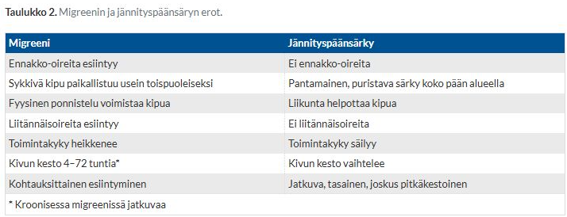
  

### Miten tensionaalista päänsärkyä ensisijaisesti hoidetaan?

- a. Säännöllisellä bentsodiatsepiinilääkityksellä
- b. Fysioterapialla
- c. Pitkillä kipulääkekuureilla
- d. Panacod-kuurilla

  <button class="solution-button"
          data-label="Vastaus"
          data-hide-label="Piilota vastaus">
    Vastaus
  </button>
  

b

---

Jännitys- eli tensiopäänsärky sisältää sekä lihasjännityksestä johtuvat että henkisestä jännittyneisyydestä johtuvat päänsäryt. Ensisijainen hoito on liikunta, lihashuolto ja rentoutus + tarvittaessa lyhytaikainen hoito NSAID tai parasetamolilla. 

  

### Migreenin estohoidossa yleisimmin aloitetaan

- a. Ensimmäiseksi estolääkkeeksi natriumvalproaatti/topiramaatti
- b. Ensimmäiseksi estolääkkeeksi CGRP-reseptoriantagonisti tai monoklonaalinen vasta-aine
- c. Ensimmäiseksi estolääkkeeksi botuliinitoksiini-injektiot
- d. Ensimmäiseksi estolääkkeeksi beetasalpaaja/trisyklinen masennuslääke

  <button class="solution-button"
          data-label="Vastaus"
          data-hide-label="Piilota vastaus">
    Vastaus
  </button>
  

d

---

Tosin useimmiten ehkä näitäkin ennen ATR-salpaaja; riippuu potilaasta 

  

### Migreenin estohoidon

- a. Aloitusta edeltävästi on suositeltavaa tehdä aivojen magneettikuvaus
- b. Hyvänä hoitovasteena pidetään sitä, että kohtausten esiintyvyys tai voimakkuus pienenee 50% aiemmasta
- c. Aloitus kuuluu erikoissairaanhoitoon
- d. Aloituksen tarpeellisuudesta on suositeltavaa konsultoida neurologia

  <button class="solution-button"
          data-label="Vastaus"
          data-hide-label="Piilota vastaus">
    Vastaus
  </button>
  

b

---

Hoidon tavoitteena on, että kuukausittaiset migreenipäivät vähenevät 50 %. Vastetta arvioidaan potilaan täyttämän päänsärkypäiväkirjan avulla, johon on hyvä merkitä erikseen migreenipäivät, mahdolliset muut päänsärkypäivät ja kohtauslääkkeiden käyttö sekä altistavat tekijät. Vaste arvioidaan n. 3kk kohdalla

a, c ja d: Estohoito aloitetaan perusterveydenhuollossa anamneesin perusteella

  

### Miten toimin TMD (temporomandibular disorders) potilaan kanssa?

- a. Lähetän fysioterapiaan
- b. Konsultoin neurologia
- c. Konsultoin korvalääkäriä
- d. Konsultoin hammaslääkäriä

  <button class="solution-button"
          data-label="Vastaus"
          data-hide-label="Piilota vastaus">
    Vastaus
  </button>
  

d

---

Purentaelimistön kipu ja toimintahäiriöt (temporomandibular disorders, TMD) on yhteisnimitys leukanivelten, puremalihasten, hampaiston ja niihin läheisesti liittyvien kudosten sairaus- ja kiputiloille sekä toimintahäiriöille. TMD:n tavallisimpia oireita ovat leukanivelten tai puremalihasten kipu, leukaniveläänet, leukojen väsyminen ja jäykkyys, suun rajoittunut avautuminen ja alaleuan liikehäiriöt. Muita oireita ovat muun muassa päänsärky, kasvokipu ja korvakipu.

TMD:n hoidon ennuste on yleensä hyvä. Potilaan informoiminen, omahoito-ohjeiden antaminen, alaleuan liikeharjoitusten ohjeistaminen ja fysioterapeuttiset hoidot sekä tarvittaessa kipulääkkeet ja purentakiskon valmistaminen ovat suositeltavia ensi vaiheen hoitomuotoja. Hyvän ja tasapainoisen purentatoiminnan saavuttamiseksi purennan tasapainotus ja proteettiset tai oikomishoitotoimenpiteet saattavat tulla kysymykseen hoidon myöhemmässä vaiheessa
  

